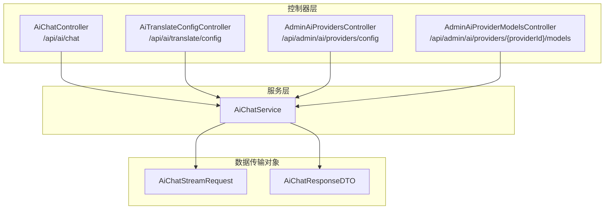
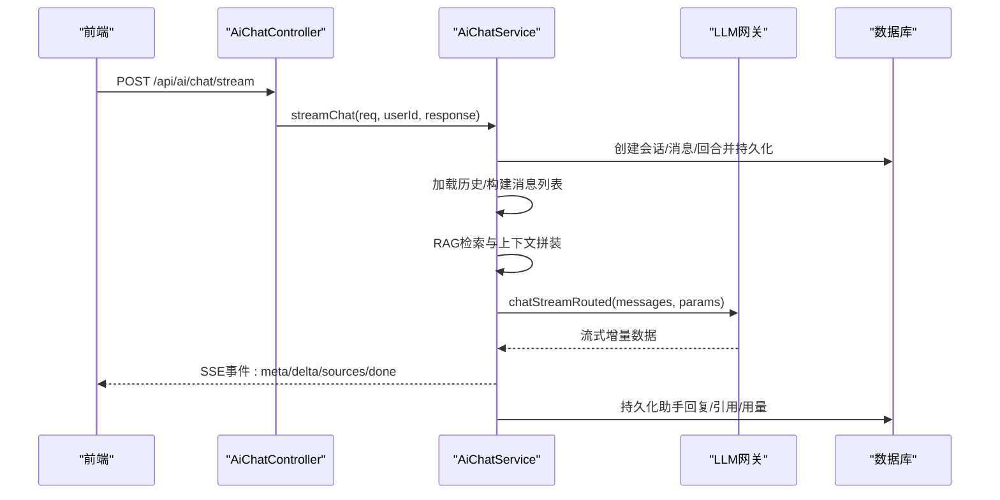
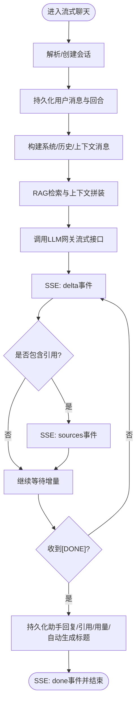
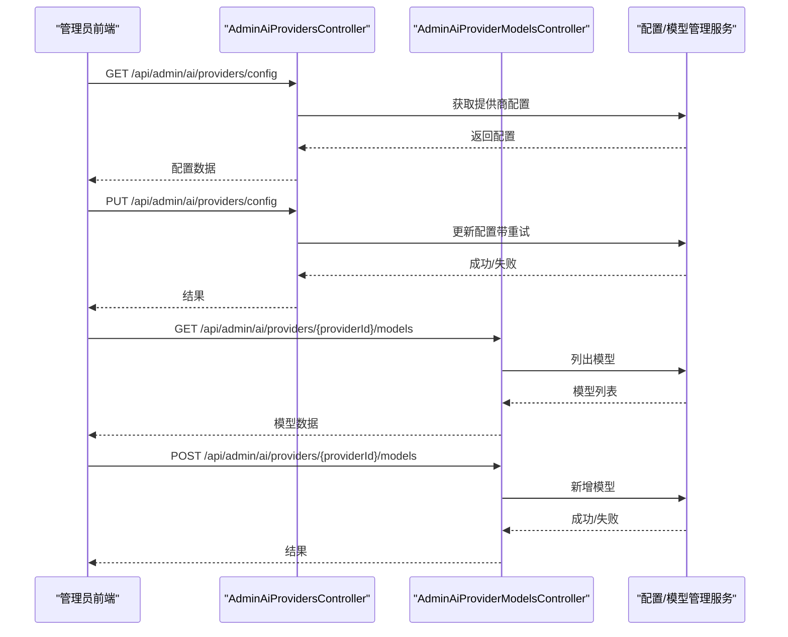
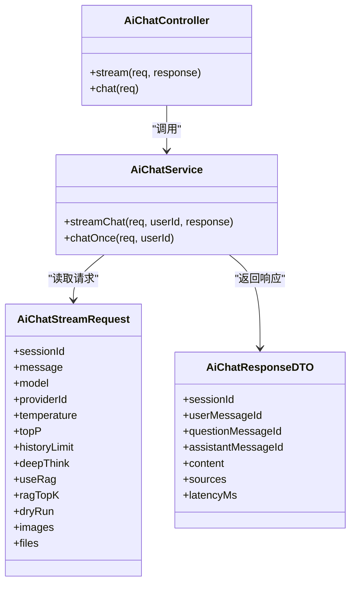

# AI服务API

<cite>
**本文引用的文件**
- [AiChatController.java](file://src/main/java/com/example/EnterpriseRagCommunity/controller/ai/AiChatController.java)
- [AiChatService.java](file://src/main/java/com/example/EnterpriseRagCommunity/service/ai/AiChatService.java)
- [AiChatStreamRequest.java](file://src/main/java/com/example/EnterpriseRagCommunity/dto/ai/AiChatStreamRequest.java)
- [AiChatResponseDTO.java](file://src/main/java/com/example/EnterpriseRagCommunity/dto/ai/AiChatResponseDTO.java)
- [AiTranslateConfigController.java](file://src/main/java/com/example/EnterpriseRagCommunity/controller/ai/AiTranslateConfigController.java)
- [AdminAiProvidersController.java](file://src/main/java/com/example/EnterpriseRagCommunity/controller/ai/admin/AdminAiProvidersController.java)
- [AdminAiProviderModelsController.java](file://src/main/java/com/example/EnterpriseRagCommunity/controller/ai/admin/AdminAiProviderModelsController.java)
</cite>

## 目录
1. [引言](#引言)
2. [项目结构](#项目结构)
3. [核心组件](#核心组件)
4. [架构总览](#架构总览)
5. [详细组件分析](#详细组件分析)
6. [依赖分析](#依赖分析)
7. [性能考虑](#性能考虑)
8. [故障排查指南](#故障排查指南)
9. [结论](#结论)
10. [附录](#附录)

## 引言
本文件面向企业级AI服务API，聚焦聊天机器人、内容生成、翻译、语言检测、分词器等核心能力，覆盖实时对话（SSE）、流式响应、批量处理、模型选择、路由配置、上下文管理、成本计算与性能监控等技术细节，并提供AI服务配置、模型管理、价格策略、负载均衡等管理API的完整规范，以及限流策略、错误重试、降级处理与监控指标建议。

## 项目结构
本项目采用后端分层架构：控制器层负责HTTP接口与请求校验；服务层封装业务逻辑（如聊天、RAG检索、上下文治理、计费统计）；数据传输对象（DTO）定义请求/响应契约；管理员端控制器提供模型与提供商配置管理。

图表来源
- [AiChatController.java:17-47](file://src/main/java/com/example/EnterpriseRagCommunity/controller/ai/AiChatController.java#L17-L47)
- [AiTranslateConfigController.java:10-21](file://src/main/java/com/example/EnterpriseRagCommunity/controller/ai/AiTranslateConfigController.java#L10-L21)
- [AdminAiProvidersController.java:19-58](file://src/main/java/com/example/EnterpriseRagCommunity/controller/ai/admin/AdminAiProvidersController.java#L19-L58)
- [AdminAiProviderModelsController.java:23-75](file://src/main/java/com/example/EnterpriseRagCommunity/controller/ai/admin/AdminAiProviderModelsController.java#L23-L75)
- [AiChatService.java:81-122](file://src/main/java/com/example/EnterpriseRagCommunity/service/ai/AiChatService.java#L81-L122)
- [AiChatStreamRequest.java:17-82](file://src/main/java/com/example/EnterpriseRagCommunity/dto/ai/AiChatStreamRequest.java#L17-L82)
- [AiChatResponseDTO.java:7-27](file://src/main/java/com/example/EnterpriseRagCommunity/dto/ai/AiChatResponseDTO.java#L7-L27)

章节来源
- [AiChatController.java:17-47](file://src/main/java/com/example/EnterpriseRagCommunity/controller/ai/AiChatController.java#L17-L47)
- [AiChatService.java:81-122](file://src/main/java/com/example/EnterpriseRagCommunity/service/ai/AiChatService.java#L81-L122)
- [AiChatStreamRequest.java:17-82](file://src/main/java/com/example/EnterpriseRagCommunity/dto/ai/AiChatStreamRequest.java#L17-L82)
- [AiChatResponseDTO.java:7-27](file://src/main/java/com/example/EnterpriseRagCommunity/dto/ai/AiChatResponseDTO.java#L7-L27)
- [AiTranslateConfigController.java:10-21](file://src/main/java/com/example/EnterpriseRagCommunity/controller/ai/AiTranslateConfigController.java#L10-L21)
- [AdminAiProvidersController.java:19-58](file://src/main/java/com/example/EnterpriseRagCommunity/controller/ai/admin/AdminAiProvidersController.java#L19-L58)
- [AdminAiProviderModelsController.java:23-75](file://src/main/java/com/example/EnterpriseRagCommunity/controller/ai/admin/AdminAiProviderModelsController.java#L23-L75)

## 核心组件
- 聊天控制器与服务
  - 控制器：提供POST /api/ai/chat/stream（SSE流式）与POST /api/ai/chat（一次性响应）两个端点，统一鉴权与用户ID解析。
  - 服务：实现会话管理、历史上下文加载、RAG检索与增强、多模态消息构造、流式输出、引用标注、持久化与延迟统计、成本估算等。
- 请求/响应DTO
  - 请求：AiChatStreamRequest定义消息、会话ID、模型/提供商覆盖、采样参数、历史限制、是否启用RAG/深思、TopK、干跑、图片/文件输入等。
  - 响应：AiChatResponseDTO返回会话/消息ID、内容、引用源列表、耗时等。
- 翻译配置控制器
  - 提供GET /api/ai/translate/config公开翻译配置。
- 管理员配置控制器
  - 提供提供商配置读取/更新与模型管理（增删、上游模型预览）等。

章节来源
- [AiChatController.java:25-35](file://src/main/java/com/example/EnterpriseRagCommunity/controller/ai/AiChatController.java#L25-L35)
- [AiChatService.java:123-604](file://src/main/java/com/example/EnterpriseRagCommunity/service/ai/AiChatService.java#L123-L604)
- [AiChatStreamRequest.java:17-82](file://src/main/java/com/example/EnterpriseRagCommunity/dto/ai/AiChatStreamRequest.java#L17-L82)
- [AiChatResponseDTO.java:7-27](file://src/main/java/com/example/EnterpriseRagCommunity/dto/ai/AiChatResponseDTO.java#L7-L27)
- [AiTranslateConfigController.java:17-20](file://src/main/java/com/example/EnterpriseRagCommunity/controller/ai/AiTranslateConfigController.java#L17-L20)
- [AdminAiProvidersController.java:28-57](file://src/main/java/com/example/EnterpriseRagCommunity/controller/ai/admin/AdminAiProvidersController.java#L28-L57)
- [AdminAiProviderModelsController.java:31-74](file://src/main/java/com/example/EnterpriseRagCommunity/controller/ai/admin/AdminAiProviderModelsController.java#L31-L74)

## 架构总览
AI服务整体由“控制器—服务—网关/客户端—存储”构成。聊天服务通过LLM网关进行路由与流式调用，结合RAG检索与上下文治理，最终将增量内容以SSE事件推送至前端。

图表来源
- [AiChatController.java:25-29](file://src/main/java/com/example/EnterpriseRagCommunity/controller/ai/AiChatController.java#L25-L29)
- [AiChatService.java:123-604](file://src/main/java/com/example/EnterpriseRagCommunity/service/ai/AiChatService.java#L123-L604)

## 详细组件分析

### 聊天API（实时对话与流式响应）
- 端点
  - POST /api/ai/chat/stream（SSE）：流式返回增量内容，事件类型包括meta（会话/消息ID）、delta（增量文本）、sources（引用源）、done（结束与耗时）。
  - POST /api/ai/chat：一次性返回完整回答与引用源。
- 关键参数（请求体AiChatStreamRequest）
  - sessionId：可选，为空则新建会话
  - message：必填用户消息
  - model/providerId：可选覆盖，默认使用门户配置
  - temperature/topP：可选采样参数
  - historyLimit：可选历史消息条数
  - deepThink：是否启用深思模式（系统提示、温度策略）
  - useRag/ragTopK：是否启用RAG及TopK
  - dryRun：是否仅推理不落库
  - images/files：多模态输入（图片/文件）
- 上下文与RAG
  - 历史消息按historyLimit倒序加载并注入到messages
  - 可选混合检索（BM25/向量/重排）与评论增强聚合
  - 上下文裁剪与引用格式化，支持调试事件输出
- 流式输出
  - SSE事件：meta（含sessionId/userMessageId）、delta（增量内容）、sources（最多200条）、done（含latencyMs）
  - 支持深思模式的<think>…</think>包裹
- 成本与延迟
  - 记录回合首token延迟与总延迟
  - 使用TokenCountService估算输入/输出token并持久化
- 错误处理
  - 数据持久化失败发送error事件并结束
  - 网关异常捕获并返回error事件

图表来源
- [AiChatService.java:123-604](file://src/main/java/com/example/EnterpriseRagCommunity/service/ai/AiChatService.java#L123-L604)

章节来源
- [AiChatController.java:25-35](file://src/main/java/com/example/EnterpriseRagCommunity/controller/ai/AiChatController.java#L25-L35)
- [AiChatService.java:123-604](file://src/main/java/com/example/EnterpriseRagCommunity/service/ai/AiChatService.java#L123-L604)
- [AiChatStreamRequest.java:17-82](file://src/main/java/com/example/EnterpriseRagCommunity/dto/ai/AiChatStreamRequest.java#L17-L82)
- [AiChatResponseDTO.java:7-27](file://src/main/java/com/example/EnterpriseRagCommunity/dto/ai/AiChatResponseDTO.java#L7-L27)

### 内容生成与翻译API
- 翻译配置
  - GET /api/ai/translate/config：返回公开翻译配置DTO，便于前端展示可用语言/策略等。
- 翻译执行
  - 仓库中存在翻译相关控制器与服务（例如AiContentTranslateController、translateService），但未在上述片段中出现具体实现细节。建议在实际部署中确保：
    - 翻译服务具备明确的入参（源语言、目标语言、文本）与出参（翻译结果、耗时、token用量）
    - 支持批量翻译与流式输出（如需）
    - 与模型路由/限流策略集成

章节来源
- [AiTranslateConfigController.java:17-20](file://src/main/java/com/example/EnterpriseRagCommunity/controller/ai/AiTranslateConfigController.java#L17-L20)

### 语言检测与分词器API
- 语言检测
  - 仓库中存在AiPostLangLabelController与langLabel相关服务，建议提供：
    - POST /api/ai/lang-label：输入文本，返回语言标签与置信度
    - 支持批量检测与缓存策略
- 分词器
  - 项目包含AiTokenizerController与tokenizer相关配置，建议提供：
    - POST /api/ai/tokenizer：输入文本与模型标识，返回token序列与计数
    - 支持多模型适配与上下文截断策略

章节来源
- [AiChatService.java:81-122](file://src/main/java/com/example/EnterpriseRagCommunity/service/ai/AiChatService.java#L81-L122)

### 管理API（模型与提供商配置）
- 提供商配置
  - GET /api/admin/ai/providers/config：读取管理员可见的提供商配置
  - PUT /api/admin/ai/providers/config：更新提供商配置（带乐观锁与重试）
- 模型管理
  - GET /api/admin/ai/providers/{providerId}/models：列出指定提供商的模型
  - POST /api/admin/ai/providers/{providerId}/models：新增模型（可指定用途与模型名）
  - DELETE /api/admin/ai/providers/{providerId}/models：删除模型（按用途与模型名）
  - GET /api/admin/ai/providers/{providerId}/upstream-models：拉取上游模型清单
  - POST /api/admin/ai/providers/upstream-models/preview：预览上游模型映射
- 权限控制
  - 读写分离：读取需要特定权限，写入需要更高权限
  - 跨域白名单：允许本地开发环境访问

图表来源
- [AdminAiProvidersController.java:28-57](file://src/main/java/com/example/EnterpriseRagCommunity/controller/ai/admin/AdminAiProvidersController.java#L28-L57)
- [AdminAiProviderModelsController.java:31-74](file://src/main/java/com/example/EnterpriseRagCommunity/controller/ai/admin/AdminAiProviderModelsController.java#L31-L74)

章节来源
- [AdminAiProvidersController.java:28-57](file://src/main/java/com/example/EnterpriseRagCommunity/controller/ai/admin/AdminAiProvidersController.java#L28-L57)
- [AdminAiProviderModelsController.java:31-74](file://src/main/java/com/example/EnterpriseRagCommunity/controller/ai/admin/AdminAiProviderModelsController.java#L31-L74)

## 依赖分析
- 控制器依赖服务：AiChatController依赖AiChatService；翻译与管理员控制器分别依赖对应服务。
- 服务内部依赖：AiChatService依赖LLM网关、RAG检索服务、上下文治理、计费统计、数据库仓储等。
- DTO契约：AiChatStreamRequest与AiChatResponseDTO作为前后端契约，约束字段与默认值。

图表来源
- [AiChatController.java:22-23](file://src/main/java/com/example/EnterpriseRagCommunity/controller/ai/AiChatController.java#L22-L23)
- [AiChatService.java:89-115](file://src/main/java/com/example/EnterpriseRagCommunity/service/ai/AiChatService.java#L89-L115)
- [AiChatStreamRequest.java:17-82](file://src/main/java/com/example/EnterpriseRagCommunity/dto/ai/AiChatStreamRequest.java#L17-L82)
- [AiChatResponseDTO.java:7-27](file://src/main/java/com/example/EnterpriseRagCommunity/dto/ai/AiChatResponseDTO.java#L7-L27)

章节来源
- [AiChatController.java:22-23](file://src/main/java/com/example/EnterpriseRagCommunity/controller/ai/AiChatController.java#L22-L23)
- [AiChatService.java:89-115](file://src/main/java/com/example/EnterpriseRagCommunity/service/ai/AiChatService.java#L89-L115)
- [AiChatStreamRequest.java:17-82](file://src/main/java/com/example/EnterpriseRagCommunity/dto/ai/AiChatStreamRequest.java#L17-L82)
- [AiChatResponseDTO.java:7-27](file://src/main/java/com/example/EnterpriseRagCommunity/dto/ai/AiChatResponseDTO.java#L7-L27)

## 性能考虑
- 流式传输
  - 使用SSE与text/event-stream，避免长连接阻塞；设置Cache-Control与X-Accel-Buffering以适配反向代理。
- 上下文与RAG
  - 合理设置historyLimit与RAG TopK，避免超大上下文导致延迟与成本上升；必要时启用上下文裁剪与采样日志。
- 计费与成本
  - 基于TokenCountService估算输入/输出token，结合模型定价策略计算成本；对高频会话进行节流与预算控制。
- 并发与队列
  - 对LLM调用进行队列化与并发限制，避免上游限流触发级联失败；为不同任务类型（如多模态聊天）设置独立队列。
- 缓存与预热
  - 对常用模型/提供商进行预热；对翻译/语言检测结果进行短期缓存。

## 故障排查指南
- 未登录或会话过期
  - 控制器在解析用户ID失败时抛出认证异常；请检查前端登录状态与安全上下文。
- 数据持久化失败
  - 服务在持久化用户消息/回合时异常，会发送error事件并结束SSE；检查数据库连接与事务一致性。
- 网关调用异常
  - LLM网关异常被捕获并转换为error事件；检查上游提供商可用性与凭据配置。
- RAG检索异常
  - RAG阶段异常会被记录并跳过，不影响主流程；检查向量化/索引与重排模型配置。
- SSE客户端问题
  - 确保客户端正确处理meta/delta/sources/done事件；对<think>包裹内容进行兼容显示。

章节来源
- [AiChatController.java:37-46](file://src/main/java/com/example/EnterpriseRagCommunity/controller/ai/AiChatController.java#L37-L46)
- [AiChatService.java:177-186](file://src/main/java/com/example/EnterpriseRagCommunity/service/ai/AiChatService.java#L177-L186)
- [AiChatService.java:361-363](file://src/main/java/com/example/EnterpriseRagCommunity/service/ai/AiChatService.java#L361-L363)
- [AiChatService.java:592-597](file://src/main/java/com/example/EnterpriseRagCommunity/service/ai/AiChatService.java#L592-L597)

## 结论
本AI服务API围绕“聊天—RAG—流式输出—成本与治理”形成闭环，提供实时对话、上下文管理、引用溯源与可观测性。通过管理员端的提供商与模型配置能力，实现灵活的路由与负载均衡。建议在生产环境中完善限流、重试、降级与监控策略，确保稳定性与成本可控。

## 附录
- API端点一览
  - 实时对话
    - POST /api/ai/chat/stream（SSE）
    - POST /api/ai/chat（一次性）
  - 翻译
    - GET /api/ai/translate/config（公开配置）
  - 管理
    - GET/PUT /api/admin/ai/providers/config
    - GET/POST/DELETE /api/admin/ai/providers/{providerId}/models
    - GET /api/admin/ai/providers/{providerId}/upstream-models
    - POST /api/admin/ai/providers/upstream-models/preview
- 关键参数与默认值
  - AiChatStreamRequest：message必填；historyLimit默认20；deepThink默认false；useRag默认true；temperature/topP按门户配置；providerId/model按门户配置；dryRun默认false；images/files可选。
- 监控指标建议
  - 延迟：首token延迟、总延迟、RAG检索延迟
  - 成本：输入/输出token计数、模型单价、会话总费用
  - 可用性：SSE连接数、错误率、重试次数、上游成功率
  - 资源：内存、CPU、并发队列长度、缓存命中率