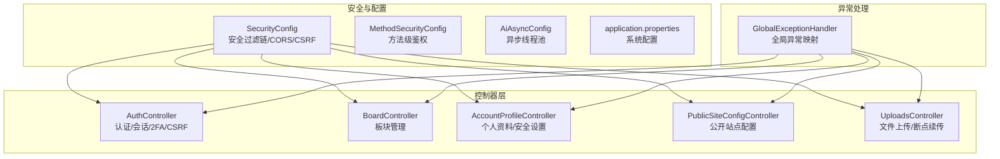
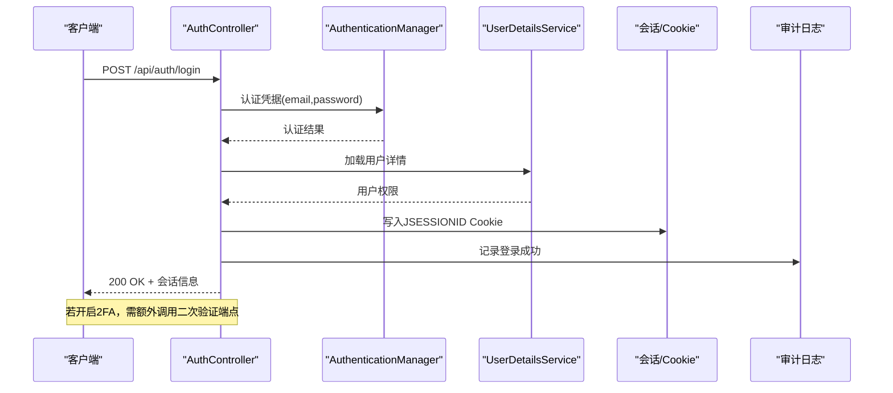
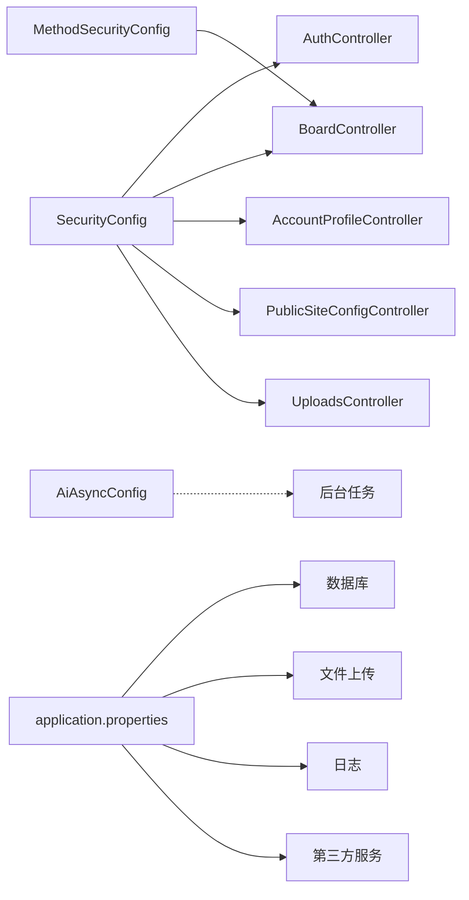

# API参考

<cite>
**本文引用的文件**
- [SecurityConfig.java](file://src/main/java/com/example/EnterpriseRagCommunity/config/SecurityConfig.java)
- [MethodSecurityConfig.java](file://src/main/java/com/example/EnterpriseRagCommunity/config/MethodSecurityConfig.java)
- [AiAsyncConfig.java](file://src/main/java/com/example/EnterpriseRagCommunity/config/AiAsyncConfig.java)
- [application.properties](file://src/main/resources/application.properties)
- [AuthController.java](file://src/main/java/com/example/EnterpriseRagCommunity/controller/AuthController.java)
- [BoardController.java](file://src/main/java/com/example/EnterpriseRagCommunity/controller/BoardController.java)
- [AccountProfileController.java](file://src/main/java/com/example/EnterpriseRagCommunity/controller/AccountProfileController.java)
- [PublicSiteConfigController.java](file://src/main/java/com/example/EnterpriseRagCommunity/controller/PublicSiteConfigController.java)
- [UploadsController.java](file://src/main/java/com/example/EnterpriseRagCommunity/controller/UploadsController.java)
- [GlobalExceptionHandler.java](file://src/main/java/com/example/EnterpriseRagCommunity/controller/GlobalExceptionHandler.java)
</cite>

## 目录
1. [简介](#简介)
2. [项目结构](#项目结构)
3. [核心组件](#核心组件)
4. [架构总览](#架构总览)
5. [详细组件分析](#详细组件分析)
6. [依赖分析](#依赖分析)
7. [性能考虑](#性能考虑)
8. [故障排查指南](#故障排查指南)
9. [结论](#结论)
10. [附录](#附录)

## 简介
本API参考文档面向企业级RAG社区平台的RESTful接口，覆盖认证与授权、内容板块、个人账户、公共配置、文件上传等核心能力。文档详细说明每个端点的HTTP方法、URL路径、请求参数、响应格式、状态码、认证与请求头要求、参数校验规则、错误处理策略，并提供常见使用场景的请求/响应示例路径。同时说明API版本控制策略与向后兼容性保障。

## 项目结构
后端采用Spring Boot，控制器位于controller包下，安全配置集中在config包，全局异常处理由GlobalExceptionHandler统一接管。应用通过application.properties集中配置数据库、文件上传、日志与第三方服务参数。

图表来源
- [SecurityConfig.java:74-194](file://src/main/java/com/example/EnterpriseRagCommunity/config/SecurityConfig.java#L74-L194)
- [AuthController.java:78-206](file://src/main/java/com/example/EnterpriseRagCommunity/controller/AuthController.java#L78-L206)
- [BoardController.java:22-72](file://src/main/java/com/example/EnterpriseRagCommunity/controller/BoardController.java#L22-L72)
- [AccountProfileController.java:61-127](file://src/main/java/com/example/EnterpriseRagCommunity/controller/AccountProfileController.java#L61-L127)
- [PublicSiteConfigController.java:10-39](file://src/main/java/com/example/EnterpriseRagCommunity/controller/PublicSiteConfigController.java#L10-L39)
- [UploadsController.java:16-73](file://src/main/java/com/example/EnterpriseRagCommunity/controller/UploadsController.java#L16-L73)
- [GlobalExceptionHandler.java:27-177](file://src/main/java/com/example/EnterpriseRagCommunity/controller/GlobalExceptionHandler.java#L27-L177)

章节来源
- [SecurityConfig.java:74-194](file://src/main/java/com/example/EnterpriseRagCommunity/config/SecurityConfig.java#L74-L194)
- [application.properties:1-84](file://src/main/resources/application.properties#L1-L84)

## 核心组件
- 安全过滤链：仅对/api/**生效，集成CORS、CSRF、会话与RBAC鉴权；放行部分公开端点与初始化端点。
- 方法级安全：启用@PreAuthorize等注解，结合权限常量进行细粒度授权。
- 异步执行器：为AI任务与文件提取、索引构建提供独立线程池，提升并发吞吐。
- 全局异常处理：将各类异常映射为标准HTTP状态码与错误消息，便于前端统一处理。

章节来源
- [SecurityConfig.java:74-194](file://src/main/java/com/example/EnterpriseRagCommunity/config/SecurityConfig.java#L74-L194)
- [MethodSecurityConfig.java:1-13](file://src/main/java/com/example/EnterpriseRagCommunity/config/MethodSecurityConfig.java#L1-L13)
- [AiAsyncConfig.java:11-47](file://src/main/java/com/example/EnterpriseRagCommunity/config/AiAsyncConfig.java#L11-L47)
- [GlobalExceptionHandler.java:27-177](file://src/main/java/com/example/EnterpriseRagCommunity/controller/GlobalExceptionHandler.java#L27-L177)

## 架构总览
以下序列图展示典型认证流程：登录→二次验证（可选）→会话建立→返回会话信息与审计日志。

图表来源
- [AuthController.java:321-441](file://src/main/java/com/example/EnterpriseRagCommunity/controller/AuthController.java#L321-L441)
- [AuthController.java:443-480](file://src/main/java/com/example/EnterpriseRagCommunity/controller/AuthController.java#L443-L480)
- [AuthController.java:482-642](file://src/main/java/com/example/EnterpriseRagCommunity/controller/AuthController.java#L482-L642)
- [SecurityConfig.java:105-191](file://src/main/java/com/example/EnterpriseRagCommunity/config/SecurityConfig.java#L105-L191)

## 详细组件分析

### 认证与会话（/api/auth）
- 端点概览
  - GET /api/auth/current-admin
    - 描述：获取当前登录管理员信息
    - 认证：需要登录
    - 成功：200，返回用户DTO
    - 失败：401 未登录/会话过期
  - POST /api/auth/login
    - 描述：邮箱+密码登录；若账户未邮箱验证，返回特定错误码
    - 认证：匿名
    - 成功：200；若需二次验证，返回403并包含可用方式与验证码有效期
    - 失败：401 邮箱或密码错误；403 账号未完成邮箱验证
  - POST /api/auth/login/2fa/resend-email
    - 描述：重发登录二次验证邮件验证码
    - 认证：需要登录态（会话中处于待二次验证）
    - 成功：200；失败：400/401/403/500
  - POST /api/auth/login/2fa/verify
    - 描述：提交二次验证（邮箱/TOTP）
    - 认证：需要登录态
    - 成功：200 完成登录；失败：400/403/500
  - POST /api/auth/logout
    - 描述：退出登录，清理会话
    - 认证：需要登录
    - 成功：200
  - GET /api/auth/csrf-token
    - 描述：获取CSRF令牌
    - 认证：匿名（部分端点放行）
    - 成功：200；失败：500
  - GET /api/auth/initial-setup-status
    - 描述：检查是否需要初始管理员设置
    - 认证：匿名
    - 成功：200
  - GET /api/auth/registration-status
    - 描述：检查是否开放普通注册
    - 认证：匿名
    - 成功：200
  - POST /api/auth/register
    - 描述：普通用户注册（可选邮箱验证）
    - 认证：匿名
    - 成功：201；失败：403/409/500

- 请求头与认证
  - Cookie：JSESSIONID（会话）
  - CSRF：Cookie存储，请求头需携带_XSRF-TOKEN或遵循配置处理器
  - Authorization：登录后可携带Bearer（如启用），但本项目以会话为主

- 参数与校验
  - 登录：邮箱、密码必填且符合长度/格式
  - 二次验证：method（email/totp）、code必填
  - 注册：邮箱唯一性检查、密码强度（由BCrypt与服务端策略决定）

- 错误处理
  - 401 未认证；403 权限不足/策略限制；409 资源冲突（如邮箱已存在）；500 服务器内部错误

- 示例路径
  - 登录请求示例：[AuthController.java:321-441](file://src/main/java/com/example/EnterpriseRagCommunity/controller/AuthController.java#L321-L441)
  - 二次验证请求示例：[AuthController.java:482-642](file://src/main/java/com/example/EnterpriseRagCommunity/controller/AuthController.java#L482-L642)
  - 获取CSRF示例：[AuthController.java:710-725](file://src/main/java/com/example/EnterpriseRagCommunity/controller/AuthController.java#L710-L725)

章节来源
- [AuthController.java:78-206](file://src/main/java/com/example/EnterpriseRagCommunity/controller/AuthController.java#L78-L206)
- [AuthController.java:321-441](file://src/main/java/com/example/EnterpriseRagCommunity/controller/AuthController.java#L321-L441)
- [AuthController.java:443-480](file://src/main/java/com/example/EnterpriseRagCommunity/controller/AuthController.java#L443-L480)
- [AuthController.java:482-642](file://src/main/java/com/example/EnterpriseRagCommunity/controller/AuthController.java#L482-L642)
- [AuthController.java:710-725](file://src/main/java/com/example/EnterpriseRagCommunity/controller/AuthController.java#L710-L725)
- [SecurityConfig.java:105-191](file://src/main/java/com/example/EnterpriseRagCommunity/config/SecurityConfig.java#L105-L191)

### 板块管理（/api/boards）
- 端点概览
  - GET /api/boards
    - 描述：分页查询板块列表，默认仅可见板块
    - 认证：匿名可浏览前台；后台写操作需登录
    - 成功：200 分页结果；失败：500
  - POST /api/boards
    - 描述：创建板块
    - 认证：需要权限 admin_boards:write
    - 成功：201；失败：400/403/500
  - PUT /api/boards/{id}
    - 描述：更新板块
    - 认证：需要权限 admin_boards:write
    - 成功：200；失败：400/404/403/500
  - DELETE /api/boards/{id}
    - 描述：删除板块
    - 认证：需要权限 admin_boards:write
    - 成功：204；失败：404/403/500

- 分页与过滤
  - 分页：由服务端返回Page对象（页码、大小、总数）
  - 过滤：默认仅可见板块（visible=true），可通过查询参数扩展

- 权限控制
  - 使用@PreAuthorize结合权限常量进行RBAC

- 示例路径
  - 查询列表示例：[BoardController.java:31-44](file://src/main/java/com/example/EnterpriseRagCommunity/controller/BoardController.java#L31-L44)
  - 创建示例：[BoardController.java:46-52](file://src/main/java/com/example/EnterpriseRagCommunity/controller/BoardController.java#L46-L52)
  - 更新示例：[BoardController.java:54-62](file://src/main/java/com/example/EnterpriseRagCommunity/controller/BoardController.java#L54-L62)
  - 删除示例：[BoardController.java:64-70](file://src/main/java/com/example/EnterpriseRagCommunity/controller/BoardController.java#L64-L70)

章节来源
- [BoardController.java:22-72](file://src/main/java/com/example/EnterpriseRagCommunity/controller/BoardController.java#L22-L72)
- [MethodSecurityConfig.java:1-13](file://src/main/java/com/example/EnterpriseRagCommunity/config/MethodSecurityConfig.java#L1-L13)

### 个人账户（/api/account）
- 端点概览
  - GET /api/account/profile
    - 描述：获取我的个人资料（含审核状态元数据）
    - 认证：需要登录
    - 成功：200；失败：401
  - GET /api/account/security-2fa-policy
    - 描述：获取我的安全策略（含二次验证策略）
    - 认证：需要登录
    - 成功：200；失败：401
  - PUT /api/account/login-2fa-preference
    - 描述：设置登录二次验证偏好（TOTP/邮箱）
    - 认证：需要登录；需先通过密码验证
    - 成功：200；失败：400/401/403/500
  - POST /api/account/login-2fa-preference/verify-password
    - 描述：验证当前登录密码以授权敏感操作
    - 认证：需要登录
    - 成功：200；失败：400/401
  - PUT /api/account/profile
    - 描述：更新个人资料（提交审核）
    - 认证：需要登录
    - 成功：200；失败：400/401/409/500
  - POST /api/account/password
    - 描述：修改密码（可选二次验证）
    - 认证：需要登录
    - 成功：200；失败：400/401/403/500

- 参数与校验
  - 修改资料：昵称非空；头像/简介/地址/网站可选
  - 修改密码：当前密码必填；根据策略可能要求邮箱验证码或TOTP

- 示例路径
  - 获取资料示例：[AccountProfileController.java:83-110](file://src/main/java/com/example/EnterpriseRagCommunity/controller/AccountProfileController.java#L83-L110)
  - 设置二次验证偏好示例：[AccountProfileController.java:129-236](file://src/main/java/com/example/EnterpriseRagCommunity/controller/AccountProfileController.java#L129-L236)
  - 提交资料变更示例：[AccountProfileController.java:270-360](file://src/main/java/com/example/EnterpriseRagCommunity/controller/AccountProfileController.java#L270-L360)
  - 修改密码示例：[AccountProfileController.java:423-531](file://src/main/java/com/example/EnterpriseRagCommunity/controller/AccountProfileController.java#L423-L531)

章节来源
- [AccountProfileController.java:61-127](file://src/main/java/com/example/EnterpriseRagCommunity/controller/AccountProfileController.java#L61-L127)
- [AccountProfileController.java:129-236](file://src/main/java/com/example/EnterpriseRagCommunity/controller/AccountProfileController.java#L129-L236)
- [AccountProfileController.java:270-360](file://src/main/java/com/example/EnterpriseRagCommunity/controller/AccountProfileController.java#L270-L360)
- [AccountProfileController.java:423-531](file://src/main/java/com/example/EnterpriseRagCommunity/controller/AccountProfileController.java#L423-L531)

### 公共配置（/api/public）
- 端点概览
  - GET /api/public/site-config
    - 描述：获取公开站点配置（如备案信息）
    - 认证：匿名
    - 成功：200；失败：500

- 示例路径
  - 获取站点配置示例：[PublicSiteConfigController.java:20-31](file://src/main/java/com/example/EnterpriseRagCommunity/controller/PublicSiteConfigController.java#L20-L31)

章节来源
- [PublicSiteConfigController.java:10-39](file://src/main/java/com/example/EnterpriseRagCommunity/controller/PublicSiteConfigController.java#L10-L39)

### 文件上传（/api/uploads）
- 端点概览
  - POST /api/uploads
    - 描述：单文件上传
    - 认证：需要登录
    - 成功：200；失败：400/413/500
  - POST /api/uploads/batch
    - 描述：批量上传
    - 认证：需要登录
    - 成功：200；失败：400/413/500
  - GET /api/uploads/by-sha256
    - 描述：按sha256查询已存在文件
    - 认证：需要登录
    - 成功：200；失败：404/500
  - POST /api/uploads/resumable/init
    - 描述：初始化断点续传
    - 认证：需要登录
    - 成功：200；失败：400/500
  - GET /api/uploads/resumable/{uploadId}
    - 描述：查询断点续传状态
    - 认证：需要登录
    - 成功：200；失败：404/500
  - PUT /api/uploads/resumable/{uploadId}/chunk
    - 描述：上传分片（需X-Upload-Offset/X-Upload-Total）
    - 认证：需要登录
    - 成功：200；失败：400/500
  - POST /api/uploads/resumable/{uploadId}/complete
    - 描述：完成断点续传
    - 认证：需要登录
    - 成功：200；失败：400/500
  - DELETE /api/uploads/resumable/{uploadId}
    - 描述：取消断点续传
    - 认证：需要登录
    - 成功：204；失败：500

- 请求头
  - 断点续传：X-Upload-Offset、X-Upload-Total

- 上传限制
  - 单文件最大500GB，请求体最大2TB（见application.properties）

- 示例路径
  - 单文件上传示例：[UploadsController.java:24-27](file://src/main/java/com/example/EnterpriseRagCommunity/controller/UploadsController.java#L24-L27)
  - 批量上传示例：[UploadsController.java:29-32](file://src/main/java/com/example/EnterpriseRagCommunity/controller/UploadsController.java#L29-L32)
  - 断点续传初始化示例：[UploadsController.java:42-45](file://src/main/java/com/example/EnterpriseRagCommunity/controller/UploadsController.java#L42-L45)
  - 上传分片示例：[UploadsController.java:52-60](file://src/main/java/com/example/EnterpriseRagCommunity/controller/UploadsController.java#L52-L60)

章节来源
- [UploadsController.java:16-73](file://src/main/java/com/example/EnterpriseRagCommunity/controller/UploadsController.java#L16-L73)
- [application.properties:33-36](file://src/main/resources/application.properties#L33-L36)

### 安全与CORS/CSRF
- 安全范围
  - 仅对/api/**匹配，避免与SPA路由冲突
- CORS
  - 默认允许来源：本地开发环境；生产需通过配置项设置
  - 允许方法：GET/POST/PUT/PATCH/DELETE/OPTIONS
  - 允许头：Authorization、Content-Type、X-CSRF-TOKEN、X-XSRF-TOKEN、X-Request-Id、X-Correlation-Id、X-Trace-Id、X-Client-Fingerprint
  - 暴露头：X-CSRF-TOKEN、X-XSRF-TOKEN、X-Request-Id
- CSRF
  - Cookie存储，忽略初始化/认证相关端点
  - 建议前端使用_csrf属性名

章节来源
- [SecurityConfig.java:105-191](file://src/main/java/com/example/EnterpriseRagCommunity/config/SecurityConfig.java#L105-L191)
- [SecurityConfig.java:244-274](file://src/main/java/com/example/EnterpriseRagCommunity/config/SecurityConfig.java#L244-L274)

### 全局异常处理
- 常见映射
  - 参数校验失败：400
  - 数据库约束/访问异常：500
  - 乐观锁冲突：409
  - 资源未找到：404
  - 未登录/会话过期：401
  - 无权限：403
  - 业务冲突/非法状态：409/503
  - 上传超限：413
  - 其他异常：500

章节来源
- [GlobalExceptionHandler.java:31-177](file://src/main/java/com/example/EnterpriseRagCommunity/controller/GlobalExceptionHandler.java#L31-L177)

## 依赖分析
- 控制器与安全配置
  - 所有控制器均受SecurityConfig保护，仅/api/**进入统一过滤链
  - 方法级权限通过MethodSecurityConfig启用
- 异步执行
  - AI相关任务与文件处理使用独立线程池，避免阻塞主线程
- 配置中心
  - application.properties集中管理数据库、文件上传、日志与第三方服务参数

图表来源
- [SecurityConfig.java:74-194](file://src/main/java/com/example/EnterpriseRagCommunity/config/SecurityConfig.java#L74-L194)
- [MethodSecurityConfig.java:1-13](file://src/main/java/com/example/EnterpriseRagCommunity/config/MethodSecurityConfig.java#L1-L13)
- [AiAsyncConfig.java:11-47](file://src/main/java/com/example/EnterpriseRagCommunity/config/AiAsyncConfig.java#L11-L47)
- [application.properties:1-84](file://src/main/resources/application.properties#L1-L84)

章节来源
- [SecurityConfig.java:74-194](file://src/main/java/com/example/EnterpriseRagCommunity/config/SecurityConfig.java#L74-L194)
- [MethodSecurityConfig.java:1-13](file://src/main/java/com/example/EnterpriseRagCommunity/config/MethodSecurityConfig.java#L1-L13)
- [AiAsyncConfig.java:11-47](file://src/main/java/com/example/EnterpriseRagCommunity/config/AiAsyncConfig.java#L11-L47)
- [application.properties:1-84](file://src/main/resources/application.properties#L1-L84)

## 性能考虑
- 并发与线程池
  - AI任务与文件处理使用独立线程池，合理设置核心/最大线程数与队列容量，避免阻塞
- 上传优化
  - 断点续传减少网络波动影响；批量上传降低请求次数
- 缓存与会话
  - 会话保持与CSRF令牌缓存，减少重复计算

## 故障排查指南
- 401 未认证
  - 检查Cookie中JSESSIONID是否存在；确认登录流程已完成
- 403 权限不足
  - 确认用户角色与权限；检查@PreAuthorize所需权限是否满足
- 413 上传超限
  - 检查文件大小与application.properties中的上传限制
- 409 乐观锁冲突
  - 配置被其他会话更新，建议刷新后重试
- CSRF 403
  - 确认前端正确携带_csrf属性名与Cookie；忽略的端点列表见安全配置

章节来源
- [GlobalExceptionHandler.java:31-177](file://src/main/java/com/example/EnterpriseRagCommunity/controller/GlobalExceptionHandler.java#L31-L177)
- [SecurityConfig.java:110-142](file://src/main/java/com/example/EnterpriseRagCommunity/config/SecurityConfig.java#L110-L142)

## 结论
本API参考文档基于实际控制器与安全配置，提供了认证、板块管理、个人账户、公共配置与文件上传的完整接口清单。通过统一的安全过滤链、方法级权限与全局异常处理，平台实现了高安全性与可维护性。建议在生产环境中严格配置CORS与CSRF策略，并结合断点续传与批量上传优化大文件场景。

## 附录
- 版本控制与兼容性
  - 本项目未显式定义REST API版本号；建议通过路径前缀（如/api/v1/...）或媒体类型协商进行版本演进，以保证向后兼容
- 配置要点
  - 数据库连接、文件上传大小、日志级别、第三方服务参数均在application.properties中集中管理