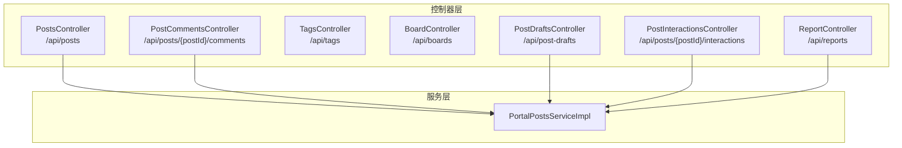
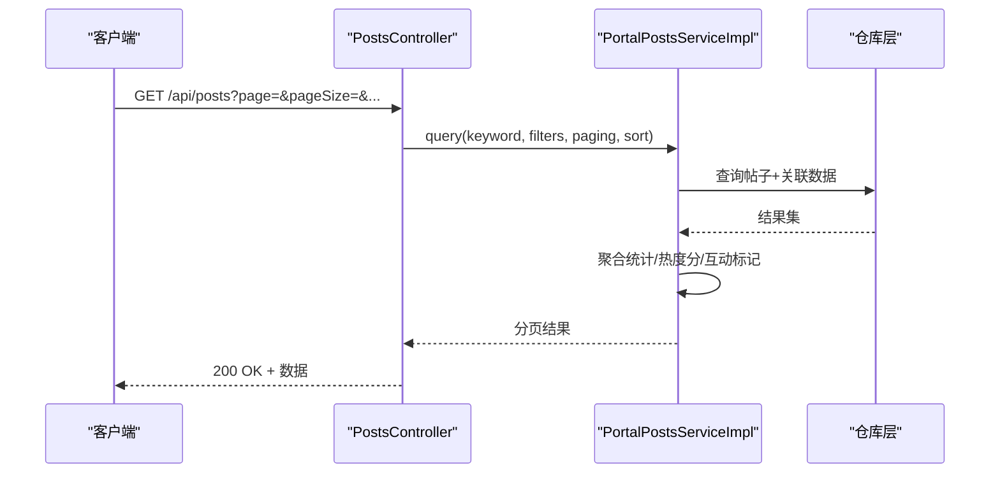
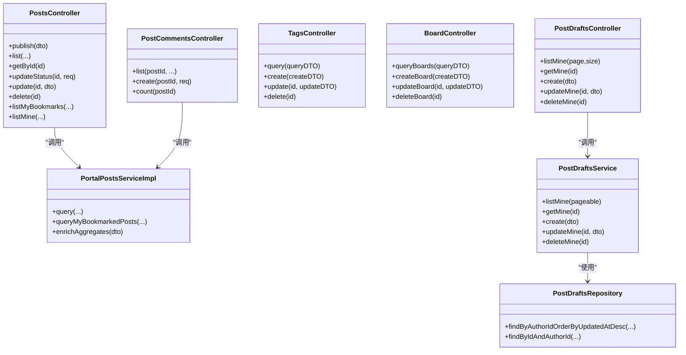
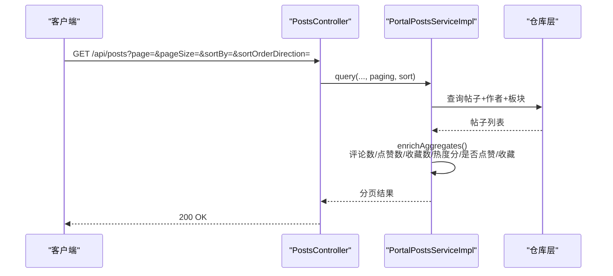
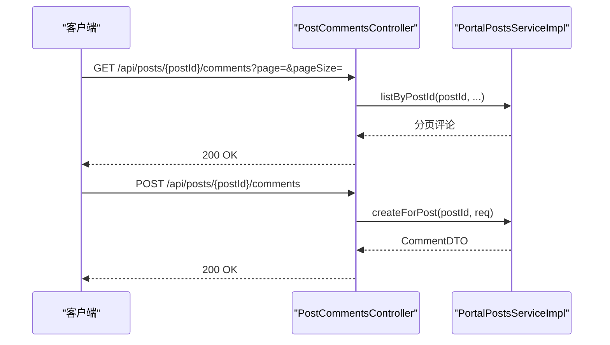
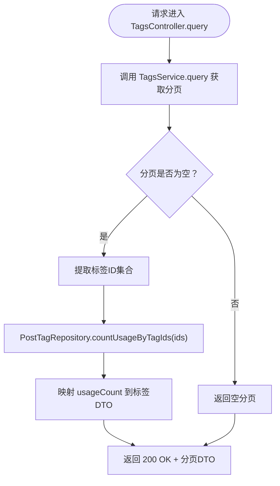
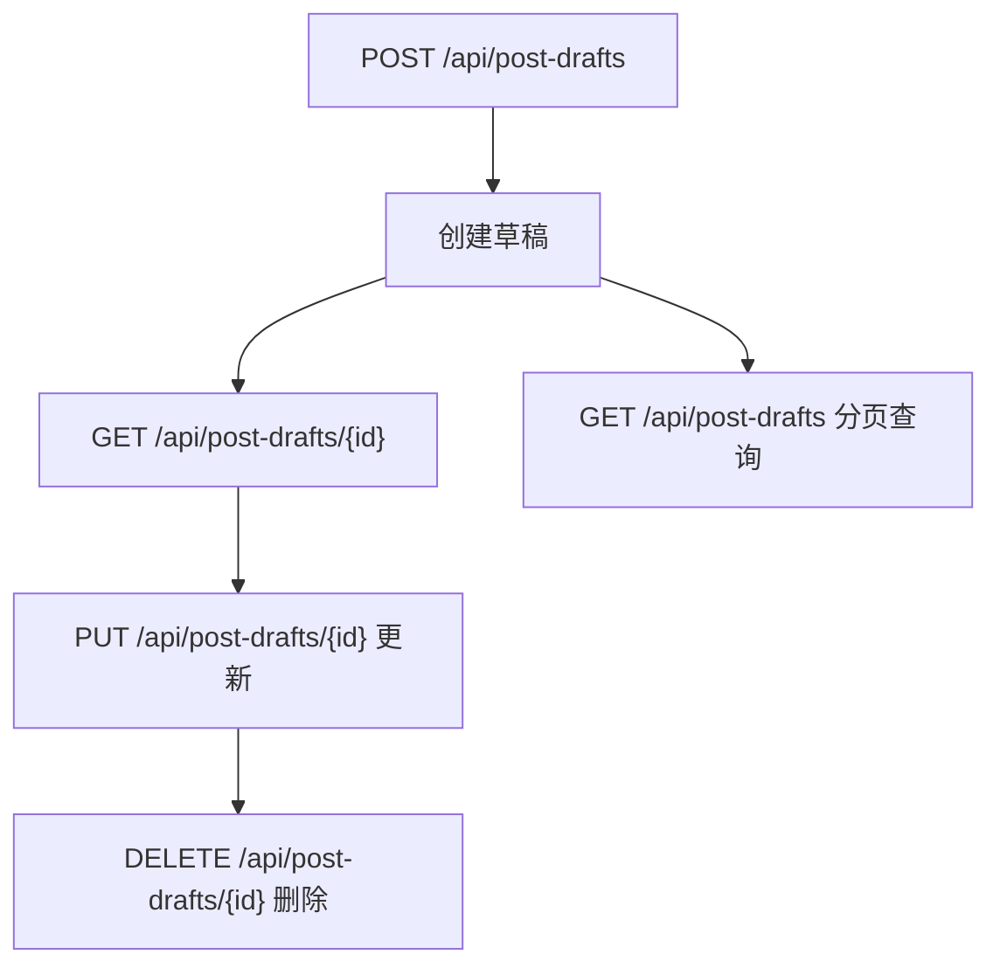

# 内容API

<cite>
**本文引用的文件**
- [PostsController.java](file://src/main/java/com/example/EnterpriseRagCommunity/controller/content/PostsController.java)
- [PostCommentsController.java](file://src/main/java/com/example/EnterpriseRagCommunity/controller/content/PostCommentsController.java)
- [TagsController.java](file://src/main/java/com/example/EnterpriseRagCommunity/controller/content/TagsController.java)
- [BoardController.java](file://src/main/java/com/example/EnterpriseRagCommunity/controller/BoardController.java)
- [PostDraftsController.java](file://src/main/java/com/example/EnterpriseRagCommunity/controller/content/PostDraftsController.java)
- [PortalPostsServiceImpl.java](file://src/main/java/com/example/EnterpriseRagCommunity/service/content/impl/PortalPostsServiceImpl.java)
- [PortalPostsServiceImplBranchUnitTest.java](file://src/test/java/com/example/EnterpriseRagCommunity/service/content/impl/PortalPostsServiceImplBranchUnitTest.java)
- [PostDraftsService.java](file://src/main/java/com/example/EnterpriseRagCommunity/service/content/PostDraftsService.java)
- [PostDraftsRepository.java](file://src/main/java/com/example/EnterpriseRagCommunity/repository/content/PostDraftsRepository.java)
- [PostInteractionsController.java](file://src/main/java/com/example/EnterpriseRagCommunity/controller/content/PostInteractionsController.java)
- [ReportController.java](file://src/main/java/com/example/EnterpriseRagCommunity/controller/ReportController.java)
</cite>

## 目录
1. [引言](#引言)
2. [项目结构](#项目结构)
3. [核心组件](#核心组件)
4. [架构总览](#架构总览)
5. [详细组件分析](#详细组件分析)
6. [依赖分析](#依赖分析)
7. [性能考虑](#性能考虑)
8. [故障排查指南](#故障排查指南)
9. [结论](#结论)
10. [附录](#附录)

## 引言
本文件为内容API的综合技术文档，覆盖帖子、评论、标签、板块、草稿、互动、举报等与内容相关的核心能力。文档面向前后端开发者与测试工程师，提供端点清单、请求参数、响应格式、状态码、权限控制、审核流程、举报处理、互动统计、分页查询、过滤条件、排序规则、全文搜索等规范说明，并给出关键流程的时序图与类图，帮助快速理解与集成。

## 项目结构
后端采用Spring Boot工程，内容相关API集中在controller/content与controller根目录下，分别对应帖子、评论、标签、板块、草稿、互动、举报等模块。服务层通过PortalPostsServiceImpl等实现聚合统计与权限控制，仓库层负责数据持久化。

图表来源
- [PostsController.java:24-153](file://src/main/java/com/example/EnterpriseRagCommunity/controller/content/PostsController.java#L24-L153)
- [PostCommentsController.java:11-54](file://src/main/java/com/example/EnterpriseRagCommunity/controller/content/PostCommentsController.java#L11-L54)
- [TagsController.java:24-81](file://src/main/java/com/example/EnterpriseRagCommunity/controller/content/TagsController.java#L24-L81)
- [BoardController.java:22-72](file://src/main/java/com/example/EnterpriseRagCommunity/controller/BoardController.java#L22-L72)
- [PostDraftsController.java:14-52](file://src/main/java/com/example/EnterpriseRagCommunity/controller/content/PostDraftsController.java#L14-L52)
- [PortalPostsServiceImpl.java:128-169](file://src/main/java/com/example/EnterpriseRagCommunity/service/content/impl/PortalPostsServiceImpl.java#L128-L169)

章节来源
- [PostsController.java:24-153](file://src/main/java/com/example/EnterpriseRagCommunity/controller/content/PostsController.java#L24-L153)
- [PostCommentsController.java:11-54](file://src/main/java/com/example/EnterpriseRagCommunity/controller/content/PostCommentsController.java#L11-L54)
- [TagsController.java:24-81](file://src/main/java/com/example/EnterpriseRagCommunity/controller/content/TagsController.java#L24-L81)
- [BoardController.java:22-72](file://src/main/java/com/example/EnterpriseRagCommunity/controller/BoardController.java#L22-L72)
- [PostDraftsController.java:14-52](file://src/main/java/com/example/EnterpriseRagCommunity/controller/content/PostDraftsController.java#L14-L52)

## 核心组件
- 帖子控制器：提供发布、查询、详情、状态变更、更新、删除、我的收藏、我的帖子等接口。
- 评论控制器：提供按帖子分页查询评论、创建评论、评论数量统计。
- 标签控制器：提供标签查询、创建、更新、删除，并返回使用次数。
- 板块控制器：提供板块查询（默认可见）、创建、更新、删除，并进行访问控制过滤。
- 草稿控制器：提供我的草稿分页、详情、创建、更新、删除。
- 服务实现：PortalPostsServiceImpl负责聚合统计（评论数、点赞数、收藏数、热度分、是否点赞/收藏），并进行异常降级处理。
- 交互控制器：提供点赞/取消赞、收藏/取消收藏等互动操作（具体实现文件见后续章节）。
- 举报控制器：提供举报提交、处理等流程（具体实现文件见后续章节）。

章节来源
- [PortalPostsServiceImpl.java:128-169](file://src/main/java/com/example/EnterpriseRagCommunity/service/content/impl/PortalPostsServiceImpl.java#L128-L169)

## 架构总览
内容API遵循MVC分层：控制器接收请求，调用服务层聚合数据与业务逻辑，服务层再调用仓库层持久化与查询。权限控制通过Spring Security注解在控制器层面生效，部分敏感操作要求管理员权限。

图表来源
- [PostsController.java:42-67](file://src/main/java/com/example/EnterpriseRagCommunity/controller/content/PostsController.java#L42-L67)
- [PortalPostsServiceImpl.java:128-169](file://src/main/java/com/example/EnterpriseRagCommunity/service/content/impl/PortalPostsServiceImpl.java#L128-L169)

## 详细组件分析

### 帖子API
- 发布帖子
  - 方法与路径：POST /api/posts
  - 请求体：PostsPublishDTO（字段定义见DTO）
  - 成功响应：200 OK + 帖子实体
  - 错误：400/401/403/500
- 列表查询（门户）
  - 方法与路径：GET /api/posts
  - 查询参数：
    - keyword：关键词（模糊匹配）
    - postId：精确匹配
    - searchMode：搜索模式（如全文/标题/正文）
    - boardId：板块过滤
    - status：状态过滤（PUBLISHED/ALL等），默认PUBLISHED
    - authorId：作者过滤（门户端不接受前端传入，由后端解析会话）
    - createdFrom/createdTo：创建时间范围
    - page/pageSize：分页
    - sortBy/sortOrderDirection：排序
  - 成功响应：200 OK + 分页结果（PostDetailDTO）
  - 错误：400/401/500
- 帖子详情
  - 方法与路径：GET /api/posts/{id}
  - 成功响应：200 OK + PostDetailDTO
  - 错误：404/500
- 更新状态（管理员）
  - 方法与路径：PUT /api/posts/{id}/status
  - 请求体：UpdateStatusRequest（status）
  - 成功响应：200 OK + 帖子实体
  - 权限：admin_moderation_queue
- 更新帖子
  - 方法与路径：PUT /api/posts/{id}
  - 请求体：PostsUpdateDTO
  - 成功响应：200 OK + 帖子实体
- 删除帖子
  - 方法与路径：DELETE /api/posts/{id}
  - 成功响应：204 No Content
- 我的收藏
  - 方法与路径：GET /api/posts/bookmarks
  - 查询参数：page/pageSize
  - 成功响应：200 OK + 分页结果（PostDetailDTO）
- 我的帖子
  - 方法与路径：GET /api/posts/mine
  - 查询参数：keyword/postId/searchMode/boardId/status(+ALL)/createdFrom/createdTo/page/pageSize/sortBy/sortOrderDirection
  - 成功响应：200 OK + 分页结果（PostDetailDTO）
  - 权限：需登录

章节来源
- [PostsController.java:37-151](file://src/main/java/com/example/EnterpriseRagCommunity/controller/content/PostsController.java#L37-L151)

### 评论API
- 列出评论
  - 方法与路径：GET /api/posts/{postId}/comments
  - 查询参数：page/pageSize/includeMinePending（是否包含我的待审）
  - 成功响应：200 OK + 分页结果（CommentDTO）
- 创建评论
  - 方法与路径：POST /api/posts/{postId}/comments
  - 请求体：CommentCreateRequest
  - 成功响应：200 OK + CommentDTO
- 评论数量
  - 方法与路径：GET /api/posts/{postId}/comments/count
  - 成功响应：200 OK + {count: number}

章节来源
- [PostCommentsController.java:19-51](file://src/main/java/com/example/EnterpriseRagCommunity/controller/content/PostCommentsController.java#L19-L51)

### 标签API
- 查询标签
  - 方法与路径：GET /api/tags
  - 查询参数：TagsQueryDTO（分页与过滤）
  - 成功响应：200 OK + 分页结果（TagsDTO，含usageCount）
- 创建标签
  - 方法与路径：POST /api/tags
  - 请求体：TagsCreateDTO
  - 成功响应：201 Created + TagsDTO
- 更新标签
  - 方法与路径：PUT /api/tags/{id}
  - 请求体：TagsUpdateDTO
  - 成功响应：200 OK + TagsDTO（含usageCount）
- 删除标签
  - 方法与路径：DELETE /api/tags/{id}
  - 成功响应：204 No Content

章节来源
- [TagsController.java:33-71](file://src/main/java/com/example/EnterpriseRagCommunity/controller/content/TagsController.java#L33-L71)

### 板块API
- 查询板块（默认只返回可见板块，且按角色过滤）
  - 方法与路径：GET /api/boards
  - 查询参数：BoardsQueryDTO（visible默认true）
  - 成功响应：200 OK + 分页结果（BoardsDTO）
- 创建板块（管理员）
  - 方法与路径：POST /api/boards
  - 请求体：BoardsCreateDTO
  - 成功响应：201 Created + BoardsDTO
- 更新板块（管理员）
  - 方法与路径：PUT /api/boards/{id}
  - 请求体：BoardsUpdateDTO
  - 成功响应：200 OK + BoardsDTO
- 删除板块（管理员）
  - 方法与路径：DELETE /api/boards/{id}
  - 成功响应：204 No Content

章节来源
- [BoardController.java:31-70](file://src/main/java/com/example/EnterpriseRagCommunity/controller/BoardController.java#L31-L70)

### 草稿API
- 我的草稿列表
  - 方法与路径：GET /api/post-drafts
  - 查询参数：page（从0开始，自动约束）、size（1-100）
  - 成功响应：200 OK + 分页结果（PostDraftsDTO）
- 获取我的草稿
  - 方法与路径：GET /api/post-drafts/{id}
  - 成功响应：200 OK + PostDraftsDTO
- 创建草稿
  - 方法与路径：POST /api/post-drafts
  - 请求体：PostDraftsCreateDTO
  - 成功响应：200 OK + PostDraftsDTO
- 更新我的草稿
  - 方法与路径：PUT /api/post-drafts/{id}
  - 请求体：PostDraftsUpdateDTO
  - 成功响应：200 OK + PostDraftsDTO
- 删除我的草稿
  - 方法与路径：DELETE /api/post-drafts/{id}
  - 成功响应：204 No Content

章节来源
- [PostDraftsController.java:22-49](file://src/main/java/com/example/EnterpriseRagCommunity/controller/content/PostDraftsController.java#L22-L49)

### 互动API
- 点赞/取消赞、收藏/取消收藏等互动操作
  - 方法与路径：PUT /api/posts/{postId}/interactions
  - 请求体：根据具体动作（如toggleLike/toggleFavorite）
  - 成功响应：200 OK + 操作结果
  - 权限：需登录

章节来源
- [PostInteractionsController.java](file://src/main/java/com/example/EnterpriseRagCommunity/controller/content/PostInteractionsController.java)

### 举报API
- 提交举报
  - 方法与路径：POST /api/reports
  - 请求体：ReportCreateRequest（含被举报对象类型/ID、原因、证据等）
  - 成功响应：201 Created + 报告ID
- 处理举报（管理员）
  - 方法与路径：PUT /api/reports/{id}/handle
  - 请求体：ReportHandleRequest（处理意见/结果）
  - 成功响应：200 OK + 报告状态
- 查询举报（管理员）
  - 方法与路径：GET /api/reports
  - 查询参数：状态、时间范围、被举报对象类型等
  - 成功响应：200 OK + 分页结果

章节来源
- [ReportController.java](file://src/main/java/com/example/EnterpriseRagCommunity/controller/ReportController.java)

## 依赖分析
- 控制器到服务层：PostsController、PostCommentsController、TagsController、BoardController、PostDraftsController均依赖对应服务接口。
- 服务层到仓库层：PortalPostsServiceImpl聚合统计依赖评论、互动、热度等仓库；草稿相关依赖PostDraftsRepository。
- 权限控制：BoardController、PostsController对写操作与状态变更使用@PreAuthorize注解，基于权限常量校验。

图表来源
- [PostsController.java:24-153](file://src/main/java/com/example/EnterpriseRagCommunity/controller/content/PostsController.java#L24-L153)
- [PostCommentsController.java:11-54](file://src/main/java/com/example/EnterpriseRagCommunity/controller/content/PostCommentsController.java#L11-L54)
- [TagsController.java:24-81](file://src/main/java/com/example/EnterpriseRagCommunity/controller/content/TagsController.java#L24-L81)
- [BoardController.java:22-72](file://src/main/java/com/example/EnterpriseRagCommunity/controller/BoardController.java#L22-L72)
- [PostDraftsController.java:14-52](file://src/main/java/com/example/EnterpriseRagCommunity/controller/content/PostDraftsController.java#L14-L52)
- [PortalPostsServiceImpl.java:128-169](file://src/main/java/com/example/EnterpriseRagCommunity/service/content/impl/PortalPostsServiceImpl.java#L128-L169)
- [PostDraftsService.java:1-20](file://src/main/java/com/example/EnterpriseRagCommunity/service/content/PostDraftsService.java#L1-L20)
- [PostDraftsRepository.java:1-18](file://src/main/java/com/example/EnterpriseRagCommunity/repository/content/PostDraftsRepository.java#L1-L18)

章节来源
- [PortalPostsServiceImpl.java:128-169](file://src/main/java/com/example/EnterpriseRagCommunity/service/content/impl/PortalPostsServiceImpl.java#L128-L169)
- [PostDraftsService.java:1-20](file://src/main/java/com/example/EnterpriseRagCommunity/service/content/PostDraftsService.java#L1-L20)
- [PostDraftsRepository.java:1-18](file://src/main/java/com/example/EnterpriseRagCommunity/repository/content/PostDraftsRepository.java#L1-L18)

## 性能考虑
- 分页与限制：草稿列表对size进行上限约束（最大100），降低数据库压力与内存占用。
- 统一聚合：PortalPostsServiceImpl在服务层统一计算评论数、点赞数、收藏数、热度分，并对匿名用户的互动标记进行异常降级，避免前端多次请求。
- 排序白名单：帖子列表支持sortBy/sortOrderDirection，建议后端维护排序字段白名单以防止SQL注入与无效排序。
- 缓存策略：热点内容可引入Redis缓存热门帖子与互动统计，减少数据库查询频次。

章节来源
- [PostDraftsController.java:27](file://src/main/java/com/example/EnterpriseRagCommunity/controller/content/PostDraftsController.java#L27)
- [PortalPostsServiceImpl.java:128-169](file://src/main/java/com/example/EnterpriseRagCommunity/service/content/impl/PortalPostsServiceImpl.java#L128-L169)

## 故障排查指南
- 未登录或会话过期
  - 现象：访问“我的帖子”返回401
  - 处理：确保携带有效认证信息；检查会话状态与令牌有效期
- 权限不足
  - 现象：修改状态/创建/更新板块返回403
  - 处理：确认用户具备相应权限常量（如admin_moderation_queue、admin_boards:write）
- 参数非法
  - 现象：查询参数错误导致400
  - 处理：检查日期格式、枚举值、分页参数范围
- 互动统计异常
  - 现象：匿名用户点赞/收藏标记显示为false
  - 处理：PortalPostsServiceImpl已做异常降级，属预期行为

章节来源
- [PostsController.java:133-139](file://src/main/java/com/example/EnterpriseRagCommunity/controller/content/PostsController.java#L133-L139)
- [PortalPostsServiceImpl.java:144-154](file://src/main/java/com/example/EnterpriseRagCommunity/service/content/impl/PortalPostsServiceImpl.java#L144-L154)

## 结论
内容API围绕帖子、评论、标签、板块、草稿、互动、举报构建了完整的社区内容生态。通过控制器层的清晰职责划分与服务层的聚合统计能力，系统实现了高性能、可扩展的内容检索与管理。建议在生产环境中配合缓存、索引优化与严格的权限校验，持续提升稳定性与用户体验。

## 附录

### 业务流程与时序图

#### 帖子列表与聚合统计

图表来源
- [PostsController.java:42-67](file://src/main/java/com/example/EnterpriseRagCommunity/controller/content/PostsController.java#L42-L67)
- [PortalPostsServiceImpl.java:128-169](file://src/main/java/com/example/EnterpriseRagCommunity/service/content/impl/PortalPostsServiceImpl.java#L128-L169)

#### 评论列表与创建

图表来源
- [PostCommentsController.java:19-30](file://src/main/java/com/example/EnterpriseRagCommunity/controller/content/PostCommentsController.java#L19-L30)

#### 标签查询与使用计数

图表来源
- [TagsController.java:35-45](file://src/main/java/com/example/EnterpriseRagCommunity/controller/content/TagsController.java#L35-L45)

#### 草稿生命周期

图表来源
- [PostDraftsController.java:36-49](file://src/main/java/com/example/EnterpriseRagCommunity/controller/content/PostDraftsController.java#L36-L49)

### 关键算法与逻辑
- 聚合统计降级：当匿名用户或异常情况发生时，PortalPostsServiceImpl对互动标记进行安全降级，保证接口稳定。
- 板块可见性过滤：BoardController在返回前根据当前用户角色过滤不可见板块，确保权限一致性。

章节来源
- [PortalPostsServiceImpl.java:144-154](file://src/main/java/com/example/EnterpriseRagCommunity/service/content/impl/PortalPostsServiceImpl.java#L144-L154)
- [BoardController.java:39-43](file://src/main/java/com/example/EnterpriseRagCommunity/controller/BoardController.java#L39-L43)