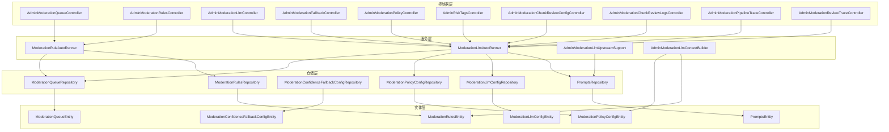
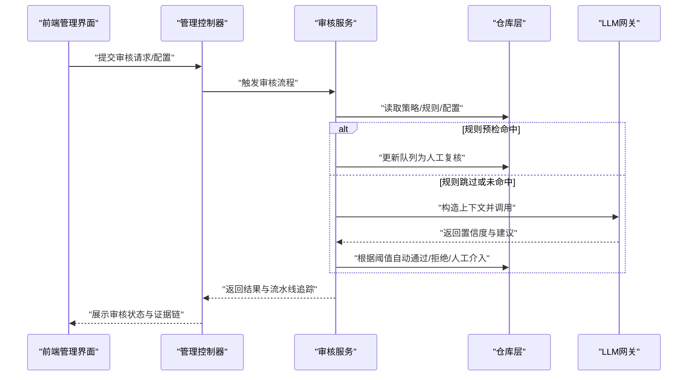
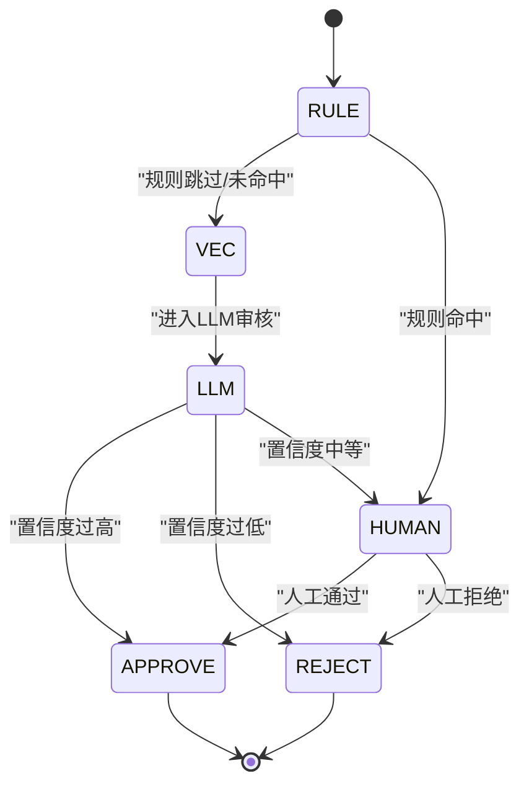
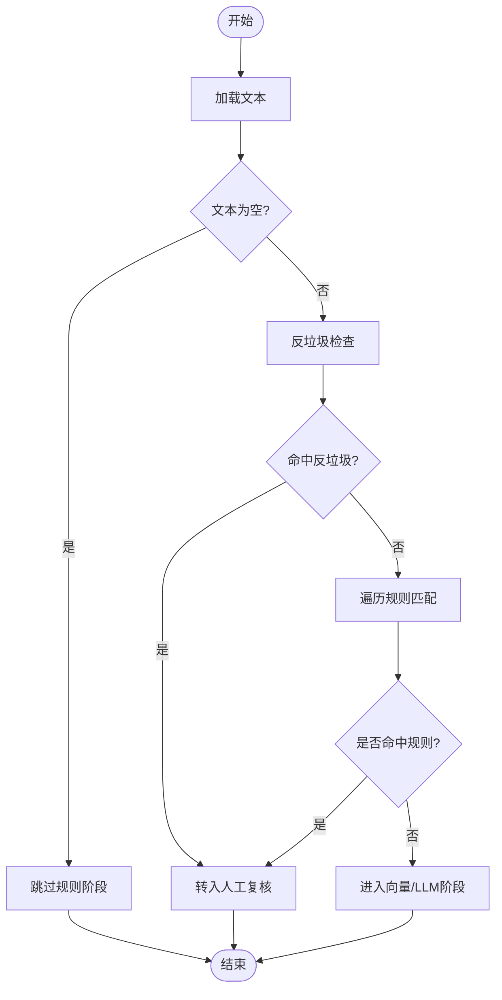
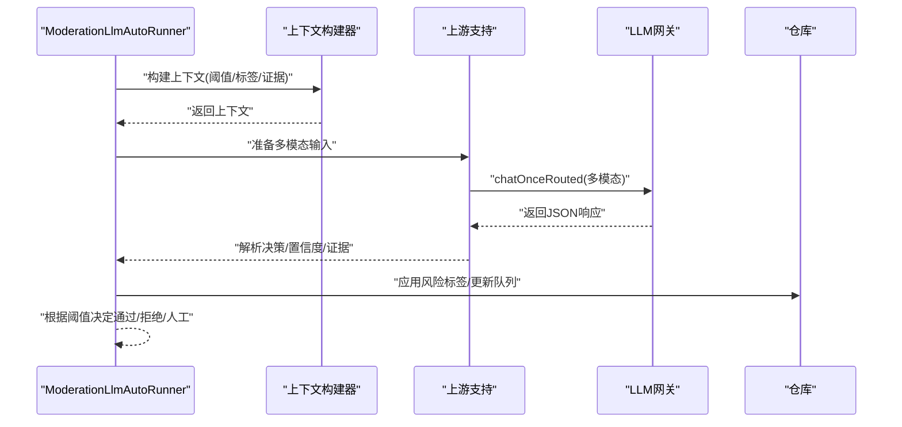

# 内容审核API

<cite>
**本文引用的文件**
- [ModerationRuleAutoRunner.java](file://src/main/java/com/example/EnterpriseRagCommunity/service/moderation/jobs/ModerationRuleAutoRunner.java)
- [ModerationLlmAutoRunner.java](file://src/main/java/com/example/EnterpriseRagCommunity/service/moderation/jobs/ModerationLlmAutoRunner.java)
- [AdminModerationLlmUpstreamSupport.java](file://src/main/java/com/example/EnterpriseRagCommunity/service/moderation/admin/AdminModerationLlmUpstreamSupport.java)
- [AdminModerationLlmContextBuilder.java](file://src/main/java/com/example/EnterpriseRagCommunity/service/moderation/admin/AdminModerationLlmContextBuilder.java)
- [AdminModerationLlmServiceDirectionalCoverageV2Test.java](file://src/test/java/com/example/EnterpriseRagCommunity/service/moderation/admin/AdminModerationLlmServiceDirectionalCoverageV2Test.java)
- [ModerationPrecheckRejectIntegrationTest.java](file://src/integrationTest/java/com/example/EnterpriseRagCommunity/service/moderation/jobs/ModerationPrecheckRejectIntegrationTest.java)
- [ModerationLlmAutoRunnerUserReasonTest.java](file://src/test/java/com/example/EnterpriseRagCommunity/service/moderation/jobs/ModerationLlmAutoRunnerUserReasonTest.java)
- [AdminModerationLlmServicePromptTemplateVarsTest.java](file://src/test/java/com/example/EnterpriseRagCommunity/service/moderation/admin/AdminModerationLlmServicePromptTemplateVarsTest.java)
- [AdminModerationLlmServiceVisionBatchingTest.java](file://src/test/java/com/example/EnterpriseRagCommunity/service/moderation/admin/AdminModerationLlmServiceVisionBatchingTest.java)
- [AdminModerationQueueController.java](file://src/main/java/com/example/EnterpriseRagCommunity/controller/moderation/admin/AdminModerationQueueController.java)
- [AdminModerationRulesController.java](file://src/main/java/com/example/EnterpriseRagCommunity/controller/moderation/admin/AdminModerationRulesController.java)
- [AdminModerationLlmController.java](file://src/main/java/com/example/EnterpriseRagCommunity/controller/moderation/admin/AdminModerationLlmController.java)
- [AdminModerationFallbackController.java](file://src/main/java/com/example/EnterpriseRagCommunity/controller/moderation/admin/AdminModerationFallbackController.java)
- [AdminModerationPolicyController.java](file://src/main/java/com/example/EnterpriseRagCommunity/controller/moderation/admin/AdminModerationPolicyController.java)
- [AdminRiskTagsController.java](file://src/main/java/com/example/EnterpriseRagCommunity/controller/moderation/admin/AdminRiskTagsController.java)
- [AdminModerationChunkReviewConfigController.java](file://src/main/java/com/example/EnterpriseRagCommunity/controller/moderation/admin/AdminModerationChunkReviewConfigController.java)
- [AdminModerationChunkReviewLogsController.java](file://src/main/java/com/example/EnterpriseRagCommunity/controller/moderation/admin/AdminModerationChunkReviewLogsController.java)
- [AdminModerationPipelineTraceController.java](file://src/main/java/com/example/EnterpriseRagCommunity/controller/moderation/admin/AdminModerationPipelineTraceController.java)
- [AdminModerationReviewTraceController.java](file://src/main/java/com/example/EnterpriseRagCommunity/controller/moderation/admin/AdminModerationReviewTraceController.java)
- [ModerationQueueEntity.java](file://src/main/java/com/example/EnterpriseRagCommunity/entity/moderation/ModerationQueueEntity.java)
- [ModerationRulesEntity.java](file://src/main/java/com/example/EnterpriseRagCommunity/entity/moderation/ModerationRulesEntity.java)
- [ModerationConfidenceFallbackConfigEntity.java](file://src/main/java/com/example/EnterpriseRagCommunity/entity/moderation/ModerationConfidenceFallbackConfigEntity.java)
- [ModerationPolicyConfigEntity.java](file://src/main/java/com/example/EnterpriseRagCommunity/entity/moderation/ModerationPolicyConfigEntity.java)
- [ModerationLlmConfigEntity.java](file://src/main/java/com/example/EnterpriseRagCommunity/entity/moderation/ModerationLlmConfigEntity.java)
- [PromptsEntity.java](file://src/main/java/com/example/EnterpriseRagCommunity/entity/moderation/PromptsEntity.java)
- [ModerationQueueRepository.java](file://src/main/java/com/example/EnterpriseRagCommunity/repository/moderation/ModerationQueueRepository.java)
- [ModerationRulesRepository.java](file://src/main/java/com/example/EnterpriseRagCommunity/repository/moderation/ModerationRulesRepository.java)
- [ModerationConfidenceFallbackConfigRepository.java](file://src/main/java/com/example/EnterpriseRagCommunity/repository/moderation/ModerationConfidenceFallbackConfigRepository.java)
- [ModerationPolicyConfigRepository.java](file://src/main/java/com/example/EnterpriseRagCommunity/repository/moderation/ModerationPolicyConfigRepository.java)
- [ModerationLlmConfigRepository.java](file://src/main/java/com/example/EnterpriseRagCommunity/repository/moderation/ModerationLlmConfigRepository.java)
- [PromptsRepository.java](file://src/main/java/com/example/EnterpriseRagCommunity/repository/moderation/PromptsRepository.java)
- [risk-tag-service.ts](file://my-vite-app/src/services/riskTagService.ts)
- [risk-tags.tsx](file://my-vite-app/src/pages/admin/forms/review/risk-tags.tsx)
</cite>

## 目录
1. [引言](#引言)
2. [项目结构](#项目结构)
3. [核心组件](#核心组件)
4. [架构总览](#架构总览)
5. [详细组件分析](#详细组件分析)
6. [依赖关系分析](#依赖关系分析)
7. [性能考量](#性能考量)
8. [故障排查指南](#故障排查指南)
9. [结论](#结论)
10. [附录](#附录)

## 引言
本文件面向内容审核API的使用者与维护者，系统性梳理自动审核、人工复核、规则配置、LLM审核、回退机制等审核体系的端到端实现。重点覆盖以下方面：
- 审核队列管理：入队、阶段流转、锁机制、状态变更
- 规则引擎：正则匹配、阈值判定、反垃圾策略
- LLM审核：多模态输入、提示词模板、置信度阈值、回退策略
- 风险标签：标签定义、阈值映射、上下文注入
- 证据链管理：证据收集、文本增强、可验证性校验
- 管理与运维：策略配置、LLM配置、回退配置、流水线追踪、人工复核配置
- 数据存取：实体模型、仓库接口、前端服务封装

## 项目结构
后端采用分层架构，审核相关能力主要集中在 moderation 包下的 jobs（作业）、admin（管理）两类服务，配合 controller 层暴露REST API，并通过 repository 层访问数据库。

图表来源
- [AdminModerationQueueController.java](file://src/main/java/com/example/EnterpriseRagCommunity/controller/moderation/admin/AdminModerationQueueController.java)
- [ModerationRuleAutoRunner.java](file://src/main/java/com/example/EnterpriseRagCommunity/service/moderation/jobs/ModerationRuleAutoRunner.java)
- [ModerationLlmAutoRunner.java](file://src/main/java/com/example/EnterpriseRagCommunity/service/moderation/jobs/ModerationLlmAutoRunner.java)
- [AdminModerationLlmUpstreamSupport.java](file://src/main/java/com/example/EnterpriseRagCommunity/service/moderation/admin/AdminModerationLlmUpstreamSupport.java)
- [AdminModerationLlmContextBuilder.java](file://src/main/java/com/example/EnterpriseRagCommunity/service/moderation/admin/AdminModerationLlmContextBuilder.java)
- [ModerationQueueRepository.java](file://src/main/java/com/example/EnterpriseRagCommunity/repository/moderation/ModerationQueueRepository.java)
- [ModerationRulesRepository.java](file://src/main/java/com/example/EnterpriseRagCommunity/repository/moderation/ModerationRulesRepository.java)
- [ModerationConfidenceFallbackConfigRepository.java](file://src/main/java/com/example/EnterpriseRagCommunity/repository/moderation/ModerationConfidenceFallbackConfigRepository.java)
- [ModerationPolicyConfigRepository.java](file://src/main/java/com/example/EnterpriseRagCommunity/repository/moderation/ModerationPolicyConfigRepository.java)
- [ModerationLlmConfigRepository.java](file://src/main/java/com/example/EnterpriseRagCommunity/repository/moderation/ModerationLlmConfigRepository.java)
- [PromptsRepository.java](file://src/main/java/com/example/EnterpriseRagCommunity/repository/moderation/PromptsRepository.java)

章节来源
- [AdminModerationQueueController.java](file://src/main/java/com/example/EnterpriseRagCommunity/controller/moderation/admin/AdminModerationQueueController.java)
- [ModerationRuleAutoRunner.java](file://src/main/java/com/example/EnterpriseRagCommunity/service/moderation/jobs/ModerationRuleAutoRunner.java)
- [ModerationLlmAutoRunner.java](file://src/main/java/com/example/EnterpriseRagCommunity/service/moderation/jobs/ModerationLlmAutoRunner.java)

## 核心组件
- 审核队列与实体
  - 队列实体承载待审内容、当前阶段、状态、锁持有者等元信息
  - 队列仓库负责持久化与并发控制（锁、阶段更新）
- 规则引擎
  - 加载内容文本，执行反垃圾策略与正则规则匹配
  - 命中时推进至人工复核或直接拒绝
- LLM审核
  - 构建上下文（含策略阈值、风险标签分类法），调用上游LLM网关
  - 基于置信度阈值进行自动通过/拒绝/人工介入
  - 支持多模态输入与批量图片处理
- 回退机制
  - 通过回退配置实体设置各类阈值，作为LLM决策的兜底
- 风险标签
  - 定义标签、描述、阈值；在上下文中注入分类法，影响LLM判断
- 证据链
  - 记录证据、补充文本证据、校验证据可验证性

章节来源
- [ModerationQueueEntity.java](file://src/main/java/com/example/EnterpriseRagCommunity/entity/moderation/ModerationQueueEntity.java)
- [ModerationRulesEntity.java](file://src/main/java/com/example/EnterpriseRagCommunity/entity/moderation/ModerationRulesEntity.java)
- [ModerationConfidenceFallbackConfigEntity.java](file://src/main/java/com/example/EnterpriseRagCommunity/entity/moderation/ModerationConfidenceFallbackConfigEntity.java)
- [ModerationPolicyConfigEntity.java](file://src/main/java/com/example/EnterpriseRagCommunity/entity/moderation/ModerationPolicyConfigEntity.java)
- [ModerationLlmConfigEntity.java](file://src/main/java/com/example/EnterpriseRagCommunity/entity/moderation/ModerationLlmConfigEntity.java)
- [PromptsEntity.java](file://src/main/java/com/example/EnterpriseRagCommunity/entity/moderation/PromptsEntity.java)

## 架构总览
审核体系由“规则预检”和“LLM深度审核”两条主线组成，辅以“人工复核”和“回退策略”。前端通过管理端控制器调用后端服务，服务层协调仓库与外部网关，最终落地到数据库。

图表来源
- [AdminModerationLlmController.java](file://src/main/java/com/example/EnterpriseRagCommunity/controller/moderation/admin/AdminModerationLlmController.java)
- [ModerationLlmAutoRunner.java](file://src/main/java/com/example/EnterpriseRagCommunity/service/moderation/jobs/ModerationLlmAutoRunner.java)
- [ModerationRuleAutoRunner.java](file://src/main/java/com/example/EnterpriseRagCommunity/service/moderation/jobs/ModerationRuleAutoRunner.java)

## 详细组件分析

### 审核队列管理
- 入队与阶段
  - 队列实体包含内容类型、内容ID、优先级、当前阶段、状态、锁信息等
  - 队列仓库提供基于锁的阶段更新，确保并发安全
- 锁与流转
  - 仅持有锁的任务可推进阶段，避免竞态
  - 规则预检阶段可能跳转至向量/LLM/人工复核等后续阶段
- 状态变更
  - 自动通过/拒绝、人工复核、重试/回退等状态转换

图表来源
- [ModerationQueueEntity.java](file://src/main/java/com/example/EnterpriseRagCommunity/entity/moderation/ModerationQueueEntity.java)
- [ModerationQueueRepository.java](file://src/main/java/com/example/EnterpriseRagCommunity/repository/moderation/ModerationQueueRepository.java)

章节来源
- [ModerationQueueEntity.java](file://src/main/java/com/example/EnterpriseRagCommunity/entity/moderation/ModerationQueueEntity.java)
- [ModerationQueueRepository.java](file://src/main/java/com/example/EnterpriseRagCommunity/repository/moderation/ModerationQueueRepository.java)

### 规则引擎（自动审核前置）
- 反垃圾策略
  - 基于作者统计窗口内的行为阈值，命中即转入人工复核
- 正则规则匹配
  - 遍历启用的规则，对加载的文本进行匹配，累计最高风险等级
  - 无规则或禁用时跳过规则阶段
- 文本为空处理
  - 空文本直接跳过规则阶段

图表来源
- [ModerationRuleAutoRunner.java](file://src/main/java/com/example/EnterpriseRagCommunity/service/moderation/jobs/ModerationRuleAutoRunner.java)

章节来源
- [ModerationRuleAutoRunner.java](file://src/main/java/com/example/EnterpriseRagCommunity/service/moderation/jobs/ModerationRuleAutoRunner.java)

### LLM审核（深度判断）
- 上下文构建
  - 注入策略阈值、风险标签分类法、证据链等
- 多模态支持
  - 图片批量化处理，按上限拆分请求
- 决策与回退
  - 基于置信度阈值自动通过/拒绝/人工介入
  - 若证据不可验证，降级为人工介入
- 用户可见原因
  - 将具体原因组合为用户可读的拒绝说明

图表来源
- [ModerationLlmAutoRunner.java](file://src/main/java/com/example/EnterpriseRagCommunity/service/moderation/jobs/ModerationLlmAutoRunner.java)
- [AdminModerationLlmUpstreamSupport.java](file://src/main/java/com/example/EnterpriseRagCommunity/service/moderation/admin/AdminModerationLlmUpstreamSupport.java)
- [AdminModerationLlmContextBuilder.java](file://src/main/java/com/example/EnterpriseRagCommunity/service/moderation/admin/AdminModerationLlmContextBuilder.java)

章节来源
- [ModerationLlmAutoRunner.java](file://src/main/java/com/example/EnterpriseRagCommunity/service/moderation/jobs/ModerationLlmAutoRunner.java)
- [AdminModerationLlmUpstreamSupport.java](file://src/main/java/com/example/EnterpriseRagCommunity/service/moderation/admin/AdminModerationLlmUpstreamSupport.java)
- [AdminModerationLlmContextBuilder.java](file://src/main/java/com/example/EnterpriseRagCommunity/service/moderation/admin/AdminModerationLlmContextBuilder.java)

### 回退机制
- 回退配置实体包含文本/图像/跨模态等阈值，作为LLM决策的兜底
- 当LLM输出不可验证或置信度处于灰色地带时，依据回退阈值强制分流

章节来源
- [ModerationConfidenceFallbackConfigEntity.java](file://src/main/java/com/example/EnterpriseRagCommunity/entity/moderation/ModerationConfidenceFallbackConfigEntity.java)
- [ModerationConfidenceFallbackConfigRepository.java](file://src/main/java/com/example/EnterpriseRagCommunity/repository/moderation/ModerationConfidenceFallbackConfigRepository.java)

### 风险标签与证据链
- 风险标签
  - 后端提供标签增删改查与分页列表
  - 上下文构建器将标签分类法注入提示词，供LLM参考
- 证据链
  - 支持从LLM响应中提取证据，必要时补充文本证据
  - 对证据进行可验证性校验，不可验证则降级为人工介入

章节来源
- [risk-tag-service.ts](file://my-vite-app/src/services/riskTagService.ts)
- [risk-tags.tsx](file://my-vite-app/src/pages/admin/forms/review/risk-tags.tsx)
- [AdminModerationLlmContextBuilder.java](file://src/main/java/com/example/EnterpriseRagCommunity/service/moderation/admin/AdminModerationLlmContextBuilder.java)
- [AdminModerationLlmUpstreamSupport.java](file://src/main/java/com/example/EnterpriseRagCommunity/service/moderation/admin/AdminModerationLlmUpstreamSupport.java)

## 依赖关系分析
- 控制器依赖服务层，服务层依赖仓库层与外部网关
- 服务层内部存在明确职责划分：规则预检、LLM审核、回退策略、上下文构建
- 实体与仓库一一对应，保证数据一致性与可追踪性

```mermaid
classDiagram
class AdminModerationQueueController
class AdminModerationRulesController
class AdminModerationLlmController
class AdminModerationFallbackController
class AdminModerationPolicyController
class AdminRiskTagsController
class AdminModerationChunkReviewConfigController
class AdminModerationChunkReviewLogsController
class AdminModerationPipelineTraceController
class AdminModerationReviewTraceController
class ModerationRuleAutoRunner
class ModerationLlmAutoRunner
class AdminModerationLlmUpstreamSupport
class AdminModerationLlmContextBuilder
class ModerationQueueRepository
class ModerationRulesRepository
class ModerationConfidenceFallbackConfigRepository
class ModerationPolicyConfigRepository
class ModerationLlmConfigRepository
class PromptsRepository
AdminModerationQueueController --> ModerationRuleAutoRunner
AdminModerationLlmController --> ModerationLlmAutoRunner
ModerationLlmAutoRunner --> ModerationLlmConfigRepository
ModerationLlmAutoRunner --> ModerationPolicyConfigRepository
ModerationLlmAutoRunner --> PromptsRepository
ModerationRuleAutoRunner --> ModerationRulesRepository
ModerationLlmAutoRunner --> ModerationQueueRepository
ModerationLlmAutoRunner --> AdminModerationLlmUpstreamSupport
ModerationLlmAutoRunner --> AdminModerationLlmContextBuilder
```

图表来源
- [AdminModerationQueueController.java](file://src/main/java/com/example/EnterpriseRagCommunity/controller/moderation/admin/AdminModerationQueueController.java)
- [AdminModerationLlmController.java](file://src/main/java/com/example/EnterpriseRagCommunity/controller/moderation/admin/AdminModerationLlmController.java)
- [ModerationRuleAutoRunner.java](file://src/main/java/com/example/EnterpriseRagCommunity/service/moderation/jobs/ModerationRuleAutoRunner.java)
- [ModerationLlmAutoRunner.java](file://src/main/java/com/example/EnterpriseRagCommunity/service/moderation/jobs/ModerationLlmAutoRunner.java)
- [AdminModerationLlmUpstreamSupport.java](file://src/main/java/com/example/EnterpriseRagCommunity/service/moderation/admin/AdminModerationLlmUpstreamSupport.java)
- [AdminModerationLlmContextBuilder.java](file://src/main/java/com/example/EnterpriseRagCommunity/service/moderation/admin/AdminModerationLlmContextBuilder.java)
- [ModerationQueueRepository.java](file://src/main/java/com/example/EnterpriseRagCommunity/repository/moderation/ModerationQueueRepository.java)
- [ModerationRulesRepository.java](file://src/main/java/com/example/EnterpriseRagCommunity/repository/moderation/ModerationRulesRepository.java)
- [ModerationConfidenceFallbackConfigRepository.java](file://src/main/java/com/example/EnterpriseRagCommunity/repository/moderation/ModerationConfidenceFallbackConfigRepository.java)
- [ModerationPolicyConfigRepository.java](file://src/main/java/com/example/EnterpriseRagCommunity/repository/moderation/ModerationPolicyConfigRepository.java)
- [ModerationLlmConfigRepository.java](file://src/main/java/com/example/EnterpriseRagCommunity/repository/moderation/ModerationLlmConfigRepository.java)
- [PromptsRepository.java](file://src/main/java/com/example/EnterpriseRagCommunity/repository/moderation/PromptsRepository.java)

## 性能考量
- 规则匹配批量化与短路优化，避免无效计算
- LLM调用采用多模态批处理，限制每批图片数量与像素，降低延迟
- 阈值与回退策略集中配置，便于快速调参与A/B对比
- 队列锁机制保障并发安全，减少重复工作

## 故障排查指南
- 规则预检异常路径
  - 反垃圾计数异常：检查上游统计服务可用性
  - 无规则或禁用：确认策略配置与规则启用状态
- LLM审核异常路径
  - 提示词模板变量缺失：核对上下文构建中的策略与标签注入
  - 多模态批处理异常：检查图片URL有效性与大小限制
  - 用户可见拒绝原因为空：确认LLM响应结构与原因拼接逻辑
- 集成测试与单元测试
  - 使用集成测试覆盖预检拒绝场景
  - 使用单元测试覆盖阈值、证据链、多模态等分支

章节来源
- [ModerationPrecheckRejectIntegrationTest.java](file://src/integrationTest/java/com/example/EnterpriseRagCommunity/service/moderation/jobs/ModerationPrecheckRejectIntegrationTest.java)
- [ModerationLlmAutoRunnerUserReasonTest.java](file://src/test/java/com/example/EnterpriseRagCommunity/service/moderation/jobs/ModerationLlmAutoRunnerUserReasonTest.java)
- [AdminModerationLlmServicePromptTemplateVarsTest.java](file://src/test/java/com/example/EnterpriseRagCommunity/service/moderation/admin/AdminModerationLlmServicePromptTemplateVarsTest.java)
- [AdminModerationLlmServiceVisionBatchingTest.java](file://src/test/java/com/example/EnterpriseRagCommunity/service/moderation/admin/AdminModerationLlmServiceVisionBatchingTest.java)

## 结论
该审核体系通过“规则预检+LLM深度审核+人工复核+回退策略”的组合拳，实现了高吞吐、可解释、可追溯的内容治理。前端管理界面与后端API协同，支撑策略动态调整、证据链可视化与流水线追踪，满足合规与运营需求。

## 附录

### API端点与职责概览
- 队列管理
  - 管理员队列查询、锁定、推进阶段
- 规则配置
  - 规则增删改查、启用/禁用、优先级排序
- LLM配置
  - 提示词模板选择、多模态参数、自动运行开关
- 回退策略
  - 置信度阈值配置、跨模态阈值、强通过/强拒绝阈值
- 策略配置
  - 针对不同内容类型的阈值与升级规则
- 风险标签
  - 标签增删改查、分页列表、阈值映射
- 人工复核配置
  - 分块复核配置、复核日志查看
- 流水线追踪
  - 运行历史、步骤详情、最终决策

章节来源
- [AdminModerationQueueController.java](file://src/main/java/com/example/EnterpriseRagCommunity/controller/moderation/admin/AdminModerationQueueController.java)
- [AdminModerationRulesController.java](file://src/main/java/com/example/EnterpriseRagCommunity/controller/moderation/admin/AdminModerationRulesController.java)
- [AdminModerationLlmController.java](file://src/main/java/com/example/EnterpriseRagCommunity/controller/moderation/admin/AdminModerationLlmController.java)
- [AdminModerationFallbackController.java](file://src/main/java/com/example/EnterpriseRagCommunity/controller/moderation/admin/AdminModerationFallbackController.java)
- [AdminModerationPolicyController.java](file://src/main/java/com/example/EnterpriseRagCommunity/controller/moderation/admin/AdminModerationPolicyController.java)
- [AdminRiskTagsController.java](file://src/main/java/com/example/EnterpriseRagCommunity/controller/moderation/admin/AdminRiskTagsController.java)
- [AdminModerationChunkReviewConfigController.java](file://src/main/java/com/example/EnterpriseRagCommunity/controller/moderation/admin/AdminModerationChunkReviewConfigController.java)
- [AdminModerationChunkReviewLogsController.java](file://src/main/java/com/example/EnterpriseRagCommunity/controller/moderation/admin/AdminModerationChunkReviewLogsController.java)
- [AdminModerationPipelineTraceController.java](file://src/main/java/com/example/EnterpriseRagCommunity/controller/moderation/admin/AdminModerationPipelineTraceController.java)
- [AdminModerationReviewTraceController.java](file://src/main/java/com/example/EnterpriseRagCommunity/controller/moderation/admin/AdminModerationReviewTraceController.java)

### 数据模型与字段说明
- 队列实体
  - 关键字段：内容类型、内容ID、优先级、当前阶段、状态、锁持有者、创建/更新时间
- 规则实体
  - 关键字段：规则名称、模式、严重级别、启用状态
- 回退配置实体
  - 关键字段：文本/图像/跨模态阈值、强通过/强拒绝阈值
- 策略配置实体
  - 关键字段：内容类型、版本、配置（阈值、升级规则）
- LLM配置实体
  - 关键字段：提示词模板编码、自动运行开关
- 提示词实体
  - 关键字段：系统提示、用户模板、多模态参数

章节来源
- [ModerationQueueEntity.java](file://src/main/java/com/example/EnterpriseRagCommunity/entity/moderation/ModerationQueueEntity.java)
- [ModerationRulesEntity.java](file://src/main/java/com/example/EnterpriseRagCommunity/entity/moderation/ModerationRulesEntity.java)
- [ModerationConfidenceFallbackConfigEntity.java](file://src/main/java/com/example/EnterpriseRagCommunity/entity/moderation/ModerationConfidenceFallbackConfigEntity.java)
- [ModerationPolicyConfigEntity.java](file://src/main/java/com/example/EnterpriseRagCommunity/entity/moderation/ModerationPolicyConfigEntity.java)
- [ModerationLlmConfigEntity.java](file://src/main/java/com/example/EnterpriseRagCommunity/entity/moderation/ModerationLlmConfigEntity.java)
- [PromptsEntity.java](file://src/main/java/com/example/EnterpriseRagCommunity/entity/moderation/PromptsEntity.java)