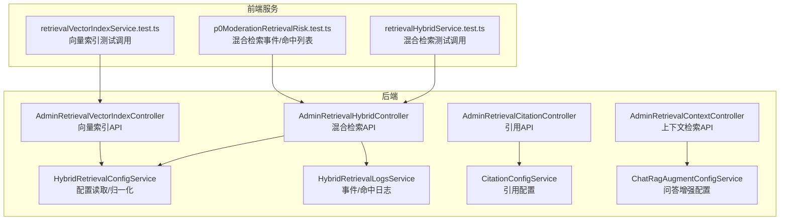
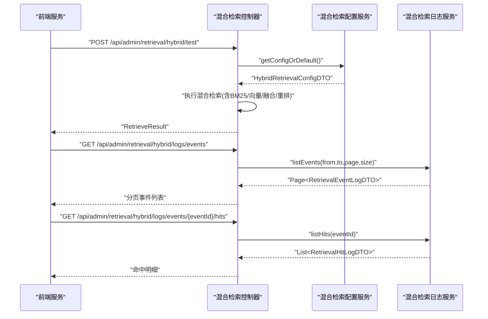
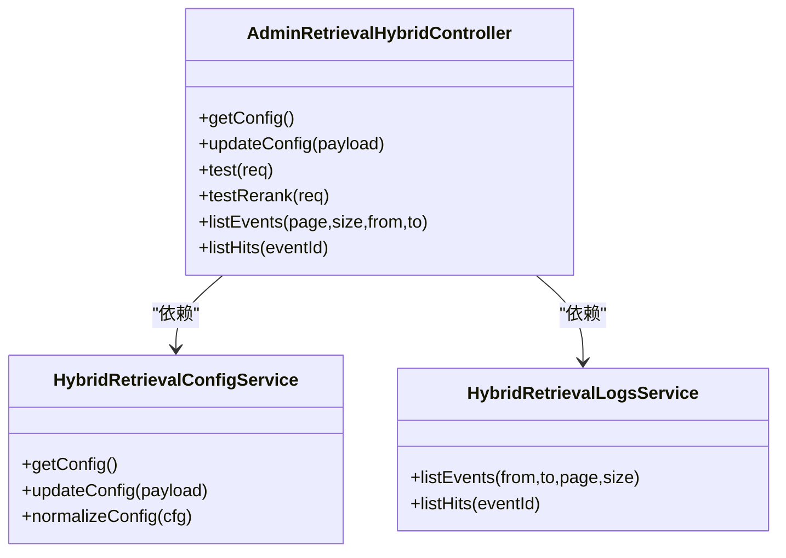
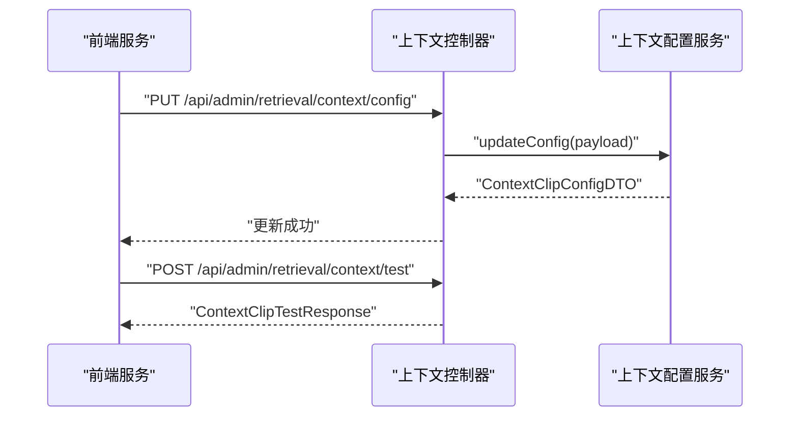
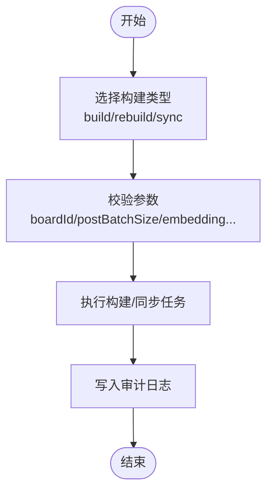
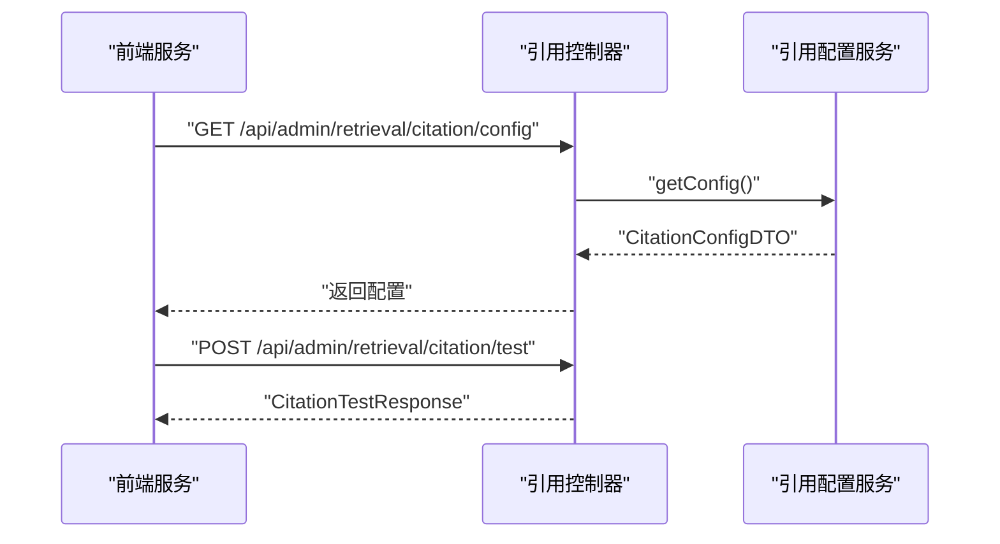
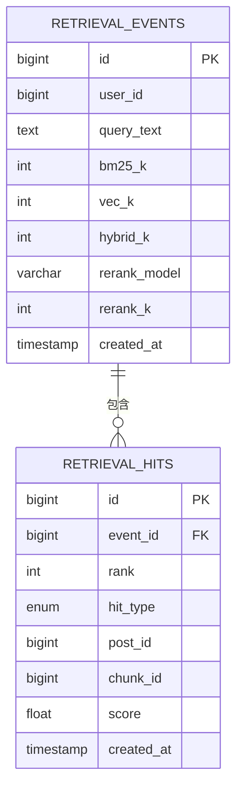
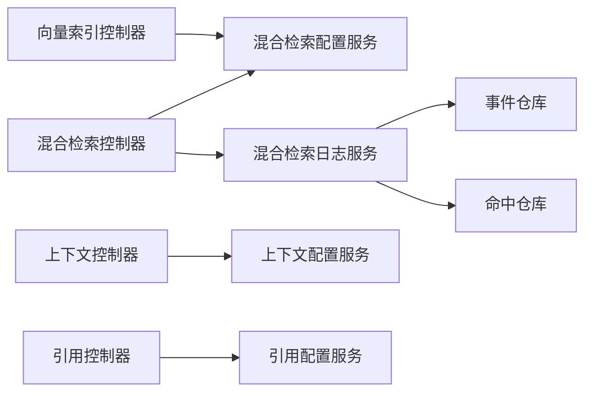

# 检索API

<cite>
**本文档引用的文件**
- [AdminRetrievalHybridController.java](file://src/main/java/com/example/EnterpriseRagCommunity/controller/retrieval/admin/AdminRetrievalHybridController.java)
- [AdminRetrievalContextController.java](file://src/main/java/com/example/EnterpriseRagCommunity/controller/retrieval/admin/AdminRetrievalContextController.java)
- [AdminRetrievalVectorIndexController.java](file://src/main/java/com/example/EnterpriseRagCommunity/controller/retrieval/admin/AdminRetrievalVectorIndexController.java)
- [AdminRetrievalCitationController.java](file://src/main/java/com/example/EnterpriseRagCommunity/controller/retrieval/admin/AdminRetrievalCitationController.java)
- [HybridRetrievalConfigService.java](file://src/main/java/com/example/EnterpriseRagCommunity/service/retrieval/admin/HybridRetrievalConfigService.java)
- [HybridRetrievalLogsService.java](file://src/main/java/com/example/EnterpriseRagCommunity/service/retrieval/admin/HybridRetrievalLogsService.java)
- [CitationConfigService.java](file://src/main/java/com/example/EnterpriseRagCommunity/service/retrieval/admin/CitationConfigService.java)
- [ChatRagAugmentConfigService.java](file://src/main/java/com/example/EnterpriseRagCommunity/service/retrieval/admin/ChatRagAugmentConfigService.java)
- [RetrievalEventsCreateDTO.java](file://src/main/java/com/example/EnterpriseRagCommunity/dto/semantic/RetrievalEventsCreateDTO.java)
- [RetrievalEventsUpdateDTO.java](file://src/main/java/com/example/EnterpriseRagCommunity/dto/semantic/RetrievalEventsUpdateDTO.java)
- [RetrievalEventsQueryDTO.java](file://src/main/java/com/example/EnterpriseRagCommunity/dto/semantic/RetrievalEventsQueryDTO.java)
- [RetrievalEventLogDTO.java](file://src/main/java/com/example/EnterpriseRagCommunity/dto/retrieval/RetrievalEventLogDTO.java)
- [RetrievalEventsRepository.java](file://src/main/java/com/example/EnterpriseRagCommunity/repository/semantic/RetrievalEventsRepository.java)
- [RetrievalHitsRepository.java](file://src/main/java/com/example/EnterpriseRagCommunity/repository/semantic/RetrievalHitsRepository.java)
- [HybridRetrievalConfigDTO.java](file://src/main/java/com/example/EnterpriseRagCommunity/dto/retrieval/HybridRetrievalConfigDTO.java)
- [retrievalHybridService.test.ts](file://my-vite-app/src/services/retrievalHybridService.test.ts)
- [p0ModerationRetrievalRisk.test.ts](file://my-vite-app/src/services/p0ModerationRetrievalRisk.test.ts)
- [p0ModerationRetrievalRisk.branches.test.ts](file://my-vite-app/src/services/p0ModerationRetrievalRisk.branches.test.ts)
- [retrievalVectorIndexService.test.ts](file://my-vite-app/src/services/retrievalVectorIndexService.test.ts)
</cite>

## 目录
1. [简介](#简介)
2. [项目结构](#项目结构)
3. [核心组件](#核心组件)
4. [架构总览](#架构总览)
5. [详细组件分析](#详细组件分析)
6. [依赖分析](#依赖分析)
7. [性能考虑](#性能考虑)
8. [故障排查指南](#故障排查指南)
9. [结论](#结论)
10. [附录](#附录)

## 简介
本文件系统性梳理企业级RAG社区项目的检索API，覆盖以下能力：
- RAG问答：基于混合检索的问答增强流程
- 引用管理：引用配置、引用测试与展示
- 上下文检索：上下文裁剪配置、窗口日志与测试
- 混合检索：BM25、向量、文件向量多路召回与融合
- 向量索引：索引生命周期管理（构建/重建/增量同步）、查询测试
- 检索配置：运行时配置持久化与归一化
- 性能优化：TopK裁剪、Token预算控制、重排超时阈值
- 缓存策略：日志与命中记录的分页查询
- 增量更新：增量同步接口支持
- 评估与监控：事件与命中日志、埋点审计

## 项目结构
后端采用Spring MVC控制器层，按功能域划分admin子包；前端通过服务层封装HTTP调用，统一暴露检索相关的API。

**图表来源**
- [AdminRetrievalHybridController.java:1-271](file://src/main/java/com/example/EnterpriseRagCommunity/controller/retrieval/admin/AdminRetrievalHybridController.java#L1-L271)
- [AdminRetrievalContextController.java:1-86](file://src/main/java/com/example/EnterpriseRagCommunity/controller/retrieval/admin/AdminRetrievalContextController.java#L1-L86)
- [AdminRetrievalVectorIndexController.java:1-555](file://src/main/java/com/example/EnterpriseRagCommunity/controller/retrieval/admin/AdminRetrievalVectorIndexController.java#L1-L555)
- [AdminRetrievalCitationController.java:1-46](file://src/main/java/com/example/EnterpriseRagCommunity/controller/retrieval/admin/AdminRetrievalCitationController.java#L1-L46)
- [HybridRetrievalConfigService.java:1-35](file://src/main/java/com/example/EnterpriseRagCommunity/service/retrieval/admin/HybridRetrievalConfigService.java#L1-L35)
- [HybridRetrievalLogsService.java:26-90](file://src/main/java/com/example/EnterpriseRagCommunity/service/retrieval/admin/HybridRetrievalLogsService.java#L26-L90)
- [CitationConfigService.java:1-34](file://src/main/java/com/example/EnterpriseRagCommunity/service/retrieval/admin/CitationConfigService.java#L1-L34)
- [ChatRagAugmentConfigService.java:1-36](file://src/main/java/com/example/EnterpriseRagCommunity/service/retrieval/admin/ChatRagAugmentConfigService.java#L1-L36)
- [retrievalHybridService.test.ts:36-58](file://my-vite-app/src/services/retrievalHybridService.test.ts#L36-L58)
- [retrievalVectorIndexService.test.ts:30-40](file://my-vite-app/src/services/retrievalVectorIndexService.test.ts#L30-L40)
- [p0ModerationRetrievalRisk.test.ts:195-208](file://my-vite-app/src/services/p0ModerationRetrievalRisk.test.ts#L195-L208)

**章节来源**
- [AdminRetrievalHybridController.java:1-271](file://src/main/java/com/example/EnterpriseRagCommunity/controller/retrieval/admin/AdminRetrievalHybridController.java#L1-L271)
- [AdminRetrievalContextController.java:1-86](file://src/main/java/com/example/EnterpriseRagCommunity/controller/retrieval/admin/AdminRetrievalContextController.java#L1-L86)
- [AdminRetrievalVectorIndexController.java:1-555](file://src/main/java/com/example/EnterpriseRagCommunity/controller/retrieval/admin/AdminRetrievalVectorIndexController.java#L1-L555)
- [AdminRetrievalCitationController.java:1-46](file://src/main/java/com/example/EnterpriseRagCommunity/controller/retrieval/admin/AdminRetrievalCitationController.java#L1-L46)

## 核心组件
- 混合检索控制器：提供配置读取/更新、测试检索、测试重排、事件与命中日志查询
- 上下文检索控制器：提供上下文裁剪配置读取/更新、测试、窗口日志查询
- 向量索引控制器：提供索引列表、创建/更新/删除、多类型构建/重建/增量同步、查询测试
- 引用控制器：提供引用配置读取/更新、测试
- 配置服务：从应用设置中读取JSON配置并归一化默认值
- 日志服务：事件与命中日志的分页查询与排序
- DTO与仓库：定义检索事件/命中数据结构及JPA查询接口

**章节来源**
- [HybridRetrievalConfigService.java:1-35](file://src/main/java/com/example/EnterpriseRagCommunity/service/retrieval/admin/HybridRetrievalConfigService.java#L1-L35)
- [HybridRetrievalLogsService.java:26-90](file://src/main/java/com/example/EnterpriseRagCommunity/service/retrieval/admin/HybridRetrievalLogsService.java#L26-L90)
- [RetrievalEventsCreateDTO.java:1-40](file://src/main/java/com/example/EnterpriseRagCommunity/dto/semantic/RetrievalEventsCreateDTO.java#L1-L40)
- [RetrievalEventsUpdateDTO.java:1-44](file://src/main/java/com/example/EnterpriseRagCommunity/dto/semantic/RetrievalEventsUpdateDTO.java#L1-L44)
- [RetrievalEventsQueryDTO.java:1-46](file://src/main/java/com/example/EnterpriseRagCommunity/dto/semantic/RetrievalEventsQueryDTO.java#L1-L46)
- [RetrievalEventLogDTO.java:1-19](file://src/main/java/com/example/EnterpriseRagCommunity/dto/retrieval/RetrievalEventLogDTO.java#L1-L19)
- [RetrievalEventsRepository.java:1-21](file://src/main/java/com/example/EnterpriseRagCommunity/repository/semantic/RetrievalEventsRepository.java#L1-L21)
- [RetrievalHitsRepository.java:1-25](file://src/main/java/com/example/EnterpriseRagCommunity/repository/semantic/RetrievalHitsRepository.java#L1-L25)

## 架构总览
检索API围绕“配置-执行-日志”闭环设计，前端通过服务层发起请求，后端控制器协调服务层完成检索与索引操作，并持久化事件与命中记录供后续评估与监控。

**图表来源**
- [AdminRetrievalHybridController.java:63-77](file://src/main/java/com/example/EnterpriseRagCommunity/controller/retrieval/admin/AdminRetrievalHybridController.java#L63-L77)
- [AdminRetrievalHybridController.java:211-226](file://src/main/java/com/example/EnterpriseRagCommunity/controller/retrieval/admin/AdminRetrievalHybridController.java#L211-L226)
- [HybridRetrievalConfigService.java:22-35](file://src/main/java/com/example/EnterpriseRagCommunity/service/retrieval/admin/HybridRetrievalConfigService.java#L22-L35)
- [HybridRetrievalLogsService.java:30-57](file://src/main/java/com/example/EnterpriseRagCommunity/service/retrieval/admin/HybridRetrievalLogsService.java#L30-L57)

## 详细组件分析

### 混合检索API
- 配置管理
  - GET /api/admin/retrieval/hybrid/config：读取当前混合检索配置
  - PUT /api/admin/retrieval/hybrid/config：更新配置（JSON）
- 测试检索
  - POST /api/admin/retrieval/hybrid/test：使用保存配置或请求体配置进行检索，返回最终命中
- 重排测试
  - POST /api/admin/retrieval/hybrid/test-rerank：对输入文档进行重排，支持调试模式输出预算与耗时
- 日志查询
  - GET /api/admin/retrieval/hybrid/logs/events：分页查询检索事件，支持from/to时间过滤
  - GET /api/admin/retrieval/hybrid/logs/events/{eventId}/hits：查询指定事件的命中明细

**图表来源**
- [AdminRetrievalHybridController.java:51-271](file://src/main/java/com/example/EnterpriseRagCommunity/controller/retrieval/admin/AdminRetrievalHybridController.java#L51-L271)
- [HybridRetrievalConfigService.java:1-35](file://src/main/java/com/example/EnterpriseRagCommunity/service/retrieval/admin/HybridRetrievalConfigService.java#L1-L35)
- [HybridRetrievalLogsService.java:26-90](file://src/main/java/com/example/EnterpriseRagCommunity/service/retrieval/admin/HybridRetrievalLogsService.java#L26-L90)

**章节来源**
- [AdminRetrievalHybridController.java:51-271](file://src/main/java/com/example/EnterpriseRagCommunity/controller/retrieval/admin/AdminRetrievalHybridController.java#L51-L271)
- [HybridRetrievalConfigDTO.java:1-36](file://src/main/java/com/example/EnterpriseRagCommunity/dto/retrieval/HybridRetrievalConfigDTO.java#L1-L36)
- [RetrievalEventLogDTO.java:1-19](file://src/main/java/com/example/EnterpriseRagCommunity/dto/retrieval/RetrievalEventLogDTO.java#L1-L19)

### 上下文检索API
- 配置管理
  - GET /api/admin/retrieval/context/config：读取上下文裁剪配置
  - PUT /api/admin/retrieval/context/config：更新配置
- 测试
  - POST /api/admin/retrieval/context/test：对输入文本进行上下文裁剪测试
- 日志查询
  - GET /api/admin/retrieval/context/logs/windows：分页查询上下文窗口日志
  - GET /api/admin/retrieval/context/logs/windows/{id}：查询指定窗口详情

**图表来源**
- [AdminRetrievalContextController.java:40-86](file://src/main/java/com/example/EnterpriseRagCommunity/controller/retrieval/admin/AdminRetrievalContextController.java#L40-L86)
- [ChatRagAugmentConfigService.java:1-36](file://src/main/java/com/example/EnterpriseRagCommunity/service/retrieval/admin/ChatRagAugmentConfigService.java#L1-L36)

**章节来源**
- [AdminRetrievalContextController.java:1-86](file://src/main/java/com/example/EnterpriseRagCommunity/controller/retrieval/admin/AdminRetrievalContextController.java#L1-L86)
- [ChatRagAugmentConfigService.java:1-36](file://src/main/java/com/example/EnterpriseRagCommunity/service/retrieval/admin/ChatRagAugmentConfigService.java#L1-L36)

### 向量索引API
- 索引管理
  - GET /api/admin/retrieval/vector-indices?page&size：列出所有向量索引
  - POST /api/admin/retrieval/vector-indices：创建索引
  - PUT /api/admin/retrieval/vector-indices/{id}：更新索引
  - DELETE /api/admin/retrieval/vector-indices/{id}：删除索引
- 构建/重建/增量同步
  - POST /api/admin/retrieval/vector-indices/{id}/build/posts
  - POST /api/admin/retrieval/vector-indices/{id}/rebuild/posts
  - POST /api/admin/retrieval/vector-indices/{id}/sync/posts
  - POST /api/admin/retrieval/vector-indices/{id}/build/comments
  - POST /api/admin/retrieval/vector-indices/{id}/rebuild/comments
  - POST /api/admin/retrieval/vector-indices/{id}/sync/comments
  - POST /api/admin/retrieval/vector-indices/{id}/build/files
  - POST /api/admin/retrieval/vector-indices/{id}/rebuild/files
  - POST /api/admin/retrieval/vector-indices/{id}/sync/files
- 查询测试
  - POST /api/admin/retrieval/vector-indices/{id}/test-query
  - POST /api/admin/retrieval/vector-indices/{id}/test-query/comments
  - POST /api/admin/retrieval/vector-indices/{id}/test-query/files

**图表来源**
- [AdminRetrievalVectorIndexController.java:143-555](file://src/main/java/com/example/EnterpriseRagCommunity/controller/retrieval/admin/AdminRetrievalVectorIndexController.java#L143-L555)

**章节来源**
- [AdminRetrievalVectorIndexController.java:1-555](file://src/main/java/com/example/EnterpriseRagCommunity/controller/retrieval/admin/AdminRetrievalVectorIndexController.java#L1-L555)

### 引用API
- 配置管理
  - GET /api/admin/retrieval/citation/config：读取引用配置
  - PUT /api/admin/retrieval/citation/config：更新配置
- 测试
  - POST /api/admin/retrieval/citation/test：对输入内容进行引用测试

**图表来源**
- [AdminRetrievalCitationController.java:27-44](file://src/main/java/com/example/EnterpriseRagCommunity/controller/retrieval/admin/AdminRetrievalCitationController.java#L27-L44)
- [CitationConfigService.java:1-34](file://src/main/java/com/example/EnterpriseRagCommunity/service/retrieval/admin/CitationConfigService.java#L1-L34)

**章节来源**
- [AdminRetrievalCitationController.java:1-46](file://src/main/java/com/example/EnterpriseRagCommunity/controller/retrieval/admin/AdminRetrievalCitationController.java#L1-L46)
- [CitationConfigService.java:1-34](file://src/main/java/com/example/EnterpriseRagCommunity/service/retrieval/admin/CitationConfigService.java#L1-L34)

### 检索配置与归一化
- 配置键名
  - 混合检索：retrieval_hybrid_config（兼容旧键 retrieval.hybrid.config.json）
  - 引用：retrieval.citation.config.json
  - 聊天RAG增强：retrieval.chat.rag.config.json
- 归一化策略
  - 解析失败或为空时回退到默认配置
  - 对权重、TopK、Token预算等进行边界约束

**章节来源**
- [HybridRetrievalConfigService.java:16-35](file://src/main/java/com/example/EnterpriseRagCommunity/service/retrieval/admin/HybridRetrievalConfigService.java#L16-L35)
- [CitationConfigService.java:14-34](file://src/main/java/com/example/EnterpriseRagCommunity/service/retrieval/admin/CitationConfigService.java#L14-L34)
- [ChatRagAugmentConfigService.java:16-36](file://src/main/java/com/example/EnterpriseRagCommunity/service/retrieval/admin/ChatRagAugmentConfigService.java#L16-L36)

### 事件与命中日志
- 事件日志
  - 字段：用户ID、查询文本、BM25/向量/融合TopK、重排模型与TopK、创建时间
  - 支持按时间范围、用户ID、查询文本等条件查询
- 命中日志
  - 字段：事件ID、排名、命中类型、帖子ID/块ID、分数
  - 支持按事件ID查询并按排名排序

**图表来源**
- [RetrievalEventsCreateDTO.java:13-38](file://src/main/java/com/example/EnterpriseRagCommunity/dto/semantic/RetrievalEventsCreateDTO.java#L13-L38)
- [RetrievalEventsUpdateDTO.java:15-42](file://src/main/java/com/example/EnterpriseRagCommunity/dto/semantic/RetrievalEventsUpdateDTO.java#L15-L42)
- [RetrievalEventsQueryDTO.java:10-46](file://src/main/java/com/example/EnterpriseRagCommunity/dto/semantic/RetrievalEventsQueryDTO.java#L10-L46)
- [RetrievalEventLogDTO.java:8-18](file://src/main/java/com/example/EnterpriseRagCommunity/dto/retrieval/RetrievalEventLogDTO.java#L8-L18)
- [RetrievalEventsRepository.java:12-21](file://src/main/java/com/example/EnterpriseRagCommunity/repository/semantic/RetrievalEventsRepository.java#L12-L21)
- [RetrievalHitsRepository.java:12-25](file://src/main/java/com/example/EnterpriseRagCommunity/repository/semantic/RetrievalHitsRepository.java#L12-L25)

**章节来源**
- [HybridRetrievalLogsService.java:29-90](file://src/main/java/com/example/EnterpriseRagCommunity/service/retrieval/admin/HybridRetrievalLogsService.java#L29-L90)
- [RetrievalEventsRepository.java:1-21](file://src/main/java/com/example/EnterpriseRagCommunity/repository/semantic/RetrievalEventsRepository.java#L1-L21)
- [RetrievalHitsRepository.java:1-25](file://src/main/java/com/example/EnterpriseRagCommunity/repository/semantic/RetrievalHitsRepository.java#L1-L25)

## 依赖分析
- 控制器依赖服务层，服务层依赖应用设置与AI网关
- 日志服务依赖JPA仓库进行事件与命中查询
- 前端服务通过HTTP调用后端API，测试用例验证URL参数与响应结构

**图表来源**
- [AdminRetrievalHybridController.java:45-49](file://src/main/java/com/example/EnterpriseRagCommunity/controller/retrieval/admin/AdminRetrievalHybridController.java#L45-L49)
- [HybridRetrievalConfigService.java:19-20](file://src/main/java/com/example/EnterpriseRagCommunity/service/retrieval/admin/HybridRetrievalConfigService.java#L19-L20)
- [HybridRetrievalLogsService.java:26-27](file://src/main/java/com/example/EnterpriseRagCommunity/service/retrieval/admin/HybridRetrievalLogsService.java#L26-L27)
- [RetrievalEventsRepository.java:1-10](file://src/main/java/com/example/EnterpriseRagCommunity/repository/semantic/RetrievalEventsRepository.java#L1-L10)
- [RetrievalHitsRepository.java:1-9](file://src/main/java/com/example/EnterpriseRagCommunity/repository/semantic/RetrievalHitsRepository.java#L1-L9)

**章节来源**
- [retrievalHybridService.test.ts:36-58](file://my-vite-app/src/services/retrievalHybridService.test.ts#L36-L58)
- [p0ModerationRetrievalRisk.branches.test.ts:30-53](file://my-vite-app/src/services/p0ModerationRetrievalRisk.branches.test.ts#L30-L53)
- [retrievalVectorIndexService.test.ts:30-40](file://my-vite-app/src/services/retrievalVectorIndexService.test.ts#L30-L40)

## 性能考虑
- TopK裁剪
  - BM25/向量/融合/重排均支持TopK参数，避免返回过多候选
- Token预算控制
  - 重排前对文档长度进行近似Token估算与截断，防止输入超限
- 超时与慢查询阈值
  - 重排支持超时与慢查询阈值配置，便于限流与告警
- 分页与排序
  - 日志查询默认降序按创建时间，分页大小限制在合理区间

**章节来源**
- [AdminRetrievalHybridController.java:123-138](file://src/main/java/com/example/EnterpriseRagCommunity/controller/retrieval/admin/AdminRetrievalHybridController.java#L123-L138)
- [AdminRetrievalHybridController.java:256-269](file://src/main/java/com/example/EnterpriseRagCommunity/controller/retrieval/admin/AdminRetrievalHybridController.java#L256-L269)
- [HybridRetrievalConfigDTO.java:24-35](file://src/main/java/com/example/EnterpriseRagCommunity/dto/retrieval/HybridRetrievalConfigDTO.java#L24-L35)
- [HybridRetrievalLogsService.java:30-43](file://src/main/java/com/example/EnterpriseRagCommunity/service/retrieval/admin/HybridRetrievalLogsService.java#L30-L43)

## 故障排查指南
- 混合检索测试失败
  - 检查请求体是否包含必要字段（查询文本、文档列表）
  - 查看重排错误信息与延迟统计
- 日志查询无数据
  - 确认时间范围参数格式正确且在允许范围内
  - 检查分页参数是否越界
- 向量索引构建异常
  - 关注审计日志中的失败原因
  - 检查嵌入模型、维度与提供商参数

**章节来源**
- [retrievalHybridService.test.ts:36-45](file://my-vite-app/src/services/retrievalHybridService.test.ts#L36-L45)
- [p0ModerationRetrievalRisk.test.ts:195-208](file://my-vite-app/src/services/p0ModerationRetrievalRisk.test.ts#L195-L208)
- [AdminRetrievalHybridController.java:191-196](file://src/main/java/com/example/EnterpriseRagCommunity/controller/retrieval/admin/AdminRetrievalHybridController.java#L191-L196)

## 结论
该检索API以混合检索为核心，结合上下文裁剪、引用管理与向量索引，形成完整的RAG检索体系。通过配置服务实现灵活的运行时配置，借助日志服务提供可观测性与评估基础。前端服务通过统一的HTTP接口与后端交互，便于集成与扩展。

## 附录
- 前端测试用例覆盖了混合检索事件与命中列表的URL参数与分页行为，可作为集成测试参考
- 向量索引测试用例验证了默认分页参数与路径参数的正确性

**章节来源**
- [p0ModerationRetrievalRisk.branches.test.ts:30-53](file://my-vite-app/src/services/p0ModerationRetrievalRisk.branches.test.ts#L30-L53)
- [retrievalVectorIndexService.test.ts:30-40](file://my-vite-app/src/services/retrievalVectorIndexService.test.ts#L30-L40)