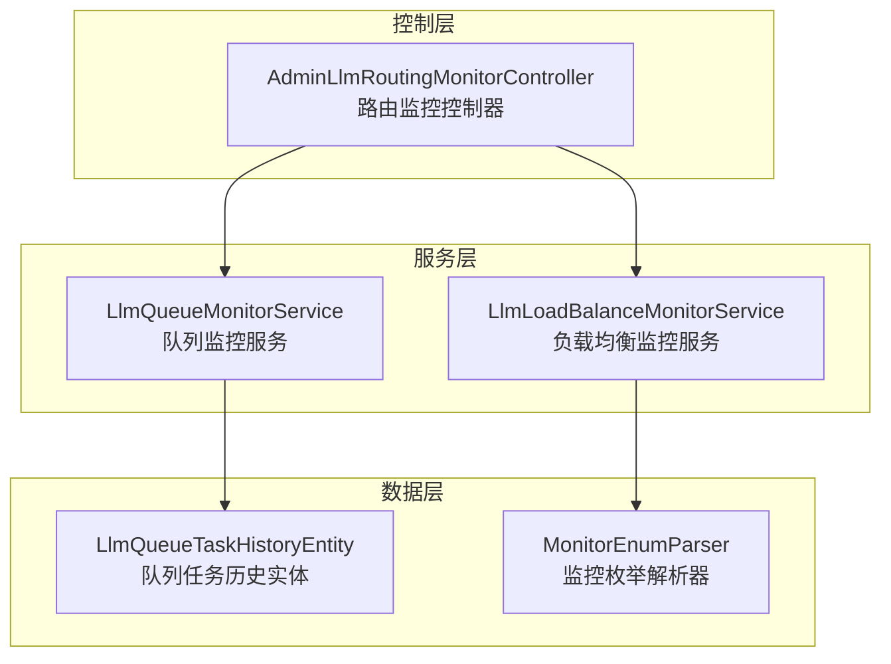
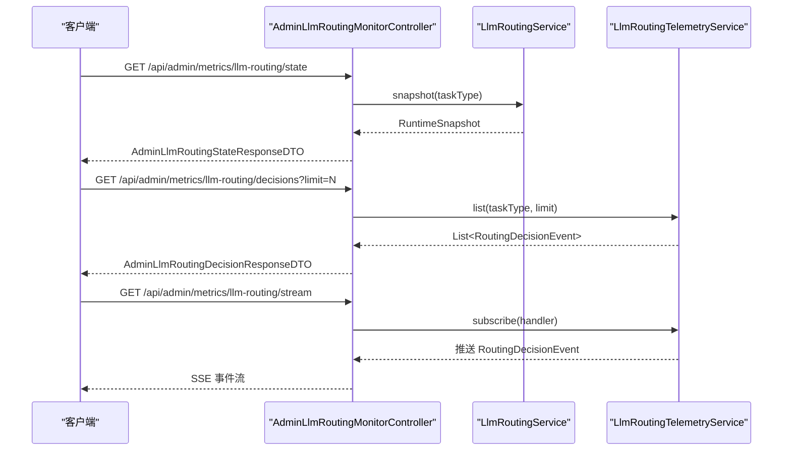
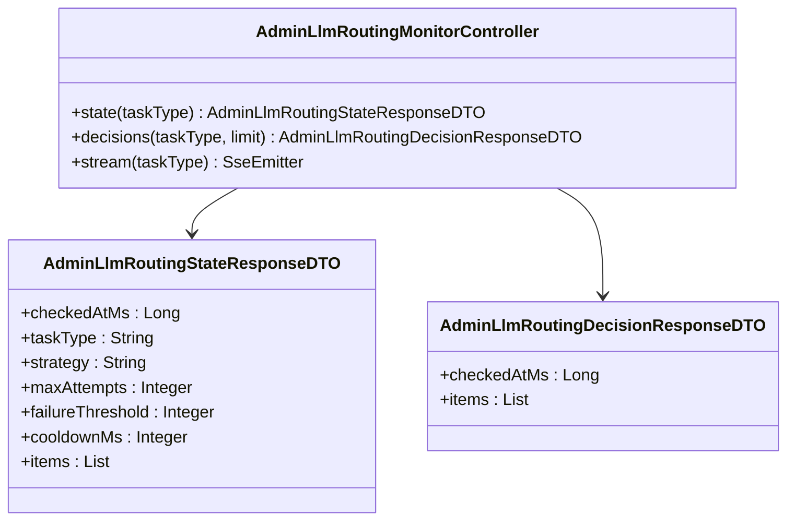
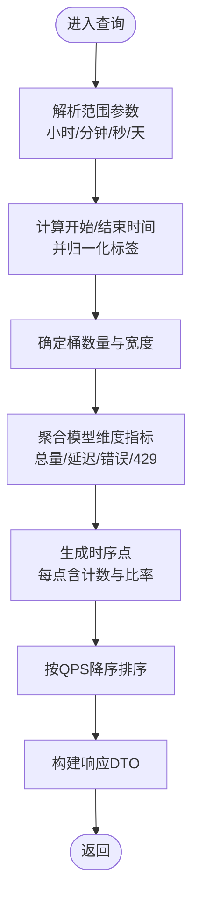
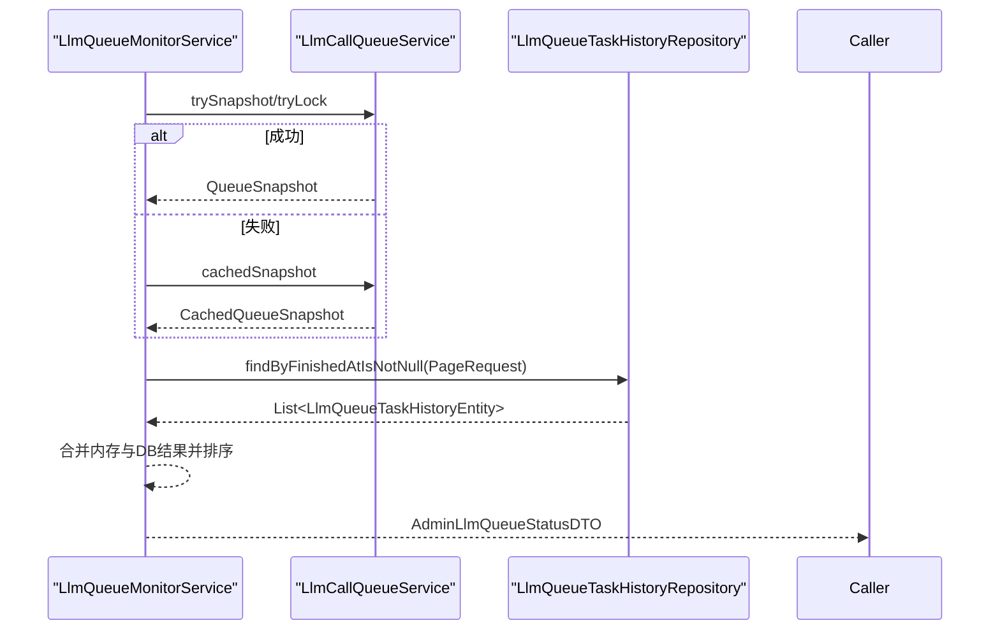
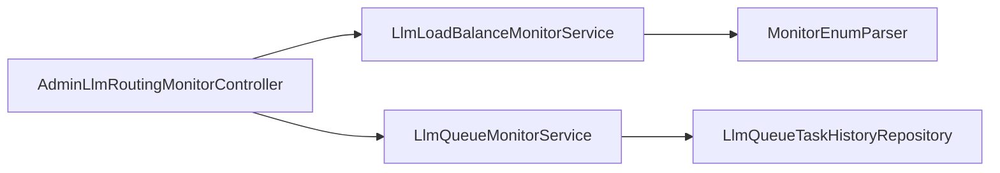

# 监控API

<cite>
**本文引用的文件**
- [AdminLlmRoutingMonitorController.java](file://src/main/java/com/example/EnterpriseRagCommunity/controller/monitor/admin/AdminLlmRoutingMonitorController.java)
- [LlmLoadBalanceMonitorService.java](file://src/main/java/com/example/EnterpriseRagCommunity/service/monitor/LlmLoadBalanceMonitorService.java)
- [LlmQueueMonitorService.java](file://src/main/java/com/example/EnterpriseRagCommunity/service/monitor/LlmQueueMonitorService.java)
- [AdminLlmRoutingStateResponseDTO.java](file://src/main/java/com/example/EnterpriseRagCommunity/dto/monitor/AdminLlmRoutingStateResponseDTO.java)
- [AdminLlmRoutingDecisionResponseDTO.java](file://src/main/java/com/example/EnterpriseRagCommunity/dto/monitor/AdminLlmRoutingDecisionResponseDTO.java)
- [MonitorEnumParser.java](file://src/main/java/com/example/EnterpriseRagCommunity/entity/monitor/enums/MonitorEnumParser.java)
- [LlmQueueTaskHistoryEntity.java](file://src/main/java/com/example/EnterpriseRagCommunity/entity/monitor/LlmQueueTaskHistoryEntity.java)
</cite>

## 目录
1. [引言](#引言)
2. [项目结构](#项目结构)
3. [核心组件](#核心组件)
4. [架构总览](#架构总览)
5. [详细组件分析](#详细组件分析)
6. [依赖分析](#依赖分析)
7. [性能考虑](#性能考虑)
8. [故障排查指南](#故障排查指南)
9. [结论](#结论)
10. [附录](#附录)

## 引言
本文件面向运维与平台工程团队，系统性梳理企业级RAG社区项目的监控API能力，覆盖LLM负载测试、队列监控、路由监控、令牌计量（吞吐与延迟）、熔断器策略状态等运维管理功能。文档从端点设计、数据采集与存储、可视化与告警接入、健康检查与容量规划、性能优化与故障排查等方面给出可操作的规范与图示，帮助在生产环境中稳定运行与持续优化。

## 项目结构
监控API主要由三层构成：
- 控制层：对外暴露REST/SSE端点，负责参数解析、鉴权与响应封装
- 服务层：执行业务逻辑，进行时间序列聚合、缓存与限流、采样平滑等
- 数据层：持久化与枚举解析工具，支撑历史任务回溯与类型安全

**图表来源**
- [AdminLlmRoutingMonitorController.java:1-154](file://src/main/java/com/example/EnterpriseRagCommunity/controller/monitor/admin/AdminLlmRoutingMonitorController.java#L1-L154)
- [LlmLoadBalanceMonitorService.java:1-147](file://src/main/java/com/example/EnterpriseRagCommunity/service/monitor/LlmLoadBalanceMonitorService.java#L1-L147)
- [LlmQueueMonitorService.java:1-397](file://src/main/java/com/example/EnterpriseRagCommunity/service/monitor/LlmQueueMonitorService.java#L1-L397)
- [LlmQueueTaskHistoryEntity.java](file://src/main/java/com/example/EnterpriseRagCommunity/entity/monitor/LlmQueueTaskHistoryEntity.java)
- [MonitorEnumParser.java:1-24](file://src/main/java/com/example/EnterpriseRagCommunity/entity/monitor/enums/MonitorEnumParser.java#L1-L24)

**章节来源**
- [AdminLlmRoutingMonitorController.java:1-154](file://src/main/java/com/example/EnterpriseRagCommunity/controller/monitor/admin/AdminLlmRoutingMonitorController.java#L1-L154)
- [LlmLoadBalanceMonitorService.java:1-147](file://src/main/java/com/example/EnterpriseRagCommunity/service/monitor/LlmLoadBalanceMonitorService.java#L1-L147)
- [LlmQueueMonitorService.java:1-397](file://src/main/java/com/example/EnterpriseRagCommunity/service/monitor/LlmQueueMonitorService.java#L1-L397)
- [MonitorEnumParser.java:1-24](file://src/main/java/com/example/EnterpriseRagCommunity/entity/monitor/enums/MonitorEnumParser.java#L1-L24)
- [LlmQueueTaskHistoryEntity.java](file://src/main/java/com/example/EnterpriseRagCommunity/entity/monitor/LlmQueueTaskHistoryEntity.java)

## 核心组件
- 路由监控控制器：提供路由状态、决策事件列表与实时SSE流，支持按任务类型过滤
- 负载均衡监控服务：按时间窗口聚合模型维度的调用量、QPS、错误率、429限流率与P95延迟，并输出时序点
- 队列监控服务：提供队列快照、运行/等待/完成任务列表、最近完成任务合并缓存、令牌吞吐采样与平滑、任务详情回溯
- 枚举解析器：统一处理监控相关枚举的空值与大小写容错
- 队列任务历史实体：持久化已完成任务，用于离线回溯与详情查询

**章节来源**
- [AdminLlmRoutingMonitorController.java:30-154](file://src/main/java/com/example/EnterpriseRagCommunity/controller/monitor/admin/AdminLlmRoutingMonitorController.java#L30-L154)
- [LlmLoadBalanceMonitorService.java:24-75](file://src/main/java/com/example/EnterpriseRagCommunity/service/monitor/LlmLoadBalanceMonitorService.java#L24-L75)
- [LlmQueueMonitorService.java:152-203](file://src/main/java/com/example/EnterpriseRagCommunity/service/monitor/LlmQueueMonitorService.java#L152-L203)
- [MonitorEnumParser.java:9-22](file://src/main/java/com/example/EnterpriseRagCommunity/entity/monitor/enums/MonitorEnumParser.java#L9-L22)
- [LlmQueueTaskHistoryEntity.java](file://src/main/java/com/example/EnterpriseRagCommunity/entity/monitor/LlmQueueTaskHistoryEntity.java)

## 架构总览
监控API通过控制器将请求路由到对应服务，服务层组合内部快照、缓存与数据库查询，最终以DTO响应。SSE用于实时推送路由决策事件，便于前端仪表盘即时展示。

**图表来源**
- [AdminLlmRoutingMonitorController.java:30-141](file://src/main/java/com/example/EnterpriseRagCommunity/controller/monitor/admin/AdminLlmRoutingMonitorController.java#L30-L141)

**章节来源**
- [AdminLlmRoutingMonitorController.java:30-141](file://src/main/java/com/example/EnterpriseRagCommunity/controller/monitor/admin/AdminLlmRoutingMonitorController.java#L30-L141)

## 详细组件分析

### 路由监控组件
- 端点
  - GET /api/admin/metrics/llm-routing/state：返回当前路由策略与目标权重/优先级/QPS/运行数/连续失败/冷却剩余等状态
  - GET /api/admin/metrics/llm-routing/decisions：返回最近路由决策事件列表，支持limit限制
  - GET /api/admin/metrics/llm-routing/stream：SSE实时推送路由决策事件，支持按任务类型过滤
- 参数与权限
  - taskType：可选，支持CHAT或具体枚举名，默认为多模态聊天
  - limit：可选，1~10000，默认200
  - 访问控制：需要特定管理员权限
- 数据模型
  - 状态响应DTO：包含检查时间、任务类型、策略信息与目标项列表
  - 决策响应DTO：包含检查时间与事件列表

**图表来源**
- [AdminLlmRoutingMonitorController.java:30-141](file://src/main/java/com/example/EnterpriseRagCommunity/controller/monitor/admin/AdminLlmRoutingMonitorController.java#L30-L141)
- [AdminLlmRoutingStateResponseDTO.java:1-20](file://src/main/java/com/example/EnterpriseRagCommunity/dto/monitor/AdminLlmRoutingStateResponseDTO.java#L1-L20)
- [AdminLlmRoutingDecisionResponseDTO.java:1-13](file://src/main/java/com/example/EnterpriseRagCommunity/dto/monitor/AdminLlmRoutingDecisionResponseDTO.java#L1-L13)

**章节来源**
- [AdminLlmRoutingMonitorController.java:30-141](file://src/main/java/com/example/EnterpriseRagCommunity/controller/monitor/admin/AdminLlmRoutingMonitorController.java#L30-L141)
- [AdminLlmRoutingStateResponseDTO.java:1-20](file://src/main/java/com/example/EnterpriseRagCommunity/dto/monitor/AdminLlmRoutingStateResponseDTO.java#L1-L20)
- [AdminLlmRoutingDecisionResponseDTO.java:1-13](file://src/main/java/com/example/EnterpriseRagCommunity/dto/monitor/AdminLlmRoutingDecisionResponseDTO.java#L1-L13)

### 负载均衡监控组件
- 功能
  - 按范围查询：支持小时/分钟/秒/天等单位的时间范围，自动归一化标签
  - 维度聚合：按提供商与模型聚合统计量（总量、QPS、平均/95分位延迟、错误率、429限流率）
  - 时间分桶：根据窗口与桶数量生成等宽时序点，每个点包含计数与比率
  - 排序：按QPS降序排列模型
- 关键配置
  - 桶数量：通过属性注入，限制在合理区间
- 输入校验
  - 范围与单位转换，最小/最大范围约束，标签归一化

**图表来源**
- [LlmLoadBalanceMonitorService.java:24-75](file://src/main/java/com/example/EnterpriseRagCommunity/service/monitor/LlmLoadBalanceMonitorService.java#L24-L75)
- [LlmLoadBalanceMonitorService.java:77-134](file://src/main/java/com/example/EnterpriseRagCommunity/service/monitor/LlmLoadBalanceMonitorService.java#L77-L134)

**章节来源**
- [LlmLoadBalanceMonitorService.java:24-147](file://src/main/java/com/example/EnterpriseRagCommunity/service/monitor/LlmLoadBalanceMonitorService.java#L24-L147)

### 队列监控组件
- 功能
  - 快照查询：支持窗口、运行/等待/完成任务的限制，带过期标记
  - 实时采样：定时采集队列长度、运行数与令牌吞吐，进行指数衰减平滑
  - 最近完成任务合并：内存快照与数据库最近完成任务合并，带缓存与去重
  - 任务详情：优先从运行时快照获取，否则回退到历史实体
- 关键机制
  - 平滑算法：当无瞬时吞吐时基于最近非零值做指数衰减，维持60s保活窗口
  - 缓存：最近完成任务列表带TTL，避免频繁DB查询
  - 截断：对超限的运行/等待/完成任务集合进行截断并标记

**图表来源**
- [LlmQueueMonitorService.java:152-203](file://src/main/java/com/example/EnterpriseRagCommunity/service/monitor/LlmQueueMonitorService.java#L152-L203)
- [LlmQueueMonitorService.java:243-269](file://src/main/java/com/example/EnterpriseRagCommunity/service/monitor/LlmQueueMonitorService.java#L243-L269)
- [LlmQueueMonitorService.java:271-301](file://src/main/java/com/example/EnterpriseRagCommunity/service/monitor/LlmQueueMonitorService.java#L271-L301)

**章节来源**
- [LlmQueueMonitorService.java:57-120](file://src/main/java/com/example/EnterpriseRagCommunity/service/monitor/LlmQueueMonitorService.java#L57-L120)
- [LlmQueueMonitorService.java:152-203](file://src/main/java/com/example/EnterpriseRagCommunity/service/monitor/LlmQueueMonitorService.java#L152-L203)
- [LlmQueueMonitorService.java:205-212](file://src/main/java/com/example/EnterpriseRagCommunity/service/monitor/LlmQueueMonitorService.java#L205-L212)
- [LlmQueueMonitorService.java:243-301](file://src/main/java/com/example/EnterpriseRagCommunity/service/monitor/LlmQueueMonitorService.java#L243-L301)
- [LlmQueueTaskHistoryEntity.java](file://src/main/java/com/example/EnterpriseRagCommunity/entity/monitor/LlmQueueTaskHistoryEntity.java)

### 枚举解析与类型安全
- MonitorEnumParser提供通用的空值与大小写容错的枚举解析，避免非法字符串导致异常

**章节来源**
- [MonitorEnumParser.java:9-22](file://src/main/java/com/example/EnterpriseRagCommunity/entity/monitor/enums/MonitorEnumParser.java#L9-L22)

## 依赖分析
- 控制器依赖服务层；服务层依赖队列服务与仓库；负载均衡服务依赖时序查询服务（属性注入）；枚举解析器为纯工具类
- 无循环依赖，职责清晰

**图表来源**
- [AdminLlmRoutingMonitorController.java:27-28](file://src/main/java/com/example/EnterpriseRagCommunity/controller/monitor/admin/AdminLlmRoutingMonitorController.java#L27-L28)
- [LlmLoadBalanceMonitorService.java:19](file://src/main/java/com/example/EnterpriseRagCommunity/service/monitor/LlmLoadBalanceMonitorService.java#L19)
- [LlmQueueMonitorService.java:40-42](file://src/main/java/com/example/EnterpriseRagCommunity/service/monitor/LlmQueueMonitorService.java#L40-L42)
- [MonitorEnumParser.java:1-24](file://src/main/java/com/example/EnterpriseRagCommunity/entity/monitor/enums/MonitorEnumParser.java#L1-L24)

**章节来源**
- [AdminLlmRoutingMonitorController.java:27-28](file://src/main/java/com/example/EnterpriseRagCommunity/controller/monitor/admin/AdminLlmRoutingMonitorController.java#L27-L28)
- [LlmLoadBalanceMonitorService.java:19](file://src/main/java/com/example/EnterpriseRagCommunity/service/monitor/LlmLoadBalanceMonitorService.java#L19)
- [LlmQueueMonitorService.java:40-42](file://src/main/java/com/example/EnterpriseRagCommunity/service/monitor/LlmQueueMonitorService.java#L40-L42)
- [MonitorEnumParser.java:1-24](file://src/main/java/com/example/EnterpriseRagCommunity/entity/monitor/enums/MonitorEnumParser.java#L1-L24)

## 性能考虑
- 队列采样与平滑
  - 采样频率：每秒一次，保留1小时样本窗口，避免过度内存占用
  - 平滑策略：瞬时吞吐为0时基于最近非零值做指数衰减，保持60s保活窗口，减少抖动
- 最近完成任务合并
  - 内存与DB合并，带TTL缓存，限制DB拉取条数，降低热点压力
- 路由SSE
  - 无超时上限，订阅者需自行断线重连；按任务类型过滤，避免广播风暴
- 负载均衡聚合
  - 桶数量与窗口自适应，避免过小导致内存压力过大或过大导致精度下降

**章节来源**
- [LlmQueueMonitorService.java:57-120](file://src/main/java/com/example/EnterpriseRagCommunity/service/monitor/LlmQueueMonitorService.java#L57-L120)
- [LlmQueueMonitorService.java:271-301](file://src/main/java/com/example/EnterpriseRagCommunity/service/monitor/LlmQueueMonitorService.java#L271-L301)
- [LlmLoadBalanceMonitorService.java:21-32](file://src/main/java/com/example/EnterpriseRagCommunity/service/monitor/LlmLoadBalanceMonitorService.java#L21-L32)

## 故障排查指南
- 路由监控
  - 状态为空：确认任务类型是否正确，检查策略配置与目标权重/优先级
  - 决策列表为空：确认limit是否过小或过滤条件是否过于严格
  - SSE断流：检查订阅者连接生命周期与网络稳定性
- 队列监控
  - 快照过期：关注stale标记，必要时放宽限制或提高采样频率
  - 令牌吞吐为0：检查运行中任务是否有token输出，或是否存在长时间无输出的任务
  - 任务详情缺失：确认任务ID是否存在于历史表，或是否仍在运行中
- 负载均衡
  - 聚合异常：检查范围参数与单位，确保在最小/最大范围内
  - 时序点缺失：确认桶数量与窗口比例，避免过小导致精度不足

**章节来源**
- [AdminLlmRoutingMonitorController.java:30-141](file://src/main/java/com/example/EnterpriseRagCommunity/controller/monitor/admin/AdminLlmRoutingMonitorController.java#L30-L141)
- [LlmQueueMonitorService.java:165-203](file://src/main/java/com/example/EnterpriseRagCommunity/service/monitor/LlmQueueMonitorService.java#L165-L203)
- [LlmLoadBalanceMonitorService.java:77-108](file://src/main/java/com/example/EnterpriseRagCommunity/service/monitor/LlmLoadBalanceMonitorService.java#L77-L108)

## 结论
该监控API体系以“控制器-服务-数据”分层清晰、职责明确，既满足实时观测（SSE、采样平滑），也支持离线回溯（历史任务），并通过聚合指标（QPS、延迟、错误率、429率）与时间分桶，为容量规划、性能优化与故障排查提供了坚实的数据基础。建议结合告警规则与可视化面板，形成闭环的运维体系。

## 附录

### API端点一览与规范
- 路由监控
  - GET /api/admin/metrics/llm-routing/state
    - 查询参数：taskType（可选）
    - 返回：状态响应DTO（包含策略与目标项列表）
  - GET /api/admin/metrics/llm-routing/decisions
    - 查询参数：taskType（可选）、limit（1~10000）
    - 返回：决策事件列表DTO
  - GET /api/admin/metrics/llm-routing/stream
    - 查询参数：taskType（可选）
    - 返回：SSE事件流，事件名为routing，数据为决策事件DTO
- 队列监控
  - GET /api/admin/metrics/llm-queue/status
    - 查询参数：windowSec（10~3600）、limitRunning、limitPending、limitCompleted
    - 返回：队列状态DTO（含快照时间戳、过期标记、运行/等待/最近完成任务、采样序列）
  - GET /api/admin/metrics/llm-queue/task/{taskId}/detail
    - 路径参数：taskId
    - 返回：任务详情DTO（输入/输出、令牌统计、耗时等）
- 负载均衡
  - GET /api/admin/metrics/load-balance
    - 查询参数：range（支持1h/1m/1s/1d等）、hours（可选）
    - 返回：模型维度聚合与时间分桶结果

**章节来源**
- [AdminLlmRoutingMonitorController.java:30-141](file://src/main/java/com/example/EnterpriseRagCommunity/controller/monitor/admin/AdminLlmRoutingMonitorController.java#L30-L141)
- [LlmQueueMonitorService.java:152-203](file://src/main/java/com/example/EnterpriseRagCommunity/service/monitor/LlmQueueMonitorService.java#L152-L203)
- [LlmQueueMonitorService.java:205-212](file://src/main/java/com/example/EnterpriseRagCommunity/service/monitor/LlmQueueMonitorService.java#L205-L212)
- [LlmLoadBalanceMonitorService.java:24-75](file://src/main/java/com/example/EnterpriseRagCommunity/service/monitor/LlmLoadBalanceMonitorService.java#L24-L75)

### 监控数据采集、存储与可视化
- 采集
  - 队列：定时采样队列长度、运行数与令牌吞吐，指数平滑处理
  - 路由：订阅决策事件，按任务类型过滤
  - 负载均衡：按时间窗口聚合模型维度指标与时序点
- 存储
  - 队列历史：已完成任务持久化，支持详情回溯
  - 路由事件：内存订阅+SSE推送，适合短期观测
- 可视化
  - 队列：折线图（队列长度/运行数/吞吐）、柱状图（最近完成任务耗时/令牌）
  - 路由：热力图（目标权重/优先级）、折线图（QPS/错误率/429率）
  - 负载均衡：堆叠面积图（模型贡献）、散点图（P95延迟 vs QPS）

### 告警与运维场景
- 告警
  - 队列：等待任务数超阈值、平均等待时间超阈值、吞吐骤降、错误率/429率突增
  - 路由：目标连续失败数超阈值、冷却剩余时间过长、路由决策失败率上升
  - 负载均衡：P95延迟超阈值、模型QPS异常波动、错误率/429率异常
- 运维场景
  - 健康检查：检查快照时间戳与stale标记，确认服务可用性
  - 容量规划：基于负载均衡QPS与延迟趋势，评估模型扩容与限流策略
  - 性能优化：定位高延迟模型与慢任务，优化提示词与上下文窗口
  - 故障排查：通过SSE实时观察路由决策，结合队列采样与任务详情定位瓶颈