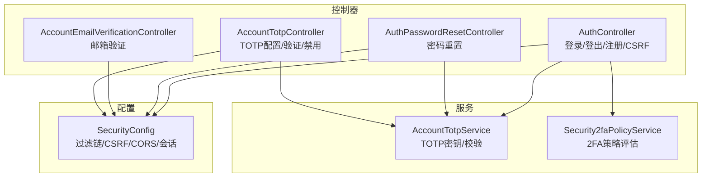
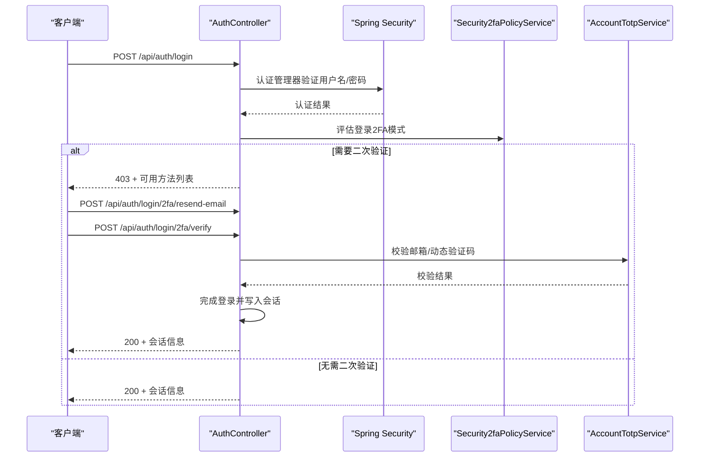
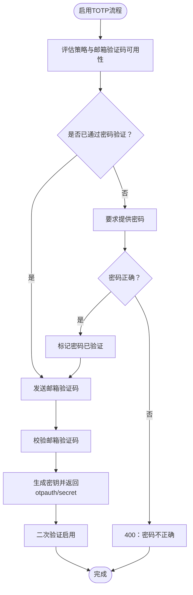
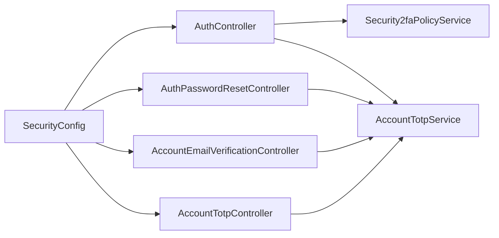

# 认证API

<cite>
**本文引用的文件**
- [AuthController.java](file://src/main/java/com/example/EnterpriseRagCommunity/controller/AuthController.java)
- [AuthPasswordResetController.java](file://src/main/java/com/example/EnterpriseRagCommunity/controller/AuthPasswordResetController.java)
- [AccountEmailVerificationController.java](file://src/main/java/com/example/EnterpriseRagCommunity/controller/AccountEmailVerificationController.java)
- [AccountTotpController.java](file://src/main/java/com/example/EnterpriseRagCommunity/controller/AccountTotpController.java)
- [SecurityConfig.java](file://src/main/java/com/example/EnterpriseRagCommunity/config/SecurityConfig.java)
- [LoginRequest.java](file://src/main/java/com/example/EnterpriseRagCommunity/dto/access/request/LoginRequest.java)
- [PasswordResetResetRequest.java](file://src/main/java/com/example/EnterpriseRagCommunity/dto/access/request/PasswordResetResetRequest.java)
- [PasswordResetStatusRequest.java](file://src/main/java/com/example/EnterpriseRagCommunity/dto/access/request/PasswordResetStatusRequest.java)
- [EmailVerificationSendRequest.java](file://src/main/java/com/example/EnterpriseRagCommunity/dto/access/request/EmailVerificationSendRequest.java)
- [TotpEnrollRequest.java](file://src/main/java/com/example/EnterpriseRagCommunity/dto/access/request/TotpEnrollRequest.java)
- [TotpPasswordVerifyRequest.java](file://src/main/java/com/example/EnterpriseRagCommunity/dto/access/request/TotpPasswordVerifyRequest.java)
- [AuthResponse.java](file://src/main/java/com/example/EnterpriseRagCommunity/dto/access/response/AuthResponse.java)
- [ApiResponse.java](file://src/main/java/com/example/EnterpriseRagCommunity/dto/access/response/ApiResponse.java)
- [PasswordResetStatusResponse.java](file://src/main/java/com/example/EnterpriseRagCommunity/dto/access/response/PasswordResetStatusResponse.java)
- [TotpEnrollResponse.java](file://src/main/java/com/example/EnterpriseRagCommunity/dto/access/response/TotpEnrollResponse.java)
- [TotpStatusResponse.java](file://src/main/java/com/example/EnterpriseRagCommunity/dto/access/response/TotpStatusResponse.java)
- [EmailVerificationPurpose.java](file://src/main/java/com/example/EnterpriseRagCommunity/entity/access/enums/EmailVerificationPurpose.java)
- [AccountTotpService.java](file://src/main/java/com/example/EnterpriseRagCommunity/service/AccountTotpService.java)
- [Security2faPolicyService.java](file://src/main/java/com/example/EnterpriseRagCommunity/service/access/Security2faPolicyService.java)
</cite>

## 目录
1. [简介](#简介)
2. [项目结构](#项目结构)
3. [核心组件](#核心组件)
4. [架构总览](#架构总览)
5. [详细组件分析](#详细组件分析)
6. [依赖分析](#依赖分析)
7. [性能考虑](#性能考虑)
8. [故障排查指南](#故障排查指南)
9. [结论](#结论)
10. [附录](#附录)

## 简介
本文件系统性梳理认证API的设计与实现，覆盖用户登录、注册、密码重置、邮箱验证、TOTP双重认证等能力。文档从接口定义、数据模型、流程图、错误处理、安全策略与会话生命周期等维度展开，帮助开发者与测试人员快速理解并正确使用认证体系。

## 项目结构
认证相关代码主要分布在以下模块：
- 控制器层：负责REST端点、请求参数解析与响应封装
- DTO层：定义请求与响应的数据结构
- 服务层：实现业务逻辑（如TOTP密钥生成、2FA策略评估、邮件验证码签发与校验）
- 安全配置：Spring Security过滤链、CSRF策略、CORS配置与会话策略

图表来源
- [AuthController.java:78-725](file://src/main/java/com/example/EnterpriseRagCommunity/controller/AuthController.java#L78-L725)
- [AuthPasswordResetController.java:23-66](file://src/main/java/com/example/EnterpriseRagCommunity/controller/AuthPasswordResetController.java#L23-L66)
- [AccountEmailVerificationController.java:28-107](file://src/main/java/com/example/EnterpriseRagCommunity/controller/AccountEmailVerificationController.java#L28-L107)
- [AccountTotpController.java:43-325](file://src/main/java/com/example/EnterpriseRagCommunity/controller/AccountTotpController.java#L43-L325)
- [SecurityConfig.java:74-194](file://src/main/java/com/example/EnterpriseRagCommunity/config/SecurityConfig.java#L74-L194)
- [AccountTotpService.java:28-200](file://src/main/java/com/example/EnterpriseRagCommunity/service/AccountTotpService.java#L28-L200)
- [Security2faPolicyService.java:27-150](file://src/main/java/com/example/EnterpriseRagCommunity/service/access/Security2faPolicyService.java#L27-L150)

章节来源
- [AuthController.java:78-725](file://src/main/java/com/example/EnterpriseRagCommunity/controller/AuthController.java#L78-L725)
- [SecurityConfig.java:74-194](file://src/main/java/com/example/EnterpriseRagCommunity/config/SecurityConfig.java#L74-L194)

## 核心组件
- 登录与会话：用户名（邮箱）+ 密码认证，支持邮箱/动态验证码二次验证；登录成功写入会话并返回会话标识
- 注册：可选邮箱验证后激活；默认角色绑定与租户关联
- 密码重置：支持邮箱验证码或TOTP两种方式
- 邮箱验证：支持多种用途（注册、登录2FA、修改密码、TOTP启用/停用、管理员提升）
- TOTP：启用/验证/停用流程，支持算法、位数、周期与容差配置

章节来源
- [AuthController.java:321-700](file://src/main/java/com/example/EnterpriseRagCommunity/controller/AuthController.java#L321-L700)
- [AuthPasswordResetController.java:23-66](file://src/main/java/com/example/EnterpriseRagCommunity/controller/AuthPasswordResetController.java#L23-L66)
- [AccountEmailVerificationController.java:28-107](file://src/main/java/com/example/EnterpriseRagCommunity/controller/AccountEmailVerificationController.java#L28-L107)
- [AccountTotpController.java:43-325](file://src/main/java/com/example/EnterpriseRagCommunity/controller/AccountTotpController.java#L43-L325)

## 架构总览
认证API采用Spring Security过滤链保护，仅对/api/**生效；CSRF通过Cookie暴露并忽略部分认证端点；会话策略为基于HTTP Session，登录成功后在响应头中设置JSESSIONID Cookie。

图表来源
- [AuthController.java:321-642](file://src/main/java/com/example/EnterpriseRagCommunity/controller/AuthController.java#L321-L642)
- [Security2faPolicyService.java:137-150](file://src/main/java/com/example/EnterpriseRagCommunity/service/access/Security2faPolicyService.java#L137-L150)
- [AccountTotpService.java:72-101](file://src/main/java/com/example/EnterpriseRagCommunity/service/AccountTotpService.java#L72-L101)

章节来源
- [SecurityConfig.java:110-142](file://src/main/java/com/example/EnterpriseRagCommunity/config/SecurityConfig.java#L110-L142)
- [AuthController.java:321-642](file://src/main/java/com/example/EnterpriseRagCommunity/controller/AuthController.java#L321-L642)

## 详细组件分析

### 登录与登出
- 端点
  - POST /api/auth/login
  - POST /api/auth/login/2fa/resend-email
  - POST /api/auth/login/2fa/verify
  - POST /api/auth/logout
  - GET /api/auth/csrf-token
- 请求参数
  - 登录：邮箱、密码
  - 二次验证：method（email/totp）、code
  - 重发验证码：无
  - 登出：无
  - CSRF：无
- 响应格式
  - 成功：会话信息（含会话ID、过期时间、用户信息）
  - 失败：错误消息与状态码
- 状态码
  - 200：成功
  - 400：参数错误/会话状态不合法/验证码为空
  - 401：未认证/会话过期
  - 403：邮箱未验证/二次验证不可用/禁止使用邮箱验证码
  - 500：内部错误
- 会话与CSRF
  - 登录成功写入JSESSIONID Cookie，HttpOnly=false
  - CSRF通过Cookie暴露，忽略认证相关端点

章节来源
- [AuthController.java:321-725](file://src/main/java/com/example/EnterpriseRagCommunity/controller/AuthController.java#L321-L725)
- [LoginRequest.java:8-18](file://src/main/java/com/example/EnterpriseRagCommunity/dto/access/request/LoginRequest.java#L8-L18)
- [AuthResponse.java:6-18](file://src/main/java/com/example/EnterpriseRagCommunity/dto/access/response/AuthResponse.java#L6-L18)

### 注册与邮箱验证
- 端点
  - POST /api/auth/register
  - POST /api/account/email-verification/send
- 请求参数
  - 注册：用户名、邮箱、密码
  - 邮箱验证：purpose（枚举）
- 响应格式
  - 注册：成功消息与用户信息
  - 发送：消息、重发等待秒数、验证码有效期
- 状态码
  - 201：注册成功
  - 400：用途不合法/邮箱服务未启用
  - 401：未登录
  - 403：注册关闭/管理员禁止邮箱验证码
  - 409：邮箱已存在
- 邮箱用途
  - 支持注册、登录2FA、修改密码、TOTP启用/停用、管理员提升等

章节来源
- [AuthController.java:748-800](file://src/main/java/com/example/EnterpriseRagCommunity/controller/AuthController.java#L748-L800)
- [AccountEmailVerificationController.java:39-82](file://src/main/java/com/example/EnterpriseRagCommunity/controller/AccountEmailVerificationController.java#L39-L82)
- [EmailVerificationPurpose.java:3-31](file://src/main/java/com/example/EnterpriseRagCommunity/entity/access/enums/EmailVerificationPurpose.java#L3-L31)
- [EmailVerificationSendRequest.java:7-12](file://src/main/java/com/example/EnterpriseRagCommunity/dto/access/request/EmailVerificationSendRequest.java#L7-L12)

### 密码重置
- 端点
  - POST /api/auth/password-reset/status
  - POST /api/auth/password-reset/reset
  - POST /api/auth/password-reset/send-code
- 请求参数
  - status：email
  - reset：email、totpCode或emailCode、newPassword
  - send-code：email
- 响应格式
  - status：允许性、TOTP与邮箱启用状态、提示信息
  - reset：成功消息
  - send-code：消息、重发等待秒数、验证码有效期
- 状态码
  - 200：成功
  - 400：参数错误/验证码不正确
  - 401：未认证
  - 500：内部错误

章节来源
- [AuthPasswordResetController.java:23-66](file://src/main/java/com/example/EnterpriseRagCommunity/controller/AuthPasswordResetController.java#L23-L66)
- [PasswordResetStatusRequest.java:8-14](file://src/main/java/com/example/EnterpriseRagCommunity/dto/access/request/PasswordResetStatusRequest.java#L8-L14)
- [PasswordResetResetRequest.java:8-22](file://src/main/java/com/example/EnterpriseRagCommunity/dto/access/request/PasswordResetResetRequest.java#L8-L22)
- [PasswordResetStatusResponse.java:5-11](file://src/main/java/com/example/EnterpriseRagCommunity/dto/access/response/PasswordResetStatusResponse.java#L5-L11)

### TOTP双重认证
- 端点
  - GET /api/account/totp/policy
  - GET /api/account/totp/status
  - POST /api/account/totp/enroll
  - POST /api/account/totp/verify
  - POST /api/account/totp/disable
  - POST /api/account/totp/verify-password
- 请求参数
  - policy/status：无
  - enroll：password、emailCode、algorithm、digits、periodSeconds、skew
  - verify：password（可选）、code
  - disable：method（email或totp）、password（可选）、emailCode或code
  - verify-password：password、action（ENABLE/DISABLE）
- 响应格式
  - policy：策略配置
  - status：是否启用、算法、位数、周期、容差、主密钥配置等
  - enroll：otpauth URI、secretBase32、算法、位数、周期、容差
  - verify/disable：状态变更结果
  - verify-password：成功消息
- 状态码
  - 200：成功
  - 400：密码未验证/验证码缺失/验证码格式不正确/密码不正确
  - 401：未登录
  - 403：管理员禁止/强制要求/邮箱验证码禁止
  - 500：内部错误

图表来源
- [AccountTotpController.java:79-118](file://src/main/java/com/example/EnterpriseRagCommunity/controller/AccountTotpController.java#L79-L118)
- [AccountTotpService.java:103-139](file://src/main/java/com/example/EnterpriseRagCommunity/service/AccountTotpService.java#L103-L139)

章节来源
- [AccountTotpController.java:43-325](file://src/main/java/com/example/EnterpriseRagCommunity/controller/AccountTotpController.java#L43-L325)
- [TotpEnrollRequest.java:6-25](file://src/main/java/com/example/EnterpriseRagCommunity/dto/access/request/TotpEnrollRequest.java#L6-L25)
- [TotpPasswordVerifyRequest.java:8-19](file://src/main/java/com/example/EnterpriseRagCommunity/dto/access/request/TotpPasswordVerifyRequest.java#L8-L19)
- [TotpEnrollResponse.java:6-25](file://src/main/java/com/example/EnterpriseRagCommunity/dto/access/response/TotpEnrollResponse.java#L6-L25)
- [TotpStatusResponse.java:8-33](file://src/main/java/com/example/EnterpriseRagCommunity/dto/access/response/TotpStatusResponse.java#L8-L33)

### JWT令牌管理与会话生命周期
- 会话策略
  - 基于HTTP Session，登录成功写入JSESSIONID Cookie（HttpOnly=false）
  - 会话过期时间：1天
  - 访问时间戳与会话失效时间写入会话属性，用于权限变更即时生效
- CSRF
  - CookieCsrfTokenRepository暴露CSRF Token至前端
  - 忽略认证相关端点的CSRF校验
- 会话生命周期
  - 登录成功：更新最后登录时间，写入审计日志
  - 登出：清除SecurityContext与Session，写入审计日志

章节来源
- [AuthController.java:270-319](file://src/main/java/com/example/EnterpriseRagCommunity/controller/AuthController.java#L270-L319)
- [SecurityConfig.java:110-142](file://src/main/java/com/example/EnterpriseRagCommunity/config/SecurityConfig.java#L110-L142)

### 安全策略与错误处理
- 2FA策略
  - 支持TOTP与邮箱验证码两种方式，管理员可配置策略（允许/禁止/强制）
  - 登录时根据用户角色与配置评估可用方式
- 错误处理
  - 统一返回消息与状态码
  - 审计日志记录关键事件（登录成功/失败、二次验证、登出、TOTP启用/停用等）

章节来源
- [Security2faPolicyService.java:137-150](file://src/main/java/com/example/EnterpriseRagCommunity/service/access/Security2faPolicyService.java#L137-L150)
- [AuthController.java:321-642](file://src/main/java/com/example/EnterpriseRagCommunity/controller/AuthController.java#L321-L642)

## 依赖分析
认证API各组件之间的依赖关系如下：

图表来源
- [AuthController.java:89-148](file://src/main/java/com/example/EnterpriseRagCommunity/controller/AuthController.java#L89-L148)
- [AuthPasswordResetController.java:23-29](file://src/main/java/com/example/EnterpriseRagCommunity/controller/AuthPasswordResetController.java#L23-L29)
- [AccountEmailVerificationController.java:28-37](file://src/main/java/com/example/EnterpriseRagCommunity/controller/AccountEmailVerificationController.java#L28-L37)
- [AccountTotpController.java:43-61](file://src/main/java/com/example/EnterpriseRagCommunity/controller/AccountTotpController.java#L43-L61)
- [SecurityConfig.java:74-194](file://src/main/java/com/example/EnterpriseRagCommunity/config/SecurityConfig.java#L74-L194)

章节来源
- [AuthController.java:89-148](file://src/main/java/com/example/EnterpriseRagCommunity/controller/AuthController.java#L89-L148)
- [AuthPasswordResetController.java:23-29](file://src/main/java/com/example/EnterpriseRagCommunity/controller/AuthPasswordResetController.java#L23-L29)
- [AccountEmailVerificationController.java:28-37](file://src/main/java/com/example/EnterpriseRagCommunity/controller/AccountEmailVerificationController.java#L28-L37)
- [AccountTotpController.java:43-61](file://src/main/java/com/example/EnterpriseRagCommunity/controller/AccountTotpController.java#L43-L61)
- [SecurityConfig.java:74-194](file://src/main/java/com/example/EnterpriseRagCommunity/config/SecurityConfig.java#L74-L194)

## 性能考虑
- 会话与审计
  - 登录成功写入会话属性包含访问时间戳与会话失效时间，有助于权限变更即时生效
- CSRF与CORS
  - CSRF通过Cookie暴露，减少跨域复杂度；CORS允许凭证传递，便于前端跨域调用
- 二次验证
  - 登录时按策略评估可用方式，避免无效尝试

[本节为通用指导，不直接分析具体文件]

## 故障排查指南
- 登录失败
  - 检查邮箱是否已验证；若未验证，返回403并提示输入邮箱验证码
  - 核对用户名/密码是否正确；错误返回401
- 二次验证失败
  - 确认当前会话仍处于二次验证状态；否则返回401
  - 验证码为空或格式不正确返回400；验证码不正确返回400
- 注册失败
  - 注册功能可能被管理员关闭；返回403
  - 邮箱已存在返回409
- TOTP启用/停用失败
  - 管理员可能禁止启用/强制要求；返回403
  - 密码未验证或不正确返回400
  - 邮箱验证码缺失或不正确返回400
- 密码重置失败
  - 验证码缺失或不正确返回400
  - 未启用邮箱服务或策略不允许返回400

章节来源
- [AuthController.java:321-642](file://src/main/java/com/example/EnterpriseRagCommunity/controller/AuthController.java#L321-L642)
- [AccountTotpController.java:79-230](file://src/main/java/com/example/EnterpriseRagCommunity/controller/AccountTotpController.java#L79-L230)
- [AuthPasswordResetController.java:23-66](file://src/main/java/com/example/EnterpriseRagCommunity/controller/AuthPasswordResetController.java#L23-L66)

## 结论
该认证API以Spring Security为核心，结合2FA策略与TOTP服务，提供了完整的登录、注册、密码重置与邮箱验证能力。通过清晰的端点划分、严格的错误处理与审计日志，保障了系统的安全性与可观测性。建议在生产环境合理配置2FA策略与TOTP主密钥，并关注会话与CSRF策略以提升整体安全水平。

[本节为总结性内容，不直接分析具体文件]

## 附录

### API一览与示例

- 登录
  - 方法与路径：POST /api/auth/login
  - 请求体：邮箱、密码
  - 响应：会话信息
  - 示例请求：见[LoginRequest.java:8-18](file://src/main/java/com/example/EnterpriseRagCommunity/dto/access/request/LoginRequest.java#L8-L18)
  - 示例响应：见[AuthResponse.java:6-18](file://src/main/java/com/example/EnterpriseRagCommunity/dto/access/response/AuthResponse.java#L6-L18)

- 登录二次验证
  - 重发验证码：POST /api/auth/login/2fa/resend-email
  - 校验验证码：POST /api/auth/login/2fa/verify
  - 示例请求：见[LoginRequest.java:8-18](file://src/main/java/com/example/EnterpriseRagCommunity/dto/access/request/LoginRequest.java#L8-L18)

- 注销
  - 方法与路径：POST /api/auth/logout
  - 请求体：无
  - 响应：成功消息

- CSRF
  - 方法与路径：GET /api/auth/csrf-token
  - 响应：CSRF Token

- 注册
  - 方法与路径：POST /api/auth/register
  - 请求体：用户名、邮箱、密码
  - 响应：成功消息与用户信息

- 邮箱验证
  - 方法与路径：POST /api/account/email-verification/send
  - 请求体：purpose
  - 响应：消息、重发等待秒数、验证码有效期

- 密码重置
  - 状态查询：POST /api/auth/password-reset/status
  - 重置：POST /api/auth/password-reset/reset
  - 发送验证码：POST /api/auth/password-reset/send-code
  - 示例请求：见[PasswordResetResetRequest.java:8-22](file://src/main/java/com/example/EnterpriseRagCommunity/dto/access/request/PasswordResetResetRequest.java#L8-L22)

- TOTP
  - 策略：GET /api/account/totp/policy
  - 状态：GET /api/account/totp/status
  - 启用：POST /api/account/totp/enroll
  - 验证：POST /api/account/totp/verify
  - 停用：POST /api/account/totp/disable
  - 密码验证：POST /api/account/totp/verify-password
  - 示例请求：见[TotpEnrollRequest.java:6-25](file://src/main/java/com/example/EnterpriseRagCommunity/dto/access/request/TotpEnrollRequest.java#L6-L25)

章节来源
- [AuthController.java:321-725](file://src/main/java/com/example/EnterpriseRagCommunity/controller/AuthController.java#L321-L725)
- [AuthPasswordResetController.java:23-66](file://src/main/java/com/example/EnterpriseRagCommunity/controller/AuthPasswordResetController.java#L23-L66)
- [AccountEmailVerificationController.java:28-107](file://src/main/java/com/example/EnterpriseRagCommunity/controller/AccountEmailVerificationController.java#L28-L107)
- [AccountTotpController.java:43-325](file://src/main/java/com/example/EnterpriseRagCommunity/controller/AccountTotpController.java#L43-L325)
- [LoginRequest.java:8-18](file://src/main/java/com/example/EnterpriseRagCommunity/dto/access/request/LoginRequest.java#L8-L18)
- [PasswordResetResetRequest.java:8-22](file://src/main/java/com/example/EnterpriseRagCommunity/dto/access/request/PasswordResetResetRequest.java#L8-L22)
- [TotpEnrollRequest.java:6-25](file://src/main/java/com/example/EnterpriseRagCommunity/dto/access/request/TotpEnrollRequest.java#L6-L25)