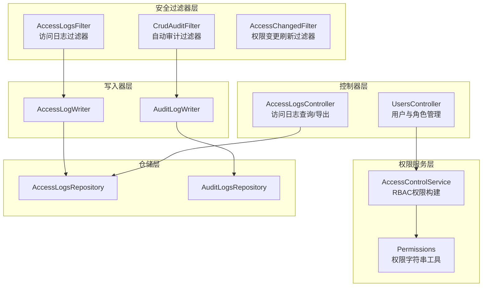
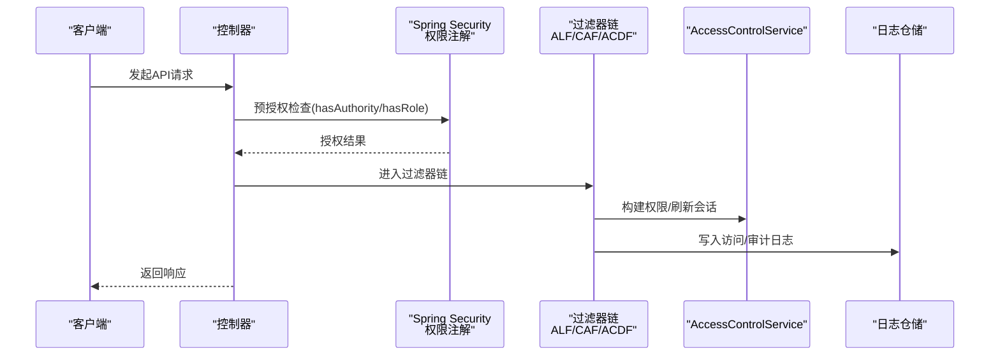
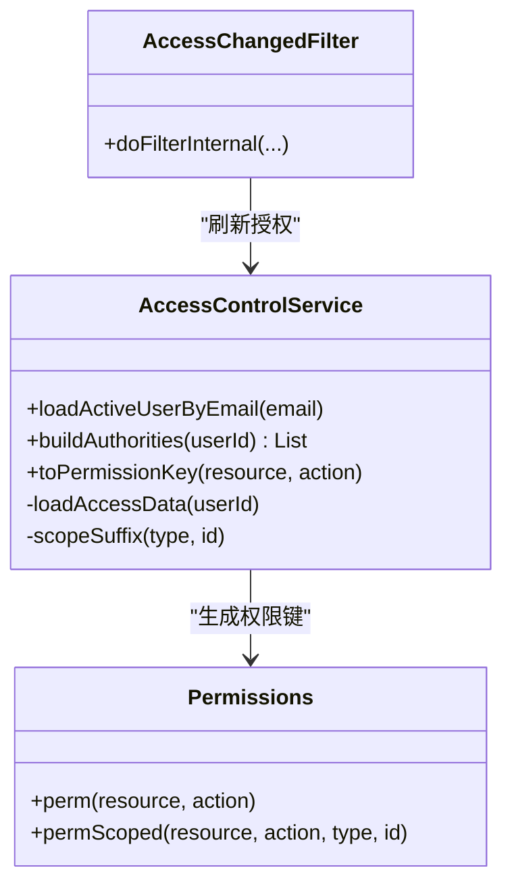
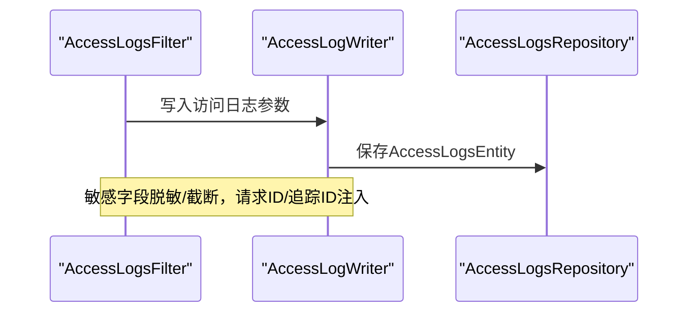
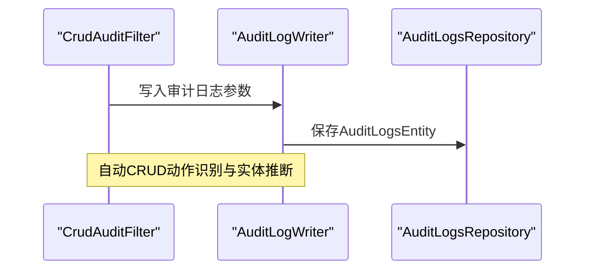
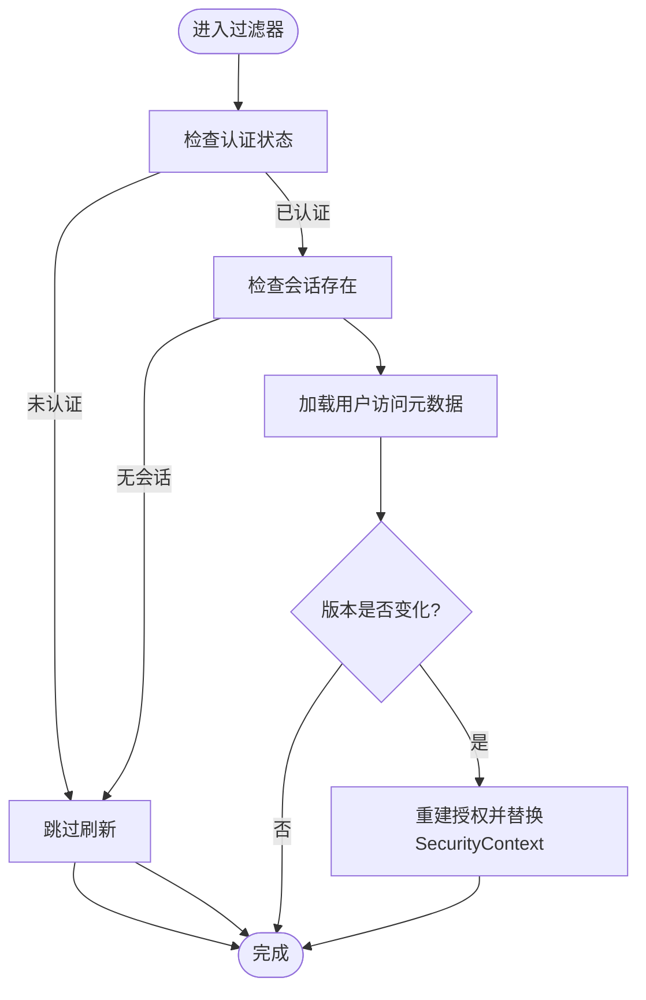
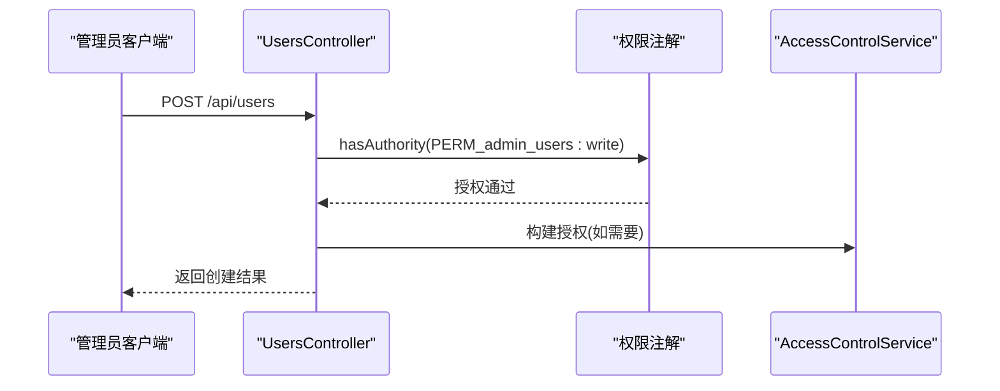
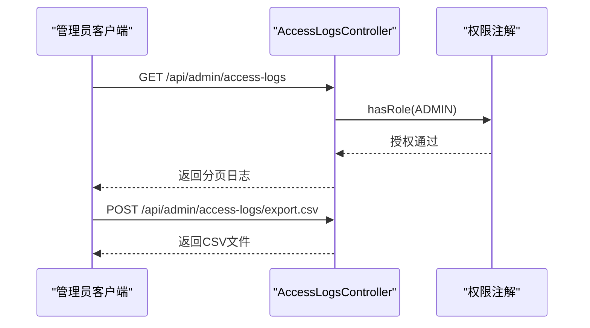
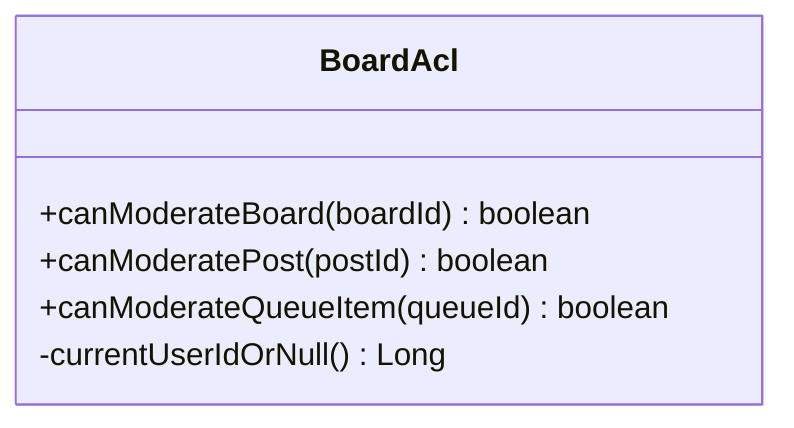
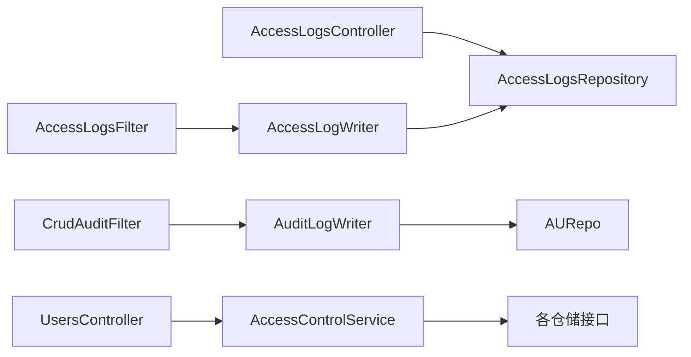

# 访问控制API

<cite>
**本文档引用的文件**
- [Permissions.java](file://src/main/java/com/example/EnterpriseRagCommunity/security/Permissions.java)
- [AccessControlService.java](file://src/main/java/com/example/EnterpriseRagCommunity/service/access/AccessControlService.java)
- [AccessLogsFilter.java](file://src/main/java/com/example/EnterpriseRagCommunity/security/AccessLogsFilter.java)
- [CrudAuditFilter.java](file://src/main/java/com/example/EnterpriseRagCommunity/security/CrudAuditFilter.java)
- [AccessChangedFilter.java](file://src/main/java/com/example/EnterpriseRagCommunity/security/AccessChangedFilter.java)
- [BoardAcl.java](file://src/main/java/com/example/EnterpriseRagCommunity/security/BoardAcl.java)
- [AccessLogWriter.java](file://src/main/java/com/example/EnterpriseRagCommunity/service/access/AccessLogWriter.java)
- [AuditLogWriter.java](file://src/main/java/com/example/EnterpriseRagCommunity/service/access/AuditLogWriter.java)
- [AccessLogsController.java](file://src/main/java/com/example/EnterpriseRagCommunity/controller/access/AccessLogsController.java)
- [UsersController.java](file://src/main/java/com/example/EnterpriseRagCommunity/controller/access/UsersController.java)
- [AccessLogsRepository.java](file://src/main/java/com/example/EnterpriseRagCommunity/repository/access/AccessLogsRepository.java)
- [AuditLogsRepository.java](file://src/main/java/com/example/EnterpriseRagCommunity/repository/access/AuditLogsRepository.java)
- [AuditResult.java](file://src/main/java/com/example/EnterpriseRagCommunity/entity/access/enums/AuditResult.java)
</cite>

## 目录
1. [简介](#简介)
2. [项目结构](#项目结构)
3. [核心组件](#核心组件)
4. [架构总览](#架构总览)
5. [详细组件分析](#详细组件分析)
6. [依赖关系分析](#依赖关系分析)
7. [性能考量](#性能考量)
8. [故障排查指南](#故障排查指南)
9. [结论](#结论)
10. [附录](#附录)

## 简介
本文件系统性梳理企业级RAG社区项目的访问控制API，覆盖基于RBAC的权限模型、动态权限检查、访问控制列表、审计与日志等安全管控能力。文档面向开发者与运维人员，提供API端点说明、权限设计原理、实现细节、可视化图示与最佳实践。

## 项目结构
访问控制相关代码主要分布在以下模块：
- 安全过滤器层：请求拦截、权限刷新、访问日志与审计日志自动采集
- 权限服务层：RBAC数据加载、权限构建、作用域计算
- 控制器层：用户管理、访问日志查询与导出、权限校验端点
- 数据仓储层：访问日志与审计日志持久化接口

**图表来源**
- [AccessLogsFilter.java:1-710](file://src/main/java/com/example/EnterpriseRagCommunity/security/AccessLogsFilter.java#L1-L710)
- [CrudAuditFilter.java:1-304](file://src/main/java/com/example/EnterpriseRagCommunity/security/CrudAuditFilter.java#L1-L304)
- [AccessChangedFilter.java:1-154](file://src/main/java/com/example/EnterpriseRagCommunity/security/AccessChangedFilter.java#L1-L154)
- [AccessControlService.java:1-222](file://src/main/java/com/example/EnterpriseRagCommunity/service/access/AccessControlService.java#L1-L222)
- [Permissions.java:1-25](file://src/main/java/com/example/EnterpriseRagCommunity/security/Permissions.java#L1-L25)
- [AccessLogWriter.java:1-71](file://src/main/java/com/example/EnterpriseRagCommunity/service/access/AccessLogWriter.java#L1-L71)
- [AuditLogWriter.java:1-151](file://src/main/java/com/example/EnterpriseRagCommunity/service/access/AuditLogWriter.java#L1-L151)
- [AccessLogsController.java:1-152](file://src/main/java/com/example/EnterpriseRagCommunity/controller/access/AccessLogsController.java#L1-L152)
- [UsersController.java:1-183](file://src/main/java/com/example/EnterpriseRagCommunity/controller/access/UsersController.java#L1-L183)
- [AccessLogsRepository.java:1-15](file://src/main/java/com/example/EnterpriseRagCommunity/repository/access/AccessLogsRepository.java#L1-L15)
- [AuditLogsRepository.java:1-29](file://src/main/java/com/example/EnterpriseRagCommunity/repository/access/AuditLogsRepository.java#L1-L29)

**章节来源**
- [AccessLogsFilter.java:1-710](file://src/main/java/com/example/EnterpriseRagCommunity/security/AccessLogsFilter.java#L1-L710)
- [CrudAuditFilter.java:1-304](file://src/main/java/com/example/EnterpriseRagCommunity/security/CrudAuditFilter.java#L1-L304)
- [AccessChangedFilter.java:1-154](file://src/main/java/com/example/EnterpriseRagCommunity/security/AccessChangedFilter.java#L1-L154)
- [AccessControlService.java:1-222](file://src/main/java/com/example/EnterpriseRagCommunity/service/access/AccessControlService.java#L1-L222)
- [Permissions.java:1-25](file://src/main/java/com/example/EnterpriseRagCommunity/security/Permissions.java#L1-L25)
- [AccessLogWriter.java:1-71](file://src/main/java/com/example/EnterpriseRagCommunity/service/access/AccessLogWriter.java#L1-L71)
- [AuditLogWriter.java:1-151](file://src/main/java/com/example/EnterpriseRagCommunity/service/access/AuditLogWriter.java#L1-L151)
- [AccessLogsController.java:1-152](file://src/main/java/com/example/EnterpriseRagCommunity/controller/access/AccessLogsController.java#L1-L152)
- [UsersController.java:1-183](file://src/main/java/com/example/EnterpriseRagCommunity/controller/access/UsersController.java#L1-L183)
- [AccessLogsRepository.java:1-15](file://src/main/java/com/example/EnterpriseRagCommunity/repository/access/AccessLogsRepository.java#L1-L15)
- [AuditLogsRepository.java:1-29](file://src/main/java/com/example/EnterpriseRagCommunity/repository/access/AuditLogsRepository.java#L1-L29)

## 核心组件
- 权限命名与作用域工具：提供统一的权限字符串格式化与作用域后缀生成
- RBAC权限构建：从用户角色与权限映射中构建Spring Security的授权集合
- 访问日志过滤器：捕获请求上下文、请求/响应体、敏感信息脱敏与截断
- 自动审计过滤器：对API CRUD操作进行自动审计记录
- 权限变更刷新过滤器：在会话中检测权限变化并动态刷新授权
- 权限字符串工具：生成资源:动作权限键，支持全局与作用域限定
- 写入器：标准化写入访问日志与审计日志，含敏感信息屏蔽
- 控制器：用户管理、角色分配、访问日志查询与导出

**章节来源**
- [Permissions.java:1-25](file://src/main/java/com/example/EnterpriseRagCommunity/security/Permissions.java#L1-L25)
- [AccessControlService.java:1-222](file://src/main/java/com/example/EnterpriseRagCommunity/service/access/AccessControlService.java#L1-L222)
- [AccessLogsFilter.java:1-710](file://src/main/java/com/example/EnterpriseRagCommunity/security/AccessLogsFilter.java#L1-L710)
- [CrudAuditFilter.java:1-304](file://src/main/java/com/example/EnterpriseRagCommunity/security/CrudAuditFilter.java#L1-L304)
- [AccessChangedFilter.java:1-154](file://src/main/java/com/example/EnterpriseRagCommunity/security/AccessChangedFilter.java#L1-L154)
- [AccessLogWriter.java:1-71](file://src/main/java/com/example/EnterpriseRagCommunity/service/access/AccessLogWriter.java#L1-L71)
- [AuditLogWriter.java:1-151](file://src/main/java/com/example/EnterpriseRagCommunity/service/access/AuditLogWriter.java#L1-L151)
- [AccessLogsController.java:1-152](file://src/main/java/com/example/EnterpriseRagCommunity/controller/access/AccessLogsController.java#L1-L152)
- [UsersController.java:1-183](file://src/main/java/com/example/EnterpriseRagCommunity/controller/access/UsersController.java#L1-L183)

## 架构总览
下图展示访问控制API的关键交互路径：控制器接收请求，通过权限注解与过滤器链进行鉴权与审计，服务层构建权限并写入日志仓储。

**图表来源**
- [UsersController.java:1-183](file://src/main/java/com/example/EnterpriseRagCommunity/controller/access/UsersController.java#L1-L183)
- [AccessLogsController.java:1-152](file://src/main/java/com/example/EnterpriseRagCommunity/controller/access/AccessLogsController.java#L1-L152)
- [AccessLogsFilter.java:1-710](file://src/main/java/com/example/EnterpriseRagCommunity/security/AccessLogsFilter.java#L1-L710)
- [CrudAuditFilter.java:1-304](file://src/main/java/com/example/EnterpriseRagCommunity/security/CrudAuditFilter.java#L1-L304)
- [AccessChangedFilter.java:1-154](file://src/main/java/com/example/EnterpriseRagCommunity/security/AccessChangedFilter.java#L1-L154)
- [AccessControlService.java:1-222](file://src/main/java/com/example/EnterpriseRagCommunity/service/access/AccessControlService.java#L1-L222)
- [AccessLogsRepository.java:1-15](file://src/main/java/com/example/EnterpriseRagCommunity/repository/access/AccessLogsRepository.java#L1-L15)
- [AuditLogsRepository.java:1-29](file://src/main/java/com/example/EnterpriseRagCommunity/repository/access/AuditLogsRepository.java#L1-L29)

## 详细组件分析

### RBAC权限模型与动态权限检查
- 权限键生成：统一前缀+资源:动作，支持作用域后缀
- 角色到权限映射：按作用域聚合角色集合，合并允许/拒绝集合
- 授权输出：ROLE_角色名、ROLE_ID_角色ID、PERM_资源:动作
- 作用域规则：支持GLOBAL与自定义类型，ID为0时省略后缀
- 动态刷新：会话中检测用户权限版本变化，必要时重建授权

**图表来源**
- [AccessControlService.java:1-222](file://src/main/java/com/example/EnterpriseRagCommunity/service/access/AccessControlService.java#L1-L222)
- [Permissions.java:1-25](file://src/main/java/com/example/EnterpriseRagCommunity/security/Permissions.java#L1-L25)
- [AccessChangedFilter.java:1-154](file://src/main/java/com/example/EnterpriseRagCommunity/security/AccessChangedFilter.java#L1-L154)

**章节来源**
- [AccessControlService.java:23-222](file://src/main/java/com/example/EnterpriseRagCommunity/service/access/AccessControlService.java#L23-L222)
- [Permissions.java:13-22](file://src/main/java/com/example/EnterpriseRagCommunity/security/Permissions.java#L13-L22)
- [AccessChangedFilter.java:23-154](file://src/main/java/com/example/EnterpriseRagCommunity/security/AccessChangedFilter.java#L23-L154)

### 访问日志与审计日志
- 访问日志：记录请求/响应元数据、请求体/响应体摘要、敏感信息脱敏与截断
- 审计日志：自动CRUD审计与手动审计，统一字段与敏感信息屏蔽
- 日志写入：标准化实体构造与保存，支持请求上下文注入

**图表来源**
- [AccessLogsFilter.java:1-710](file://src/main/java/com/example/EnterpriseRagCommunity/security/AccessLogsFilter.java#L1-L710)
- [AccessLogWriter.java:1-71](file://src/main/java/com/example/EnterpriseRagCommunity/service/access/AccessLogWriter.java#L1-L71)
- [AccessLogsRepository.java:1-15](file://src/main/java/com/example/EnterpriseRagCommunity/repository/access/AccessLogsRepository.java#L1-L15)

**图表来源**
- [CrudAuditFilter.java:1-304](file://src/main/java/com/example/EnterpriseRagCommunity/security/CrudAuditFilter.java#L1-L304)
- [AuditLogWriter.java:1-151](file://src/main/java/com/example/EnterpriseRagCommunity/service/access/AuditLogWriter.java#L1-L151)
- [AuditLogsRepository.java:1-29](file://src/main/java/com/example/EnterpriseRagCommunity/repository/access/AuditLogsRepository.java#L1-L29)

**章节来源**
- [AccessLogsFilter.java:72-213](file://src/main/java/com/example/EnterpriseRagCommunity/security/AccessLogsFilter.java#L72-L213)
- [AccessLogWriter.java:17-68](file://src/main/java/com/example/EnterpriseRagCommunity/service/access/AccessLogWriter.java#L17-L68)
- [CrudAuditFilter.java:58-127](file://src/main/java/com/example/EnterpriseRagCommunity/security/CrudAuditFilter.java#L58-L127)
- [AuditLogWriter.java:43-88](file://src/main/java/com/example/EnterpriseRagCommunity/service/access/AuditLogWriter.java#L43-L88)

### 权限变更与会话刷新
- 会话标记：存储用户权限版本与失效时间戳
- 变更检测：对比数据库版本与会话版本，必要时重建授权
- 异常处理：检测到权限变更或用户不存在时，清理会话并返回401

**图表来源**
- [AccessChangedFilter.java:54-152](file://src/main/java/com/example/EnterpriseRagCommunity/security/AccessChangedFilter.java#L54-L152)

**章节来源**
- [AccessChangedFilter.java:35-154](file://src/main/java/com/example/EnterpriseRagCommunity/security/AccessChangedFilter.java#L35-L154)

### 用户与角色管理API
- 用户创建/更新/删除：受权限控制，需具备admin_users:write
- 用户封禁/解封：需具备admin_users:write
- 查询与详情：受权限控制，需具备admin_users:read
- 角色分配/查询：受权限控制，需具备admin_user_roles:write/read；角色分配需二次提升认证

**图表来源**
- [UsersController.java:31-36](file://src/main/java/com/example/EnterpriseRagCommunity/controller/access/UsersController.java#L31-L36)
- [Permissions.java:13-22](file://src/main/java/com/example/EnterpriseRagCommunity/security/Permissions.java#L13-L22)
- [AccessControlService.java:62-118](file://src/main/java/com/example/EnterpriseRagCommunity/service/access/AccessControlService.java#L62-L118)

**章节来源**
- [UsersController.java:31-110](file://src/main/java/com/example/EnterpriseRagCommunity/controller/access/UsersController.java#L31-L110)

### 访问日志查询与导出API
- 分页查询：支持关键词、用户、方法、路径、状态码、IP、请求/追踪ID、时间范围与排序
- 详情获取：按ID获取访问日志
- CSV导出：支持批量导出，限制最大条数

**图表来源**
- [AccessLogsController.java:36-143](file://src/main/java/com/example/EnterpriseRagCommunity/controller/access/AccessLogsController.java#L36-L143)

**章节来源**
- [AccessLogsController.java:36-143](file://src/main/java/com/example/EnterpriseRagCommunity/controller/access/AccessLogsController.java#L36-L143)

### 板块权限辅助（ACL）
- 提供板块/帖子/队列项的审核权限判定
- 基于当前认证用户与实体关联关系判断

**图表来源**
- [BoardAcl.java:1-60](file://src/main/java/com/example/EnterpriseRagCommunity/security/BoardAcl.java#L1-L60)

**章节来源**
- [BoardAcl.java:24-58](file://src/main/java/com/example/EnterpriseRagCommunity/security/BoardAcl.java#L24-L58)

## 依赖关系分析
- 过滤器依赖：访问日志与审计日志写入器、管理员服务（用户解析）
- 服务依赖：用户、角色、权限、用户角色链接仓储
- 控制器依赖：权限注解与方法级安全
- 仓储依赖：JPA与Specification，支持JSON字段查询

**图表来源**
- [AccessLogsFilter.java:1-710](file://src/main/java/com/example/EnterpriseRagCommunity/security/AccessLogsFilter.java#L1-L710)
- [CrudAuditFilter.java:1-304](file://src/main/java/com/example/EnterpriseRagCommunity/security/CrudAuditFilter.java#L1-L304)
- [AccessControlService.java:1-222](file://src/main/java/com/example/EnterpriseRagCommunity/service/access/AccessControlService.java#L1-L222)
- [AccessLogWriter.java:1-71](file://src/main/java/com/example/EnterpriseRagCommunity/service/access/AccessLogWriter.java#L1-L71)
- [AuditLogWriter.java:1-151](file://src/main/java/com/example/EnterpriseRagCommunity/service/access/AuditLogWriter.java#L1-L151)
- [AccessLogsController.java:1-152](file://src/main/java/com/example/EnterpriseRagCommunity/controller/access/AccessLogsController.java#L1-L152)
- [AccessLogsRepository.java:1-15](file://src/main/java/com/example/EnterpriseRagCommunity/repository/access/AccessLogsRepository.java#L1-L15)
- [AuditLogsRepository.java:1-29](file://src/main/java/com/example/EnterpriseRagCommunity/repository/access/AuditLogsRepository.java#L1-L29)

**章节来源**
- [AccessLogsRepository.java:1-15](file://src/main/java/com/example/EnterpriseRagCommunity/repository/access/AccessLogsRepository.java#L1-L15)
- [AuditLogsRepository.java:1-29](file://src/main/java/com/example/EnterpriseRagCommunity/repository/access/AuditLogsRepository.java#L1-L29)

## 性能考量
- 请求体/响应体截断：避免大体积内容写入日志，降低IO压力
- 缓存用户ID：减少重复查询，提高审计与日志写入效率
- 自动审计开关：可按路径前缀白名单/黑名单控制，减少非必要记录
- 会话刷新节流：避免频繁检查导致性能抖动

## 故障排查指南
- 权限不足：检查控制器上的权限注解与用户实际角色/权限映射
- 会话过期：权限变更刷新过滤器会在版本不一致时返回401并清理会话
- 日志缺失：确认过滤器启用、排除路径配置与自动审计开关
- 敏感信息泄露：确保日志写入器对敏感字段进行屏蔽与截断

**章节来源**
- [AccessChangedFilter.java:101-149](file://src/main/java/com/example/EnterpriseRagCommunity/security/AccessChangedFilter.java#L101-L149)
- [AccessLogsFilter.java:167-212](file://src/main/java/com/example/EnterpriseRagCommunity/security/AccessLogsFilter.java#L167-L212)
- [AuditLogWriter.java:90-149](file://src/main/java/com/example/EnterpriseRagCommunity/service/access/AuditLogWriter.java#L90-L149)

## 结论
该访问控制API以RBAC为核心，结合动态权限构建、会话权限刷新、自动审计与精细化日志采集，形成完整的安全管控闭环。通过控制器权限注解与过滤器链实现细粒度的访问控制与可观测性，满足企业级应用对权限管理、审计追踪与异常监控的需求。

## 附录

### API端点一览（管理员）
- GET /api/admin/access-logs：分页查询访问日志
- GET /api/admin/access-logs/{id}：获取访问日志详情
- POST /api/admin/access-logs/export.csv：导出CSV
- POST /api/users：创建用户
- PUT /api/users：更新用户
- DELETE /api/users/{id}：删除用户
- POST /api/users/{id}/ban：封禁用户
- POST /api/users/{id}/unban：解封用户
- DELETE /api/users/{id}/hard：硬删除用户
- POST /api/users/query：查询用户
- GET /api/users/{id}：获取用户详情
- POST /api/users/{id}/roles：分配角色（需二次提升）
- GET /api/users/{id}/roles：查询用户角色

**章节来源**
- [AccessLogsController.java:36-143](file://src/main/java/com/example/EnterpriseRagCommunity/controller/access/AccessLogsController.java#L36-L143)
- [UsersController.java:31-110](file://src/main/java/com/example/EnterpriseRagCommunity/controller/access/UsersController.java#L31-L110)

### 权限键命名规范
- 全局权限：PERM_资源:动作
- 作用域权限：PERM_资源:动作@类型:ID
- 工具方法：统一生成与作用域拼接

**章节来源**
- [Permissions.java:13-22](file://src/main/java/com/example/EnterpriseRagCommunity/security/Permissions.java#L13-L22)
- [AccessControlService.java:202-211](file://src/main/java/com/example/EnterpriseRagCommunity/service/access/AccessControlService.java#L202-L211)