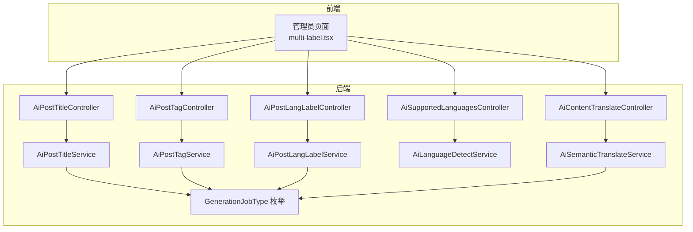
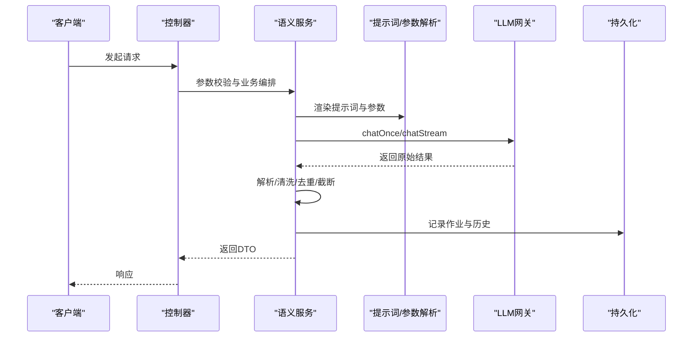
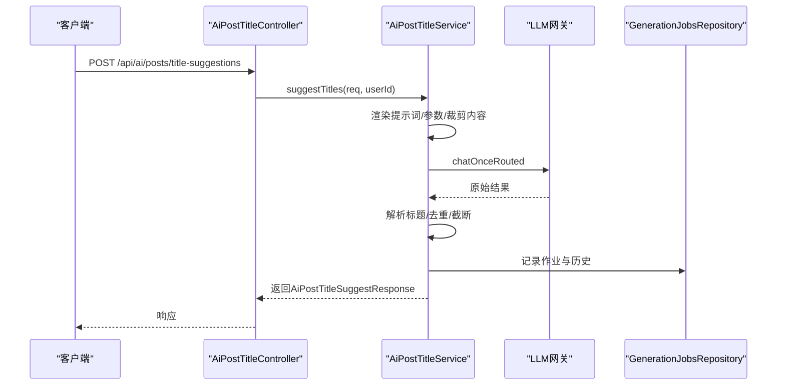
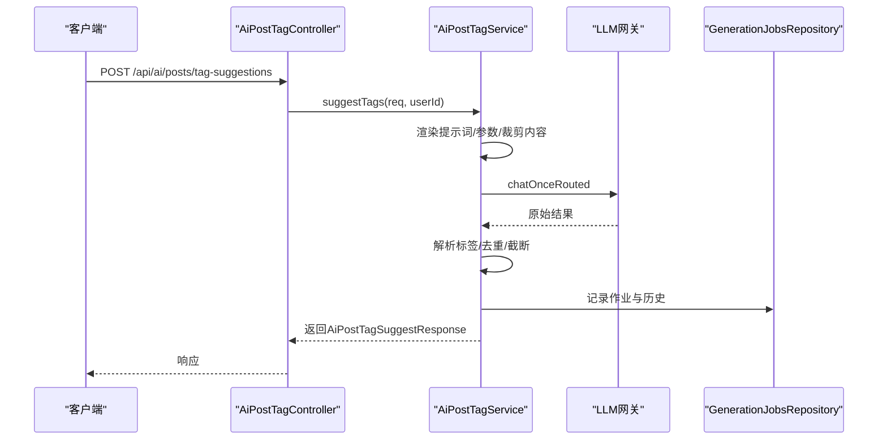
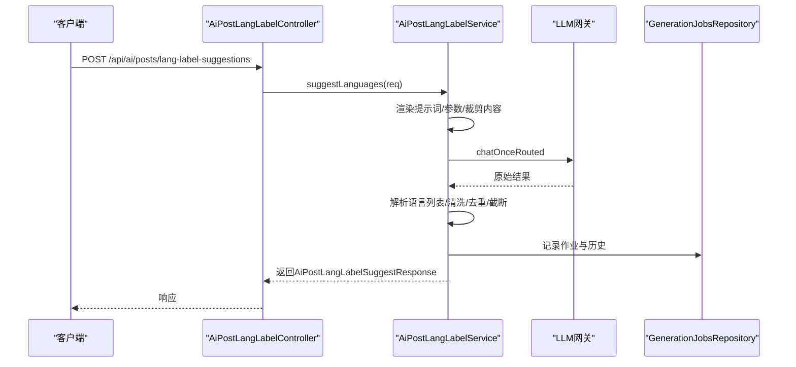
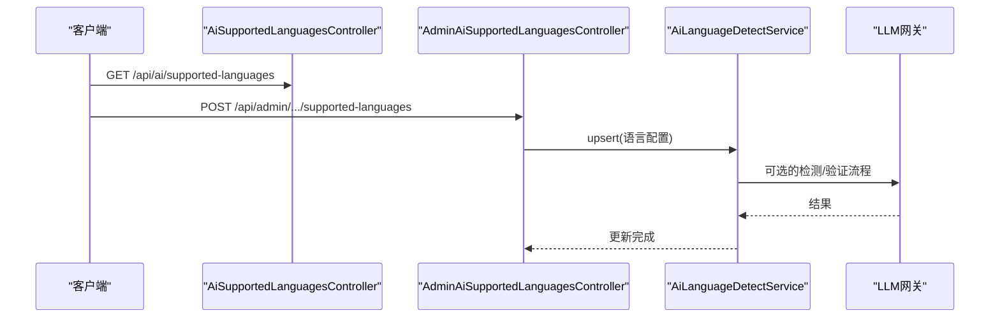
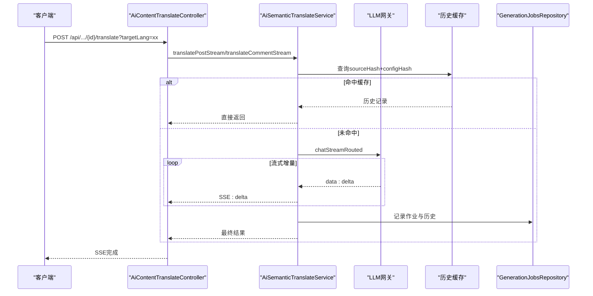
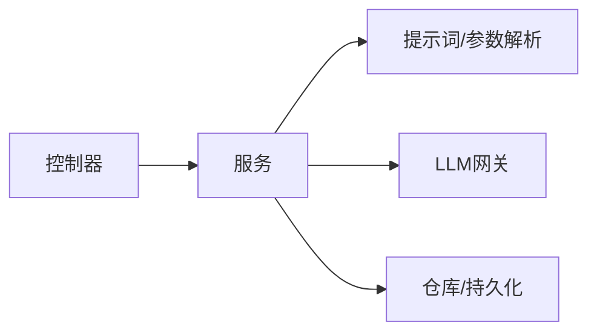

# 语义处理API

<cite>
**本文引用的文件**   
- [AiPostTitleController.java](file://src/main/java/com/example/EnterpriseRagCommunity/controller/ai/AiPostTitleController.java)
- [AiPostTagController.java](file://src/main/java/com/example/EnterpriseRagCommunity/controller/ai/AiPostTagController.java)
- [AiPostLangLabelController.java](file://src/main/java/com/example/EnterpriseRagCommunity/controller/ai/AiPostLangLabelController.java)
- [AiContentTranslateController.java](file://src/main/java/com/example/EnterpriseRagCommunity/controller/ai/AiContentTranslateController.java)
- [AiSupportedLanguagesController.java](file://src/main/java/com/example/EnterpriseRagCommunity/controller/ai/AiSupportedLanguagesController.java)
- [AdminAiSupportedLanguagesController.java](file://src/main/java/com/example/EnterpriseRagCommunity/controller/ai/admin/AdminAiSupportedLanguagesController.java)
- [AiPostTitleService.java](file://src/main/java/com/example/EnterpriseRagCommunity/service/ai/AiPostTitleService.java)
- [AiPostTagService.java](file://src/main/java/com/example/EnterpriseRagCommunity/service/ai/AiPostTagService.java)
- [AiPostLangLabelService.java](file://src/main/java/com/example/EnterpriseRagCommunity/service/ai/AiPostLangLabelService.java)
- [AiLanguageDetectService.java](file://src/main/java/com/example/EnterpriseRagCommunity/service/ai/AiLanguageDetectService.java)
- [AiSemanticTranslateService.java](file://src/main/java/com/example/EnterpriseRagCommunity/service/ai/AiSemanticTranslateService.java)
- [AiPostTitleSuggestRequest.java](file://src/main/java/com/example/EnterpriseRagCommunity/dto/ai/AiPostTitleSuggestRequest.java)
- [AiPostTagSuggestRequest.java](file://src/main/java/com/example/EnterpriseRagCommunity/dto/ai/AiPostTagSuggestRequest.java)
- [SupportedLanguageDTO.java](file://src/main/java/com/example/EnterpriseRagCommunity/dto/ai/SupportedLanguageDTO.java)
- [SemanticTranslatePublicConfigDTO.java](file://src/main/java/com/example/EnterpriseRagCommunity/dto/ai/SemanticTranslatePublicConfigDTO.java)
- [GenerationJobType.java](file://src/main/java/com/example/EnterpriseRagCommunity/entity/semantic/enums/GenerationJobType.java)
- [multi-label.tsx](file://my-vite-app/src/pages/admin/forms/semantic/multi-label.tsx)
- [AiSemanticTranslateServiceTest.java](file://src/test/java/com/example/EnterpriseRagCommunity/service/ai/AiSemanticTranslateServiceTest.java)
- [AiSemanticTranslateServiceStreamTest.java](file://src/test/java/com/example/EnterpriseRagCommunity/service/ai/AiSemanticTranslateServiceStreamTest.java)
- [AiSemanticTranslateServicePrivateMethodsTest.java](file://src/test/java/com/example/EnterpriseRagCommunity/service/ai/AiSemanticTranslateServicePrivateMethodsTest.java)
- [AiPostGenParseCompatibilityTest.java](file://src/test/java/com/example/EnterpriseRagCommunity/service/ai/AiPostGenParseCompatibilityTest.java)
</cite>

## 目录
1. [引言](#引言)
2. [项目结构](#项目结构)
3. [核心组件](#核心组件)
4. [架构总览](#架构总览)
5. [详细组件分析](#详细组件分析)
6. [依赖分析](#依赖分析)
7. [性能考虑](#性能考虑)
8. [故障排查指南](#故障排查指南)
9. [结论](#结论)
10. [附录](#附录)

## 引言
本文件系统性梳理企业级RAG社区项目的语义处理API，覆盖标题生成、摘要生成、标签生成、语言检测、翻译等自然语言处理能力。文档从架构、数据流、处理逻辑、集成点、错误处理与性能优化等维度进行深入说明，并给出API端点、参数规范、返回格式与使用示例路径，帮助开发者快速理解与集成。

## 项目结构
围绕语义处理API，后端采用Spring MVC控制器+服务层模式，前端通过React页面提供配置与测试能力。核心模块包括：
- 控制器层：提供REST API端点（标题/标签/语言标签/翻译/支持语言）
- 服务层：封装LLM网关调用、提示词模板渲染、参数解析、结果解析与历史记录
- DTO/实体/枚举：定义请求/响应结构、生成任务类型、提示词与配置实体
- 前端页面：管理员界面提供配置、测试与历史查看

**图表来源**
- [AiPostTitleController.java:1-47](file://src/main/java/com/example/EnterpriseRagCommunity/controller/ai/AiPostTitleController.java#L1-L47)
- [AiPostTagController.java:1-48](file://src/main/java/com/example/EnterpriseRagCommunity/controller/ai/AiPostTagController.java#L1-L48)
- [AiPostLangLabelController.java:1-48](file://src/main/java/com/example/EnterpriseRagCommunity/controller/ai/AiPostLangLabelController.java#L1-L48)
- [AiContentTranslateController.java:1-51](file://src/main/java/com/example/EnterpriseRagCommunity/controller/ai/AiContentTranslateController.java#L1-L51)
- [AiSupportedLanguagesController.java:1-23](file://src/main/java/com/example/EnterpriseRagCommunity/controller/ai/AiSupportedLanguagesController.java#L1-L23)
- [AiPostTitleService.java:1-279](file://src/main/java/com/example/EnterpriseRagCommunity/service/ai/AiPostTitleService.java#L1-L279)
- [AiPostTagService.java:1-290](file://src/main/java/com/example/EnterpriseRagCommunity/service/ai/AiPostTagService.java#L1-L290)
- [AiPostLangLabelService.java:1-165](file://src/main/java/com/example/EnterpriseRagCommunity/service/ai/AiPostLangLabelService.java#L1-L165)
- [AiLanguageDetectService.java:1-30](file://src/main/java/com/example/EnterpriseRagCommunity/service/ai/AiLanguageDetectService.java#L1-L30)
- [AiSemanticTranslateService.java:1-543](file://src/main/java/com/example/EnterpriseRagCommunity/service/ai/AiSemanticTranslateService.java#L1-L543)
- [GenerationJobType.java:1-11](file://src/main/java/com/example/EnterpriseRagCommunity/entity/semantic/enums/GenerationJobType.java#L1-L11)

**章节来源**
- [AiPostTitleController.java:1-47](file://src/main/java/com/example/EnterpriseRagCommunity/controller/ai/AiPostTitleController.java#L1-L47)
- [AiPostTagController.java:1-48](file://src/main/java/com/example/EnterpriseRagCommunity/controller/ai/AiPostTagController.java#L1-L48)
- [AiPostLangLabelController.java:1-48](file://src/main/java/com/example/EnterpriseRagCommunity/controller/ai/AiPostLangLabelController.java#L1-L48)
- [AiContentTranslateController.java:1-51](file://src/main/java/com/example/EnterpriseRagCommunity/controller/ai/AiContentTranslateController.java#L1-L51)
- [AiSupportedLanguagesController.java:1-23](file://src/main/java/com/example/EnterpriseRagCommunity/controller/ai/AiSupportedLanguagesController.java#L1-L23)

## 核心组件
- 标题生成：基于提示词模板与LLM，生成多个候选标题，支持温度与采样参数控制
- 标签生成：根据标题、内容与上下文生成主题标签，支持历史记录与去重
- 语言标签建议：从内容中识别语言，清洗与限制数量
- 翻译：支持同步与SSE流式翻译，支持缓存命中与历史记录
- 支持语言：查询/维护支持的语言列表，供前端展示与选择

**章节来源**
- [AiPostTitleService.java:35-156](file://src/main/java/com/example/EnterpriseRagCommunity/service/ai/AiPostTitleService.java#L35-L156)
- [AiPostTagService.java:35-156](file://src/main/java/com/example/EnterpriseRagCommunity/service/ai/AiPostTagService.java#L35-L156)
- [AiPostLangLabelService.java:26-146](file://src/main/java/com/example/EnterpriseRagCommunity/service/ai/AiPostLangLabelService.java#L26-L146)
- [AiSemanticTranslateService.java:50-88](file://src/main/java/com/example/EnterpriseRagCommunity/service/ai/AiSemanticTranslateService.java#L50-L88)
- [AiSupportedLanguagesController.java:19-22](file://src/main/java/com/example/EnterpriseRagCommunity/controller/ai/AiSupportedLanguagesController.java#L19-L22)

## 架构总览
语义处理API遵循“控制器-服务-网关-提示词”的分层设计。控制器负责鉴权、参数校验与端点路由；服务层负责配置加载、提示词渲染、LLM调用、结果解析与历史记录；网关统一路由到不同供应商模型；提示词与参数解析器提供一致的参数注入。

**图表来源**
- [AiPostTitleController.java:35-44](file://src/main/java/com/example/EnterpriseRagCommunity/controller/ai/AiPostTitleController.java#L35-L44)
- [AiPostTagController.java:36-45](file://src/main/java/com/example/EnterpriseRagCommunity/controller/ai/AiPostTagController.java#L36-L45)
- [AiPostLangLabelController.java:36-45](file://src/main/java/com/example/EnterpriseRagCommunity/controller/ai/AiPostLangLabelController.java#L36-L45)
- [AiContentTranslateController.java:32-48](file://src/main/java/com/example/EnterpriseRagCommunity/controller/ai/AiContentTranslateController.java#L32-L48)
- [AiPostTitleService.java:95-156](file://src/main/java/com/example/EnterpriseRagCommunity/service/ai/AiPostTitleService.java#L95-L156)
- [AiPostTagService.java:95-156](file://src/main/java/com/example/EnterpriseRagCommunity/service/ai/AiPostTagService.java#L95-L156)
- [AiPostLangLabelService.java:26-146](file://src/main/java/com/example/EnterpriseRagCommunity/service/ai/AiPostLangLabelService.java#L26-L146)
- [AiSemanticTranslateService.java:168-269](file://src/main/java/com/example/EnterpriseRagCommunity/service/ai/AiSemanticTranslateService.java#L168-L269)

## 详细组件分析

### 标题生成API
- 端点
  - POST /api/ai/posts/title-suggestions
  - GET /api/ai/posts/title-gen/config
- 请求体
  - [AiPostTitleSuggestRequest.java:8-31](file://src/main/java/com/example/EnterpriseRagCommunity/dto/ai/AiPostTitleSuggestRequest.java#L8-L31)
- 业务流程
  - 加载标题生成配置，裁剪内容长度，渲染提示词，调用LLM，解析JSON/数组输出，去重与截断，记录作业与历史
- 关键实现
  - [AiPostTitleService.suggestTitles:35-156](file://src/main/java/com/example/EnterpriseRagCommunity/service/ai/AiPostTitleService.java#L35-L156)
  - [AiPostTitleService.parseTitlesFromAssistantText:181-223](file://src/main/java/com/example/EnterpriseRagCommunity/service/ai/AiPostTitleService.java#L181-L223)

**图表来源**
- [AiPostTitleController.java:35-44](file://src/main/java/com/example/EnterpriseRagCommunity/controller/ai/AiPostTitleController.java#L35-L44)
- [AiPostTitleService.java:35-156](file://src/main/java/com/example/EnterpriseRagCommunity/service/ai/AiPostTitleService.java#L35-L156)

**章节来源**
- [AiPostTitleController.java:35-44](file://src/main/java/com/example/EnterpriseRagCommunity/controller/ai/AiPostTitleController.java#L35-L44)
- [AiPostTitleSuggestRequest.java:8-31](file://src/main/java/com/example/EnterpriseRagCommunity/dto/ai/AiPostTitleSuggestRequest.java#L8-L31)
- [AiPostTitleService.java:35-156](file://src/main/java/com/example/EnterpriseRagCommunity/service/ai/AiPostTitleService.java#L35-L156)

### 标签生成API
- 端点
  - POST /api/ai/posts/tag-suggestions
  - GET /api/ai/posts/tag-gen/config
- 请求体
  - [AiPostTagSuggestRequest.java:8-27](file://src/main/java/com/example/EnterpriseRagCommunity/dto/ai/AiPostTagSuggestRequest.java#L8-L27)
- 业务流程
  - 同标题生成，但提示词包含标题与已有标签上下文，解析标签列表并清洗

**图表来源**
- [AiPostTagController.java:36-45](file://src/main/java/com/example/EnterpriseRagCommunity/controller/ai/AiPostTagController.java#L36-L45)
- [AiPostTagService.java:35-156](file://src/main/java/com/example/EnterpriseRagCommunity/service/ai/AiPostTagService.java#L35-L156)

**章节来源**
- [AiPostTagController.java:36-45](file://src/main/java/com/example/EnterpriseRagCommunity/controller/ai/AiPostTagController.java#L36-L45)
- [AiPostTagSuggestRequest.java:8-27](file://src/main/java/com/example/EnterpriseRagCommunity/dto/ai/AiPostTagSuggestRequest.java#L8-L27)
- [AiPostTagService.java:35-156](file://src/main/java/com/example/EnterpriseRagCommunity/service/ai/AiPostTagService.java#L35-L156)

### 语言标签建议API
- 端点
  - POST /api/ai/posts/lang-label-suggestions
  - GET /api/ai/posts/lang-label-gen/config
- 业务流程
  - 检查配置开关，渲染提示词，调用LLM，解析JSON数组中的语言码，清洗与去重，限制数量

**图表来源**
- [AiPostLangLabelController.java:36-45](file://src/main/java/com/example/EnterpriseRagCommunity/controller/ai/AiPostLangLabelController.java#L36-L45)
- [AiPostLangLabelService.java:26-146](file://src/main/java/com/example/EnterpriseRagCommunity/service/ai/AiPostLangLabelService.java#L26-L146)

**章节来源**
- [AiPostLangLabelController.java:36-45](file://src/main/java/com/example/EnterpriseRagCommunity/controller/ai/AiPostLangLabelController.java#L36-L45)
- [AiPostLangLabelService.java:26-146](file://src/main/java/com/example/EnterpriseRagCommunity/service/ai/AiPostLangLabelService.java#L26-L146)

### 语言检测API
- 端点
  - GET /api/ai/supported-languages
  - POST /api/admin/ai/supported-languages（管理员）
- 业务流程
  - 读取/更新支持语言列表；语言检测服务在启用时才允许调用

**图表来源**
- [AiSupportedLanguagesController.java:19-22](file://src/main/java/com/example/EnterpriseRagCommunity/controller/ai/AiSupportedLanguagesController.java#L19-L22)
- [AdminAiSupportedLanguagesController.java:19-23](file://src/main/java/com/example/EnterpriseRagCommunity/controller/ai/admin/AdminAiSupportedLanguagesController.java#L19-L23)
- [AiLanguageDetectService.java:26-30](file://src/main/java/com/example/EnterpriseRagCommunity/service/ai/AiLanguageDetectService.java#L26-L30)

**章节来源**
- [AiSupportedLanguagesController.java:19-22](file://src/main/java/com/example/EnterpriseRagCommunity/controller/ai/AiSupportedLanguagesController.java#L19-L22)
- [AdminAiSupportedLanguagesController.java:19-23](file://src/main/java/com/example/EnterpriseRagCommunity/controller/ai/admin/AdminAiSupportedLanguagesController.java#L19-L23)
- [AiLanguageDetectService.java:26-30](file://src/main/java/com/example/EnterpriseRagCommunity/service/ai/AiLanguageDetectService.java#L26-L30)

### 翻译API
- 端点
  - POST /api/ai/posts/{postId}/translate（SSE流式）
  - POST /api/ai/comments/{commentId}/translate（SSE流式）
- 业务流程
  - 校验目标语言与开关，渲染提示词，调用流式LLM，增量发送delta，最终聚合标题与正文，缓存命中直接返回，记录作业与历史

**图表来源**
- [AiContentTranslateController.java:32-48](file://src/main/java/com/example/EnterpriseRagCommunity/controller/ai/AiContentTranslateController.java#L32-L48)
- [AiSemanticTranslateService.java:90-269](file://src/main/java/com/example/EnterpriseRagCommunity/service/ai/AiSemanticTranslateService.java#L90-L269)

**章节来源**
- [AiContentTranslateController.java:32-48](file://src/main/java/com/example/EnterpriseRagCommunity/controller/ai/AiContentTranslateController.java#L32-L48)
- [AiSemanticTranslateService.java:90-269](file://src/main/java/com/example/EnterpriseRagCommunity/service/ai/AiSemanticTranslateService.java#L90-L269)

### 摘要生成API
- 端点
  - GET /api/ai/posts/{postId}/summary
  - GET /api/ai/posts/summary/config
- 业务流程
  - 读取公共配置，查询摘要状态与内容，必要时返回禁用/待定/成功状态及错误信息归一化

**章节来源**
- [AiPostSummaryController.java:19-63](file://src/main/java/com/example/EnterpriseRagCommunity/controller/ai/AiPostSummaryController.java#L19-L63)

## 依赖分析
- 组件耦合
  - 控制器仅依赖服务接口，低耦合高内聚
  - 服务层依赖提示词仓库、配置服务、LLM网关与持久化仓库
- 外部依赖
  - LLM网关负责统一路由与队列调度
  - 提示词与参数解析器提供一致的参数注入
- 潜在循环依赖
  - 当前结构无明显循环依赖，控制器-服务-仓库分层清晰

**图表来源**
- [AiPostTitleController.java:1-47](file://src/main/java/com/example/EnterpriseRagCommunity/controller/ai/AiPostTitleController.java#L1-L47)
- [AiPostTagController.java:1-48](file://src/main/java/com/example/EnterpriseRagCommunity/controller/ai/AiPostTagController.java#L1-L48)
- [AiPostLangLabelController.java:1-48](file://src/main/java/com/example/EnterpriseRagCommunity/controller/ai/AiPostLangLabelController.java#L1-L48)
- [AiContentTranslateController.java:1-51](file://src/main/java/com/example/EnterpriseRagCommunity/controller/ai/AiContentTranslateController.java#L1-L51)
- [AiPostTitleService.java:1-33](file://src/main/java/com/example/EnterpriseRagCommunity/service/ai/AiPostTitleService.java#L1-L33)
- [AiPostTagService.java:1-33](file://src/main/java/com/example/EnterpriseRagCommunity/service/ai/AiPostTagService.java#L1-L33)
- [AiPostLangLabelService.java:1-24](file://src/main/java/com/example/EnterpriseRagCommunity/service/ai/AiPostLangLabelService.java#L1-L24)
- [AiSemanticTranslateService.java:1-48](file://src/main/java/com/example/EnterpriseRagCommunity/service/ai/AiSemanticTranslateService.java#L1-L48)

**章节来源**
- [AiPostTitleService.java:1-33](file://src/main/java/com/example/EnterpriseRagCommunity/service/ai/AiPostTitleService.java#L1-L33)
- [AiPostTagService.java:1-33](file://src/main/java/com/example/EnterpriseRagCommunity/service/ai/AiPostTagService.java#L1-L33)
- [AiPostLangLabelService.java:1-24](file://src/main/java/com/example/EnterpriseRagCommunity/service/ai/AiPostLangLabelService.java#L1-L24)
- [AiSemanticTranslateService.java:1-48](file://src/main/java/com/example/EnterpriseRagCommunity/service/ai/AiSemanticTranslateService.java#L1-L48)

## 性能考虑
- 流式传输
  - 翻译API采用SSE流式输出，降低首字节延迟，提升交互体验
- 缓存策略
  - 基于源内容哈希与配置签名的缓存，避免重复计算
- 内容截断
  - 对输入内容按最大字符数截断，防止超长输入导致成本与延迟上升
- 参数约束
  - 对温度、topP等参数范围校验，保证稳定性与可预测性
- 历史记录
  - 可选的历史记录与作业统计，便于审计与性能追踪

[本节为通用指导，无需特定文件来源]

## 故障排查指南
- 常见错误
  - 未登录或会话过期：控制器层抛出认证异常
  - 功能已关闭：服务层检查配置开关后抛出非法状态异常
  - 上游AI调用失败：捕获异常并包装为非法状态异常
  - 输出解析失败：对JSON/数组解析失败时抛出参数异常
- 单元测试参考
  - 翻译服务私有方法与流式行为测试
  - 兼容性测试（标题/标签解析兼容V1/V2输出）
- 排查步骤
  - 检查配置开关与最大字符数
  - 校验提示词模板是否存在
  - 观察SSE流是否正常接收delta
  - 查看历史记录与作业表以定位问题

**章节来源**
- [AiPostTitleController.java:24-33](file://src/main/java/com/example/EnterpriseRagCommunity/controller/ai/AiPostTitleController.java#L24-L33)
- [AiPostTagController.java:24-34](file://src/main/java/com/example/EnterpriseRagCommunity/controller/ai/AiPostTagController.java#L24-L34)
- [AiPostLangLabelController.java:24-34](file://src/main/java/com/example/EnterpriseRagCommunity/controller/ai/AiPostLangLabelController.java#L24-L34)
- [AiSemanticTranslateServiceTest.java:1-40](file://src/test/java/com/example/EnterpriseRagCommunity/service/ai/AiSemanticTranslateServiceTest.java#L1-L40)
- [AiSemanticTranslateServiceStreamTest.java:1-40](file://src/test/java/com/example/EnterpriseRagCommunity/service/ai/AiSemanticTranslateServiceStreamTest.java#L1-L40)
- [AiSemanticTranslateServicePrivateMethodsTest.java:1-40](file://src/test/java/com/example/EnterpriseRagCommunity/service/ai/AiSemanticTranslateServicePrivateMethodsTest.java#L1-L40)
- [AiPostGenParseCompatibilityTest.java:1-42](file://src/test/java/com/example/EnterpriseRagCommunity/service/ai/AiPostGenParseCompatibilityTest.java#L1-L42)

## 结论
本语义处理API以清晰的分层架构与完善的错误处理机制，提供了从文本预处理、特征提取（提示词渲染）、模型推理（LLM网关）到结果后处理（解析/清洗/缓存/历史）的全链路能力。通过SSE流式传输、缓存与参数约束，兼顾了性能与可用性。管理员可通过前端页面进行配置与测试，保障功能稳定上线与持续演进。

[本节为总结，无需特定文件来源]

## 附录

### API端点与参数规范

- 标题生成
  - 端点：POST /api/ai/posts/title-suggestions
  - 请求体字段：content（必填）、count（默认5，上限10）、model（可选）、temperature（0~2）、topP（0~1）、boardName（可选）、tags（可选）
  - 响应：候选标题数组、模型名、耗时
  - 示例路径：[AiPostTitleSuggestRequest.java:8-31](file://src/main/java/com/example/EnterpriseRagCommunity/dto/ai/AiPostTitleSuggestRequest.java#L8-L31)

- 标签生成
  - 端点：POST /api/ai/posts/tag-suggestions
  - 请求体字段：title（可选）、content（必填）、count（默认5，上限10）、model（可选）、temperature（0~2）、topP（0~1）、boardName（可选）、tags（可选）
  - 响应：候选标签数组、模型名、耗时
  - 示例路径：[AiPostTagSuggestRequest.java:8-27](file://src/main/java/com/example/EnterpriseRagCommunity/dto/ai/AiPostTagSuggestRequest.java#L8-L27)

- 语言标签建议
  - 端点：POST /api/ai/posts/lang-label-suggestions
  - 请求体字段：title（可选）、content（必填）
  - 响应：语言码数组（最多3个）、模型名、耗时
  - 示例路径：[AiPostLangLabelService.java:26-146](file://src/main/java/com/example/EnterpriseRagCommunity/service/ai/AiPostLangLabelService.java#L26-L146)

- 翻译（流式）
  - 端点：POST /api/ai/posts/{postId}/translate、POST /api/ai/comments/{commentId}/translate
  - 查询参数：targetLang（必填）
  - 响应：SSE流，首包可能为缓存命中，后续为增量delta，最后为完整结果
  - 示例路径：[AiContentTranslateController.java:32-48](file://src/main/java/com/example/EnterpriseRagCommunity/controller/ai/AiContentTranslateController.java#L32-L48)

- 支持语言
  - 端点：GET /api/ai/supported-languages（公开）、POST /api/admin/ai/supported-languages（管理员）
  - 响应：语言列表（含语言码、显示名、排序）
  - 示例路径：[SupportedLanguageDTO.java:6-11](file://src/main/java/com/example/EnterpriseRagCommunity/dto/ai/SupportedLanguageDTO.java#L6-L11)

- 摘要生成
  - 端点：GET /api/ai/posts/{postId}/summary、GET /api/ai/posts/summary/config
  - 响应：状态（DISABLED/PENDING/SUCCESS）、摘要标题与正文、错误信息归一化
  - 示例路径：[AiPostSummaryController.java:19-63](file://src/main/java/com/example/EnterpriseRagCommunity/controller/ai/AiPostSummaryController.java#L19-L63)

### 高级功能与扩展
- 语义理解与内容改写
  - 可通过自定义提示词模板与参数，结合现有翻译与标题/标签生成能力实现内容改写与风格迁移
- 实体识别与关系抽取
  - 可在提示词中引入NER/RX任务指令，结合现有解析逻辑输出结构化结果
- 多语言支持与跨语言翻译
  - 通过支持语言列表与翻译API，实现多语言内容的跨语言转换与一致性保障

**章节来源**
- [AiPostTitleController.java:35-44](file://src/main/java/com/example/EnterpriseRagCommunity/controller/ai/AiPostTitleController.java#L35-L44)
- [AiPostTagController.java:36-45](file://src/main/java/com/example/EnterpriseRagCommunity/controller/ai/AiPostTagController.java#L36-L45)
- [AiPostLangLabelController.java:36-45](file://src/main/java/com/example/EnterpriseRagCommunity/controller/ai/AiPostLangLabelController.java#L36-L45)
- [AiContentTranslateController.java:32-48](file://src/main/java/com/example/EnterpriseRagCommunity/controller/ai/AiContentTranslateController.java#L32-L48)
- [AiSupportedLanguagesController.java:19-22](file://src/main/java/com/example/EnterpriseRagCommunity/controller/ai/AiSupportedLanguagesController.java#L19-L22)
- [AiPostSummaryController.java:19-63](file://src/main/java/com/example/EnterpriseRagCommunity/controller/ai/AiPostSummaryController.java#L19-L63)

### 管理与监控
- 配置
  - 通过管理员页面配置提示词、模型、温度、topP、最大字符数、是否启用历史等
- 测试
  - 前端提供试运行能力，支持切换“话题/语言”两种测试场景
- 监控
  - 作业表记录任务类型（标题/标签/翻译/建议/组合等），便于审计与性能追踪
  - 示例路径：[GenerationJobType.java:3-10](file://src/main/java/com/example/EnterpriseRagCommunity/entity/semantic/enums/GenerationJobType.java#L3-L10)
  - 示例路径：[multi-label.tsx:501-530](file://my-vite-app/src/pages/admin/forms/semantic/multi-label.tsx#L501-L530)

**章节来源**
- [GenerationJobType.java:3-10](file://src/main/java/com/example/EnterpriseRagCommunity/entity/semantic/enums/GenerationJobType.java#L3-L10)
- [multi-label.tsx:501-530](file://my-vite-app/src/pages/admin/forms/semantic/multi-label.tsx#L501-L530)