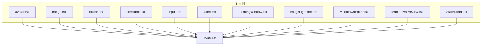
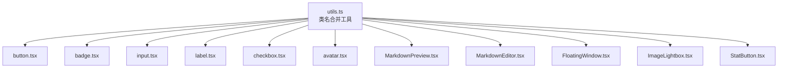
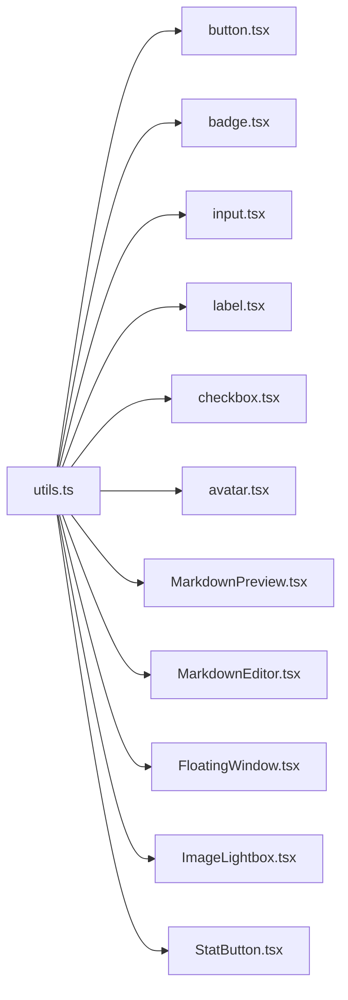
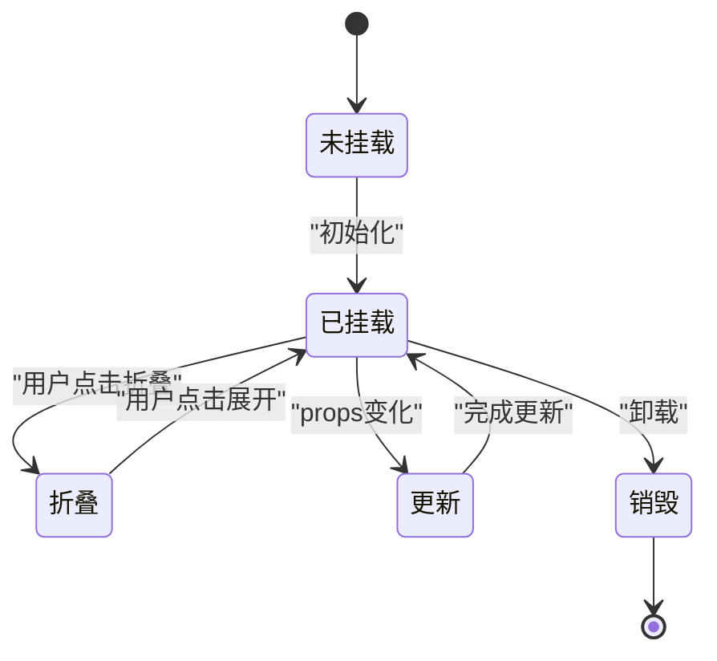

# UI组件

<cite>
**本文引用的文件**
- [avatar.tsx](file://my-vite-app/src/components/ui/avatar.tsx)
- [badge.tsx](file://my-vite-app/src/components/ui/badge.tsx)
- [button.tsx](file://my-vite-app/src/components/ui/button.tsx)
- [checkbox.tsx](file://my-vite-app/src/components/ui/checkbox.tsx)
- [input.tsx](file://my-vite-app/src/components/ui/input.tsx)
- [label.tsx](file://my-vite-app/src/components/ui/label.tsx)
- [FloatingWindow.tsx](file://my-vite-app/src/components/ui/FloatingWindow.tsx)
- [ImageLightbox.tsx](file://my-vite-app/src/components/ui/ImageLightbox.tsx)
- [MarkdownEditor.tsx](file://my-vite-app/src/components/ui/MarkdownEditor.tsx)
- [MarkdownPreview.tsx](file://my-vite-app/src/components/ui/MarkdownPreview.tsx)
- [StatButton.tsx](file://my-vite-app/src/components/ui/StatButton.tsx)
- [utils.ts](file://my-vite-app/src/lib/utils.ts)
- [avatar.test.tsx](file://my-vite-app/src/components/ui/avatar.test.tsx)
- [badge.test.tsx](file://my-vite-app/src/components/ui/badge.test.tsx)
- [checkbox.test.tsx](file://my-vite-app/src/components/ui/checkbox.test.tsx)
</cite>

## 目录
1. [引言](#引言)
2. [项目结构](#项目结构)
3. [核心组件](#核心组件)
4. [架构总览](#架构总览)
5. [详细组件分析](#详细组件分析)
6. [依赖分析](#依赖分析)
7. [性能考虑](#性能考虑)
8. [故障排查指南](#故障排查指南)
9. [结论](#结论)
10. [附录](#附录)

## 引言
本文件面向RAG社区平台前端UI组件库，系统性梳理并说明所有React组件的功能特性、属性配置、事件处理、样式定制与可访问性支持；阐述组件生命周期、状态管理与性能优化策略；提供使用示例与最佳实践，涵盖主题定制、响应式设计与无障碍访问；解释组件与后端服务的集成方式与数据绑定机制。目标是帮助开发者快速理解、正确使用并扩展这些UI组件。

## 项目结构
UI组件集中位于前端工程的组件目录中，采用按功能域分层组织的方式，便于复用与维护。核心UI组件主要位于“ui”子目录，配套工具函数位于“lib/utils.ts”，并配有基础单元测试以验证行为与类名合并逻辑。

图表来源
- [avatar.tsx:1-49](file://my-vite-app/src/components/ui/avatar.tsx#L1-L49)
- [badge.tsx:1-37](file://my-vite-app/src/components/ui/badge.tsx#L1-L37)
- [button.tsx:1-43](file://my-vite-app/src/components/ui/button.tsx#L1-L43)
- [checkbox.tsx:1-29](file://my-vite-app/src/components/ui/checkbox.tsx#L1-L29)
- [input.tsx:1-20](file://my-vite-app/src/components/ui/input.tsx#L1-L20)
- [label.tsx:1-13](file://my-vite-app/src/components/ui/label.tsx#L1-L13)
- [FloatingWindow.tsx:1-401](file://my-vite-app/src/components/ui/FloatingWindow.tsx#L1-L401)
- [ImageLightbox.tsx:1-44](file://my-vite-app/src/components/ui/ImageLightbox.tsx#L1-L44)
- [MarkdownEditor.tsx:1-427](file://my-vite-app/src/components/ui/MarkdownEditor.tsx#L1-L427)
- [MarkdownPreview.tsx:1-312](file://my-vite-app/src/components/ui/MarkdownPreview.tsx#L1-L312)
- [StatButton.tsx:1-43](file://my-vite-app/src/components/ui/StatButton.tsx#L1-L43)
- [utils.ts:1-11](file://my-vite-app/src/lib/utils.ts#L1-L11)

章节来源
- [utils.ts:1-11](file://my-vite-app/src/lib/utils.ts#L1-L11)

## 核心组件
本节概览所有UI组件的能力边界与典型用途：
- 基础控件：按钮、输入框、标签、复选框、徽章、头像
- 内容渲染：Markdown预览、Markdown编辑器
- 交互容器：浮动窗口、图片灯箱
- 统计按钮：用于展示与交互统计项

章节来源
- [button.tsx:1-43](file://my-vite-app/src/components/ui/button.tsx#L1-L43)
- [input.tsx:1-20](file://my-vite-app/src/components/ui/input.tsx#L1-L20)
- [label.tsx:1-13](file://my-vite-app/src/components/ui/label.tsx#L1-L13)
- [checkbox.tsx:1-29](file://my-vite-app/src/components/ui/checkbox.tsx#L1-L29)
- [badge.tsx:1-37](file://my-vite-app/src/components/ui/badge.tsx#L1-L37)
- [avatar.tsx:1-49](file://my-vite-app/src/components/ui/avatar.tsx#L1-L49)
- [MarkdownPreview.tsx:1-312](file://my-vite-app/src/components/ui/MarkdownPreview.tsx#L1-L312)
- [MarkdownEditor.tsx:1-427](file://my-vite-app/src/components/ui/MarkdownEditor.tsx#L1-L427)
- [FloatingWindow.tsx:1-401](file://my-vite-app/src/components/ui/FloatingWindow.tsx#L1-L401)
- [ImageLightbox.tsx:1-44](file://my-vite-app/src/components/ui/ImageLightbox.tsx#L1-L44)
- [StatButton.tsx:1-43](file://my-vite-app/src/components/ui/StatButton.tsx#L1-L43)

## 架构总览
UI组件通过统一的类名合并工具实现主题与样式的一致性；复杂交互组件通过内部状态与副作用管理实现拖拽、调整大小、折叠展开等行为；Markdown相关组件通过插件链路实现语法高亮、安全净化与自定义渲染。

图表来源
- [utils.ts:1-11](file://my-vite-app/src/lib/utils.ts#L1-L11)
- [button.tsx:1-43](file://my-vite-app/src/components/ui/button.tsx#L1-L43)
- [badge.tsx:1-37](file://my-vite-app/src/components/ui/badge.tsx#L1-L37)
- [input.tsx:1-20](file://my-vite-app/src/components/ui/input.tsx#L1-L20)
- [label.tsx:1-13](file://my-vite-app/src/components/ui/label.tsx#L1-L13)
- [checkbox.tsx:1-29](file://my-vite-app/src/components/ui/checkbox.tsx#L1-L29)
- [avatar.tsx:1-49](file://my-vite-app/src/components/ui/avatar.tsx#L1-L49)
- [MarkdownPreview.tsx:1-312](file://my-vite-app/src/components/ui/MarkdownPreview.tsx#L1-L312)
- [MarkdownEditor.tsx:1-427](file://my-vite-app/src/components/ui/MarkdownEditor.tsx#L1-L427)
- [FloatingWindow.tsx:1-401](file://my-vite-app/src/components/ui/FloatingWindow.tsx#L1-L401)
- [ImageLightbox.tsx:1-44](file://my-vite-app/src/components/ui/ImageLightbox.tsx#L1-L44)
- [StatButton.tsx:1-43](file://my-vite-app/src/components/ui/StatButton.tsx#L1-L43)

## 详细组件分析

### 按钮 Button
- 功能特性
  - 支持多种尺寸与外观变体，通过类名映射实现一致的主题风格
  - 支持作为子元素渲染（asChild）以提升语义与可访问性
- 属性配置
  - variant: default | outline | ghost | secondary
  - size: default | sm | lg | icon
  - 其他原生button属性透传
- 事件处理
  - 透传onClick等原生事件
- 样式定制
  - 使用类名合并工具实现覆盖与叠加
- 生命周期与状态
  - 无内部状态，纯展示型组件
- 性能优化
  - 通过预计算类名减少运行时开销
- 可访问性
  - 默认button类型，支持禁用态与焦点环
- 最佳实践
  - 优先使用变体与尺寸枚举，避免内联样式
  - 图标按钮使用icon尺寸，确保视觉一致

章节来源
- [button.tsx:1-43](file://my-vite-app/src/components/ui/button.tsx#L1-L43)
- [utils.ts:1-11](file://my-vite-app/src/lib/utils.ts#L1-L11)

### 输入框 Input
- 功能特性
  - 提供基础输入样式与焦点态反馈
- 属性配置
  - 透传HTMLInputElement属性
- 事件处理
  - 透传onChange等原生事件
- 样式定制
  - 通过className叠加默认样式
- 生命周期与状态
  - 无内部状态，受控组件
- 性能优化
  - 无额外开销
- 可访问性
  - 与label配合使用，支持占位符与禁用态
- 最佳实践
  - 与Label组合使用，明确语义关联

章节来源
- [input.tsx:1-20](file://my-vite-app/src/components/ui/input.tsx#L1-L20)
- [label.tsx:1-13](file://my-vite-app/src/components/ui/label.tsx#L1-L13)
- [utils.ts:1-11](file://my-vite-app/src/lib/utils.ts#L1-L11)

### 标签 Label
- 功能特性
  - 与表单控件配对，提供可访问的文本标签
- 属性配置
  - 透传HTMLLabelElement属性
- 事件处理
  - 透传onClick等原生事件
- 样式定制
  - 通过className叠加默认样式
- 生命周期与状态
  - 无内部状态
- 性能优化
  - 无额外开销
- 可访问性
  - 与控件id关联，支持禁用态
- 最佳实践
  - 与Input/Checkbox等控件配合使用

章节来源
- [label.tsx:1-13](file://my-vite-app/src/components/ui/label.tsx#L1-L13)
- [utils.ts:1-11](file://my-vite-app/src/lib/utils.ts#L1-L11)

### 复选框 Checkbox
- 功能特性
  - 基于Radix UI实现可访问的复选框
- 属性配置
  - 透传HTMLButtonElement属性，支持defaultChecked/disabled
- 事件处理
  - 透传onChange等原生事件
- 样式定制
  - 通过className叠加默认样式
- 生命周期与状态
  - 受控/非受控均可，内部不维护状态
- 性能优化
  - 无额外开销
- 可访问性
  - 支持aria-checked/data-state，键盘操作友好
- 最佳实践
  - 与Label组合，明确语义

章节来源
- [checkbox.tsx:1-29](file://my-vite-app/src/components/ui/checkbox.tsx#L1-L29)
- [utils.ts:1-11](file://my-vite-app/src/lib/utils.ts#L1-L11)

### 徽章 Badge
- 功能特性
  - 提供多变体徽章，用于状态或标签展示
- 属性配置
  - variant: default | secondary | destructive | outline
- 事件处理
  - 透传原生div事件
- 样式定制
  - 通过变体类名与className叠加
- 生命周期与状态
  - 无内部状态
- 性能优化
  - 通过变体工厂生成类名
- 可访问性
  - 语义化div，可添加aria-*属性
- 最佳实践
  - 与图标/文字组合使用，保持颜色对比度

章节来源
- [badge.tsx:1-37](file://my-vite-app/src/components/ui/badge.tsx#L1-L37)
- [utils.ts:1-11](file://my-vite-app/src/lib/utils.ts#L1-L11)

### 头像 Avatar
- 功能特性
  - 提供头像根容器、图片与占位符三部分
- 属性配置
  - 透传原生元素属性，支持className叠加
- 事件处理
  - 透传原生事件
- 样式定制
  - 圆形裁剪、占位背景色等默认样式
- 生命周期与状态
  - 无内部状态
- 性能优化
  - 无额外开销
- 可访问性
  - 图片需提供alt，占位符提供文本
- 最佳实践
  - 图片加载失败时显示占位符

章节来源
- [avatar.tsx:1-49](file://my-vite-app/src/components/ui/avatar.tsx#L1-L49)
- [utils.ts:1-11](file://my-vite-app/src/lib/utils.ts#L1-L11)

### 统计按钮 StatButton
- 功能特性
  - 用于展示统计项的按钮，支持图标、标签与数字
- 属性配置
  - icon/label/count/active/disabled/onClick/className
- 事件处理
  - onClick回调
- 样式定制
  - 通过className叠加
- 生命周期与状态
  - 无内部状态
- 性能优化
  - 无额外开销
- 可访问性
  - 按钮类型，支持禁用态
- 最佳实践
  - 数字使用等宽字体，提升可读性

章节来源
- [StatButton.tsx:1-43](file://my-vite-app/src/components/ui/StatButton.tsx#L1-L43)

### Markdown 预览 MarkdownPreview
- 功能特性
  - 渲染Markdown，支持GFM、换行、代码高亮、安全净化
  - 自定义组件映射，支持块注释（admonition）
- 属性配置
  - markdown/className/components
- 事件处理
  - 无
- 样式定制
  - 通过className与组件映射覆盖
- 生命周期与状态
  - 无内部状态
- 性能优化
  - 使用memo化与插件链，避免重复渲染
- 可访问性
  - 语义化标签，链接新窗口打开时设置rel
- 最佳实践
  - 与MarkdownEditor保持预览规则一致

章节来源
- [MarkdownPreview.tsx:1-312](file://my-vite-app/src/components/ui/MarkdownPreview.tsx#L1-L312)

### Markdown 编辑器 MarkdownEditor
- 功能特性
  - 编辑/预览双视图，支持粘贴上传图片/附件，代码块复制
  - GFM、换行、代码高亮、安全净化
  - 支持插入文件、高度自适应与回调
- 属性配置
  - value/onChange/onInsertImage/onInsertAttachment/fileAccept/placeholder/onBoxHeightChange/editorHeightPx/toolbarAfterTabs
- 事件处理
  - 粘贴事件、文件选择事件、点击复制等
- 样式定制
  - 通过className与内联样式控制高度
- 生命周期与状态
  - 内部维护编辑态、高度、上传错误等状态
- 性能优化
  - ResizeObserver监听高度变化；memo化预览内容
- 可访问性
  - 文本域支持键盘导航与焦点环
- 最佳实践
  - 提供onInsertImage/onInsertAttachment以实现上传与回填

章节来源
- [MarkdownEditor.tsx:1-427](file://my-vite-app/src/components/ui/MarkdownEditor.tsx#L1-L427)

### 浮动窗口 FloatingWindow
- 功能特性
  - 可拖拽、可调整大小、可折叠/展开、吸附停靠、持久化位置
- 属性配置
  - storageKey/title/titleRight/children/defaultRect/defaultAnchor/snapAnchorOnMount/anchorMargin/collapsedWidth/initialCollapsed/defaultCollapsed/minWidth/minHeight/zIndexClassName/onClose
- 事件处理
  - 拖拽/调整大小指针事件、窗口resize事件、关闭回调
- 样式定制
  - 通过zIndexClassName与固定定位控制层级
- 生命周期与状态
  - 内部维护矩形、折叠状态、拖拽/调整状态、本地存储
- 性能优化
  - 指针事件去抖与边界约束；仅在必要时更新
- 可访问性
  - 对话框语义与键盘交互（如Esc关闭）
- 最佳实践
  - 使用storageKey持久化用户偏好；合理设置最小尺寸

章节来源
- [FloatingWindow.tsx:1-401](file://my-vite-app/src/components/ui/FloatingWindow.tsx#L1-L401)

### 图片灯箱 ImageLightbox
- 功能特性
  - 全屏展示图片，支持点击背景关闭、Esc键关闭
- 属性配置
  - open/src/alt/onClose
- 事件处理
  - 键盘事件、点击事件
- 样式定制
  - 通过className控制背景与居中布局
- 生命周期与状态
  - 无内部状态
- 性能优化
  - 无额外开销
- 可访问性
  - 角色与模态属性，避免焦点丢失
- 最佳实践
  - 与Markdown预览中的图片结合使用

章节来源
- [ImageLightbox.tsx:1-44](file://my-vite-app/src/components/ui/ImageLightbox.tsx#L1-L44)

## 依赖分析
- 工具函数依赖
  - 所有组件均依赖类名合并工具以保证样式一致性
- 复杂组件依赖
  - MarkdownEditor/MarkdownPreview依赖插件生态（remark/rehype）与高亮库
  - FloatingWindow依赖浏览器指针事件与本地存储API
- 可访问性依赖
  - Checkbox基于Radix UI，提供aria属性与键盘支持

图表来源
- [utils.ts:1-11](file://my-vite-app/src/lib/utils.ts#L1-L11)
- [button.tsx:1-43](file://my-vite-app/src/components/ui/button.tsx#L1-L43)
- [badge.tsx:1-37](file://my-vite-app/src/components/ui/badge.tsx#L1-L37)
- [input.tsx:1-20](file://my-vite-app/src/components/ui/input.tsx#L1-L20)
- [label.tsx:1-13](file://my-vite-app/src/components/ui/label.tsx#L1-L13)
- [checkbox.tsx:1-29](file://my-vite-app/src/components/ui/checkbox.tsx#L1-L29)
- [avatar.tsx:1-49](file://my-vite-app/src/components/ui/avatar.tsx#L1-L49)
- [MarkdownPreview.tsx:1-312](file://my-vite-app/src/components/ui/MarkdownPreview.tsx#L1-L312)
- [MarkdownEditor.tsx:1-427](file://my-vite-app/src/components/ui/MarkdownEditor.tsx#L1-L427)
- [FloatingWindow.tsx:1-401](file://my-vite-app/src/components/ui/FloatingWindow.tsx#L1-L401)
- [ImageLightbox.tsx:1-44](file://my-vite-app/src/components/ui/ImageLightbox.tsx#L1-L44)
- [StatButton.tsx:1-43](file://my-vite-app/src/components/ui/StatButton.tsx#L1-L43)

## 性能考虑
- 类名合并
  - 使用工具函数进行合并，避免重复与冲突
- 渲染优化
  - Markdown组件使用memo化与插件链，减少不必要的重渲染
  - 编辑器使用ResizeObserver监听高度变化，避免频繁布局
- 事件处理
  - 浮动窗口仅在必要时注册/移除全局事件，避免内存泄漏
- 资源加载
  - 图片与资源URL解析，避免无效请求

## 故障排查指南
- 样式异常
  - 检查是否正确引入工具函数与Tailwind配置
  - 确认变体/尺寸参数合法
- 可访问性问题
  - 复选框需与Label关联；按钮禁用态需可见
- Markdown渲染问题
  - 确保插件链顺序正确；注意安全净化规则
- 浮动窗口位置异常
  - 检查storageKey与默认尺寸；确认窗口尺寸边界
- 图片灯箱无法关闭
  - 确认open状态与事件绑定；检查Esc键监听

章节来源
- [utils.ts:1-11](file://my-vite-app/src/lib/utils.ts#L1-L11)
- [MarkdownEditor.tsx:1-427](file://my-vite-app/src/components/ui/MarkdownEditor.tsx#L1-L427)
- [FloatingWindow.tsx:1-401](file://my-vite-app/src/components/ui/FloatingWindow.tsx#L1-L401)
- [ImageLightbox.tsx:1-44](file://my-vite-app/src/components/ui/ImageLightbox.tsx#L1-L44)

## 结论
本UI组件库以简洁、可复用为核心设计原则，通过统一的类名合并工具与插件化的Markdown渲染能力，提供了从基础控件到复杂交互容器的完整解决方案。遵循本文档的最佳实践与可访问性建议，可在保证一致性的同时提升开发效率与用户体验。

## 附录

### 组件使用示例与最佳实践
- 组合模式
  - 表单：Label + Input + Button
  - 选择：Label + Checkbox
  - 展示：Badge + Avatar
- 复用策略
  - 将通用样式封装为变体/尺寸，避免重复定义
  - 使用工具函数统一类名合并
- 主题定制
  - 通过变体/尺寸枚举与className叠加实现主题切换
- 响应式设计
  - 使用相对单位与flex布局，适配不同屏幕尺寸
- 无障碍访问
  - 正确设置aria属性与标签关联；提供键盘与焦点支持
- 与后端集成
  - Markdown编辑器通过回调注入上传结果，实现内容与资源的绑定
  - 浮动窗口通过storageKey持久化用户偏好，提升连续性体验

### 组件生命周期与状态管理
- 基础控件：无内部状态，受控组件
- Markdown组件：内部维护编辑态、高度、错误状态
- 浮动窗口：内部维护矩形、折叠状态、拖拽/调整状态，并持久化到本地存储

图表来源
- [FloatingWindow.tsx:1-401](file://my-vite-app/src/components/ui/FloatingWindow.tsx#L1-L401)