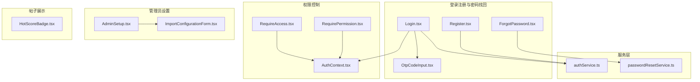
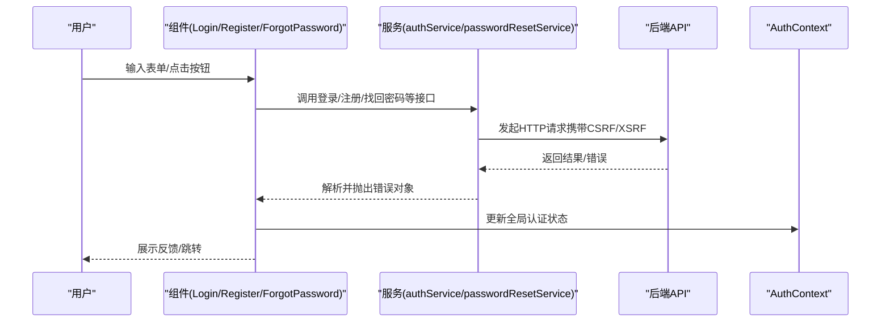
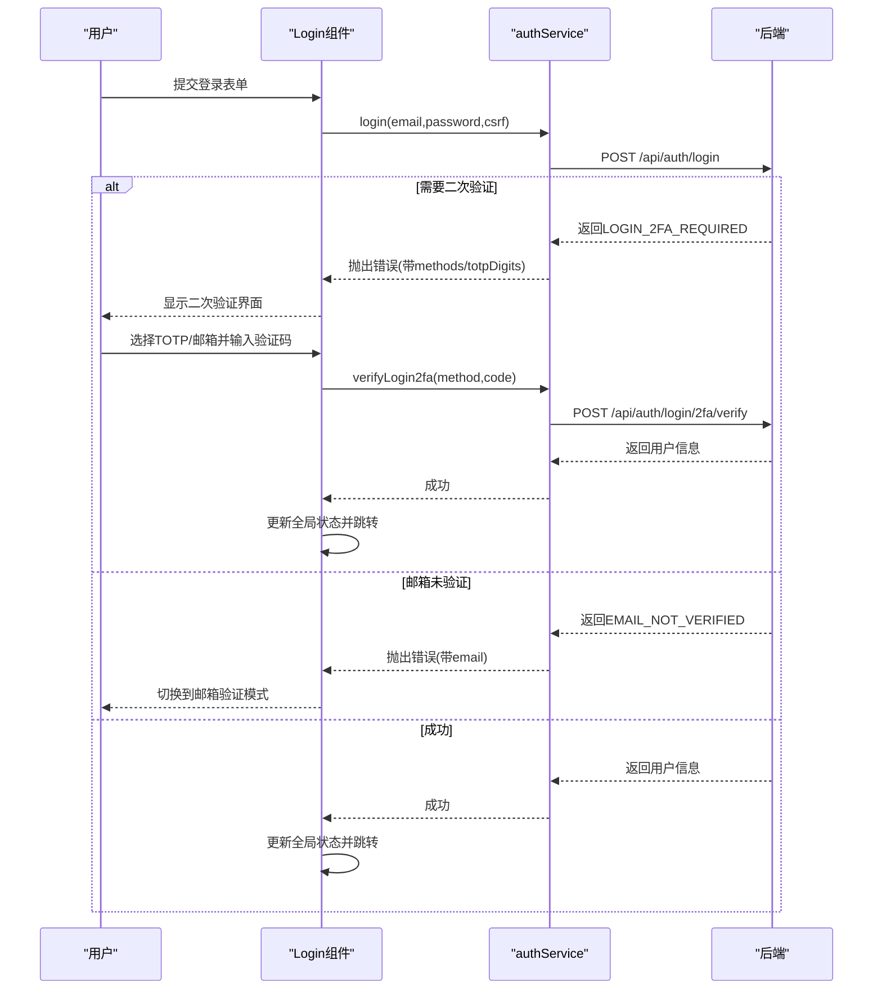
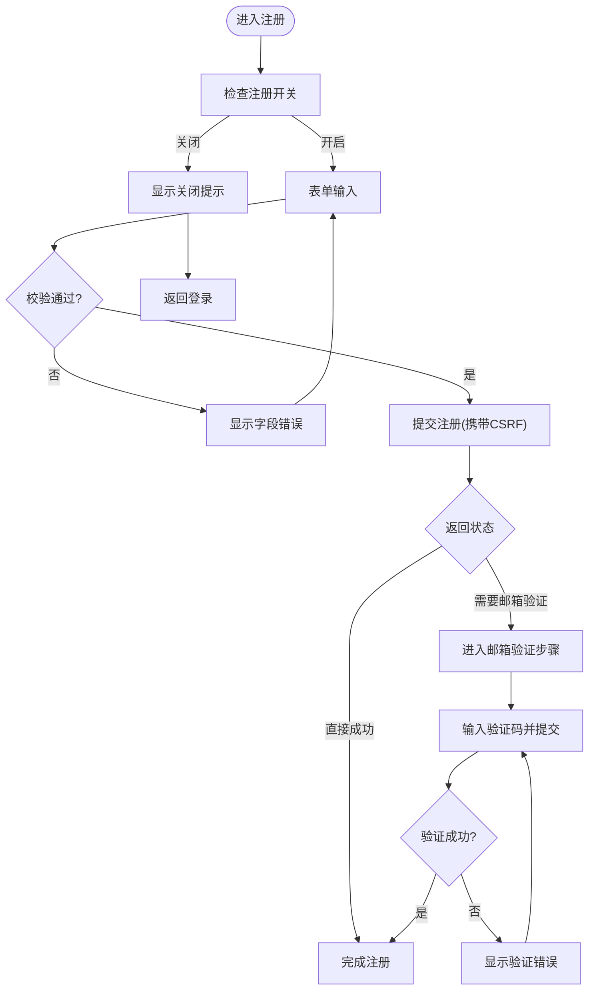
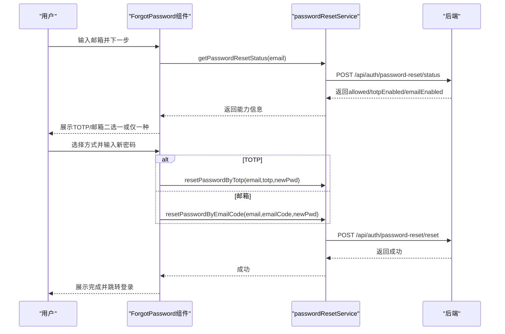
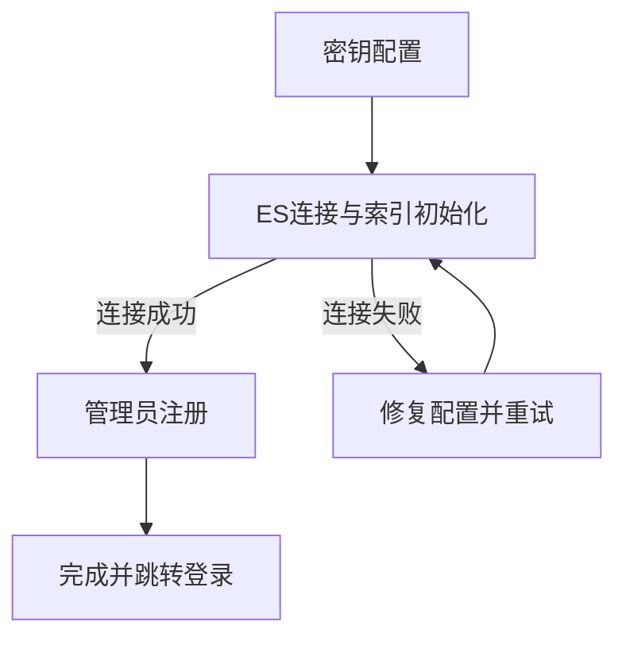
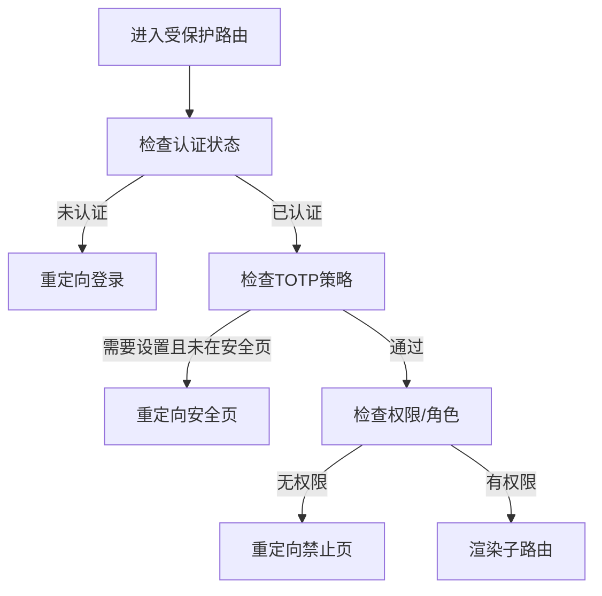
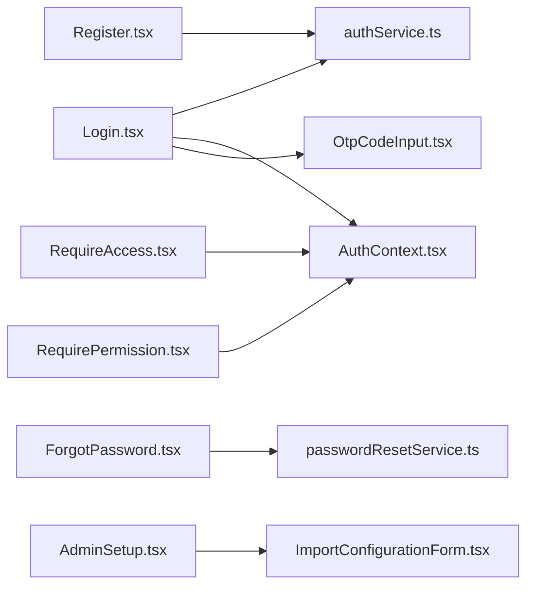

# 业务页面组件

<cite>
**本文引用的文件**
- [Login.tsx](file://my-vite-app/src/components/login/Login.tsx)
- [Register.tsx](file://my-vite-app/src/components/login/Register.tsx)
- [ForgotPassword.tsx](file://my-vite-app/src/components/login/ForgotPassword.tsx)
- [AdminSetup.tsx](file://my-vite-app/src/components/login/AdminSetup.tsx)
- [HotScoreBadge.tsx](file://my-vite-app/src/components/post/HotScoreBadge.tsx)
- [OtpCodeInput.tsx](file://my-vite-app/src/components/common/OtpCodeInput.tsx)
- [authService.ts](file://my-vite-app/src/services/authService.ts)
- [passwordResetService.ts](file://my-vite-app/src/services/passwordResetService.ts)
- [AuthContext.tsx](file://my-vite-app/src/contexts/AuthContext.tsx)
- [RequireAccess.tsx](file://my-vite-app/src/components/auth/RequireAccess.tsx)
- [RequirePermission.tsx](file://my-vite-app/src/components/auth/RequirePermission.tsx)
- [ImportConfigurationForm.tsx](file://my-vite-app/src/components/initialization/ImportConfigurationForm.tsx)
</cite>

## 目录
1. [简介](#简介)
2. [项目结构](#项目结构)
3. [核心组件](#核心组件)
4. [架构总览](#架构总览)
5. [详细组件分析](#详细组件分析)
6. [依赖关系分析](#依赖关系分析)
7. [性能考量](#性能考量)
8. [故障排查指南](#故障排查指南)
9. [结论](#结论)
10. [附录](#附录)

## 简介
本文件面向业务页面组件，围绕登录注册、密码找回、管理员设置、帖子展示等关键功能，系统性梳理组件职责、数据流、状态管理、与后端API的交互方式，并给出权限控制、表单验证、错误处理机制说明及用户体验与性能优化建议。目标是帮助开发者快速理解并高效扩展这些业务组件。

## 项目结构
前端采用Vite + React + TypeScript，组件位于 my-vite-app/src/components 下，服务层封装于 my-vite-app/src/services，上下文与路由守卫位于 my-vite-app/src/contexts 与 my-vite-app/src/components/auth。业务页面组件主要分布在：
- 登录注册与密码找回：login 与 common 子目录
- 帖子展示：post 子目录
- 权限控制：auth 子目录
- 管理员设置：initialization 子目录

图表来源
- [Login.tsx:1-539](file://my-vite-app/src/components/login/Login.tsx#L1-L539)
- [Register.tsx:1-404](file://my-vite-app/src/components/login/Register.tsx#L1-L404)
- [ForgotPassword.tsx:1-378](file://my-vite-app/src/components/login/ForgotPassword.tsx#L1-L378)
- [OtpCodeInput.tsx:1-174](file://my-vite-app/src/components/common/OtpCodeInput.tsx#L1-L174)
- [RequireAccess.tsx:1-68](file://my-vite-app/src/components/auth/RequireAccess.tsx#L1-L68)
- [RequirePermission.tsx:1-43](file://my-vite-app/src/components/auth/RequirePermission.tsx#L1-L43)
- [AuthContext.tsx:1-111](file://my-vite-app/src/contexts/AuthContext.tsx#L1-L111)
- [AdminSetup.tsx:1-9](file://my-vite-app/src/components/login/AdminSetup.tsx#L1-L9)
- [ImportConfigurationForm.tsx:1-747](file://my-vite-app/src/components/initialization/ImportConfigurationForm.tsx#L1-L747)
- [authService.ts:1-376](file://my-vite-app/src/services/authService.ts#L1-L376)
- [passwordResetService.ts:1-98](file://my-vite-app/src/services/passwordResetService.ts#L1-L98)

章节来源
- [Login.tsx:1-539](file://my-vite-app/src/components/login/Login.tsx#L1-L539)
- [Register.tsx:1-404](file://my-vite-app/src/components/login/Register.tsx#L1-L404)
- [ForgotPassword.tsx:1-378](file://my-vite-app/src/components/login/ForgotPassword.tsx#L1-L378)
- [OtpCodeInput.tsx:1-174](file://my-vite-app/src/components/common/OtpCodeInput.tsx#L1-L174)
- [RequireAccess.tsx:1-68](file://my-vite-app/src/components/auth/RequireAccess.tsx#L1-L68)
- [RequirePermission.tsx:1-43](file://my-vite-app/src/components/auth/RequirePermission.tsx#L1-L43)
- [AuthContext.tsx:1-111](file://my-vite-app/src/contexts/AuthContext.tsx#L1-L111)
- [AdminSetup.tsx:1-9](file://my-vite-app/src/components/login/AdminSetup.tsx#L1-L9)
- [ImportConfigurationForm.tsx:1-747](file://my-vite-app/src/components/initialization/ImportConfigurationForm.tsx#L1-L747)
- [authService.ts:1-376](file://my-vite-app/src/services/authService.ts#L1-L376)
- [passwordResetService.ts:1-98](file://my-vite-app/src/services/passwordResetService.ts#L1-L98)

## 核心组件
- 登录页（Login）：支持邮箱+密码登录、二次验证（TOTP/邮箱）、注册状态联动、邮箱验证码重发与冷却计时、记住我、CSRF保护。
- 注册页（Register）：表单校验（用户名、密码、确认密码、邮箱）、注册状态开关、邮箱验证码流程、步骤化UI。
- 密码找回（ForgotPassword）：查询找回能力（TOTP/邮箱）、发送邮箱验证码、TOTP/邮箱两种重置路径、新密码校验。
- 管理员设置（AdminSetup/ImportConfigurationForm）：系统初始化向导（三步走），包括密钥配置、ES连接与索引初始化、管理员注册。
- 帖子热度徽标（HotScoreBadge）：通用热度数值展示组件，支持文本与徽章两种变体。
- 一次性验证码输入（OtpCodeInput）：多格数字输入、粘贴填充、键盘导航、自动完成回调。
- 权限守卫（RequireAccess/RequirePermission）：统一的认证与授权路由守卫，支持RBAC权限与角色豁免。
- 认证上下文（AuthContext）：全局认证状态、TOTP策略与状态刷新、安全门控刷新。

章节来源
- [Login.tsx:1-539](file://my-vite-app/src/components/login/Login.tsx#L1-L539)
- [Register.tsx:1-404](file://my-vite-app/src/components/login/Register.tsx#L1-L404)
- [ForgotPassword.tsx:1-378](file://my-vite-app/src/components/login/ForgotPassword.tsx#L1-L378)
- [AdminSetup.tsx:1-9](file://my-vite-app/src/components/login/AdminSetup.tsx#L1-L9)
- [ImportConfigurationForm.tsx:1-747](file://my-vite-app/src/components/initialization/ImportConfigurationForm.tsx#L1-L747)
- [HotScoreBadge.tsx:1-41](file://my-vite-app/src/components/post/HotScoreBadge.tsx#L1-L41)
- [OtpCodeInput.tsx:1-174](file://my-vite-app/src/components/common/OtpCodeInput.tsx#L1-L174)
- [RequireAccess.tsx:1-68](file://my-vite-app/src/components/auth/RequireAccess.tsx#L1-L68)
- [RequirePermission.tsx:1-43](file://my-vite-app/src/components/auth/RequirePermission.tsx#L1-L43)
- [AuthContext.tsx:1-111](file://my-vite-app/src/contexts/AuthContext.tsx#L1-L111)

## 架构总览
整体采用“组件-服务-上下文-守卫”的分层设计：
- 组件负责UI与交互状态
- 服务层封装HTTP调用与错误包装
- 上下文提供全局认证与权限状态
- 守卫在路由层进行访问控制

图表来源
- [Login.tsx:151-222](file://my-vite-app/src/components/login/Login.tsx#L151-L222)
- [Register.tsx:101-148](file://my-vite-app/src/components/login/Register.tsx#L101-L148)
- [ForgotPassword.tsx:116-138](file://my-vite-app/src/components/login/ForgotPassword.tsx#L116-L138)
- [authService.ts:55-100](file://my-vite-app/src/services/authService.ts#L55-L100)
- [passwordResetService.ts:10-50](file://my-vite-app/src/services/passwordResetService.ts#L10-L50)
- [AuthContext.tsx:42-75](file://my-vite-app/src/contexts/AuthContext.tsx#L42-L75)

## 详细组件分析

### 登录组件（Login）
- 数据流与状态
  - 表单状态：邮箱、密码、记住我
  - 验证状态：邮箱验证码模式、二次验证模式（TOTP/邮箱）
  - 加载与错误：登录、二次验证、验证码重发的loading与错误消息
  - CSRF令牌：组件挂载时拉取并注入请求头
  - 注册状态联动：根据后端返回的注册开关决定注册入口显隐
- 与后端API交互
  - 登录：POST /api/auth/login（携带CSRF）
  - 二次验证：POST /api/auth/login/2fa/verify
  - 二次验证重发：POST /api/auth/login/2fa/resend-email
  - 注册验证码重发：POST /api/auth/register/resend-code
  - 注册验证码校验：POST /api/auth/register/verify
  - 当前管理员：GET /api/auth/current-admin
- 权限与安全
  - CSRF保护：通过服务层工具读取/清理令牌
  - 二次验证：根据后端返回的方法列表动态渲染
  - 记住我：本地持久化用户信息（谨慎使用）
- 错误处理
  - 分类错误：邮箱未验证、需要二次验证、通用登录失败
  - 冷却计时：验证码重发冷却时间本地持久化
- 用户体验
  - 轮播背景图、步骤提示、禁用态按钮、自动聚焦
  - 一键跳转注册/忘记密码

图表来源
- [Login.tsx:151-222](file://my-vite-app/src/components/login/Login.tsx#L151-L222)
- [Login.tsx:298-335](file://my-vite-app/src/components/login/Login.tsx#L298-L335)
- [authService.ts:55-100](file://my-vite-app/src/services/authService.ts#L55-L100)
- [authService.ts:130-150](file://my-vite-app/src/services/authService.ts#L130-L150)

章节来源
- [Login.tsx:1-539](file://my-vite-app/src/components/login/Login.tsx#L1-L539)
- [authService.ts:55-100](file://my-vite-app/src/services/authService.ts#L55-L100)
- [authService.ts:130-150](file://my-vite-app/src/services/authService.ts#L130-L150)

### 注册组件（Register）
- 数据流与状态
  - 表单状态：用户名、密码、确认密码、邮箱
  - 步骤状态：form/verify/done
  - 注册开关：从后端获取注册状态，关闭时提示并禁用注册入口
  - 验证码：邮箱验证码输入与重发
- 与后端API交互
  - 注册：POST /api/auth/register（携带CSRF）
  - 注册状态：POST /api/auth/register（返回状态与消息）
  - 验证注册：POST /api/auth/register/verify
  - 重发验证码：POST /api/auth/register/resend-code
- 表单验证
  - 用户名长度、密码长度、两次密码一致性、邮箱格式
- 错误处理
  - 字段级错误映射、通用错误提示
- 用户体验
  - 步骤化UI、成功提示、一键去登录

图表来源
- [Register.tsx:101-148](file://my-vite-app/src/components/login/Register.tsx#L101-L148)
- [Register.tsx:150-168](file://my-vite-app/src/components/login/Register.tsx#L150-L168)
- [authService.ts:288-321](file://my-vite-app/src/services/authService.ts#L288-L321)
- [authService.ts:323-346](file://my-vite-app/src/services/authService.ts#L323-L346)
- [authService.ts:348-375](file://my-vite-app/src/services/authService.ts#L348-L375)

章节来源
- [Register.tsx:1-404](file://my-vite-app/src/components/login/Register.tsx#L1-L404)
- [authService.ts:288-321](file://my-vite-app/src/services/authService.ts#L288-L321)
- [authService.ts:323-346](file://my-vite-app/src/services/authService.ts#L323-L346)
- [authService.ts:348-375](file://my-vite-app/src/services/authService.ts#L348-L375)

### 密码找回组件（ForgotPassword）
- 数据流与状态
  - 步骤：email -> reset -> done
  - 验证方式：TOTP或邮箱（或二者皆有）
  - 发送邮箱验证码：倒计时冷却
  - 新密码与确认密码校验
- 与后端API交互
  - 查询找回能力：POST /api/auth/password-reset/status
  - 发送邮箱验证码：POST /api/auth/password-reset/send-code
  - 重置密码（TOTP）：POST /api/auth/password-reset/reset
  - 重置密码（邮箱验证码）：POST /api/auth/password-reset/reset
- 错误处理
  - 能力查询失败、验证码发送失败、重置失败
- 用户体验
  - 能力提示、二选一按钮、一键返回

图表来源
- [ForgotPassword.tsx:86-138](file://my-vite-app/src/components/login/ForgotPassword.tsx#L86-L138)
- [ForgotPassword.tsx:140-155](file://my-vite-app/src/components/login/ForgotPassword.tsx#L140-L155)
- [passwordResetService.ts:10-50](file://my-vite-app/src/services/passwordResetService.ts#L10-L50)
- [passwordResetService.ts:81-97](file://my-vite-app/src/services/passwordResetService.ts#L81-L97)

章节来源
- [ForgotPassword.tsx:1-378](file://my-vite-app/src/components/login/ForgotPassword.tsx#L1-L378)
- [passwordResetService.ts:10-50](file://my-vite-app/src/services/passwordResetService.ts#L10-L50)
- [passwordResetService.ts:81-97](file://my-vite-app/src/services/passwordResetService.ts#L81-L97)

### 管理员设置组件（AdminSetup/ImportConfigurationForm）
- 数据流与状态
  - 三步走：密钥配置 -> ES连接与索引初始化 -> 管理员注册
  - ES连接测试、索引状态检查、索引创建
  - 配置导入（.env）、密钥生成（TOTP）
- 与后端API交互
  - 测试ES连接、检查索引状态、初始化索引
  - 保存配置、完成初始化、注册管理员
- 错误处理
  - 友好错误提示（认证失败/连接拒绝等）
- 用户体验
  - 步骤指示器、进度遮罩、帮助说明弹窗

图表来源
- [AdminSetup.tsx:1-9](file://my-vite-app/src/components/login/AdminSetup.tsx#L1-L9)
- [ImportConfigurationForm.tsx:187-216](file://my-vite-app/src/components/initialization/ImportConfigurationForm.tsx#L187-L216)
- [ImportConfigurationForm.tsx:251-287](file://my-vite-app/src/components/initialization/ImportConfigurationForm.tsx#L251-L287)

章节来源
- [AdminSetup.tsx:1-9](file://my-vite-app/src/components/login/AdminSetup.tsx#L1-L9)
- [ImportConfigurationForm.tsx:1-747](file://my-vite-app/src/components/initialization/ImportConfigurationForm.tsx#L1-L747)

### 帖子热度徽标组件（HotScoreBadge）
- 数据流与状态
  - 接收任意值，内部格式化为数值或保留原值
  - 支持两种变体：文本行内展示与详情页徽章
- 性能与复杂度
  - 纯函数组件，依赖React.memo化计算，O(1)格式化
- 用户体验
  - 数字等宽字体、条件渲染空值、可定制className

章节来源
- [HotScoreBadge.tsx:1-41](file://my-vite-app/src/components/post/HotScoreBadge.tsx#L1-L41)

### 一次性验证码输入组件（OtpCodeInput）
- 数据流与状态
  - 多格输入、粘贴填充、键盘导航、自动完成回调
  - 数字规范化、焦点移动、回退处理
- 性能与复杂度
  - 使用useMemo避免重复计算，事件处理O(n)填充
- 用户体验
  - 自动聚焦首格、粘贴智能拆分、无障碍输入模式

章节来源
- [OtpCodeInput.tsx:1-174](file://my-vite-app/src/components/common/OtpCodeInput.tsx#L1-L174)

### 权限控制组件（RequireAccess/RequirePermission）
- 数据流与状态
  - 读取认证上下文与访问上下文，判断是否满足权限要求
  - 支持角色豁免、TOTP强制设置拦截
- 控制流
  - 未认证 -> 重定向登录
  - 缺少权限 -> 重定向禁止页
  - TOTP策略触发 -> 强制跳转安全页
- 用户体验
  - 加载态占位、明确的重定向来源

图表来源
- [RequireAccess.tsx:32-67](file://my-vite-app/src/components/auth/RequireAccess.tsx#L32-L67)
- [RequirePermission.tsx:19-42](file://my-vite-app/src/components/auth/RequirePermission.tsx#L19-L42)
- [AuthContext.tsx:42-94](file://my-vite-app/src/contexts/AuthContext.tsx#L42-L94)

章节来源
- [RequireAccess.tsx:1-68](file://my-vite-app/src/components/auth/RequireAccess.tsx#L1-L68)
- [RequirePermission.tsx:1-43](file://my-vite-app/src/components/auth/RequirePermission.tsx#L1-L43)
- [AuthContext.tsx:1-111](file://my-vite-app/src/contexts/AuthContext.tsx#L1-L111)

## 依赖关系分析
- 组件与服务
  - 登录/注册/找回密码均依赖对应服务封装的HTTP调用
  - 服务层对后端错误进行结构化解包并抛出可读错误
- 组件与上下文
  - 登录成功后更新AuthContext中的用户与认证状态
  - 路由守卫依赖AuthContext与AccessContext进行访问控制
- 组件间协作
  - Login使用OtpCodeInput处理TOTP输入
  - AdminSetup委托ImportConfigurationForm执行初始化流程

图表来源
- [Login.tsx:1-539](file://my-vite-app/src/components/login/Login.tsx#L1-L539)
- [Register.tsx:1-404](file://my-vite-app/src/components/login/Register.tsx#L1-L404)
- [ForgotPassword.tsx:1-378](file://my-vite-app/src/components/login/ForgotPassword.tsx#L1-L378)
- [authService.ts:1-376](file://my-vite-app/src/services/authService.ts#L1-L376)
- [passwordResetService.ts:1-98](file://my-vite-app/src/services/passwordResetService.ts#L1-L98)
- [AuthContext.tsx:1-111](file://my-vite-app/src/contexts/AuthContext.tsx#L1-L111)
- [RequireAccess.tsx:1-68](file://my-vite-app/src/components/auth/RequireAccess.tsx#L1-L68)
- [RequirePermission.tsx:1-43](file://my-vite-app/src/components/auth/RequirePermission.tsx#L1-L43)
- [AdminSetup.tsx:1-9](file://my-vite-app/src/components/login/AdminSetup.tsx#L1-L9)
- [ImportConfigurationForm.tsx:1-747](file://my-vite-app/src/components/initialization/ImportConfigurationForm.tsx#L1-L747)
- [OtpCodeInput.tsx:1-174](file://my-vite-app/src/components/common/OtpCodeInput.tsx#L1-L174)

章节来源
- [Login.tsx:1-539](file://my-vite-app/src/components/login/Login.tsx#L1-L539)
- [Register.tsx:1-404](file://my-vite-app/src/components/login/Register.tsx#L1-L404)
- [ForgotPassword.tsx:1-378](file://my-vite-app/src/components/login/ForgotPassword.tsx#L1-L378)
- [authService.ts:1-376](file://my-vite-app/src/services/authService.ts#L1-L376)
- [passwordResetService.ts:1-98](file://my-vite-app/src/services/passwordResetService.ts#L1-L98)
- [AuthContext.tsx:1-111](file://my-vite-app/src/contexts/AuthContext.tsx#L1-L111)
- [RequireAccess.tsx:1-68](file://my-vite-app/src/components/auth/RequireAccess.tsx#L1-L68)
- [RequirePermission.tsx:1-43](file://my-vite-app/src/components/auth/RequirePermission.tsx#L1-L43)
- [AdminSetup.tsx:1-9](file://my-vite-app/src/components/login/AdminSetup.tsx#L1-L9)
- [ImportConfigurationForm.tsx:1-747](file://my-vite-app/src/components/initialization/ImportConfigurationForm.tsx#L1-L747)
- [OtpCodeInput.tsx:1-174](file://my-vite-app/src/components/common/OtpCodeInput.tsx#L1-L174)

## 性能考量
- 状态最小化
  - 将复杂状态拆分为独立useState，减少不必要的重渲染
  - 使用useMemo稳定派生值（如OtpCodeInput的cells）
- 请求去抖与并发控制
  - 认证刷新使用ref去重并发请求，避免“闪烁”与风暴
- 本地持久化
  - 登录冷却与验证码冷却使用localStorage，降低频繁请求
- UI渲染
  - 条件渲染与占位符，避免阻塞主线程
- 网络优化
  - CSRF令牌按需获取并清理，减少无效请求
  - 批量API调用（如安全策略与TOTP状态）使用Promise.all

## 故障排查指南
- 登录失败
  - 检查CSRF令牌是否有效；查看后端返回的错误码（邮箱未验证、需要二次验证等）
  - 关注二次验证方法列表与TOTP位数
- 注册失败
  - 校验字段规则（用户名长度、密码长度、邮箱格式、两次密码一致）
  - 查看后端返回的消息或字段级错误
- 密码找回
  - 确认账号是否启用TOTP或邮箱验证码
  - 验证码发送冷却时间与邮箱可达性
- 权限拒绝
  - 检查RBAC权限与角色豁免配置
  - TOTP策略未满足时会被强制跳转安全页
- 管理员设置
  - ES连接失败常见于认证失败或地址不可达，使用友好错误提示定位问题
  - 索引状态异常时检查后端初始化日志

章节来源
- [Login.tsx:191-221](file://my-vite-app/src/components/login/Login.tsx#L191-L221)
- [Register.tsx:140-147](file://my-vite-app/src/components/login/Register.tsx#L140-L147)
- [ForgotPassword.tsx:109-137](file://my-vite-app/src/components/login/ForgotPassword.tsx#L109-L137)
- [RequireAccess.tsx:49-64](file://my-vite-app/src/components/auth/RequireAccess.tsx#L49-L64)
- [ImportConfigurationForm.tsx:37-48](file://my-vite-app/src/components/initialization/ImportConfigurationForm.tsx#L37-L48)

## 结论
上述业务页面组件围绕登录注册、密码找回、管理员设置与帖子展示构建了清晰的前端交互闭环。通过服务层抽象、上下文与守卫的配合，实现了可维护、可扩展且具备良好用户体验的业务流程。建议在后续迭代中持续完善错误提示、优化网络请求与本地状态管理，并加强端到端的集成测试覆盖。

## 附录
- 组件组合模式
  - 登录页可组合二次验证与邮箱验证两种模式，依据后端能力动态呈现
  - 注册页采用步骤化UI，结合注册状态开关提升可运维性
  - 管理员设置采用向导式流程，分阶段降低配置复杂度
- 最佳实践
  - 表单校验前置、错误归因明确
  - 权限守卫统一入口，避免分散逻辑
  - 本地状态与后端状态保持同步，必要时进行回滚与重试