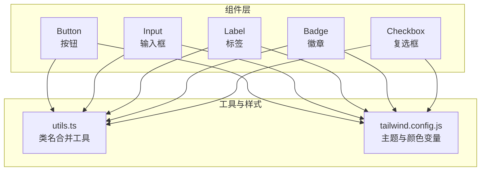
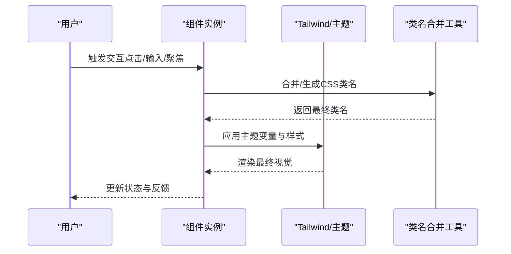
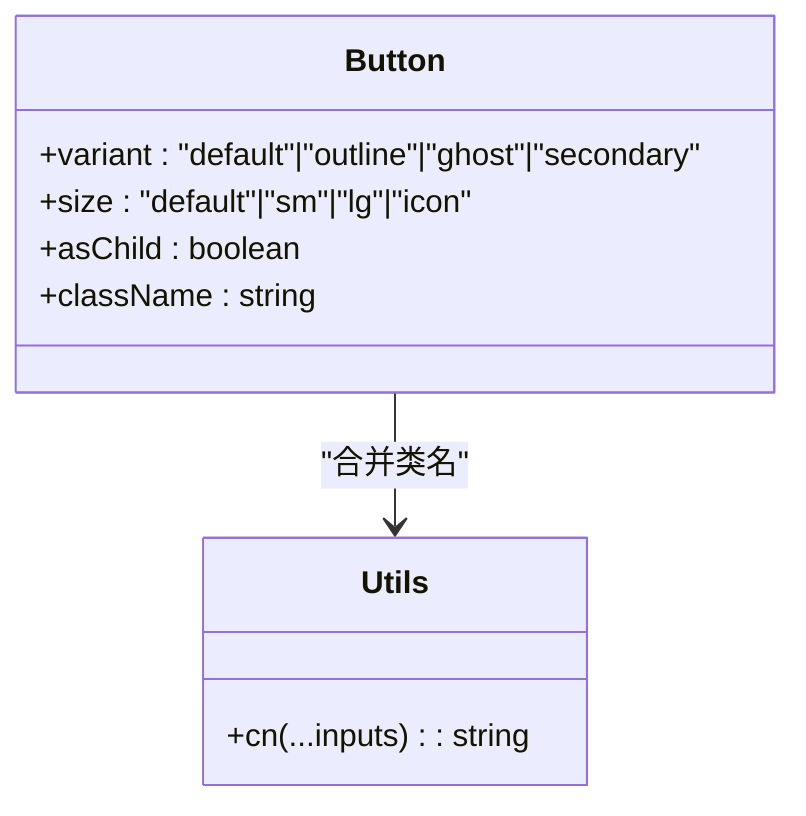
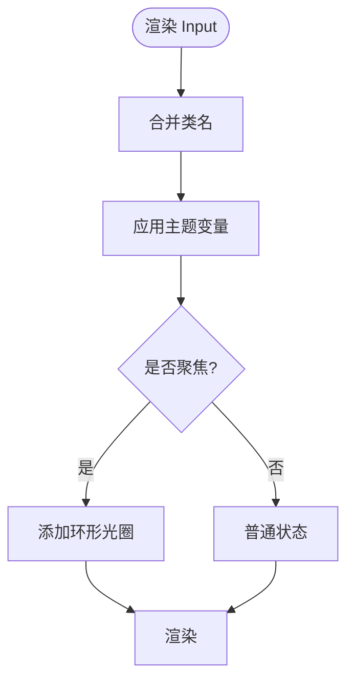
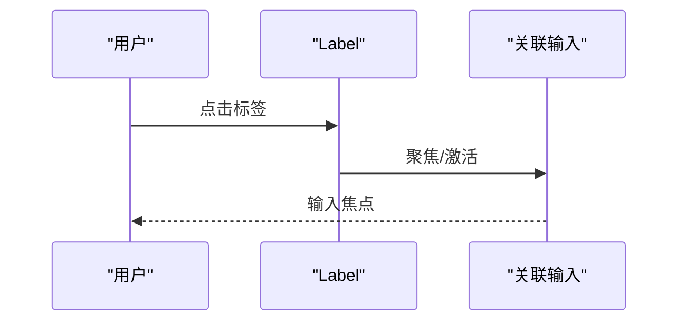
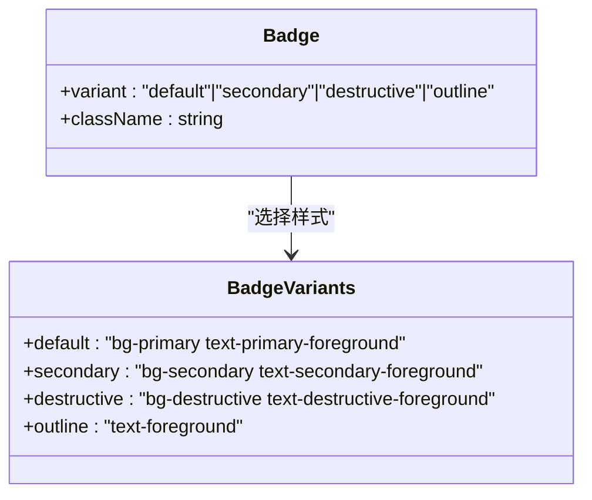
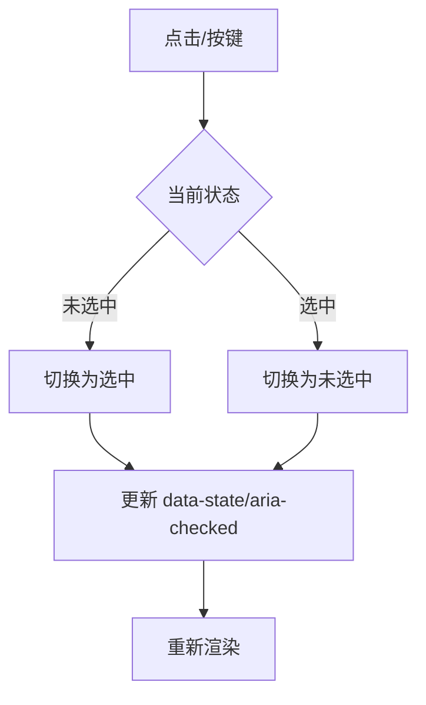
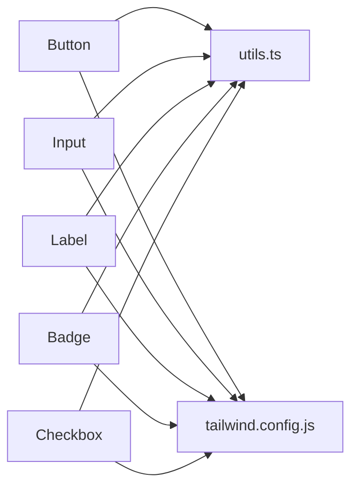

# 基础UI组件

<cite>
**本文引用的文件**
- [button.tsx](file://my-vite-app/src/components/ui/button.tsx)
- [input.tsx](file://my-vite-app/src/components/ui/input.tsx)
- [label.tsx](file://my-vite-app/src/components/ui/label.tsx)
- [badge.tsx](file://my-vite-app/src/components/ui/badge.tsx)
- [checkbox.tsx](file://my-vite-app/src/components/ui/checkbox.tsx)
- [utils.ts](file://my-vite-app/src/lib/utils.ts)
- [tailwind.config.js](file://my-vite-app/tailwind.config.js)
- [badge.test.tsx](file://my-vite-app/src/components/ui/badge.test.tsx)
- [checkbox.test.tsx](file://my-vite-app/src/components/ui/checkbox.test.tsx)
</cite>

## 目录
1. [引言](#引言)
2. [项目结构](#项目结构)
3. [核心组件](#核心组件)
4. [架构总览](#架构总览)
5. [详细组件分析](#详细组件分析)
6. [依赖关系分析](#依赖关系分析)
7. [性能考量](#性能考量)
8. [故障排查指南](#故障排查指南)
9. [结论](#结论)
10. [附录](#附录)

## 引言
本文件为项目前端基础UI组件的系统化文档，覆盖按钮、输入框、标签、徽章、复选框等常用组件。内容包括：组件功能特性、属性接口（props）、默认值、可选参数、事件处理、样式定制、主题与响应式行为、无障碍支持、最佳实践与常见问题。所有技术细节均基于仓库中的实际实现与测试用例。

## 项目结构
基础UI组件集中位于前端应用的组件目录中，采用按功能模块划分的方式组织。组件通过统一的工具函数进行类名合并，并依赖Tailwind CSS与主题变量实现一致的视觉风格与响应式行为。

图表来源
- [button.tsx:1-43](file://my-vite-app/src/components/ui/button.tsx#L1-L43)
- [input.tsx:1-20](file://my-vite-app/src/components/ui/input.tsx#L1-L20)
- [label.tsx:1-13](file://my-vite-app/src/components/ui/label.tsx#L1-L13)
- [badge.tsx:1-37](file://my-vite-app/src/components/ui/badge.tsx#L1-L37)
- [checkbox.tsx:1-29](file://my-vite-app/src/components/ui/checkbox.tsx#L1-L29)
- [utils.ts:1-11](file://my-vite-app/src/lib/utils.ts#L1-L11)
- [tailwind.config.js:1-65](file://my-vite-app/tailwind.config.js#L1-L65)

章节来源
- [button.tsx:1-43](file://my-vite-app/src/components/ui/button.tsx#L1-L43)
- [input.tsx:1-20](file://my-vite-app/src/components/ui/input.tsx#L1-L20)
- [label.tsx:1-13](file://my-vite-app/src/components/ui/label.tsx#L1-L13)
- [badge.tsx:1-37](file://my-vite-app/src/components/ui/badge.tsx#L1-L37)
- [checkbox.tsx:1-29](file://my-vite-app/src/components/ui/checkbox.tsx#L1-L29)
- [utils.ts:1-11](file://my-vite-app/src/lib/utils.ts#L1-L11)
- [tailwind.config.js:1-65](file://my-vite-app/tailwind.config.js#L1-L65)

## 核心组件
本节概述各组件的核心能力与通用设计原则：
- 统一的类名合并策略：通过工具函数对Tailwind类进行合并与去重，避免冲突。
- 主题一致性：组件样式依赖于Tailwind主题变量（如主色、次色、前景/背景、边框、输入、环形光圈等），确保在明暗模式下保持一致的视觉语义。
- 可访问性：组件遵循原生HTML语义与ARIA属性约定，例如复选框使用语义化的控件角色与状态属性。
- 响应式行为：组件尺寸与间距遵循统一的排版体系，结合Tailwind的响应式前缀实现自适应布局。

章节来源
- [utils.ts:1-11](file://my-vite-app/src/lib/utils.ts#L1-L11)
- [tailwind.config.js:11-65](file://my-vite-app/tailwind.config.js#L11-L65)

## 架构总览
基础UI组件的运行时交互与数据流如下：

图表来源
- [button.tsx:28-33](file://my-vite-app/src/components/ui/button.tsx#L28-L33)
- [input.tsx:10-15](file://my-vite-app/src/components/ui/input.tsx#L10-L15)
- [label.tsx:7-9](file://my-vite-app/src/components/ui/label.tsx#L7-L9)
- [badge.tsx:30-34](file://my-vite-app/src/components/ui/badge.tsx#L30-L34)
- [checkbox.tsx:10-25](file://my-vite-app/src/components/ui/checkbox.tsx#L10-L25)
- [utils.ts:7-9](file://my-vite-app/src/lib/utils.ts#L7-L9)
- [tailwind.config.js:18-59](file://my-vite-app/tailwind.config.js#L18-L59)

## 详细组件分析

### 按钮 Button
- 功能特性
  - 支持多种外观变体与尺寸，提供统一的交互反馈（悬停、焦点、禁用态）。
  - 可通过工具函数动态组合类名，保证样式一致性与可维护性。
- 属性接口（props）
  - 继承原生按钮属性，扩展以下可选参数：
    - variant: 变体类型，默认"default"
    - size: 尺寸类型，默认"default"
    - asChild: 是否以子元素形式渲染（用于组合场景）
- 默认值与可选参数
  - variant: default | outline | ghost | secondary
  - size: default | sm | lg | icon
- 事件处理
  - 支持原生按钮事件（如onClick、onFocus等），由父组件绑定。
- 样式定制
  - 通过传入className追加或覆盖类名；也可通过主题变量调整颜色与间距。
- 使用示例（路径）
  - [按钮组件定义:35-40](file://my-vite-app/src/components/ui/button.tsx#L35-L40)
  - [类名组合逻辑:28-33](file://my-vite-app/src/components/ui/button.tsx#L28-L33)
- 最佳实践
  - 在表单提交、导航跳转等关键动作上优先使用默认变体；强调操作使用secondary或destructive需谨慎。
  - 禁用态务必显式设置disabled，避免误触发。
- 常见问题
  - 图标按钮未对齐：检查是否正确使用"inline-flex"与"items-center"。
  - 焦点环样式不生效：确认已启用焦点可见性样式且未被全局样式覆盖。

图表来源
- [button.tsx:5-12](file://my-vite-app/src/components/ui/button.tsx#L5-L12)
- [button.tsx:28-33](file://my-vite-app/src/components/ui/button.tsx#L28-L33)
- [utils.ts:7-9](file://my-vite-app/src/lib/utils.ts#L7-L9)

章节来源
- [button.tsx:1-43](file://my-vite-app/src/components/ui/button.tsx#L1-L43)
- [utils.ts:1-11](file://my-vite-app/src/lib/utils.ts#L1-L11)

### 输入框 Input
- 功能特性
  - 提供基础文本输入能力，内置聚焦、禁用、占位符等状态样式。
- 属性接口（props）
  - 继承原生输入属性，扩展className用于样式覆盖。
- 默认值与可选参数
  - 无特定默认变体；通过className控制外观。
- 事件处理
  - 支持onChange、onFocus、onBlur等原生事件。
- 样式定制
  - 通过className追加边框、圆角、内边距、字体大小等。
- 使用示例（路径）
  - [输入框组件定义:7-16](file://my-vite-app/src/components/ui/input.tsx#L7-L16)
- 最佳实践
  - 与Label配合使用，提升可访问性与可用性。
  - 对必填字段提供明确的错误提示与视觉反馈。
- 常见问题
  - 输入框高度不一致：检查是否混用不同尺寸的输入框或容器样式。

图表来源
- [input.tsx:7-16](file://my-vite-app/src/components/ui/input.tsx#L7-L16)
- [utils.ts:7-9](file://my-vite-app/src/lib/utils.ts#L7-L9)
- [tailwind.config.js:18-59](file://my-vite-app/tailwind.config.js#L18-L59)

章节来源
- [input.tsx:1-20](file://my-vite-app/src/components/ui/input.tsx#L1-L20)
- [utils.ts:1-11](file://my-vite-app/src/lib/utils.ts#L1-L11)
- [tailwind.config.js:1-65](file://my-vite-app/tailwind.config.js#L1-L65)

### 标签 Label
- 功能特性
  - 作为表单控件的语义化标签，支持禁用态与焦点态样式。
- 属性接口（props）
  - 继承原生标签属性，扩展className。
- 默认值与可选参数
  - 无特定默认变体；通过className控制字体与间距。
- 事件处理
  - 支持onClick等事件，常用于点击切换关联控件。
- 样式定制
  - 通过className控制字号、字重、行高与禁用态透明度。
- 使用示例（路径）
  - [标签组件定义:7-10](file://my-vite-app/src/components/ui/label.tsx#L7-L10)
- 最佳实践
  - 与受控输入组件配对使用，确保点击标签能聚焦对应输入。
- 常见问题
  - 点击无效：检查是否正确关联for属性或使用受控组件。

图表来源
- [label.tsx:7-10](file://my-vite-app/src/components/ui/label.tsx#L7-L10)

章节来源
- [label.tsx:1-13](file://my-vite-app/src/components/ui/label.tsx#L1-L13)

### 徽章 Badge
- 功能特性
  - 用于展示状态、标签或计数信息，支持多种变体与默认样式。
- 属性接口（props）
  - 继承HTML div属性，扩展变体参数：
    - variant: default | secondary | destructive | outline
- 默认值与可选参数
  - 默认变体：default
- 事件处理
  - 支持onClick等事件，适合作为可交互的状态指示器。
- 样式定制
  - 通过className追加额外样式；变体由主题变量驱动。
- 使用示例（路径）
  - [徽章组件定义:30-34](file://my-vite-app/src/components/ui/badge.tsx#L30-L34)
  - [变体定义:6-24](file://my-vite-app/src/components/ui/badge.tsx#L6-L24)
- 最佳实践
  - 仅在必要时显示徽章，避免信息过载。
  - 重要状态使用destructive或secondary突出显示。
- 常见问题
  - 文字溢出：检查容器宽度与圆角样式是否影响可读性。

图表来源
- [badge.tsx:26-28](file://my-vite-app/src/components/ui/badge.tsx#L26-L28)
- [badge.tsx:6-24](file://my-vite-app/src/components/ui/badge.tsx#L6-L24)

章节来源
- [badge.tsx:1-37](file://my-vite-app/src/components/ui/badge.tsx#L1-L37)
- [badge.test.tsx:1-55](file://my-vite-app/src/components/ui/badge.test.tsx#L1-L55)

### 复选框 Checkbox
- 功能特性
  - 提供多态状态（未选中、选中、禁用），支持键盘与鼠标交互。
- 属性接口（props）
  - 继承Radix UI复选框原生属性，扩展className。
- 默认值与可选参数
  - 支持defaultChecked与disabled；状态通过data-state或aria-checked反映。
- 事件处理
  - 支持onChange、onFocus等事件；点击或空格键可切换状态。
- 样式定制
  - 通过className覆盖边框、圆角、填充色与图标颜色。
- 使用示例（路径）
  - [复选框组件定义:7-25](file://my-vite-app/src/components/ui/checkbox.tsx#L7-L25)
- 最佳实践
  - 与Label配对使用，确保可访问性；在表单中提供清晰的说明文字。
- 常见问题
  - 状态不更新：检查是否正确传递value或受控属性。

图表来源
- [checkbox.tsx:10-25](file://my-vite-app/src/components/ui/checkbox.tsx#L10-L25)
- [checkbox.test.tsx:10-32](file://my-vite-app/src/components/ui/checkbox.test.tsx#L10-L32)

章节来源
- [checkbox.tsx:1-29](file://my-vite-app/src/components/ui/checkbox.tsx#L1-L29)
- [checkbox.test.tsx:1-34](file://my-vite-app/src/components/ui/checkbox.test.tsx#L1-L34)

## 依赖关系分析
- 组件间耦合
  - 所有组件均依赖统一的类名合并工具，降低样式冲突风险。
  - 组件样式依赖Tailwind主题变量，确保跨组件风格一致。
- 外部依赖
  - Radix UI用于复选框的无障碍与状态管理。
  - class-variance-authority用于徽章的变体系统。
- 潜在循环依赖
  - 未发现组件间的直接循环导入；工具函数与配置文件为纯静态依赖。

图表来源
- [button.tsx:3-3](file://my-vite-app/src/components/ui/button.tsx#L3-L3)
- [input.tsx:3-3](file://my-vite-app/src/components/ui/input.tsx#L3-L3)
- [label.tsx:3-3](file://my-vite-app/src/components/ui/label.tsx#L3-L3)
- [badge.tsx:4-4](file://my-vite-app/src/components/ui/badge.tsx#L4-L4)
- [checkbox.tsx:5-5](file://my-vite-app/src/components/ui/checkbox.tsx#L5-L5)
- [utils.ts:1-11](file://my-vite-app/src/lib/utils.ts#L1-L11)
- [tailwind.config.js:1-65](file://my-vite-app/tailwind.config.js#L1-L65)

章节来源
- [utils.ts:1-11](file://my-vite-app/src/lib/utils.ts#L1-L11)
- [tailwind.config.js:1-65](file://my-vite-app/tailwind.config.js#L1-L65)

## 性能考量
- 类名合并成本低：工具函数对类名进行合并与去重，开销极小。
- 样式体积可控：组件仅引入必要的基础类名，避免冗余样式。
- 主题变量复用：通过主题变量减少重复声明，提升构建效率。
- 建议
  - 避免在渲染路径中频繁创建新的类名对象。
  - 合理拆分组件，减少不必要的重渲染。

## 故障排查指南
- 按钮无焦点环
  - 检查是否正确应用了焦点可见性样式；确认未被全局样式覆盖。
- 输入框聚焦无效
  - 确认未设置disabled；检查容器是否有阻止事件传播的样式。
- 标签无法聚焦输入
  - 确保Label与输入控件正确关联（如for属性或受控组件）。
- 徽章样式异常
  - 检查className是否覆盖了变体类；确认主题变量未被意外重写。
- 复选框状态不更新
  - 确认是否使用受控属性；检查事件回调是否正确传递。

章节来源
- [button.tsx:28-33](file://my-vite-app/src/components/ui/button.tsx#L28-L33)
- [input.tsx:10-15](file://my-vite-app/src/components/ui/input.tsx#L10-L15)
- [label.tsx:7-9](file://my-vite-app/src/components/ui/label.tsx#L7-L9)
- [badge.tsx:30-34](file://my-vite-app/src/components/ui/badge.tsx#L30-L34)
- [checkbox.tsx:10-25](file://my-vite-app/src/components/ui/checkbox.tsx#L10-L25)

## 结论
本项目的基础UI组件以简洁、可组合、可访问为核心设计目标，通过统一的类名合并与主题变量体系，实现了跨组件的一致性与可维护性。建议在业务组件中优先使用这些基础组件，并遵循无障碍与响应式最佳实践，以获得更稳定、可扩展的用户体验。

## 附录
- 主题变量参考（部分）
  - 主色、次色、前景/背景、卡片/弹出层、边框、输入、环形光圈、图表色等。
- 测试要点
  - 按钮：变体与尺寸组合、禁用态、焦点态。
  - 输入框：聚焦态、禁用态、占位符。
  - 标签：禁用态、与输入关联。
  - 徽章：变体样式、类名合并。
  - 复选框：默认状态、禁用态、切换行为。

章节来源
- [tailwind.config.js:18-59](file://my-vite-app/tailwind.config.js#L18-L59)
- [badge.test.tsx:1-55](file://my-vite-app/src/components/ui/badge.test.tsx#L1-L55)
- [checkbox.test.tsx:1-34](file://my-vite-app/src/components/ui/checkbox.test.tsx#L1-L34)