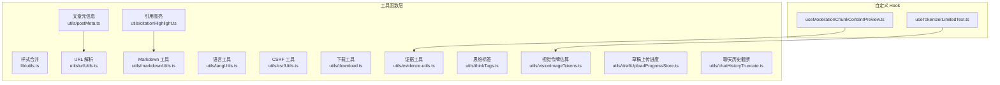
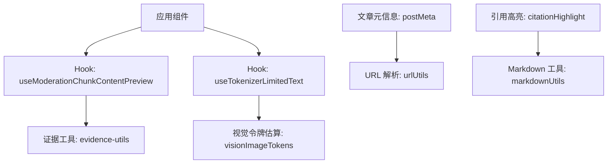
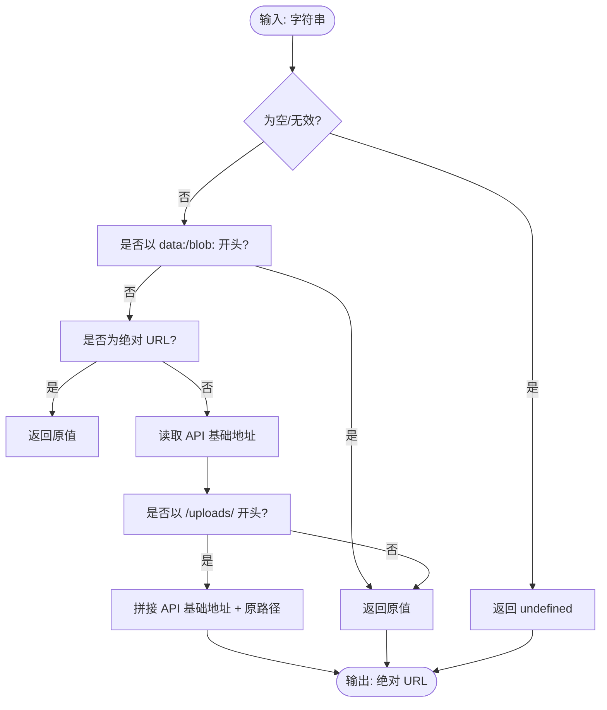
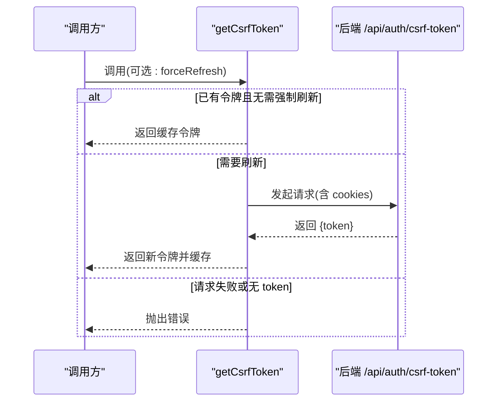
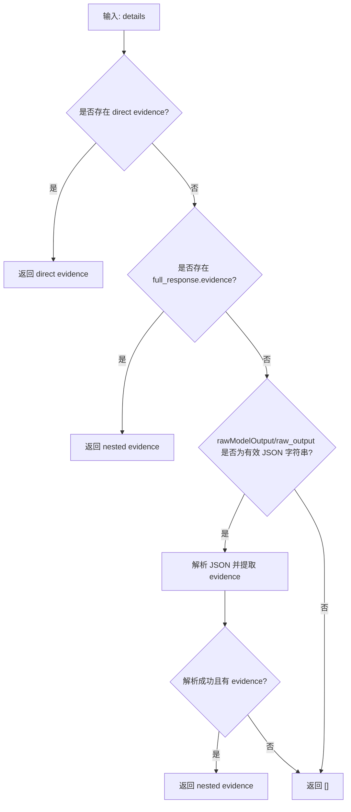
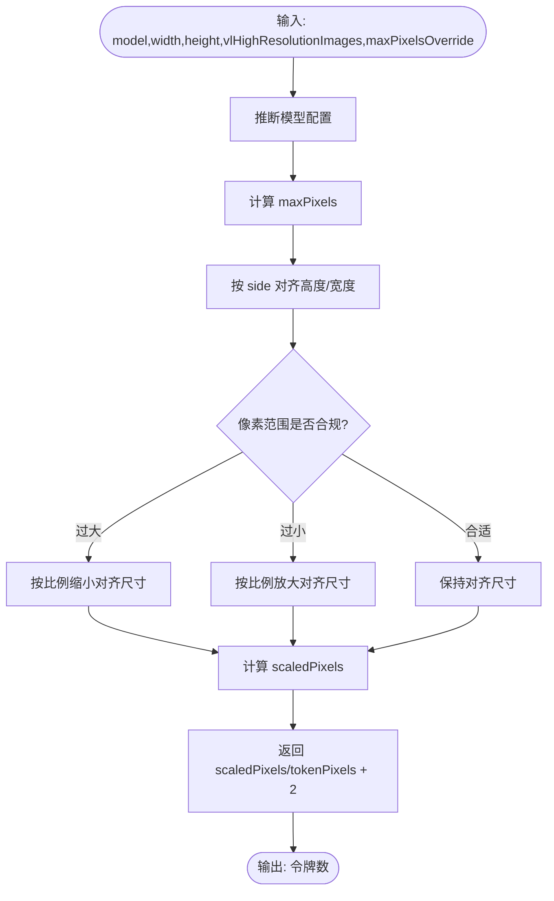
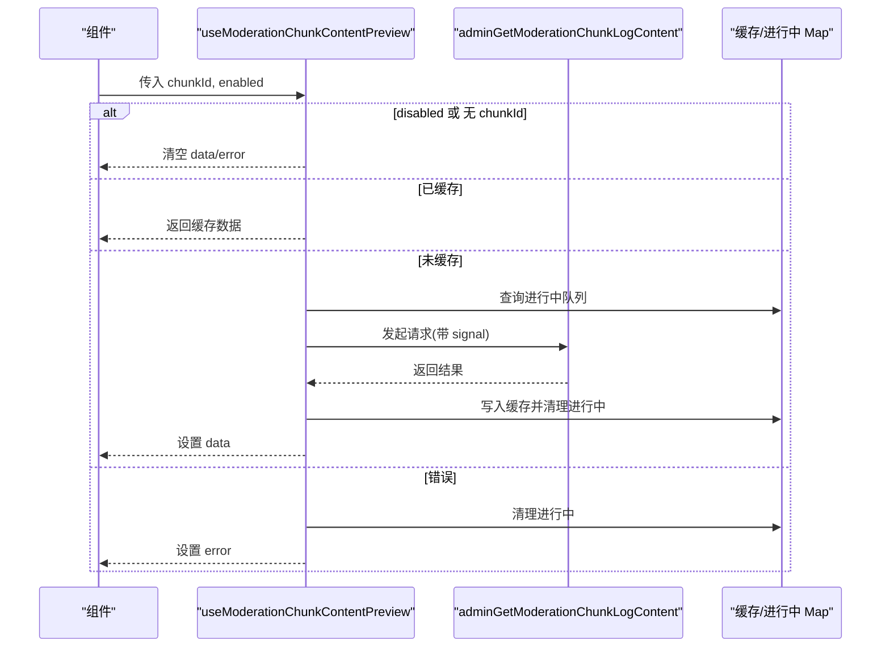
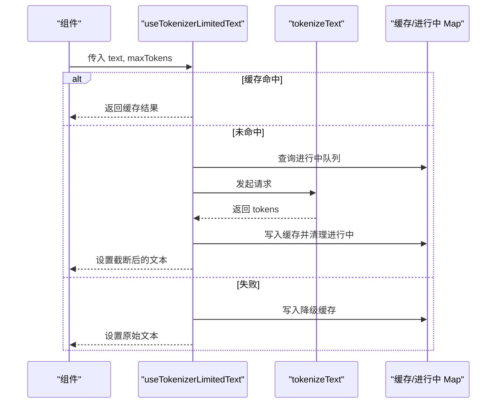
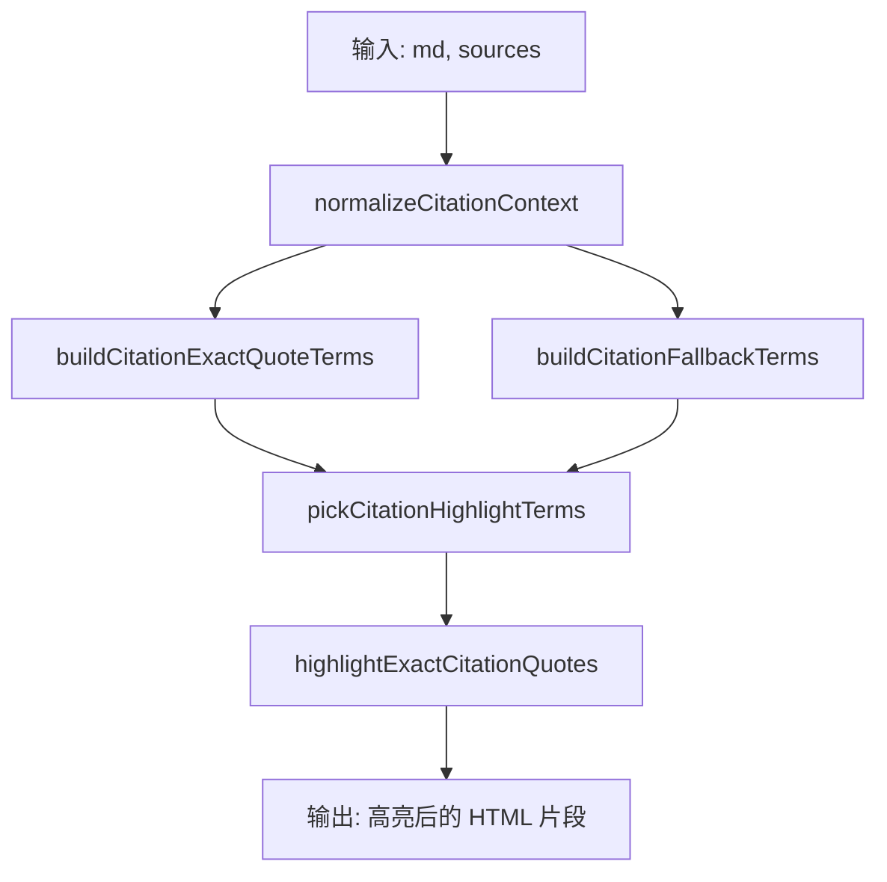
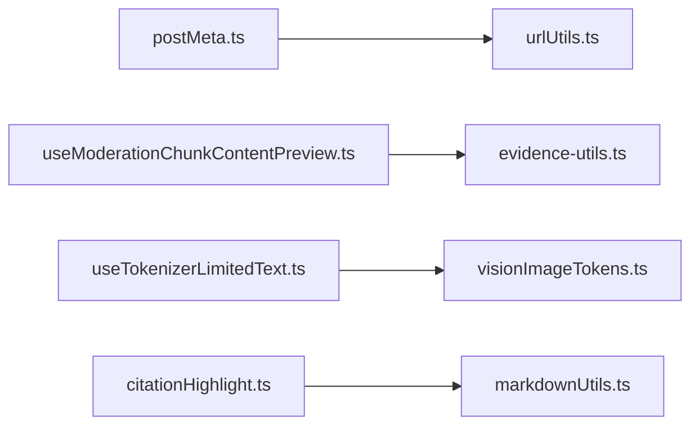

# 工具函数和辅助组件

<cite>
**本文引用的文件**
- [utils.ts](file://my-vite-app/src/lib/utils.ts)
- [urlUtils.ts](file://my-vite-app/src/utils/urlUtils.ts)
- [markdownUtils.ts](file://my-vite-app/src/utils/markdownUtils.ts)
- [langUtils.ts](file://my-vite-app/src/utils/langUtils.ts)
- [csrfUtils.ts](file://my-vite-app/src/utils/csrfUtils.ts)
- [download.ts](file://my-vite-app/src/utils/download.ts)
- [evidence-utils.ts](file://my-vite-app/src/utils/evidence-utils.ts)
- [postMeta.ts](file://my-vite-app/src/utils/postMeta.ts)
- [thinkTags.ts](file://my-vite-app/src/utils/thinkTags.ts)
- [visionImageTokens.ts](file://my-vite-app/src/utils/visionImageTokens.ts)
- [useModerationChunkContentPreview.ts](file://my-vite-app/src/hooks/useModerationChunkContentPreview.ts)
- [useTokenizerLimitedText.ts](file://my-vite-app/src/hooks/useTokenizerLimitedText.ts)
- [draftUploadProgressStore.ts](file://my-vite-app/src/utils/draftUploadProgressStore.ts)
- [chatHistoryTruncate.ts](file://my-vite-app/src/utils/chatHistoryTruncate.ts)
- [citationHighlight.ts](file://my-vite-app/src/utils/citationHighlight.ts)
</cite>

## 目录
1. [引言](#引言)
2. [项目结构](#项目结构)
3. [核心组件](#核心组件)
4. [架构总览](#架构总览)
5. [详细组件分析](#详细组件分析)
6. [依赖关系分析](#依赖关系分析)
7. [性能考量](#性能考量)
8. [故障排查指南](#故障排查指南)
9. [结论](#结论)
10. [附录](#附录)

## 引言
本文件系统性梳理前端工具函数与辅助组件，覆盖文本处理、URL 操作、数据格式化、状态管理与缓存、CSRF 安全、下载与上传进度持久化、视觉模型令牌估算、聊天历史截断、引用高亮等能力。文档提供 API 接口说明、使用场景、性能优化策略、错误处理与兼容性建议，并给出扩展与自定义开发指导。

## 项目结构
工具函数与辅助组件主要位于以下位置：
- 样式类名合并：my-vite-app/src/lib/utils.ts
- URL 与资源解析：my-vite-app/src/utils/urlUtils.ts
- Markdown 规范化与转义：my-vite-app/src/utils/markdownUtils.ts
- 语言标准化与提取：my-vite-app/src/utils/langUtils.ts
- CSRF 安全令牌：my-vite-app/src/utils/csrfUtils.ts
- 下载 Blob 文件：my-vite-app/src/utils/download.ts
- 证据项解析与指纹去重：my-vite-app/src/utils/evidence-utils.ts
- 文章元信息与封面解析：my-vite-app/src/utils/postMeta.ts
- 思维标签剥离与拆分：my-vite-app/src/utils/thinkTags.ts
- 视觉模型图像令牌估算：my-vite-app/src/utils/visionImageTokens.ts
- 自定义 Hook：useModerationChunkContentPreview.ts、useTokenizerLimitedText.ts
- 草稿上传进度持久化：my-vite-app/src/utils/draftUploadProgressStore.ts
- 聊天历史截断与重发判定：my-vite-app/src/utils/chatHistoryTruncate.ts
- 引用高亮与术语提取：my-vite-app/src/utils/citationHighlight.ts

图表来源
- [utils.ts:1-11](file://my-vite-app/src/lib/utils.ts#L1-L11)
- [urlUtils.ts:1-32](file://my-vite-app/src/utils/urlUtils.ts#L1-L32)
- [markdownUtils.ts:1-43](file://my-vite-app/src/utils/markdownUtils.ts#L1-L43)
- [langUtils.ts:1-45](file://my-vite-app/src/utils/langUtils.ts#L1-L45)
- [csrfUtils.ts:1-53](file://my-vite-app/src/utils/csrfUtils.ts#L1-L53)
- [download.ts:1-16](file://my-vite-app/src/utils/download.ts#L1-L16)
- [evidence-utils.ts:1-238](file://my-vite-app/src/utils/evidence-utils.ts#L1-L238)
- [postMeta.ts:1-71](file://my-vite-app/src/utils/postMeta.ts#L1-L71)
- [thinkTags.ts:1-43](file://my-vite-app/src/utils/thinkTags.ts#L1-L43)
- [visionImageTokens.ts:1-86](file://my-vite-app/src/utils/visionImageTokens.ts#L1-L86)
- [draftUploadProgressStore.ts:1-131](file://my-vite-app/src/utils/draftUploadProgressStore.ts#L1-L131)
- [chatHistoryTruncate.ts:1-50](file://my-vite-app/src/utils/chatHistoryTruncate.ts#L1-L50)
- [citationHighlight.ts:1-259](file://my-vite-app/src/utils/citationHighlight.ts#L1-L259)
- [useModerationChunkContentPreview.ts:1-45](file://my-vite-app/src/hooks/useModerationChunkContentPreview.ts#L1-L45)
- [useTokenizerLimitedText.ts:1-83](file://my-vite-app/src/hooks/useTokenizerLimitedText.ts#L1-L83)

章节来源
- [utils.ts:1-11](file://my-vite-app/src/lib/utils.ts#L1-L11)
- [urlUtils.ts:1-32](file://my-vite-app/src/utils/urlUtils.ts#L1-L32)
- [markdownUtils.ts:1-43](file://my-vite-app/src/utils/markdownUtils.ts#L1-L43)
- [langUtils.ts:1-45](file://my-vite-app/src/utils/langUtils.ts#L1-L45)
- [csrfUtils.ts:1-53](file://my-vite-app/src/utils/csrfUtils.ts#L1-L53)
- [download.ts:1-16](file://my-vite-app/src/utils/download.ts#L1-L16)
- [evidence-utils.ts:1-238](file://my-vite-app/src/utils/evidence-utils.ts#L1-L238)
- [postMeta.ts:1-71](file://my-vite-app/src/utils/postMeta.ts#L1-L71)
- [thinkTags.ts:1-43](file://my-vite-app/src/utils/thinkTags.ts#L1-L43)
- [visionImageTokens.ts:1-86](file://my-vite-app/src/utils/visionImageTokens.ts#L1-L86)
- [draftUploadProgressStore.ts:1-131](file://my-vite-app/src/utils/draftUploadProgressStore.ts#L1-L131)
- [chatHistoryTruncate.ts:1-50](file://my-vite-app/src/utils/chatHistoryTruncate.ts#L1-L50)
- [citationHighlight.ts:1-259](file://my-vite-app/src/utils/citationHighlight.ts#L1-L259)
- [useModerationChunkContentPreview.ts:1-45](file://my-vite-app/src/hooks/useModerationChunkContentPreview.ts#L1-L45)
- [useTokenizerLimitedText.ts:1-83](file://my-vite-app/src/hooks/useTokenizerLimitedText.ts#L1-L83)

## 核心组件
- 样式类名合并：基于 clsx 与 tailwind-merge 合并类名，避免冲突与重复。
- URL 解析：识别绝对/相对路径，自动拼接后端 API 基础地址，支持 /uploads/ 前缀与 data/blob 协议。
- Markdown 工具：预览规范化、链接文本与目标转义。
- 语言工具：语言基础代码标准化、元数据语言提取、目标语言归一化。
- CSRF 工具：令牌缓存与刷新、错误处理与提示。
- 下载工具：Blob 下载封装，对象 URL 生命周期管理。
- 证据工具：证据数组提取、步骤证据收集、指纹去重与计数。
- 文章元信息：封面缩略图多键兜底解析、时间格式化、摘要生成。
- 思维标签：剥离<think>块、拆分主文与思考内容。
- 视觉令牌估算：根据模型与分辨率估算视觉输入令牌数。
- 自定义 Hook：内容预览缓存与并发控制、文本令牌限制与缓存。
- 草稿上传进度：localStorage 持久化、去重与上限控制。
- 聊天历史截断：按助手消息定位截断、删除未保存与已保存消息 ID。
- 引用高亮：精确引号匹配、回退术语提取、高亮片段构建。

章节来源
- [utils.ts:7-9](file://my-vite-app/src/lib/utils.ts#L7-L9)
- [urlUtils.ts:1-32](file://my-vite-app/src/utils/urlUtils.ts#L1-L32)
- [markdownUtils.ts:1-43](file://my-vite-app/src/utils/markdownUtils.ts#L1-L43)
- [langUtils.ts:1-45](file://my-vite-app/src/utils/langUtils.ts#L1-L45)
- [csrfUtils.ts:13-44](file://my-vite-app/src/utils/csrfUtils.ts#L13-L44)
- [download.ts:1-16](file://my-vite-app/src/utils/download.ts#L1-L16)
- [evidence-utils.ts:90-118](file://my-vite-app/src/utils/evidence-utils.ts#L90-L118)
- [postMeta.ts:31-50](file://my-vite-app/src/utils/postMeta.ts#L31-L50)
- [thinkTags.ts:11-42](file://my-vite-app/src/utils/thinkTags.ts#L11-L42)
- [visionImageTokens.ts:24-85](file://my-vite-app/src/utils/visionImageTokens.ts#L24-L85)
- [useModerationChunkContentPreview.ts:7-45](file://my-vite-app/src/hooks/useModerationChunkContentPreview.ts#L7-L45)
- [useTokenizerLimitedText.ts:56-83](file://my-vite-app/src/hooks/useTokenizerLimitedText.ts#L56-L83)
- [draftUploadProgressStore.ts:92-131](file://my-vite-app/src/utils/draftUploadProgressStore.ts#L92-L131)
- [chatHistoryTruncate.ts:8-50](file://my-vite-app/src/utils/chatHistoryTruncate.ts#L8-L50)
- [citationHighlight.ts:63-102](file://my-vite-app/src/utils/citationHighlight.ts#L63-L102)

## 架构总览
工具函数与 Hook 彼此独立，通过明确的输入输出契约协作。部分组件存在跨模块依赖：
- postMeta 依赖 urlUtils 进行资源 URL 解析
- Hook 依赖服务层进行数据获取与令牌计算
- citationHighlight 依赖 markdownUtils 的上下文清理

图表来源
- [postMeta.ts:22-50](file://my-vite-app/src/utils/postMeta.ts#L22-L50)
- [urlUtils.ts:1-32](file://my-vite-app/src/utils/urlUtils.ts#L1-L32)
- [useModerationChunkContentPreview.ts:1-45](file://my-vite-app/src/hooks/useModerationChunkContentPreview.ts#L1-L45)
- [useTokenizerLimitedText.ts:1-83](file://my-vite-app/src/hooks/useTokenizerLimitedText.ts#L1-L83)
- [evidence-utils.ts:1-238](file://my-vite-app/src/utils/evidence-utils.ts#L1-L238)
- [visionImageTokens.ts:1-86](file://my-vite-app/src/utils/visionImageTokens.ts#L1-L86)
- [citationHighlight.ts:1-259](file://my-vite-app/src/utils/citationHighlight.ts#L1-L259)
- [markdownUtils.ts:1-43](file://my-vite-app/src/utils/markdownUtils.ts#L1-L43)

## 详细组件分析

### 样式类名合并工具 cn
- 功能：合并多个类名，消除重复与冲突。
- 输入：可变参数，类型为 ClassValue。
- 输出：合并后的字符串。
- 兼容性：依赖 clsx 与 tailwind-merge，适用于 Tailwind CSS 项目。
- 使用场景：UI 组件动态类名组合。

章节来源
- [utils.ts:7-9](file://my-vite-app/src/lib/utils.ts#L7-L9)

### URL 解析与资源加载工具
- isAbsoluteUrl：判断是否为绝对 URL。
- resolveAssetUrl：将 /uploads/ 等相对路径转换为绝对地址，保留 data/blob 协议，优先读取全局或环境变量中的 API 基础地址。
- 应用场景：Markdown 图片加载、前后端分离部署下的资源访问。

图表来源
- [urlUtils.ts:1-32](file://my-vite-app/src/utils/urlUtils.ts#L1-L32)

章节来源
- [urlUtils.ts:1-32](file://my-vite-app/src/utils/urlUtils.ts#L1-L32)

### Markdown 工具
- normalizeMarkdownForPreview：规范化预览文本，保持代码块内不变，对标题前导空白进行修正。
- escapeMarkdownLinkText：转义链接文本中的特殊字符。
- escapeMarkdownLinkDestination：转义链接目标，异常时回退原值。

章节来源
- [markdownUtils.ts:1-43](file://my-vite-app/src/utils/markdownUtils.ts#L1-L43)

### 语言工具
- normalizeLangBase：提取语言基础代码（如 zh、en）。
- extractLanguagesFromMetadata：从元数据中提取语言列表。
- normalizeTargetLanguageBase：将目标语言标准化为 zh/en/ja/ko/fr/de/es/ru 或基础代码。

章节来源
- [langUtils.ts:1-45](file://my-vite-app/src/utils/langUtils.ts#L1-L45)

### CSRF 安全工具
- getCsrfToken：获取并缓存 CSRF 令牌，支持强制刷新；失败时抛出错误。
- clearCsrfToken：清除缓存令牌。
- 注意：请求携带 cookies，需确保同源或正确跨域配置。

图表来源
- [csrfUtils.ts:13-44](file://my-vite-app/src/utils/csrfUtils.ts#L13-L44)

章节来源
- [csrfUtils.ts:13-44](file://my-vite-app/src/utils/csrfUtils.ts#L13-L44)

### 下载工具
- downloadBlob：创建对象 URL 并触发浏览器下载，finally 中回收对象 URL。

章节来源
- [download.ts:1-16](file://my-vite-app/src/utils/download.ts#L1-L16)

### 证据工具
- extractEvidenceFromDetails：从 LLM 步骤详情中提取 evidence 数组，支持多路径与 JSON 字符串解析。
- shouldSkipStepEvidenceForChunkedReview：在分块审查场景下决定是否跳过证据展示。
- collectEvidenceFromSteps：从 latestRun 的 steps 中收集非空 evidence。
- fingerprintEvidenceItem：对证据项进行指纹化，支持多种字段组合与 JSON 提取。
- countUniqueEvidence：统计唯一证据数量。

图表来源
- [evidence-utils.ts:90-118](file://my-vite-app/src/utils/evidence-utils.ts#L90-L118)

章节来源
- [evidence-utils.ts:90-118](file://my-vite-app/src/utils/evidence-utils.ts#L90-L118)
- [evidence-utils.ts:152-165](file://my-vite-app/src/utils/evidence-utils.ts#L152-L165)
- [evidence-utils.ts:173-227](file://my-vite-app/src/utils/evidence-utils.ts#L173-L227)
- [evidence-utils.ts:229-238](file://my-vite-app/src/utils/evidence-utils.ts#L229-L238)

### 文章元信息工具
- getPostCoverThumbUrl：多键兜底解析封面缩略图 URL，并通过 resolveAssetUrl 解析为绝对地址。
- formatPostTime：将发布或创建时间格式化为本地字符串。
- getPostExcerpt：去除代码与标记后生成摘要，默认长度 140。

章节来源
- [postMeta.ts:31-50](file://my-vite-app/src/utils/postMeta.ts#L31-L50)
- [postMeta.ts:52-58](file://my-vite-app/src/utils/postMeta.ts#L52-L58)
- [postMeta.ts:60-71](file://my-vite-app/src/utils/postMeta.ts#L60-L71)

### 思维标签工具
- stripThinkBlocks：剥离<think>块、转义<think>与推理标记，必要时截断到首个未闭合的<think>之前。
- splitThinkText：拆分主文与思考内容，返回 hasThink、thinkClosed、think、main。

章节来源
- [thinkTags.ts:11-42](file://my-vite-app/src/utils/thinkTags.ts#L11-L42)

### 视觉模型令牌估算
- inferVisionModelProfile：根据模型名称推断配置（side、tokenPixels、tokenLimit、defaultMaxPixels）。
- estimateVisionImageTokens：按网格对齐与最大像素约束估算令牌数，支持高分辨率开关与覆盖。

图表来源
- [visionImageTokens.ts:24-85](file://my-vite-app/src/utils/visionImageTokens.ts#L24-L85)

章节来源
- [visionImageTokens.ts:24-85](file://my-vite-app/src/utils/visionImageTokens.ts#L24-L85)

### 自定义 Hook 分析

#### useModerationChunkContentPreview
- 功能：按 chunkId 获取内容预览，内置内存缓存与并发去重，支持启用/禁用与取消。
- 关键点：缓存 Map、进行中请求 Map、AbortController 取消信号、错误透传。

图表来源
- [useModerationChunkContentPreview.ts:7-45](file://my-vite-app/src/hooks/useModerationChunkContentPreview.ts#L7-L45)

章节来源
- [useModerationChunkContentPreview.ts:7-45](file://my-vite-app/src/hooks/useModerationChunkContentPreview.ts#L7-L45)

#### useTokenizerLimitedText
- 功能：基于分词器的文本截断，支持缓存与并发去重，失败时降级为原始文本。
- 关键点：缓存 Map、进行中请求 Map、令牌截断策略、错误降级。

图表来源
- [useTokenizerLimitedText.ts:56-83](file://my-vite-app/src/hooks/useTokenizerLimitedText.ts#L56-L83)

章节来源
- [useTokenizerLimitedText.ts:56-83](file://my-vite-app/src/hooks/useTokenizerLimitedText.ts#L56-L83)

### 草稿上传进度持久化
- 数据结构：版本化存储，每条草稿最多保留固定数量的上传会话。
- 核心函数：loadDraftUploadSessions、saveDraftUploadSessions、clearDraftUploadSessions。
- 保障：类型校验、去重、截断、localStorage 异常容错。

章节来源
- [draftUploadProgressStore.ts:92-131](file://my-vite-app/src/utils/draftUploadProgressStore.ts#L92-L131)

### 聊天历史截断与重发判定
- computeTruncateAfterAssistant：按指定助手消息 ID 计算截断点，区分需要删除的临时 ID 与已保存的持久化 ID。
- canResendEditedUserMessage：判定编辑后的用户消息是否可重发，要求处于非流式、有草稿、下一个消息角色为 assistant 且 ID 为数字。

章节来源
- [chatHistoryTruncate.ts:8-50](file://my-vite-app/src/utils/chatHistoryTruncate.ts#L8-L50)

### 引用高亮工具
- normalizeCitationContext：去除代码、图片、标点与多余空白。
- highlightExactCitationQuotes：基于精确引号与回退术语进行高亮。
- buildCitationExactQuoteTerms / buildCitationFallbackTerms：分别提取精确引号与回退术语集合。
- pickCitationHighlightTerms：在精确与回退集合中挑选高亮术语。
- buildHighlightedParts：将文本按术语切分为高亮/非高亮片段。

图表来源
- [citationHighlight.ts:63-102](file://my-vite-app/src/utils/citationHighlight.ts#L63-L102)
- [citationHighlight.ts:161-204](file://my-vite-app/src/utils/citationHighlight.ts#L161-L204)
- [citationHighlight.ts:206-236](file://my-vite-app/src/utils/citationHighlight.ts#L206-L236)
- [citationHighlight.ts:238-259](file://my-vite-app/src/utils/citationHighlight.ts#L238-L259)

章节来源
- [citationHighlight.ts:63-102](file://my-vite-app/src/utils/citationHighlight.ts#L63-L102)
- [citationHighlight.ts:161-204](file://my-vite-app/src/utils/citationHighlight.ts#L161-L204)
- [citationHighlight.ts:206-236](file://my-vite-app/src/utils/citationHighlight.ts#L206-L236)
- [citationHighlight.ts:238-259](file://my-vite-app/src/utils/citationHighlight.ts#L238-L259)

## 依赖关系分析
- 组件内聚：各工具函数职责单一，内部逻辑清晰。
- 组件耦合：postMeta 依赖 urlUtils；Hook 依赖服务层；citationHighlight 依赖 markdownUtils。
- 外部依赖：clsx、tailwind-merge、fetch、localStorage、正则表达式。

图表来源
- [postMeta.ts:22-50](file://my-vite-app/src/utils/postMeta.ts#L22-L50)
- [urlUtils.ts:1-32](file://my-vite-app/src/utils/urlUtils.ts#L1-L32)
- [useModerationChunkContentPreview.ts:1-45](file://my-vite-app/src/hooks/useModerationChunkContentPreview.ts#L1-L45)
- [evidence-utils.ts:1-238](file://my-vite-app/src/utils/evidence-utils.ts#L1-L238)
- [useTokenizerLimitedText.ts:1-83](file://my-vite-app/src/hooks/useTokenizerLimitedText.ts#L1-L83)
- [visionImageTokens.ts:1-86](file://my-vite-app/src/utils/visionImageTokens.ts#L1-L86)
- [citationHighlight.ts:1-259](file://my-vite-app/src/utils/citationHighlight.ts#L1-L259)
- [markdownUtils.ts:1-43](file://my-vite-app/src/utils/markdownUtils.ts#L1-L43)

章节来源
- [postMeta.ts:22-50](file://my-vite-app/src/utils/postMeta.ts#L22-L50)
- [useModerationChunkContentPreview.ts:1-45](file://my-vite-app/src/hooks/useModerationChunkContentPreview.ts#L1-L45)
- [useTokenizerLimitedText.ts:1-83](file://my-vite-app/src/hooks/useTokenizerLimitedText.ts#L1-L83)
- [citationHighlight.ts:1-259](file://my-vite-app/src/utils/citationHighlight.ts#L1-L259)

## 性能考量
- 缓存与并发控制：Hook 使用 Map 缓存与进行中队列，避免重复请求与竞态。
- 对象 URL 回收：下载工具在 finally 中回收对象 URL，防止内存泄漏。
- 正则与字符串处理：对长文本进行分段处理与提前短路，减少不必要的计算。
- localStorage 读写：批量序列化与异常捕获，避免阻塞主线程。
- 可视化令牌估算：按网格对齐与最大像素约束计算，避免超限与过度缩放。

## 故障排查指南
- CSRF 获取失败：检查后端 /api/auth/csrf-token 是否可用、cookies 是否携带、网络跨域配置。
- URL 解析异常：确认 API 基础地址配置、路径前缀是否正确、协议是否为 data/blob。
- 下载失败：确认 Blob 对象有效、浏览器支持 download 属性、对象 URL 是否被回收。
- 证据提取为空：检查 LLM 输出结构、rawModelOutput 是否为合法 JSON 字符串。
- 令牌估算为 null：检查宽高是否为正数、模型名称是否受支持。
- 草稿进度异常：检查 localStorage 可用性、数据结构版本与字段校验。

章节来源
- [csrfUtils.ts:19-44](file://my-vite-app/src/utils/csrfUtils.ts#L19-L44)
- [urlUtils.ts:20-31](file://my-vite-app/src/utils/urlUtils.ts#L20-L31)
- [download.ts:3-14](file://my-vite-app/src/utils/download.ts#L3-L14)
- [evidence-utils.ts:90-118](file://my-vite-app/src/utils/evidence-utils.ts#L90-L118)
- [visionImageTokens.ts:56-85](file://my-vite-app/src/utils/visionImageTokens.ts#L56-L85)
- [draftUploadProgressStore.ts:60-90](file://my-vite-app/src/utils/draftUploadProgressStore.ts#L60-L90)

## 结论
该工具函数与辅助组件体系覆盖前端常见需求：资源解析、文本处理、语言标准化、安全令牌、下载、证据解析、草稿持久化、聊天历史管理与引用高亮。通过缓存、并发控制与错误降级，保证了良好的用户体验与稳定性。建议在扩展时遵循单一职责、明确输入输出、做好边界条件与异常处理。

## 附录
- 扩展建议
  - 新增工具函数时，优先考虑复用现有正则与解析策略。
  - Hook 层统一使用缓存与进行中队列模式，避免重复请求。
  - 对外部依赖（fetch、localStorage）进行容错与降级处理。
- 自定义开发指导
  - 明确 API 接口契约，提供默认值与类型守卫。
  - 对长文本处理采用分段与短路策略，提升性能。
  - 在 UI 层通过 cn 工具合并类名，避免样式冲突。