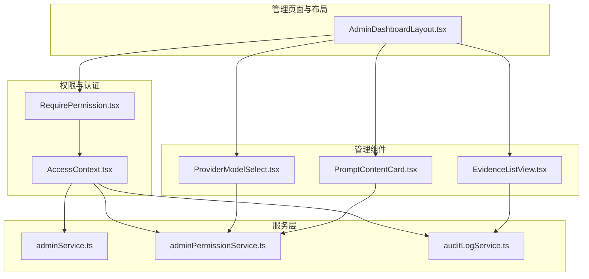
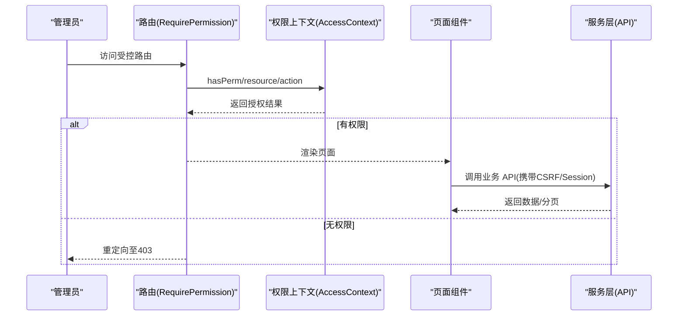
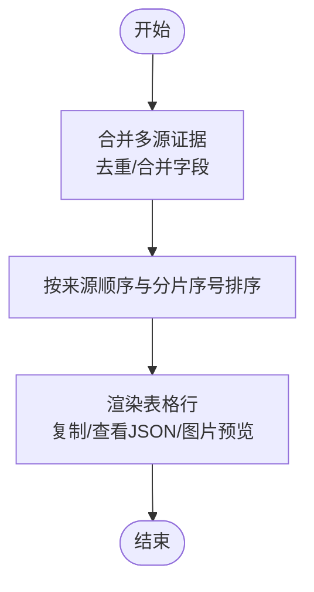
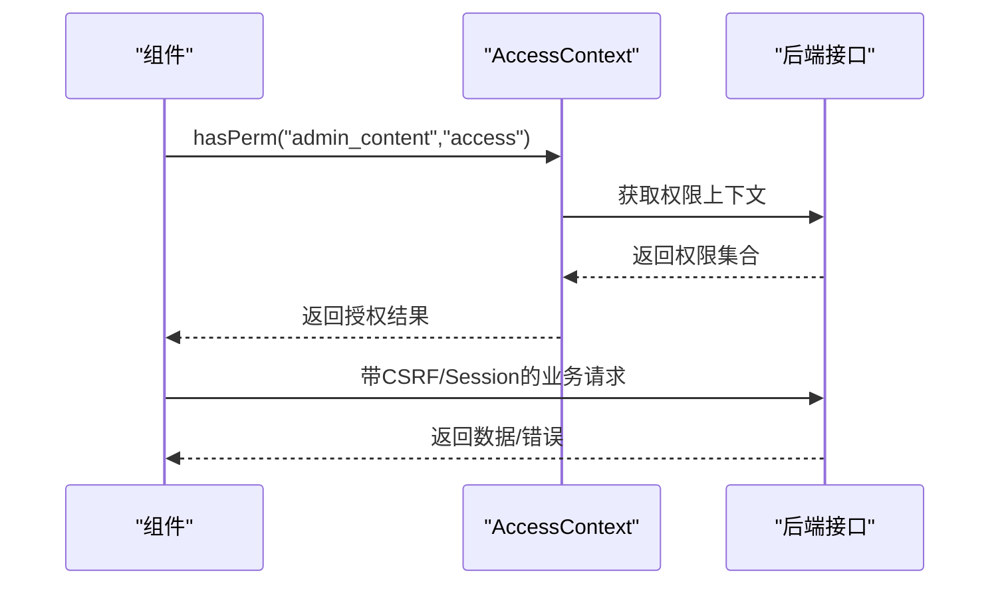
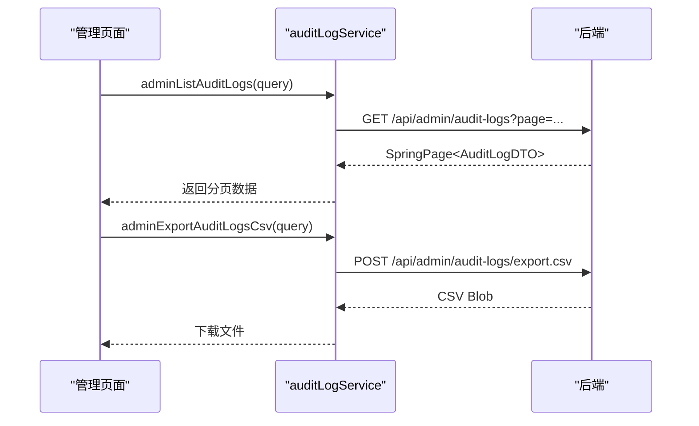
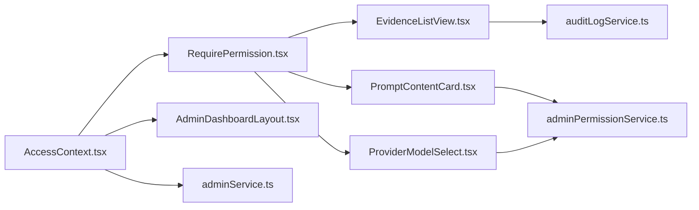

# 管理后台组件

<cite>
**本文引用的文件**
- [AdminDashboardLayout.tsx](file://my-vite-app/src/pages/admin/AdminDashboardLayout.tsx)
- [EvidenceListView.tsx](file://my-vite-app/src/components/admin/EvidenceListView.tsx)
- [PromptContentCard.tsx](file://my-vite-app/src/components/admin/PromptContentCard.tsx)
- [ProviderModelSelect.tsx](file://my-vite-app/src/components/admin/ProviderModelSelect.tsx)
- [RequirePermission.tsx](file://my-vite-app/src/components/auth/RequirePermission.tsx)
- [AccessContext.tsx](file://my-vite-app/src/contexts/AccessContext.tsx)
- [adminService.ts](file://my-vite-app/src/services/adminService.ts)
- [adminPermissionService.ts](file://my-vite-app/src/services/adminPermissionService.ts)
- [auditLogService.ts](file://my-vite-app/src/services/auditLogService.ts)
- [Permissions.java](file://src/main/java/com/example/EnterpriseRagCommunity/security/Permissions.java)
</cite>

## 目录
1. [引言](#引言)
2. [项目结构](#项目结构)
3. [核心组件](#核心组件)
4. [架构总览](#架构总览)
5. [组件详解](#组件详解)
6. [依赖关系分析](#依赖关系分析)
7. [性能考量](#性能考量)
8. [故障排查指南](#故障排查指南)
9. [结论](#结论)
10. [附录](#附录)

## 引言
本文件面向管理后台组件，围绕证据管理、审核追踪、提示词管理、模型配置等管理功能，系统梳理前端组件与服务层的职责边界、交互流程、权限校验与安全控制机制，并提供可操作的最佳实践与优化建议。读者无需深入后端即可理解管理界面如何通过前端组件完成高效、安全的管理工作。

## 项目结构
管理后台前端位于 my-vite-app/src，采用按功能域划分的组织方式：
- 页面与布局：AdminDashboardLayout 提供统一侧边导航与权限过滤
- 管理组件：证据视图、提示词卡片、模型选择器等
- 权限与认证：RequirePermission 与 AccessContext 提供细粒度权限校验
- 服务层：adminService、adminPermissionService、auditLogService 等封装 API 调用与 CSRF 保护

图表来源
- [AdminDashboardLayout.tsx:104-116](file://my-vite-app/src/pages/admin/AdminDashboardLayout.tsx#L104-L116)
- [EvidenceListView.tsx:410-520](file://my-vite-app/src/components/admin/EvidenceListView.tsx#L410-L520)
- [PromptContentCard.tsx:25-35](file://my-vite-app/src/components/admin/PromptContentCard.tsx#L25-L35)
- [ProviderModelSelect.tsx:241-256](file://my-vite-app/src/components/admin/ProviderModelSelect.tsx#L241-L256)
- [RequirePermission.tsx:19-42](file://my-vite-app/src/components/auth/RequirePermission.tsx#L19-L42)
- [AccessContext.tsx:55-89](file://my-vite-app/src/contexts/AccessContext.tsx#L55-L89)
- [adminService.ts:29-37](file://my-vite-app/src/services/adminService.ts#L29-L37)
- [adminPermissionService.ts:38-68](file://my-vite-app/src/services/adminPermissionService.ts#L38-L68)
- [auditLogService.ts:86-112](file://my-vite-app/src/services/auditLogService.ts#L86-L112)

章节来源
- [AdminDashboardLayout.tsx:104-116](file://my-vite-app/src/pages/admin/AdminDashboardLayout.tsx#L104-L116)
- [AccessContext.tsx:55-89](file://my-vite-app/src/contexts/AccessContext.tsx#L55-L89)

## 核心组件
- 管理布局与导航：AdminDashboardLayout 统一侧边栏菜单，基于权限动态渲染，支持用户信息与登出。
- 权限守卫：RequirePermission 将资源/动作权限与路由绑定，未授权跳转至 403。
- 权限上下文：AccessContext 提供 hasPerm/hasRole/hasAuthority，兼容后端权限键格式。
- 证据视图：EvidenceListView 聚合多阶段/分片证据，支持复制、查看 JSON、图片预览。
- 提示词卡片：PromptContentCard 支持系统提示词与用户模板编辑，可选运行时参数。
- 模型选择器：ProviderModelSelect 构建聊天/嵌入模型选项，支持“仅提供者/仅模型/自动”等模式。
- 管理员与权限服务：adminService、adminPermissionService 封装管理员 CRUD 与权限 CRUD，统一 CSRF 保护。
- 审计日志服务：auditLogService 提供分页查询、详情、CSV 导出能力。

章节来源
- [AdminDashboardLayout.tsx:104-116](file://my-vite-app/src/pages/admin/AdminDashboardLayout.tsx#L104-L116)
- [RequirePermission.tsx:19-42](file://my-vite-app/src/components/auth/RequirePermission.tsx#L19-L42)
- [AccessContext.tsx:125-148](file://my-vite-app/src/contexts/AccessContext.tsx#L125-L148)
- [EvidenceListView.tsx:410-520](file://my-vite-app/src/components/admin/EvidenceListView.tsx#L410-L520)
- [PromptContentCard.tsx:25-35](file://my-vite-app/src/components/admin/PromptContentCard.tsx#L25-L35)
- [ProviderModelSelect.tsx:241-256](file://my-vite-app/src/components/admin/ProviderModelSelect.tsx#L241-L256)
- [adminService.ts:29-37](file://my-vite-app/src/services/adminService.ts#L29-L37)
- [adminPermissionService.ts:38-68](file://my-vite-app/src/services/adminPermissionService.ts#L38-L68)
- [auditLogService.ts:86-112](file://my-vite-app/src/services/auditLogService.ts#L86-L112)

## 架构总览
管理后台采用“路由守卫 + 权限上下文 + 组件化服务”的分层设计：
- 路由层：RequirePermission 在进入受控页面前进行权限校验
- 权限层：AccessContext 拉取并标准化权限集合，提供快速判断
- 视图层：各管理组件按需组合使用服务层 API
- 服务层：统一处理 CSRF 令牌、Cookie 会话、错误与分页

图表来源
- [RequirePermission.tsx:19-42](file://my-vite-app/src/components/auth/RequirePermission.tsx#L19-L42)
- [AccessContext.tsx:125-148](file://my-vite-app/src/contexts/AccessContext.tsx#L125-L148)
- [adminPermissionService.ts:38-68](file://my-vite-app/src/services/adminPermissionService.ts#L38-L68)
- [auditLogService.ts:86-112](file://my-vite-app/src/services/auditLogService.ts#L86-L112)

## 组件详解

### 证据管理组件：EvidenceListView
职责与特性
- 聚合多阶段/分片证据，去重合并，按来源与分片序号排序
- 支持复制证据文本、查看原始 JSON、图片预览弹窗
- 上下文展开与锚点展示，辅助定位证据位置
- 对可疑污染文本进行降级展示，提升可读性

关键流程（聚合与渲染）

图表来源
- [EvidenceListView.tsx:417-519](file://my-vite-app/src/components/admin/EvidenceListView.tsx#L417-L519)
- [EvidenceListView.tsx:541-643](file://my-vite-app/src/components/admin/EvidenceListView.tsx#L541-L643)

章节来源
- [EvidenceListView.tsx:410-671](file://my-vite-app/src/components/admin/EvidenceListView.tsx#L410-L671)

### 提示词管理组件：PromptContentCard
职责与特性
- 支持系统提示词与用户提示词模板编辑
- 可选显示运行时参数（温度、TopP、最大 tokens、是否启用深度思考）
- 通过 onChange 回调驱动父组件状态更新

使用示例
- 在配置页面中以只读/可编辑两种模式展示与编辑提示词草稿
- 结合 ProviderModelSelect 为不同模型设置差异化参数

章节来源
- [PromptContentCard.tsx:25-183](file://my-vite-app/src/components/admin/PromptContentCard.tsx#L25-L183)

### 模型配置组件：ProviderModelSelect
职责与特性
- 构建聊天/嵌入模型选项，支持“仅提供者/仅模型/自动”等模式
- 自动/默认模型优先级与排序规则，兼容禁用提供者标识
- 编解码提供者与模型值，保证 UI 与后端一致

使用示例
- 在提示词配置中为不同提供者选择默认/指定模型
- 在嵌入配置中选择默认嵌入模型或自动模式

章节来源
- [ProviderModelSelect.tsx:241-324](file://my-vite-app/src/components/admin/ProviderModelSelect.tsx#L241-L324)

### 权限与安全控制
- 路由级守卫：RequirePermission 将资源/动作权限与路由绑定，未授权跳转 403
- 权限上下文：AccessContext 统一拉取权限，兼容后端权限键格式，提供 hasPerm/hasRole/hasAuthority
- CSRF 保护：服务层统一通过 getCsrfToken 注入 X-XSRF-TOKEN，配合 Cookie 会话
- 后端权限命名：Permissions 工具类生成 PERM_ 前缀与作用域后缀，保持前后端一致

图表来源
- [AccessContext.tsx:63-89](file://my-vite-app/src/contexts/AccessContext.tsx#L63-L89)
- [RequirePermission.tsx:19-42](file://my-vite-app/src/components/auth/RequirePermission.tsx#L19-L42)
- [adminPermissionService.ts:38-68](file://my-vite-app/src/services/adminPermissionService.ts#L38-L68)

章节来源
- [RequirePermission.tsx:19-42](file://my-vite-app/src/components/auth/RequirePermission.tsx#L19-L42)
- [AccessContext.tsx:125-148](file://my-vite-app/src/contexts/AccessContext.tsx#L125-L148)
- [Permissions.java:13-22](file://src/main/java/com/example/EnterpriseRagCommunity/security/Permissions.java#L13-L22)

### 审核追踪与日志
- 分页查询：支持关键词、操作人、实体类型、时间范围、排序等筛选
- 详情获取：按 ID 获取日志详情
- CSV 导出：支持管理员与前台用户导出审计日志

图表来源
- [auditLogService.ts:86-112](file://my-vite-app/src/services/auditLogService.ts#L86-L112)
- [auditLogService.ts:125-156](file://my-vite-app/src/services/auditLogService.ts#L125-L156)

章节来源
- [auditLogService.ts:86-216](file://my-vite-app/src/services/auditLogService.ts#L86-L216)

### 管理员与权限管理
- 管理员列表/搜索/详情：统一携带 Cookie 会话，支持条件查询
- 权限 CRUD：统一 CSRF 保护，映射后端字段到前端 DTO

章节来源
- [adminService.ts:29-74](file://my-vite-app/src/services/adminService.ts#L29-L74)
- [adminPermissionService.ts:38-68](file://my-vite-app/src/services/adminPermissionService.ts#L38-L68)
- [adminPermissionService.ts:127-156](file://my-vite-app/src/services/adminPermissionService.ts#L127-L156)

## 依赖关系分析
- 组件耦合
  - AdminDashboardLayout 依赖 AccessContext 的 hasPerm 动态渲染菜单
  - RequirePermission 依赖 AccessContext 的 hasPerm/hasRole
  - 管理组件（EvidenceListView、PromptContentCard、ProviderModelSelect）通过服务层 API 与后端交互
- 外部依赖
  - CSRF 令牌与 Cookie 会话由服务层统一处理
  - 后端权限键格式与前端 normalize 兼容

图表来源
- [AccessContext.tsx:125-148](file://my-vite-app/src/contexts/AccessContext.tsx#L125-L148)
- [RequirePermission.tsx:19-42](file://my-vite-app/src/components/auth/RequirePermission.tsx#L19-L42)
- [AdminDashboardLayout.tsx:104-116](file://my-vite-app/src/pages/admin/AdminDashboardLayout.tsx#L104-L116)
- [EvidenceListView.tsx:410-520](file://my-vite-app/src/components/admin/EvidenceListView.tsx#L410-L520)
- [PromptContentCard.tsx:25-35](file://my-vite-app/src/components/admin/PromptContentCard.tsx#L25-L35)
- [ProviderModelSelect.tsx:241-256](file://my-vite-app/src/components/admin/ProviderModelSelect.tsx#L241-L256)
- [auditLogService.ts:86-112](file://my-vite-app/src/services/auditLogService.ts#L86-L112)
- [adminPermissionService.ts:38-68](file://my-vite-app/src/services/adminPermissionService.ts#L38-L68)
- [adminService.ts:29-37](file://my-vite-app/src/services/adminService.ts#L29-L37)

## 性能考量
- 列表渲染优化
  - EvidenceListView 使用 useMemo 缓存 rows 计算，减少重复解析与排序
  - 图片预览与 JSON 查看采用懒加载与弹窗，避免阻塞主表格
- 权限加载
  - AccessContext 使用 inFlightRef 避免并发重复请求
  - 加载态与初始化标志位确保首次渲染稳定
- 网络请求
  - 服务层统一携带 Cookie 与 CSRF，减少重复握手
  - 分页查询与 CSV 导出分离，避免大体量数据阻塞 UI

章节来源
- [EvidenceListView.tsx:417-519](file://my-vite-app/src/components/admin/EvidenceListView.tsx#L417-L519)
- [AccessContext.tsx:63-89](file://my-vite-app/src/contexts/AccessContext.tsx#L63-L89)
- [adminPermissionService.ts:82-125](file://my-vite-app/src/services/adminPermissionService.ts#L82-L125)

## 故障排查指南
- 权限相关
  - 现象：进入受控页面即跳转 403
  - 排查：确认 AccessContext 是否已拉取权限；检查资源/动作键是否与后端一致；确认 hasPerm 返回值
- CSRF 与会话
  - 现象：提交表单报 CSRF 或未登录
  - 排查：确认服务层是否正确注入 X-XSRF-TOKEN；检查 credentials: 'include' 是否携带 Cookie
- 日志查询
  - 现象：导出 CSV 失败或为空
  - 排查：确认查询参数与时间范围；检查后端响应消息；确认当前用户具备导出权限

章节来源
- [RequirePermission.tsx:19-42](file://my-vite-app/src/components/auth/RequirePermission.tsx#L19-L42)
- [AccessContext.tsx:125-148](file://my-vite-app/src/contexts/AccessContext.tsx#L125-L148)
- [adminPermissionService.ts:82-125](file://my-vite-app/src/services/adminPermissionService.ts#L82-L125)
- [auditLogService.ts:125-156](file://my-vite-app/src/services/auditLogService.ts#L125-L156)

## 结论
管理后台组件通过清晰的职责划分与统一的安全策略，实现了证据管理、审核追踪、提示词管理与模型配置的高效协同。前端以权限上下文为核心，结合路由守卫与组件化服务，既保障了安全性，也提升了可维护性与扩展性。建议在后续迭代中持续完善权限键命名规范、日志导出性能与批量操作体验。

## 附录

### 最佳实践
- 权限命名
  - 前端使用资源:动作键，后端使用 PERM_ 前缀，AccessContext 统一归一化
- 表单安全
  - 所有写操作均需携带 CSRF 令牌与会话 Cookie
- 数据展示
  - 大文本采用“复制/查看 JSON/图片预览”等轻量交互，避免一次性渲染过多内容
- 批量操作
  - 建议在服务层封装批量 API 并增加进度反馈与取消机制

### 安全控制机制
- 路由级权限守卫：RequirePermission
- 权限上下文：AccessContext
- CSRF 与会话：服务层统一处理
- 后端权限命名：Permissions 工具类

章节来源
- [RequirePermission.tsx:19-42](file://my-vite-app/src/components/auth/RequirePermission.tsx#L19-L42)
- [AccessContext.tsx:38-53](file://my-vite-app/src/contexts/AccessContext.tsx#L38-L53)
- [Permissions.java:13-22](file://src/main/java/com/example/EnterpriseRagCommunity/security/Permissions.java#L13-L22)