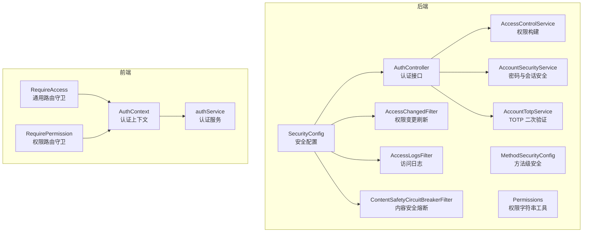
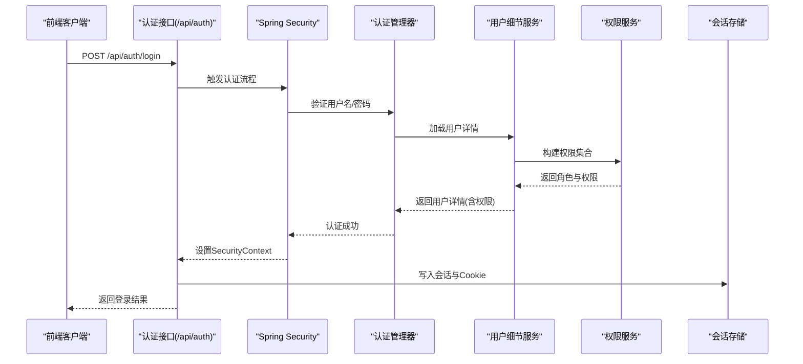
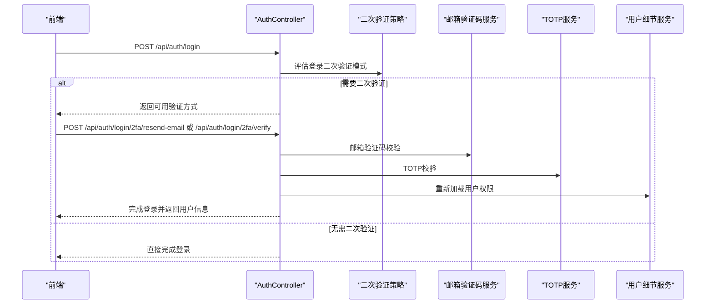
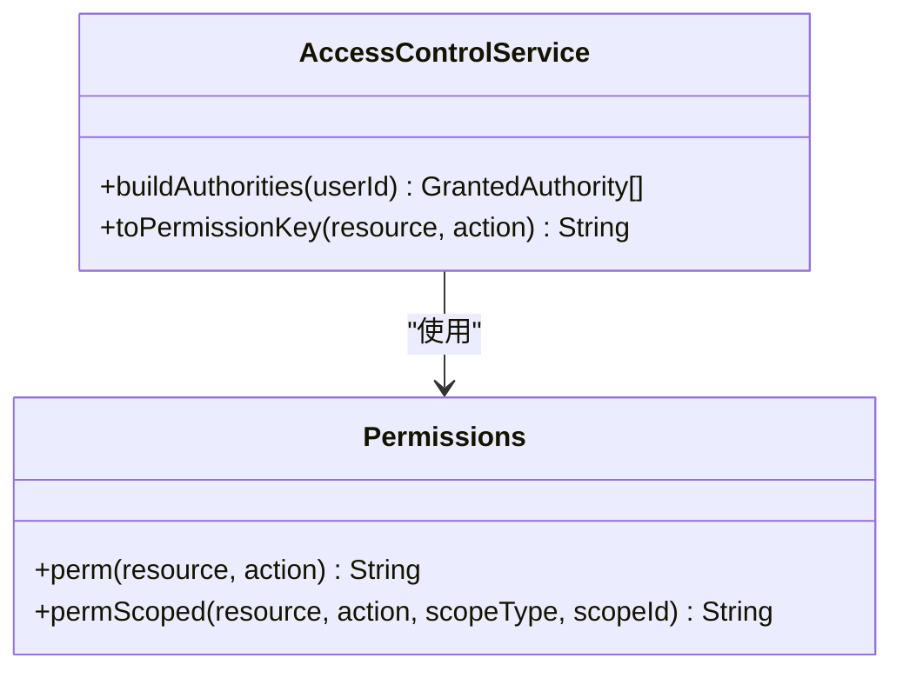
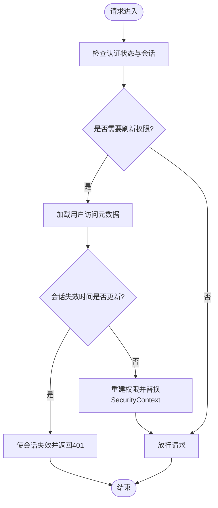
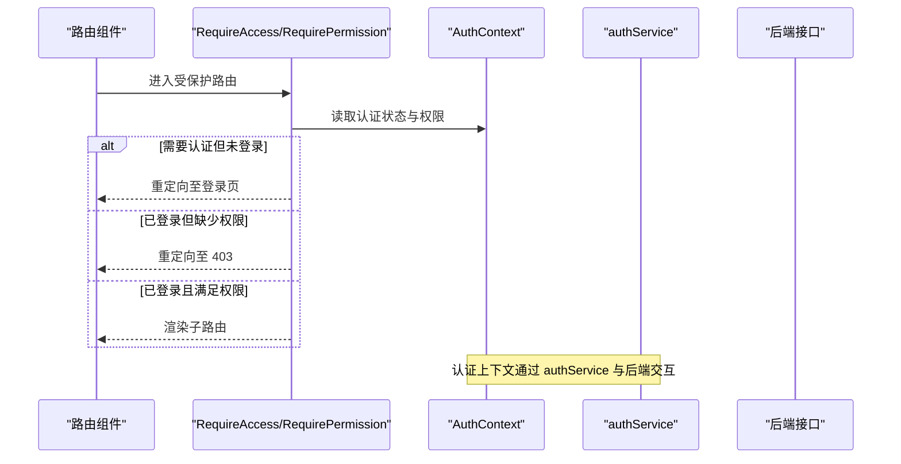
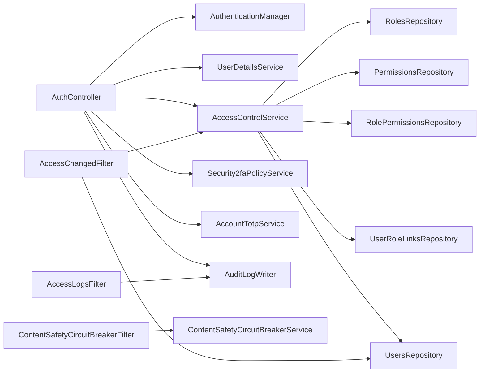

# 认证授权组件

<cite>
**本文档引用的文件**
- [SecurityConfig.java](file://src/main/java/com/example/EnterpriseRagCommunity/config/SecurityConfig.java)
- [MethodSecurityConfig.java](file://src/main/java/com/example/EnterpriseRagCommunity/config/MethodSecurityConfig.java)
- [AuthController.java](file://src/main/java/com/example/EnterpriseRagCommunity/controller/AuthController.java)
- [AccessControlService.java](file://src/main/java/com/example/EnterpriseRagCommunity/service/access/AccessControlService.java)
- [Permissions.java](file://src/main/java/com/example/EnterpriseRagCommunity/security/Permissions.java)
- [AccessChangedFilter.java](file://src/main/java/com/example/EnterpriseRagCommunity/security/AccessChangedFilter.java)
- [AccessLogsFilter.java](file://src/main/java/com/example/EnterpriseRagCommunity/security/AccessLogsFilter.java)
- [ContentSafetyCircuitBreakerFilter.java](file://src/main/java/com/example/EnterpriseRagCommunity/security/ContentSafetyCircuitBreakerFilter.java)
- [AccountSecurityService.java](file://src/main/java/com/example/EnterpriseRagCommunity/service/AccountSecurityService.java)
- [AccountTotpService.java](file://src/main/java/com/example/EnterpriseRagCommunity/service/AccountTotpService.java)
- [RequireAccess.tsx](file://my-vite-app/src/components/auth/RequireAccess.tsx)
- [RequirePermission.tsx](file://my-vite-app/src/components/auth/RequirePermission.tsx)
- [AuthContext.tsx](file://my-vite-app/src/contexts/AuthContext.tsx)
- [authService.ts](file://my-vite-app/src/services/authService.ts)
</cite>

## 目录
1. [引言](#引言)
2. [项目结构](#项目结构)
3. [核心组件](#核心组件)
4. [架构总览](#架构总览)
5. [详细组件分析](#详细组件分析)
6. [依赖关系分析](#依赖关系分析)
7. [性能考虑](#性能考虑)
8. [故障排除指南](#故障排除指南)
9. [结论](#结论)
10. [附录](#附录)

## 引言
本文件面向认证授权组件的使用者与维护者，系统性阐述权限验证、访问控制、二次验证等安全机制的设计与实现。内容覆盖后端安全配置、RBAC 权限模型、会话与令牌处理、安全拦截器工作方式，并结合前端路由守卫与上下文，给出完整的认证流程示例与安全最佳实践。同时提供常见问题排查方法与安全防护建议。

## 项目结构
认证授权相关代码主要分布在以下位置：
- 后端配置与控制器：Spring Security 配置、认证控制器、权限服务与拦截器
- 前端路由守卫与上下文：基于 React Router 的权限守卫、认证上下文与服务封装

**图表来源**
- [SecurityConfig.java:46-194](file://src/main/java/com/example/EnterpriseRagCommunity/config/SecurityConfig.java#L46-L194)
- [AuthController.java:78-725](file://src/main/java/com/example/EnterpriseRagCommunity/controller/AuthController.java#L78-L725)
- [AccessControlService.java:31-118](file://src/main/java/com/example/EnterpriseRagCommunity/service/access/AccessControlService.java#L31-L118)
- [AccessChangedFilter.java:35-154](file://src/main/java/com/example/EnterpriseRagCommunity/security/AccessChangedFilter.java#L35-L154)
- [AccessLogsFilter.java:41-213](file://src/main/java/com/example/EnterpriseRagCommunity/security/AccessLogsFilter.java#L41-L213)
- [ContentSafetyCircuitBreakerFilter.java:20-81](file://src/main/java/com/example/EnterpriseRagCommunity/security/ContentSafetyCircuitBreakerFilter.java#L20-L81)
- [AccountSecurityService.java:13-62](file://src/main/java/com/example/EnterpriseRagCommunity/service/AccountSecurityService.java#L13-L62)
- [AccountTotpService.java:28-101](file://src/main/java/com/example/EnterpriseRagCommunity/service/AccountTotpService.java#L28-L101)
- [RequireAccess.tsx:32-67](file://my-vite-app/src/components/auth/RequireAccess.tsx#L32-L67)
- [RequirePermission.tsx:19-42](file://my-vite-app/src/components/auth/RequirePermission.tsx#L19-L42)
- [AuthContext.tsx:32-110](file://my-vite-app/src/contexts/AuthContext.tsx#L32-L110)
- [authService.ts:55-150](file://my-vite-app/src/services/authService.ts#L55-L150)

**章节来源**
- [SecurityConfig.java:46-194](file://src/main/java/com/example/EnterpriseRagCommunity/config/SecurityConfig.java#L46-L194)
- [AuthController.java:78-725](file://src/main/java/com/example/EnterpriseRagCommunity/controller/AuthController.java#L78-L725)

## 核心组件
- 安全配置层：定义过滤链、CSRF/CORS、会话策略、认证提供者与用户细节服务
- 认证控制器：处理登录、二次验证、注销、CSRF 令牌获取等
- 权限服务：构建用户角色与权限集合，支持作用域化权限
- 安全拦截器：会话权限变更刷新、访问日志、内容安全熔断
- 二次验证服务：邮箱验证码与 TOTP 动态口令
- 前端路由守卫与上下文：基于权限与认证状态的路由保护

**章节来源**
- [SecurityConfig.java:286-321](file://src/main/java/com/example/EnterpriseRagCommunity/config/SecurityConfig.java#L286-L321)
- [AuthController.java:321-642](file://src/main/java/com/example/EnterpriseRagCommunity/controller/AuthController.java#L321-L642)
- [AccessControlService.java:31-118](file://src/main/java/com/example/EnterpriseRagCommunity/service/access/AccessControlService.java#L31-L118)
- [AccessChangedFilter.java:35-154](file://src/main/java/com/example/EnterpriseRagCommunity/security/AccessChangedFilter.java#L35-L154)
- [AccessLogsFilter.java:41-213](file://src/main/java/com/example/EnterpriseRagCommunity/security/AccessLogsFilter.java#L41-L213)
- [ContentSafetyCircuitBreakerFilter.java:20-81](file://src/main/java/com/example/EnterpriseRagCommunity/security/ContentSafetyCircuitBreakerFilter.java#L20-L81)
- [AccountTotpService.java:28-101](file://src/main/java/com/example/EnterpriseRagCommunity/service/AccountTotpService.java#L28-L101)
- [RequireAccess.tsx:32-67](file://my-vite-app/src/components/auth/RequireAccess.tsx#L32-L67)
- [RequirePermission.tsx:19-42](file://my-vite-app/src/components/auth/RequirePermission.tsx#L19-L42)
- [AuthContext.tsx:32-110](file://my-vite-app/src/contexts/AuthContext.tsx#L32-L110)

## 架构总览
后端采用基于会话的认证模式（JSESSIONID），通过 Spring Security 的过滤链对 /api/** 与 Web 页面分别施加不同策略。认证成功后，权限数据在会话中缓存并支持实时刷新；前端通过路由守卫与上下文实现细粒度的权限控制。

**图表来源**
- [AuthController.java:321-441](file://src/main/java/com/example/EnterpriseRagCommunity/controller/AuthController.java#L321-L441)
- [SecurityConfig.java:286-321](file://src/main/java/com/example/EnterpriseRagCommunity/config/SecurityConfig.java#L286-L321)
- [AccessControlService.java:62-118](file://src/main/java/com/example/EnterpriseRagCommunity/service/access/AccessControlService.java#L62-L118)

## 详细组件分析

### 安全配置与过滤链
- 分层过滤链：优先处理 /api/** 的安全链，其次处理 Web 页面链，避免相互干扰
- CSRF 策略：使用 Cookie 存储 CSRF 令牌，忽略初始化与认证相关端点
- CORS 策略：支持多源与模式匹配，允许凭证传递
- 会话策略：Web 链使用 ALWAYS，API 链按需拦截
- 用户细节服务：从数据库加载用户并构建 Spring Security 的 UserDetails，权限来源于权限服务

**章节来源**
- [SecurityConfig.java:74-194](file://src/main/java/com/example/EnterpriseRagCommunity/config/SecurityConfig.java#L74-L194)
- [SecurityConfig.java:196-236](file://src/main/java/com/example/EnterpriseRagCommunity/config/SecurityConfig.java#L196-L236)
- [SecurityConfig.java:286-321](file://src/main/java/com/example/EnterpriseRagCommunity/config/SecurityConfig.java#L286-L321)

### 认证控制器与二次验证
- 登录流程：校验邮箱状态，执行认证，根据策略决定是否触发二次验证
- 二次验证：支持邮箱验证码与 TOTP，会话中暂存待验证状态，验证通过后重建认证并写入会话
- 注销流程：清理 SecurityContext 与会话，记录审计日志
- CSRF 令牌：提供独立端点获取令牌，前端请求携带 X-XSRF-TOKEN

**图表来源**
- [AuthController.java:321-441](file://src/main/java/com/example/EnterpriseRagCommunity/controller/AuthController.java#L321-L441)
- [AuthController.java:443-642](file://src/main/java/com/example/EnterpriseRagCommunity/controller/AuthController.java#L443-L642)
- [AccountTotpService.java:73-101](file://src/main/java/com/example/EnterpriseRagCommunity/service/AccountTotpService.java#L73-L101)

**章节来源**
- [AuthController.java:321-642](file://src/main/java/com/example/EnterpriseRagCommunity/controller/AuthController.java#L321-L642)
- [AccountTotpService.java:73-101](file://src/main/java/com/example/EnterpriseRagCommunity/service/AccountTotpService.java#L73-L101)

### 权限模型与权限字符串
- 权限字符串命名：PERM_{resource}:{action}，支持作用域后缀 @SCOPE:{id}
- 角色与权限构建：从用户角色映射到角色名与 ID，合并各作用域下的允许/拒绝集合，最终生成 GrantedAuthority 列表
- 权限工具：提供便捷方法生成权限字符串与作用域化权限字符串

**图表来源**
- [AccessControlService.java:31-118](file://src/main/java/com/example/EnterpriseRagCommunity/service/access/AccessControlService.java#L31-L118)
- [Permissions.java:8-23](file://src/main/java/com/example/EnterpriseRagCommunity/security/Permissions.java#L8-L23)

**章节来源**
- [AccessControlService.java:31-118](file://src/main/java/com/example/EnterpriseRagCommunity/service/access/AccessControlService.java#L31-L118)
- [Permissions.java:8-23](file://src/main/java/com/example/EnterpriseRagCommunity/security/Permissions.java#L8-L23)

### 会话权限变更刷新与审计
- 权限变更刷新：在会话中存储 ACCESS_TS 与版本号，当用户元数据变化时重建权限并替换 SecurityContext
- 强制失效：当用户标记失效时间大于会话记录时，主动使会话失效并返回 401
- 访问日志：捕获请求/响应体摘要、头信息、客户端指纹、延迟与状态码，写入审计日志

**图表来源**
- [AccessChangedFilter.java:54-152](file://src/main/java/com/example/EnterpriseRagCommunity/security/AccessChangedFilter.java#L54-L152)
- [AccessLogsFilter.java:83-213](file://src/main/java/com/example/EnterpriseRagCommunity/security/AccessLogsFilter.java#L83-L213)

**章节来源**
- [AccessChangedFilter.java:35-154](file://src/main/java/com/example/EnterpriseRagCommunity/security/AccessChangedFilter.java#L35-L154)
- [AccessLogsFilter.java:41-213](file://src/main/java/com/example/EnterpriseRagCommunity/security/AccessLogsFilter.java#L41-L213)

### 内容安全熔断器
- 熔断模式：支持 S1/S2/S3 三种模式，针对不同入口点与范围进行阻断
- 范围匹配：支持入口点、帖子 ID、用户 ID 精确匹配
- 响应格式：API 返回 JSON，非 API 返回纯文本，包含 Retry-After 与模式标识

**章节来源**
- [ContentSafetyCircuitBreakerFilter.java:20-81](file://src/main/java/com/example/EnterpriseRagCommunity/security/ContentSafetyCircuitBreakerFilter.java#L20-L81)

### 前端认证与权限守卫
- 路由守卫 RequireAccess：支持 requiresAuth、resource:action、allowRoles、重定向路径
- 路由守卫 RequirePermission：仅校验权限，支持 allowRoles 与自定义重定向
- 认证上下文 AuthContext：提供刷新认证状态、TOTP 设置要求判断能力
- 认证服务 authService：封装登录、二次验证、注销、当前用户获取等 API

**图表来源**
- [RequireAccess.tsx:32-67](file://my-vite-app/src/components/auth/RequireAccess.tsx#L32-L67)
- [RequirePermission.tsx:19-42](file://my-vite-app/src/components/auth/RequirePermission.tsx#L19-L42)
- [AuthContext.tsx:32-110](file://my-vite-app/src/contexts/AuthContext.tsx#L32-L110)
- [authService.ts:55-150](file://my-vite-app/src/services/authService.ts#L55-L150)

**章节来源**
- [RequireAccess.tsx:32-67](file://my-vite-app/src/components/auth/RequireAccess.tsx#L32-L67)
- [RequirePermission.tsx:19-42](file://my-vite-app/src/components/auth/RequirePermission.tsx#L19-L42)
- [AuthContext.tsx:32-110](file://my-vite-app/src/contexts/AuthContext.tsx#L32-L110)
- [authService.ts:55-150](file://my-vite-app/src/services/authService.ts#L55-L150)

## 依赖关系分析
- 控制器依赖：认证管理器、用户细节服务、权限服务、二次验证策略与服务、审计日志
- 权限服务依赖：用户、角色、角色权限、权限与用户角色链接仓库
- 安全拦截器依赖：权限服务、用户仓库、内容安全服务、对象映射器
- 前端依赖：路由守卫依赖认证上下文，认证上下文依赖认证服务

**图表来源**
- [AuthController.java:90-148](file://src/main/java/com/example/EnterpriseRagCommunity/controller/AuthController.java#L90-L148)
- [AccessControlService.java:39-43](file://src/main/java/com/example/EnterpriseRagCommunity/service/access/AccessControlService.java#L39-L43)
- [AccessChangedFilter.java:45-46](file://src/main/java/com/example/EnterpriseRagCommunity/security/AccessChangedFilter.java#L45-L46)
- [AccessLogsFilter.java:52-53](file://src/main/java/com/example/EnterpriseRagCommunity/security/AccessLogsFilter.java#L52-L53)
- [ContentSafetyCircuitBreakerFilter.java:24-25](file://src/main/java/com/example/EnterpriseRagCommunity/security/ContentSafetyCircuitBreakerFilter.java#L24-L25)

**章节来源**
- [AuthController.java:90-148](file://src/main/java/com/example/EnterpriseRagCommunity/controller/AuthController.java#L90-L148)
- [AccessControlService.java:39-43](file://src/main/java/com/example/EnterpriseRagCommunity/service/access/AccessControlService.java#L39-L43)

## 性能考虑
- 权限刷新节流：AccessChangedFilter 在会话中记录上次检查时间，避免频繁重建权限
- 日志捕获限制：AccessLogsFilter 对请求/响应体大小进行上限控制，防止内存与磁盘压力
- 会话策略：Web 链 ALWAYS 保证页面交互一致性，API 链仅对 /api/** 拦截，减少不必要的开销
- CSRF 令牌复用：前端在登录成功后清理缓存令牌，避免重复获取带来的额外往返

[本节为通用指导，无需特定文件来源]

## 故障排除指南
- 登录失败：检查邮箱状态与密码匹配，关注审计日志中的失败原因
- 二次验证异常：确认策略允许的验证方式、邮箱服务与 TOTP 密钥状态
- 会话权限失效：检查用户元数据更新与会话失效时间戳，确认 AccessChangedFilter 是否触发
- CSRF 403：确认前端携带 X-XSRF-TOKEN，且忽略端点配置正确
- 内容安全熔断：查看熔断配置与模式，确认请求入口点与范围匹配

**章节来源**
- [AuthController.java:321-642](file://src/main/java/com/example/EnterpriseRagCommunity/controller/AuthController.java#L321-L642)
- [AccessChangedFilter.java:101-111](file://src/main/java/com/example/EnterpriseRagCommunity/security/AccessChangedFilter.java#L101-L111)
- [AccessLogsFilter.java:186-206](file://src/main/java/com/example/EnterpriseRagCommunity/security/AccessLogsFilter.java#L186-L206)
- [ContentSafetyCircuitBreakerFilter.java:200-221](file://src/main/java/com/example/EnterpriseRagCommunity/security/ContentSafetyCircuitBreakerFilter.java#L200-L221)

## 结论
本认证授权组件通过会话驱动的 Spring Security 配置、细粒度的 RBAC 权限模型与多层安全拦截器，提供了从认证到授权再到审计的完整闭环。前端路由守卫与上下文进一步增强了用户体验与安全性。建议在生产环境中启用严格的日志与熔断策略，并定期审查权限与角色配置，确保最小权限原则与零信任实践落地。

[本节为总结性内容，无需特定文件来源]

## 附录

### 认证流程完整示例（登录+二次验证）
- 前端发起登录请求，携带 CSRF 令牌
- 后端验证凭据，若策略要求二次验证，则返回可用方式列表
- 前端选择邮箱或 TOTP 方式，发送验证码或动态口令
- 后端校验通过后，重建认证并写入会话，返回用户信息

**章节来源**
- [authService.ts:55-150](file://my-vite-app/src/services/authService.ts#L55-L150)
- [AuthController.java:321-642](file://src/main/java/com/example/EnterpriseRagCommunity/controller/AuthController.java#L321-L642)

### 安全最佳实践
- 强制启用二次验证（TOTP/邮箱验证码），并要求首次登录后完成设置
- 使用 HTTPS 与 SameSite Cookie 策略，限制 CSRF 风险
- 定期轮换主密钥与会话密钥，及时失效受影响会话
- 启用内容安全熔断器，对高风险入口点实施分级阻断
- 严格审计所有敏感操作，保留请求/响应摘要与追踪 ID

[本节为通用指导，无需特定文件来源]