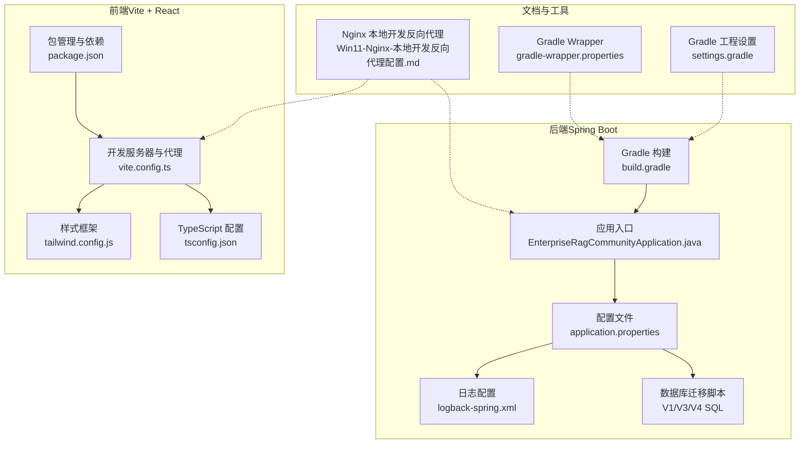
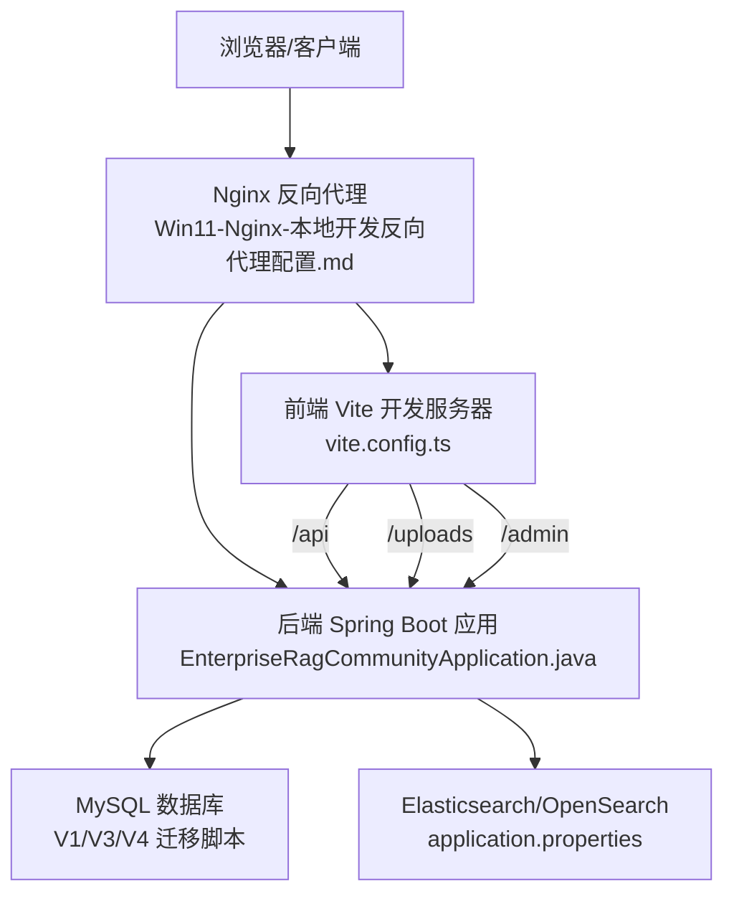
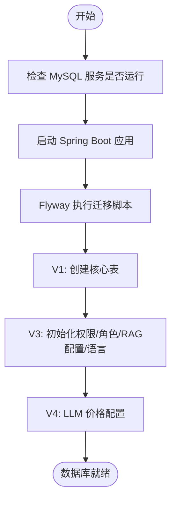
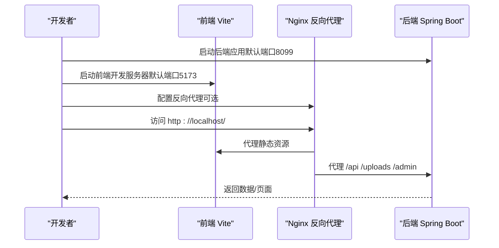
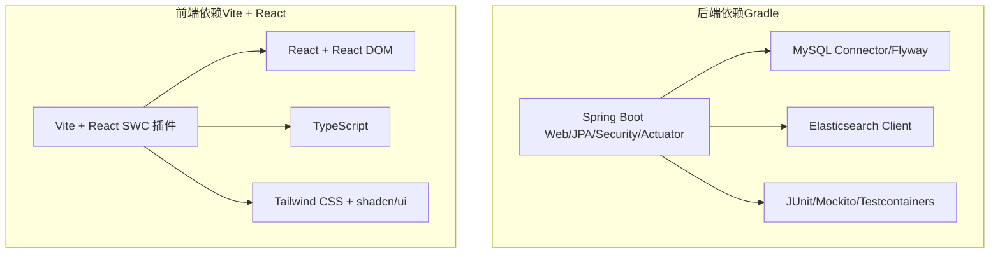

# 快速开始

<cite>
**本文引用的文件**
- [build.gradle](file://build.gradle)
- [settings.gradle](file://settings.gradle)
- [gradle.properties](file://gradle.properties)
- [application.properties](file://src/main/resources/application.properties)
- [V1__table_design.sql](file://src/main/resources/db/migration/V1__table_design.sql)
- [V3__system_default_configs.sql](file://src/main/resources/db/migration/V3__system_default_configs.sql)
- [V4__llm_price_configs.sql](file://src/main/resources/db/migration/V4__llm_price_configs.sql)
- [EnterpriseRagCommunityApplication.java](file://src/main/java/com/example/EnterpriseRagCommunity/EnterpriseRagCommunityApplication.java)
- [package.json](file://my-vite-app/package.json)
- [vite.config.ts](file://my-vite-app/vite.config.ts)
- [tsconfig.json](file://my-vite-app/tsconfig.json)
- [tailwind.config.js](file://my-vite-app/tailwind.config.js)
- [Win11-Nginx-本地开发反向代理配置.md](file://docs/Win11-Nginx-本地开发反向代理配置.md)
- [logback-spring.xml](file://src/main/resources/logback-spring.xml)
- [gradle-wrapper.properties](file://gradle/wrapper/gradle-wrapper.properties)
</cite>

## 目录
1. [简介](#简介)
2. [项目结构](#项目结构)
3. [核心组件](#核心组件)
4. [架构概览](#架构概览)
5. [详细组件分析](#详细组件分析)
6. [依赖分析](#依赖分析)
7. [性能考虑](#性能考虑)
8. [故障排查指南](#故障排查指南)
9. [结论](#结论)
10. [附录](#附录)

## 简介
本指南面向首次接触企业级RAG社区平台的开发者，帮助你在本地快速搭建并运行完整的后端服务与前端应用，涵盖环境准备、依赖安装、数据库初始化、配置项设置、启动流程、常见问题排查以及基本使用验证步骤。平台采用Spring Boot后端与React+Vite前端组合，集成Flyway数据库迁移、MySQL、Elasticsearch/OpenSearch等基础设施。

## 项目结构
项目采用前后端分离架构：
- 后端：Spring Boot应用，使用Gradle构建，配置位于resources目录，数据库迁移脚本位于db/migration。
- 前端：React + TypeScript + Vite应用，位于my-vite-app目录，提供开发服务器与构建产物。
- 文档：包含本地开发反向代理配置等运维文档。

**图表来源**
- [build.gradle:1-120](file://build.gradle#L1-L120)
- [EnterpriseRagCommunityApplication.java:1-64](file://src/main/java/com/example/EnterpriseRagCommunity/EnterpriseRagCommunityApplication.java#L1-L64)
- [application.properties:1-84](file://src/main/resources/application.properties#L1-L84)
- [V1__table_design.sql:1-100](file://src/main/resources/db/migration/V1__table_design.sql#L1-L100)
- [package.json:1-82](file://my-vite-app/package.json#L1-L82)
- [vite.config.ts:1-116](file://my-vite-app/vite.config.ts#L1-L116)
- [tsconfig.json:1-16](file://my-vite-app/tsconfig.json#L1-L16)
- [tailwind.config.js:1-65](file://my-vite-app/tailwind.config.js#L1-L65)
- [Win11-Nginx-本地开发反向代理配置.md:1-127](file://docs/Win11-Nginx-本地开发反向代理配置.md#L1-L127)
- [gradle-wrapper.properties:1-8](file://gradle/wrapper/gradle-wrapper.properties#L1-L8)
- [settings.gradle:1-15](file://settings.gradle#L1-L15)

**章节来源**
- [build.gradle:1-120](file://build.gradle#L1-L120)
- [settings.gradle:1-15](file://settings.gradle#L1-L15)
- [gradle.properties:1-13](file://gradle.properties#L1-L13)
- [application.properties:1-84](file://src/main/resources/application.properties#L1-L84)
- [V1__table_design.sql:1-100](file://src/main/resources/db/migration/V1__table_design.sql#L1-L100)
- [package.json:1-82](file://my-vite-app/package.json#L1-L82)
- [vite.config.ts:1-116](file://my-vite-app/vite.config.ts#L1-L116)
- [tsconfig.json:1-16](file://my-vite-app/tsconfig.json#L1-L16)
- [tailwind.config.js:1-65](file://my-vite-app/tailwind.config.js#L1-L65)
- [Win11-Nginx-本地开发反向代理配置.md:1-127](file://docs/Win11-Nginx-本地开发反向代理配置.md#L1-L127)
- [gradle-wrapper.properties:1-8](file://gradle/wrapper/gradle-wrapper.properties#L1-L8)

## 核心组件
- 后端应用入口与视图解析器：负责启动Spring Boot应用并注册JSP视图解析器。
- 数据库配置与迁移：通过Flyway自动执行SQL迁移脚本，初始化表结构与系统默认配置。
- 前端开发与构建：Vite提供开发服务器与代理，支持TypeScript与Tailwind CSS。
- 日志与运行时配置：Logback配置与Spring Boot属性文件共同决定日志输出与运行参数。

**章节来源**
- [EnterpriseRagCommunityApplication.java:1-64](file://src/main/java/com/example/EnterpriseRagCommunity/EnterpriseRagCommunityApplication.java#L1-L64)
- [application.properties:1-84](file://src/main/resources/application.properties#L1-L84)
- [V1__table_design.sql:1-100](file://src/main/resources/db/migration/V1__table_design.sql#L1-L100)
- [V3__system_default_configs.sql:1-100](file://src/main/resources/db/migration/V3__system_default_configs.sql#L1-L100)
- [V4__llm_price_configs.sql:1-100](file://src/main/resources/db/migration/V4__llm_price_configs.sql#L1-L100)
- [logback-spring.xml:1-8](file://src/main/resources/logback-spring.xml#L1-L8)

## 架构概览
后端通过Spring Boot提供REST API与静态资源服务，前端通过Vite开发服务器提供SPA页面与组件，二者通过代理或反向代理在同一域名下协同工作。数据库通过Flyway进行版本化管理，Elasticsearch/OpenSearch用于检索与RAG能力。

**图表来源**
- [Win11-Nginx-本地开发反向代理配置.md:1-127](file://docs/Win11-Nginx-本地开发反向代理配置.md#L1-L127)
- [vite.config.ts:63-78](file://my-vite-app/vite.config.ts#L63-L78)
- [EnterpriseRagCommunityApplication.java:1-64](file://src/main/java/com/example/EnterpriseRagCommunity/EnterpriseRagCommunityApplication.java#L1-L64)
- [application.properties:72-82](file://src/main/resources/application.properties#L72-L82)
- [V1__table_design.sql:1-100](file://src/main/resources/db/migration/V1__table_design.sql#L1-L100)

## 详细组件分析

### 环境要求与依赖安装
- Java版本：项目使用Java 21工具链，Gradle配置中明确指定javaToolchainVersion=21。
- Gradle版本：使用Gradle Wrapper，版本由gradle-wrapper.properties指定。
- Node.js版本：前端package.json声明了React、TypeScript、Vite等依赖，建议使用与项目兼容的Node版本（具体版本号请参考package.json中的依赖与工程要求）。
- 数据库：MySQL 8.0，Flyway自动执行迁移脚本。
- 搜索引擎：Elasticsearch或OpenSearch，通过application.properties配置连接参数。

**章节来源**
- [build.gradle:37-53](file://build.gradle#L37-L53)
- [gradle.properties](file://gradle.properties#L4)
- [gradle-wrapper.properties:1-8](file://gradle/wrapper/gradle-wrapper.properties#L1-L8)
- [package.json:1-82](file://my-vite-app/package.json#L1-L82)
- [application.properties:7-82](file://src/main/resources/application.properties#L7-L82)

### 数据库初始化与迁移
- 迁移脚本：V1__table_design.sql创建核心业务表，V3__system_default_configs.sql初始化权限、角色、RAG配置与语言列表，V4__llm_price_configs.sql提供LLM计费配置。
- Flyway配置：application.properties中启用Flyway，指定迁移脚本位置与基线版本。
- 连接参数：application.properties中配置MySQL驱动、URL、用户名、密码及连接池参数。

**图表来源**
- [application.properties:18-24](file://src/main/resources/application.properties#L18-L24)
- [V1__table_design.sql:1-100](file://src/main/resources/db/migration/V1__table_design.sql#L1-L100)
- [V3__system_default_configs.sql:1-100](file://src/main/resources/db/migration/V3__system_default_configs.sql#L1-L100)
- [V4__llm_price_configs.sql:1-100](file://src/main/resources/db/migration/V4__llm_price_configs.sql#L1-L100)

**章节来源**
- [application.properties:18-24](file://src/main/resources/application.properties#L18-L24)
- [V1__table_design.sql:1-100](file://src/main/resources/db/migration/V1__table_design.sql#L1-L100)
- [V3__system_default_configs.sql:1-100](file://src/main/resources/db/migration/V3__system_default_configs.sql#L1-L100)
- [V4__llm_price_configs.sql:1-100](file://src/main/resources/db/migration/V4__llm_price_configs.sql#L1-L100)

### 配置文件设置说明
- 后端配置：application.properties包含数据库连接、Flyway、日志、上传路径、AI相关超时参数、OpenSearch平台配置等。
- 前端配置：vite.config.ts配置开发服务器代理、构建输出与静态资源复制；tsconfig.json定义路径别名；tailwind.config.js配置内容扫描路径。
- 日志配置：logback-spring.xml继承Spring Boot默认日志配置，设置字符集。

**章节来源**
- [application.properties:1-84](file://src/main/resources/application.properties#L1-L84)
- [vite.config.ts:57-90](file://my-vite-app/vite.config.ts#L57-L90)
- [tsconfig.json:1-16](file://my-vite-app/tsconfig.json#L1-L16)
- [tailwind.config.js:1-65](file://my-vite-app/tailwind.config.js#L1-L65)
- [logback-spring.xml:1-8](file://src/main/resources/logback-spring.xml#L1-L8)

### 启动流程（本地开发）
- 后端启动：通过Gradle启动Spring Boot应用，默认端口8099。
- 前端启动：在my-vite-app目录执行npm run dev，Vite默认端口5173。
- 反向代理（可选）：使用Nginx将/api、/uploads、/admin代理至后端8099端口，或直接通过Vite代理。

**图表来源**
- [Win11-Nginx-本地开发反向代理配置.md:1-127](file://docs/Win11-Nginx-本地开发反向代理配置.md#L1-L127)
- [vite.config.ts:63-78](file://my-vite-app/vite.config.ts#L63-L78)
- [EnterpriseRagCommunityApplication.java:28-30](file://src/main/java/com/example/EnterpriseRagCommunity/EnterpriseRagCommunityApplication.java#L28-L30)

**章节来源**
- [Win11-Nginx-本地开发反向代理配置.md:1-127](file://docs/Win11-Nginx-本地开发反向代理配置.md#L1-L127)
- [vite.config.ts:63-78](file://my-vite-app/vite.config.ts#L63-L78)
- [EnterpriseRagCommunityApplication.java:28-30](file://src/main/java/com/example/EnterpriseRagCommunity/EnterpriseRagCommunityApplication.java#L28-L30)

### 基本使用示例与验证步骤
- 启动后端：执行Gradle构建并启动Spring Boot应用。
- 启动前端：在my-vite-app目录执行npm run dev。
- 验证API：通过curl或浏览器访问后端初始化状态接口。
- 验证上传：访问上传路径，确认返回非502错误。
- 验证代理：通过Nginx统一入口访问前端与后端API。

**章节来源**
- [Win11-Nginx-本地开发反向代理配置.md:116-127](file://docs/Win11-Nginx-本地开发反向代理配置.md#L116-L127)

## 依赖分析
后端依赖包括Spring Boot Starter Web、JPA、Security、Actuator、MySQL Connector、Flyway、Elasticsearch等；前端依赖React、TypeScript、Vite、Tailwind CSS等。Gradle配置中明确指定Java 21工具链与测试配置。

**图表来源**
- [build.gradle:102-138](file://build.gradle#L102-L138)
- [package.json:14-75](file://my-vite-app/package.json#L14-L75)

**章节来源**
- [build.gradle:102-138](file://build.gradle#L102-L138)
- [package.json:14-75](file://my-vite-app/package.json#L14-L75)

## 性能考虑
- 连接池与超时：application.properties中配置了Hikari连接池参数与AI相关超时，建议根据实际负载调整。
- 日志级别：通过日志配置文件与application.properties控制日志级别，避免生产环境产生过多IO。
- 前端构建：Vite配置了manifest与静态资源命名策略，有助于缓存与CDN优化。
- 反向代理：Nginx配置中启用keepalive与HTTP/1.1，减少连接开销，提升大文件上传稳定性。

**章节来源**
- [application.properties:11-16](file://src/main/resources/application.properties#L11-L16)
- [application.properties:68-70](file://src/main/resources/application.properties#L68-L70)
- [logback-spring.xml:1-8](file://src/main/resources/logback-spring.xml#L1-L8)
- [vite.config.ts:91-114](file://my-vite-app/vite.config.ts#L91-L114)
- [Win11-Nginx-本地开发反向代理配置.md:15-90](file://docs/Win11-Nginx-本地开发反向代理配置.md#L15-L90)

## 故障排查指南
- 数据库连接失败：检查application.properties中的数据库URL、用户名、密码与网络连通性。
- Flyway迁移异常：确认MySQL服务运行正常，迁移脚本可读，Flyway配置正确。
- 前端代理无效：检查vite.config.ts中的代理配置与端口冲突，或使用Nginx统一入口。
- 大文件上传失败：参考Nginx反向代理文档，启用keepalive与适当超时设置。
- 日志乱码：确认logback与application.properties中的字符集设置一致。

**章节来源**
- [application.properties:7-16](file://src/main/resources/application.properties#L7-L16)
- [application.properties:18-24](file://src/main/resources/application.properties#L18-L24)
- [vite.config.ts:63-78](file://my-vite-app/vite.config.ts#L63-L78)
- [Win11-Nginx-本地开发反向代理配置.md:15-90](file://docs/Win11-Nginx-本地开发反向代理配置.md#L15-L90)
- [logback-spring.xml:1-8](file://src/main/resources/logback-spring.xml#L1-L8)

## 结论
通过本指南，你可以基于Java 25、Node.js与MySQL/Elasticsearch/OpenSearch快速搭建企业级RAG社区平台的本地开发环境。按照环境准备、依赖安装、数据库初始化、配置设置与启动验证的步骤，即可完成项目的本地运行与基本功能验证。遇到问题时，可依据故障排查章节进行定位与修复。

## 附录
- 端口与路径约定：后端默认端口8099，前端默认端口5173；Nginx可将/api、/uploads、/admin代理至后端。
- 常用命令：Gradle构建、Vite开发服务器启动、Nginx配置测试与重载。

**章节来源**
- [Win11-Nginx-本地开发反向代理配置.md:5-14](file://docs/Win11-Nginx-本地开发反向代理配置.md#L5-L14)
- [Win11-Nginx-本地开发反向代理配置.md:92-114](file://docs/Win11-Nginx-本地开发反向代理配置.md#L92-L114)