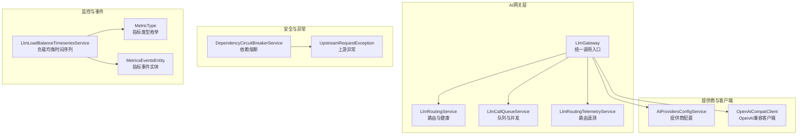
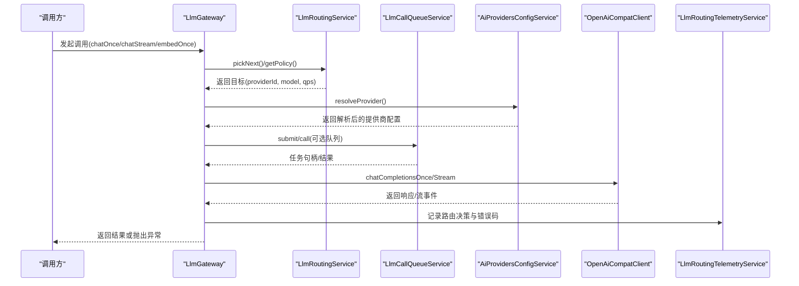
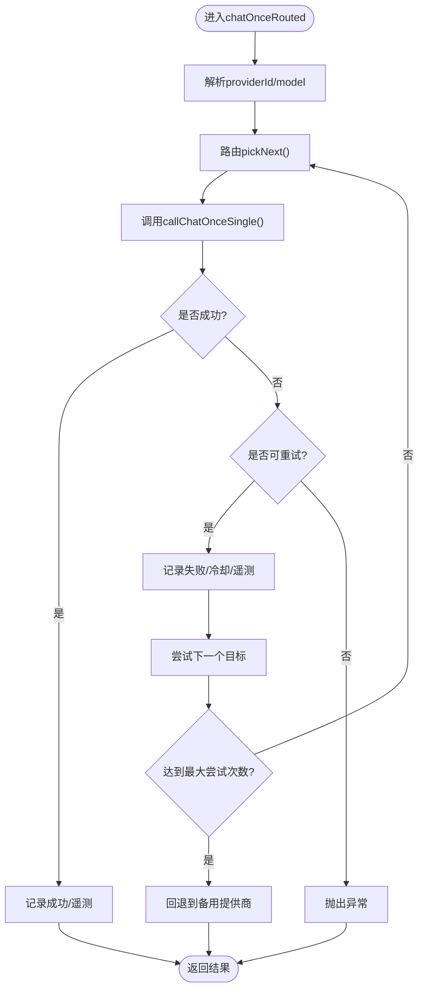
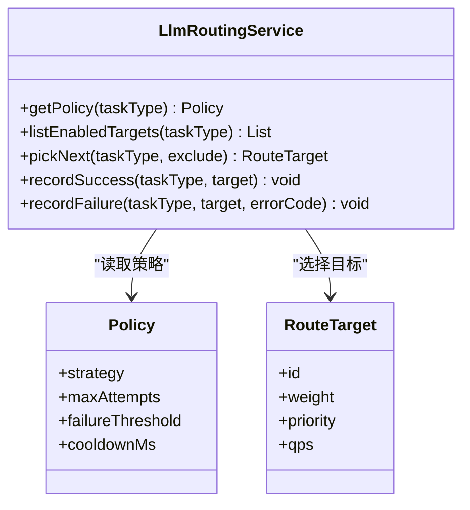
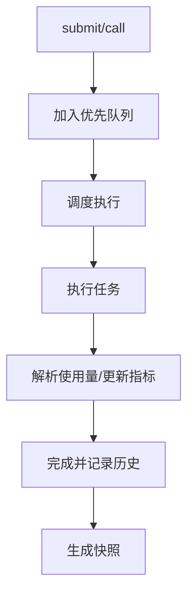
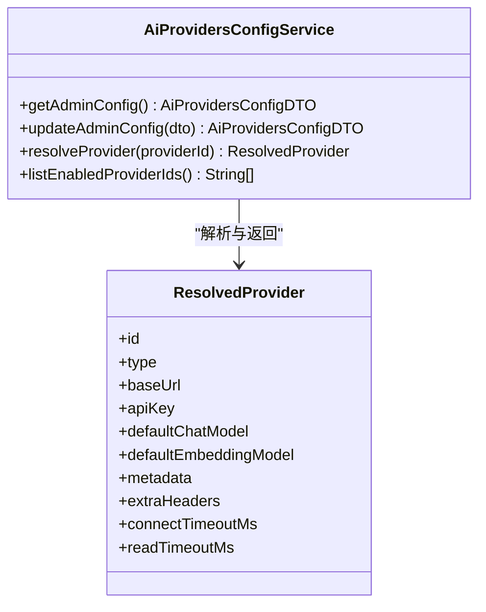
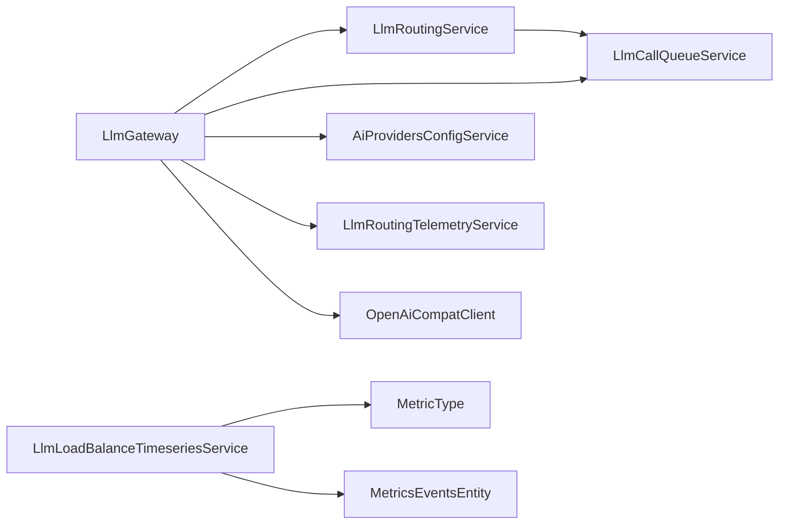

# AI服务调用错误

<cite>
**本文引用的文件**
- [LlmGateway.java](file://src/main/java/com/example/EnterpriseRagCommunity/service/ai/LlmGateway.java)
- [LlmRoutingService.java](file://src/main/java/com/example/EnterpriseRagCommunity/service/ai/LlmRoutingService.java)
- [LlmCallQueueService.java](file://src/main/java/com/example/EnterpriseRagCommunity/service/ai/LlmCallQueueService.java)
- [LlmRoutingTelemetryService.java](file://src/main/java/com/example/EnterpriseRagCommunity/service/ai/LlmRoutingTelemetryService.java)
- [AiProvidersConfigService.java](file://src/main/java/com/example/EnterpriseRagCommunity/service/ai/AiProvidersConfigService.java)
- [OpenAiCompatClient.java](file://src/main/java/com/example/EnterpriseRagCommunity/service/ai/client/OpenAiCompatClient.java)
- [DependencyCircuitBreakerService.java](file://src/main/java/com/example/EnterpriseRagCommunity/service/safety/DependencyCircuitBreakerService.java)
- [UpstreamRequestException.java](file://src/main/java/com/example/EnterpriseRagCommunity/exception/UpstreamRequestException.java)
- [LlmQueueProperties.java](file://src/main/java/com/example/EnterpriseRagCommunity/config/LlmQueueProperties.java)
- [MetricType.java](file://src/main/java/com/example/EnterpriseRagCommunity/entity/monitor/enums/MetricType.java)
- [MetricsEventsEntity.java](file://src/main/java/com/example/EnterpriseRagCommunity/entity/monitor/MetricsEventsEntity.java)
- [LlmLoadBalanceTimeseriesService.java](file://src/main/java/com/example/EnterpriseRagCommunity/service/monitor/LlmLoadBalanceTimeseriesService.java)
- [VisionImageInput.java](file://src/main/java/com/example/EnterpriseRagCommunity/service/moderation/admin/VisionImageInput.java)
- [ModerationChunkReviewService.java](file://src/main/java/com/example/EnterpriseRagCommunity/service/moderation/ModerationChunkReviewService.java)
- [AdminModerationLlmService.java](file://src/main/java/com/example/EnterpriseRagCommunity/service/moderation/admin/AdminModerationLlmService.java)
</cite>

## 目录
1. [引言](#引言)
2. [项目结构](#项目结构)
3. [核心组件](#核心组件)
4. [架构总览](#架构总览)
5. [详细组件分析](#详细组件分析)
6. [依赖关系分析](#依赖关系分析)
7. [性能考量](#性能考量)
8. [故障排除指南](#故障排除指南)
9. [结论](#结论)
10. [附录](#附录)

## 引言
本手册聚焦于企业级AI服务在实际运行中的调用错误与稳定性保障，覆盖LLM调用失败、API限流、模型不可用、响应超时、队列积压、负载均衡失效、模型价格配置错误、多模态内容处理异常、健康检查与自动降级、以及监控与告警等主题。文档以代码为依据，结合系统架构图与流程图，帮助开发者与运维人员快速定位问题并制定修复策略。

## 项目结构
围绕AI服务调用的关键模块包括：
- 网关层：统一入口，负责路由、重试、降级与遥测
- 路由与健康：按策略选择可用后端，维护冷却与失败阈值
- 队列与并发：控制并发度、排队长度与历史保留
- 提供商配置：解析与合并多提供商配置，支持OpenAI兼容接口
- 客户端适配：封装OpenAI兼容协议的HTTP调用
- 安全与熔断：对上游依赖进行熔断保护
- 监控与事件：指标类型、事件实体与时间序列统计

**图表来源**
- [LlmGateway.java:28-39](file://src/main/java/com/example/EnterpriseRagCommunity/service/ai/LlmGateway.java#L28-L39)
- [LlmRoutingService.java:25-27](file://src/main/java/com/example/EnterpriseRagCommunity/service/ai/LlmRoutingService.java#L25-L27)
- [LlmCallQueueService.java:40-41](file://src/main/java/com/example/EnterpriseRagCommunity/service/ai/LlmCallQueueService.java#L40-L41)
- [AiProvidersConfigService.java:28-30](file://src/main/java/com/example/EnterpriseRagCommunity/service/ai/AiProvidersConfigService.java#L28-L30)
- [OpenAiCompatClient.java:19-21](file://src/main/java/com/example/EnterpriseRagCommunity/service/ai/client/OpenAiCompatClient.java#L19-L21)
- [DependencyCircuitBreakerService.java:17-19](file://src/main/java/com/example/EnterpriseRagCommunity/service/safety/DependencyCircuitBreakerService.java#L17-L19)
- [MetricType.java:1-7](file://src/main/java/com/example/EnterpriseRagCommunity/entity/monitor/enums/MetricType.java#L1-L7)
- [MetricsEventsEntity.java:1-35](file://src/main/java/com/example/EnterpriseRagCommunity/entity/monitor/MetricsEventsEntity.java#L1-L35)
- [LlmLoadBalanceTimeseriesService.java:259-271](file://src/main/java/com/example/EnterpriseRagCommunity/service/monitor/LlmLoadBalanceTimeseriesService.java#L259-L271)

**章节来源**
- [LlmGateway.java:28-39](file://src/main/java/com/example/EnterpriseRagCommunity/service/ai/LlmGateway.java#L28-L39)
- [LlmRoutingService.java:25-27](file://src/main/java/com/example/EnterpriseRagCommunity/service/ai/LlmRoutingService.java#L25-L27)
- [LlmCallQueueService.java:40-41](file://src/main/java/com/example/EnterpriseRagCommunity/service/ai/LlmCallQueueService.java#L40-L41)
- [AiProvidersConfigService.java:28-30](file://src/main/java/com/example/EnterpriseRagCommunity/service/ai/AiProvidersConfigService.java#L28-L30)
- [OpenAiCompatClient.java:19-21](file://src/main/java/com/example/EnterpriseRagCommunity/service/ai/client/OpenAiCompatClient.java#L19-L21)
- [DependencyCircuitBreakerService.java:17-19](file://src/main/java/com/example/EnterpriseRagCommunity/service/safety/DependencyCircuitBreakerService.java#L17-L19)
- [MetricType.java:1-7](file://src/main/java/com/example/EnterpriseRagCommunity/entity/monitor/enums/MetricType.java#L1-L7)
- [MetricsEventsEntity.java:1-35](file://src/main/java/com/example/EnterpriseRagCommunity/entity/monitor/MetricsEventsEntity.java#L1-L35)
- [LlmLoadBalanceTimeseriesService.java:259-271](file://src/main/java/com/example/EnterpriseRagCommunity/service/monitor/LlmLoadBalanceTimeseriesService.java#L259-L271)

## 核心组件
- LlmGateway：统一的AI调用入口，封装chatOnce、chatStream、embedOnce等调用，并集成路由、队列、遥测与错误包装。
- LlmRoutingService：基于策略（加权轮询/优先回退）选择目标，维护健康状态、冷却时间与速率令牌桶。
- LlmCallQueueService：线程池+优先队列实现的任务队列，支持去重、并发控制、历史快照与使用量解析。
- AiProvidersConfigService：从数据库或旧版配置加载提供商信息，合并元数据与头部，支持加密存储与解密。
- OpenAiCompatClient：封装OpenAI兼容接口的HTTP调用，支持SSE流式与JSON请求，内置超时与鉴权头处理。
- DependencyCircuitBreakerService：通用依赖熔断器，按阈值与冷却时间阻断上游依赖。
- 监控与事件：指标类型、事件实体与时间序列统计，支撑告警与可视化。

**章节来源**
- [LlmGateway.java:54-329](file://src/main/java/com/example/EnterpriseRagCommunity/service/ai/LlmGateway.java#L54-L329)
- [LlmRoutingService.java:114-136](file://src/main/java/com/example/EnterpriseRagCommunity/service/ai/LlmRoutingService.java#L114-L136)
- [LlmCallQueueService.java:417-483](file://src/main/java/com/example/EnterpriseRagCommunity/service/ai/LlmCallQueueService.java#L417-L483)
- [AiProvidersConfigService.java:45-172](file://src/main/java/com/example/EnterpriseRagCommunity/service/ai/AiProvidersConfigService.java#L45-L172)
- [OpenAiCompatClient.java:64-142](file://src/main/java/com/example/EnterpriseRagCommunity/service/ai/client/OpenAiCompatClient.java#L64-L142)
- [DependencyCircuitBreakerService.java:27-49](file://src/main/java/com/example/EnterpriseRagCommunity/service/safety/DependencyCircuitBreakerService.java#L27-L49)

## 架构总览
下图展示一次典型调用从入口到上游的完整链路，包括路由决策、队列调度、客户端调用与遥测记录。

**图表来源**
- [LlmGateway.java:108-329](file://src/main/java/com/example/EnterpriseRagCommunity/service/ai/LlmGateway.java#L108-L329)
- [LlmRoutingService.java:172-230](file://src/main/java/com/example/EnterpriseRagCommunity/service/ai/LlmRoutingService.java#L172-L230)
- [LlmCallQueueService.java:417-483](file://src/main/java/com/example/EnterpriseRagCommunity/service/ai/LlmCallQueueService.java#L417-L483)
- [AiProvidersConfigService.java:174-182](file://src/main/java/com/example/EnterpriseRagCommunity/service/ai/AiProvidersConfigService.java#L174-L182)
- [OpenAiCompatClient.java:64-142](file://src/main/java/com/example/EnterpriseRagCommunity/service/ai/client/OpenAiCompatClient.java#L64-L142)
- [LlmRoutingTelemetryService.java:37-52](file://src/main/java/com/example/EnterpriseRagCommunity/service/ai/LlmRoutingTelemetryService.java#L37-L52)

## 详细组件分析

### LlmGateway：统一调用与错误包装
- 支持多任务类型（聊天、嵌入、重排等），根据策略选择提供商与模型。
- 对异常进行分类与包装，区分可重试与不可重试错误；对流式调用区分“开始前失败”与“开始后失败”。
- 提供“无队列模式”的直连调用路径，便于绕过队列瓶颈或调试。
- 错误码提取与消息截断，避免日志过大与敏感信息泄露。

**图表来源**
- [LlmGateway.java:108-329](file://src/main/java/com/example/EnterpriseRagCommunity/service/ai/LlmGateway.java#L108-L329)
- [LlmRoutingService.java:338-372](file://src/main/java/com/example/EnterpriseRagCommunity/service/ai/LlmRoutingService.java#L338-L372)

**章节来源**
- [LlmGateway.java:108-329](file://src/main/java/com/example/EnterpriseRagCommunity/service/ai/LlmGateway.java#L108-L329)
- [LlmGateway.java:1777-1795](file://src/main/java/com/example/EnterpriseRagCommunity/service/ai/LlmGateway.java#L1777-L1795)

### LlmRoutingService：路由策略与健康控制
- 策略：加权轮询（WEIGHTED_RR）与优先回退（PRIORITY_FALLBACK），默认策略随任务类型调整。
- 健康状态：连续失败计数、冷却截止时间；针对429限流设置更严格冷却。
- 速率控制：基于令牌桶模型，按QPS限制dispatch频率，避免瞬时过载。
- 运行时快照：聚合各目标权重、优先级、运行中数量、失败次数、冷却时间与速率令牌。

**图表来源**
- [LlmRoutingService.java:36-61](file://src/main/java/com/example/EnterpriseRagCommunity/service/ai/LlmRoutingService.java#L36-L61)
- [LlmRoutingService.java:114-136](file://src/main/java/com/example/EnterpriseRagCommunity/service/ai/LlmRoutingService.java#L114-L136)
- [LlmRoutingService.java:172-230](file://src/main/java/com/example/EnterpriseRagCommunity/service/ai/LlmRoutingService.java#L172-L230)
- [LlmRoutingService.java:338-372](file://src/main/java/com/example/EnterpriseRagCommunity/service/ai/LlmRoutingService.java#L338-L372)

**章节来源**
- [LlmRoutingService.java:114-136](file://src/main/java/com/example/EnterpriseRagCommunity/service/ai/LlmRoutingService.java#L114-L136)
- [LlmRoutingService.java:172-230](file://src/main/java/com/example/EnterpriseRagCommunity/service/ai/LlmRoutingService.java#L172-L230)
- [LlmRoutingService.java:338-372](file://src/main/java/com/example/EnterpriseRagCommunity/service/ai/LlmRoutingService.java#L338-L372)
- [LlmRoutingService.java:412-458](file://src/main/java/com/example/EnterpriseRagCommunity/service/ai/LlmRoutingService.java#L412-L458)

### LlmCallQueueService：队列与并发控制
- 任务提交与去重：基于任务类型、提供商、模型与去重键去重，避免重复执行。
- 并发与队列：动态线程池、优先队列、运行中列表与完成历史，支持快照与详情查询。
- 使用量解析：从OpenAI兼容响应中解析prompt/completion/total tokens，支持容错与归一化。
- 配置项：最大并发、队列大小、完成历史保留天数等。

**图表来源**
- [LlmCallQueueService.java:417-483](file://src/main/java/com/example/EnterpriseRagCommunity/service/ai/LlmCallQueueService.java#L417-L483)
- [LlmCallQueueService.java:650-664](file://src/main/java/com/example/EnterpriseRagCommunity/service/ai/LlmCallQueueService.java#L650-L664)
- [LlmCallQueueService.java:666-762](file://src/main/java/com/example/EnterpriseRagCommunity/service/ai/LlmCallQueueService.java#L666-L762)

**章节来源**
- [LlmCallQueueService.java:417-483](file://src/main/java/com/example/EnterpriseRagCommunity/service/ai/LlmCallQueueService.java#L417-L483)
- [LlmCallQueueService.java:650-664](file://src/main/java/com/example/EnterpriseRagCommunity/service/ai/LlmCallQueueService.java#L650-L664)
- [LlmCallQueueService.java:666-762](file://src/main/java/com/example/EnterpriseRagCommunity/service/ai/LlmCallQueueService.java#L666-L762)
- [LlmQueueProperties.java:10-15](file://src/main/java/com/example/EnterpriseRagCommunity/config/LlmQueueProperties.java#L10-L15)

### AiProvidersConfigService：提供商配置与解析
- 支持从数据库与旧版配置加载提供商，合并元数据（如默认重排模型、rerank端点、视觉支持）、额外头部与超时配置。
- 加密存储与解密：对API Key与额外头部进行加密存储与解密，确保安全。
- 解析优先级：显式providerId优先，否则使用活动提供商或首个启用提供商。

**图表来源**
- [AiProvidersConfigService.java:45-172](file://src/main/java/com/example/EnterpriseRagCommunity/service/ai/AiProvidersConfigService.java#L45-L172)
- [AiProvidersConfigService.java:174-182](file://src/main/java/com/example/EnterpriseRagCommunity/service/ai/AiProvidersConfigService.java#L174-L182)
- [AiProvidersConfigService.java:213-287](file://src/main/java/com/example/EnterpriseRagCommunity/service/ai/AiProvidersConfigService.java#L213-L287)
- [AiProvidersConfigService.java:576-588](file://src/main/java/com/example/EnterpriseRagCommunity/service/ai/AiProvidersConfigService.java#L576-L588)

**章节来源**
- [AiProvidersConfigService.java:45-172](file://src/main/java/com/example/EnterpriseRagCommunity/service/ai/AiProvidersConfigService.java#L45-L172)
- [AiProvidersConfigService.java:213-287](file://src/main/java/com/example/EnterpriseRagCommunity/service/ai/AiProvidersConfigService.java#L213-L287)
- [AiProvidersConfigService.java:576-588](file://src/main/java/com/example/EnterpriseRagCommunity/service/ai/AiProvidersConfigService.java#L576-L588)

### OpenAiCompatClient：OpenAI兼容客户端
- 支持SSE流式与一次性请求，自动拼接endpoint，注入Authorization与自定义头部。
- 默认连接与读取超时，支持按请求覆盖。
- 请求体构建：支持温度、topP、maxTokens、stop、enable_thinking、thinking_budget等参数，以及扩展body字段。

**章节来源**
- [OpenAiCompatClient.java:64-142](file://src/main/java/com/example/EnterpriseRagCommunity/service/ai/client/OpenAiCompatClient.java#L64-L142)
- [OpenAiCompatClient.java:179-240](file://src/main/java/com/example/EnterpriseRagCommunity/service/ai/client/OpenAiCompatClient.java#L179-L240)
- [OpenAiCompatClient.java:278-379](file://src/main/java/com/example/EnterpriseRagCommunity/service/ai/client/OpenAiCompatClient.java#L278-L379)

### DependencyCircuitBreakerService：依赖熔断
- 当失败次数达到阈值，开启熔断并在冷却时间内拒绝请求，防止雪崩。
- 对上游异常与通用异常分别处理，保证错误信息安全与可控。

**章节来源**
- [DependencyCircuitBreakerService.java:27-49](file://src/main/java/com/example/EnterpriseRagCommunity/service/safety/DependencyCircuitBreakerService.java#L27-L49)
- [DependencyCircuitBreakerService.java:72-83](file://src/main/java/com/example/EnterpriseRagCommunity/service/safety/DependencyCircuitBreakerService.java#L72-L83)
- [UpstreamRequestException.java:1-21](file://src/main/java/com/example/EnterpriseRagCommunity/exception/UpstreamRequestException.java#L1-L21)

## 依赖关系分析
- LlmGateway依赖LlmRoutingService、LlmCallQueueService、AiProvidersConfigService、LlmRoutingTelemetryService与OpenAiCompatClient。
- LlmRoutingService依赖LlmCallQueueService用于运行中任务统计。
- 监控侧通过MetricType与MetricsEventsEntity描述指标与事件，LlmLoadBalanceTimeseriesService用于统计429限流等。

**图表来源**
- [LlmGateway.java:30-36](file://src/main/java/com/example/EnterpriseRagCommunity/service/ai/LlmGateway.java#L30-L36)
- [LlmRoutingService.java:104-106](file://src/main/java/com/example/EnterpriseRagCommunity/service/ai/LlmRoutingService.java#L104-L106)
- [LlmLoadBalanceTimeseriesService.java:259-271](file://src/main/java/com/example/EnterpriseRagCommunity/service/monitor/LlmLoadBalanceTimeseriesService.java#L259-L271)
- [MetricType.java:1-7](file://src/main/java/com/example/EnterpriseRagCommunity/entity/monitor/enums/MetricType.java#L1-L7)
- [MetricsEventsEntity.java:1-35](file://src/main/java/com/example/EnterpriseRagCommunity/entity/monitor/MetricsEventsEntity.java#L1-L35)

**章节来源**
- [LlmGateway.java:30-36](file://src/main/java/com/example/EnterpriseRagCommunity/service/ai/LlmGateway.java#L30-L36)
- [LlmRoutingService.java:104-106](file://src/main/java/com/example/EnterpriseRagCommunity/service/ai/LlmRoutingService.java#L104-L106)
- [LlmLoadBalanceTimeseriesService.java:259-271](file://src/main/java/com/example/EnterpriseRagCommunity/service/monitor/LlmLoadBalanceTimeseriesService.java#L259-L271)

## 性能考量
- 并发与队列：通过LlmQueueProperties控制最大并发与队列长度，避免内存与线程压力。
- 速率限制：LlmRoutingService的QPS令牌桶限制dispatch频率，防止上游限流。
- 使用量统计：LlmCallQueueService解析OpenAI兼容响应中的tokens，支持估算吞吐与成本。
- 超时与重试：OpenAiCompatClient与LlmGateway的超时与重试策略需平衡延迟与成功率。

[本节为通用指导，不直接分析具体文件]

## 故障排除指南

### LLM调用失败
- 现象：调用抛出“上游AI调用失败”，可能伴随HTTP 429、5xx、超时、DNS解析失败等。
- 排查要点：
  - 检查提供商配置是否正确（baseUrl、apiKey、默认模型、超时）。
  - 查看路由健康状态与冷却时间，确认目标是否被限流或冷却。
  - 检查队列是否积压，任务是否长时间处于pending或running。
  - 查看遥测事件中的错误码与消息，定位具体失败原因。
- 处理建议：
  - 临时提升冷却时间或切换到其他提供商。
  - 降低温度、topP或maxTokens，减少输出长度。
  - 启用“无队列模式”验证是否为队列瓶颈。

**章节来源**
- [LlmGateway.java:1777-1795](file://src/main/java/com/example/EnterpriseRagCommunity/service/ai/LlmGateway.java#L1777-L1795)
- [LlmRoutingService.java:353-372](file://src/main/java/com/example/EnterpriseRagCommunity/service/ai/LlmRoutingService.java#L353-L372)
- [LlmCallQueueService.java:666-762](file://src/main/java/com/example/EnterpriseRagCommunity/service/ai/LlmCallQueueService.java#L666-L762)
- [LlmRoutingTelemetryService.java:37-52](file://src/main/java/com/example/EnterpriseRagCommunity/service/ai/LlmRoutingTelemetryService.java#L37-L52)

### API限流（429）
- 现象：出现“HTTP 429”、“rate limit”、“too many requests”等错误。
- 排查要点：
  - LlmRoutingService对429错误设置更长冷却时间与失败阈值。
  - 检查目标的QPS配置与令牌桶状态。
- 处理建议：
  - 临时降低并发或增加冷却时间。
  - 切换到其他提供商或模型。
  - 在应用设置中调整依赖熔断阈值与冷却秒数。

**章节来源**
- [LlmRoutingService.java:362-369](file://src/main/java/com/example/EnterpriseRagCommunity/service/ai/LlmRoutingService.java#L362-L369)
- [LlmLoadBalanceTimeseriesService.java:265-271](file://src/main/java/com/example/EnterpriseRagCommunity/service/monitor/LlmLoadBalanceTimeseriesService.java#L265-L271)
- [DependencyCircuitBreakerService.java:76-83](file://src/main/java/com/example/EnterpriseRagCommunity/service/safety/DependencyCircuitBreakerService.java#L76-L83)

### 模型不可用
- 现象：模型名称为空、提供商未配置或默认模型缺失。
- 排查要点：
  - 检查AiProvidersConfigService解析逻辑与默认值。
  - 确认提供商启用状态与模型是否在路由目标中。
- 处理建议：
  - 在管理界面配置正确的提供商与默认模型。
  - 临时指定modelOverride绕过默认模型。

**章节来源**
- [AiProvidersConfigService.java:213-287](file://src/main/java/com/example/EnterpriseRagCommunity/service/ai/AiProvidersConfigService.java#L213-L287)
- [LlmRoutingService.java:138-161](file://src/main/java/com/example/EnterpriseRagCommunity/service/ai/LlmRoutingService.java#L138-L161)

### 响应超时
- 现象：连接超时、读取超时。
- 排查要点：
  - 检查OpenAiCompatClient的连接与读取超时配置。
  - 检查LlmGateway与AiProvidersConfigService中的超时参数。
- 处理建议：
  - 适当延长超时时间，或启用重试。
  - 优化上游网络与DNS解析。

**章节来源**
- [OpenAiCompatClient.java:179-220](file://src/main/java/com/example/EnterpriseRagCommunity/service/ai/client/OpenAiCompatClient.java#L179-L220)
- [AiProvidersConfigService.java:282-284](file://src/main/java/com/example/EnterpriseRagCommunity/service/ai/AiProvidersConfigService.java#L282-L284)

### 队列积压
- 现象：pending任务持续增长，running任务长时间未完成。
- 排查要点：
  - 查看LlmCallQueueService的快照，确认maxConcurrent与maxQueueSize。
  - 检查任务详情，定位耗时长的任务。
- 处理建议：
  - 提升maxConcurrent或清理长时间运行任务。
  - 临时启用“无队列模式”排查瓶颈。

**章节来源**
- [LlmCallQueueService.java:666-762](file://src/main/java/com/example/EnterpriseRagCommunity/service/ai/LlmCallQueueService.java#L666-L762)
- [LlmQueueProperties.java:10-15](file://src/main/java/com/example/EnterpriseRagCommunity/config/LlmQueueProperties.java#L10-L15)

### 负载均衡失效
- 现象：某提供商或模型持续失败，但未被剔除或冷却。
- 排查要点：
  - 检查LlmRoutingService的策略与健康状态。
  - 确认QPS令牌桶是否被占用导致无法dispatch。
- 处理建议：
  - 调整权重或优先级，强制切换到健康目标。
  - 清空运行时状态或重启服务以重置健康状态。

**章节来源**
- [LlmRoutingService.java:172-230](file://src/main/java/com/example/EnterpriseRagCommunity/service/ai/LlmRoutingService.java#L172-L230)
- [LlmRoutingService.java:412-458](file://src/main/java/com/example/EnterpriseRagCommunity/service/ai/LlmRoutingService.java#L412-L458)

### 模型价格配置错误
- 现象：使用量统计异常或成本计算不准确。
- 排查要点：
  - 检查OpenAI兼容响应中的usage字段，确认解析逻辑。
  - 核对tokens字段的完整性与一致性。
- 处理建议：
  - 修正上游响应格式或增强解析容错。
  - 在管理界面校验价格配置与模型映射。

**章节来源**
- [LlmCallQueueService.java:650-664](file://src/main/java/com/example/EnterpriseRagCommunity/service/ai/LlmCallQueueService.java#L650-L664)

### 多模态内容处理（文本+图片）
- 现象：图片输入导致token估算异常、图片过多或分辨率过高。
- 排查要点：
  - 检查提示词配置中的vision相关参数（图像预算、每请求最大图片数、高分辨率开关、像素上限）。
  - 校验图片输入与token估算逻辑。
- 处理建议：
  - 降低每请求图片数或关闭高分辨率。
  - 调整图像预算与像素上限，避免超出模型限制。

**章节来源**
- [ModerationChunkReviewService.java:452-470](file://src/main/java/com/example/EnterpriseRagCommunity/service/moderation/ModerationChunkReviewService.java#L452-L470)
- [AdminModerationLlmService.java:81-300](file://src/main/java/com/example/EnterpriseRagCommunity/service/moderation/admin/AdminModerationLlmService.java#L81-L300)
- [VisionImageInput.java:1-3](file://src/main/java/com/example/EnterpriseRagCommunity/service/moderation/admin/VisionImageInput.java#L1-L3)

### 健康检查与自动降级
- 健康检查：通过LlmRoutingService的运行时快照与LlmRoutingTelemetryService的事件记录进行健康评估。
- 自动降级：当依赖失败达到阈值时，DependencyCircuitBreakerService自动熔断，阻止进一步请求。

**章节来源**
- [LlmRoutingService.java:232-284](file://src/main/java/com/example/EnterpriseRagCommunity/service/ai/LlmRoutingService.java#L232-L284)
- [LlmRoutingTelemetryService.java:37-52](file://src/main/java/com/example/EnterpriseRagCommunity/service/ai/LlmRoutingTelemetryService.java#L37-L52)
- [DependencyCircuitBreakerService.java:27-49](file://src/main/java/com/example/EnterpriseRagCommunity/service/safety/DependencyCircuitBreakerService.java#L27-L49)

### 监控指标与告警
- 指标类型：计数器、仪表盘、直方图。
- 指标事件：事件实体支持标签与数值，便于聚合与告警。
- 时间序列：统计429限流等关键错误，辅助容量规划与告警阈值设定。

**章节来源**
- [MetricType.java:1-7](file://src/main/java/com/example/EnterpriseRagCommunity/entity/monitor/enums/MetricType.java#L1-L7)
- [MetricsEventsEntity.java:1-35](file://src/main/java/com/example/EnterpriseRagCommunity/entity/monitor/MetricsEventsEntity.java#L1-L35)
- [LlmLoadBalanceTimeseriesService.java:259-271](file://src/main/java/com/example/EnterpriseRagCommunity/service/monitor/LlmLoadBalanceTimeseriesService.java#L259-L271)

## 结论
本手册基于代码实现总结了AI服务调用的常见问题与应对策略，强调通过路由健康、队列并发、提供商配置、客户端适配与熔断保护等多层机制保障稳定性。建议在生产环境中结合监控与告警体系，定期审查路由策略、队列配置与提供商健康状态，确保系统在高负载与异常情况下仍能稳定运行。

[本节为总结性内容，不直接分析具体文件]

## 附录
- 快速定位步骤
  - 先看遥测事件与错误码，判断是429、超时还是DNS失败。
  - 检查路由健康与冷却时间，必要时切换提供商或模型。
  - 查看队列快照，确认是否存在积压或长时间运行任务。
  - 校验提供商配置与超时设置，确保与上游一致。
  - 如需紧急恢复，启用“无队列模式”或临时提升冷却时间。

[本节为通用指导，不直接分析具体文件]