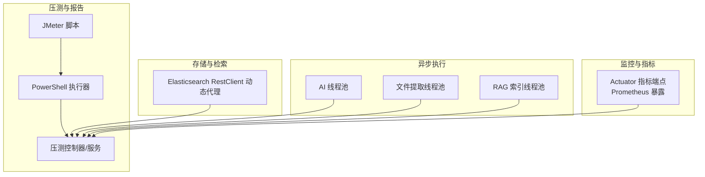
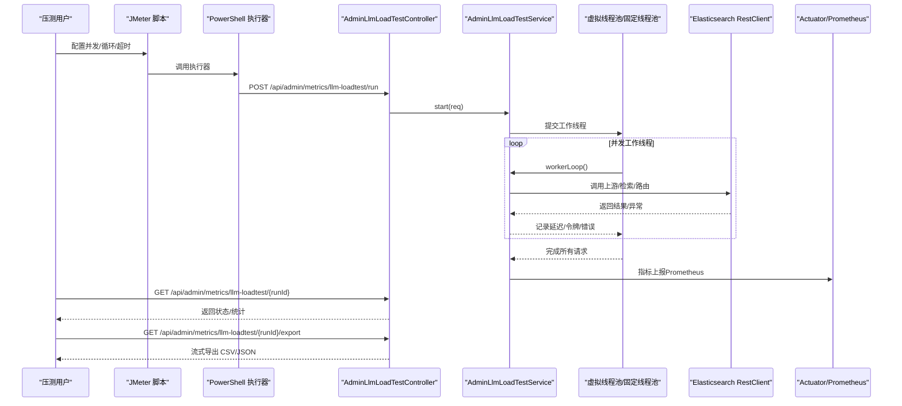
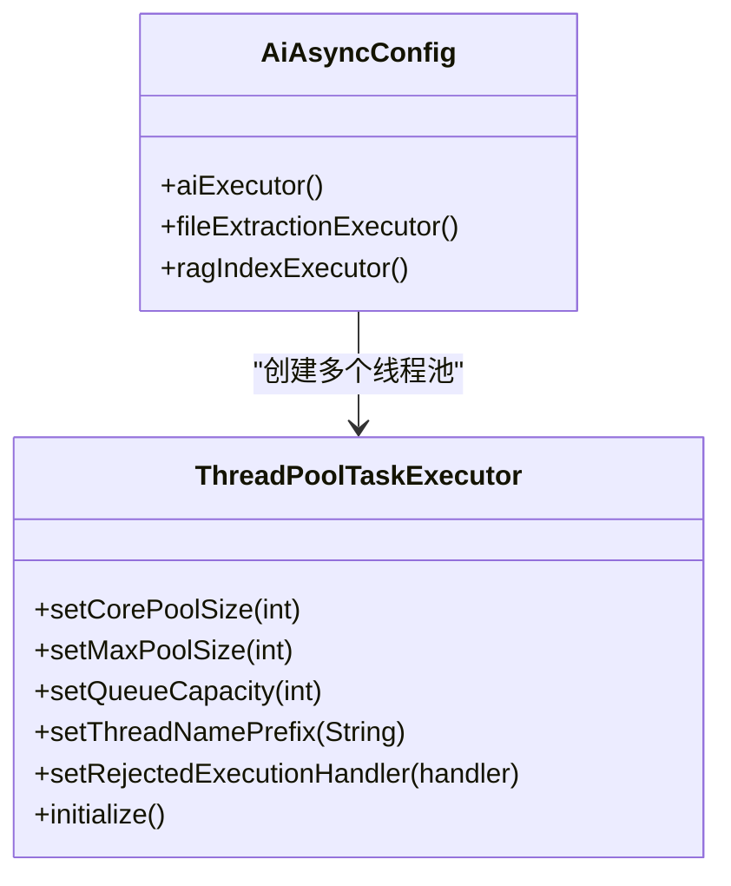
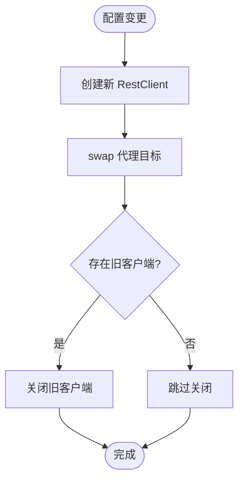
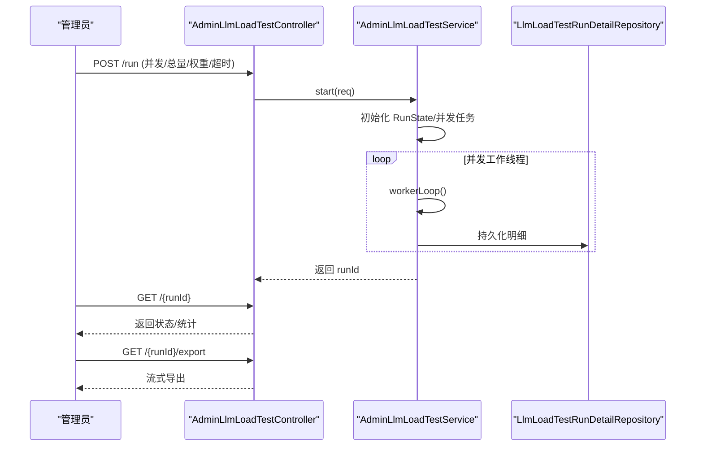
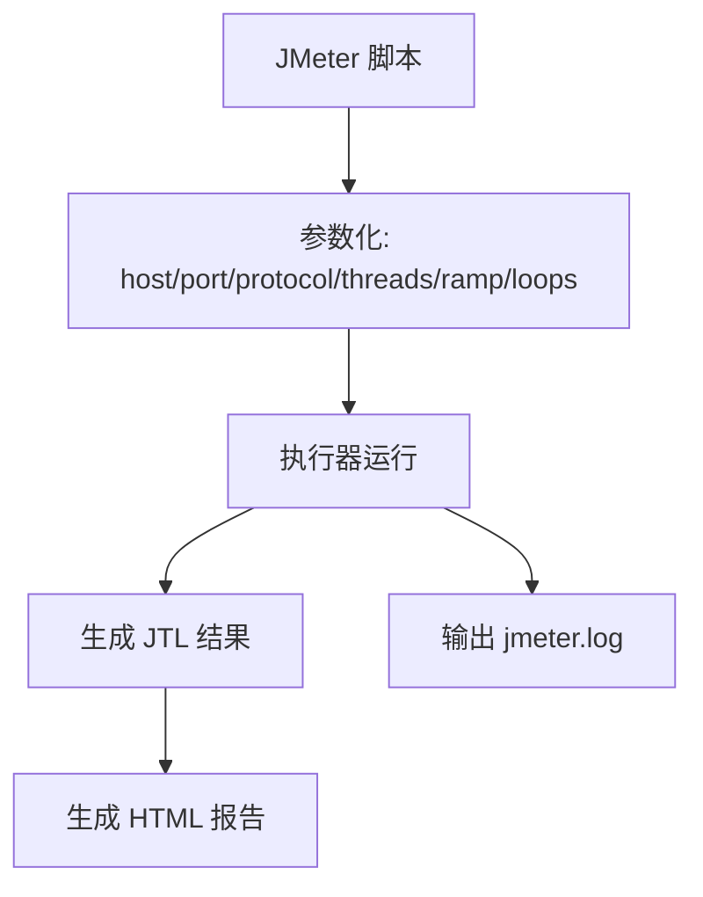
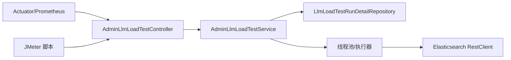

# 性能瓶颈诊断

<cite>
**本文引用的文件**   
- [application-perf.properties](file://src/main/resources/application-perf.properties)
- [AiAsyncConfig.java](file://src/main/java/com/example/EnterpriseRagCommunity/config/AiAsyncConfig.java)
- [SchedulingConfig.java](file://src/main/java/com/example/EnterpriseRagCommunity/config/SchedulingConfig.java)
- [DynamicElasticsearchConfig.java](file://src/main/java/com/example/EnterpriseRagCommunity/config/DynamicElasticsearchConfig.java)
- [AdminLlmLoadTestController.java](file://src/main/java/com/example/EnterpriseRagCommunity/controller/monitor/admin/AdminLlmLoadTestController.java)
- [AdminLlmLoadTestService.java](file://src/main/java/com/example/EnterpriseRagCommunity/service/monitor/AdminLlmLoadTestService.java)
- [AdminLlmLoadTestRunRequestDTO.java](file://src/main/java/com/example/EnterpriseRagCommunity/dto/monitor/AdminLlmLoadTestRunRequestDTO.java)
- [AdminLlmLoadTestResultDTO.java](file://src/main/java/com/example/EnterpriseRagCommunity/dto/monitor/AdminLlmLoadTestResultDTO.java)
- [LlmLoadTestRunDetailRepository.java](file://src/main/java/com/example/EnterpriseRagCommunity/repository/monitor/LlmLoadTestRunDetailRepository.java)
- [EnterpriseRagCommunity_basic_load.jmx](file://perf/jmeter/EnterpriseRagCommunity_basic_load.jmx)
- [run-jmeter.ps1](file://perf/jmeter/run-jmeter.ps1)
- [自动化测试与指标说明.md](file://docs/自动化测试与指标说明.md)
</cite>

## 目录
1. [引言](#引言)
2. [项目结构](#项目结构)
3. [核心组件](#核心组件)
4. [架构总览](#架构总览)
5. [详细组件分析](#详细组件分析)
6. [依赖关系分析](#依赖关系分析)
7. [性能考量](#性能考量)
8. [故障排查指南](#故障排查指南)
9. [结论](#结论)
10. [附录](#附录)

## 引言
本指南聚焦于本项目的性能瓶颈诊断与优化实践，围绕系统监控指标采集与分析、数据库查询优化、缓存与命中率提升、异步任务处理、JMeter 压测报告解读与性能基准流程、应用层瓶颈定位（线程阻塞、内存泄漏、GC 频繁）、以及负载均衡与水平扩展策略展开。文档以仓库现有实现为依据，结合可操作的流程与可视化图示，帮助研发与运维人员快速定位问题并制定优化方案。

## 项目结构
本项目采用 Spring Boot 后端与 Vite 前端分离架构，性能相关能力主要分布在以下区域：
- 监控与指标暴露：通过 Actuator 暴露健康、信息与 Prometheus 指标，默认监听 127.0.0.1:8098
- 异步执行与线程池：AI 与文件处理等异步任务通过自定义线程池执行
- 动态 Elasticsearch 客户端：支持配置热切换，避免因认证或地址变更导致的连接抖动
- 压测与报告：JMeter 脚本与 PowerShell 执行器，支持导出 CSV/JSON 报告
- 管理端压测控制器与服务：提供压测运行、状态查询、停止与导出能力

**图表来源**
- [application-perf.properties:1-6](file://src/main/resources/application-perf.properties#L1-L6)
- [AiAsyncConfig.java:13-45](file://src/main/java/com/example/EnterpriseRagCommunity/config/AiAsyncConfig.java#L13-L45)
- [DynamicElasticsearchConfig.java:33-51](file://src/main/java/com/example/EnterpriseRagCommunity/config/DynamicElasticsearchConfig.java#L33-L51)
- [AdminLlmLoadTestController.java:24-66](file://src/main/java/com/example/EnterpriseRagCommunity/controller/monitor/admin/AdminLlmLoadTestController.java#L24-L66)
- [AdminLlmLoadTestService.java:94-104](file://src/main/java/com/example/EnterpriseRagCommunity/service/monitor/AdminLlmLoadTestService.java#L94-L104)
- [EnterpriseRagCommunity_basic_load.jmx:1-83](file://perf/jmeter/EnterpriseRagCommunity_basic_load.jmx#L1-L83)
- [run-jmeter.ps1:1-74](file://perf/jmeter/run-jmeter.ps1#L1-L74)

**章节来源**
- [application-perf.properties:1-6](file://src/main/resources/application-perf.properties#L1-L6)
- [AiAsyncConfig.java:10-47](file://src/main/java/com/example/EnterpriseRagCommunity/config/AiAsyncConfig.java#L10-L47)
- [DynamicElasticsearchConfig.java:24-128](file://src/main/java/com/example/EnterpriseRagCommunity/config/DynamicElasticsearchConfig.java#L24-L128)
- [AdminLlmLoadTestController.java:24-66](file://src/main/java/com/example/EnterpriseRagCommunity/controller/monitor/admin/AdminLlmLoadTestController.java#L24-L66)
- [AdminLlmLoadTestService.java:73-104](file://src/main/java/com/example/EnterpriseRagCommunity/service/monitor/AdminLlmLoadTestService.java#L73-L104)
- [EnterpriseRagCommunity_basic_load.jmx:1-83](file://perf/jmeter/EnterpriseRagCommunity_basic_load.jmx#L1-L83)
- [run-jmeter.ps1:1-74](file://perf/jmeter/run-jmeter.ps1#L1-L74)
- [自动化测试与指标说明.md:73-86](file://docs/自动化测试与指标说明.md#L73-L86)

## 核心组件
- 监控指标暴露：启用健康检查、信息、Prometheus 指标端点，并设置应用标签，便于在监控系统中聚合
- 异步执行配置：为 AI 生成、文件提取、RAG 索引分别配置独立线程池，避免相互干扰
- 动态 Elasticsearch 客户端：基于 AOP 代理与热切换，支持在配置变更时平滑替换底层客户端
- 压测控制器与服务：提供压测运行、状态查询、停止与导出能力，支持流式导出压测明细
- JMeter 脚本与执行器：统一压测入口，支持并发用户、持续时间、超时与重试等参数化配置

**章节来源**
- [application-perf.properties:1-6](file://src/main/resources/application-perf.properties#L1-L6)
- [AiAsyncConfig.java:13-45](file://src/main/java/com/example/EnterpriseRagCommunity/config/AiAsyncConfig.java#L13-L45)
- [DynamicElasticsearchConfig.java:33-90](file://src/main/java/com/example/EnterpriseRagCommunity/config/DynamicElasticsearchConfig.java#L33-L90)
- [AdminLlmLoadTestController.java:24-66](file://src/main/java/com/example/EnterpriseRagCommunity/controller/monitor/admin/AdminLlmLoadTestController.java#L24-L66)
- [AdminLlmLoadTestService.java:106-137](file://src/main/java/com/example/EnterpriseRagCommunity/service/monitor/AdminLlmLoadTestService.java#L106-L137)
- [EnterpriseRagCommunity_basic_load.jmx:30-80](file://perf/jmeter/EnterpriseRagCommunity_basic_load.jmx#L30-L80)
- [run-jmeter.ps1:37-49](file://perf/jmeter/run-jmeter.ps1#L37-L49)

## 架构总览
下图展示了压测执行与指标采集的整体流程，从 JMeter 调用到后端控制器、服务、线程池与 Elasticsearch，再到指标端点与报告生成。

**图表来源**
- [AdminLlmLoadTestController.java:32-64](file://src/main/java/com/example/EnterpriseRagCommunity/controller/monitor/admin/AdminLlmLoadTestController.java#L32-L64)
- [AdminLlmLoadTestService.java:106-196](file://src/main/java/com/example/EnterpriseRagCommunity/service/monitor/AdminLlmLoadTestService.java#L106-L196)
- [DynamicElasticsearchConfig.java:92-126](file://src/main/java/com/example/EnterpriseRagCommunity/config/DynamicElasticsearchConfig.java#L92-L126)
- [application-perf.properties:1-6](file://src/main/resources/application-perf.properties#L1-L6)
- [EnterpriseRagCommunity_basic_load.jmx:30-80](file://perf/jmeter/EnterpriseRagCommunity_basic_load.jmx#L30-L80)
- [run-jmeter.ps1:37-49](file://perf/jmeter/run-jmeter.ps1#L37-L49)

## 详细组件分析

### 监控与指标暴露
- 指标端点：通过配置启用 health、info、prometheus 端点，监听 127.0.0.1:8098，便于本地或容器内监控系统抓取
- 应用标签：为指标添加应用标签，便于多实例聚合与区分
- 建议：在生产环境开放绑定地址与端口，配合防火墙/网关限制访问；确保 Prometheus 抓取稳定

**章节来源**
- [application-perf.properties:1-6](file://src/main/resources/application-perf.properties#L1-L6)
- [自动化测试与指标说明.md:82-85](file://docs/自动化测试与指标说明.md#L82-L85)

### 异步执行与线程池配置
- AI 线程池：核心池大小、最大池大小、队列容量、线程命名前缀均已配置，适合处理长尾与突发请求
- 文件提取线程池：采用 CallerRunsPolicy 拒绝策略，防止任务堆积导致内存压力
- RAG 索引线程池：与 AI 线程池分离，避免索引任务影响对话生成
- 建议：根据 CPU 核心数与 IO 特性调整核心池大小；观察队列长度与拒绝次数，动态优化

**图表来源**
- [AiAsyncConfig.java:13-45](file://src/main/java/com/example/EnterpriseRagCommunity/config/AiAsyncConfig.java#L13-L45)

**章节来源**
- [AiAsyncConfig.java:13-45](file://src/main/java/com/example/EnterpriseRagCommunity/config/AiAsyncConfig.java#L13-L45)

### 动态 Elasticsearch 客户端
- 热切换机制：通过 AOP 代理与 swap 替换底层 RestClient，在配置变更时平滑关闭旧连接并建立新连接
- 默认头部：支持从系统配置注入 API Key，避免每次请求拦截器开销
- 建议：在配置中心变更 ES 地址/密钥后触发 refresh，减少人工重启成本

**图表来源**
- [DynamicElasticsearchConfig.java:57-90](file://src/main/java/com/example/EnterpriseRagCommunity/config/DynamicElasticsearchConfig.java#L57-L90)

**章节来源**
- [DynamicElasticsearchConfig.java:33-90](file://src/main/java/com/example/EnterpriseRagCommunity/config/DynamicElasticsearchConfig.java#L33-L90)

### 压测控制器与服务
- 控制器：提供运行、状态查询、停止与导出接口，支持跨域与权限校验
- 服务：内部使用虚拟线程池与固定线程池组合，支持并发工作线程、队列监控、令牌统计与结果持久化
- 导出：支持 JSON/CSV 流式导出，便于离线分析

**图表来源**
- [AdminLlmLoadTestController.java:32-64](file://src/main/java/com/example/EnterpriseRagCommunity/controller/monitor/admin/AdminLlmLoadTestController.java#L32-L64)
- [AdminLlmLoadTestService.java:106-196](file://src/main/java/com/example/EnterpriseRagCommunity/service/monitor/AdminLlmLoadTestService.java#L106-L196)
- [LlmLoadTestRunDetailRepository.java:10-14](file://src/main/java/com/example/EnterpriseRagCommunity/repository/monitor/LlmLoadTestRunDetailRepository.java#L10-L14)

**章节来源**
- [AdminLlmLoadTestController.java:24-66](file://src/main/java/com/example/EnterpriseRagCommunity/controller/monitor/admin/AdminLlmLoadTestController.java#L24-L66)
- [AdminLlmLoadTestService.java:73-163](file://src/main/java/com/example/EnterpriseRagCommunity/service/monitor/AdminLlmLoadTestService.java#L73-L163)
- [LlmLoadTestRunDetailRepository.java:10-14](file://src/main/java/com/example/EnterpriseRagCommunity/repository/monitor/LlmLoadTestRunDetailRepository.java#L10-L14)

### JMeter 压测与报告
- 脚本：定义并发用户、循环次数、连接/响应超时、HTTP 默认参数与请求头
- 执行器：PowerShell 脚本负责参数化、结果目录与报告生成，失败时输出日志定位
- 指标：推荐关注吞吐量、平均/分位延迟、错误率与并发数

**图表来源**
- [EnterpriseRagCommunity_basic_load.jmx:8-26](file://perf/jmeter/EnterpriseRagCommunity_basic_load.jmx#L8-L26)
- [run-jmeter.ps1:37-69](file://perf/jmeter/run-jmeter.ps1#L37-L69)

**章节来源**
- [EnterpriseRagCommunity_basic_load.jmx:1-83](file://perf/jmeter/EnterpriseRagCommunity_basic_load.jmx#L1-L83)
- [run-jmeter.ps1:1-74](file://perf/jmeter/run-jmeter.ps1#L1-L74)
- [自动化测试与指标说明.md:62-78](file://docs/自动化测试与指标说明.md#L62-L78)

## 依赖关系分析
- 控制器依赖服务进行压测生命周期管理
- 服务依赖线程池、网关/上游服务、令牌统计与持久化仓储
- 监控端点为压测与运行时提供指标支撑
- JMeter 与执行器独立于后端，但需与后端端口一致

**图表来源**
- [AdminLlmLoadTestController.java:30-31](file://src/main/java/com/example/EnterpriseRagCommunity/controller/monitor/admin/AdminLlmLoadTestController.java#L30-L31)
- [AdminLlmLoadTestService.java:83-92](file://src/main/java/com/example/EnterpriseRagCommunity/service/monitor/AdminLlmLoadTestService.java#L83-L92)
- [LlmLoadTestRunDetailRepository.java:10-14](file://src/main/java/com/example/EnterpriseRagCommunity/repository/monitor/LlmLoadTestRunDetailRepository.java#L10-L14)
- [DynamicElasticsearchConfig.java:33-51](file://src/main/java/com/example/EnterpriseRagCommunity/config/DynamicElasticsearchConfig.java#L33-L51)
- [application-perf.properties:1-6](file://src/main/resources/application-perf.properties#L1-L6)
- [EnterpriseRagCommunity_basic_load.jmx:30-80](file://perf/jmeter/EnterpriseRagCommunity_basic_load.jmx#L30-L80)

**章节来源**
- [AdminLlmLoadTestController.java:24-66](file://src/main/java/com/example/EnterpriseRagCommunity/controller/monitor/admin/AdminLlmLoadTestController.java#L24-L66)
- [AdminLlmLoadTestService.java:73-104](file://src/main/java/com/example/EnterpriseRagCommunity/service/monitor/AdminLlmLoadTestService.java#L73-L104)
- [LlmLoadTestRunDetailRepository.java:10-14](file://src/main/java/com/example/EnterpriseRagCommunity/repository/monitor/LlmLoadTestRunDetailRepository.java#L10-L14)
- [application-perf.properties:1-6](file://src/main/resources/application-perf.properties#L1-L6)

## 性能考量
- 指标采集与分析
  - CPU/内存/GC/线程数：通过 Prometheus 抓取 Actuator 指标，结合 Grafana 可视化趋势
  - HTTP 请求耗时分布：关注 P90/P95/P99 与错误率变化
  - 建议：在压测前后对比基线，识别异常波动点
- 数据库查询优化
  - 使用慢查询日志与索引分析工具定位热点 SQL
  - 对高频查询增加复合索引，避免全表扫描
  - 合理分页与投影字段，减少不必要的数据传输
- 缓存与命中率
  - 对热点读取路径引入本地缓存与分布式缓存
  - 监控缓存命中率与淘汰策略，避免缓存雪崩
- 异步任务处理
  - 合理设置线程池核心/最大/队列容量，避免任务堆积
  - 对 IO 密集型任务优先使用虚拟线程或固定线程池
- 负载均衡与水平扩展
  - 使用反向代理/网关进行流量分发，开启健康检查
  - 实例间共享状态（如 Redis）或无状态部署，支持弹性扩缩容

[本节为通用指导，无需特定文件引用]

## 故障排查指南
- 线程阻塞
  - 观察线程池队列长度与拒绝次数，必要时扩容或调整拒绝策略
  - 使用堆栈快照定位阻塞点，避免长时间持有锁或等待 IO
- 内存泄漏
  - 关注 GC 频率与老年代增长，排查未释放的静态集合、监听器与线程
  - 使用内存分析工具定位大对象与不可达对象
- GC 频繁
  - 调整新生代/老年代比例，优化对象生命周期
  - 减少临时对象创建，避免短生命周期大对象晋升
- 压测异常
  - 若 JTL 仅含表头，检查 jmeter.log，确认目标可达、协议与 TLS 设置正确
  - 核对并发与循环参数，避免超时或重试策略不当导致的误判

**章节来源**
- [AiAsyncConfig.java:24-34](file://src/main/java/com/example/EnterpriseRagCommunity/config/AiAsyncConfig.java#L24-L34)
- [run-jmeter.ps1:56-69](file://perf/jmeter/run-jmeter.ps1#L56-L69)
- [自动化测试与指标说明.md:68-72](file://docs/自动化测试与指标说明.md#L68-L72)

## 结论
本项目提供了完善的性能观测与压测基础设施：Actuator/Prometheus 指标、动态 Elasticsearch 客户端、多线程池隔离与 JMeter 压测流水线。结合本文的诊断与优化建议，可在不同阶段（开发、测试、预生产、生产）系统性地发现并解决性能瓶颈，确保系统在高并发场景下的稳定性与可扩展性。

## 附录
- 压测参数参考
  - 并发用户：根据目标吞吐与延迟目标逐步提升
  - 循环次数：保证足够样本，便于统计 P90/P95/P99
  - 超时与重试：避免过短超时导致误报，合理设置重试间隔
- 报告解读要点
  - 吞吐量与延迟：关注随并发上升的拐点与平台化
  - 错误率：区分超时、连接失败与业务错误
  - 指标趋势：结合 CPU/内存/GC 与线程数，定位瓶颈来源

[本节为通用指导，无需特定文件引用]