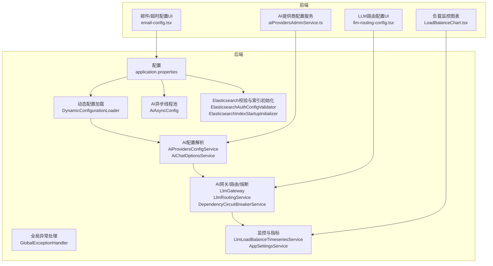
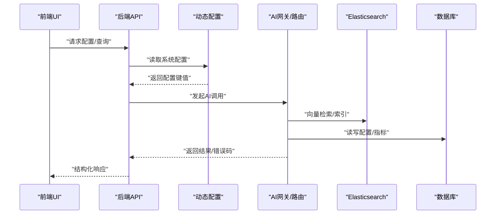
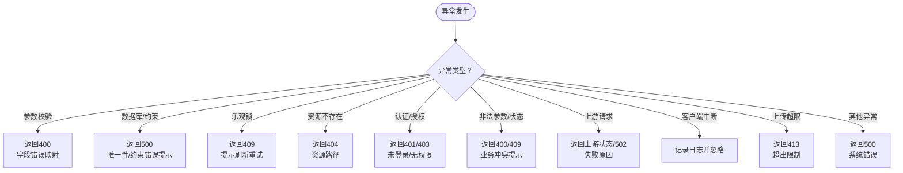
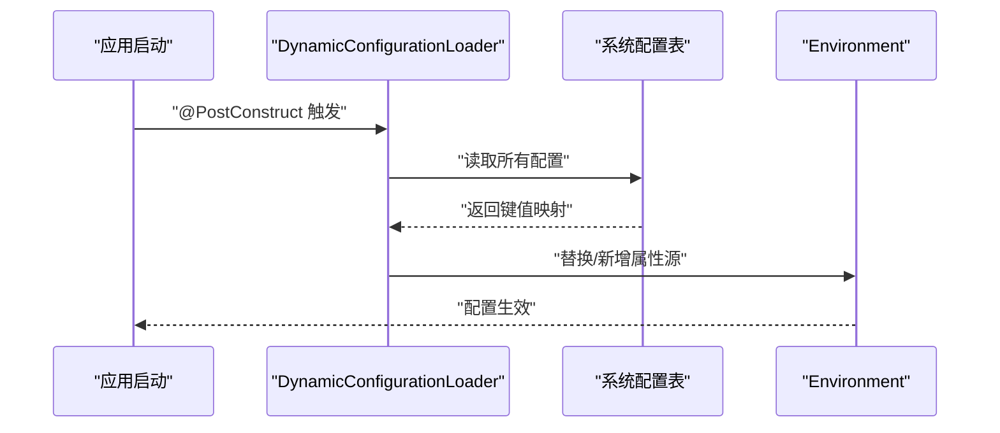
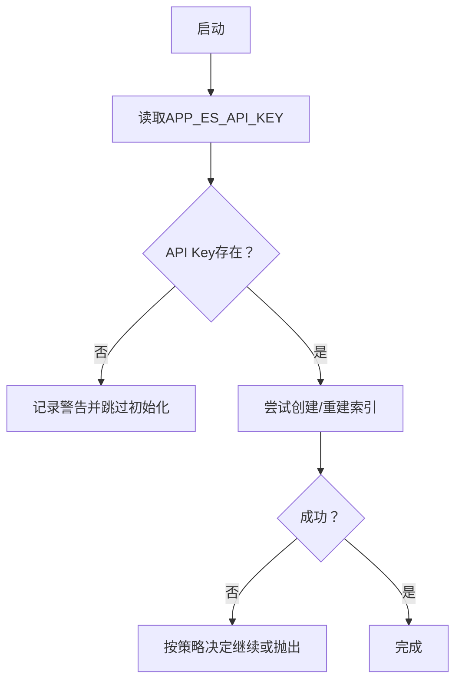
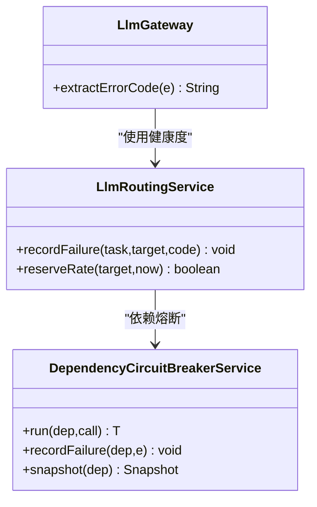
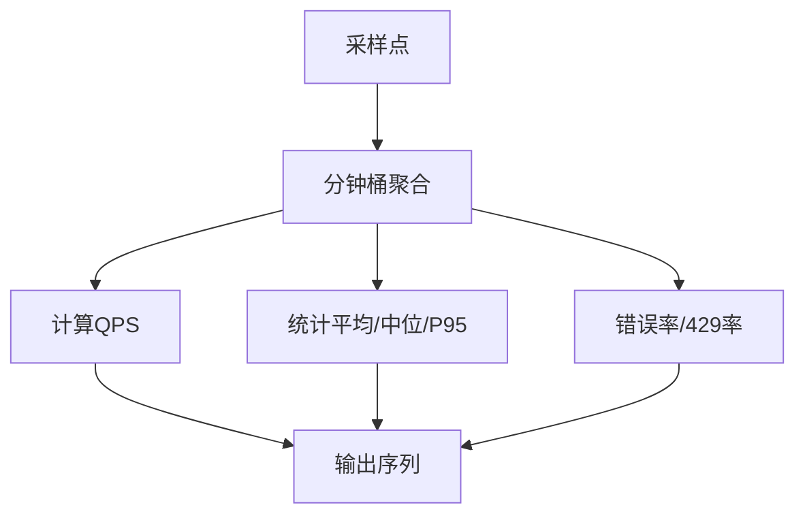
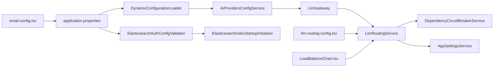

# 故障排除

<cite>
**本文引用的文件**
- [application.properties](file://src/main/resources/application.properties)
- [logback-spring.xml](file://src/main/resources/logback-spring.xml)
- [GlobalExceptionHandler.java](file://src/main/java/com/example/EnterpriseRagCommunity/controller/GlobalExceptionHandler.java)
- [ResourceNotFoundException.java](file://src/main/java/com/example/EnterpriseRagCommunity/exception/ResourceNotFoundException.java)
- [UpstreamRequestException.java](file://src/main/java/com/example/EnterpriseRagCommunity/exception/UpstreamRequestException.java)
- [AiAsyncConfig.java](file://src/main/java/com/example/EnterpriseRagCommunity/config/AiAsyncConfig.java)
- [DynamicConfigurationLoader.java](file://src/main/java/com/example/EnterpriseRagCommunity/config/DynamicConfigurationLoader.java)
- [ElasticsearchAuthConfigValidator.java](file://src/main/java/com/example/EnterpriseRagCommunity/config/ElasticsearchAuthConfigValidator.java)
- [ElasticsearchIndexStartupInitializer.java](file://src/main/java/com/example/EnterpriseRagCommunity/config/ElasticsearchIndexStartupInitializer.java)
- [DependencyCircuitBreakerService.java](file://src/main/java/com/example/EnterpriseRagCommunity/service/safety/DependencyCircuitBreakerService.java)
- [LlmGateway.java](file://src/main/java/com/example/EnterpriseRagCommunity/service/ai/LlmGateway.java)
- [AiProvidersConfigService.java](file://src/main/java/com/example/EnterpriseRagCommunity/service/ai/AiProvidersConfigService.java)
- [AiChatOptionsService.java](file://src/main/java/com/example/EnterpriseRagCommunity/service/ai/AiChatOptionsService.java)
- [AppSettingsService.java](file://src/main/java/com/example/EnterpriseRagCommunity/service/monitor/AppSettingsService.java)
- [LlmLoadBalanceTimeseriesService.java](file://src/main/java/com/example/EnterpriseRagCommunity/service/monitor/LlmLoadBalanceTimeseriesService.java)
- [LlmRoutingService.java](file://src/main/java/com/example/EnterpriseRagCommunity/service/ai/LlmRoutingService.java)
- [EnterpriseRagCommunity_basic_load.jmx](file://perf/jmeter/EnterpriseRagCommunity_basic_load.jmx)
- [llm-routing-config.tsx](file://my-vite-app/src/pages/admin/forms/metrics/llm-routing-config.tsx)
- [LoadBalanceChart.tsx](file://my-vite-app/src/pages/admin/forms/metrics/LoadBalanceChart.tsx)
- [email-config.tsx](file://my-vite-app/src/pages/admin/forms/users/email-config.tsx)
- [aiProvidersAdminService.ts](file://my-vite-app/src/services/aiProvidersAdminService.ts)
</cite>

## 目录
1. [引言](#引言)
2. [项目结构](#项目结构)
3. [核心组件](#核心组件)
4. [架构总览](#架构总览)
5. [详细组件分析](#详细组件分析)
6. [依赖关系分析](#依赖关系分析)
7. [性能考量](#性能考量)
8. [故障排除指南](#故障排除指南)
9. [结论](#结论)
10. [附录](#附录)

## 引言
本指南面向企业级RAG社区平台的运维与开发人员，聚焦系统启动失败、数据库连接异常、AI服务调用错误、性能瓶颈等常见问题，提供症状识别、原因分析、定位步骤、日志分析技巧、错误码解释、调试工具使用、监控指标解读与预警阈值建议、紧急故障处理流程与恢复策略，并给出问题反馈与社区支持渠道。

## 项目结构
后端采用Spring Boot，前端为React/Vite应用；配置通过application.properties与动态配置中心加载；异常统一由全局处理器捕获并标准化输出；AI相关能力通过网关与路由服务编排；Elasticsearch索引在启动阶段初始化；JMeter用于性能压测。

图示来源
- [application.properties:1-84](file://src/main/resources/application.properties#L1-L84)
- [DynamicConfigurationLoader.java:24-45](file://src/main/java/com/example/EnterpriseRagCommunity/config/DynamicConfigurationLoader.java#L24-L45)
- [GlobalExceptionHandler.java:27-176](file://src/main/java/com/example/EnterpriseRagCommunity/controller/GlobalExceptionHandler.java#L27-L176)
- [AiAsyncConfig.java:11-46](file://src/main/java/com/example/EnterpriseRagCommunity/config/AiAsyncConfig.java#L11-L46)
- [ElasticsearchAuthConfigValidator.java:23-31](file://src/main/java/com/example/EnterpriseRagCommunity/config/ElasticsearchAuthConfigValidator.java#L23-L31)
- [ElasticsearchIndexStartupInitializer.java:52-69](file://src/main/java/com/example/EnterpriseRagCommunity/config/ElasticsearchIndexStartupInitializer.java#L52-L69)
- [LlmGateway.java:1777-1795](file://src/main/java/com/example/EnterpriseRagCommunity/service/ai/LlmGateway.java#L1777-L1795)
- [LlmRoutingService.java:349-448](file://src/main/java/com/example/EnterpriseRagCommunity/service/ai/LlmRoutingService.java#L349-L448)
- [DependencyCircuitBreakerService.java:37-99](file://src/main/java/com/example/EnterpriseRagCommunity/service/safety/DependencyCircuitBreakerService.java#L37-L99)
- [AiProvidersConfigService.java:32-361](file://src/main/java/com/example/EnterpriseRagCommunity/service/ai/AiProvidersConfigService.java#L32-L361)
- [AiChatOptionsService.java:28-33](file://src/main/java/com/example/EnterpriseRagCommunity/service/ai/AiChatOptionsService.java#L28-L33)
- [LlmLoadBalanceTimeseriesService.java:51-92](file://src/main/java/com/example/EnterpriseRagCommunity/service/monitor/LlmLoadBalanceTimeseriesService.java#L51-L92)
- [llm-routing-config.tsx:831-899](file://my-vite-app/src/pages/admin/forms/metrics/llm-routing-config.tsx#L831-L899)
- [LoadBalanceChart.tsx:132-392](file://my-vite-app/src/pages/admin/forms/metrics/LoadBalanceChart.tsx#L132-L392)
- [email-config.tsx:497-528](file://my-vite-app/src/pages/admin/forms/users/email-config.tsx#L497-L528)
- [aiProvidersAdminService.ts:33-78](file://my-vite-app/src/services/aiProvidersAdminService.ts#L33-L78)

章节来源
- [application.properties:1-84](file://src/main/resources/application.properties#L1-L84)
- [logback-spring.xml:1-8](file://src/main/resources/logback-spring.xml#L1-L8)

## 核心组件
- 全局异常处理：统一拦截参数校验、数据库、认证授权、资源不存在、上游请求、上传大小、通用异常等，输出结构化错误响应与标准HTTP状态码。
- 动态配置加载：从数据库系统配置表加载键值，注入Spring Environment，实现运行时配置热更新。
- AI异步执行器：为AI任务与文件提取、RAG索引构建分别配置线程池，避免阻塞与资源耗尽。
- Elasticsearch启动校验与索引初始化：启动时检查API Key，按需创建/重建索引，失败可选择继续或抛出。
- AI网关与路由：解析上游错误码（如429/timeout/connect/dns），记录健康度与节流冷却，结合熔断器保护依赖。
- 监控与指标：时间序列聚合统计QPS、平均时延、错误率、429限流率、P95等，支持可视化与告警。

章节来源
- [GlobalExceptionHandler.java:27-176](file://src/main/java/com/example/EnterpriseRagCommunity/controller/GlobalExceptionHandler.java#L27-L176)
- [DynamicConfigurationLoader.java:24-45](file://src/main/java/com/example/EnterpriseRagCommunity/config/DynamicConfigurationLoader.java#L24-L45)
- [AiAsyncConfig.java:11-46](file://src/main/java/com/example/EnterpriseRagCommunity/config/AiAsyncConfig.java#L11-L46)
- [ElasticsearchAuthConfigValidator.java:23-31](file://src/main/java/com/example/EnterpriseRagCommunity/config/ElasticsearchAuthConfigValidator.java#L23-L31)
- [ElasticsearchIndexStartupInitializer.java:52-69](file://src/main/java/com/example/EnterpriseRagCommunity/config/ElasticsearchIndexStartupInitializer.java#L52-L69)
- [LlmGateway.java:1777-1795](file://src/main/java/com/example/EnterpriseRagCommunity/service/ai/LlmGateway.java#L1777-L1795)
- [LlmRoutingService.java:349-448](file://src/main/java/com/example/EnterpriseRagCommunity/service/ai/LlmRoutingService.java#L349-L448)
- [DependencyCircuitBreakerService.java:37-99](file://src/main/java/com/example/EnterpriseRagCommunity/service/safety/DependencyCircuitBreakerService.java#L37-L99)
- [LlmLoadBalanceTimeseriesService.java:51-92](file://src/main/java/com/example/EnterpriseRagCommunity/service/monitor/LlmLoadBalanceTimeseriesService.java#L51-L92)

## 架构总览
系统围绕“配置—异常—AI—存储—监控”五大域协同工作。前端通过REST与WebSocket与后端交互，后端通过线程池并发处理AI任务，通过网关与路由服务对接上游LLM，通过Elasticsearch进行向量检索，通过数据库持久化配置与指标。

图示来源
- [DynamicConfigurationLoader.java:24-45](file://src/main/java/com/example/EnterpriseRagCommunity/config/DynamicConfigurationLoader.java#L24-L45)
- [AiProvidersConfigService.java:32-361](file://src/main/java/com/example/EnterpriseRagCommunity/service/ai/AiProvidersConfigService.java#L32-L361)
- [LlmGateway.java:1777-1795](file://src/main/java/com/example/EnterpriseRagCommunity/service/ai/LlmGateway.java#L1777-L1795)
- [ElasticsearchIndexStartupInitializer.java:52-69](file://src/main/java/com/example/EnterpriseRagCommunity/config/ElasticsearchIndexStartupInitializer.java#L52-L69)

## 详细组件分析

### 组件A：全局异常处理与错误码
- 覆盖范围：参数校验、数据库访问、乐观锁冲突、资源不存在、认证/授权失败、非法参数、非法状态、上游请求、响应状态异常、客户端中断、上传超限、通用异常。
- 输出特征：统一返回包含message的Map与标准HTTP状态码；对特定场景（TOTP主密钥未配置）返回服务不可用；对上游异常保留其状态码或回退为网关错误。
- 诊断要点：优先查看日志中的异常堆栈与消息；根据状态码判断是客户端错误、权限问题、服务内部错误还是上游失败。

图示来源
- [GlobalExceptionHandler.java:31-175](file://src/main/java/com/example/EnterpriseRagCommunity/controller/GlobalExceptionHandler.java#L31-L175)
- [ResourceNotFoundException.java:1-9](file://src/main/java/com/example/EnterpriseRagCommunity/exception/ResourceNotFoundException.java#L1-L9)
- [UpstreamRequestException.java:1-22](file://src/main/java/com/example/EnterpriseRagCommunity/exception/UpstreamRequestException.java#L1-L22)

章节来源
- [GlobalExceptionHandler.java:27-176](file://src/main/java/com/example/EnterpriseRagCommunity/controller/GlobalExceptionHandler.java#L27-L176)
- [ResourceNotFoundException.java:1-9](file://src/main/java/com/example/EnterpriseRagCommunity/exception/ResourceNotFoundException.java#L1-L9)
- [UpstreamRequestException.java:1-22](file://src/main/java/com/example/EnterpriseRagCommunity/exception/UpstreamRequestException.java#L1-L22)

### 组件B：动态配置加载与热更新
- 启动阶段从系统配置表读取键值，注入到Environment首部，优先于外部配置；若为空则跳过。
- 影响范围：AI提供商、ES认证、队列与熔断阈值、路由策略等。
- 故障点：配置表为空或键名不匹配导致默认行为与预期不符；建议在管理界面确认配置项。

图示来源
- [DynamicConfigurationLoader.java:24-45](file://src/main/java/com/example/EnterpriseRagCommunity/config/DynamicConfigurationLoader.java#L24-L45)

章节来源
- [DynamicConfigurationLoader.java:1-47](file://src/main/java/com/example/EnterpriseRagCommunity/config/DynamicConfigurationLoader.java#L1-L47)

### 组件C：Elasticsearch认证与索引初始化
- 认证校验：启动时检查API Key是否存在，若为空则记录警告，后续请求可能因401失败。
- 索引初始化：根据embedding维度与索引类型创建/重建；支持强制重建与失败策略；记录成功/失败日志。
- 故障点：缺少API Key或维度配置；索引冲突或权限不足。

图示来源
- [ElasticsearchAuthConfigValidator.java:23-31](file://src/main/java/com/example/EnterpriseRagCommunity/config/ElasticsearchAuthConfigValidator.java#L23-L31)
- [ElasticsearchIndexStartupInitializer.java:52-69](file://src/main/java/com/example/EnterpriseRagCommunity/config/ElasticsearchIndexStartupInitializer.java#L52-L69)

章节来源
- [ElasticsearchAuthConfigValidator.java:1-33](file://src/main/java/com/example/EnterpriseRagCommunity/config/ElasticsearchAuthConfigValidator.java#L1-L33)
- [ElasticsearchIndexStartupInitializer.java:1-240](file://src/main/java/com/example/EnterpriseRagCommunity/config/ElasticsearchIndexStartupInitializer.java#L1-L240)

### 组件D：AI网关与路由、熔断与错误码提取
- 错误码提取：从异常链中识别429/timeout/connect/dns等，便于限流与降级。
- 路由健康与节流：记录连续失败次数，达到阈值进入冷却；对429强制扩大冷却时间。
- 熔断器：记录失败并打开熔断窗口，冷却后自动重试；支持动态阈值与冷却秒数。

图示来源
- [LlmGateway.java:1777-1795](file://src/main/java/com/example/EnterpriseRagCommunity/service/ai/LlmGateway.java#L1777-L1795)
- [LlmRoutingService.java:349-448](file://src/main/java/com/example/EnterpriseRagCommunity/service/ai/LlmRoutingService.java#L349-L448)
- [DependencyCircuitBreakerService.java:37-99](file://src/main/java/com/example/EnterpriseRagCommunity/service/safety/DependencyCircuitBreakerService.java#L37-L99)

章节来源
- [LlmGateway.java:1777-1795](file://src/main/java/com/example/EnterpriseRagCommunity/service/ai/LlmGateway.java#L1777-L1795)
- [LlmRoutingService.java:349-448](file://src/main/java/com/example/EnterpriseRagCommunity/service/ai/LlmRoutingService.java#L349-L448)
- [DependencyCircuitBreakerService.java:37-133](file://src/main/java/com/example/EnterpriseRagCommunity/service/safety/DependencyCircuitBreakerService.java#L37-L133)

### 组件E：监控与指标（时间序列）
- 聚合维度：每分钟桶聚合，记录计数、时延样本、错误计数、429计数；支持按模型维度查询。
- 可视化：前端图表计算QPS、平均时延、错误率、429率、P95、慢请求比例与持续慢趋势。
- 告警建议：基于错误率、429率、P95、慢请求比例与QPS变化率设定阈值。

图示来源
- [LlmLoadBalanceTimeseriesService.java:51-92](file://src/main/java/com/example/EnterpriseRagCommunity/service/monitor/LlmLoadBalanceTimeseriesService.java#L51-L92)
- [LoadBalanceChart.tsx:132-392](file://my-vite-app/src/pages/admin/forms/metrics/LoadBalanceChart.tsx#L132-L392)

章节来源
- [LlmLoadBalanceTimeseriesService.java:1-92](file://src/main/java/com/example/EnterpriseRagCommunity/service/monitor/LlmLoadBalanceTimeseriesService.java#L1-L92)
- [LoadBalanceChart.tsx:132-392](file://my-vite-app/src/pages/admin/forms/metrics/LoadBalanceChart.tsx#L132-L392)

## 依赖关系分析
- 配置依赖：application.properties提供基础配置；DynamicConfigurationLoader将数据库配置注入环境，影响AI与ES行为。
- 运行时依赖：AiAsyncConfig为AI任务提供独立线程池；ElasticsearchIndexStartupInitializer依赖系统配置与属性决定是否初始化索引。
- 服务间依赖：LlmRoutingService依赖AppSettingsService读取阈值与冷却；LlmGateway依赖路由健康度与熔断器；前端通过服务接口与管理界面驱动后端配置。

图示来源
- [application.properties:1-84](file://src/main/resources/application.properties#L1-L84)
- [DynamicConfigurationLoader.java:24-45](file://src/main/java/com/example/EnterpriseRagCommunity/config/DynamicConfigurationLoader.java#L24-L45)
- [AiProvidersConfigService.java:32-361](file://src/main/java/com/example/EnterpriseRagCommunity/service/ai/AiProvidersConfigService.java#L32-L361)
- [ElasticsearchAuthConfigValidator.java:23-31](file://src/main/java/com/example/EnterpriseRagCommunity/config/ElasticsearchAuthConfigValidator.java#L23-L31)
- [ElasticsearchIndexStartupInitializer.java:52-69](file://src/main/java/com/example/EnterpriseRagCommunity/config/ElasticsearchIndexStartupInitializer.java#L52-L69)
- [LlmGateway.java:1777-1795](file://src/main/java/com/example/EnterpriseRagCommunity/service/ai/LlmGateway.java#L1777-L1795)
- [LlmRoutingService.java:349-448](file://src/main/java/com/example/EnterpriseRagCommunity/service/ai/LlmRoutingService.java#L349-L448)
- [DependencyCircuitBreakerService.java:37-99](file://src/main/java/com/example/EnterpriseRagCommunity/service/safety/DependencyCircuitBreakerService.java#L37-L99)
- [AppSettingsService.java:1-47](file://src/main/java/com/example/EnterpriseRagCommunity/service/monitor/AppSettingsService.java#L1-L47)
- [llm-routing-config.tsx:831-899](file://my-vite-app/src/pages/admin/forms/metrics/llm-routing-config.tsx#L831-L899)
- [LoadBalanceChart.tsx:132-392](file://my-vite-app/src/pages/admin/forms/metrics/LoadBalanceChart.tsx#L132-L392)
- [email-config.tsx:497-528](file://my-vite-app/src/pages/admin/forms/users/email-config.tsx#L497-L528)

章节来源
- [AiAsyncConfig.java:1-47](file://src/main/java/com/example/EnterpriseRagCommunity/config/AiAsyncConfig.java#L1-L47)
- [AiChatOptionsService.java:1-33](file://src/main/java/com/example/EnterpriseRagCommunity/service/ai/AiChatOptionsService.java#L1-L33)

## 性能考量
- 并发与线程池：AI异步线程池容量与队列长度直接影响吞吐与延迟；建议根据模型并发与硬件资源调整。
- 超时与重试：AI连接/读超时、ES连接/Socket超时、上传大小限制均影响用户体验与稳定性。
- 负载测试：JMeter脚本提供公共API压力测试模板，可调整线程数、循环次数与协议端口。

章节来源
- [AiAsyncConfig.java:1-47](file://src/main/java/com/example/EnterpriseRagCommunity/config/AiAsyncConfig.java#L1-L47)
- [application.properties:68-83](file://src/main/resources/application.properties#L68-L83)
- [EnterpriseRagCommunity_basic_load.jmx:1-83](file://perf/jmeter/EnterpriseRagCommunity_basic_load.jmx#L1-L83)

## 故障排除指南

### 一、系统启动失败
- 症状
  - 应用无法启动或启动后立即退出。
  - 控制台出现数据库迁移、ES认证或索引初始化相关警告/错误。
- 原因分析
  - 数据库连接参数缺失或错误（URL、用户名、密码）。
  - Flyway迁移失败或版本不匹配。
  - Elasticsearch API Key缺失导致索引初始化跳过或后续请求401。
  - 动态配置表为空导致关键开关未生效。
- 排查步骤
  - 检查数据库连通性与凭据；确认数据库存在且字符集正确。
  - 查看启动日志中Flyway迁移输出，必要时手动执行迁移或修复迁移脚本。
  - 在管理界面配置ES API Key；确认索引初始化日志。
  - 登录管理后台，确认系统配置表中关键键值存在。
- 相关配置
  - 数据库与Flyway：参见[application.properties:7-24](file://src/main/resources/application.properties#L7-L24)。
  - ES认证与索引初始化：参见[ElasticsearchAuthConfigValidator.java:23-31](file://src/main/java/com/example/EnterpriseRagCommunity/config/ElasticsearchAuthConfigValidator.java#L23-L31)、[ElasticsearchIndexStartupInitializer.java:52-69](file://src/main/java/com/example/EnterpriseRagCommunity/config/ElasticsearchIndexStartupInitializer.java#L52-L69)。
  - 动态配置：参见[DynamicConfigurationLoader.java:24-45](file://src/main/java/com/example/EnterpriseRagCommunity/config/DynamicConfigurationLoader.java#L24-L45)。

章节来源
- [application.properties:7-24](file://src/main/resources/application.properties#L7-L24)
- [ElasticsearchAuthConfigValidator.java:23-31](file://src/main/java/com/example/EnterpriseRagCommunity/config/ElasticsearchAuthConfigValidator.java#L23-L31)
- [ElasticsearchIndexStartupInitializer.java:52-69](file://src/main/java/com/example/EnterpriseRagCommunity/config/ElasticsearchIndexStartupInitializer.java#L52-L69)
- [DynamicConfigurationLoader.java:24-45](file://src/main/java/com/example/EnterpriseRagCommunity/config/DynamicConfigurationLoader.java#L24-L45)

### 二、数据库连接异常
- 症状
  - 启动时报数据库连接失败；运行时出现连接超时或连接池耗尽。
- 原因分析
  - 连接串、用户名、密码未配置或错误。
  - 连接池参数不合理（最大池大小、空闲超时、最大生存时间、连接超时）。
  - 数据库服务不可达或网络策略阻断。
- 排查步骤
  - 使用命令行或数据库客户端验证连接串与凭据。
  - 调整连接池参数以匹配业务峰值与硬件资源。
  - 检查防火墙与安全组放行数据库端口。
- 相关配置
  - 数据库与连接池：参见[application.properties:7-16](file://src/main/resources/application.properties#L7-L16)。

章节来源
- [application.properties:7-16](file://src/main/resources/application.properties#L7-L16)

### 三、AI服务调用错误
- 症状
  - 请求返回上游错误或超时；出现429限流；部分模型不可用。
- 原因分析
  - 上游API Key/鉴权失败；网络DNS解析失败；连接/读取超时；触发限流。
  - 路由健康度下降，进入冷却；熔断器打开。
- 排查步骤
  - 在管理界面检查AI提供商配置与模型列表预览，确认连接/读取超时设置合理。
  - 使用探活功能批量检查可用性与延迟，定位具体Provider/Model。
  - 查看全局异常处理对上游异常的包装与状态码映射。
  - 检查路由健康与熔断快照，确认阈值与冷却时间。
- 相关配置与代码
  - 探活与可用性检查：参见[llm-routing-config.tsx:831-899](file://my-vite-app/src/pages/admin/forms/metrics/llm-routing-config.tsx#L831-L899)。
  - 上游错误码提取：参见[LlmGateway.java:1777-1795](file://src/main/java/com/example/EnterpriseRagCommunity/service/ai/LlmGateway.java#L1777-L1795)。
  - 路由健康与节流：参见[LlmRoutingService.java:349-448](file://src/main/java/com/example/EnterpriseRagCommunity/service/ai/LlmRoutingService.java#L349-L448)。
  - 熔断器：参见[DependencyCircuitBreakerService.java:37-99](file://src/main/java/com/example/EnterpriseRagCommunity/service/safety/DependencyCircuitBreakerService.java#L37-L99)。
  - 提供商配置解析：参见[AiProvidersConfigService.java:32-361](file://src/main/java/com/example/EnterpriseRagCommunity/service/ai/AiProvidersConfigService.java#L32-L361)、[AiChatOptionsService.java:28-33](file://src/main/java/com/example/EnterpriseRagCommunity/service/ai/AiChatOptionsService.java#L28-L33)。
  - 前端配置服务：参见[aiProvidersAdminService.ts:33-78](file://my-vite-app/src/services/aiProvidersAdminService.ts#L33-L78)。

章节来源
- [llm-routing-config.tsx:831-899](file://my-vite-app/src/pages/admin/forms/metrics/llm-routing-config.tsx#L831-L899)
- [LlmGateway.java:1777-1795](file://src/main/java/com/example/EnterpriseRagCommunity/service/ai/LlmGateway.java#L1777-L1795)
- [LlmRoutingService.java:349-448](file://src/main/java/com/example/EnterpriseRagCommunity/service/ai/LlmRoutingService.java#L349-L448)
- [DependencyCircuitBreakerService.java:37-99](file://src/main/java/com/example/EnterpriseRagCommunity/service/safety/DependencyCircuitBreakerService.java#L37-L99)
- [AiProvidersConfigService.java:32-361](file://src/main/java/com/example/EnterpriseRagCommunity/service/ai/AiProvidersConfigService.java#L32-L361)
- [AiChatOptionsService.java:28-33](file://src/main/java/com/example/EnterpriseRagCommunity/service/ai/AiChatOptionsService.java#L28-L33)
- [aiProvidersAdminService.ts:33-78](file://my-vite-app/src/services/aiProvidersAdminService.ts#L33-L78)

### 四、性能瓶颈
- 症状
  - 响应时延长、错误率上升、429率升高、P95抖动大。
- 原因分析
  - 线程池饱和或队列积压；AI/ES/数据库超时设置过短；热点模型导致路由拥塞。
- 排查步骤
  - 查看负载监控图表，关注QPS、平均时延、错误率、429率、P95与慢请求比例。
  - 调整AI异步线程池参数与队列容量；优化ES与数据库超时。
  - 对热点模型增加配额或分流策略。
- 相关配置与代码
  - 线程池：参见[AiAsyncConfig.java:11-46](file://src/main/java/com/example/EnterpriseRagCommunity/config/AiAsyncConfig.java#L11-L46)。
  - 监控指标计算：参见[LoadBalanceChart.tsx:132-392](file://my-vite-app/src/pages/admin/forms/metrics/LoadBalanceChart.tsx#L132-L392)、[LlmLoadBalanceTimeseriesService.java:51-92](file://src/main/java/com/example/EnterpriseRagCommunity/service/monitor/LlmLoadBalanceTimeseriesService.java#L51-L92)。
  - 超时配置：参见[application.properties:68-83](file://src/main/resources/application.properties#L68-L83)、[email-config.tsx:497-528](file://my-vite-app/src/pages/admin/forms/users/email-config.tsx#L497-L528)。

章节来源
- [AiAsyncConfig.java:1-47](file://src/main/java/com/example/EnterpriseRagCommunity/config/AiAsyncConfig.java#L1-L47)
- [LoadBalanceChart.tsx:132-392](file://my-vite-app/src/pages/admin/forms/metrics/LoadBalanceChart.tsx#L132-L392)
- [LlmLoadBalanceTimeseriesService.java:51-92](file://src/main/java/com/example/EnterpriseRagCommunity/service/monitor/LlmLoadBalanceTimeseriesService.java#L51-L92)
- [application.properties:68-83](file://src/main/resources/application.properties#L68-L83)
- [email-config.tsx:497-528](file://my-vite-app/src/pages/admin/forms/users/email-config.tsx#L497-L528)

### 五、日志分析技巧与错误码解释
- 日志级别与输出
  - 控制台与文件编码统一为UTF-8；根日志级别可调；访问日志可捕获请求/响应体。
- 常见错误码与含义
  - 400：参数校验失败或非法参数。
  - 401：未登录或会话过期。
  - 403：无权限访问。
  - 404：资源不存在。
  - 409：乐观锁冲突或业务冲突（如TOTP主密钥未配置）。
  - 413：上传大小超过限制。
  - 429：上游限流。
  - 500：数据库/通用异常。
  - 502：上游请求失败（网关错误）。
  - 503：熔断器打开（服务不可用）。
- 诊断建议
  - 结合全局异常处理器输出与上游错误码提取，快速定位是客户端问题、权限问题、上游限流还是服务内部错误。

章节来源
- [application.properties:46-60](file://src/main/resources/application.properties#L46-L60)
- [logback-spring.xml:1-8](file://src/main/resources/logback-spring.xml#L1-L8)
- [GlobalExceptionHandler.java:31-175](file://src/main/java/com/example/EnterpriseRagCommunity/controller/GlobalExceptionHandler.java#L31-L175)
- [LlmGateway.java:1777-1795](file://src/main/java/com/example/EnterpriseRagCommunity/service/ai/LlmGateway.java#L1777-L1795)
- [DependencyCircuitBreakerService.java:37-99](file://src/main/java/com/example/EnterpriseRagCommunity/service/safety/DependencyCircuitBreakerService.java#L37-L99)

### 六、调试工具使用指南
- 后端
  - 使用全局异常处理器输出的message与状态码快速定位问题；开启更详细的日志级别辅助排查。
- 前端
  - 使用探活功能批量检查Provider/Model可用性与延迟；在AI提供商配置界面调整连接/读取超时。
- 性能测试
  - 使用JMeter脚本进行公共API压力测试，调整线程数与循环次数评估系统承载能力。

章节来源
- [llm-routing-config.tsx:831-899](file://my-vite-app/src/pages/admin/forms/metrics/llm-routing-config.tsx#L831-L899)
- [email-config.tsx:497-528](file://my-vite-app/src/pages/admin/forms/users/email-config.tsx#L497-L528)
- [EnterpriseRagCommunity_basic_load.jmx:1-83](file://perf/jmeter/EnterpriseRagCommunity_basic_load.jmx#L1-L83)

### 七、监控指标解读与预警阈值建议
- 关键指标
  - QPS：衡量吞吐；异常波动通常伴随错误率上升。
  - 平均/中位/P95时延：P95对尾部延迟敏感，适合SLA基线。
  - 错误率：区分业务错误与系统错误。
  - 429率：反映上游限流压力。
  - 慢请求比例与持续慢趋势：识别性能退化。
- 预警阈值建议（示例）
  - QPS：环比变化>50%或<50%触发预警。
  - P95时延：>2s触发预警，>5s触发告警。
  - 错误率：>1%触发预警，>5%触发告警。
  - 429率：>0.5%触发预警，>2%触发告警。
  - 慢请求比例：>10%触发预警，>25%触发告警。
- 参考实现
  - 指标计算与序列：参见[LoadBalanceChart.tsx:132-392](file://my-vite-app/src/pages/admin/forms/metrics/LoadBalanceChart.tsx#L132-L392)、[LlmLoadBalanceTimeseriesService.java:51-92](file://src/main/java/com/example/EnterpriseRagCommunity/service/monitor/LlmLoadBalanceTimeseriesService.java#L51-L92)。

章节来源
- [LoadBalanceChart.tsx:132-392](file://my-vite-app/src/pages/admin/forms/metrics/LoadBalanceChart.tsx#L132-L392)
- [LlmLoadBalanceTimeseriesService.java:51-92](file://src/main/java/com/example/EnterpriseRagCommunity/service/monitor/LlmLoadBalanceTimeseriesService.java#L51-L92)

### 八、紧急故障处理流程与恢复策略
- 流程
  - 快速隔离：关闭限流严重Provider/Model，释放冷却窗口。
  - 降级：启用备用Provider、降低并发、提高超时容忍度。
  - 修复：修正配置（API Key、超时、阈值）、扩容线程池或数据库连接池。
  - 验证：使用探活功能与小流量回归测试。
  - 恢复：逐步恢复流量，观察监控指标。
- 恢复策略
  - 熔断器冷却：等待冷却时间结束自动恢复。
  - 配置回滚：回到上一个稳定配置版本。
  - 快速扩容：临时提升线程池与连接池上限。

章节来源
- [DependencyCircuitBreakerService.java:37-99](file://src/main/java/com/example/EnterpriseRagCommunity/service/safety/DependencyCircuitBreakerService.java#L37-L99)
- [LlmRoutingService.java:349-448](file://src/main/java/com/example/EnterpriseRagCommunity/service/ai/LlmRoutingService.java#L349-L448)
- [llm-routing-config.tsx:831-899](file://my-vite-app/src/pages/admin/forms/metrics/llm-routing-config.tsx#L831-L899)

### 九、问题反馈与社区支持
- 问题反馈渠道
  - 在项目仓库提交Issue，附带：环境信息、日志片段、复现步骤、期望与实际结果。
- 社区支持
  - 参与讨论区与文档维护，协助完善故障排除知识库。

## 结论
通过统一的异常处理、动态配置、AI网关与路由、熔断与监控体系，平台具备了较强的可观测性与自愈能力。建议在生产环境中严格配置ES认证与索引初始化策略，合理设置AI与数据库超时及线程池参数，并建立完善的监控与告警机制，确保在故障发生时能够快速定位、降级与恢复。

## 附录
- 关键配置清单
  - 数据库与连接池：参见[application.properties:7-16](file://src/main/resources/application.properties#L7-L16)。
  - 日志与访问日志：参见[application.properties:38-60](file://src/main/resources/application.properties#L38-L60)、[logback-spring.xml:1-8](file://src/main/resources/logback-spring.xml#L1-L8)。
  - AI超时与历史限制：参见[application.properties:68-70](file://src/main/resources/application.properties#L68-L70)。
  - ES连接与鉴权：参见[application.properties:72-82](file://src/main/resources/application.properties#L72-L82)、[ElasticsearchAuthConfigValidator.java:23-31](file://src/main/java/com/example/EnterpriseRagCommunity/config/ElasticsearchAuthConfigValidator.java#L23-L31)。
- 常用命令与工具
  - JMeter：参见[EnterpriseRagCommunity_basic_load.jmx:1-83](file://perf/jmeter/EnterpriseRagCommunity_basic_load.jmx#L1-L83)。