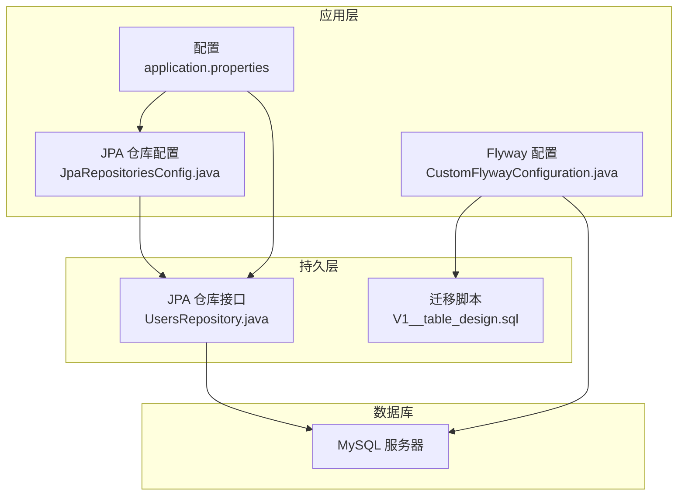
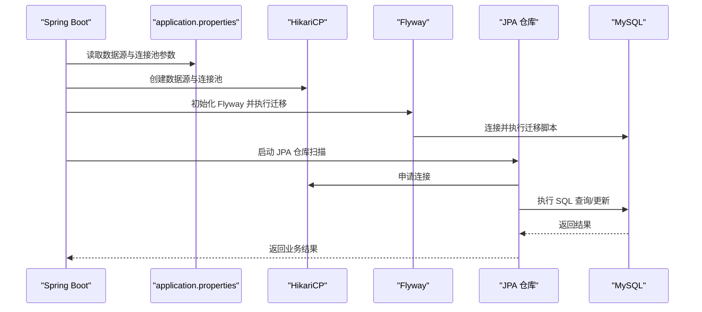
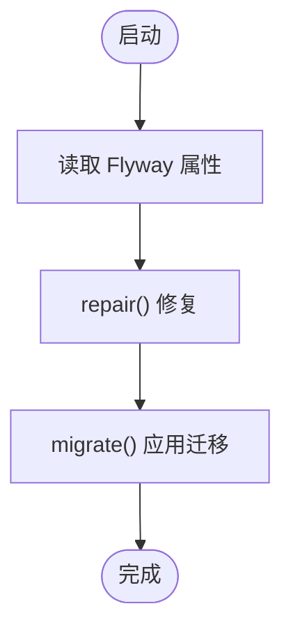
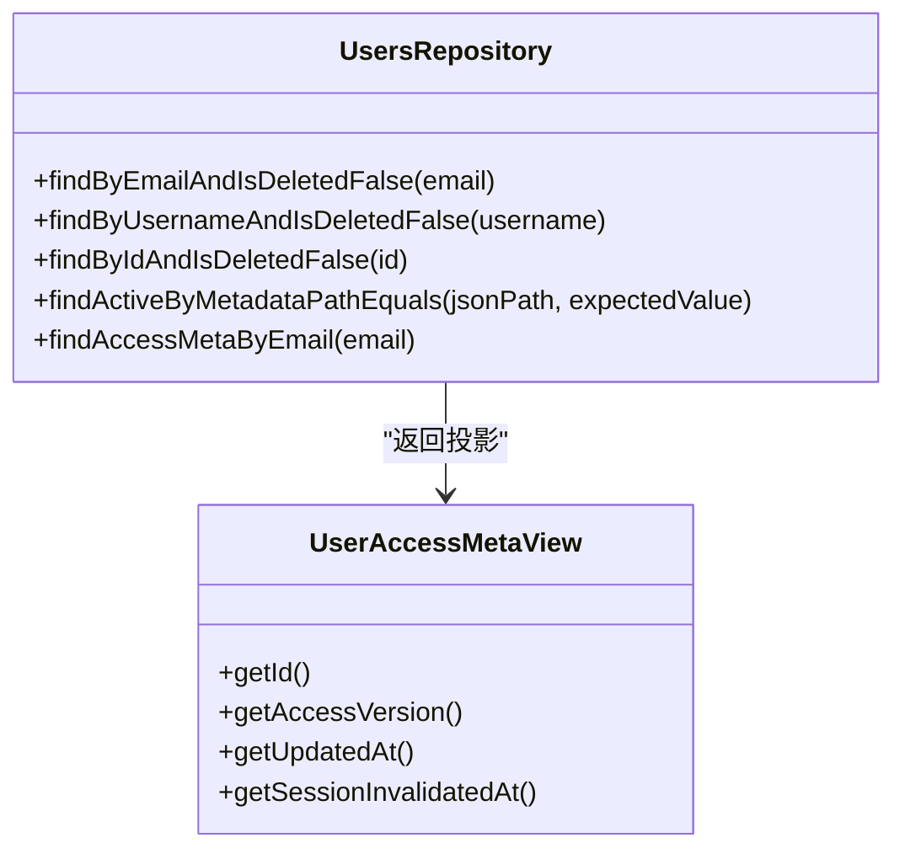
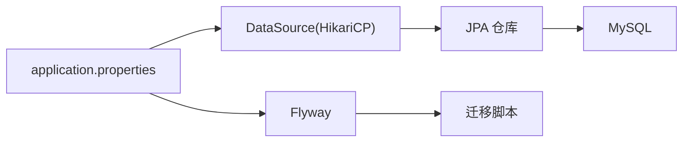
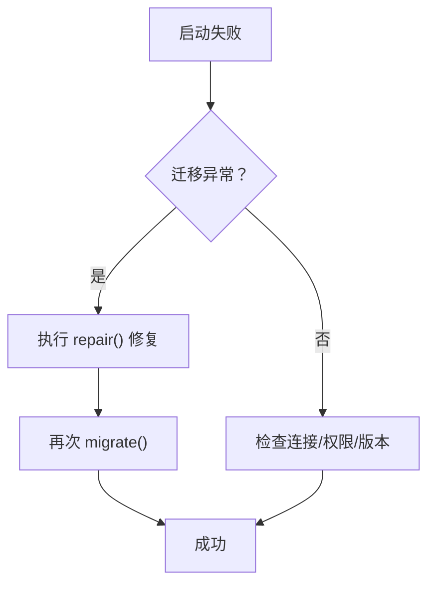

# 数据库连接问题

<cite>
**本文引用的文件**
- [application.properties](file://src/main/resources/application.properties)
- [CustomFlywayConfiguration.java](file://src/main/java/com/example/EnterpriseRagCommunity/config/CustomFlywayConfiguration.java)
- [JpaRepositoriesConfig.java](file://src/main/java/com/example/EnterpriseRagCommunity/config/JpaRepositoriesConfig.java)
- [UsersRepository.java](file://src/main/java/com/example/EnterpriseRagCommunity/repository/access/UsersRepository.java)
- [V1__table_design.sql](file://src/main/resources/db/migration/V1__table_design.sql)
- [ResourceNotFoundException.java](file://src/main/java/com/example/EnterpriseRagCommunity/exception/ResourceNotFoundException.java)
- [UpstreamRequestException.java](file://src/main/java/com/example/EnterpriseRagCommunity/exception/UpstreamRequestException.java)
</cite>

## 目录
1. [简介](#简介)
2. [项目结构](#项目结构)
3. [核心组件](#核心组件)
4. [架构总览](#架构总览)
5. [详细组件分析](#详细组件分析)
6. [依赖分析](#依赖分析)
7. [性能考量](#性能考量)
8. [故障排除指南](#故障排除指南)
9. [结论](#结论)
10. [附录](#附录)

## 简介
本指南聚焦于数据库连接问题的专业故障排除，覆盖以下主题：
- MySQL 连接超时、连接池耗尽、SQL 执行异常
- Flyway 迁移失败、数据库版本不匹配、连接字符串配置错误
- 数据库连接监控指标解读（连接数、查询响应时间、锁等待）
- 慢查询日志与事务死锁分析
- 备份恢复与主从同步异常处理流程

本指南基于实际代码与配置进行分析，并提供可操作的定位步骤与修复建议。

## 项目结构
该工程采用 Spring Boot + JPA/Hibernate + Flyway 的典型架构，数据库连接由 HikariCP 提供，Flyway 负责数据库迁移，JPA 负责 ORM 访问。

**图表来源**
- [application.properties:7-24](file://src/main/resources/application.properties#L7-L24)
- [CustomFlywayConfiguration.java:17-48](file://src/main/java/com/example/EnterpriseRagCommunity/config/CustomFlywayConfiguration.java#L17-L48)
- [JpaRepositoriesConfig.java:7-9](file://src/main/java/com/example/EnterpriseRagCommunity/config/JpaRepositoriesConfig.java#L7-L9)
- [UsersRepository.java:16-44](file://src/main/java/com/example/EnterpriseRagCommunity/repository/access/UsersRepository.java#L16-L44)
- [V1__table_design.sql:1-800](file://src/main/resources/db/migration/V1__table_design.sql#L1-L800)

**章节来源**
- [application.properties:7-24](file://src/main/resources/application.properties#L7-L24)
- [CustomFlywayConfiguration.java:17-48](file://src/main/java/com/example/EnterpriseRagCommunity/config/CustomFlywayConfiguration.java#L17-L48)
- [JpaRepositoriesConfig.java:7-9](file://src/main/java/com/example/EnterpriseRagCommunity/config/JpaRepositoriesConfig.java#L7-L9)
- [UsersRepository.java:16-44](file://src/main/java/com/example/EnterpriseRagCommunity/repository/access/UsersRepository.java#L16-L44)
- [V1__table_design.sql:1-800](file://src/main/resources/db/migration/V1__table_design.sql#L1-L800)

## 核心组件
- 数据源与连接池
  - JDBC 驱动、URL、用户名、密码来自环境变量或默认占位符
  - HikariCP 连接池参数：最大池大小、最小空闲、连接超时、校验超时、空闲超时、最大生存时间
- Flyway 迁移
  - 启用迁移、位置、基线策略、编码等
  - 自定义配置 Bean，显式 repair + migrate
- JPA 仓库
  - 启用 JPA 仓库扫描，面向 access 包下的实体与仓库
- 业务仓库示例
  - UsersRepository 展示了软删除过滤、JSON 字段查询、自定义投影视图等

**章节来源**
- [application.properties:7-24](file://src/main/resources/application.properties#L7-L24)
- [CustomFlywayConfiguration.java:17-48](file://src/main/java/com/example/EnterpriseRagCommunity/config/CustomFlywayConfiguration.java#L17-L48)
- [JpaRepositoriesConfig.java:7-9](file://src/main/java/com/example/EnterpriseRagCommunity/config/JpaRepositoriesConfig.java#L7-L9)
- [UsersRepository.java:16-44](file://src/main/java/com/example/EnterpriseRagCommunity/repository/access/UsersRepository.java#L16-L44)

## 架构总览
下图展示了数据库连接在系统中的关键流转：应用启动时加载配置 → 初始化 Flyway 迁移 → 初始化 JPA 仓库 → 业务层通过仓库访问数据库。

**图表来源**
- [application.properties:7-24](file://src/main/resources/application.properties#L7-L24)
- [CustomFlywayConfiguration.java:17-48](file://src/main/java/com/example/EnterpriseRagCommunity/config/CustomFlywayConfiguration.java#L17-L48)
- [JpaRepositoriesConfig.java:7-9](file://src/main/java/com/example/EnterpriseRagCommunity/config/JpaRepositoriesConfig.java#L7-L9)
- [UsersRepository.java:16-44](file://src/main/java/com/example/EnterpriseRagCommunity/repository/access/UsersRepository.java#L16-L44)

## 详细组件分析

### 数据源与连接池配置
- 关键参数
  - JDBC 驱动类名、连接 URL、用户名、密码
  - HikariCP 最大池大小、最小空闲、连接超时、校验超时、空闲超时、最大生存时间
- 影响
  - 连接池过小易导致“连接池耗尽”
  - 超时参数过短易导致“连接超时”或“SQL 执行超时”
  - 时间参数设置不当可能引发连接泄漏或频繁重建

**章节来源**
- [application.properties:7-16](file://src/main/resources/application.properties#L7-L16)

### Flyway 迁移配置
- 启用与位置
  - 启用 Flyway，迁移位置可从环境变量覆盖
  - 编码 UTF-8，缺失位置不报错
- 策略
  - 基线迁移开启，基线版本 1
  - 顺序执行，不接受乱序
  - 修复后再迁移
- 故障表现
  - 迁移失败、版本不匹配、重复迁移、损坏的迁移表

**图表来源**
- [CustomFlywayConfiguration.java:43-48](file://src/main/java/com/example/EnterpriseRagCommunity/config/CustomFlywayConfiguration.java#L43-L48)

**章节来源**
- [CustomFlywayConfiguration.java:17-48](file://src/main/java/com/example/EnterpriseRagCommunity/config/CustomFlywayConfiguration.java#L17-L48)
- [application.properties:18-24](file://src/main/resources/application.properties#L18-L24)

### JPA 仓库与实体访问
- 仓库扫描
  - 启用 JPA 仓库扫描，基础包为 access
- 示例仓库
  - UsersRepository 展示软删除过滤、JSON 字段查询、投影视图等
- 注意事项
  - 软删除字段 is_deleted 的过滤逻辑需贯穿业务层
  - JSON 字段查询需关注索引与函数使用

**图表来源**
- [UsersRepository.java:16-44](file://src/main/java/com/example/EnterpriseRagCommunity/repository/access/UsersRepository.java#L16-L44)

**章节来源**
- [JpaRepositoriesConfig.java:7-9](file://src/main/java/com/example/EnterpriseRagCommunity/config/JpaRepositoriesConfig.java#L7-L9)
- [UsersRepository.java:16-44](file://src/main/java/com/example/EnterpriseRagCommunity/repository/access/UsersRepository.java#L16-L44)

### 迁移脚本与表结构
- 特征
  - 使用 InnoDB、utf8mb4、MySQL 8.0
  - 多处唯一索引、外键约束、JSON 字段
- 影响
  - 外键与唯一约束影响 DML 性能与并发
  - JSON 字段查询需谨慎，必要时建立虚拟列或二级索引

**章节来源**
- [V1__table_design.sql:1-800](file://src/main/resources/db/migration/V1__table_design.sql#L1-L800)

## 依赖分析
- 组件耦合
  - application.properties 为数据源与 Flyway 的唯一配置来源
  - CustomFlywayConfiguration 依赖 DataSource 与 FlywayProperties
  - JpaRepositoriesConfig 依赖 JPA 仓库扫描
  - UsersRepository 依赖数据源与表结构
- 外部依赖
  - MySQL 驱动、HikariCP、Flyway、JPA/Hibernate

**图表来源**
- [application.properties:7-24](file://src/main/resources/application.properties#L7-L24)
- [CustomFlywayConfiguration.java:17-48](file://src/main/java/com/example/EnterpriseRagCommunity/config/CustomFlywayConfiguration.java#L17-L48)
- [JpaRepositoriesConfig.java:7-9](file://src/main/java/com/example/EnterpriseRagCommunity/config/JpaRepositoriesConfig.java#L7-L9)
- [UsersRepository.java:16-44](file://src/main/java/com/example/EnterpriseRagCommunity/repository/access/UsersRepository.java#L16-L44)

**章节来源**
- [application.properties:7-24](file://src/main/resources/application.properties#L7-L24)
- [CustomFlywayConfiguration.java:17-48](file://src/main/java/com/example/EnterpriseRagCommunity/config/CustomFlywayConfiguration.java#L17-L48)
- [JpaRepositoriesConfig.java:7-9](file://src/main/java/com/example/EnterpriseRagCommunity/config/JpaRepositoriesConfig.java#L7-L9)
- [UsersRepository.java:16-44](file://src/main/java/com/example/EnterpriseRagCommunity/repository/access/UsersRepository.java#L16-L44)

## 性能考量
- 连接池参数对性能的影响
  - 最大池大小与最小空闲决定并发能力与内存占用
  - 连接超时与校验超时影响抖动与可用性
  - 空闲超时与最大生存时间影响连接生命周期
- SQL 性能
  - 唯一索引与外键约束提升一致性，但写入成本增加
  - JSON 字段查询需避免函数索引失效
- 监控指标
  - 连接池活跃/空闲/等待/拒绝计数
  - 查询响应时间分布与慢查询比例
  - 锁等待与死锁计数

[本节为通用指导，无需列出具体文件来源]

## 故障排除指南

### 一、连接超时
- 现象
  - 应用启动或运行中出现连接超时异常
- 诊断步骤
  - 检查连接池超时参数是否过短
  - 检查网络连通性与防火墙策略
  - 检查数据库负载与连接上限
- 修复建议
  - 适当增大连接超时与校验超时
  - 优化慢查询与锁竞争
  - 必要时扩容数据库实例

**章节来源**
- [application.properties:11-16](file://src/main/resources/application.properties#L11-L16)

### 二、连接池耗尽
- 现象
  - 报告连接池耗尽、请求排队、超时
- 诊断步骤
  - 查看连接池等待请求数与活跃连接数
  - 分析是否存在未关闭的事务或连接
  - 检查长时间运行的查询
- 修复建议
  - 增大最大池大小
  - 优化事务边界与连接使用
  - 为热点查询添加合适索引

**章节来源**
- [application.properties:11-16](file://src/main/resources/application.properties#L11-L16)

### 三、SQL 执行异常
- 现象
  - 单条 SQL 报错、事务回滚、数据不一致
- 诊断步骤
  - 检查 SQL 是否违反唯一约束或外键约束
  - 检查 JSON 字段查询是否正确
  - 检查软删除过滤是否遗漏
- 修复建议
  - 修正约束冲突的数据
  - 为 JSON 字段建立合适的二级索引或虚拟列
  - 在业务层统一处理软删除

**章节来源**
- [UsersRepository.java:18-30](file://src/main/java/com/example/EnterpriseRagCommunity/repository/access/UsersRepository.java#L18-L30)
- [V1__table_design.sql:1-800](file://src/main/resources/db/migration/V1__table_design.sql#L1-L800)

### 四、Flyway 迁移失败
- 现象
  - 启动时报迁移错误、版本不匹配、重复迁移
- 诊断步骤
  - 查看迁移日志与错误堆栈
  - 检查迁移位置与编码
  - 检查迁移表状态与版本号
- 修复建议
  - 使用修复命令清理损坏状态
  - 明确迁移顺序与版本基线
  - 在生产环境先预演迁移

**图表来源**
- [CustomFlywayConfiguration.java:43-48](file://src/main/java/com/example/EnterpriseRagCommunity/config/CustomFlywayConfiguration.java#L43-L48)

**章节来源**
- [CustomFlywayConfiguration.java:17-48](file://src/main/java/com/example/EnterpriseRagCommunity/config/CustomFlywayConfiguration.java#L17-L48)
- [application.properties:18-24](file://src/main/resources/application.properties#L18-L24)

### 五、数据库版本不匹配
- 现象
  - 迁移版本号与期望不符，应用无法启动
- 诊断步骤
  - 对比 Flyway 元数据表与迁移脚本版本
  - 检查是否跳过了某些版本
- 修复建议
  - 使用基线版本策略确保一致性
  - 生产环境禁止手动修改迁移表

**章节来源**
- [application.properties:18-24](file://src/main/resources/application.properties#L18-L24)
- [CustomFlywayConfiguration.java:27-29](file://src/main/java/com/example/EnterpriseRagCommunity/config/CustomFlywayConfiguration.java#L27-L29)

### 六、连接字符串配置错误
- 现象
  - 无法连接数据库、认证失败、时区或字符集异常
- 诊断步骤
  - 检查 JDBC URL、用户名、密码
  - 检查时区与 SSL 设置
- 修复建议
  - 使用环境变量注入敏感信息
  - 明确字符集与时区配置

**章节来源**
- [application.properties:7-10](file://src/main/resources/application.properties#L7-L10)

### 七、数据库连接监控指标解读
- 连接数
  - 活跃连接、空闲连接、等待请求数、拒绝数
- 查询响应时间
  - P50/P95/P99 响应时间，慢查询比例
- 锁等待
  - 锁等待计数、死锁计数、阻塞时长

[本节为通用指导，无需列出具体文件来源]

### 八、慢查询日志与事务死锁分析
- 慢查询日志
  - 开启慢查询日志，设定阈值
  - 分析执行计划与索引使用
- 事务死锁
  - 分析死锁日志，调整锁顺序与隔离级别
  - 减少长事务与热点行锁定

[本节为通用指导，无需列出具体文件来源]

### 九、备份恢复与主从同步异常
- 备份恢复
  - 使用逻辑备份（如 mysqldump）或物理备份
  - 恢复后验证数据完整性与迁移版本
- 主从同步异常
  - 检查复制 IO/SQL 线程状态
  - 校验 GTID 与位点一致性
  - 处理 DDL 冲突与延迟

[本节为通用指导，无需列出具体文件来源]

## 结论
- 将连接池参数与数据库性能调优结合，是解决连接超时与连接池耗尽的关键
- Flyway 的基线与修复策略能有效应对迁移失败与版本不匹配
- 通过监控指标与日志分析，可快速定位慢查询与死锁问题
- 备份恢复与主从同步流程需制度化与演练，确保生产安全

[本节为总结性内容，无需列出具体文件来源]

## 附录

### A. 常见异常类型与定位
- 资源不存在
  - 业务层抛出资源不存在异常，便于前端反馈
- 上游请求异常
  - 用于封装上游服务错误码与消息

**章节来源**
- [ResourceNotFoundException.java:1-9](file://src/main/java/com/example/EnterpriseRagCommunity/exception/ResourceNotFoundException.java#L1-L9)
- [UpstreamRequestException.java:1-22](file://src/main/java/com/example/EnterpriseRagCommunity/exception/UpstreamRequestException.java#L1-L22)