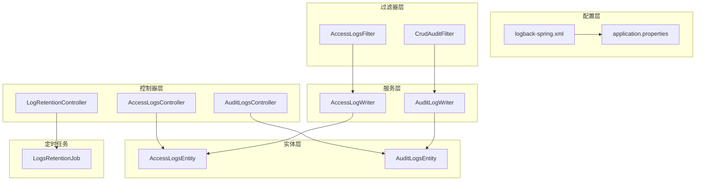
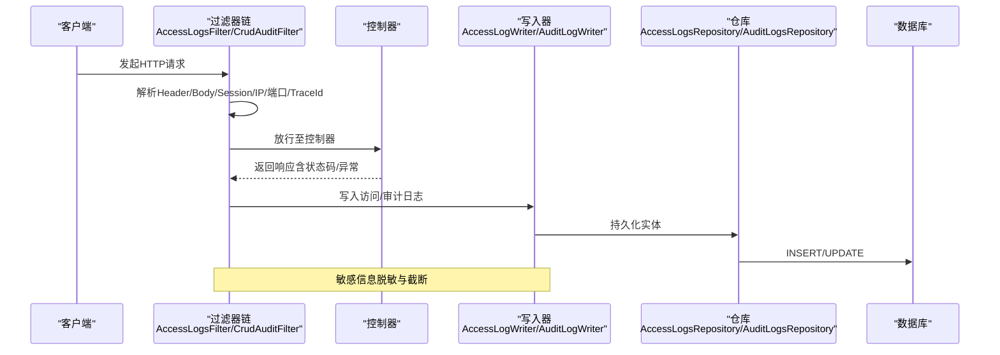
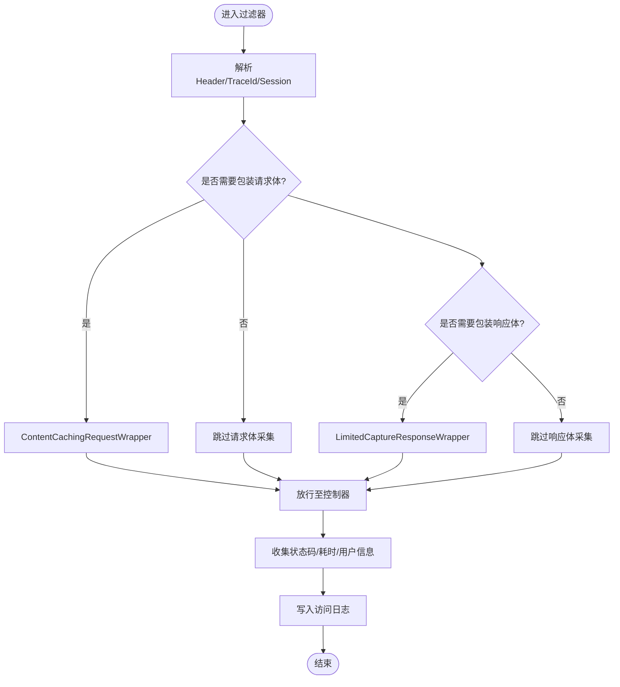
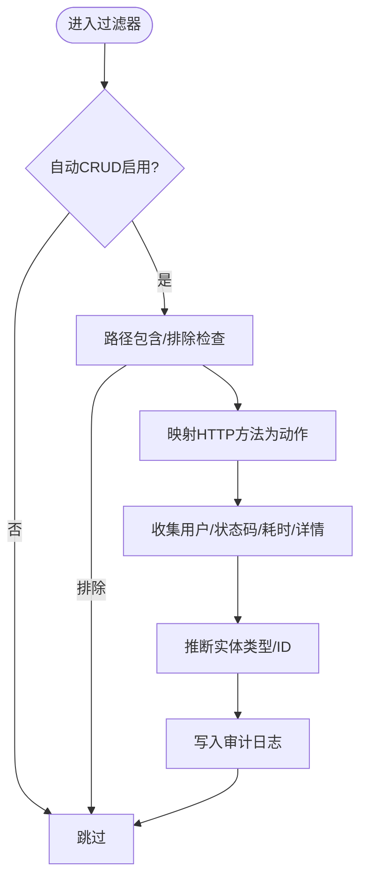
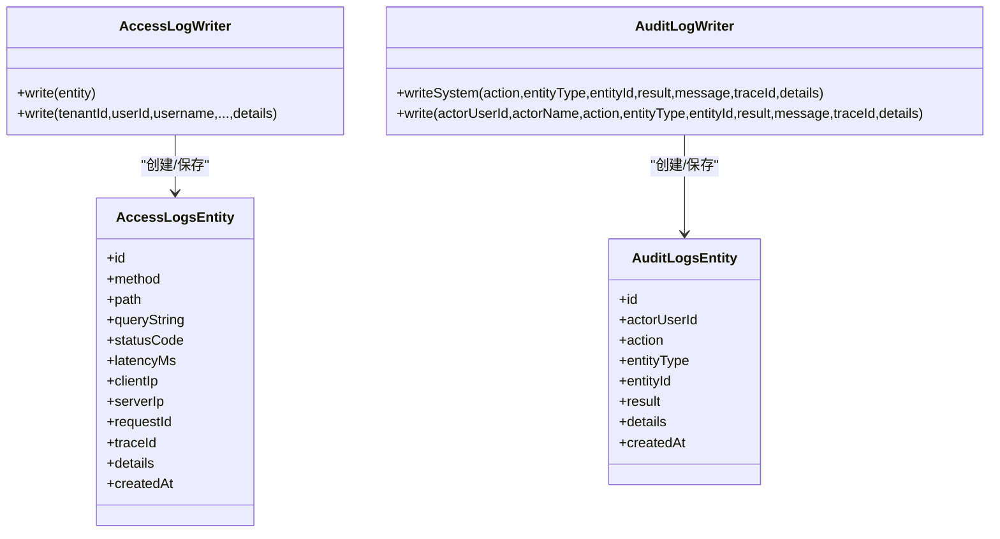
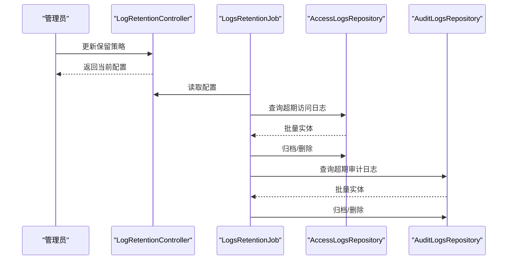
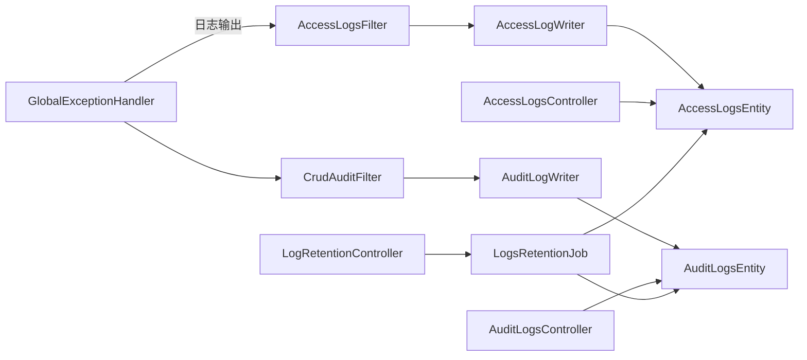

# 日志分析与调试

<cite>
**本文引用的文件**
- [logback-spring.xml](file://src/main/resources/logback-spring.xml)
- [application.properties](file://src/main/resources/application.properties)
- [AccessLogsFilter.java](file://src/main/java/com/example/EnterpriseRagCommunity/security/AccessLogsFilter.java)
- [CrudAuditFilter.java](file://src/main/java/com/example/EnterpriseRagCommunity/security/CrudAuditFilter.java)
- [AccessLogWriter.java](file://src/main/java/com/example/EnterpriseRagCommunity/service/access/AccessLogWriter.java)
- [AuditLogWriter.java](file://src/main/java/com/example/EnterpriseRagCommunity/service/access/AuditLogWriter.java)
- [AccessLogsEntity.java](file://src/main/java/com/example/EnterpriseRagCommunity/entity/access/AccessLogsEntity.java)
- [AuditLogsEntity.java](file://src/main/java/com/example/EnterpriseRagCommunity/entity/access/AuditLogsEntity.java)
- [AccessLogsController.java](file://src/main/java/com/example/EnterpriseRagCommunity/controller/access/AccessLogsController.java)
- [AuditLogsController.java](file://src/main/java/com/example/EnterpriseRagCommunity/controller/access/AuditLogsController.java)
- [LogRetentionController.java](file://src/main/java/com/example/EnterpriseRagCommunity/controller/access/LogRetentionController.java)
- [LogsRetentionJob.java](file://src/main/java/com/example/EnterpriseRagCommunity/service/monitor/LogsRetentionJob.java)
- [LogRetentionConfigService.java](file://src/main/java/com/example/EnterpriseRagCommunity/service/monitor/LogRetentionConfigService.java)
- [GlobalExceptionHandler.java](file://src/main/java/com/example/EnterpriseRagCommunity/controller/GlobalExceptionHandler.java)
- [LoggingToFileSmokeTest.java](file://src/test/java/com/example/EnterpriseRagCommunity/LoggingToFileSmokeTest.java)
- [LlmGateway.java](file://src/main/java/com/example/EnterpriseRagCommunity/service/ai/LlmGateway.java)
</cite>

## 目录
1. [引言](#引言)
2. [项目结构](#项目结构)
3. [核心组件](#核心组件)
4. [架构总览](#架构总览)
5. [详细组件分析](#详细组件分析)
6. [依赖关系分析](#依赖关系分析)
7. [性能考量](#性能考量)
8. [故障排查指南](#故障排查指南)
9. [结论](#结论)
10. [附录](#附录)

## 引言
本指南面向工程实践中的日志分析与调试需求，围绕访问日志、审计日志与业务日志的采集、存储、查询与保留策略展开，结合项目中已实现的过滤器、写入器、实体模型与控制器，给出可操作的分析方法、关键字段解读、常见错误模式识别以及与ELK等工具的集成建议。同时提供基于现有代码的调试技巧与问题复现最佳实践。

## 项目结构
项目采用Spring Boot标准目录组织，日志相关能力主要分布在以下位置：
- 配置层：Logback XML与Spring Boot日志属性
- 过滤器层：访问日志与审计日志自动采集
- 服务层：统一写入器封装持久化细节
- 实体层：访问日志与审计日志的数据模型
- 控制器层：日志查询与保留策略管理接口
- 定时任务：日志保留与归档作业

图表来源
- [logback-spring.xml:1-8](file://src/main/resources/logback-spring.xml#L1-L8)
- [application.properties:38-54](file://src/main/resources/application.properties#L38-L54)
- [AccessLogsFilter.java:84-213](file://src/main/java/com/example/EnterpriseRagCommunity/security/AccessLogsFilter.java#L84-L213)
- [CrudAuditFilter.java:58-128](file://src/main/java/com/example/EnterpriseRagCommunity/security/CrudAuditFilter.java#L58-L128)
- [AccessLogWriter.java:17-68](file://src/main/java/com/example/EnterpriseRagCommunity/service/access/AccessLogWriter.java#L17-L68)
- [AuditLogWriter.java:43-88](file://src/main/java/com/example/EnterpriseRagCommunity/service/access/AuditLogWriter.java#L43-L88)
- [AccessLogsEntity.java:21-90](file://src/main/java/com/example/EnterpriseRagCommunity/entity/access/AccessLogsEntity.java#L21-L90)
- [AuditLogsEntity.java:16-50](file://src/main/java/com/example/EnterpriseRagCommunity/entity/access/AuditLogsEntity.java#L16-L50)
- [AccessLogsController.java](file://src/main/java/com/example/EnterpriseRagCommunity/controller/access/AccessLogsController.java)
- [AuditLogsController.java](file://src/main/java/com/example/EnterpriseRagCommunity/controller/access/AuditLogsController.java)
- [LogRetentionController.java:28-40](file://src/main/java/com/example/EnterpriseRagCommunity/controller/access/LogRetentionController.java#L28-L40)
- [LogsRetentionJob.java:23-35](file://src/main/java/com/example/EnterpriseRagCommunity/service/monitor/LogsRetentionJob.java#L23-L35)

章节来源
- [logback-spring.xml:1-8](file://src/main/resources/logback-spring.xml#L1-L8)
- [application.properties:38-54](file://src/main/resources/application.properties#L38-L54)

## 核心组件
- 访问日志过滤器：在请求生命周期内采集请求/响应上下文、请求体/响应体（按配置裁剪）、用户标识、IP端口、Header快照、会话指纹等，并通过写入器落库。
- 审计日志过滤器：自动推断CRUD动作类型，结合状态码与异常信息生成审计事件，支持敏感信息脱敏。
- 写入器：统一封装日志实体构造与入库逻辑，确保字段规范化与时间戳一致性。
- 实体模型：定义访问日志与审计日志的字段与JSON详情存储结构。
- 控制器与保留策略：提供日志查询接口与保留策略配置与执行作业。

章节来源
- [AccessLogsFilter.java:84-213](file://src/main/java/com/example/EnterpriseRagCommunity/security/AccessLogsFilter.java#L84-L213)
- [CrudAuditFilter.java:58-128](file://src/main/java/com/example/EnterpriseRagCommunity/security/CrudAuditFilter.java#L58-L128)
- [AccessLogWriter.java:17-68](file://src/main/java/com/example/EnterpriseRagCommunity/service/access/AccessLogWriter.java#L17-L68)
- [AuditLogWriter.java:43-88](file://src/main/java/com/example/EnterpriseRagCommunity/service/access/AuditLogWriter.java#L43-L88)
- [AccessLogsEntity.java:21-90](file://src/main/java/com/example/EnterpriseRagCommunity/entity/access/AccessLogsEntity.java#L21-L90)
- [AuditLogsEntity.java:16-50](file://src/main/java/com/example/EnterpriseRagCommunity/entity/access/AuditLogsEntity.java#L16-L50)

## 架构总览
下图展示从请求进入应用到日志落库的关键路径，以及异常处理与日志保留作业的联动。

图表来源
- [AccessLogsFilter.java:84-213](file://src/main/java/com/example/EnterpriseRagCommunity/security/AccessLogsFilter.java#L84-L213)
- [CrudAuditFilter.java:58-128](file://src/main/java/com/example/EnterpriseRagCommunity/security/CrudAuditFilter.java#L58-L128)
- [AccessLogWriter.java:17-68](file://src/main/java/com/example/EnterpriseRagCommunity/service/access/AccessLogWriter.java#L17-L68)
- [AuditLogWriter.java:43-88](file://src/main/java/com/example/EnterpriseRagCommunity/service/access/AuditLogWriter.java#L43-L88)

## 详细组件分析

### 访问日志过滤器（AccessLogsFilter）
- 请求追踪：优先读取请求头中的X-Request-Id/X-Correlation-Id/X-Trace-Id，若不存在则生成UUID；同时在响应头设置X-Request-Id。
- 上下文采集：解析客户端/服务端IP与端口、方法、路径、协议、Host、User-Agent、Referer、查询串（敏感键脱敏）等。
- Header快照：记录Content-Type、Accept、Content-Length、RequestId、TraceId等。
- 请求/响应体采集：根据配置与内容类型决定是否捕获，支持二进制与流式响应的跳过；对JSON与表单进行敏感键脱敏；按最大字节截断并计算SHA-256摘要。
- 用户解析：从安全上下文中解析用户名，缓存用户ID以降低查询成本。
- 写入：调用AccessLogWriter写入数据库。

图表来源
- [AccessLogsFilter.java:84-213](file://src/main/java/com/example/EnterpriseRagCommunity/security/AccessLogsFilter.java#L84-L213)

章节来源
- [AccessLogsFilter.java:84-213](file://src/main/java/com/example/EnterpriseRagCommunity/security/AccessLogsFilter.java#L84-L213)

### 审计日志过滤器（CrudAuditFilter）
- 自动CRUD审计：在请求完成后根据HTTP方法与路径推断动作（CRUD_READ/CREATE/UPDATE/DELETE），结合状态码与异常判定结果（SUCCESS/FAIL）。
- 路径过滤：支持包含/排除前缀，避免重复审计与敏感接口审计。
- 实体识别：从路径或参数中提取实体类型与ID。
- 写入：调用AuditLogWriter写入审计日志，包含自动标记与上下文补充。

图表来源
- [CrudAuditFilter.java:58-128](file://src/main/java/com/example/EnterpriseRagCommunity/security/CrudAuditFilter.java#L58-L128)

章节来源
- [CrudAuditFilter.java:58-128](file://src/main/java/com/example/EnterpriseRagCommunity/security/CrudAuditFilter.java#L58-L128)

### 写入器与实体模型
- AccessLogWriter：构造AccessLogsEntity并入库，负责字段默认值与时间戳。
- AuditLogWriter：构造AuditLogsEntity，合并请求上下文与自定义详情，进行敏感信息脱敏与消息清洗。
- 实体模型：访问日志与审计日志均包含JSON详情字段，便于扩展与检索。

图表来源
- [AccessLogWriter.java:17-68](file://src/main/java/com/example/EnterpriseRagCommunity/service/access/AccessLogWriter.java#L17-L68)
- [AuditLogWriter.java:43-88](file://src/main/java/com/example/EnterpriseRagCommunity/service/access/AuditLogWriter.java#L43-L88)
- [AccessLogsEntity.java:21-90](file://src/main/java/com/example/EnterpriseRagCommunity/entity/access/AccessLogsEntity.java#L21-L90)
- [AuditLogsEntity.java:16-50](file://src/main/java/com/example/EnterpriseRagCommunity/entity/access/AuditLogsEntity.java#L16-L50)

章节来源
- [AccessLogWriter.java:17-68](file://src/main/java/com/example/EnterpriseRagCommunity/service/access/AccessLogWriter.java#L17-L68)
- [AuditLogWriter.java:43-88](file://src/main/java/com/example/EnterpriseRagCommunity/service/access/AuditLogWriter.java#L43-L88)
- [AccessLogsEntity.java:21-90](file://src/main/java/com/example/EnterpriseRagCommunity/entity/access/AccessLogsEntity.java#L21-L90)
- [AuditLogsEntity.java:16-50](file://src/main/java/com/example/EnterpriseRagCommunity/entity/access/AuditLogsEntity.java#L16-L50)

### 日志查询与保留策略
- 查询接口：提供访问日志与审计日志的查询控制器，支持分页与筛选。
- 保留策略：通过控制器配置保留天数与模式（归档表/删除），定时作业按配置清理历史日志。

图表来源
- [LogRetentionController.java:28-40](file://src/main/java/com/example/EnterpriseRagCommunity/controller/access/LogRetentionController.java#L28-L40)
- [LogsRetentionJob.java:23-35](file://src/main/java/com/example/EnterpriseRagCommunity/service/monitor/LogsRetentionJob.java#L23-L35)

章节来源
- [LogRetentionController.java:28-40](file://src/main/java/com/example/EnterpriseRagCommunity/controller/access/LogRetentionController.java#L28-L40)
- [LogsRetentionJob.java:23-35](file://src/main/java/com/example/EnterpriseRagCommunity/service/monitor/LogsRetentionJob.java#L23-L35)

## 依赖关系分析
- 过滤器依赖写入器与服务层（用户解析、管理员服务），写入器依赖仓库与实体。
- 控制器依赖服务层与仓库，定时任务依赖配置服务与仓库。
- 全局异常处理器与日志级别配置影响系统整体可观测性。

图表来源
- [AccessLogsFilter.java:84-213](file://src/main/java/com/example/EnterpriseRagCommunity/security/AccessLogsFilter.java#L84-L213)
- [CrudAuditFilter.java:58-128](file://src/main/java/com/example/EnterpriseRagCommunity/security/CrudAuditFilter.java#L58-L128)
- [AccessLogWriter.java:17-68](file://src/main/java/com/example/EnterpriseRagCommunity/service/access/AccessLogWriter.java#L17-L68)
- [AuditLogWriter.java:43-88](file://src/main/java/com/example/EnterpriseRagCommunity/service/access/AuditLogWriter.java#L43-L88)
- [AccessLogsController.java](file://src/main/java/com/example/EnterpriseRagCommunity/controller/access/AccessLogsController.java)
- [AuditLogsController.java](file://src/main/java/com/example/EnterpriseRagCommunity/controller/access/AuditLogsController.java)
- [LogRetentionController.java:28-40](file://src/main/java/com/example/EnterpriseRagCommunity/controller/access/LogRetentionController.java#L28-L40)
- [LogsRetentionJob.java:23-35](file://src/main/java/com/example/EnterpriseRagCommunity/service/monitor/LogsRetentionJob.java#L23-L35)
- [GlobalExceptionHandler.java:29-176](file://src/main/java/com/example/EnterpriseRagCommunity/controller/GlobalExceptionHandler.java#L29-L176)

章节来源
- [GlobalExceptionHandler.java:29-176](file://src/main/java/com/example/EnterpriseRagCommunity/controller/GlobalExceptionHandler.java#L29-L176)

## 性能考量
- 请求/响应体捕获：通过最大字节数限制与内容类型判断避免大体积二进制/流式响应带来的内存与IO压力。
- 缓存与去重：用户ID缓存减少数据库查询；请求体/响应体截断与摘要用于快速比对与限流。
- 定时清理：分批处理与上限控制，避免长时间窗口扫描造成抖动。
- 日志级别：生产环境建议将框架与第三方包日志级别调低，聚焦业务日志。

## 故障排查指南

### 日志级别与输出配置
- Logback基础配置：继承Spring Boot默认基础配置，保证控制台与文件编码一致。
- 文件滚动策略：通过属性控制单文件大小、历史天数与总大小上限。
- 根与包级别：可通过环境变量调整根级别与特定包级别，便于问题定位与性能权衡。

章节来源
- [logback-spring.xml:1-8](file://src/main/resources/logback-spring.xml#L1-L8)
- [application.properties:38-54](file://src/main/resources/application.properties#L38-L54)

### 访问日志分析要点
- 关键字段：method、path、queryString（已脱敏）、status_code、latency_ms、client_ip、server_ip、request_id、trace_id、user_agent、referer、headers快照、reqBody/resBody（按配置）。
- 请求追踪：优先使用X-Request-Id或X-Trace-Id关联一次完整链路；若缺失，由过滤器生成并回写响应头。
- 敏感信息：密码、令牌、Cookie等键值在Body与Query中会被脱敏；注意查看摘要字段辅助快速比对。

章节来源
- [AccessLogsFilter.java:84-213](file://src/main/java/com/example/EnterpriseRagCommunity/security/AccessLogsFilter.java#L84-L213)

### 审计日志分析要点
- 动作推断：GET/HEAD/OPTIONS通常视为读取；POST区分导出CSV等特殊路径；PUT/PATCH为更新；DELETE为删除。
- 结果判定：非4xx且无异常为成功，否则为失败；异常类型与状态码有助于定位问题类别。
- 细节字段：包含自动标记、方法、路径、状态码、耗时、处理器信息、错误类名等。

章节来源
- [CrudAuditFilter.java:58-128](file://src/main/java/com/example/EnterpriseRagCommunity/security/CrudAuditFilter.java#L58-L128)

### 常见错误模式与识别
- 参数校验失败：全局异常处理器返回字段级错误集合，日志中可见字段名与提示。
- 数据库约束冲突：唯一约束冲突、外键缺失等，日志包含具体提示信息。
- 乐观锁冲突：对象并发更新失败，提示“配置已被其他操作更新”。
- 认证/授权失败：未登录或权限不足，日志包含明确提示。
- 上传超限：超过最大文件/请求体大小，日志提示固定文案。
- 上游请求异常：封装上游状态与消息，日志记录原因与默认降级状态。
- 客户端中断：异步请求不可用或客户端中断，日志记录调试级别信息。

章节来源
- [GlobalExceptionHandler.java:31-176](file://src/main/java/com/example/EnterpriseRagCommunity/controller/GlobalExceptionHandler.java#L31-L176)

### 异常堆栈与上游错误分析
- LLM网关错误分类：从异常链中抽取HTTP 429、5xx、超时、连接重置、DNS等错误码，便于快速定位问题来源与策略调整。
- 建议：在全局异常处理器中增加更详细的上下文（如TraceId、请求ID），并在日志中输出异常链摘要。

章节来源
- [LlmGateway.java:1777-1795](file://src/main/java/com/example/EnterpriseRagCommunity/service/ai/LlmGateway.java#L1777-L1795)
- [GlobalExceptionHandler.java:29-176](file://src/main/java/com/example/EnterpriseRagCommunity/controller/GlobalExceptionHandler.java#L29-L176)

### 事务回滚与并发冲突
- 乐观锁冲突：日志提示“保存失败：配置已被其他操作更新”，建议前端刷新后重试。
- 并发更新：结合访问日志的请求ID与审计日志的动作轨迹，复现并发场景。

章节来源
- [GlobalExceptionHandler.java:69-75](file://src/main/java/com/example/EnterpriseRagCommunity/controller/GlobalExceptionHandler.java#L69-L75)

### ELK/日志聚合与可视化
- 日志采集：将应用日志文件纳入集中采集（如Filebeat），或通过容器标准输出对接Kafka/Fluent Bit。
- 字段映射：将请求ID/TraceId作为聚合键；对JSON详情字段建立索引以便检索。
- 可视化：构建仪表板展示请求量、错误率、P95/P99延迟、上游错误分布、用户行为画像等。
- 建议：在过滤器与写入器中保持字段命名一致性，便于跨系统检索。

[本节为通用实践指导，无需特定文件引用]

### 调试工具与技巧
- JVM监控：使用JMX/JFR/JStack/JMap观察GC、线程、堆内存；结合日志中的请求ID与TraceId定位慢请求。
- 线程转储：在高峰期抓取堆栈，关注阻塞线程与热点方法。
- 内存快照：对比GC前后堆分布，识别大对象与泄漏风险。
- 日志验证：通过单元测试验证日志文件输出与格式，确保生产可用。

章节来源
- [LoggingToFileSmokeTest.java:19-47](file://src/test/java/com/example/EnterpriseRagCommunity/LoggingToFileSmokeTest.java#L19-L47)

### 问题复现与重现最佳实践
- 明确触发条件：记录请求ID/TraceId、用户角色、请求体片段（脱敏后）、环境变量与配置。
- 本地复现：在本地环境设置相同日志级别与保留策略，使用相同请求参数与Header。
- 回归验证：修复后通过自动化测试覆盖关键路径，确保异常处理与日志输出稳定。

[本节为通用实践指导，无需特定文件引用]

## 结论
本项目通过过滤器自动采集访问与审计日志，配合统一写入器与实体模型，形成完整的日志闭环。结合合理的日志级别、保留策略与异常处理，能够有效支撑问题定位与性能优化。建议在生产环境中完善ELK集成与告警策略，并持续优化日志字段与可视化面板，提升可观测性与运维效率。

## 附录

### 日志字段速查
- 访问日志（AccessLogsEntity）
  - 基础：method、path、queryString、statusCode、latencyMs、clientIp/serverIp、requestId/traceId、userAgent/referer、createdAt
  - 详情：headers、reqBody/resBody（按配置）、sessionIdHash、req（请求上下文）
- 审计日志（AuditLogsEntity）
  - 基础：actorUserId、action、entityType、entityId、result、createdAt
  - 详情：自动标记、方法、路径、状态码、耗时、处理器、错误类名、消息脱敏后的上下文

章节来源
- [AccessLogsEntity.java:21-90](file://src/main/java/com/example/EnterpriseRagCommunity/entity/access/AccessLogsEntity.java#L21-L90)
- [AuditLogsEntity.java:16-50](file://src/main/java/com/example/EnterpriseRagCommunity/entity/access/AuditLogsEntity.java#L16-L50)
- [AccessLogsFilter.java:119-206](file://src/main/java/com/example/EnterpriseRagCommunity/security/AccessLogsFilter.java#L119-L206)
- [AuditLogWriter.java:63-84](file://src/main/java/com/example/EnterpriseRagCommunity/service/access/AuditLogWriter.java#L63-L84)