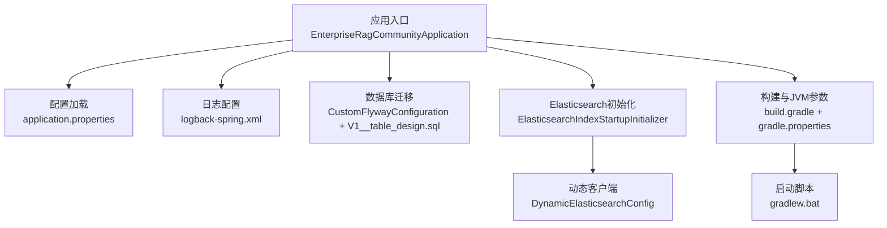
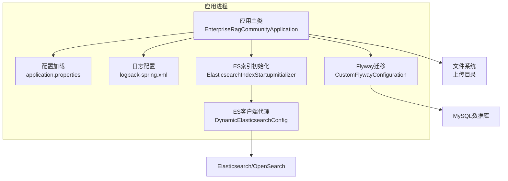
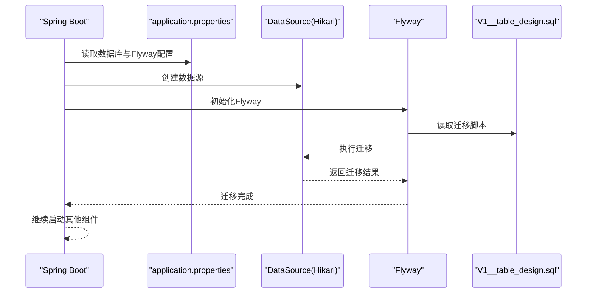
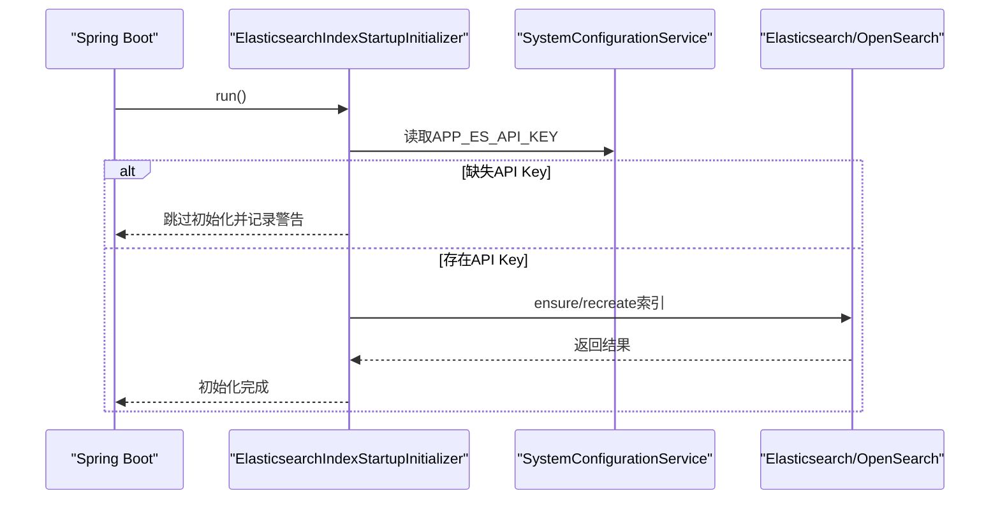
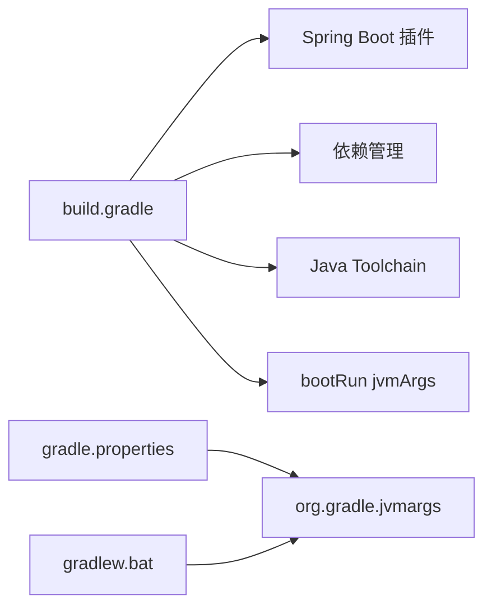

# 系统启动问题

<cite>
**本文引用的文件**
- [application.properties](file://src/main/resources/application.properties)
- [logback-spring.xml](file://src/main/resources/logback-spring.xml)
- [EnterpriseRagCommunityApplication.java](file://src/main/java/com/example/EnterpriseRagCommunity/EnterpriseRagCommunityApplication.java)
- [DynamicElasticsearchConfig.java](file://src/main/java/com/example/EnterpriseRagCommunity/config/DynamicElasticsearchConfig.java)
- [ElasticsearchIndexStartupInitializer.java](file://src/main/java/com/example/EnterpriseRagCommunity/config/ElasticsearchIndexStartupInitializer.java)
- [CustomFlywayConfiguration.java](file://src/main/java/com/example/EnterpriseRagCommunity/config/CustomFlywayConfiguration.java)
- [V1__table_design.sql](file://src/main/resources/db/migration/V1__table_design.sql)
- [gradle.properties](file://gradle.properties)
- [build.gradle](file://build.gradle)
- [gradlew.bat](file://gradlew.bat)
- [LoggingToFileSmokeTest.java](file://src/test/java/com/example/EnterpriseRagCommunity/LoggingToFileSmokeTest.java)
- [SetupController.java](file://src/main/java/com/example/EnterpriseRagCommunity/controller/SetupController.java)
- [SetupControllerTest.java](file://src/test/java/com/example/EnterpriseRagCommunity/SetupControllerTest.java)
</cite>

## 目录
1. [简介](#简介)
2. [项目结构](#项目结构)
3. [核心组件](#核心组件)
4. [架构总览](#架构总览)
5. [详细组件分析](#详细组件分析)
6. [依赖分析](#依赖分析)
7. [性能考虑](#性能考虑)
8. [故障排除指南](#故障排除指南)
9. [结论](#结论)
10. [附录](#附录)

## 简介
本指南聚焦于系统启动阶段的常见问题与排障方法，覆盖应用启动失败、端口占用、内存不足、依赖缺失、配置与JVM参数校验、启动日志分析、数据库连接初始化失败、Elasticsearch索引创建失败、启动脚本调试与环境变量验证等。文档基于实际代码与配置文件进行梳理，提供可操作的定位步骤与可视化流程图。

## 项目结构
该工程采用Spring Boot 3 + Gradle构建，核心启动入口位于应用主类，数据库迁移由Flyway驱动，日志通过Logback配置，Elasticsearch客户端为动态可交换代理以支持运行时配置刷新。关键配置集中在application.properties与gradle.properties中，并通过Gradle任务与JVM参数控制运行行为。

**图表来源**
- [EnterpriseRagCommunityApplication.java:1-64](file://src/main/java/com/example/EnterpriseRagCommunity/EnterpriseRagCommunityApplication.java#L1-L64)
- [application.properties:1-84](file://src/main/resources/application.properties#L1-L84)
- [logback-spring.xml:1-8](file://src/main/resources/logback-spring.xml#L1-L8)
- [CustomFlywayConfiguration.java:1-50](file://src/main/java/com/example/EnterpriseRagCommunity/config/CustomFlywayConfiguration.java#L1-L50)
- [V1__table_design.sql:1-800](file://src/main/resources/db/migration/V1__table_design.sql#L1-L800)
- [ElasticsearchIndexStartupInitializer.java:1-240](file://src/main/java/com/example/EnterpriseRagCommunity/config/ElasticsearchIndexStartupInitializer.java#L1-L240)
- [DynamicElasticsearchConfig.java:1-128](file://src/main/java/com/example/EnterpriseRagCommunity/config/DynamicElasticsearchConfig.java#L1-L128)
- [build.gradle:1-120](file://build.gradle#L1-L120)
- [gradle.properties:1-13](file://gradle.properties#L1-L13)
- [gradlew.bat:1-95](file://gradlew.bat#L1-L95)

**章节来源**
- [EnterpriseRagCommunityApplication.java:1-64](file://src/main/java/com/example/EnterpriseRagCommunity/EnterpriseRagCommunityApplication.java#L1-L64)
- [application.properties:1-84](file://src/main/resources/application.properties#L1-L84)
- [logback-spring.xml:1-8](file://src/main/resources/logback-spring.xml#L1-L8)
- [CustomFlywayConfiguration.java:1-50](file://src/main/java/com/example/EnterpriseRagCommunity/config/CustomFlywayConfiguration.java#L1-L50)
- [V1__table_design.sql:1-800](file://src/main/resources/db/migration/V1__table_design.sql#L1-L800)
- [ElasticsearchIndexStartupInitializer.java:1-240](file://src/main/java/com/example/EnterpriseRagCommunity/config/ElasticsearchIndexStartupInitializer.java#L1-L240)
- [DynamicElasticsearchConfig.java:1-128](file://src/main/java/com/example/EnterpriseRagCommunity/config/DynamicElasticsearchConfig.java#L1-L128)
- [build.gradle:1-120](file://build.gradle#L1-L120)
- [gradle.properties:1-13](file://gradle.properties#L1-L13)
- [gradlew.bat:1-95](file://gradlew.bat#L1-L95)

## 核心组件
- 应用入口与容器
  - 主类负责Spring Boot启动、Servlet初始化器配置与JSP视图解析器注册。
- 配置与环境
  - application.properties集中管理数据库、Flyway、服务器端口、日志、文件上传、OpenSearch/Elasticsearch、应用参数等。
  - gradle.properties提供Gradle JVM参数与工具链版本。
- 数据库迁移
  - CustomFlywayConfiguration自定义Flyway Bean与迁移初始化器，确保迁移修复与执行。
  - V1__table_design.sql定义初始数据库表结构。
- 日志
  - logback-spring.xml声明字符集与基础配置，配合application.properties中的日志属性。
- Elasticsearch
  - DynamicElasticsearchConfig提供可热替换的RestClient代理，支持运行时刷新。
  - ElasticsearchIndexStartupInitializer在应用启动时根据配置创建或确保索引存在。

**章节来源**
- [EnterpriseRagCommunityApplication.java:1-64](file://src/main/java/com/example/EnterpriseRagCommunity/EnterpriseRagCommunityApplication.java#L1-L64)
- [application.properties:1-84](file://src/main/resources/application.properties#L1-L84)
- [logback-spring.xml:1-8](file://src/main/resources/logback-spring.xml#L1-L8)
- [CustomFlywayConfiguration.java:1-50](file://src/main/java/com/example/EnterpriseRagCommunity/config/CustomFlywayConfiguration.java#L1-L50)
- [V1__table_design.sql:1-800](file://src/main/resources/db/migration/V1__table_design.sql#L1-L800)
- [DynamicElasticsearchConfig.java:1-128](file://src/main/java/com/example/EnterpriseRagCommunity/config/DynamicElasticsearchConfig.java#L1-L128)
- [ElasticsearchIndexStartupInitializer.java:1-240](file://src/main/java/com/example/EnterpriseRagCommunity/config/ElasticsearchIndexStartupInitializer.java#L1-L240)

## 架构总览
下图展示Spring Boot启动的关键节点与外部依赖交互，包括数据库、文件系统、Elasticsearch以及日志系统。

**图表来源**
- [EnterpriseRagCommunityApplication.java:1-64](file://src/main/java/com/example/EnterpriseRagCommunity/EnterpriseRagCommunityApplication.java#L1-L64)
- [application.properties:1-84](file://src/main/resources/application.properties#L1-L84)
- [logback-spring.xml:1-8](file://src/main/resources/logback-spring.xml#L1-L8)
- [CustomFlywayConfiguration.java:1-50](file://src/main/java/com/example/EnterpriseRagCommunity/config/CustomFlywayConfiguration.java#L1-L50)
- [ElasticsearchIndexStartupInitializer.java:1-240](file://src/main/java/com/example/EnterpriseRagCommunity/config/ElasticsearchIndexStartupInitializer.java#L1-L240)
- [DynamicElasticsearchConfig.java:1-128](file://src/main/java/com/example/EnterpriseRagCommunity/config/DynamicElasticsearchConfig.java#L1-L128)

## 详细组件分析

### 数据库连接与迁移初始化
- 关键点
  - application.properties中定义了MySQL驱动、URL、账号密码、Hikari连接池参数。
  - CustomFlywayConfiguration显式配置locations、baseline、encoding与failOnMissingLocations等。
  - V1__table_design.sql提供初始表结构，Flyway迁移确保数据库一致性。
- 启动顺序
  - Spring Boot启动后加载配置 → 初始化数据源 → 执行Flyway迁移 → 应用业务启动。

**图表来源**
- [application.properties:7-24](file://src/main/resources/application.properties#L7-L24)
- [CustomFlywayConfiguration.java:17-48](file://src/main/java/com/example/EnterpriseRagCommunity/config/CustomFlywayConfiguration.java#L17-L48)
- [V1__table_design.sql:1-800](file://src/main/resources/db/migration/V1__table_design.sql#L1-L800)

**章节来源**
- [application.properties:7-24](file://src/main/resources/application.properties#L7-L24)
- [CustomFlywayConfiguration.java:1-50](file://src/main/java/com/example/EnterpriseRagCommunity/config/CustomFlywayConfiguration.java#L1-L50)
- [V1__table_design.sql:1-800](file://src/main/resources/db/migration/V1__table_design.sql#L1-L800)

### Elasticsearch索引初始化
- 关键点
  - ElasticsearchIndexStartupInitializer在应用启动时运行，依据系统配置决定是否初始化。
  - 需要有效的API Key，否则跳过初始化。
  - 支持强制重建与按来源类型选择不同索引策略。
- 启动顺序
  - Spring Boot启动 → 加载系统配置 → 尝试获取API Key → 初始化审核样本索引与RAG向量索引。

**图表来源**
- [ElasticsearchIndexStartupInitializer.java:52-69](file://src/main/java/com/example/EnterpriseRagCommunity/config/ElasticsearchIndexStartupInitializer.java#L52-L69)
- [DynamicElasticsearchConfig.java:92-126](file://src/main/java/com/example/EnterpriseRagCommunity/config/DynamicElasticsearchConfig.java#L92-L126)

**章节来源**
- [ElasticsearchIndexStartupInitializer.java:1-240](file://src/main/java/com/example/EnterpriseRagCommunity/config/ElasticsearchIndexStartupInitializer.java#L1-L240)
- [DynamicElasticsearchConfig.java:1-128](file://src/main/java/com/example/EnterpriseRagCommunity/config/DynamicElasticsearchConfig.java#L1-L128)

### 日志与启动日志验证
- 关键点
  - logback-spring.xml声明字符集并继承Spring Boot基础配置。
  - application.properties提供日志文件路径、滚动策略与级别。
  - LoggingToFileSmokeTest验证日志文件写入功能。
- 排障要点
  - 检查日志文件路径是否存在且可写。
  - 确认日志级别与滚动策略满足启动阶段诊断需求。

**章节来源**
- [logback-spring.xml:1-8](file://src/main/resources/logback-spring.xml#L1-L8)
- [application.properties:38-47](file://src/main/resources/application.properties#L38-L47)
- [LoggingToFileSmokeTest.java:1-48](file://src/test/java/com/example/EnterpriseRagCommunity/LoggingToFileSmokeTest.java#L1-L48)

## 依赖分析
- 构建与运行
  - build.gradle定义Spring Boot插件、依赖管理、Java Toolchain与JVM参数注入。
  - gradle.properties提供Gradle JVM参数与工具链版本。
  - gradlew.bat提供Windows启动脚本，包含默认JVM选项与JAVA_HOME校验。
- 启动参数与JVM
  - bootRun任务注入JVM参数，如字符集与native访问开关。
  - gradle.properties中的org.gradle.jvmargs影响整体构建与测试JVM行为。

**图表来源**
- [build.gradle:1-120](file://build.gradle#L1-L120)
- [gradle.properties:1-13](file://gradle.properties#L1-L13)
- [gradlew.bat:38-77](file://gradlew.bat#L38-L77)

**章节来源**
- [build.gradle:1-120](file://build.gradle#L1-L120)
- [gradle.properties:1-13](file://gradle.properties#L1-L13)
- [gradlew.bat:1-95](file://gradlew.bat#L1-L95)

## 性能考虑
- 连接池与超时
  - application.properties中Hikari连接池参数直接影响数据库连接建立与健康度。
- 日志滚动与IO
  - 合理设置日志滚动大小与历史天数，避免启动阶段日志过大影响I/O。
- 端口与并发
  - server.port与Tomcat参数需与部署环境一致，避免端口冲突导致启动失败。

[本节为通用指导，无需特定文件引用]

## 故障排除指南

### 一、应用启动失败
- 常见原因
  - 配置缺失或错误（数据库、ES、日志路径等）。
  - 端口被占用或权限不足。
  - 依赖缺失或版本不兼容。
- 快速检查清单
  - 检查application.properties关键项：数据库URL/凭据、ES认证、日志文件路径、server.port。
  - 检查gradle.properties与build.gradle中的JVM参数与工具链版本。
  - 使用gradlew.bat验证JAVA_HOME与默认JVM选项。
- 诊断步骤
  - 启动时观察控制台输出，定位首个异常堆栈。
  - 若为配置加载失败，优先修正application.properties对应键值。
  - 若为端口冲突，修改server.port或释放占用端口。
  - 若为依赖缺失，确认Gradle依赖与仓库镜像配置。

**章节来源**
- [application.properties:1-84](file://src/main/resources/application.properties#L1-L84)
- [gradle.properties:1-13](file://gradle.properties#L1-L13)
- [build.gradle:1-120](file://build.gradle#L1-L120)
- [gradlew.bat:38-77](file://gradlew.bat#L38-L77)

### 二、端口占用
- 现象
  - 启动时报端口绑定失败或服务未监听预期端口。
- 诊断
  - 使用netstat或系统工具查看server.port对应的端口占用情况。
  - 在application.properties中调整server.port。
- 验证
  - 修改后重启应用，确认端口监听正常。

**章节来源**
- [application.properties:27-31](file://src/main/resources/application.properties#L27-L31)

### 三、内存不足
- 现象
  - 启动过程中OOM或频繁GC。
- 诊断与缓解
  - 检查gradle.properties中的org.gradle.jvmargs与build.gradle中bootRun jvmArgs。
  - 适当提高-Xmx与调整Metaspace大小。
  - 降低测试任务的堆大小或并行度（如测试配置中maxParallelForks）。

**章节来源**
- [gradle.properties:1-13](file://gradle.properties#L1-L13)
- [build.gradle:55-101](file://build.gradle#L55-L101)

### 四、依赖缺失
- 现象
  - 启动时报ClassNotFoundException或NoClassDefFoundError。
- 诊断
  - 确认build.gradle中依赖声明完整，仓库镜像可用。
  - 清理Gradle缓存并重新同步依赖。
- 验证
  - 重新执行构建，确认依赖下载成功。

**章节来源**
- [build.gradle:102-138](file://build.gradle#L102-L138)

### 五、检查应用配置文件
- application.properties关键项
  - 数据库：driver-class-name、url、username、password、Hikari池参数。
  - Flyway：locations、baseline-on-migrate、fail-on-missing-locations等。
  - 服务器：server.port、context-path、Tomcat参数。
  - 日志：log文件路径、滚动策略、级别。
  - 文件上传：multipart与Tomcat相关参数。
  - AI/ES/OpenSearch：超时、认证与平台参数。
- 校验建议
  - 使用最小化配置先行启动，逐步放开非关键项。
  - 对敏感字段（如DB_PASSWORD、APP_ES_API_KEY）通过环境变量注入。

**章节来源**
- [application.properties:1-84](file://src/main/resources/application.properties#L1-L84)

### 六、验证JVM参数设置
- Gradle与启动JVM参数
  - gradle.properties：org.gradle.jvmargs控制构建与测试JVM。
  - build.gradle：bootRun jvmArgs注入启动时JVM参数。
- 校验步骤
  - 启动时观察JVM参数是否生效（如字符集与native访问）。
  - 如需调整，修改相应位置并重新启动。

**章节来源**
- [gradle.properties:1-13](file://gradle.properties#L1-L13)
- [build.gradle:92-101](file://build.gradle#L92-L101)

### 七、排查依赖冲突
- 方法
  - 使用Gradle的依赖解析报告或IDE依赖视图定位冲突。
  - 在build.gradle中对冲突模块进行排除或锁定版本。
- 注意
  - Spring Boot依赖管理插件已统一版本，尽量通过BOM或插件约束。

**章节来源**
- [build.gradle:14-22](file://build.gradle#L14-L22)

### 八、启动日志分析
- 日志配置
  - logback-spring.xml与application.properties共同决定日志输出。
  - LoggingToFileSmokeTest验证日志文件写入能力。
- 分析要点
  - 关注启动阶段的配置加载、数据源初始化、Flyway迁移、ES初始化与业务组件注册。
  - 结合日志级别（如root、ViteManifest、Spring Web）定位问题范围。

**章节来源**
- [logback-spring.xml:1-8](file://src/main/resources/logback-spring.xml#L1-L8)
- [application.properties:38-50](file://src/main/resources/application.properties#L38-L50)
- [LoggingToFileSmokeTest.java:1-48](file://src/test/java/com/example/EnterpriseRagCommunity/LoggingToFileSmokeTest.java#L1-L48)

### 九、数据库连接初始化失败
- 现象
  - 数据源创建失败、连接超时或迁移执行异常。
- 诊断步骤
  - 校验application.properties中的数据库URL、凭据与Hikari参数。
  - 确认MySQL服务可达、网络与防火墙策略。
  - 查看Flyway迁移日志，确认locations与编码设置正确。
- 复现与验证
  - 使用最小配置启动，逐步恢复其他配置项以定位具体问题。

**章节来源**
- [application.properties:7-24](file://src/main/resources/application.properties#L7-L24)
- [CustomFlywayConfiguration.java:17-48](file://src/main/java/com/example/EnterpriseRagCommunity/config/CustomFlywayConfiguration.java#L17-L48)
- [V1__table_design.sql:1-800](file://src/main/resources/db/migration/V1__table_design.sql#L1-L800)

### 十、Elasticsearch索引创建失败
- 现象
  - 启动阶段ES初始化跳过或报错。
- 诊断步骤
  - 确认系统配置中APP_ES_API_KEY已配置。
  - 检查spring.elasticsearch相关参数（连接/套接字超时、用户名/密码）。
  - 查看ElasticsearchIndexStartupInitializer的日志输出，关注失败原因与索引维度配置。
- 复现与验证
  - 通过SetupController或系统配置接口设置API Key并触发初始化。

**章节来源**
- [ElasticsearchIndexStartupInitializer.java:52-69](file://src/main/java/com/example/EnterpriseRagCommunity/config/ElasticsearchIndexStartupInitializer.java#L52-L69)
- [DynamicElasticsearchConfig.java:92-126](file://src/main/java/com/example/EnterpriseRagCommunity/config/DynamicElasticsearchConfig.java#L92-L126)
- [application.properties:72-83](file://src/main/resources/application.properties#L72-L83)

### 十一、启动脚本调试与环境变量验证
- Windows启动脚本
  - gradlew.bat包含JAVA_HOME校验与默认JVM选项，确保环境变量正确。
- 环境变量
  - DB相关：DB_USERNAME、DB_PASSWORD、DB_POOL_*系列。
  - ES相关：SPRING_ELASTICSEARCH_USERNAME、SPRING_ELASTICSEARCH_PASSWORD、APP_ES_API_KEY。
  - 日志与级别：LOG_FILE、LOG_LEVEL_*系列。
  - Flyway：SPRING_FLYWAY_LOCATIONS。
- 验证方法
  - 使用SetupController的.env检测逻辑与测试用例，确认脚本能正确向上查找并读取配置文件。
  - 在启动前打印关键环境变量，确保与application.properties映射一致。

**章节来源**
- [gradlew.bat:38-77](file://gradlew.bat#L38-L77)
- [application.properties:2-83](file://src/main/resources/application.properties#L2-L83)
- [SetupController.java:160-188](file://src/main/java/com/example/EnterpriseRagCommunity/controller/SetupController.java#L160-L188)
- [SetupControllerTest.java:523-643](file://src/test/java/com/example/EnterpriseRagCommunity/SetupControllerTest.java#L523-L643)

## 结论
通过结合配置文件、构建脚本与启动组件的分析，可以系统化地定位与解决启动阶段的各类问题。建议在生产环境中：
- 使用环境变量注入敏感配置；
- 启用合适的日志级别与滚动策略；
- 在CI/CD中加入启动前健康检查；
- 对数据库与ES等外部依赖进行预检与降级策略设计。

[本节为总结性内容，无需特定文件引用]

## 附录

### A. 启动关键节点与错误信号对照
- 配置加载失败：检查application.properties键值与环境变量映射。
- 数据源初始化失败：检查数据库URL/凭据与Hikari参数。
- Flyway迁移失败：检查locations、编码与fail-on-missing-locations。
- ES初始化跳过：检查APP_ES_API_KEY与spring.elasticsearch认证。
- 端口占用：修改server.port或释放端口。
- 内存不足：调整Gradle与bootRun的JVM参数。

**章节来源**
- [application.properties:1-84](file://src/main/resources/application.properties#L1-L84)
- [CustomFlywayConfiguration.java:17-48](file://src/main/java/com/example/EnterpriseRagCommunity/config/CustomFlywayConfiguration.java#L17-L48)
- [ElasticsearchIndexStartupInitializer.java:52-69](file://src/main/java/com/example/EnterpriseRagCommunity/config/ElasticsearchIndexStartupInitializer.java#L52-L69)
- [gradle.properties:1-13](file://gradle.properties#L1-L13)
- [build.gradle:92-101](file://build.gradle#L92-L101)