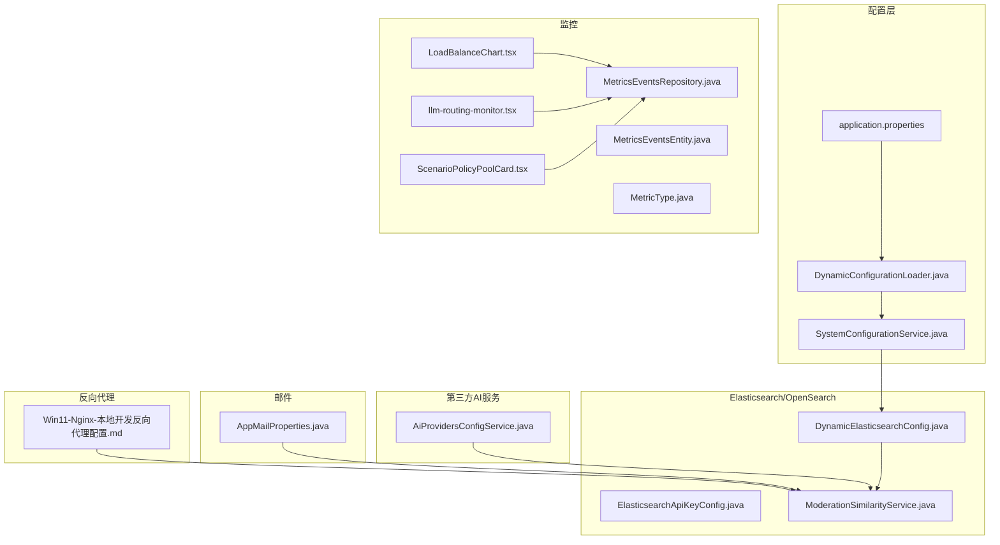
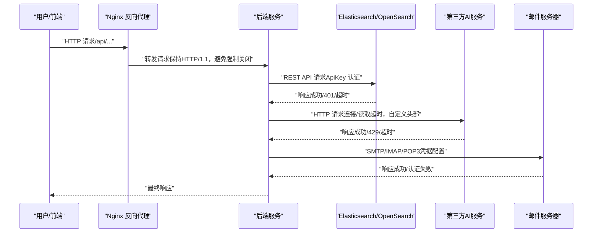
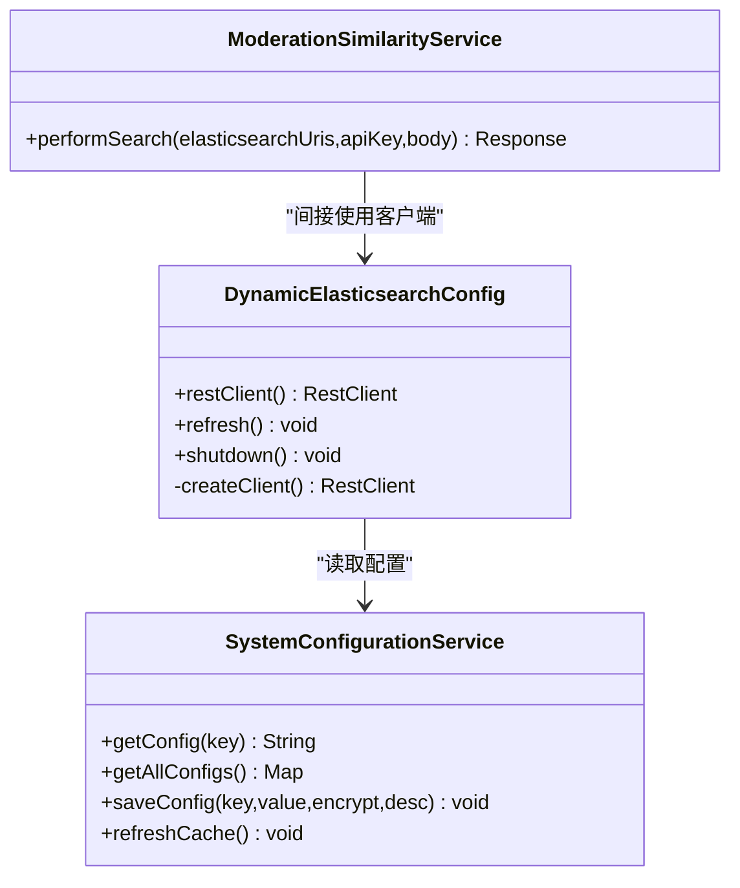
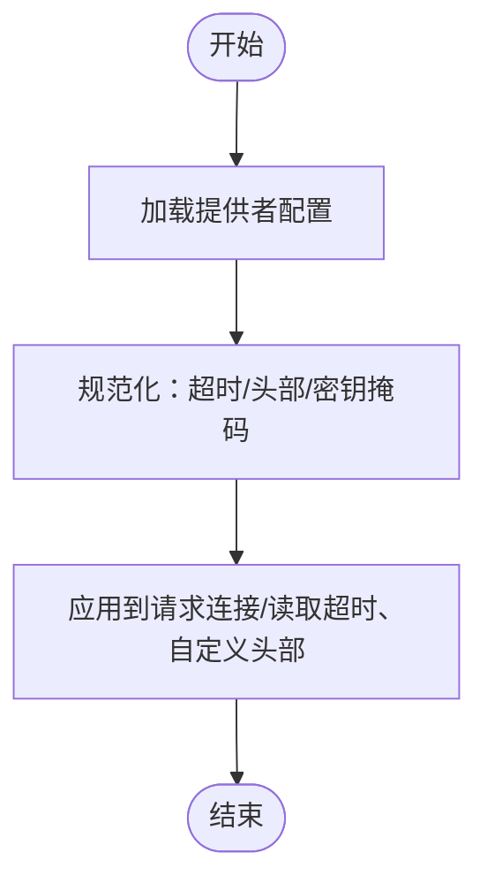
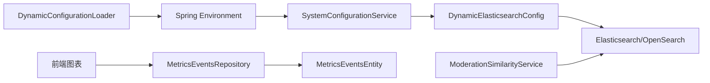
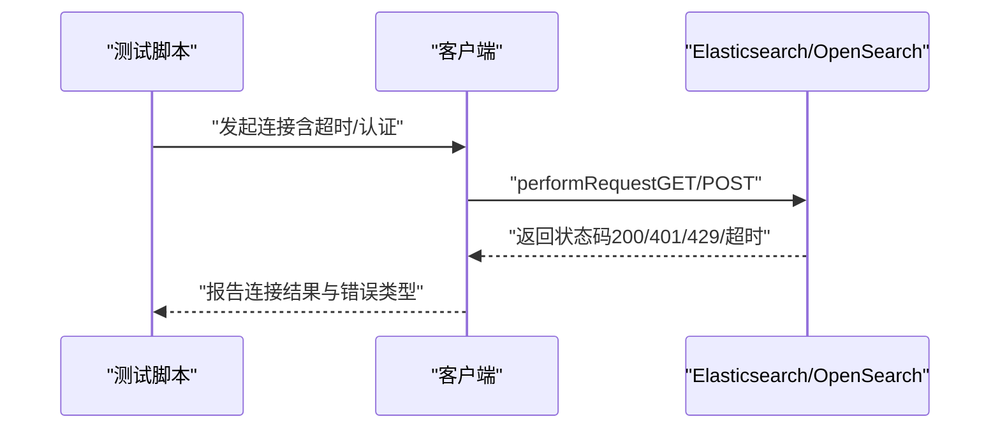

# 网络连接问题

<cite>
**本文引用的文件**   
- [application.properties](file://src/main/resources/application.properties)
- [DynamicElasticsearchConfig.java](file://src/main/java/com/example/EnterpriseRagCommunity/config/DynamicElasticsearchConfig.java)
- [ElasticsearchApiKeyConfig.java](file://src/main/java/com/example/EnterpriseRagCommunity/config/ElasticsearchApiKeyConfig.java)
- [AppMailProperties.java](file://src/main/java/com/example/EnterpriseRagCommunity/config/AppMailProperties.java)
- [SystemConfigurationService.java](file://src/main/java/com/example/EnterpriseRagCommunity/service/config/SystemConfigurationService.java)
- [DynamicConfigurationLoader.java](file://src/main/java/com/example/EnterpriseRagCommunity/config/DynamicConfigurationLoader.java)
- [WebContentFetchService.java](file://src/main/java/com/example/EnterpriseRagCommunity/service/moderation/web/WebContentFetchService.java)
- [ModerationSimilarityService.java](file://src/main/java/com/example/EnterpriseRagCommunity/service/moderation/ModerationSimilarityService.java)
- [SetupControllerTest.java](file://src/test/java/com/example/EnterpriseRagCommunity/controller/SetupControllerTest.java)
- [Win11-Nginx-本地开发反向代理配置.md](file://docs/Win11-Nginx-本地开发反向代理配置.md)
- [LoadBalanceChart.tsx](file://my-vite-app/src/pages/admin/forms/metrics/LoadBalanceChart.tsx)
- [llm-routing-monitor.tsx](file://my-vite-app/src/pages/admin/forms/metrics/llm-routing-monitor.tsx)
- [ScenarioPolicyPoolCard.tsx](file://my-vite-app/src/pages/admin/forms/metrics/ScenarioPolicyPoolCard.tsx)
- [MetricsEventsRepository.java](file://src/main/java/com/example/EnterpriseRagCommunity/repository/monitor/MetricsEventsRepository.java)
- [MetricsEventsEntity.java](file://src/main/java/com/example/EnterpriseRagCommunity/entity/monitor/MetricsEventsEntity.java)
- [MetricType.java](file://src/main/java/com/example/EnterpriseRagCommunity/entity/monitor/enums/MetricType.java)
- [LlmQueueProperties.java](file://src/main/java/com/example/EnterpriseRagCommunity/config/LlmQueueProperties.java)
- [RetrievalRagProperties.java](file://src/main/java/com/example/EnterpriseRagCommunity/config/RetrievalRagProperties.java)
</cite>

## 目录
1. [引言](#引言)
2. [项目结构](#项目结构)
3. [核心组件](#核心组件)
4. [架构总览](#架构总览)
5. [详细组件分析](#详细组件分析)
6. [依赖分析](#依赖分析)
7. [性能考虑](#性能考虑)
8. [故障排除指南](#故障排除指南)
9. [结论](#结论)
10. [附录](#附录)

## 引言
本指南聚焦于企业级应用在连接外部服务时常见的网络异常与排障实践，覆盖外部服务连接失败、DNS 解析问题、SSL 证书验证错误、防火墙阻断等典型场景，并结合本仓库中与 Elasticsearch/OpenSearch、第三方 AI 服务、邮件服务器以及反向代理/Nginx 等实际实现，给出可操作的诊断步骤、工具使用建议与性能指标分析方法。

## 项目结构
围绕网络连接与排障，本项目的关键位置包括：
- 应用配置与动态配置加载：application.properties、DynamicConfigurationLoader、SystemConfigurationService
- Elasticsearch/OpenSearch 连接：DynamicElasticsearchConfig、ElasticsearchApiKeyConfig、ModerationSimilarityService
- 第三方 AI 服务配置：AiProvidersConfigService（与连接超时、头部等配置相关）
- 邮件服务器连接：AppMailProperties
- 反向代理与连通性验证：Win11-Nginx-本地开发反向代理配置.md
- 负载均衡与路由监控：LoadBalanceChart.tsx、llm-routing-monitor.tsx、ScenarioPolicyPoolCard.tsx
- 指标采集与存储：MetricsEventsEntity、MetricsEventsRepository、MetricType

**图示来源**
- [application.properties:66-83](file://src/main/resources/application.properties#L66-L83)
- [DynamicConfigurationLoader.java:24-45](file://src/main/java/com/example/EnterpriseRagCommunity/config/DynamicConfigurationLoader.java#L24-L45)
- [SystemConfigurationService.java:33-61](file://src/main/java/com/example/EnterpriseRagCommunity/service/config/SystemConfigurationService.java#L33-L61)
- [DynamicElasticsearchConfig.java:92-126](file://src/main/java/com/example/EnterpriseRagCommunity/config/DynamicElasticsearchConfig.java#L92-L126)
- [ElasticsearchApiKeyConfig.java:1-15](file://src/main/java/com/example/EnterpriseRagCommunity/config/ElasticsearchApiKeyConfig.java#L1-L15)
- [ModerationSimilarityService.java:202-226](file://src/main/java/com/example/EnterpriseRagCommunity/service/moderation/ModerationSimilarityService.java#L202-L226)
- [AiProvidersConfigService.java:493-558](file://src/main/java/com/example/EnterpriseRagCommunity/service/ai/AiProvidersConfigService.java#L493-L558)
- [AppMailProperties.java:1-16](file://src/main/java/com/example/EnterpriseRagCommunity/config/AppMailProperties.java#L1-L16)
- [Win11-Nginx-本地开发反向代理配置.md:1-127](file://docs/Win11-Nginx-本地开发反向代理配置.md#L1-L127)
- [LoadBalanceChart.tsx:132-203](file://my-vite-app/src/pages/admin/forms/metrics/LoadBalanceChart.tsx#L132-L203)
- [llm-routing-monitor.tsx:385-412](file://my-vite-app/src/pages/admin/forms/metrics/llm-routing-monitor.tsx#L385-L412)
- [ScenarioPolicyPoolCard.tsx:219-231](file://my-vite-app/src/pages/admin/forms/metrics/ScenarioPolicyPoolCard.tsx#L219-L231)
- [MetricsEventsEntity.java:1-35](file://src/main/java/com/example/EnterpriseRagCommunity/entity/monitor/MetricsEventsEntity.java#L1-L35)
- [MetricsEventsRepository.java:1-36](file://src/main/java/com/example/EnterpriseRagCommunity/repository/monitor/MetricsEventsRepository.java#L1-L36)
- [MetricType.java:1-7](file://src/main/java/com/example/EnterpriseRagCommunity/entity/monitor/enums/MetricType.java#L1-L7)

**章节来源**
- [application.properties:66-83](file://src/main/resources/application.properties#L66-L83)
- [DynamicConfigurationLoader.java:24-45](file://src/main/java/com/example/EnterpriseRagCommunity/config/DynamicConfigurationLoader.java#L24-L45)
- [SystemConfigurationService.java:33-61](file://src/main/java/com/example/EnterpriseRagCommunity/service/config/SystemConfigurationService.java#L33-L61)
- [DynamicElasticsearchConfig.java:92-126](file://src/main/java/com/example/EnterpriseRagCommunity/config/DynamicElasticsearchConfig.java#L92-L126)
- [ElasticsearchApiKeyConfig.java:1-15](file://src/main/java/com/example/EnterpriseRagCommunity/config/ElasticsearchApiKeyConfig.java#L1-L15)
- [ModerationSimilarityService.java:202-226](file://src/main/java/com/example/EnterpriseRagCommunity/service/moderation/ModerationSimilarityService.java#L202-L226)
- [AiProvidersConfigService.java:493-558](file://src/main/java/com/example/EnterpriseRagCommunity/service/ai/AiProvidersConfigService.java#L493-L558)
- [AppMailProperties.java:1-16](file://src/main/java/com/example/EnterpriseRagCommunity/config/AppMailProperties.java#L1-L16)
- [Win11-Nginx-本地开发反向代理配置.md:1-127](file://docs/Win11-Nginx-本地开发反向代理配置.md#L1-L127)
- [LoadBalanceChart.tsx:132-203](file://my-vite-app/src/pages/admin/forms/metrics/LoadBalanceChart.tsx#L132-L203)
- [llm-routing-monitor.tsx:385-412](file://my-vite-app/src/pages/admin/forms/metrics/llm-routing-monitor.tsx#L385-L412)
- [ScenarioPolicyPoolCard.tsx:219-231](file://my-vite-app/src/pages/admin/forms/metrics/ScenarioPolicyPoolCard.tsx#L219-L231)
- [MetricsEventsEntity.java:1-35](file://src/main/java/com/example/EnterpriseRagCommunity/entity/monitor/MetricsEventsEntity.java#L1-L35)
- [MetricsEventsRepository.java:1-36](file://src/main/java/com/example/EnterpriseRagCommunity/repository/monitor/MetricsEventsRepository.java#L1-L36)
- [MetricType.java:1-7](file://src/main/java/com/example/EnterpriseRagCommunity/entity/monitor/enums/MetricType.java#L1-L7)

## 核心组件
- 动态配置加载与缓存：通过数据库系统配置动态注入 Spring 环境，支持运行时刷新，降低重启成本。
- Elasticsearch/OpenSearch 客户端：基于 Apache HttpClient 构建 RestClient，支持 API Key 认证与热切换，便于在配置变更后无缝重建连接。
- 第三方 AI 服务：提供连接超时、读取超时、额外请求头等配置项的标准化处理，便于统一管理与排障。
- 邮件服务器：通过配置前缀集中管理用户名、密码、发件地址与名称，便于快速定位凭据问题。
- 反向代理与连通性：提供 Nginx 示例配置与 curl 快速验证命令，帮助排查代理层 502、超时与路径映射问题。
- 负载均衡与路由监控：前端图表聚合 QPS、平均响应时间、P95、错误率与限流率，辅助定位路由策略与后端瓶颈。

**章节来源**
- [DynamicConfigurationLoader.java:24-45](file://src/main/java/com/example/EnterpriseRagCommunity/config/DynamicConfigurationLoader.java#L24-L45)
- [SystemConfigurationService.java:33-61](file://src/main/java/com/example/EnterpriseRagCommunity/service/config/SystemConfigurationService.java#L33-L61)
- [DynamicElasticsearchConfig.java:92-126](file://src/main/java/com/example/EnterpriseRagCommunity/config/DynamicElasticsearchConfig.java#L92-L126)
- [AiProvidersConfigService.java:493-558](file://src/main/java/com/example/EnterpriseRagCommunity/service/ai/AiProvidersConfigService.java#L493-L558)
- [AppMailProperties.java:1-16](file://src/main/java/com/example/EnterpriseRagCommunity/config/AppMailProperties.java#L1-L16)
- [Win11-Nginx-本地开发反向代理配置.md:1-127](file://docs/Win11-Nginx-本地开发反向代理配置.md#L1-L127)
- [LoadBalanceChart.tsx:132-203](file://my-vite-app/src/pages/admin/forms/metrics/LoadBalanceChart.tsx#L132-L203)

## 架构总览
下图展示从客户端到后端服务、再到外部依赖（Elasticsearch/OpenSearch、第三方 AI、邮件服务器）的典型调用链路与关键决策点（认证、超时、代理）。

**图示来源**
- [Win11-Nginx-本地开发反向代理配置.md:43-89](file://docs/Win11-Nginx-本地开发反向代理配置.md#L43-L89)
- [DynamicElasticsearchConfig.java:113-125](file://src/main/java/com/example/EnterpriseRagCommunity/config/DynamicElasticsearchConfig.java#L113-L125)
- [ModerationSimilarityService.java:202-226](file://src/main/java/com/example/EnterpriseRagCommunity/service/moderation/ModerationSimilarityService.java#L202-L226)
- [AiProvidersConfigService.java:493-558](file://src/main/java/com/example/EnterpriseRagCommunity/service/ai/AiProvidersConfigService.java#L493-L558)
- [AppMailProperties.java:1-16](file://src/main/java/com/example/EnterpriseRagCommunity/config/AppMailProperties.java#L1-L16)

## 详细组件分析

### Elasticsearch/OpenSearch 连接组件
- 动态客户端：支持从数据库系统配置动态读取节点列表与 API Key；当配置变更时，通过代理热切换实现平滑刷新。
- 客户端构建：解析逗号分隔的多节点 URI，自动补全 scheme，默认回退到本地 http://localhost:9200；若未配置 API Key，则记录警告并执行未认证请求。
- 直连查询：在相似度检索中直接使用 HttpURLConnection 发送 POST 请求，设置连接/读取超时与 ApiKey 头，便于独立验证连接与认证。

**图示来源**
- [DynamicElasticsearchConfig.java:33-126](file://src/main/java/com/example/EnterpriseRagCommunity/config/DynamicElasticsearchConfig.java#L33-L126)
- [SystemConfigurationService.java:63-94](file://src/main/java/com/example/EnterpriseRagCommunity/service/config/SystemConfigurationService.java#L63-L94)
- [ModerationSimilarityService.java:202-226](file://src/main/java/com/example/EnterpriseRagCommunity/service/moderation/ModerationSimilarityService.java#L202-L226)

**章节来源**
- [DynamicElasticsearchConfig.java:92-126](file://src/main/java/com/example/EnterpriseRagCommunity/config/DynamicElasticsearchConfig.java#L92-L126)
- [SystemConfigurationService.java:63-94](file://src/main/java/com/example/EnterpriseRagCommunity/service/config/SystemConfigurationService.java#L63-L94)
- [ModerationSimilarityService.java:202-226](file://src/main/java/com/example/EnterpriseRagCommunity/service/moderation/ModerationSimilarityService.java#L202-L226)

### 第三方 AI 服务连接组件
- 配置规范化：对连接超时、读取超时、额外头部进行归一化处理，空值或非正值将被忽略，敏感字段（如 API Key）会被掩码输出，便于安全审计。
- 超时与头部：支持按提供商标配连接/读取超时与自定义请求头，便于针对不同供应商优化网络行为。

**图示来源**
- [AiProvidersConfigService.java:493-558](file://src/main/java/com/example/EnterpriseRagCommunity/service/ai/AiProvidersConfigService.java#L493-L558)

**章节来源**
- [AiProvidersConfigService.java:493-558](file://src/main/java/com/example/EnterpriseRagCommunity/service/ai/AiProvidersConfigService.java#L493-L558)

### 邮件服务器连接组件
- 集中式配置：通过配置前缀集中管理用户名、密码、发件地址与显示名，便于在统一界面或配置中心修改与校验。
- 排障要点：优先确认凭据正确性、端口可达性、TLS/STARTTLS 设置与防火墙策略。

**章节来源**
- [AppMailProperties.java:1-16](file://src/main/java/com/example/EnterpriseRagCommunity/config/AppMailProperties.java#L1-L16)

### 反向代理与连通性验证
- Nginx 示例：提供 upstream keepalive、HTTP/1.1、超时与缓冲相关参数配置，缓解本地大文件上传场景下的连接失败（502）。
- 快速验证：通过 curl 访问 Nginx 入口与后端 API、上传路径，快速判断代理层是否正常工作。

**章节来源**
- [Win11-Nginx-本地开发反向代理配置.md:23-90](file://docs/Win11-Nginx-本地开发反向代理配置.md#L23-L90)
- [Win11-Nginx-本地开发反向代理配置.md:116-127](file://docs/Win11-Nginx-本地开发反向代理配置.md#L116-L127)

### 负载均衡与路由监控
- 指标聚合：前端图表支持 QPS、平均响应时间、P95、错误率、429 限流率等指标计算与排序，辅助识别慢节点与异常波动。
- 路由策略：提供权重轮询与优先级回退两种策略选项，便于在故障时快速切换。

**章节来源**
- [LoadBalanceChart.tsx:132-203](file://my-vite-app/src/pages/admin/forms/metrics/LoadBalanceChart.tsx#L132-L203)
- [llm-routing-monitor.tsx:385-412](file://my-vite-app/src/pages/admin/forms/metrics/llm-routing-monitor.tsx#L385-L412)
- [ScenarioPolicyPoolCard.tsx:219-231](file://my-vite-app/src/pages/admin/forms/metrics/ScenarioPolicyPoolCard.tsx#L219-L231)

## 依赖分析
- 配置依赖：DynamicConfigurationLoader 将数据库系统配置注入 Spring 环境，SystemConfigurationService 提供缓存与加解密能力，DynamicElasticsearchConfig 依赖其读取节点与认证信息。
- 客户端依赖：ModerationSimilarityService 在需要时直接使用 HttpURLConnection，绕过 Rest Client 以独立验证连接与认证。
- 监控依赖：前端图表依赖后端指标数据，后端指标实体与仓库负责指标的持久化与查询。

**图示来源**
- [DynamicConfigurationLoader.java:24-45](file://src/main/java/com/example/EnterpriseRagCommunity/config/DynamicConfigurationLoader.java#L24-L45)
- [SystemConfigurationService.java:33-61](file://src/main/java/com/example/EnterpriseRagCommunity/service/config/SystemConfigurationService.java#L33-L61)
- [DynamicElasticsearchConfig.java:92-126](file://src/main/java/com/example/EnterpriseRagCommunity/config/DynamicElasticsearchConfig.java#L92-L126)
- [ModerationSimilarityService.java:202-226](file://src/main/java/com/example/EnterpriseRagCommunity/service/moderation/ModerationSimilarityService.java#L202-L226)
- [MetricsEventsRepository.java:1-36](file://src/main/java/com/example/EnterpriseRagCommunity/repository/monitor/MetricsEventsRepository.java#L1-L36)
- [MetricsEventsEntity.java:1-35](file://src/main/java/com/example/EnterpriseRagCommunity/entity/monitor/MetricsEventsEntity.java#L1-L35)

**章节来源**
- [DynamicConfigurationLoader.java:24-45](file://src/main/java/com/example/EnterpriseRagCommunity/config/DynamicConfigurationLoader.java#L24-L45)
- [SystemConfigurationService.java:33-61](file://src/main/java/com/example/EnterpriseRagCommunity/service/config/SystemConfigurationService.java#L33-L61)
- [DynamicElasticsearchConfig.java:92-126](file://src/main/java/com/example/EnterpriseRagCommunity/config/DynamicElasticsearchConfig.java#L92-L126)
- [ModerationSimilarityService.java:202-226](file://src/main/java/com/example/EnterpriseRagCommunity/service/moderation/ModerationSimilarityService.java#L202-L226)
- [MetricsEventsRepository.java:1-36](file://src/main/java/com/example/EnterpriseRagCommunity/repository/monitor/MetricsEventsRepository.java#L1-L36)
- [MetricsEventsEntity.java:1-35](file://src/main/java/com/example/EnterpriseRagCommunity/entity/monitor/MetricsEventsEntity.java#L1-L35)

## 性能考虑
- 连接与超时：合理设置连接超时与读取超时，避免长时间占用线程；在高并发场景下控制队列长度与并发数。
- 代理与缓冲：启用 HTTP/1.1、保持长连接、关闭代理缓冲可能有助于降低首字节延迟与内存峰值。
- 指标监控：利用 QPS、P95、错误率与限流率等指标，结合路由策略与负载均衡，持续优化吞吐与稳定性。

**章节来源**
- [application.properties:68-76](file://src/main/resources/application.properties#L68-L76)
- [Win11-Nginx-本地开发反向代理配置.md:38-89](file://docs/Win11-Nginx-本地开发反向代理配置.md#L38-L89)
- [LoadBalanceChart.tsx:132-203](file://my-vite-app/src/pages/admin/forms/metrics/LoadBalanceChart.tsx#L132-L203)
- [LlmQueueProperties.java:1-16](file://src/main/java/com/example/EnterpriseRagCommunity/config/LlmQueueProperties.java#L1-L16)

## 故障排除指南

### 通用排障流程
- 明确异常类型：连接失败、DNS 解析失败、SSL 证书错误、防火墙阻断、超时、认证失败、限流。
- 分层定位：浏览器/客户端 → 反向代理 → 应用服务 → 外部依赖（ES/OpenSearch、AI、邮件）。
- 逐步缩小范围：先验证连通性，再检查认证与超时，最后分析性能与策略。

### 外部服务连接失败
- 使用 curl/浏览器访问目标服务，确认是否可直连。
- 若经 Nginx 访问出现 502，检查代理超时、缓冲与 keepalive 设置。
- 对于 Elasticsearch/OpenSearch，确认节点 URI、协议与端口是否正确，必要时使用直连方式验证。

**章节来源**
- [Win11-Nginx-本地开发反向代理配置.md:19-21](file://docs/Win11-Nginx-本地开发反向代理配置.md#L19-L21)
- [Win11-Nginx-本地开发反向代理配置.md:116-127](file://docs/Win11-Nginx-本地开发反向代理配置.md#L116-L127)
- [ModerationSimilarityService.java:202-226](file://src/main/java/com/example/EnterpriseRagCommunity/service/moderation/ModerationSimilarityService.java#L202-L226)

### DNS 解析问题
- 使用 nslookup/dig/ping 验证域名解析结果与 TTL。
- 若解析失败，检查本地 DNS、公司 DNS 或上游 DNS；对于私有域名，确认内部解析策略。
- Web 抓取场景中，若解析到私网 IP，系统会判定为私网地址并拒绝，需调整目标或网络策略。

**章节来源**
- [WebContentFetchService.java:229-242](file://src/main/java/com/example/EnterpriseRagCommunity/service/moderation/web/WebContentFetchService.java#L229-L242)

### SSL 证书验证错误
- 使用 openssl s_client 验证证书链与有效期。
- 若为自签证书或中间证书缺失，需完善证书链或在受信 CA 列表中添加。
- 对于开发环境，可临时放宽校验（仅限测试），生产环境务必使用有效证书。

### 防火墙阻断
- 使用 telnet/traceroute/nc 验证端口连通性与路径跳数。
- 确认出站/入站策略、安全组规则与 WAF 规则是否放行目标端口。
- 对于 CDN/负载均衡器，检查健康检查与转发规则。

### Elasticsearch/OpenSearch 集群连接
- 检查节点 URI 列表与协议（http/https），确保端口开放。
- 若使用 API Key，确认 Key 是否存在且未过期；未配置时客户端将以未认证方式请求。
- 使用内置测试接口验证连接与认证状态，必要时切换到直连方式排查。

**图示来源**
- [SetupControllerTest.java:268-274](file://src/test/java/com/example/EnterpriseRagCommunity/controller/SetupControllerTest.java#L268-L274)
- [DynamicElasticsearchConfig.java:113-125](file://src/main/java/com/example/EnterpriseRagCommunity/config/DynamicElasticsearchConfig.java#L113-L125)
- [ModerationSimilarityService.java:202-226](file://src/main/java/com/example/EnterpriseRagCommunity/service/moderation/ModerationSimilarityService.java#L202-L226)

**章节来源**
- [application.properties:72-82](file://src/main/resources/application.properties#L72-L82)
- [DynamicElasticsearchConfig.java:92-126](file://src/main/java/com/example/EnterpriseRagCommunity/config/DynamicElasticsearchConfig.java#L92-L126)
- [SetupControllerTest.java:268-274](file://src/test/java/com/example/EnterpriseRagCommunity/controller/SetupControllerTest.java#L268-L274)

### 第三方 AI 服务 API 调用
- 核对提供商标识、基础 URL、API Key 与自定义头部。
- 检查连接/读取超时设置，避免因网络抖动导致误判。
- 关注限流与配额，结合前端图表观察 429 比例与趋势。

**章节来源**
- [AiProvidersConfigService.java:493-558](file://src/main/java/com/example/EnterpriseRagCommunity/service/ai/AiProvidersConfigService.java#L493-L558)
- [LoadBalanceChart.tsx:132-203](file://my-vite-app/src/pages/admin/forms/metrics/LoadBalanceChart.tsx#L132-L203)

### 邮件服务器连接
- 校验用户名/密码、发件地址与显示名配置。
- 确认端口与加密方式（TLS/STARTTLS），检查防火墙与安全组策略。
- 使用 SMTP/IMAP/POP3 工具单独测试认证与收发功能。

**章节来源**
- [AppMailProperties.java:1-16](file://src/main/java/com/example/EnterpriseRagCommunity/config/AppMailProperties.java#L1-L16)

### 网络连通性测试工具
- ping：检测主机可达性与基本延迟。
- traceroute/tcptrace：追踪路径与定位丢包节点。
- telnet：验证端口连通性（注意部分环境禁用）。
- curl：验证 HTTP/HTTPS 接口与证书链，支持设置超时与头部。

**章节来源**
- [Win11-Nginx-本地开发反向代理配置.md:116-127](file://docs/Win11-Nginx-本地开发反向代理配置.md#L116-L127)

### 网络性能指标分析
- 延迟：关注 P95 响应时间，识别异常波动与慢节点。
- 丢包率：结合 traceroute 结果定位链路问题。
- 带宽利用率：结合代理与后端日志，评估并发与缓冲设置影响。
- 错误率与限流：429 比例过高提示上游限流或路由策略不当。

**章节来源**
- [LoadBalanceChart.tsx:132-203](file://my-vite-app/src/pages/admin/forms/metrics/LoadBalanceChart.tsx#L132-L203)
- [llm-routing-monitor.tsx:385-412](file://my-vite-app/src/pages/admin/forms/metrics/llm-routing-monitor.tsx#L385-L412)

### 代理配置、负载均衡器故障、CDN 问题
- 代理层：检查 Nginx 超时、缓冲、HTTP/1.1 与 keepalive 设置；使用 curl 验证路径映射与返回码。
- 负载均衡器：确认健康检查、权重与回退策略；结合前端图表识别慢实例。
- CDN：检查缓存命中率、边缘节点状态与回源路径。

**章节来源**
- [Win11-Nginx-本地开发反向代理配置.md:23-90](file://docs/Win11-Nginx-本地开发反向代理配置.md#L23-L90)
- [ScenarioPolicyPoolCard.tsx:219-231](file://my-vite-app/src/pages/admin/forms/metrics/ScenarioPolicyPoolCard.tsx#L219-L231)
- [LoadBalanceChart.tsx:132-203](file://my-vite-app/src/pages/admin/forms/metrics/LoadBalanceChart.tsx#L132-L203)

## 结论
通过动态配置、代理优化与指标监控，本项目在面对复杂的外部网络环境时具备较强的可诊断性与可维护性。建议在日常运维中坚持“先连通、后认证、再性能”的排障顺序，并结合前端图表与后端日志形成闭环，持续提升系统稳定性与用户体验。

## 附录
- 关键配置项参考
  - Elasticsearch/OpenSearch：节点 URI、认证方式、连接/读取超时
  - 第三方 AI：提供者基础 URL、API Key、连接/读取超时、自定义头部
  - 邮件：用户名、密码、发件地址、显示名
  - Nginx：HTTP/1.1、keepalive、超时与缓冲参数

**章节来源**
- [application.properties:68-82](file://src/main/resources/application.properties#L68-L82)
- [AiProvidersConfigService.java:493-558](file://src/main/java/com/example/EnterpriseRagCommunity/service/ai/AiProvidersConfigService.java#L493-L558)
- [AppMailProperties.java:1-16](file://src/main/java/com/example/EnterpriseRagCommunity/config/AppMailProperties.java#L1-L16)
- [Win11-Nginx-本地开发反向代理配置.md:23-90](file://docs/Win11-Nginx-本地开发反向代理配置.md#L23-L90)