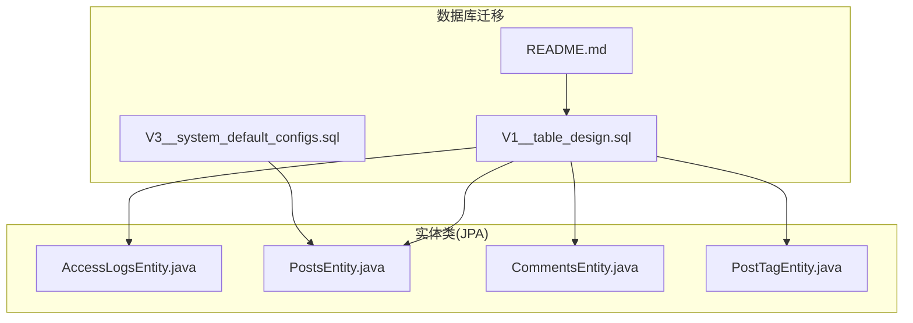
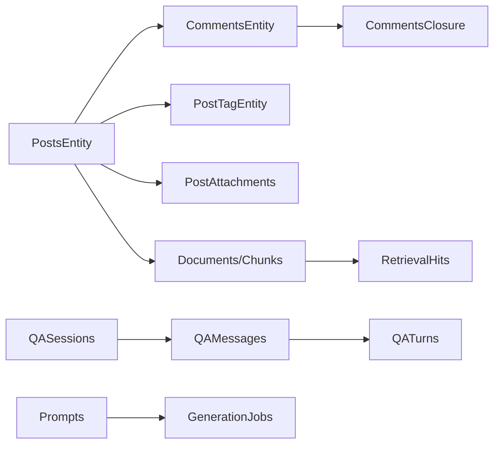

# 数据模型

<cite>
**本文引用的文件**
- [V1__table_design.sql](file://src/main/resources/db/migration/V1__table_design.sql)
- [README.md](file://src/main/resources/db/migration/README.md)
- [V3__system_default_configs.sql](file://src/main/resources/db/migration/V3__system_default_configs.sql)
- [AccessLogsEntity.java](file://src/main/java/com/example/EnterpriseRagCommunity/entity/access/AccessLogsEntity.java)
- [PostsEntity.java](file://src/main/java/com/example/EnterpriseRagCommunity/entity/content/PostsEntity.java)
- [CommentsEntity.java](file://src/main/java/com/example/EnterpriseRagCommunity/entity/content/CommentsEntity.java)
- [PostTagEntity.java](file://src/main/java/com/example/EnterpriseRagCommunity/entity/content/PostTagEntity.java)
</cite>

## 目录
1. [引言](#引言)
2. [项目结构](#项目结构)
3. [核心组件](#核心组件)
4. [架构总览](#架构总览)
5. [详细组件分析](#详细组件分析)
6. [依赖分析](#依赖分析)
7. [性能考量](#性能考量)
8. [故障排查指南](#故障排查指南)
9. [结论](#结论)
10. [附录](#附录)

## 引言
本文件为企业级RAG社区平台的数据模型文档，聚焦于数据库表结构、实体类映射、实体关系、索引与约束、以及数据访问层的设计思路与优化策略。文档基于实际迁移脚本与实体类源码进行梳理，帮助开发者与运维人员快速理解平台的数据骨架与演进历史。

## 项目结构
- 数据库迁移脚本采用 Flyway 版本化管理，包含表设计、系统默认配置、LLM配置、价格配置等。
- 实体类采用 JPA 注解映射至数据库表，体现领域模型与持久化契约。
- 本节为概览性说明，不直接分析具体文件，故不附“章节来源”。

## 核心组件
本节概述关键实体及其在数据库中的表结构与字段含义，结合迁移脚本与实体类注释进行说明。

- 租户与用户
  - 租户表 tenants：多租户支持，主键自增，租户编码唯一。
  - 用户表 users：邮箱与用户名在租户维度唯一，支持状态、会话失效时间、权限版本号等。
- 权限与角色
  - 角色表 roles：内置/不可变角色，带风险等级。
  - 用户-角色关联 user_role_links：支持全局/租户/板块作用域、有效期。
  - 权限表 permissions 与角色-权限矩阵 role_permissions：细粒度权限控制。
- 认证与会话
  - 登录会话 auth_sessions、邮箱验证 email_verifications、密码重置 tokens、TOTP 密钥 totp_secrets、登录尝试日志 login_attempts。
- 内容与组织
  - 板块 boards、帖子 posts、帖子版本 post_versions、文件资产 file_assets、附件 post_attachments。
  - 评论 comments 与评论闭包表 comments_closure（邻接表+闭包表组合，支持多层回复与高效子树查询）。
  - 互动 reactions、举报 reports、标签 tags 与帖子-标签关联 post_tags。
  - 热度分缓存 hot_scores。
- 语义与RAG
  - 文档 documents、文档分片 document_chunks、向量索引元信息 vector_indices。
  - 提示词 prompts、生成任务 generation_jobs、问答会话 qa_sessions、检索事件 retrieval_events、命中明细 retrieval_hits、上下文窗口 context_windows。
  - QA消息 qa_messages、问答轮次 qa_turns、答案引用 answer_citations。
- 审核流水线
  - 审核规则 moderation_rules、规则命中 moderation_rule_hits、相似度命中 moderation_similar_hits、审核队列 moderation_queue、审核动作 moderation_actions、风险标签 risk_labeling。
- 评估与监控
  - 指标事件 metrics_events、RAG评测 runs/samples/results、成本明细 cost_records、审核效率 review_efficiency、搜索日志 search_logs、系统事件 system_events。
- 通用辅助
  - 站内通知 notifications、用户设置 user_settings、帖子草稿 post_drafts、每日浏览量 post_views_daily。

**章节来源**
- [V1__table_design.sql:1-800](file://src/main/resources/db/migration/V1__table_design.sql#L1-L800)
- [AccessLogsEntity.java:1-92](file://src/main/java/com/example/EnterpriseRagCommunity/entity/access/AccessLogsEntity.java#L1-L92)
- [PostsEntity.java:1-75](file://src/main/java/com/example/EnterpriseRagCommunity/entity/content/PostsEntity.java#L1-L75)
- [CommentsEntity.java:1-52](file://src/main/java/com/example/EnterpriseRagCommunity/entity/content/CommentsEntity.java#L1-L52)
- [PostTagEntity.java:1-53](file://src/main/java/com/example/EnterpriseRagCommunity/entity/content/PostTagEntity.java#L1-L53)

## 架构总览
下图展示核心实体间的关联关系，涵盖一对一、一对多与多对多映射，并标注外键与索引要点。

```mermaid
erDiagram
TENANTS ||--o{ USERS : "租户-用户"
USERS ||--o{ AUTH_SESSIONS : "用户-会话"
USERS ||--o{ EMAIL_VERIFICATIONS : "用户-验证码"
USERS ||--o{ PASSWORD_RESET_TOKENS : "用户-重置令牌"
USERS ||--o{ TOTP_SECRETS : "用户-TOTP密钥"
USERS ||--o{ LOGIN_ATTEMPTS : "用户-登录尝试"
USERS ||--o{ AUDIT_LOGS : "用户-审计日志"
USERS ||--o{ POSTS : "作者-帖子"
USERS ||--o{ COMMENTS : "作者-评论"
USERS ||--o{ REACTIONS : "用户-互动"
USERS ||--o{ REPORTS : "举报人-举报"
USERS ||--o{ QA_MESSAGES : "用户-消息"
USERS ||--o{ QA_TURNS : "用户-轮次"
USERS ||--o{ NOTIFICATIONS : "用户-通知"
USERS ||--o{ USER_SETTINGS : "用户-设置"
BOARDS ||--o{ POSTS : "板块-帖子"
POSTS ||--o{ POST_VERSIONS : "帖子-版本"
POSTS ||--o{ POST_ATTACHMENTS : "帖子-附件"
POSTS ||--o{ COMMENTS : "帖子-评论"
POSTS ||--o{ POST_TAGS : "帖子-标签"
POSTS ||--|| HOT_SCORES : "帖子-热度分"
POSTS ||--o{ QA_TURNS : "帖子-轮次"
POSTS ||--o{ RETRIEVAL_HITS : "帖子-命中"
FILE_ASSETS ||--o{ POST_ATTACHMENTS : "文件-附件"
COMMENTS ||--o{ COMMENTS : "评论-子评论(邻接表)"
COMMENTS ||--|| COMMENTS_CLOSURE : "评论-闭包"
COMMENTS ||--o{ REACTIONS : "评论-互动"
COMMENTS ||--o{ REPORTS : "评论-举报"
COMMENTS ||--o{ QA_MESSAGES : "评论-消息"
TAGS ||--o{ POST_TAGS : "标签-帖子"
TAGS ||--o{ RISK_LABELING : "标签-风险"
DOCUMENTS ||--o{ DOCUMENT_CHUNKS : "文档-分片"
DOCUMENTS ||--o{ ANSWER_CITATIONS : "文档-引用"
DOCUMENTS ||--o{ RETRIEVAL_HITS : "文档-命中"
PROMPTS ||--o{ GENERATION_JOBS : "提示词-任务"
QA_SESSIONS ||--o{ QA_MESSAGES : "会话-消息"
QA_SESSIONS ||--o{ RETRIEVAL_EVENTS : "会话-检索事件"
QA_SESSIONS ||--o{ QA_TURNS : "会话-轮次"
RETRIEVAL_EVENTS ||--o{ RETRIEVAL_HITS : "事件-命中"
CONTEXT_WINDOWS ||--o{ QA_TURNS : "上下文-轮次"
MODERATION_RULES ||--o{ MODERATION_RULE_HITS : "规则-命中"
MODERATION_RULES ||--o{ MODERATION_QUEUE : "规则-队列"
MODERATION_SAMPLES ||--o{ MODERATION_SIMILAR_HITS : "样本-相似命中"
MODERATION_QUEUE ||--o{ MODERATION_ACTIONS : "队列-动作"
MODERATION_QUEUE ||--o{ RISK_LABELING : "队列-风险标签"
```

**图表来源**
- [V1__table_design.sql:1-800](file://src/main/resources/db/migration/V1__table_design.sql#L1-L800)

**章节来源**
- [V1__table_design.sql:1-800](file://src/main/resources/db/migration/V1__table_design.sql#L1-L800)

## 详细组件分析

### 实体类与表结构映射
- 访问日志 AccessLogsEntity
  - 映射表 access_logs，字段覆盖请求方法、路径、状态码、客户端/服务端信息、追踪ID、UA、Referer、详情JSON、时间戳与归档时间。
  - 适合审计与埋点分析，建议配合查询索引与归档策略。
- 帖子 PostsEntity
  - 映射 posts，字段包含作者、板块、标题、内容、格式、状态、发布时间、软删除标记、元数据JSON、时间戳等。
  - 关联：作者(users)、板块(boards)、版本(post_versions)、附件(post_attachments)、评论(comments)、标签(post_tags)、热度(hot_scores)。
- 评论 CommentsEntity
  - 映射 comments，支持邻接表父子关系、作者(users)、帖子(posts)、互动(reactions)、举报(reports)、QA消息(qa_messages)。
  - 评论闭包表 comments_closure 支持多层回复的高效查询。
- 帖子-标签关联 PostTagEntity
  - 复合主键 (post_id, tag_id, source)，记录来源与置信度，支持手动/自动/LLM/规则等来源。

**章节来源**
- [AccessLogsEntity.java:1-92](file://src/main/java/com/example/EnterpriseRagCommunity/entity/access/AccessLogsEntity.java#L1-L92)
- [PostsEntity.java:1-75](file://src/main/java/com/example/EnterpriseRagCommunity/entity/content/PostsEntity.java#L1-L75)
- [CommentsEntity.java:1-52](file://src/main/java/com/example/EnterpriseRagCommunity/entity/content/CommentsEntity.java#L1-L52)
- [PostTagEntity.java:1-53](file://src/main/java/com/example/EnterpriseRagCommunity/entity/content/PostTagEntity.java#L1-L53)

### 关系与约束
- 外键约束
  - 用户与租户：users.tenant_id → tenants(id)
  - 用户与角色：user_role_links.user_id → users(id)、role_id → roles(role_id)
  - 内容链路：posts.board_id → boards(id)、posts.author_id → users(id)
  - 评论链路：comments.post_id → posts(id)、comments.parent_id → comments(id)
  - 附件：post_attachments.file_asset_id → file_assets(id)
  - 审核：moderation_queue.assigned_to → users(id)
  - QA：qa_messages.session_id → qa_sessions(id)、qa_turns.question_message_id → qa_messages(id)
- 索引与唯一性
  - 用户唯一：users(email, tenant_id)、users(username, tenant_id)
  - 标签唯一：tags(tenant_id, type, slug)
  - 分片唯一：document_chunks(document_id, chunk_index)
  - 帖子-标签复合主键：post_tags(post_id, tag_id, source)
  - 热度分主键：hot_scores(post_id)

**章节来源**
- [V1__table_design.sql:1-800](file://src/main/resources/db/migration/V1__table_design.sql#L1-L800)

### 数据访问层设计与查询优化
- 设计模式
  - Repository 接口：面向功能域划分（如 access、content、moderation、retrieval、semantic 等），每个领域提供 CRUD 与定制查询。
  - 查询优化策略
    - 常用过滤条件建立复合索引：如 posts(board_id, status)、comments(post_id)、retrieval_events(session_id)。
    - 全文索引：document_chunks(content_text)、qa_messages(content)、qa_sessions(title)。
    - 时间序列查询：login_attempts(occurred_at)、metrics_events(name, ts)、cost_records(ts)。
    - 唯一约束与幂等：如 users(email, tenant_id)、password_reset_tokens(user_id, token_hash)。
- 实体类映射
  - 使用 @Enumerated(EnumType.STRING) 存储枚举，确保跨环境一致性。
  - JSON 字段通过转换器持久化，如 posts.metadata、access_logs.details。

**章节来源**
- [V1__table_design.sql:1-800](file://src/main/resources/db/migration/V1__table_design.sql#L1-L800)
- [AccessLogsEntity.java:1-92](file://src/main/java/com/example/EnterpriseRagCommunity/entity/access/AccessLogsEntity.java#L1-L92)
- [PostsEntity.java:1-75](file://src/main/java/com/example/EnterpriseRagCommunity/entity/content/PostsEntity.java#L1-L75)
- [CommentsEntity.java:1-52](file://src/main/java/com/example/EnterpriseRagCommunity/entity/content/CommentsEntity.java#L1-L52)
- [PostTagEntity.java:1-53](file://src/main/java/com/example/EnterpriseRagCommunity/entity/content/PostTagEntity.java#L1-L53)

### 数据迁移脚本与版本演进
- 迁移脚本分类
  - V1：表结构/索引/约束/审核策略等“表设计类”定义。
  - V3：系统默认配置（权限/RBAC、默认板块、语言、RAG配置等）。
  - 其余版本（V4/V5等）分别负责 LLM 默认配置、价格配置、上下文窗口扩展等。
- 版本演进建议
  - 新增变更遵循“版本递增 + 幂等”原则，保持脚本可重复执行。
  - 对大表变更（如全文索引、新增列）建议分批执行并评估锁与性能影响。

**章节来源**
- [README.md:1-14](file://src/main/resources/db/migration/README.md#L1-L14)
- [V3__system_default_configs.sql:1-691](file://src/main/resources/db/migration/V3__system_default_configs.sql#L1-L691)

## 依赖分析
- 组件耦合
  - 内容域：posts 与 comments 通过外键强关联，形成强依赖；comments_closure 解耦复杂层级查询。
  - 审核域：moderation_queue 作为单一真源，动作与样本通过外键串联。
  - RAG 域：documents → document_chunks → retrieval_hits，QA 通过 qa_sessions/turns/message/citations 形成闭环。
- 外部依赖
  - 向量索引元信息 vector_indices 与外部向量引擎对接，提供可插拔能力。
  - 提示词 prompts 与生成任务 generation_jobs 解耦模型与参数配置。

**图表来源**
- [V1__table_design.sql:1-800](file://src/main/resources/db/migration/V1__table_design.sql#L1-L800)
- [PostsEntity.java:1-75](file://src/main/java/com/example/EnterpriseRagCommunity/entity/content/PostsEntity.java#L1-L75)
- [CommentsEntity.java:1-52](file://src/main/java/com/example/EnterpriseRagCommunity/entity/content/CommentsEntity.java#L1-L52)
- [PostTagEntity.java:1-53](file://src/main/java/com/example/EnterpriseRagCommunity/entity/content/PostTagEntity.java#L1-L53)

**章节来源**
- [V1__table_design.sql:1-800](file://src/main/resources/db/migration/V1__table_design.sql#L1-L800)

## 性能考量
- 索引策略
  - 高频过滤字段建立复合索引：posts(board_id, status)、comments(post_id)、retrieval_events(session_id)。
  - 全文检索字段：document_chunks(content_text)、qa_messages(content)、qa_sessions(title)。
  - 时间序列字段：metrics_events(name, ts)、cost_records(ts)、login_attempts(occurred_at)。
- 锁与并发
  - 审核队列 moderation_queue 使用乐观锁版本字段，避免并发争用。
  - 会话与令牌：auth_sessions.refresh_token_hash、password_reset_tokens.token_hash 唯一索引保障幂等。
- 扩展性
  - 多租户 tenants 与租户维度唯一键，支持横向扩展。
  - 向量索引元信息 vector_indices 支持不同提供方与集合，便于横向扩展。

**章节来源**
- [V1__table_design.sql:1-800](file://src/main/resources/db/migration/V1__table_design.sql#L1-L800)

## 故障排查指南
- 常见问题定位
  - 重复提交导致唯一键冲突：检查 users(email, tenant_id)、password_reset_tokens(user_id, token_hash)、tags(tenant_id, type, slug)。
  - 查询慢：确认是否命中复合索引；对全文检索字段使用全文索引；对时间序列字段添加时间索引。
  - 审核队列异常：检查 moderation_queue.locked_at、version 字段，避免并发覆盖。
- 日志与审计
  - 使用 access_logs、audit_logs、login_attempts、system_events 等表进行行为追踪与问题回溯。

**章节来源**
- [V1__table_design.sql:1-800](file://src/main/resources/db/migration/V1__table_design.sql#L1-L800)

## 结论
本数据模型以“内容-审核-语义-RAG-监控”为主线，通过清晰的实体关系、完善的索引与约束、以及幂等的迁移脚本，支撑企业级社区平台的高并发与可扩展需求。建议在新增功能时遵循“版本递增 + 幂等 + 索引前置”的实践，持续优化查询路径与数据一致性。

## 附录
- 迁移脚本说明
  - V1：表结构与约束定义，含多处索引与全文索引。
  - V3：系统默认配置与权限初始化，含默认板块、语言列表、RAG配置等。
- 实体类映射清单
  - 访问日志：AccessLogsEntity → access_logs
  - 帖子：PostsEntity → posts
  - 评论：CommentsEntity → comments
  - 帖子-标签：PostTagEntity → post_tags

**章节来源**
- [README.md:1-14](file://src/main/resources/db/migration/README.md#L1-L14)
- [V3__system_default_configs.sql:1-691](file://src/main/resources/db/migration/V3__system_default_configs.sql#L1-L691)
- [AccessLogsEntity.java:1-92](file://src/main/java/com/example/EnterpriseRagCommunity/entity/access/AccessLogsEntity.java#L1-L92)
- [PostsEntity.java:1-75](file://src/main/java/com/example/EnterpriseRagCommunity/entity/content/PostsEntity.java#L1-L75)
- [CommentsEntity.java:1-52](file://src/main/java/com/example/EnterpriseRagCommunity/entity/content/CommentsEntity.java#L1-L52)
- [PostTagEntity.java:1-53](file://src/main/java/com/example/EnterpriseRagCommunity/entity/content/PostTagEntity.java#L1-L53)