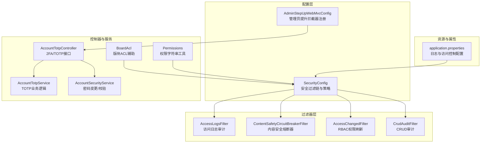
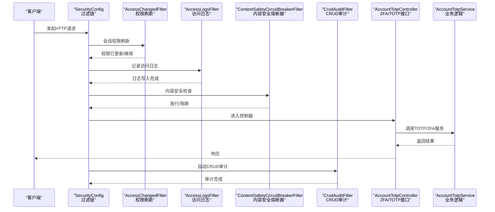
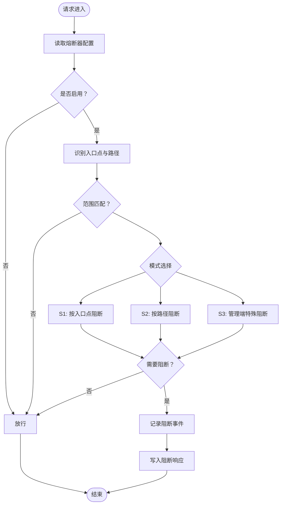
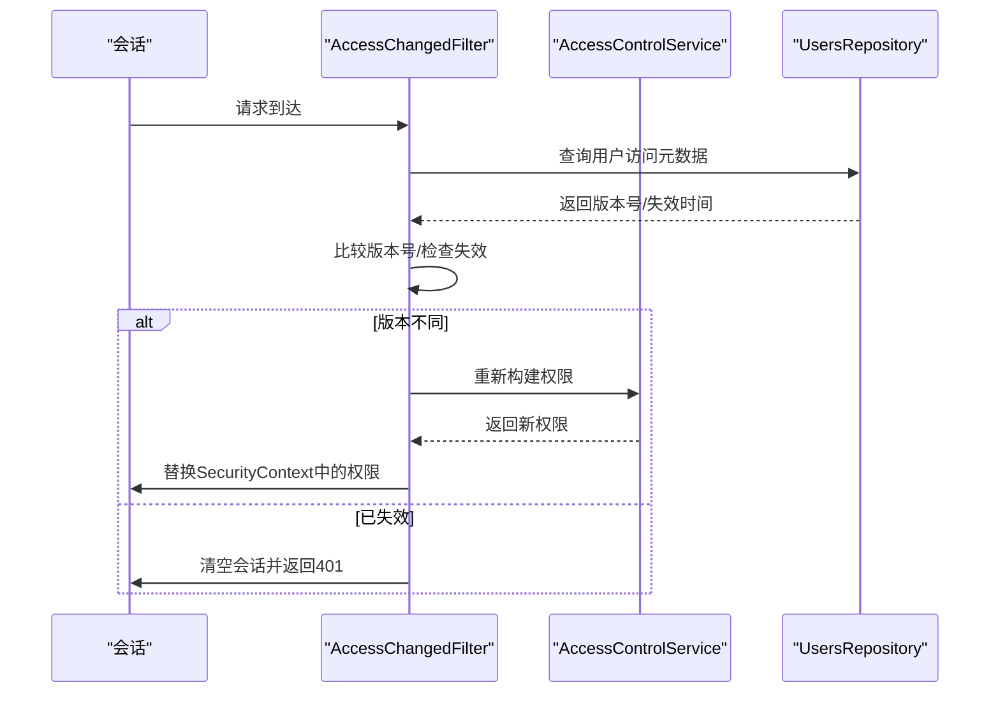
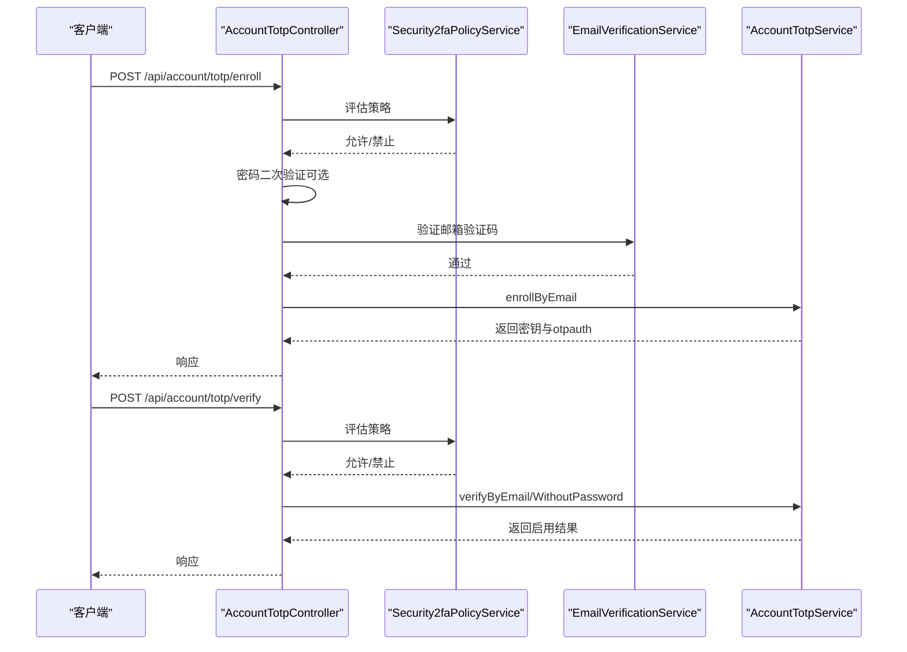
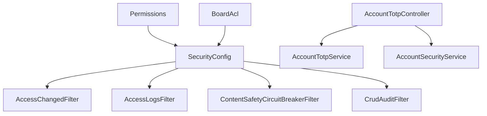

# 安全架构

<cite>
**本文引用的文件**
- [SecurityConfig.java](file://src/main/java/com/example/EnterpriseRagCommunity/config/SecurityConfig.java)
- [ContentSafetyCircuitBreakerFilter.java](file://src/main/java/com/example/EnterpriseRagCommunity/security/ContentSafetyCircuitBreakerFilter.java)
- [AccessLogsFilter.java](file://src/main/java/com/example/EnterpriseRagCommunity/security/AccessLogsFilter.java)
- [CrudAuditFilter.java](file://src/main/java/com/example/EnterpriseRagCommunity/security/CrudAuditFilter.java)
- [AccessChangedFilter.java](file://src/main/java/com/example/EnterpriseRagCommunity/security/AccessChangedFilter.java)
- [Permissions.java](file://src/main/java/com/example/EnterpriseRagCommunity/security/Permissions.java)
- [BoardAcl.java](file://src/main/java/com/example/EnterpriseRagCommunity/security/BoardAcl.java)
- [AdminStepUpWebMvcConfig.java](file://src/main/java/com/example/EnterpriseRagCommunity/config/AdminStepUpWebMvcConfig.java)
- [AccountTotpController.java](file://src/main/java/com/example/EnterpriseRagCommunity/controller/AccountTotpController.java)
- [AccountTotpService.java](file://src/main/java/com/example/EnterpriseRagCommunity/service/AccountTotpService.java)
- [AccountSecurityService.java](file://src/main/java/com/example/EnterpriseRagCommunity/service/AccountSecurityService.java)
- [application.properties](file://src/main/resources/application.properties)
</cite>

## 目录
1. [引言](#引言)
2. [项目结构](#项目结构)
3. [核心组件](#核心组件)
4. [架构总览](#架构总览)
5. [详细组件分析](#详细组件分析)
6. [依赖关系分析](#依赖关系分析)
7. [性能考量](#性能考量)
8. [故障排查指南](#故障排查指南)
9. [结论](#结论)
10. [附录](#附录)

## 引言
本文件面向RAG社区平台的安全架构，系统化阐述基于Spring Security的多层安全防护体系。重点覆盖认证与授权、RBAC权限控制、访问日志与审计、内容安全熔断器、2FA双因素认证、管理员“提升验证”流程，以及安全配置策略、威胁防护与合规建议。文档旨在帮助开发者与运维人员理解各安全组件的协作关系与职责边界，并提供可操作的最佳实践。

## 项目结构
围绕安全主题的关键代码分布如下：
- 配置层：Spring Security配置、跨域与CSRF策略、认证提供者与密码编码器
- 过滤器层：访问日志、CRUD审计、内容安全熔断器、会话权限刷新
- 控制器与服务层：TOTP/2FA启用/校验/禁用、密码变更、权限工具
- 资源与属性：全局日志与访问控制相关配置项

图表来源
- [SecurityConfig.java:74-194](file://src/main/java/com/example/EnterpriseRagCommunity/config/SecurityConfig.java#L74-L194)
- [AdminStepUpWebMvcConfig.java:8-16](file://src/main/java/com/example/EnterpriseRagCommunity/config/AdminStepUpWebMvcConfig.java#L8-L16)
- [AccessLogsFilter.java:41-710](file://src/main/java/com/example/EnterpriseRagCommunity/security/AccessLogsFilter.java#L41-L710)
- [ContentSafetyCircuitBreakerFilter.java:20-242](file://src/main/java/com/example/EnterpriseRagCommunity/security/ContentSafetyCircuitBreakerFilter.java#L20-L242)
- [AccessChangedFilter.java:35-154](file://src/main/java/com/example/EnterpriseRagCommunity/security/AccessChangedFilter.java#L35-L154)
- [CrudAuditFilter.java:31-304](file://src/main/java/com/example/EnterpriseRagCommunity/security/CrudAuditFilter.java#L31-L304)
- [AccountTotpController.java:43-326](file://src/main/java/com/example/EnterpriseRagCommunity/controller/AccountTotpController.java#L43-L326)
- [AccountTotpService.java:28-359](file://src/main/java/com/example/EnterpriseRagCommunity/service/AccountTotpService.java#L28-L359)
- [AccountSecurityService.java:13-62](file://src/main/java/com/example/EnterpriseRagCommunity/service/AccountSecurityService.java#L13-L62)
- [Permissions.java:8-25](file://src/main/java/com/example/EnterpriseRagCommunity/security/Permissions.java#L8-L25)
- [BoardAcl.java:14-60](file://src/main/java/com/example/EnterpriseRagCommunity/security/BoardAcl.java#L14-L60)
- [application.properties:55-84](file://src/main/resources/application.properties#L55-L84)

章节来源
- [SecurityConfig.java:74-236](file://src/main/java/com/example/EnterpriseRagCommunity/config/SecurityConfig.java#L74-L236)
- [application.properties:55-84](file://src/main/resources/application.properties#L55-L84)

## 核心组件
- Spring Security配置与过滤链
  - 分离API与Web两类过滤链，API链仅拦截/api/**，Web链处理SPA路由与静态资源，降低冲突风险。
  - 统一CORS与CSRF策略，Cookie存储CSRF令牌，忽略初始化/认证/2FA相关端点的CSRF校验。
  - 基于UserDetailsService与DaoAuthenticationProvider实现用户名（邮箱）认证，BCrypt密码编码。
  - 授权规则：公开端点放行、前台浏览匿名放行、后台管理端点需认证，其余/API请求均需认证。
- 内容安全熔断器
  - 基于配置的S1/S2/S3模式，对入口点（门户列表/详情/搜索/聊天/上传/热度）进行阻断与限流。
  - 支持按入口点、帖子ID、用户ID进行范围选择，记录阻断事件并返回统一JSON响应。
- 访问日志与审计
  - 访问日志：捕获请求/响应体摘要、头信息、客户端指纹、会话哈希等，写入访问日志。
  - CRUD审计：自动识别CRUD动作与实体，记录审计日志，支持排除路径与包含路径白名单。
- RBAC权限刷新
  - 会话中维护权限版本号与失效时间戳，当数据库中用户权限元数据变化时，刷新当前会话权限，避免权限滞后。
- 2FA/TOTP与管理员提升验证
  - 提供TOTP密钥生成、验证、启用、禁用流程，结合密码二次验证与邮箱验证码。
  - 管理员提升拦截器在API层面拦截敏感操作，要求额外验证步骤。

章节来源
- [SecurityConfig.java:74-236](file://src/main/java/com/example/EnterpriseRagCommunity/config/SecurityConfig.java#L74-L236)
- [ContentSafetyCircuitBreakerFilter.java:20-242](file://src/main/java/com/example/EnterpriseRagCommunity/security/ContentSafetyCircuitBreakerFilter.java#L20-L242)
- [AccessLogsFilter.java:41-710](file://src/main/java/com/example/EnterpriseRagCommunity/security/AccessLogsFilter.java#L41-L710)
- [CrudAuditFilter.java:31-304](file://src/main/java/com/example/EnterpriseRagCommunity/security/CrudAuditFilter.java#L31-L304)
- [AccessChangedFilter.java:35-154](file://src/main/java/com/example/EnterpriseRagCommunity/security/AccessChangedFilter.java#L35-L154)
- [AdminStepUpWebMvcConfig.java:8-16](file://src/main/java/com/example/EnterpriseRagCommunity/config/AdminStepUpWebMvcConfig.java#L8-L16)
- [AccountTotpController.java:43-326](file://src/main/java/com/example/EnterpriseRagCommunity/controller/AccountTotpController.java#L43-L326)
- [AccountTotpService.java:28-359](file://src/main/java/com/example/EnterpriseRagCommunity/service/AccountTotpService.java#L28-L359)
- [AccountSecurityService.java:13-62](file://src/main/java/com/example/EnterpriseRagCommunity/service/AccountSecurityService.java#L13-L62)

## 架构总览
下图展示了安全组件在请求生命周期中的协作关系与数据流：

图表来源
- [SecurityConfig.java:74-194](file://src/main/java/com/example/EnterpriseRagCommunity/config/SecurityConfig.java#L74-L194)
- [AccessChangedFilter.java:54-152](file://src/main/java/com/example/EnterpriseRagCommunity/security/AccessChangedFilter.java#L54-L152)
- [AccessLogsFilter.java:83-213](file://src/main/java/com/example/EnterpriseRagCommunity/security/AccessLogsFilter.java#L83-L213)
- [ContentSafetyCircuitBreakerFilter.java:41-81](file://src/main/java/com/example/EnterpriseRagCommunity/security/ContentSafetyCircuitBreakerFilter.java#L41-L81)
- [CrudAuditFilter.java:58-128](file://src/main/java/com/example/EnterpriseRagCommunity/security/CrudAuditFilter.java#L58-L128)
- [AccountTotpController.java:79-162](file://src/main/java/com/example/EnterpriseRagCommunity/controller/AccountTotpController.java#L79-L162)
- [AccountTotpService.java:103-222](file://src/main/java/com/example/EnterpriseRagCommunity/service/AccountTotpService.java#L103-L222)

## 详细组件分析

### Spring Security配置与过滤链
- 双链路设计
  - API链：仅匹配/api/**，集成CSRF、CORS、认证授权、访问日志、熔断器与权限刷新。
  - Web链：匹配/**，处理SPA路由与静态资源，启用CSRF与CORS，挂载内容安全熔断器。
- 认证与授权
  - 用户名解析：从邮箱派生UserDetails，校验账户状态，加载角色与权限集合。
  - 授权策略：公开端点放行、前台浏览匿名放行、后台管理端点需认证、其余/API请求均需认证。
- CSRF与CORS
  - CSRF使用Cookie存储并暴露至前端，忽略初始化/认证/2FA相关端点。
  - CORS支持动态配置，允许凭证，设置合理头部与最大缓存时间。
- 会话与异常处理
  - 会话策略：始终创建会话，便于权限刷新与审计。
  - 未认证异常：返回401，不携带WWW-Authenticate头。

章节来源
- [SecurityConfig.java:74-236](file://src/main/java/com/example/EnterpriseRagCommunity/config/SecurityConfig.java#L74-L236)

### 内容安全熔断器
- 功能概述
  - 依据配置决定是否启用，支持S1/S2/S3三种模式，按入口点/帖子ID/用户ID进行范围匹配。
  - 对静态资源、公开端点、管理端点进行豁免，避免误伤正常流量。
- 阻断与响应
  - 阻断时记录事件并返回统一JSON响应，包含成功标志、错误码、消息与模式标识。
  - 非API路径返回纯文本提示，设置缓存控制与重试头。
- 路径与入口点识别
  - 识别门户列表/详情、搜索、聊天、上传、热度等入口点，支持GET方法判断。

图表来源
- [ContentSafetyCircuitBreakerFilter.java:41-112](file://src/main/java/com/example/EnterpriseRagCommunity/security/ContentSafetyCircuitBreakerFilter.java#L41-L112)

章节来源
- [ContentSafetyCircuitBreakerFilter.java:20-242](file://src/main/java/com/example/EnterpriseRagCommunity/security/ContentSafetyCircuitBreakerFilter.java#L20-L242)

### 访问日志与审计
- 访问日志
  - 捕获请求/响应体摘要（受大小限制）、头信息、客户端指纹、会话哈希等。
  - 支持敏感字段掩码（如密码、令牌、Cookie、CSRF等），防止泄露。
  - 将请求上下文写入访问日志，包含延迟、状态码、客户端/服务器IP与端口等。
- CRUD审计
  - 自动识别CRUD动作（读/写/改/删），推导实体类型与实体ID。
  - 支持包含/排除路径白名单，记录审计日志并标注自动CRUD标记。
- 性能与隐私
  - 通过配置项控制是否捕获请求/响应体及最大字节数，避免内存与IO压力。
  - 对查询串与JSON体进行敏感信息掩码，兼顾审计完整性与隐私保护。

章节来源
- [AccessLogsFilter.java:41-710](file://src/main/java/com/example/EnterpriseRagCommunity/security/AccessLogsFilter.java#L41-L710)
- [CrudAuditFilter.java:31-304](file://src/main/java/com/example/EnterpriseRagCommunity/security/CrudAuditFilter.java#L31-L304)

### RBAC权限刷新（会话权限即时生效）
- 设计动机
  - 采用会话（JSESSIONID）存储权限，管理员调整角色/权限后，现有会话权限可能过期。
- 实现策略
  - 在会话中维护权限版本号与失效时间戳，周期性检查或在请求中触发刷新。
  - 若数据库权限版本高于会话版本，则重建权限并替换SecurityContext中的Authentication。
  - 若用户会话被强制失效（如密码变更），则清空会话并返回401。
- 适用场景
  - 管理员编辑角色-权限映射、用户-角色映射后，新权限立即生效。

图表来源
- [AccessChangedFilter.java:93-133](file://src/main/java/com/example/EnterpriseRagCommunity/security/AccessChangedFilter.java#L93-L133)

章节来源
- [AccessChangedFilter.java:35-154](file://src/main/java/com/example/EnterpriseRagCommunity/security/AccessChangedFilter.java#L35-L154)

### 2FA双因素认证（TOTP）
- 2FA/TOTP流程
  - 获取策略与状态：查询TOTP策略与当前启用状态。
  - 启用流程：密码二次验证（可选）+ 邮箱验证码校验，生成密钥与otpauth URI，保存待启用密钥。
  - 启用验证：使用最新密钥验证一次性验证码，启用并清理临时状态。
  - 禁用流程：支持TOTP验证码或邮箱验证码两种方式，禁用后清理状态。
- 安全策略
  - 密钥加密存储，主密钥配置缺失时拒绝启用。
  - 支持算法/位数/周期/偏移等策略，兼容多种认证器。
  - 密码二次验证在会话内短期有效，避免重复输入。
- 控制器与服务
  - 控制器负责策略评估、二次验证、邮箱验证码消费与审计记录。
  - 服务负责密钥生成、加密/解密、验证码校验与状态管理。

图表来源
- [AccountTotpController.java:79-162](file://src/main/java/com/example/EnterpriseRagCommunity/controller/AccountTotpController.java#L79-L162)
- [AccountTotpService.java:103-222](file://src/main/java/com/example/EnterpriseRagCommunity/service/AccountTotpService.java#L103-L222)

章节来源
- [AccountTotpController.java:43-326](file://src/main/java/com/example/EnterpriseRagCommunity/controller/AccountTotpController.java#L43-L326)
- [AccountTotpService.java:28-359](file://src/main/java/com/example/EnterpriseRagCommunity/service/AccountTotpService.java#L28-L359)
- [AccountSecurityService.java:13-62](file://src/main/java/com/example/EnterpriseRagCommunity/service/AccountSecurityService.java#L13-L62)

### 管理员提升验证（Admin Step-Up）
- 拦截器注册
  - 在WebMvc配置中注册AdminStepUp拦截器，对/api/**路径生效。
- 作用机制
  - 对敏感管理操作进行二次验证，结合2FA/TOTP与策略评估，确保高危操作的安全性。
- 与2FA联动
  - 提升验证可复用2FA/TOTP能力，结合密码二次验证与邮箱验证码，形成强管控。

章节来源
- [AdminStepUpWebMvcConfig.java:8-16](file://src/main/java/com/example/EnterpriseRagCommunity/config/AdminStepUpWebMvcConfig.java#L8-L16)

### 权限工具与版块ACL
- 权限字符串工具
  - 提供权限命名规范，支持资源、动作与作用域（全局/GLOBAL或按BOARD/USER等）组合。
- 版块ACL辅助
  - 提供版块/帖子/队列条目的权限判定，结合当前用户与数据库查询，判断是否具备审核/处置权限。

章节来源
- [Permissions.java:8-25](file://src/main/java/com/example/EnterpriseRagCommunity/security/Permissions.java#L8-L25)
- [BoardAcl.java:14-60](file://src/main/java/com/example/EnterpriseRagCommunity/security/BoardAcl.java#L14-L60)

## 依赖关系分析
- 组件耦合
  - SecurityConfig作为入口，依赖多个过滤器与服务，形成清晰的职责边界。
  - 访问日志与审计过滤器通过条件注解按需装配，避免在未启用日志时引入开销。
  - 2FA/TOTP服务与控制器解耦，便于策略评估与通知模块扩展。
- 外部依赖
  - 数据库：用户、角色、权限、审计日志等实体持久化。
  - 邮件服务：用于邮箱验证码发送与安全通知。
  - 配置中心/环境变量：TOTP主密钥、CORS白名单、日志与访问控制开关。

图表来源
- [SecurityConfig.java:74-194](file://src/main/java/com/example/EnterpriseRagCommunity/config/SecurityConfig.java#L74-L194)
- [AccessLogsFilter.java:41-710](file://src/main/java/com/example/EnterpriseRagCommunity/security/AccessLogsFilter.java#L41-L710)
- [ContentSafetyCircuitBreakerFilter.java:20-242](file://src/main/java/com/example/EnterpriseRagCommunity/security/ContentSafetyCircuitBreakerFilter.java#L20-L242)
- [CrudAuditFilter.java:31-304](file://src/main/java/com/example/EnterpriseRagCommunity/security/CrudAuditFilter.java#L31-L304)
- [AccessChangedFilter.java:35-154](file://src/main/java/com/example/EnterpriseRagCommunity/security/AccessChangedFilter.java#L35-L154)
- [AccountTotpController.java:43-326](file://src/main/java/com/example/EnterpriseRagCommunity/controller/AccountTotpController.java#L43-L326)
- [AccountTotpService.java:28-359](file://src/main/java/com/example/EnterpriseRagCommunity/service/AccountTotpService.java#L28-L359)
- [AccountSecurityService.java:13-62](file://src/main/java/com/example/EnterpriseRagCommunity/service/AccountSecurityService.java#L13-L62)
- [Permissions.java:8-25](file://src/main/java/com/example/EnterpriseRagCommunity/security/Permissions.java#L8-L25)
- [BoardAcl.java:14-60](file://src/main/java/com/example/EnterpriseRagCommunity/security/BoardAcl.java#L14-L60)

## 性能考量
- 过滤器链路
  - API与Web双链路分离，减少不必要的CSRF/CORS处理与会话创建。
  - 访问日志与审计按需捕获，通过配置项限制请求/响应体大小，避免内存与IO峰值。
- 会话权限刷新
  - 采用会话内时间戳与版本号，定期检查（可配置间隔），避免频繁数据库查询。
- 内容安全熔断器
  - 仅对特定入口点与路径生效，静态资源与公开端点豁免，降低对正常流量的影响。
- 密码与TOTP
  - 使用BCrypt进行密码哈希，TOTP密钥加密存储，兼顾安全性与性能。

[本节为通用指导，无需列出具体文件来源]

## 故障排查指南
- 2FA/TOTP启用失败
  - 检查主密钥配置与策略评估结果，确认邮箱验证码是否正确。
  - 若认证器参数不匹配，服务端会给出提示，建议使用支持自定义算法/位数/周期的认证器。
- 权限刷新无效
  - 确认会话中存在权限版本号与失效时间戳，检查用户权限元数据是否更新。
  - 如遇会话被强制失效，需重新登录。
- 访问日志/审计缺失
  - 检查是否启用了AccessLogWriter/AuditLogWriter，确认路径是否在排除列表中。
  - 调整日志捕获大小限制，避免过大请求/响应体被截断。
- CSRF 403错误
  - 确认CSRF令牌是否随请求提交，忽略端点是否正确配置。
- 内容安全熔断器阻断
  - 检查配置模式与范围，确认是否命中入口点或目标ID。
  - 查看阻断事件记录，定位具体原因。

章节来源
- [AccountTotpService.java:224-280](file://src/main/java/com/example/EnterpriseRagCommunity/service/AccountTotpService.java#L224-L280)
- [AccessChangedFilter.java:93-133](file://src/main/java/com/example/EnterpriseRagCommunity/security/AccessChangedFilter.java#L93-L133)
- [AccessLogsFilter.java:72-81](file://src/main/java/com/example/EnterpriseRagCommunity/security/AccessLogsFilter.java#L72-L81)
- [ContentSafetyCircuitBreakerFilter.java:32-39](file://src/main/java/com/example/EnterpriseRagCommunity/security/ContentSafetyCircuitBreakerFilter.java#L32-L39)

## 结论
本安全架构以Spring Security为核心，结合内容安全熔断器、访问日志与审计、RBAC权限刷新与2FA/TOTP，构建了多层次、可配置、可扩展的安全防护体系。通过API/Web双链路分离、细粒度的授权与CSRF策略、以及完善的审计与监控能力，系统在保障用户体验的同时，显著提升了安全性与合规性。建议持续完善策略评估与告警机制，强化主密钥与敏感配置的保护，并定期审查权限与访问日志，确保安全策略的有效执行。

[本节为总结性内容，无需列出具体文件来源]

## 附录
- 安全配置要点
  - CORS白名单与模式优先级、CSRF Cookie策略、会话创建策略、密码编码器选择。
- 最佳实践
  - 启用并合理配置访问日志与审计，限制日志体大小，开启敏感字段掩码。
  - 对高危操作启用管理员提升验证，结合2FA/TOTP与策略评估。
  - 定期轮换主密钥与会话，及时清理过期会话与失效权限。
  - 对内容安全熔断器进行灰度发布与回滚预案，避免误伤正常流量。

章节来源
- [application.properties:55-84](file://src/main/resources/application.properties#L55-L84)
- [SecurityConfig.java:105-142](file://src/main/java/com/example/EnterpriseRagCommunity/config/SecurityConfig.java#L105-L142)