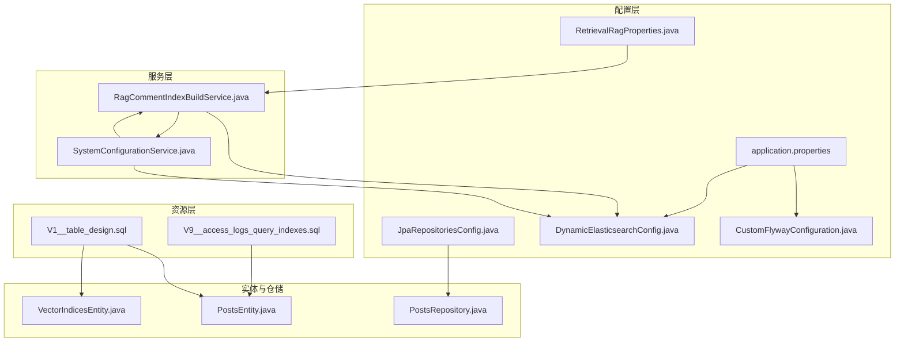
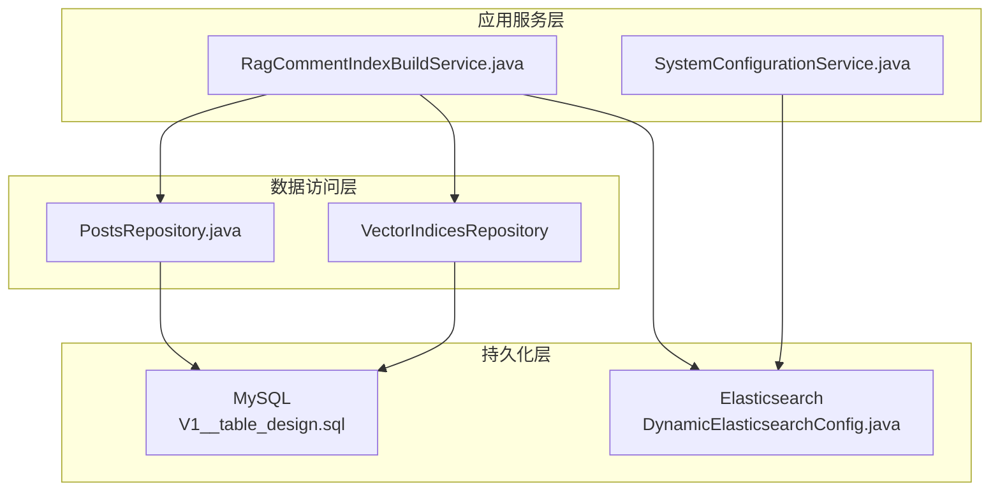
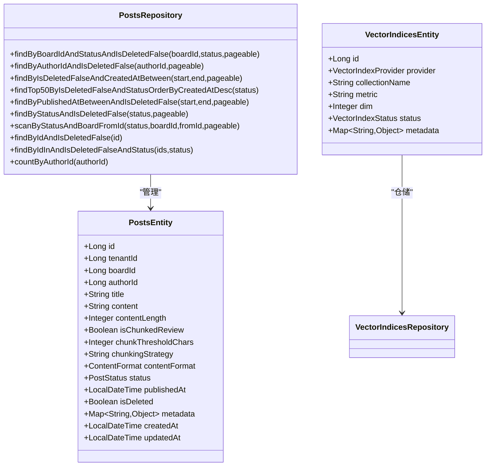
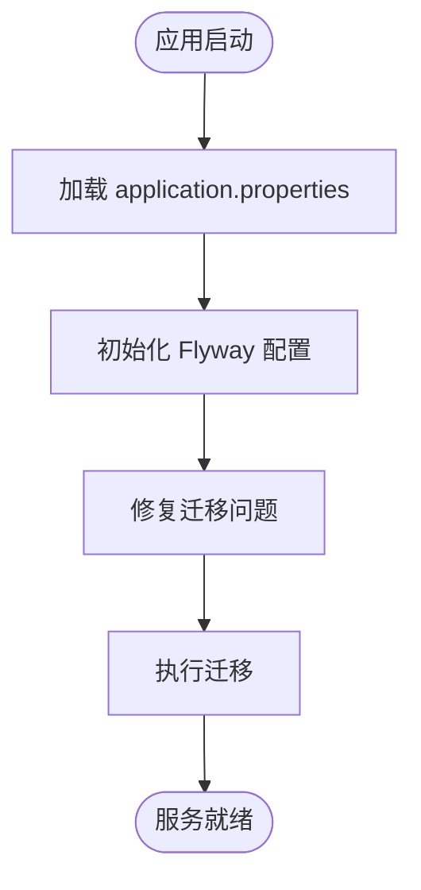
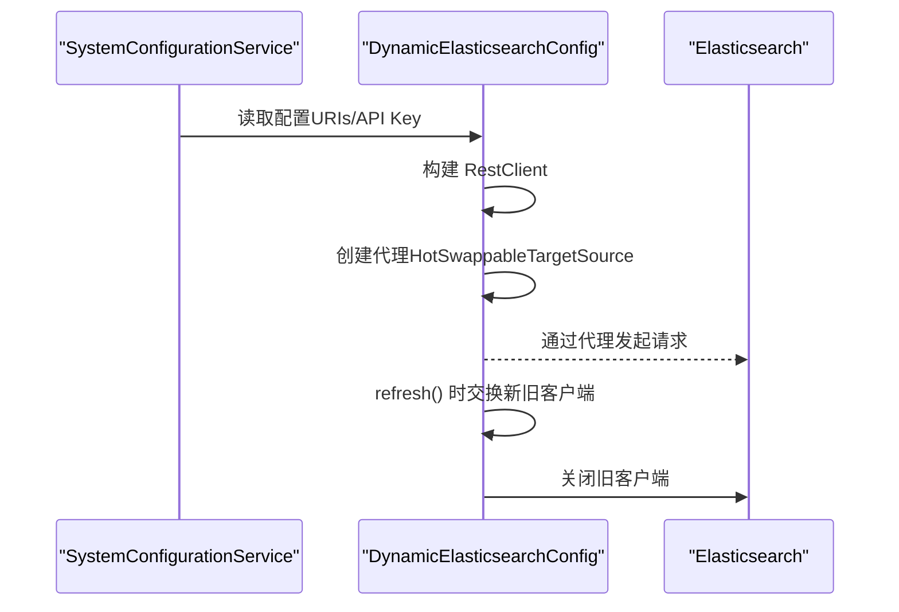
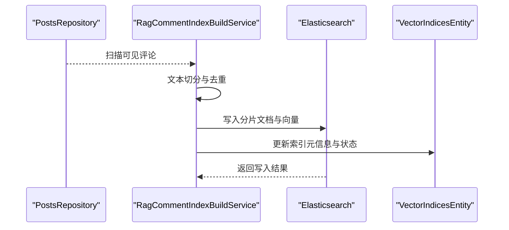
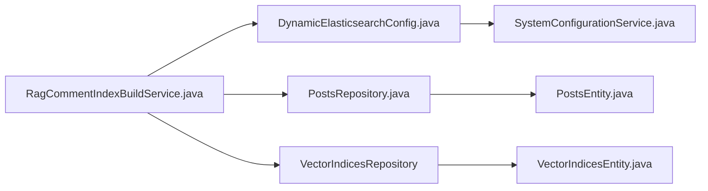
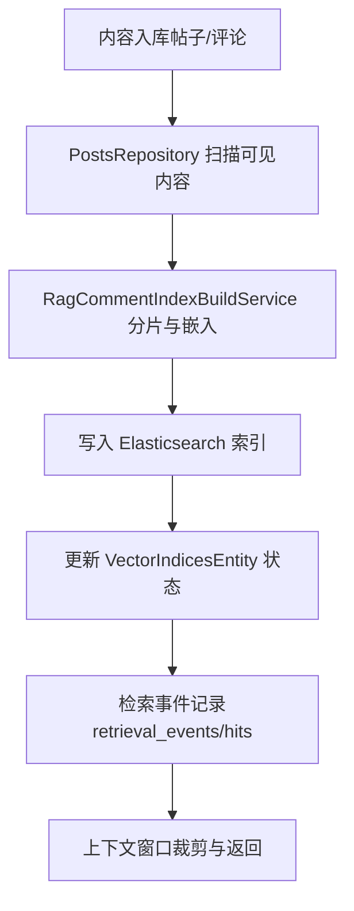

# 数据架构

<cite>
**本文引用的文件**
- [application.properties](file://src/main/resources/application.properties)
- [JpaRepositoriesConfig.java](file://src/main/java/com/example/EnterpriseRagCommunity/config/JpaRepositoriesConfig.java)
- [DynamicElasticsearchConfig.java](file://src/main/java/com/example/EnterpriseRagCommunity/config/DynamicElasticsearchConfig.java)
- [SystemConfigurationService.java](file://src/main/java/com/example/EnterpriseRagCommunity/service/config/SystemConfigurationService.java)
- [RetrievalRagProperties.java](file://src/main/java/com/example/EnterpriseRagCommunity/config/RetrievalRagProperties.java)
- [CustomFlywayConfiguration.java](file://src/main/java/com/example/EnterpriseRagCommunity/config/CustomFlywayConfiguration.java)
- [V1__table_design.sql](file://src/main/resources/db/migration/V1__table_design.sql)
- [V9__access_logs_query_indexes.sql](file://src/main/resources/db/migration/V9__access_logs_query_indexes.sql)
- [PostsEntity.java](file://src/main/java/com/example/EnterpriseRagCommunity/entity/content/PostsEntity.java)
- [PostsRepository.java](file://src/main/java/com/example/EnterpriseRagCommunity/repository/content/PostsRepository.java)
- [VectorIndicesEntity.java](file://src/main/java/com/example/EnterpriseRagCommunity/entity/semantic/VectorIndicesEntity.java)
- [RagCommentIndexBuildService.java](file://src/main/java/com/example/EnterpriseRagCommunity/service/retrieval/RagCommentIndexBuildService.java)
</cite>

## 目录
1. [引言](#引言)
2. [项目结构](#项目结构)
3. [核心组件](#核心组件)
4. [架构总览](#架构总览)
5. [详细组件分析](#详细组件分析)
6. [依赖分析](#依赖分析)
7. [性能考量](#性能考量)
8. [故障排查指南](#故障排查指南)
9. [结论](#结论)
10. [附录](#附录)

## 引言
本文件面向RAG社区平台的数据架构，聚焦以下主题：
- 基于JPA的ORM设计与数据访问层
- 数据库连接池与Flyway迁移
- 动态Elasticsearch客户端配置与热切换
- 实体关系映射、索引策略与查询优化
- 全文检索、向量检索与混合检索的架构设计
- 数据一致性与缓存策略
- 数据流图展示数据在系统中的流转过程

## 项目结构
围绕数据架构的关键模块与文件如下：
- 配置层：JPA扫描、连接池、Flyway、动态ES客户端、RAG属性
- 实体与仓储：内容、语义、审核、检索等核心表及JPA接口
- 服务层：RAG索引构建与增量同步、系统配置管理
- 资源层：数据库迁移脚本与运行时配置

**图表来源**
- [JpaRepositoriesConfig.java:1-12](file://src/main/java/com/example/EnterpriseRagCommunity/config/JpaRepositoriesConfig.java#L1-L12)
- [application.properties:1-84](file://src/main/resources/application.properties#L1-L84)
- [CustomFlywayConfiguration.java:1-50](file://src/main/java/com/example/EnterpriseRagCommunity/config/CustomFlywayConfiguration.java#L1-L50)
- [DynamicElasticsearchConfig.java:1-128](file://src/main/java/com/example/EnterpriseRagCommunity/config/DynamicElasticsearchConfig.java#L1-L128)
- [RetrievalRagProperties.java:1-22](file://src/main/java/com/example/EnterpriseRagCommunity/config/RetrievalRagProperties.java#L1-L22)
- [PostsEntity.java:1-75](file://src/main/java/com/example/EnterpriseRagCommunity/entity/content/PostsEntity.java#L1-L75)
- [PostsRepository.java:1-46](file://src/main/java/com/example/EnterpriseRagCommunity/repository/content/PostsRepository.java#L1-L46)
- [VectorIndicesEntity.java:1-43](file://src/main/java/com/example/EnterpriseRagCommunity/entity/semantic/VectorIndicesEntity.java#L1-L43)
- [SystemConfigurationService.java:1-95](file://src/main/java/com/example/EnterpriseRagCommunity/service/config/SystemConfigurationService.java#L1-L95)
- [RagCommentIndexBuildService.java:1-754](file://src/main/java/com/example/EnterpriseRagCommunity/service/retrieval/RagCommentIndexBuildService.java#L1-L754)
- [V1__table_design.sql:1-800](file://src/main/resources/db/migration/V1__table_design.sql#L1-L800)
- [V9__access_logs_query_indexes.sql:1-4](file://src/main/resources/db/migration/V9__access_logs_query_indexes.sql#L1-L4)

**章节来源**
- [application.properties:1-84](file://src/main/resources/application.properties#L1-L84)
- [JpaRepositoriesConfig.java:1-12](file://src/main/java/com/example/EnterpriseRagCommunity/config/JpaRepositoriesConfig.java#L1-L12)
- [CustomFlywayConfiguration.java:1-50](file://src/main/java/com/example/EnterpriseRagCommunity/config/CustomFlywayConfiguration.java#L1-L50)
- [DynamicElasticsearchConfig.java:1-128](file://src/main/java/com/example/EnterpriseRagCommunity/config/DynamicElasticsearchConfig.java#L1-L128)
- [RetrievalRagProperties.java:1-22](file://src/main/java/com/example/EnterpriseRagCommunity/config/RetrievalRagProperties.java#L1-L22)
- [PostsEntity.java:1-75](file://src/main/java/com/example/EnterpriseRagCommunity/entity/content/PostsEntity.java#L1-L75)
- [PostsRepository.java:1-46](file://src/main/java/com/example/EnterpriseRagCommunity/repository/content/PostsRepository.java#L1-L46)
- [VectorIndicesEntity.java:1-43](file://src/main/java/com/example/EnterpriseRagCommunity/entity/semantic/VectorIndicesEntity.java#L1-L43)
- [SystemConfigurationService.java:1-95](file://src/main/java/com/example/EnterpriseRagCommunity/service/config/SystemConfigurationService.java#L1-L95)
- [RagCommentIndexBuildService.java:1-754](file://src/main/java/com/example/EnterpriseRagCommunity/service/retrieval/RagCommentIndexBuildService.java#L1-L754)
- [V1__table_design.sql:1-800](file://src/main/resources/db/migration/V1__table_design.sql#L1-L800)
- [V9__access_logs_query_indexes.sql:1-4](file://src/main/resources/db/migration/V9__access_logs_query_indexes.sql#L1-L4)

## 核心组件
- JPA与数据访问层
  - 启用JPA扫描，指定基础包，确保实体与仓库在统一命名空间下注册。
  - 仓储接口继承JpaRepository与JpaSpecificationExecutor，支持分页、排序与复杂条件查询。
- 数据库连接池与迁移
  - HikariCP连接池参数集中于application.properties，包含最大池大小、最小空闲、连接超时、校验超时、空闲超时与最大生存时间。
  - Flyway自定义配置加载迁移脚本位置、基准迁移、编码等，启动即执行修复与迁移。
- 动态Elasticsearch客户端
  - 通过SystemConfigurationService从数据库配置表读取ES连接与认证信息，构建RestClient代理，支持运行时热切换。
- 实体与索引
  - 内容实体（帖子、评论、草稿）与语义实体（向量索引元信息）支撑全文与向量检索。
  - 迁移脚本定义了全文索引键、向量字段与检索相关表结构。

**章节来源**
- [JpaRepositoriesConfig.java:1-12](file://src/main/java/com/example/EnterpriseRagCommunity/config/JpaRepositoriesConfig.java#L1-L12)
- [application.properties:7-24](file://src/main/resources/application.properties#L7-L24)
- [CustomFlywayConfiguration.java:17-48](file://src/main/java/com/example/EnterpriseRagCommunity/config/CustomFlywayConfiguration.java#L17-L48)
- [DynamicElasticsearchConfig.java:33-90](file://src/main/java/com/example/EnterpriseRagCommunity/config/DynamicElasticsearchConfig.java#L33-L90)
- [SystemConfigurationService.java:41-61](file://src/main/java/com/example/EnterpriseRagCommunity/service/config/SystemConfigurationService.java#L41-L61)
- [PostsEntity.java:13-75](file://src/main/java/com/example/EnterpriseRagCommunity/entity/content/PostsEntity.java#L13-L75)
- [PostsRepository.java:16-46](file://src/main/java/com/example/EnterpriseRagCommunity/repository/content/PostsRepository.java#L16-L46)
- [VectorIndicesEntity.java:12-43](file://src/main/java/com/example/EnterpriseRagCommunity/entity/semantic/VectorIndicesEntity.java#L12-L43)
- [V1__table_design.sql:196-406](file://src/main/resources/db/migration/V1__table_design.sql#L196-L406)

## 架构总览
系统数据架构由“关系型数据库+搜索引擎”双引擎构成：
- 关系型数据库（MySQL）承载业务主数据与审计、权限、审核、检索事件等结构化数据，使用JPA进行持久化。
- 搜索引擎（Elasticsearch）承载文档分片与向量索引，支持全文检索与向量检索，并通过动态客户端实现配置热更新。

**图表来源**
- [RagCommentIndexBuildService.java:46-61](file://src/main/java/com/example/EnterpriseRagCommunity/service/retrieval/RagCommentIndexBuildService.java#L46-L61)
- [SystemConfigurationService.java:16-31](file://src/main/java/com/example/EnterpriseRagCommunity/service/config/SystemConfigurationService.java#L16-L31)
- [PostsRepository.java:16-46](file://src/main/java/com/example/EnterpriseRagCommunity/repository/content/PostsRepository.java#L16-L46)
- [DynamicElasticsearchConfig.java:27-51](file://src/main/java/com/example/EnterpriseRagCommunity/config/DynamicElasticsearchConfig.java#L27-L51)
- [V1__table_design.sql:196-406](file://src/main/resources/db/migration/V1__table_design.sql#L196-L406)

## 详细组件分析

### JPA与数据访问层
- 实体映射
  - PostsEntity定义了帖子主表的字段、索引与枚举类型，包含软删除、状态、发布时间、内容长度与元数据等。
  - VectorIndicesEntity定义向量索引元信息，包含提供方、集合名、度量、维度与元数据。
- 仓储接口
  - PostsRepository提供基于Board、作者、时间区间、状态与软删除过滤的分页查询方法，支持扫描式增量查询。
- 设计要点
  - 使用JpaSpecificationExecutor增强动态查询能力；软删除统一通过显式过滤保障数据一致性。
  - 分页查询结合索引（如帖子表的board/status复合索引）提升性能。

**图表来源**
- [PostsEntity.java:13-75](file://src/main/java/com/example/EnterpriseRagCommunity/entity/content/PostsEntity.java#L13-L75)
- [PostsRepository.java:16-46](file://src/main/java/com/example/EnterpriseRagCommunity/repository/content/PostsRepository.java#L16-L46)
- [VectorIndicesEntity.java:12-43](file://src/main/java/com/example/EnterpriseRagCommunity/entity/semantic/VectorIndicesEntity.java#L12-L43)

**章节来源**
- [PostsEntity.java:13-75](file://src/main/java/com/example/EnterpriseRagCommunity/entity/content/PostsEntity.java#L13-L75)
- [PostsRepository.java:16-46](file://src/main/java/com/example/EnterpriseRagCommunity/repository/content/PostsRepository.java#L16-L46)
- [VectorIndicesEntity.java:12-43](file://src/main/java/com/example/EnterpriseRagCommunity/entity/semantic/VectorIndicesEntity.java#L12-L43)

### 数据库连接池与迁移
- 连接池配置
  - application.properties集中定义驱动、URL、用户名、密码与HikariCP参数，便于环境变量注入与统一管理。
- Flyway迁移
  - CustomFlywayConfiguration加载FlywayProperties，设置迁移位置、基准迁移、编码与失败策略，启动时执行修复与迁移。

**图表来源**
- [application.properties:7-24](file://src/main/resources/application.properties#L7-L24)
- [CustomFlywayConfiguration.java:17-48](file://src/main/java/com/example/EnterpriseRagCommunity/config/CustomFlywayConfiguration.java#L17-L48)

**章节来源**
- [application.properties:7-24](file://src/main/resources/application.properties#L7-L24)
- [CustomFlywayConfiguration.java:17-48](file://src/main/java/com/example/EnterpriseRagCommunity/config/CustomFlywayConfiguration.java#L17-L48)

### 动态Elasticsearch配置机制
- 配置来源
  - SystemConfigurationService从数据库配置表加载键值，支持加密配置解密与缓存，提供运行时读取。
- 客户端构建
  - DynamicElasticsearchConfig根据配置动态创建RestClient，设置默认头部（API Key），并通过HotSwappableTargetSource实现代理热切换。
- 刷新与销毁
  - refresh方法交换新旧客户端并安全关闭旧连接；@PreDestroy确保应用关闭时释放资源。

**图表来源**
- [SystemConfigurationService.java:41-61](file://src/main/java/com/example/EnterpriseRagCommunity/service/config/SystemConfigurationService.java#L41-L61)
- [DynamicElasticsearchConfig.java:33-90](file://src/main/java/com/example/EnterpriseRagCommunity/config/DynamicElasticsearchConfig.java#L33-L90)

**章节来源**
- [SystemConfigurationService.java:41-61](file://src/main/java/com/example/EnterpriseRagCommunity/service/config/SystemConfigurationService.java#L41-L61)
- [DynamicElasticsearchConfig.java:33-90](file://src/main/java/com/example/EnterpriseRagCommunity/config/DynamicElasticsearchConfig.java#L33-L90)

### 全文检索、向量检索与混合检索
- 全文检索
  - 迁移脚本在相关表上建立全文索引键（如qa_messages、posts），支持高亮与全文匹配。
- 向量检索
  - document_chunks表存储分片文本与向量字段，VectorIndicesEntity记录索引元信息；RagCommentIndexBuildService负责分片、嵌入、写入ES索引与维度校验。
- 混合检索
  - retrieval_events与retrieval_hits记录检索事件与命中明细，支持BM25、向量与重排的组合策略。

**图表来源**
- [PostsRepository.java:16-46](file://src/main/java/com/example/EnterpriseRagCommunity/repository/content/PostsRepository.java#L16-L46)
- [RagCommentIndexBuildService.java:62-378](file://src/main/java/com/example/EnterpriseRagCommunity/service/retrieval/RagCommentIndexBuildService.java#L62-L378)
- [VectorIndicesEntity.java:12-43](file://src/main/java/com/example/EnterpriseRagCommunity/entity/semantic/VectorIndicesEntity.java#L12-L43)
- [V1__table_design.sql:380-406](file://src/main/resources/db/migration/V1__table_design.sql#L380-L406)

**章节来源**
- [RagCommentIndexBuildService.java:62-378](file://src/main/java/com/example/EnterpriseRagCommunity/service/retrieval/RagCommentIndexBuildService.java#L62-L378)
- [VectorIndicesEntity.java:12-43](file://src/main/java/com/example/EnterpriseRagCommunity/entity/semantic/VectorIndicesEntity.java#L12-L43)
- [V1__table_design.sql:380-406](file://src/main/resources/db/migration/V1__table_design.sql#L380-L406)

### 数据一致性与缓存策略
- 一致性
  - 软删除字段统一过滤，避免误读；事务方法（@Transactional）包裹索引构建与状态更新，确保原子性。
  - 审核队列采用乐观锁版本字段，保障并发更新一致性。
- 缓存
  - SystemConfigurationService对数据库配置进行内存缓存，减少频繁IO；RAG服务中使用分页扫描与游标（fromId）实现低内存增量同步。
- 索引与查询优化
  - 迁移脚本为高频查询字段建立索引（如posts的board/status、comments_closure的祖先/后代索引），V9脚本新增审计日志查询索引，提升扫描效率。

**章节来源**
- [RagCommentIndexBuildService.java:62-378](file://src/main/java/com/example/EnterpriseRagCommunity/service/retrieval/RagCommentIndexBuildService.java#L62-L378)
- [SystemConfigurationService.java:26-61](file://src/main/java/com/example/EnterpriseRagCommunity/service/config/SystemConfigurationService.java#L26-L61)
- [V1__table_design.sql:196-291](file://src/main/resources/db/migration/V1__table_design.sql#L196-L291)
- [V9__access_logs_query_indexes.sql:1-4](file://src/main/resources/db/migration/V9__access_logs_query_indexes.sql#L1-L4)

## 依赖分析
- 组件耦合
  - RagCommentIndexBuildService依赖SystemConfigurationService与DynamicElasticsearchConfig以获取ES配置；依赖VectorIndicesRepository与CommentsRepository进行索引元信息与内容扫描。
  - PostsRepository与PostsEntity强绑定，遵循JPA规范；VectorIndicesEntity与对应仓储形成稳定契约。
- 外部依赖
  - Elasticsearch客户端通过动态配置加载URIs与API Key；Flyway依赖数据库连接与迁移脚本位置。
- 循环依赖
  - 当前结构未见循环依赖迹象；动态ES客户端通过代理隔离具体实现，降低耦合。

**图表来源**
- [DynamicElasticsearchConfig.java:27-51](file://src/main/java/com/example/EnterpriseRagCommunity/config/DynamicElasticsearchConfig.java#L27-L51)
- [SystemConfigurationService.java:16-31](file://src/main/java/com/example/EnterpriseRagCommunity/service/config/SystemConfigurationService.java#L16-L31)
- [RagCommentIndexBuildService.java:46-61](file://src/main/java/com/example/EnterpriseRagCommunity/service/retrieval/RagCommentIndexBuildService.java#L46-L61)
- [PostsRepository.java:16-46](file://src/main/java/com/example/EnterpriseRagCommunity/repository/content/PostsRepository.java#L16-L46)
- [VectorIndicesEntity.java:12-43](file://src/main/java/com/example/EnterpriseRagCommunity/entity/semantic/VectorIndicesEntity.java#L12-L43)

**章节来源**
- [DynamicElasticsearchConfig.java:27-51](file://src/main/java/com/example/EnterpriseRagCommunity/config/DynamicElasticsearchConfig.java#L27-L51)
- [SystemConfigurationService.java:16-31](file://src/main/java/com/example/EnterpriseRagCommunity/service/config/SystemConfigurationService.java#L16-L31)
- [RagCommentIndexBuildService.java:46-61](file://src/main/java/com/example/EnterpriseRagCommunity/service/retrieval/RagCommentIndexBuildService.java#L46-L61)
- [PostsRepository.java:16-46](file://src/main/java/com/example/EnterpriseRagCommunity/repository/content/PostsRepository.java#L16-L46)
- [VectorIndicesEntity.java:12-43](file://src/main/java/com/example/EnterpriseRagCommunity/entity/semantic/VectorIndicesEntity.java#L12-L43)

## 性能考量
- 连接池与事务
  - 合理设置HikariCP参数，避免连接泄漏与超时；事务边界明确，批量写入ES时注意刷新频率与网络开销。
- 查询与索引
  - 利用迁移脚本建立的索引（如posts、comments_closure、audit_logs）减少全表扫描；对高选择性字段建立复合索引。
- 检索性能
  - 向量索引维度与度量需与模型一致；全文检索结合IK分词与高亮；混合检索通过命中明细与上下文窗口裁剪控制Token总量。
- 缓存与配置
  - SystemConfigurationService缓存配置，减少数据库压力；RAG增量同步使用游标与分页，降低内存占用。

[本节为通用指导，无需特定文件分析]

## 故障排查指南
- ES连接异常
  - 检查APP_ES_API_KEY与spring.elasticsearch.uris配置；确认DynamicElasticsearchConfig代理已正确初始化与刷新。
- 迁移失败
  - 查看CustomFlywayConfiguration加载的迁移位置与编码；确认数据库连接与权限；关注修复与迁移日志。
- 索引构建失败
  - 检查RagCommentIndexBuildService的嵌入维度校验、索引清理与刷新逻辑；关注失败文档ID与错误摘要。
- 查询性能问题
  - 对比V1与V9迁移脚本中的索引定义，确认查询是否命中预期索引；必要时增加复合索引或调整查询条件。

**章节来源**
- [DynamicElasticsearchConfig.java:57-79](file://src/main/java/com/example/EnterpriseRagCommunity/config/DynamicElasticsearchConfig.java#L57-L79)
- [CustomFlywayConfiguration.java:43-48](file://src/main/java/com/example/EnterpriseRagCommunity/config/CustomFlywayConfiguration.java#L43-L48)
- [RagCommentIndexBuildService.java:196-267](file://src/main/java/com/example/EnterpriseRagCommunity/service/retrieval/RagCommentIndexBuildService.java#L196-L267)
- [V1__table_design.sql:196-291](file://src/main/resources/db/migration/V1__table_design.sql#L196-L291)
- [V9__access_logs_query_indexes.sql:1-4](file://src/main/resources/db/migration/V9__access_logs_query_indexes.sql#L1-L4)

## 结论
本数据架构以JPA为核心，结合Flyway实现结构化数据的演进管理；通过动态Elasticsearch客户端实现配置热更新与高可用检索。实体与仓储清晰分离，配合索引与查询优化策略，在全文、向量与混合检索场景下具备良好的扩展性与性能表现。建议持续完善监控与告警，强化配置与索引变更的自动化与可观测性。

[本节为总结性内容，无需特定文件分析]

## 附录
- 数据流图：从内容入库到RAG索引构建与检索事件的完整流程

**图表来源**
- [PostsRepository.java:16-46](file://src/main/java/com/example/EnterpriseRagCommunity/repository/content/PostsRepository.java#L16-L46)
- [RagCommentIndexBuildService.java:62-378](file://src/main/java/com/example/EnterpriseRagCommunity/service/retrieval/RagCommentIndexBuildService.java#L62-L378)
- [VectorIndicesEntity.java:12-43](file://src/main/java/com/example/EnterpriseRagCommunity/entity/semantic/VectorIndicesEntity.java#L12-L43)
- [V1__table_design.sql:479-518](file://src/main/resources/db/migration/V1__table_design.sql#L479-L518)