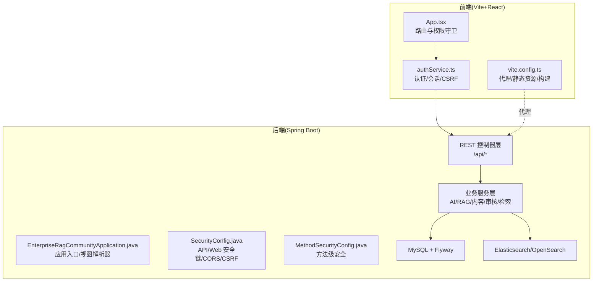
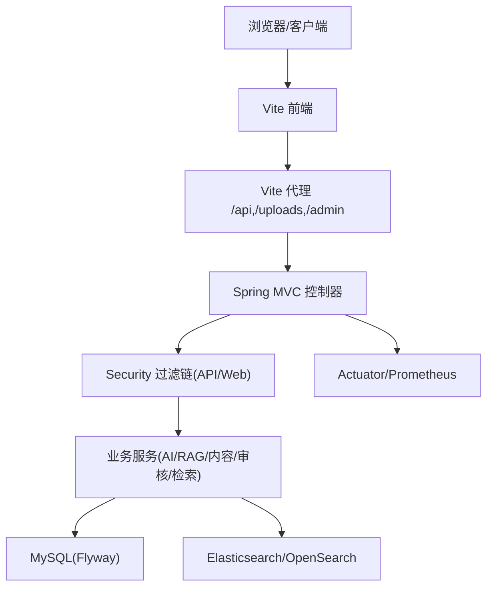
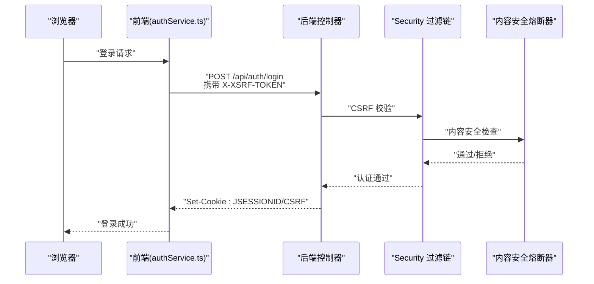
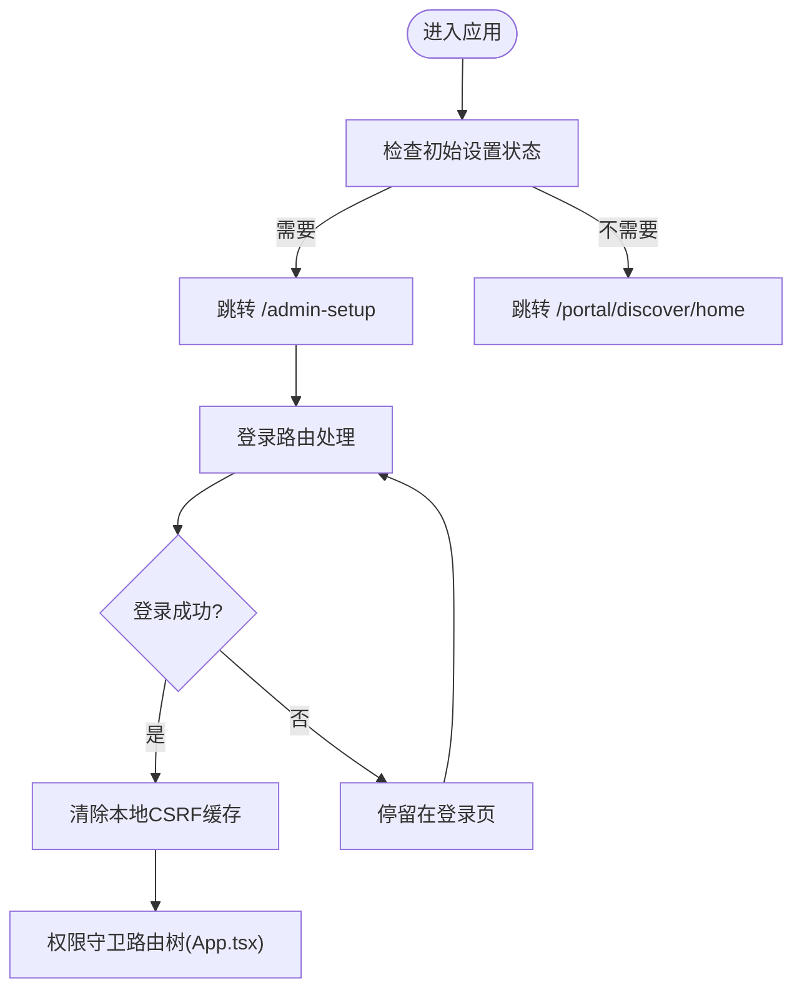
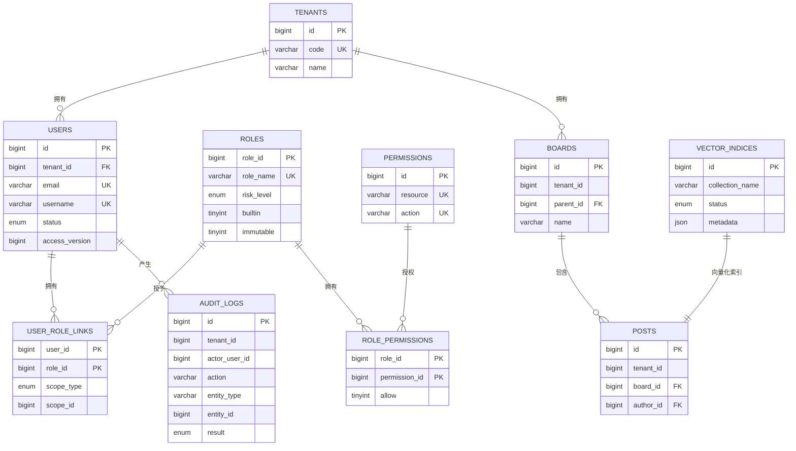
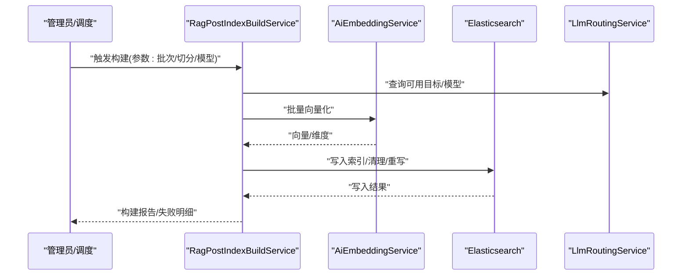
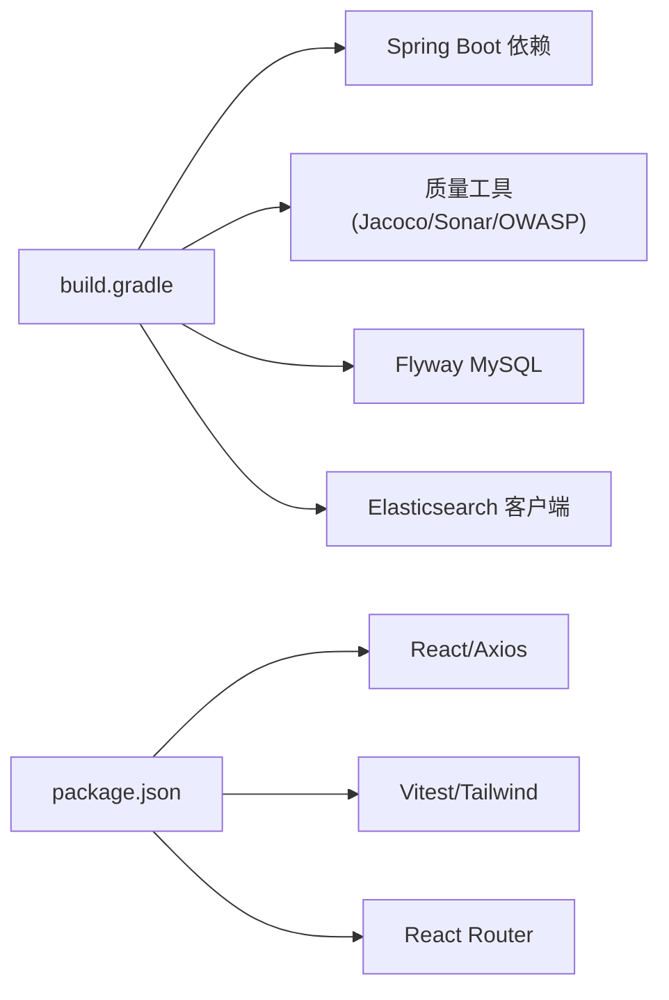

# 架构设计

<cite>
**本文引用的文件**   
- [EnterpriseRagCommunityApplication.java](file://src/main/java/com/example/EnterpriseRagCommunity/EnterpriseRagCommunityApplication.java)
- [build.gradle](file://build.gradle)
- [settings.gradle](file://settings.gradle)
- [application.properties](file://src/main/resources/application.properties)
- [SecurityConfig.java](file://src/main/java/com/example/EnterpriseRagCommunity/config/SecurityConfig.java)
- [MethodSecurityConfig.java](file://src/main/java/com/example/EnterpriseRagCommunity/config/MethodSecurityConfig.java)
- [Vite 应用入口 App.tsx](file://my-vite-app/src/App.tsx)
- [Vite 配置 vite.config.ts](file://my-vite-app/vite.config.ts)
- [包管理与脚本 package.json](file://my-vite-app/package.json)
- [数据库迁移 V1__table_design.sql](file://src/main/resources/db/migration/V1__table_design.sql)
- [LLM 网关 LlmGateway.java](file://src/main/java/com/example/EnterpriseRagCommunity/service/ai/LlmGateway.java)
- [RAG 文章索引构建 RagPostIndexBuildService.java](file://src/main/java/com/example/EnterpriseRagCommunity/service/retrieval/RagPostIndexBuildService.java)
- [认证服务 authService.ts](file://my-vite-app/src/services/authService.ts)
</cite>

## 目录
1. [引言](#引言)
2. [项目结构](#项目结构)
3. [核心组件](#核心组件)
4. [架构总览](#架构总览)
5. [详细组件分析](#详细组件分析)
6. [依赖分析](#依赖分析)
7. [性能考量](#性能考量)
8. [故障排查指南](#故障排查指南)
9. [结论](#结论)
10. [附录](#附录)

## 引言
本文件为企业级 RAG 社区平台的架构设计文档，面向技术与非技术读者，系统阐述系统的高层架构模式、分层设计原则、组件交互关系与数据流。重点覆盖微服务化理念下的前后端分离、安全架构、RAG 检索增强与 AI 能力编排、以及可扩展的模块划分与集成模式。文档同时解释关键技术决策（如 Spring Boot 选型、JSP 视图解析器、CSRF/CORS 策略、Gradle 工程配置）的背景与权衡。

## 项目结构
系统采用“后端 Spring Boot 单体 + 前端 Vite React SPA”的混合架构：
- 后端：基于 Spring Boot 3.x，使用内嵌 Tomcat，打包为 WAR，提供 REST API、安全过滤链、定时任务、Actuator 监控与 Prometheus 指标导出。
- 前端：基于 Vite + React 18 + TypeScript，使用 React Router v7，通过代理将 /api、/uploads、/admin 请求转发至后端，实现前后端分离。
- 数据层：MySQL + Flyway 迁移；Elasticsearch 作为向量检索与全文检索载体；支持 OpenSearch 平台对接。
- 测试与质量：Gradle 集成 JUnit、Jacoco、OWASP Dependency Check、SonarQube；前端 Vitest + 覆盖率工具链。

**图表来源**
- [EnterpriseRagCommunityApplication.java:24-62](file://src/main/java/com/example/EnterpriseRagCommunity/EnterpriseRagCommunityApplication.java#L24-L62)
- [SecurityConfig.java:74-194](file://src/main/java/com/example/EnterpriseRagCommunity/config/SecurityConfig.java#L74-L194)
- [Vite 应用入口 App.tsx:104-323](file://my-vite-app/src/App.tsx#L104-L323)
- [Vite 配置 vite.config.ts:63-78](file://my-vite-app/vite.config.ts#L63-L78)

**章节来源**
- [build.gradle:102-138](file://build.gradle#L102-L138)
- [application.properties:1-84](file://src/main/resources/application.properties#L1-L84)
- [Vite 配置 vite.config.ts:63-78](file://my-vite-app/vite.config.ts#L63-L78)

## 核心组件
- 应用入口与视图解析：后端显式注册 JSP 视图解析器，优先级低于模板引擎，仅对特定逻辑视图名生效，兼顾历史 JSP 页面与现代前端。
- 安全架构：双链路安全过滤链（API/Web），细粒度权限控制（RBAC），CORS/CSRF 配置，会话策略与审计日志。
- 前后端分离：前端通过代理访问后端 /api、/uploads、/admin；认证态通过 Cookie 保持，CSRF 令牌通过 Cookie 暴露并由前端在请求头携带。
- 数据与检索：MySQL Flyway 迁移；RAG 文章索引构建服务负责切分、向量化与写入 ES；LLM 网关负责路由、排队与计费统计。
- 监控与可观测性：Actuator + Prometheus 指标导出，日志滚动策略，访问日志捕获。

**章节来源**
- [EnterpriseRagCommunityApplication.java:37-61](file://src/main/java/com/example/EnterpriseRagCommunity/EnterpriseRagCommunityApplication.java#L37-L61)
- [SecurityConfig.java:74-236](file://src/main/java/com/example/EnterpriseRagCommunity/config/SecurityConfig.java#L74-L236)
- [application.properties:18-84](file://src/main/resources/application.properties#L18-L84)
- [RAG 文章索引构建 RagPostIndexBuildService.java:62-200](file://src/main/java/com/example/EnterpriseRagCommunity/service/retrieval/RagPostIndexBuildService.java#L62-L200)
- [LLM 网关 LlmGateway.java:54-200](file://src/main/java/com/example/EnterpriseRagCommunity/service/ai/LlmGateway.java#L54-L200)

## 架构总览
系统采用“单体后端 + 前端 SPA”的混合微服务风格：后端以模块化服务类组织能力（AI、RAG、内容、审核、检索、监控），前端通过 REST API 与后端交互。安全策略区分 API 与 Web 页面两类流量，分别施加不同过滤链与授权规则。数据层通过 MySQL 与 Elasticsearch/OpenSearch 实现结构化与非结构化数据协同。

**图表来源**
- [Vite 配置 vite.config.ts:63-78](file://my-vite-app/vite.config.ts#L63-L78)
- [SecurityConfig.java:74-194](file://src/main/java/com/example/EnterpriseRagCommunity/config/SecurityConfig.java#L74-L194)
- [application.properties:18-84](file://src/main/resources/application.properties#L18-L84)

## 详细组件分析

### 安全架构与认证流程
- 双链路安全过滤链：
  - API 链（优先级高）：仅匹配 /api/**，开启 CSRF 与 CORS，对认证端点放行，其余需认证。
  - Web 链（优先级低）：匹配其余请求，SPA 路由交由前端处理，CSRF 与 CORS 同样配置。
- 认证与会话：使用表单登录（Web 链）与会话保持；API 链通过 Cookie 与 CSRF 令牌协作，前端在每次请求携带 X-XSRF-TOKEN。
- 权限控制：RBAC 权限矩阵与细粒度权限资源/动作组合，结合方法级安全注解与运行时权限检查。
- 审计与安全门：内容安全熔断器过滤器在请求链中插入，统一处理安全阈值与熔断策略。

**图表来源**
- [认证服务 authService.ts:55-100](file://my-vite-app/src/services/authService.ts#L55-L100)
- [SecurityConfig.java:105-142](file://src/main/java/com/example/EnterpriseRagCommunity/config/SecurityConfig.java#L105-L142)
- [Vite 应用入口 App.tsx:104-126](file://my-vite-app/src/App.tsx#L104-L126)

**章节来源**
- [SecurityConfig.java:74-236](file://src/main/java/com/example/EnterpriseRagCommunity/config/SecurityConfig.java#L74-L236)
- [MethodSecurityConfig.java:1-13](file://src/main/java/com/example/EnterpriseRagCommunity/config/MethodSecurityConfig.java#L1-L13)
- [认证服务 authService.ts:55-100](file://my-vite-app/src/services/authService.ts#L55-L100)

### 前后端分离与路由守卫
- 前端使用 React Router v7，通过 RequireAccess/RequirePermission/RequireModeratedBoards 等组件实现细粒度权限守卫。
- Vite 代理将 /api、/uploads、/admin 请求转发至后端，便于本地联调与跨域场景。
- 初始设置与登录流程：根据后端返回的初始设置状态决定路由跳转，登录成功后清除本地缓存的 CSRF 令牌以便下次获取最新令牌。

**图表来源**
- [Vite 应用入口 App.tsx:104-130](file://my-vite-app/src/App.tsx#L104-L130)
- [Vite 配置 vite.config.ts:63-78](file://my-vite-app/vite.config.ts#L63-L78)
- [认证服务 authService.ts:186-197](file://my-vite-app/src/services/authService.ts#L186-L197)

**章节来源**
- [Vite 应用入口 App.tsx:104-323](file://my-vite-app/src/App.tsx#L104-L323)
- [Vite 配置 vite.config.ts:63-78](file://my-vite-app/vite.config.ts#L63-L78)
- [包管理与脚本 package.json:6-12](file://my-vite-app/package.json#L6-L12)

### 数据模型与系统边界
- 核心实体：租户、用户、角色、权限、会话、审计日志、板块、帖子、向量索引等，体现多租户与 RBAC 设计。
- 系统边界：
  - 外部边界：浏览器/客户端、第三方 AI 提供商、OpenSearch 平台。
  - 内部边界：后端服务层（AI/RAG/内容/审核/检索）、数据存储层（MySQL/Flyway、ES/OpenSearch）。
- 数据流：前端发起 API 请求 → 后端安全过滤 → 业务服务 → 数据库/搜索引擎 → 返回响应。

**图表来源**
- [数据库迁移 V1__table_design.sql:6-200](file://src/main/resources/db/migration/V1__table_design.sql#L6-L200)

**章节来源**
- [数据库迁移 V1__table_design.sql:6-200](file://src/main/resources/db/migration/V1__table_design.sql#L6-L200)

### AI 能力编排与 RAG 检索
- LLM 网关：统一编排多提供商、多模型的聊天/生成请求，支持路由策略、排队与用量统计、思维预算与停止词等参数化能力。
- RAG 文章索引构建：按批次扫描已发布文章，进行文本切分、向量化、写入 ES，支持固定/最后构建/覆盖模型选择与维度校验。
- 检索与重排：结合向量检索与混合检索策略，支持上下文构建与引用溯源。

**图表来源**
- [RAG 文章索引构建 RagPostIndexBuildService.java:62-200](file://src/main/java/com/example/EnterpriseRagCommunity/service/retrieval/RagPostIndexBuildService.java#L62-L200)
- [LLM 网关 LlmGateway.java:54-200](file://src/main/java/com/example/EnterpriseRagCommunity/service/ai/LlmGateway.java#L54-L200)

**章节来源**
- [LLM 网关 LlmGateway.java:54-200](file://src/main/java/com/example/EnterpriseRagCommunity/service/ai/LlmGateway.java#L54-L200)
- [RAG 文章索引构建 RagPostIndexBuildService.java:62-200](file://src/main/java/com/example/EnterpriseRagCommunity/service/retrieval/RagPostIndexBuildService.java#L62-L200)

## 依赖分析
- 后端依赖：Spring Web、Security、Validation、Actuator、Prometheus、JPA、Flyway、Elasticsearch 客户端、邮件、POI/Tika、Tomcat Jasper/JSTL 等。
- 前端依赖：React、React Router、Axios、Tailwind、Testing Library、Vitest、ECharts 等。
- 构建与质量：Gradle 插件包括 Spring Boot、OWASP 依赖检查、SonarQube、Jacoco、Flyway；前端脚本集成覆盖率与分支覆盖率验证。

**图表来源**
- [build.gradle:102-138](file://build.gradle#L102-L138)
- [包管理与脚本 package.json:14-76](file://my-vite-app/package.json#L14-L76)

**章节来源**
- [build.gradle:102-138](file://build.gradle#L102-L138)
- [settings.gradle:1-15](file://settings.gradle#L1-L15)
- [包管理与脚本 package.json:14-76](file://my-vite-app/package.json#L14-L76)

## 性能考量
- 并发与线程：启用虚拟线程，提升并发处理能力；JDBC 连接池参数可调，满足高并发场景。
- 缓存与索引：ES/OpenSearch 作为检索与向量索引载体，结合批处理与分页扫描降低单次压力。
- 监控与指标：Actuator + Prometheus 导出 JVM/应用指标，便于容量规划与性能优化。
- 前端性能：Vite 构建产物按需拆分，路由懒加载减少首屏负担。

[本节为通用指导，无需具体文件分析]

## 故障排查指南
- CSRF 403：确认前端已正确获取并携带 X-XSRF-TOKEN；检查 CSRF 忽略端点与属性名一致性。
- CORS 失败：核对 allowed-origins/allowed-origin-patterns 配置与请求头；确保 Allow-Credentials 与暴露头设置正确。
- 登录后会话异常：检查 Cookie 是否随请求携带；确认会话策略与安全过滤链顺序。
- API 未命中：确认 /api/** 与 /** 的安全链匹配范围；核对权限矩阵与资源/动作授权。
- ES 写入失败：检查 APP_ES_API_KEY 与索引配置；关注构建服务返回的失败明细与维度校验。

**章节来源**
- [SecurityConfig.java:105-142](file://src/main/java/com/example/EnterpriseRagCommunity/config/SecurityConfig.java#L105-L142)
- [application.properties:72-84](file://src/main/resources/application.properties#L72-L84)
- [认证服务 authService.ts:55-100](file://my-vite-app/src/services/authService.ts#L55-L100)
- [RAG 文章索引构建 RagPostIndexBuildService.java:73-77](file://src/main/java/com/example/EnterpriseRagCommunity/service/retrieval/RagPostIndexBuildService.java#L73-L77)

## 结论
本架构以 Spring Boot 为核心，结合 Vite 前端实现前后端分离，通过双链路安全过滤与细粒度 RBAC 实现企业级安全基线；以 LLM 网关与 RAG 索引构建服务支撑智能检索增强；借助 Flyway、ES/OpenSearch 与 Actuator/Prometheus 实现可演进的数据与可观测性能力。该设计在保证安全性与可维护性的同时，兼顾性能与扩展性，适合企业级社区平台的长期发展需求。

[本节为总结性内容，无需具体文件分析]

## 附录
- 关键技术决策说明：
  - Spring Boot：统一依赖管理、自动配置与内嵌容器，简化部署与运维。
  - JSP 视图解析器：保留历史 JSP 页面，通过显式解析器与较低优先级确保与前端路由共存。
  - CSRF/CORS：Cookie 存储 CSRF 令牌并暴露到前端，统一请求头携带，避免跨域与状态不一致问题。
  - Gradle 工程：插件化质量保障与测试聚焦，支持覆盖率与分支覆盖率专项验证。

**章节来源**
- [EnterpriseRagCommunityApplication.java:37-61](file://src/main/java/com/example/EnterpriseRagCommunity/EnterpriseRagCommunityApplication.java#L37-L61)
- [SecurityConfig.java:105-142](file://src/main/java/com/example/EnterpriseRagCommunity/config/SecurityConfig.java#L105-L142)
- [build.gradle:102-138](file://build.gradle#L102-L138)