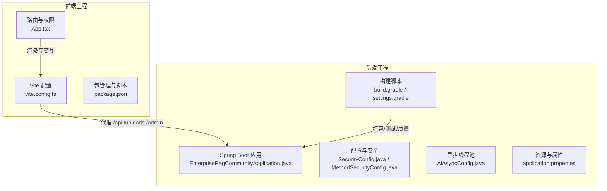
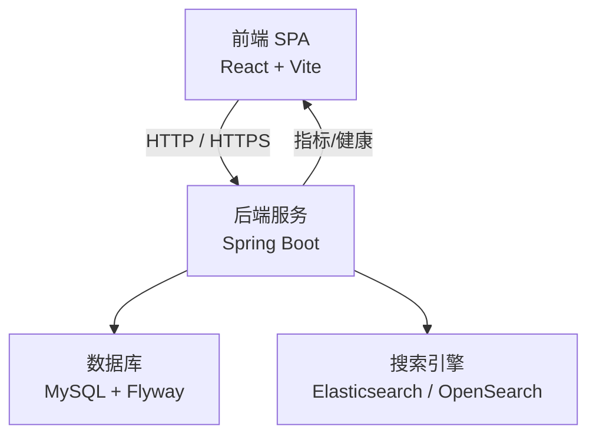
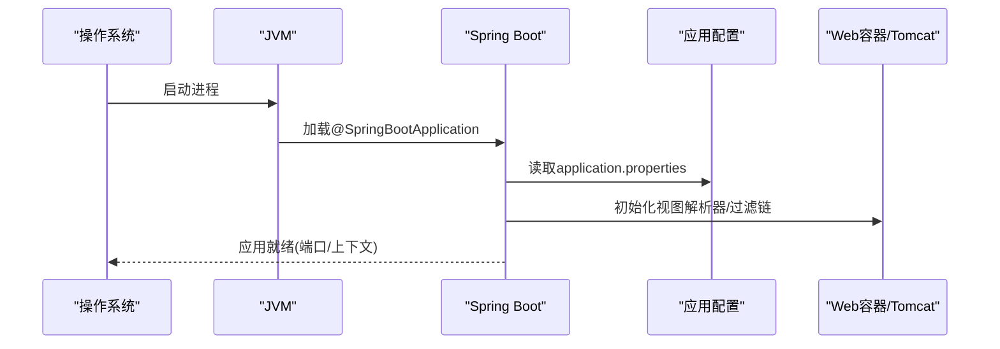
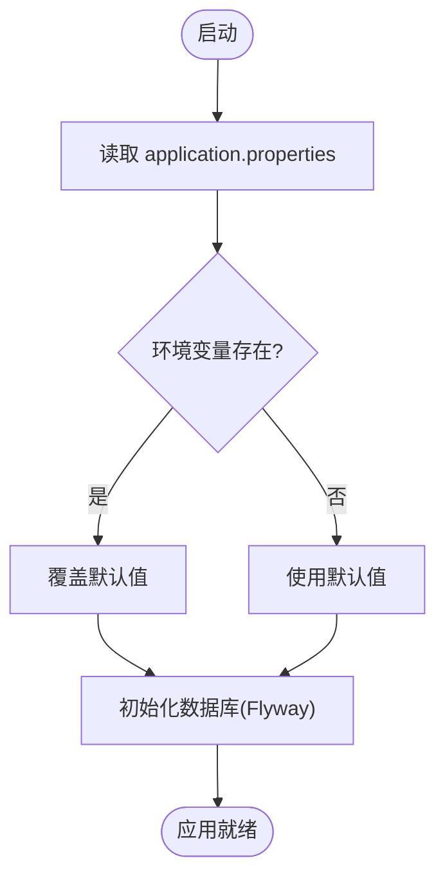
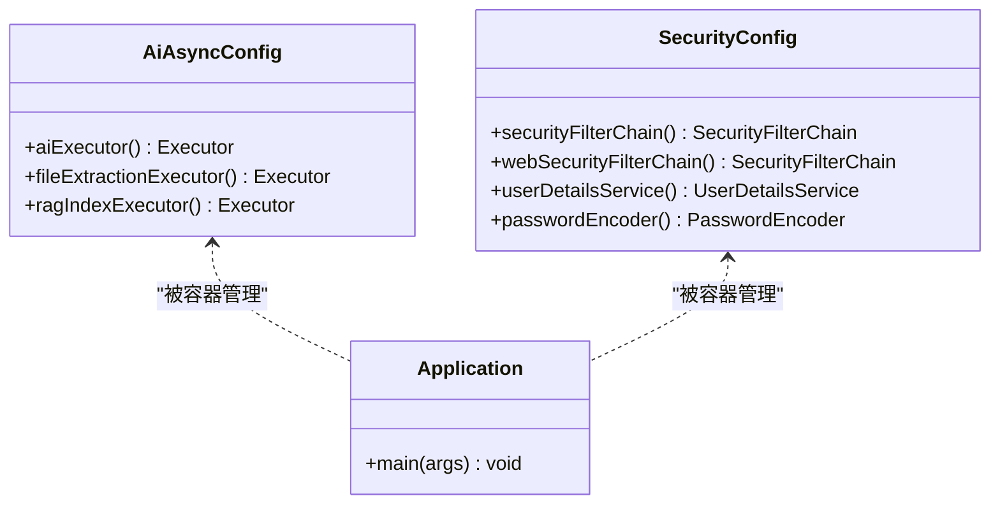
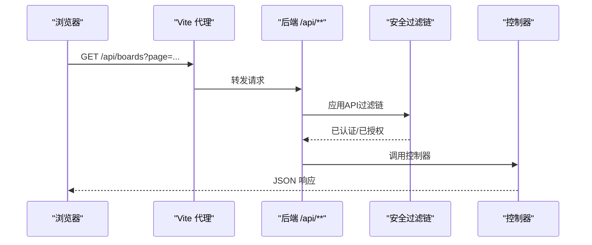
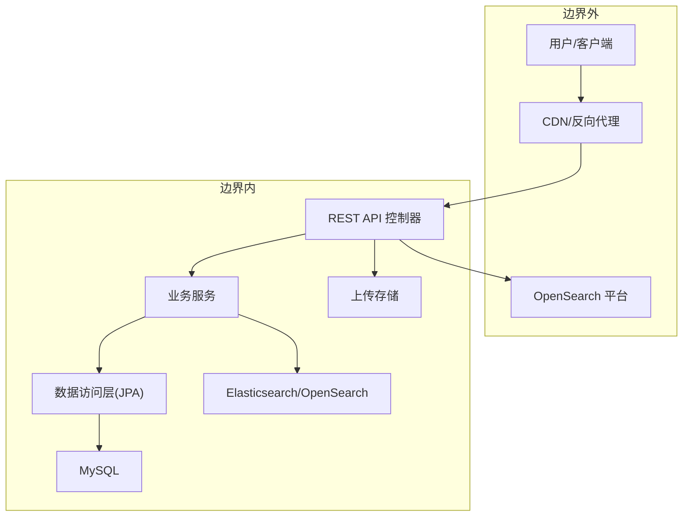
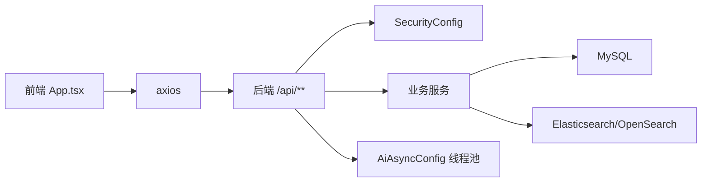
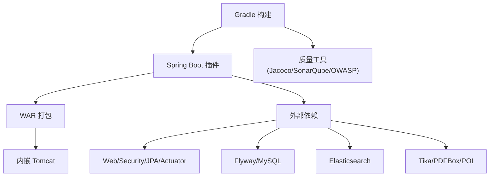

# 系统架构

<cite>
**本文引用的文件**
- [EnterpriseRagCommunityApplication.java](file://src/main/java/com/example/EnterpriseRagCommunity/EnterpriseRagCommunityApplication.java)
- [build.gradle](file://build.gradle)
- [settings.gradle](file://settings.gradle)
- [application.properties](file://src/main/resources/application.properties)
- [SecurityConfig.java](file://src/main/java/com/example/EnterpriseRagCommunity/config/SecurityConfig.java)
- [MethodSecurityConfig.java](file://src/main/java/com/example/EnterpriseRagCommunity/config/MethodSecurityConfig.java)
- [AiAsyncConfig.java](file://src/main/java/com/example/EnterpriseRagCommunity/config/AiAsyncConfig.java)
- [vite.config.ts](file://my-vite-app/vite.config.ts)
- [package.json](file://my-vite-app/package.json)
- [App.tsx](file://my-vite-app/src/App.tsx)
</cite>

## 目录
1. [引言](#引言)
2. [项目结构](#项目结构)
3. [核心组件](#核心组件)
4. [架构总览](#架构总览)
5. [详细组件分析](#详细组件分析)
6. [依赖分析](#依赖分析)
7. [性能考虑](#性能考虑)
8. [故障排查指南](#故障排查指南)
9. [结论](#结论)
10. [附录](#附录)

## 引言
本文件面向RAG社区平台的系统架构文档，围绕基于Spring Boot的后端与React/Vite前端的前后端分离方案展开，重点阐述应用启动流程、配置管理机制、依赖注入容器的使用、RESTful API设计原则、服务间通信机制、系统边界与模块划分、组件依赖关系与扩展性设计，并通过多类架构图展示各层之间的交互关系，说明选择该架构模式的原因及其带来的优势。

## 项目结构
该项目采用“后端Spring Boot + 前端Vite React”的双工程布局：
- 后端工程位于 src/main/java，使用Gradle构建，打包为WAR，内嵌Tomcat运行。
- 前端工程位于 my-vite-app，使用Vite构建，开发时通过代理将 /api、/uploads、/admin 等请求转发至后端8099端口。
- 顶层 settings.gradle 控制插件解析器；根 build.gradle 统一版本与依赖管理，启用Spring Boot插件、Jacoco、SonarQube、OWASP等质量工具。

**图表来源**
- [EnterpriseRagCommunityApplication.java:1-64](file://src/main/java/com/example/EnterpriseRagCommunity/EnterpriseRagCommunityApplication.java#L1-L64)
- [SecurityConfig.java:1-323](file://src/main/java/com/example/EnterpriseRagCommunity/config/SecurityConfig.java#L1-L323)
- [AiAsyncConfig.java:1-47](file://src/main/java/com/example/EnterpriseRagCommunity/config/AiAsyncConfig.java#L1-L47)
- [application.properties:1-84](file://src/main/resources/application.properties#L1-L84)
- [build.gradle:1-120](file://build.gradle#L1-L120)
- [settings.gradle:1-15](file://settings.gradle#L1-L15)
- [vite.config.ts:1-116](file://my-vite-app/vite.config.ts#L1-L116)
- [package.json:1-82](file://my-vite-app/package.json#L1-L82)
- [App.tsx:1-352](file://my-vite-app/src/App.tsx#L1-L352)

**章节来源**
- [build.gradle:1-120](file://build.gradle#L1-L120)
- [settings.gradle:1-15](file://settings.gradle#L1-L15)
- [vite.config.ts:64-78](file://my-vite-app/vite.config.ts#L64-L78)

## 核心组件
- 应用启动与容器
  - 后端入口类启用Spring Boot自动装配、JSP视图解析器、异步支持与分页序列化策略，提供基础的 /home 与 /converted 视图映射，便于早期测试。
  - 构建脚本启用Spring Boot插件、Jacoco、SonarQube、OWASP依赖扫描，统一Java Toolchain与编译参数，配置集成测试任务与覆盖率报告。
- 配置与环境
  - application.properties集中管理数据库连接、Flyway迁移、日志、上传限制、OpenSearch平台参数、AI超时与历史限制等运行期配置，支持通过环境变量覆盖。
- 安全与权限
  - SecurityConfig定义两套过滤链：API链（/api/**）与Web链（/**），分别处理REST接口与SPA页面路由；启用CORS、CSRF、会话策略与方法级鉴权；提供自定义UserDetailsService与BCrypt密码编码器。
  - MethodSecurityConfig启用方法级安全注解（如 @PreAuthorize）。
- 异步执行
  - AiAsyncConfig提供三类线程池：aiExecutor、fileExtractionExecutor、ragIndexExecutor，分别用于AI相关任务、文件提取与RAG索引构建，支持拒绝策略与命名前缀。
- 前端代理与路由
  - vite.config.ts配置开发服务器代理，将 /api、/uploads、/admin 转发到后端；App.tsx定义完整的路由体系与权限守卫组件，结合后端API实现细粒度的访问控制。

**章节来源**
- [EnterpriseRagCommunityApplication.java:20-64](file://src/main/java/com/example/EnterpriseRagCommunity/EnterpriseRagCommunityApplication.java#L20-L64)
- [build.gradle:102-138](file://build.gradle#L102-L138)
- [application.properties:1-84](file://src/main/resources/application.properties#L1-L84)
- [SecurityConfig.java:74-194](file://src/main/java/com/example/EnterpriseRagCommunity/config/SecurityConfig.java#L74-L194)
- [MethodSecurityConfig.java:1-13](file://src/main/java/com/example/EnterpriseRagCommunity/config/MethodSecurityConfig.java#L1-L13)
- [AiAsyncConfig.java:11-46](file://src/main/java/com/example/EnterpriseRagCommunity/config/AiAsyncConfig.java#L11-L46)
- [vite.config.ts:64-78](file://my-vite-app/vite.config.ts#L64-L78)
- [App.tsx:104-323](file://my-vite-app/src/App.tsx#L104-L323)

## 架构总览
系统采用“前后端分离 + 微服务风格单体”的混合架构：
- 前端：React + Vite，SPA路由与权限守卫，开发时通过代理访问后端API。
- 后端：Spring Boot单体应用，提供REST API、安全过滤链、数据访问、定时任务与异步执行能力；通过JPA/Hibernate与MySQL交互，通过Elasticsearch/OpenSearch进行检索增强。
- 部署：打包为WAR，可部署于外部Tomcat或内嵌运行；日志、监控与可观测性通过Actuator与Prometheus集成。

**图表来源**
- [vite.config.ts:64-78](file://my-vite-app/vite.config.ts#L64-L78)
- [application.properties:7-84](file://src/main/resources/application.properties#L7-L84)
- [build.gradle:104-137](file://build.gradle#L104-L137)

## 详细组件分析

### 应用启动流程与容器初始化
- 启动入口：EnterpriseRagCommunityApplication 作为Spring Boot入口，启用异步、分页DTO序列化、JSP视图解析器，并提供受控的JSP端点用于早期验证。
- 容器特性：排除Flyway与Elasticsearch自动配置以配合自定义初始化；开启@EnableSpringDataWebSupport以DTO序列化分页结果；通过ServletInitializer支持WAR部署。
- 构建与测试：Gradle统一管理版本与工具链，启用Jacoco覆盖率、SonarQube质量门禁与OWASP依赖扫描；集成测试任务与聚焦覆盖率任务集。

**图表来源**
- [EnterpriseRagCommunityApplication.java:28-52](file://src/main/java/com/example/EnterpriseRagCommunity/EnterpriseRagCommunityApplication.java#L28-L52)
- [application.properties:1-84](file://src/main/resources/application.properties#L1-L84)
- [build.gradle:37-80](file://build.gradle#L37-L80)

**章节来源**
- [EnterpriseRagCommunityApplication.java:20-64](file://src/main/java/com/example/EnterpriseRagCommunity/EnterpriseRagCommunityApplication.java#L20-L64)
- [build.gradle:102-138](file://build.gradle#L102-L138)

### 配置管理机制
- 环境变量覆盖：数据库、日志、AI超时、OpenSearch平台等均支持通过环境变量注入，便于不同环境差异化配置。
- Flyway迁移：启用迁移、基线版本与编码设置，确保数据库演进一致性。
- 上传与编码：前端上传大小上限与后端form提交上限对齐，字符集统一为UTF-8。
- 动态配置键：预留动态配置主密钥，支持从数据库加载配置（若可用）。

**图表来源**
- [application.properties:1-84](file://src/main/resources/application.properties#L1-L84)

**章节来源**
- [application.properties:1-84](file://src/main/resources/application.properties#L1-L84)

### 依赖注入容器与线程池
- 容器特性：Spring Boot自动装配负责组件扫描、条件装配与Bean生命周期管理；本项目显式注册JSP视图解析器与过滤链，确保与Spring Data Web、异步执行协同工作。
- 线程池：AiAsyncConfig提供三类专用线程池，分别承载AI推理、文件提取与RAG索引任务，支持队列容量、拒绝策略与命名前缀，满足不同任务的吞吐与延迟需求。

**图表来源**
- [AiAsyncConfig.java:11-46](file://src/main/java/com/example/EnterpriseRagCommunity/config/AiAsyncConfig.java#L11-L46)
- [SecurityConfig.java:74-323](file://src/main/java/com/example/EnterpriseRagCommunity/config/SecurityConfig.java#L74-L323)
- [EnterpriseRagCommunityApplication.java:28-35](file://src/main/java/com/example/EnterpriseRagCommunity/EnterpriseRagCommunityApplication.java#L28-L35)

**章节来源**
- [AiAsyncConfig.java:11-46](file://src/main/java/com/example/EnterpriseRagCommunity/config/AiAsyncConfig.java#L11-L46)
- [SecurityConfig.java:74-323](file://src/main/java/com/example/EnterpriseRagCommunity/config/SecurityConfig.java#L74-L323)

### 前后端分离与RESTful API设计
- 前端代理：开发时通过Vite代理将 /api、/uploads、/admin 转发至后端8099端口，避免跨域与本地联调复杂度。
- 路由与权限：App.tsx定义多层级路由与权限守卫，结合后端API实现细粒度的资源与动作控制（如 portal_discover_home:view）。
- 安全策略：后端区分API链与Web链，前者严格认证授权，后者对静态资源与SPA路由放行；CSRF使用Cookie存储并暴露到前端，忽略初始化与认证相关端点。

**图表来源**
- [vite.config.ts:64-78](file://my-vite-app/vite.config.ts#L64-L78)
- [SecurityConfig.java:76-194](file://src/main/java/com/example/EnterpriseRagCommunity/config/SecurityConfig.java#L76-L194)
- [App.tsx:150-286](file://my-vite-app/src/App.tsx#L150-L286)

**章节来源**
- [vite.config.ts:64-78](file://my-vite-app/vite.config.ts#L64-L78)
- [SecurityConfig.java:76-194](file://src/main/java/com/example/EnterpriseRagCommunity/config/SecurityConfig.java#L76-L194)
- [App.tsx:150-286](file://my-vite-app/src/App.tsx#L150-L286)

### 系统边界与模块划分
- 系统边界
  - 外部边界：浏览器/移动端客户端、CDN/反向代理、邮件服务、OpenSearch平台。
  - 内部边界：后端REST API、数据库、搜索引擎、文件上传存储。
- 模块划分
  - 控制层：按功能域拆分（认证、内容、检索、审核、监控、安全等），每个域下包含控制器、DTO、实体与服务。
  - 服务层：封装业务规则与跨域操作（如AI推理、检索、审核流水线、通知等）。
  - 数据访问层：JPA Repository + Flyway迁移，统一实体模型与数据库演进。
  - 配置层：安全、异步、数据源、搜索引擎、日志等集中配置。

**图表来源**
- [application.properties:72-84](file://src/main/resources/application.properties#L72-L84)
- [build.gradle:104-137](file://build.gradle#L104-L137)

**章节来源**
- [application.properties:72-84](file://src/main/resources/application.properties#L72-L84)
- [build.gradle:104-137](file://build.gradle#L104-L137)

### 组件依赖关系与扩展性设计
- 依赖关系
  - 前端通过 axios 与后端交互；路由守卫与权限上下文在前端维护，后端提供细粒度权限与CSRF保护。
  - 后端通过JPA与MySQL交互，通过Elasticsearch/OpenSearch进行检索增强；异步线程池隔离不同负载类型。
- 扩展性设计
  - 单体应用内按功能域模块化，便于独立演进；可通过引入消息队列/事件总线实现跨模块解耦（当前未见实现，但具备扩展空间）。
  - 配置集中化与环境变量覆盖，便于容器化与多环境部署。

**图表来源**
- [App.tsx:1-352](file://my-vite-app/src/App.tsx#L1-L352)
- [SecurityConfig.java:74-194](file://src/main/java/com/example/EnterpriseRagCommunity/config/SecurityConfig.java#L74-L194)
- [AiAsyncConfig.java:11-46](file://src/main/java/com/example/EnterpriseRagCommunity/config/AiAsyncConfig.java#L11-L46)

**章节来源**
- [App.tsx:1-352](file://my-vite-app/src/App.tsx#L1-L352)
- [SecurityConfig.java:74-194](file://src/main/java/com/example/EnterpriseRagCommunity/config/SecurityConfig.java#L74-L194)
- [AiAsyncConfig.java:11-46](file://src/main/java/com/example/EnterpriseRagCommunity/config/AiAsyncConfig.java#L11-L46)

## 依赖分析
- 外部依赖
  - Spring Boot Starter Web/Security/JPA/Actuator/Validation，Tomcat内嵌，JSP引擎与JSTL支持。
  - Flyway数据库迁移，MySQL驱动，Elasticsearch客户端，Apache Tika/PDFBox/POI等文件处理库。
- 构建与质量
  - Gradle统一版本与工具链，Jacoco覆盖率、SonarQube质量门禁、OWASP依赖扫描；集成测试任务与聚焦覆盖率任务集。

**图表来源**
- [build.gradle:102-138](file://build.gradle#L102-L138)
- [build.gradle:229-267](file://build.gradle#L229-L267)

**章节来源**
- [build.gradle:102-138](file://build.gradle#L102-L138)
- [build.gradle:229-267](file://build.gradle#L229-L267)

## 性能考虑
- 异步与并发
  - 通过专用线程池隔离AI推理、文件提取与RAG索引任务，避免相互阻塞；合理设置队列容量与拒绝策略。
- 数据访问
  - Flyway保证数据库演进一致性；JPA与连接池参数（最大池大小、空闲超时、最大生存时间）需结合业务峰值调优。
- 搜索与检索
  - Elasticsearch/OpenSearch连接与读写超时参数需根据上游LLM与检索规模调整；索引策略与分片/副本配置影响查询延迟。
- 前端体验
  - Vite生产构建优化资源分包与缓存；路由懒加载减少首屏负担；代理仅在开发环境启用，生产通过反向代理统一入口。

[本节为通用指导，不直接分析具体文件]

## 故障排查指南
- 认证与权限
  - 若出现403 CSRF错误，检查前端是否正确携带 _csrf 属性；确认CSRF忽略列表与Cookie策略；核对后端过滤链顺序与自定义过滤器插入位置。
- 跨域与代理
  - 前端代理仅在开发环境生效；生产环境需通过反向代理配置CORS与静态资源访问。
- 数据库与迁移
  - Flyway迁移失败时，检查基线版本、编码与目标库连通性；必要时手动清理迁移元数据或调整基线策略。
- 日志与可观测性
  - application.properties中配置的日志文件与滚动策略；通过Actuator端点与Prometheus导出指标辅助定位问题。

**章节来源**
- [SecurityConfig.java:105-142](file://src/main/java/com/example/EnterpriseRagCommunity/config/SecurityConfig.java#L105-L142)
- [vite.config.ts:64-78](file://my-vite-app/vite.config.ts#L64-L78)
- [application.properties:18-25](file://src/main/resources/application.properties#L18-L25)
- [application.properties:40-48](file://src/main/resources/application.properties#L40-L48)

## 结论
本架构以Spring Boot单体为核心，结合React/Vite前端与完善的配置、安全与异步执行机制，实现了清晰的系统边界与模块划分。通过前后端分离与代理联调、细粒度权限控制与CSRF防护、集中化配置与数据库迁移，既满足快速迭代的敏捷需求，又为未来扩展（如引入消息队列、分布式改造）预留了空间。该模式在保证开发效率的同时，兼顾了安全性、可维护性与可扩展性。

[本节为总结性内容，不直接分析具体文件]

## 附录
- 开发与测试
  - 前端：npm scripts 提供 dev/build/lint/test；集成Vitest与覆盖率生成。
  - 后端：Gradle聚焦覆盖率任务与集成测试，统一测试输出与报告格式。

**章节来源**
- [package.json:6-13](file://my-vite-app/package.json#L6-L13)
- [build.gradle:140-180](file://build.gradle#L140-L180)
- [build.gradle:229-267](file://build.gradle#L229-L267)