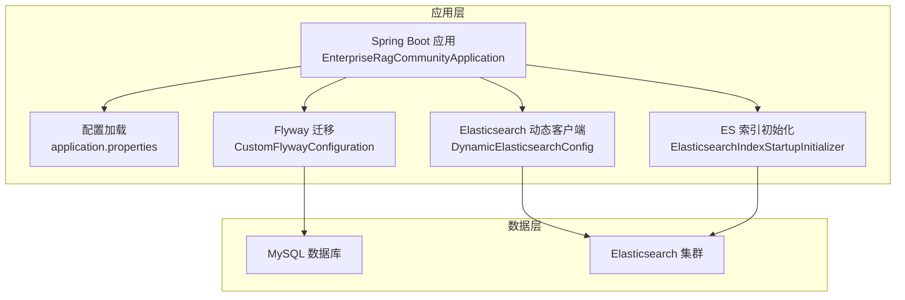
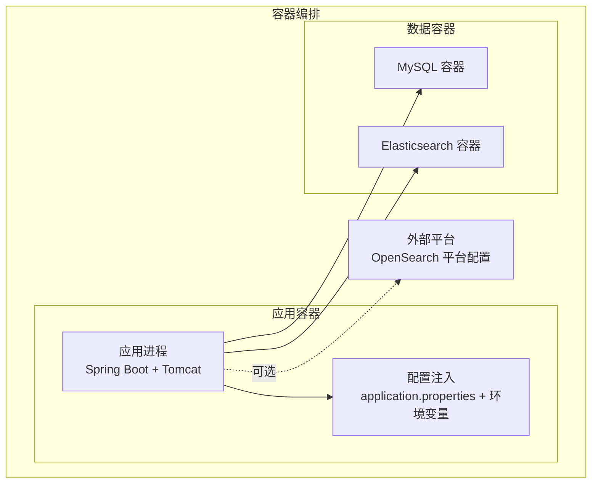
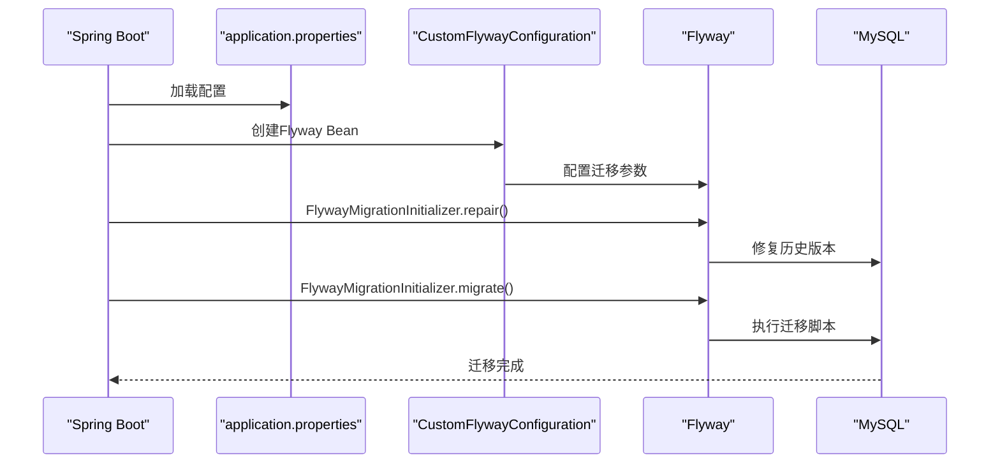
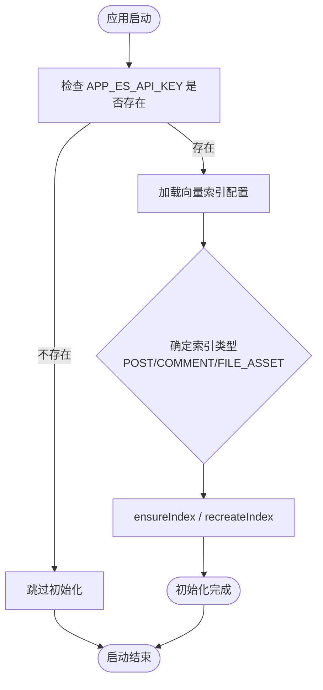
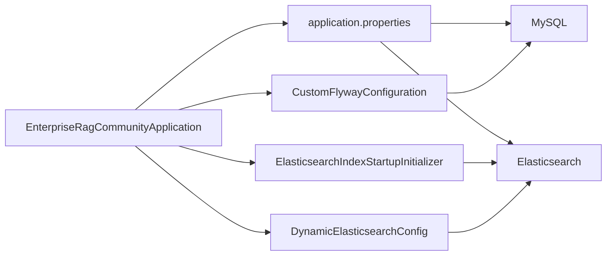

# 部署架构

<cite>
**本文引用的文件**
- [application.properties](file://src/main/resources/application.properties)
- [build.gradle](file://build.gradle)
- [EnterpriseRagCommunityApplication.java](file://src/main/java/com/example/EnterpriseRagCommunity/EnterpriseRagCommunityApplication.java)
- [CustomFlywayConfiguration.java](file://src/main/java/com/example/EnterpriseRagCommunity/config/CustomFlywayConfiguration.java)
- [DynamicElasticsearchConfig.java](file://src/main/java/com/example/EnterpriseRagCommunity/config/DynamicElasticsearchConfig.java)
- [ElasticsearchIndexStartupInitializer.java](file://src/main/java/com/example/EnterpriseRagCommunity/config/ElasticsearchIndexStartupInitializer.java)
- [V1__table_design.sql](file://src/main/resources/db/migration/V1__table_design.sql)
- [V3__system_default_configs.sql](file://src/main/resources/db/migration/V3__system_default_configs.sql)
- [gradle.properties](file://gradle.properties)
</cite>

## 目录
1. [简介](#简介)
2. [项目结构](#项目结构)
3. [核心组件](#核心组件)
4. [架构总览](#架构总览)
5. [详细组件分析](#详细组件分析)
6. [依赖关系分析](#依赖关系分析)
7. [性能考量](#性能考量)
8. [故障排查指南](#故障排查指南)
9. [结论](#结论)
10. [附录](#附录)

## 简介
本文件面向RAG社区平台的部署与运维团队，提供基于Docker容器化的完整部署架构说明，覆盖数据库迁移（Flyway）、Elasticsearch索引初始化、CI/CD流水线设计、环境配置管理、负载均衡与高可用策略、监控告警与故障恢复，以及蓝绿部署、滚动更新与灾难恢复实践建议。文档以代码为依据，结合实际配置文件与启动流程，帮助读者快速理解并落地生产级部署。

## 项目结构
- 应用采用Spring Boot内嵌Tomcat的WAR打包方式，支持传统容器化部署与云原生编排。
- 数据持久化使用MySQL，通过Flyway进行版本化迁移。
- 搜索与RAG能力基于Elasticsearch，提供动态配置与启动时索引初始化。
- 配置通过application.properties与环境变量注入，支持运行时动态切换。

**图表来源**
- [EnterpriseRagCommunityApplication.java:20-24](file://src/main/java/com/example/EnterpriseRagCommunity/EnterpriseRagCommunityApplication.java#L20-L24)
- [application.properties:1-84](file://src/main/resources/application.properties#L1-L84)
- [CustomFlywayConfiguration.java:13-49](file://src/main/java/com/example/EnterpriseRagCommunity/config/CustomFlywayConfiguration.java#L13-L49)
- [DynamicElasticsearchConfig.java:24-128](file://src/main/java/com/example/EnterpriseRagCommunity/config/DynamicElasticsearchConfig.java#L24-L128)
- [ElasticsearchIndexStartupInitializer.java:27-240](file://src/main/java/com/example/EnterpriseRagCommunity/config/ElasticsearchIndexStartupInitializer.java#L27-L240)

**章节来源**
- [EnterpriseRagCommunityApplication.java:20-24](file://src/main/java/com/example/EnterpriseRagCommunity/EnterpriseRagCommunityApplication.java#L20-L24)
- [application.properties:1-84](file://src/main/resources/application.properties#L1-L84)

## 核心组件
- 应用启动与容器化
  - Spring Boot应用通过@SpringBootApplication启动，排除Flyway与Elasticsearch自动配置，以便自定义初始化流程。
  - WAR打包，适合Docker容器中运行于传统应用服务器或直接以Spring Boot方式运行。
- 数据库迁移（Flyway）
  - 通过CustomFlywayConfiguration自定义迁移行为，支持修复与迁移的组合调用，并映射常用属性。
  - application.properties中启用Flyway并指定迁移脚本位置与基线策略。
- Elasticsearch集成
  - DynamicElasticsearchConfig提供动态RestClient代理，支持运行时刷新配置（如API Key、集群地址）。
  - ElasticsearchIndexStartupInitializer在应用启动时根据配置创建/校验索引，支持强制重建与失败策略。
- 配置管理
  - application.properties集中管理数据库、日志、上传、AI网关、Elasticsearch等配置项，支持通过环境变量覆盖。
  - gradle.properties提供Flyway本地连接参数，便于本地开发与CI环境。

**章节来源**
- [EnterpriseRagCommunityApplication.java:20-24](file://src/main/java/com/example/EnterpriseRagCommunity/EnterpriseRagCommunityApplication.java#L20-L24)
- [CustomFlywayConfiguration.java:13-49](file://src/main/java/com/example/EnterpriseRagCommunity/config/CustomFlywayConfiguration.java#L13-L49)
- [DynamicElasticsearchConfig.java:24-128](file://src/main/java/com/example/EnterpriseRagCommunity/config/DynamicElasticsearchConfig.java#L24-L128)
- [ElasticsearchIndexStartupInitializer.java:27-240](file://src/main/java/com/example/EnterpriseRagCommunity/config/ElasticsearchIndexStartupInitializer.java#L27-L240)
- [application.properties:1-84](file://src/main/resources/application.properties#L1-L84)
- [gradle.properties:10-12](file://gradle.properties#L10-L12)

## 架构总览
下图展示了容器化部署中的关键组件交互：应用容器、数据库容器、搜索引擎容器，以及外部依赖（如OpenSearch平台配置）。

**图表来源**
- [application.properties:7-84](file://src/main/resources/application.properties#L7-L84)
- [EnterpriseRagCommunityApplication.java:20-24](file://src/main/java/com/example/EnterpriseRagCommunity/EnterpriseRagCommunityApplication.java#L20-L24)

## 详细组件分析

### 数据库迁移（Flyway）流程
- 启动阶段
  - Spring Boot加载application.properties，启用Flyway并读取迁移脚本位置。
  - CustomFlywayConfiguration创建Flyway实例，映射常用属性，避免使用已移除的cleanOnValidationError。
  - FlywayMigrationInitializer先repair再migrate，确保历史版本与当前脚本一致。
- 迁移脚本
  - V1__table_design.sql：初始化核心业务表结构（用户、角色、权限、内容、RAG、审核等）。
  - V3__system_default_configs.sql：初始化系统默认配置（权限、角色、RAG与Hybrid检索配置、风险标签、支持语言等）。
- 本地开发
  - gradle.properties提供Flyway本地连接参数，便于本地或CI环境执行迁移。

**图表来源**
- [application.properties:18-24](file://src/main/resources/application.properties#L18-L24)
- [CustomFlywayConfiguration.java:17-48](file://src/main/java/com/example/EnterpriseRagCommunity/config/CustomFlywayConfiguration.java#L17-L48)
- [gradle.properties:10-12](file://gradle.properties#L10-L12)

**章节来源**
- [application.properties:18-24](file://src/main/resources/application.properties#L18-L24)
- [CustomFlywayConfiguration.java:13-49](file://src/main/java/com/example/EnterpriseRagCommunity/config/CustomFlywayConfiguration.java#L13-L49)
- [V1__table_design.sql:1-800](file://src/main/resources/db/migration/V1__table_design.sql#L1-L800)
- [V3__system_default_configs.sql:1-691](file://src/main/resources/db/migration/V3__system_default_configs.sql#L1-L691)
- [gradle.properties:10-12](file://gradle.properties#L10-L12)

### Elasticsearch索引初始化流程
- 启动初始化
  - ElasticsearchIndexStartupInitializer在应用启动时检查APP_ES_API_KEY是否存在，若缺失则跳过初始化。
  - 根据vector_indices与RAG配置决定索引名称与维度，支持强制重建与兼容性校验。
  - 对不同sourceType（POST/COMMENT/FILE_ASSET）选择对应的IndexService进行ensure/recreate。
- 动态配置
  - DynamicElasticsearchConfig提供RestClient代理，支持运行时刷新（如API Key变化），并优雅关闭旧连接。
- 失败策略
  - 可配置fail-on-error，若开启则初始化失败抛出异常；否则记录警告并继续启动。

**图表来源**
- [ElasticsearchIndexStartupInitializer.java:57-191](file://src/main/java/com/example/EnterpriseRagCommunity/config/ElasticsearchIndexStartupInitializer.java#L57-L191)
- [DynamicElasticsearchConfig.java:57-79](file://src/main/java/com/example/EnterpriseRagCommunity/config/DynamicElasticsearchConfig.java#L57-L79)

**章节来源**
- [ElasticsearchIndexStartupInitializer.java:27-240](file://src/main/java/com/example/EnterpriseRagCommunity/config/ElasticsearchIndexStartupInitializer.java#L27-L240)
- [DynamicElasticsearchConfig.java:24-128](file://src/main/java/com/example/EnterpriseRagCommunity/config/DynamicElasticsearchConfig.java#L24-L128)

### 配置管理与环境变量
- application.properties
  - 数据库连接、连接池参数、Flyway配置、日志、文件上传、AI网关、Elasticsearch客户端超时与认证等。
  - 支持通过环境变量覆盖（如DB_USERNAME、DB_PASSWORD、SPRING_ELASTICSEARCH_USERNAME等）。
- gradle.properties
  - 提供Flyway本地连接参数（URL、用户、密码），便于本地或CI执行迁移。

**章节来源**
- [application.properties:1-84](file://src/main/resources/application.properties#L1-L84)
- [gradle.properties:10-12](file://gradle.properties#L10-L12)

### CI/CD流水线设计
- 构建与测试
  - Gradle插件与依赖管理，包含Spring Boot、Flyway、Actuator与Prometheus集成，便于健康检查与指标导出。
  - 测试任务与Jacoco覆盖率报告生成，支持聚焦测试与覆盖率验证。
- 部署策略
  - Docker容器化：应用以WAR或Spring Boot方式运行，结合数据库与搜索引擎容器。
  - 蓝绿部署：通过两套应用实例与反向代理切换，零停机发布。
  - 滚动更新：逐批替换实例，配合健康检查与就绪探针。
  - 灾难恢复：备份数据库与Elasticsearch索引，结合自动化脚本与回滚策略。

[本节为概念性说明，不直接分析具体文件]

### 负载均衡与高可用
- 反向代理与负载均衡
  - 使用Nginx或云负载均衡器分发流量至多个应用实例，实现高可用与弹性伸缩。
- 数据高可用
  - MySQL主从复制或云托管高可用方案，配合Flyway迁移一致性保障。
- 搜索高可用
  - Elasticsearch集群部署，索引副本与分片合理配置，结合动态客户端与启动初始化。

[本节为概念性说明，不直接分析具体文件]

### 监控与告警
- 指标导出
  - Actuator与Prometheus集成，暴露JVM与业务指标，便于Prometheus抓取。
- 健康检查
  - 应用提供健康端点，结合容器编排的存活/就绪探针。
- 告警策略
  - 基于Prometheus Alertmanager或云监控平台，设置数据库连接、Elasticsearch可用性、应用响应时间与错误率等告警。

[本节为概念性说明，不直接分析具体文件]

## 依赖关系分析

**图表来源**
- [EnterpriseRagCommunityApplication.java:20-24](file://src/main/java/com/example/EnterpriseRagCommunity/EnterpriseRagCommunityApplication.java#L20-L24)
- [CustomFlywayConfiguration.java:13-49](file://src/main/java/com/example/EnterpriseRagCommunity/config/CustomFlywayConfiguration.java#L13-L49)
- [DynamicElasticsearchConfig.java:24-128](file://src/main/java/com/example/EnterpriseRagCommunity/config/DynamicElasticsearchConfig.java#L24-L128)
- [ElasticsearchIndexStartupInitializer.java:27-240](file://src/main/java/com/example/EnterpriseRagCommunity/config/ElasticsearchIndexStartupInitializer.java#L27-L240)
- [application.properties:1-84](file://src/main/resources/application.properties#L1-L84)

**章节来源**
- [EnterpriseRagCommunityApplication.java:20-24](file://src/main/java/com/example/EnterpriseRagCommunity/EnterpriseRagCommunityApplication.java#L20-L24)
- [application.properties:1-84](file://src/main/resources/application.properties#L1-L84)

## 性能考量
- 数据库连接池
  - 合理设置最大连接数、最小空闲、连接超时与空闲生命周期，避免连接争用与泄漏。
- 搜索索引
  - 根据sourceType与embedding维度选择合适的索引策略，必要时启用IK分词与副本提升可用性。
- 应用并发
  - 开启虚拟线程与合理的线程池配置，结合异步任务与限流策略，提升吞吐与稳定性。

[本节为一般性指导，不直接分析具体文件]

## 故障排查指南
- 数据库迁移失败
  - 检查Flyway配置与脚本位置，确认repair后再migrate；核对数据库连接与权限。
- Elasticsearch初始化失败
  - 确认APP_ES_API_KEY已配置；检查embedding维度与索引mapping一致性；必要时启用force-recreate。
- 动态配置不生效
  - 确认DynamicElasticsearchConfig的refresh调用时机；检查API Key与集群地址解析。
- 启动异常
  - 查看日志级别与文件滚动策略；定位异常堆栈并结合相关配置项进行修正。

**章节来源**
- [CustomFlywayConfiguration.java:42-48](file://src/main/java/com/example/EnterpriseRagCommunity/config/CustomFlywayConfiguration.java#L42-L48)
- [ElasticsearchIndexStartupInitializer.java:61-69](file://src/main/java/com/example/EnterpriseRagCommunity/config/ElasticsearchIndexStartupInitializer.java#L61-L69)
- [DynamicElasticsearchConfig.java:57-79](file://src/main/java/com/example/EnterpriseRagCommunity/config/DynamicElasticsearchConfig.java#L57-L79)
- [application.properties:46-51](file://src/main/resources/application.properties#L46-L51)

## 结论
本文基于代码与配置文件，系统梳理了RAG社区平台的容器化部署策略、数据库迁移与Elasticsearch索引初始化流程，并给出了CI/CD、负载均衡、高可用、监控告警与故障恢复的实践建议。通过Flyway与自定义初始化流程，确保数据库与搜索基础设施的可演进与可恢复；通过动态配置与启动初始化，提升运行时灵活性与健壮性。

## 附录
- 关键配置项速览
  - 数据库：驱动、URL、用户名、密码、连接池参数、字符集与时区。
  - Flyway：启用、脚本位置、基线策略、编码与缺失位置处理。
  - 日志：文件路径、滚动策略、级别与捕获体大小。
  - 文件上传：大小限制与表单提交上限。
  - AI网关：连接与读超时、默认历史限制。
  - Elasticsearch：连接与Socket超时、认证、客户端配置。
  - OpenSearch平台：主机、工作空间、服务ID、超时与鉴权。

**章节来源**
- [application.properties:1-84](file://src/main/resources/application.properties#L1-L84)