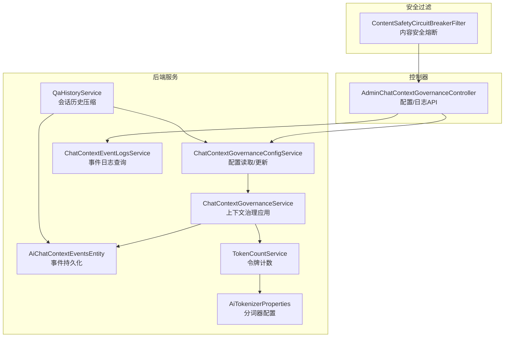
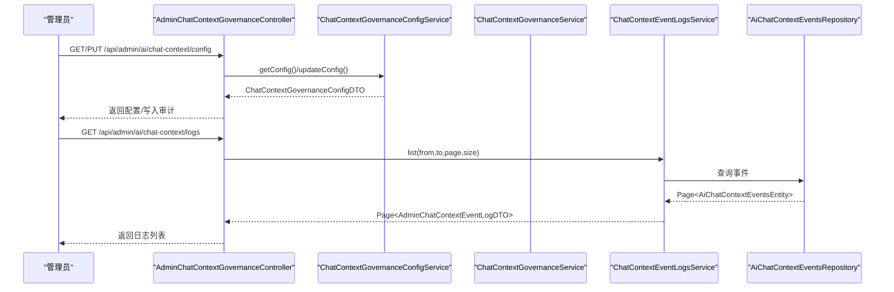
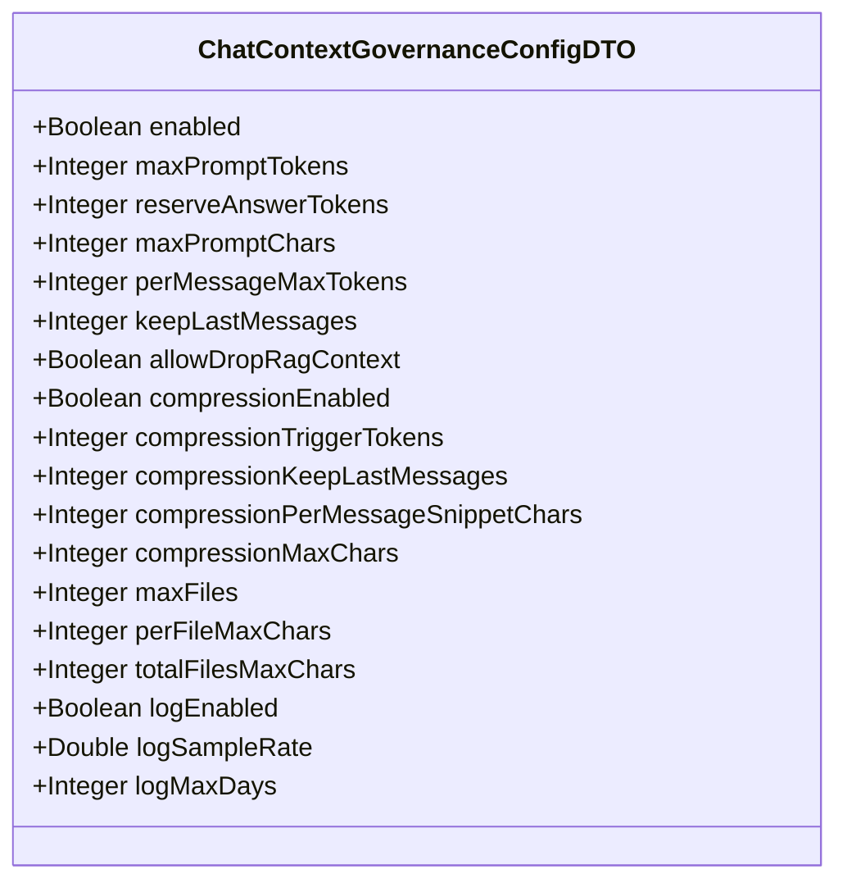
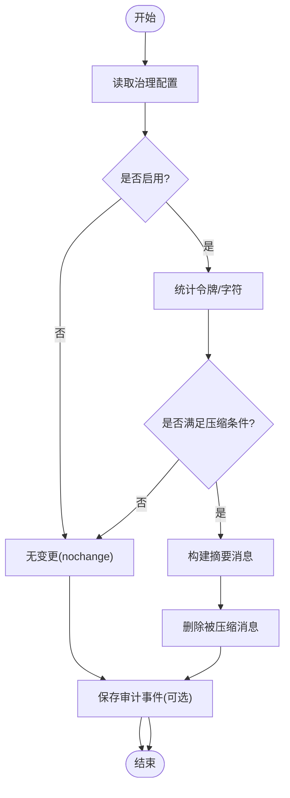
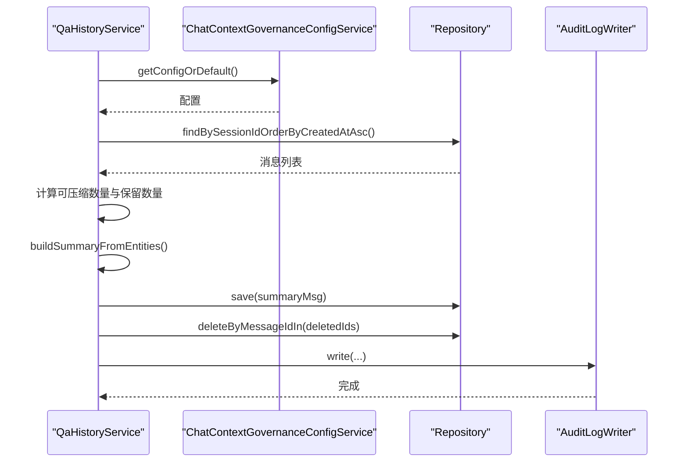
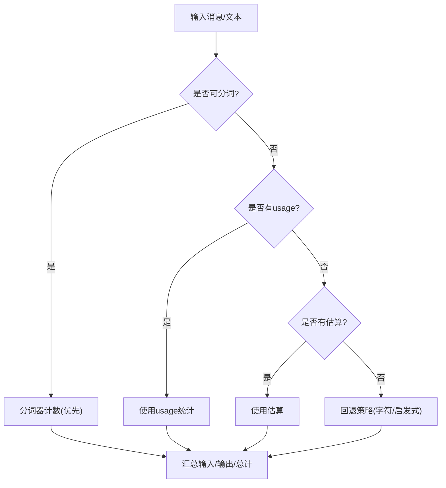
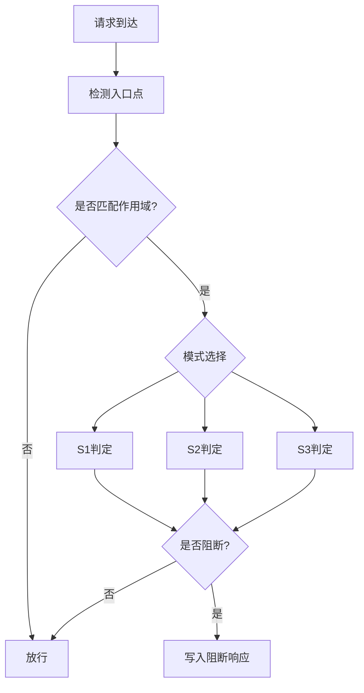
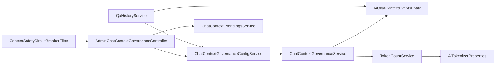

# AI上下文治理

<cite>
**本文档引用的文件**
- [ChatContextGovernanceConfigDTO.java](file://src/main/java/com/example/EnterpriseRagCommunity/dto/ai/ChatContextGovernanceConfigDTO.java)
- [ChatContextGovernanceService.java](file://src/main/java/com/example/EnterpriseRagCommunity/service/ai/ChatContextGovernanceService.java)
- [ChatContextGovernanceConfigService.java](file://src/main/java/com/example/EnterpriseRagCommunity/service/ai/ChatContextGovernanceConfigService.java)
- [AdminChatContextGovernanceController.java](file://src/main/java/com/example/EnterpriseRagCommunity/controller/ai/admin/AdminChatContextGovernanceController.java)
- [QaHistoryService.java](file://src/main/java/com/example/EnterpriseRagCommunity/service/ai/QaHistoryService.java)
- [AiChatContextEventsEntity.java](file://src/main/java/com/example/EnterpriseRagCommunity/entity/ai/AiChatContextEventsEntity.java)
- [ChatContextEventLogsService.java](file://src/main/java/com/example/EnterpriseRagCommunity/service/ai/admin/ChatContextEventLogsService.java)
- [ContentSafetyCircuitBreakerFilter.java](file://src/main/java/com/example/EnterpriseRagCommunity/security/ContentSafetyCircuitBreakerFilter.java)
- [AiTokenizerProperties.java](file://src/main/java/com/example/EnterpriseRagCommunity/config/AiTokenizerProperties.java)
- [TokenCountService.java](file://src/main/java/com/example/EnterpriseRagCommunity/service/ai/TokenCountService.java)
- [ChatContextGovernanceServiceTest.java](file://src/test/java/com/example/EnterpriseRagCommunity/service/ai/ChatContextGovernanceServiceTest.java)
- [QaHistoryServiceCompressContextTest.java](file://src/test/java/com/example/EnterpriseRagCommunity/service/ai/QaHistoryServiceCompressContextTest.java)
</cite>

## 目录
1. [引言](#引言)
2. [项目结构](#项目结构)
3. [核心组件](#核心组件)
4. [架构总览](#架构总览)
5. [详细组件分析](#详细组件分析)
6. [依赖关系分析](#依赖关系分析)
7. [性能考量](#性能考量)
8. [故障排查指南](#故障排查指南)
9. [结论](#结论)
10. [附录](#附录)

## 引言
本文件面向AI上下文治理体系的管理员与开发者，系统性阐述聊天上下文治理机制与最佳实践。内容覆盖上下文长度控制、敏感信息过滤、历史记录管理、压缩与优化算法、配置策略、API接口规范以及与内容安全系统的集成方式。通过代码级分析与可视化图示，帮助您建立可操作、可审计、可扩展的AI内容管理策略。

## 项目结构
围绕AI上下文治理的关键模块主要分布在后端服务层与控制器层，前端通过管理界面调用相关API进行配置与审计。

**图表来源**
- [AdminChatContextGovernanceController.java:1-100](file://src/main/java/com/example/EnterpriseRagCommunity/controller/ai/admin/AdminChatContextGovernanceController.java#L1-L100)
- [ChatContextGovernanceConfigService.java:1-33](file://src/main/java/com/example/EnterpriseRagCommunity/service/ai/ChatContextGovernanceConfigService.java#L1-L33)
- [ChatContextGovernanceService.java:1-38](file://src/main/java/com/example/EnterpriseRagCommunity/service/ai/ChatContextGovernanceService.java#L1-L38)
- [QaHistoryService.java:1-461](file://src/main/java/com/example/EnterpriseRagCommunity/service/ai/QaHistoryService.java#L1-L461)
- [ChatContextEventLogsService.java:1-84](file://src/main/java/com/example/EnterpriseRagCommunity/service/ai/admin/ChatContextEventLogsService.java#L1-L84)
- [AiChatContextEventsEntity.java:1-76](file://src/main/java/com/example/EnterpriseRagCommunity/entity/ai/AiChatContextEventsEntity.java#L1-L76)
- [TokenCountService.java:171-234](file://src/main/java/com/example/EnterpriseRagCommunity/service/ai/TokenCountService.java#L171-L234)
- [AiTokenizerProperties.java:1-14](file://src/main/java/com/example/EnterpriseRagCommunity/config/AiTokenizerProperties.java#L1-L14)
- [ContentSafetyCircuitBreakerFilter.java:1-242](file://src/main/java/com/example/EnterpriseRagCommunity/security/ContentSafetyCircuitBreakerFilter.java#L1-L242)

**章节来源**
- [AdminChatContextGovernanceController.java:1-100](file://src/main/java/com/example/EnterpriseRagCommunity/controller/ai/admin/AdminChatContextGovernanceController.java#L1-L100)
- [ChatContextGovernanceConfigService.java:1-33](file://src/main/java/com/example/EnterpriseRagCommunity/service/ai/ChatContextGovernanceConfigService.java#L1-L33)
- [ChatContextGovernanceService.java:1-38](file://src/main/java/com/example/EnterpriseRagCommunity/service/ai/ChatContextGovernanceService.java#L1-L38)
- [QaHistoryService.java:1-461](file://src/main/java/com/example/EnterpriseRagCommunity/service/ai/QaHistoryService.java#L1-L461)
- [ChatContextEventLogsService.java:1-84](file://src/main/java/com/example/EnterpriseRagCommunity/service/ai/admin/ChatContextEventLogsService.java#L1-L84)
- [AiChatContextEventsEntity.java:1-76](file://src/main/java/com/example/EnterpriseRagCommunity/entity/ai/AiChatContextEventsEntity.java#L1-L76)
- [TokenCountService.java:171-234](file://src/main/java/com/example/EnterpriseRagCommunity/service/ai/TokenCountService.java#L171-L234)
- [AiTokenizerProperties.java:1-14](file://src/main/java/com/example/EnterpriseRagCommunity/config/AiTokenizerProperties.java#L1-L14)
- [ContentSafetyCircuitBreakerFilter.java:1-242](file://src/main/java/com/example/EnterpriseRagCommunity/security/ContentSafetyCircuitBreakerFilter.java#L1-L242)

## 核心组件
- 配置模型与服务
  - ChatContextGovernanceConfigDTO：定义上下文治理的全部配置项，包括启用开关、长度限制、压缩策略、日志采样等。
  - ChatContextGovernanceConfigService：从应用设置读取JSON配置，提供默认值与归一化处理。
- 上下文治理应用
  - ChatContextGovernanceService：对输入消息列表执行治理决策，返回变更结果与统计信息，支持审计事件记录。
- 会话历史压缩
  - QaHistoryService：按配置对用户会话的历史消息进行摘要压缩，保留最后若干条消息，清理冗余内容。
- 事件日志与审计
  - AiChatContextEventsEntity：事件持久化实体，记录治理前后的令牌/字符统计、原因、详情等。
  - ChatContextEventLogsService：提供事件列表与详情查询，支持时间范围筛选。
- 内容安全熔断
  - ContentSafetyCircuitBreakerFilter：基于入口点与模式的全局内容安全过滤，支持S1/S2/S3不同强度策略。
- 分词与令牌计数
  - TokenCountService：综合多种来源估算/统计输入输出令牌数，支撑长度控制与预算管理。
  - AiTokenizerProperties：分词器相关配置（如API Key），供令牌计数服务使用。

**章节来源**
- [ChatContextGovernanceConfigDTO.java:1-31](file://src/main/java/com/example/EnterpriseRagCommunity/dto/ai/ChatContextGovernanceConfigDTO.java#L1-L31)
- [ChatContextGovernanceConfigService.java:1-33](file://src/main/java/com/example/EnterpriseRagCommunity/service/ai/ChatContextGovernanceConfigService.java#L1-L33)
- [ChatContextGovernanceService.java:1-38](file://src/main/java/com/example/EnterpriseRagCommunity/service/ai/ChatContextGovernanceService.java#L1-L38)
- [QaHistoryService.java:138-271](file://src/main/java/com/example/EnterpriseRagCommunity/service/ai/QaHistoryService.java#L138-L271)
- [AiChatContextEventsEntity.java:1-76](file://src/main/java/com/example/EnterpriseRagCommunity/entity/ai/AiChatContextEventsEntity.java#L1-L76)
- [ChatContextEventLogsService.java:1-84](file://src/main/java/com/example/EnterpriseRagCommunity/service/ai/admin/ChatContextEventLogsService.java#L1-L84)
- [ContentSafetyCircuitBreakerFilter.java:1-242](file://src/main/java/com/example/EnterpriseRagCommunity/security/ContentSafetyCircuitBreakerFilter.java#L1-L242)
- [TokenCountService.java:171-234](file://src/main/java/com/example/EnterpriseRagCommunity/service/ai/TokenCountService.java#L171-L234)
- [AiTokenizerProperties.java:1-14](file://src/main/java/com/example/EnterpriseRagCommunity/config/AiTokenizerProperties.java#L1-L14)

## 架构总览
AI上下文治理贯穿“配置-应用-审计-日志”闭环，结合内容安全熔断形成多层防护。

**图表来源**
- [AdminChatContextGovernanceController.java:36-76](file://src/main/java/com/example/EnterpriseRagCommunity/controller/ai/admin/AdminChatContextGovernanceController.java#L36-L76)
- [ChatContextGovernanceConfigService.java:18-33](file://src/main/java/com/example/EnterpriseRagCommunity/service/ai/ChatContextGovernanceConfigService.java#L18-L33)
- [ChatContextEventLogsService.java:20-45](file://src/main/java/com/example/EnterpriseRagCommunity/service/ai/admin/ChatContextEventLogsService.java#L20-L45)

## 详细组件分析

### 配置模型与策略
- 关键配置项
  - 启用与禁用：enabled
  - 长度与预算：maxPromptTokens、reserveAnswerTokens、maxPromptChars、perMessageMaxTokens
  - 历史保留：keepLastMessages
  - RAG上下文：allowDropRagContext
  - 压缩策略：compressionEnabled、compressionTriggerTokens、compressionKeepLastMessages、compressionPerMessageSnippetChars、compressionMaxChars
  - 文件上传：maxFiles、perFileMaxChars、totalFilesMaxChars
  - 日志审计：logEnabled、logSampleRate、logMaxDays
- 归一化与默认值
  - 读取JSON配置失败时回退默认值，保证系统稳定运行。
  - 对压缩相关参数进行最小阈值校验，避免极端配置导致异常。

**图表来源**
- [ChatContextGovernanceConfigDTO.java:6-30](file://src/main/java/com/example/EnterpriseRagCommunity/dto/ai/ChatContextGovernanceConfigDTO.java#L6-L30)

**章节来源**
- [ChatContextGovernanceConfigDTO.java:1-31](file://src/main/java/com/example/EnterpriseRagCommunity/dto/ai/ChatContextGovernanceConfigDTO.java#L1-L31)
- [ChatContextGovernanceConfigService.java:18-33](file://src/main/java/com/example/EnterpriseRagCommunity/service/ai/ChatContextGovernanceConfigService.java#L18-L33)

### 上下文治理应用流程
- 输入：用户ID、会话ID、问题消息ID、消息列表
- 步骤：
  1) 读取配置（启用检查、压缩开关、触发阈值）
  2) 计算令牌/字符统计（结合分词器与估算）
  3) 判断是否需要压缩（超过触发阈值且未完全保留）
  4) 生成摘要消息并删除被压缩的消息
  5) 记录治理事件（前/后统计、原因、详情）
- 输出：ApplyResult包含变更标记、前后统计、原因与细节

**图表来源**
- [ChatContextGovernanceService.java:28-38](file://src/main/java/com/example/EnterpriseRagCommunity/service/ai/ChatContextGovernanceService.java#L28-L38)
- [QaHistoryService.java:138-271](file://src/main/java/com/example/EnterpriseRagCommunity/service/ai/QaHistoryService.java#L138-L271)

**章节来源**
- [ChatContextGovernanceService.java:1-38](file://src/main/java/com/example/EnterpriseRagCommunity/service/ai/ChatContextGovernanceService.java#L1-L38)
- [QaHistoryService.java:138-271](file://src/main/java/com/example/EnterpriseRagCommunity/service/ai/QaHistoryService.java#L138-L271)
- [ChatContextGovernanceServiceTest.java:30-158](file://src/test/java/com/example/EnterpriseRagCommunity/service/ai/ChatContextGovernanceServiceTest.java#L30-L158)

### 会话历史压缩算法
- 策略要点
  - 跳过系统前缀消息，仅压缩用户与助手消息
  - 可配置保留最后N条消息，避免过度压缩影响体验
  - 摘要构建：截取每条消息片段，按角色前缀拼接，限制最大字符数
  - 删除被压缩的消息及其引用证据，同步清理turn关联
- 性能与一致性
  - 采用批量删除与事务保障，减少碎片与不一致
  - 摘要消息插入时间取最早被压缩消息的时间戳

**图表来源**
- [QaHistoryService.java:138-271](file://src/main/java/com/example/EnterpriseRagCommunity/service/ai/QaHistoryService.java#L138-L271)

**章节来源**
- [QaHistoryService.java:138-271](file://src/main/java/com/example/EnterpriseRagCommunity/service/ai/QaHistoryService.java#L138-L271)
- [QaHistoryServiceCompressContextTest.java:179-201](file://src/test/java/com/example/EnterpriseRagCommunity/service/ai/QaHistoryServiceCompressContextTest.java#L179-L201)

### 令牌计数与长度控制
- 统计来源
  - 分词器精确计数（优先）
  - 使用量统计（usage）
  - 估算计数（估计完成/思考块剥离）
- 规则与回退
  - 当存在usage_total且小于输入估算时，优先使用usage_total作为输出估算
  - 支持特定厂商/模型的特殊处理（如NVIDIA、Qwen3）

**图表来源**
- [TokenCountService.java:171-234](file://src/main/java/com/example/EnterpriseRagCommunity/service/ai/TokenCountService.java#L171-L234)
- [AiTokenizerProperties.java:1-14](file://src/main/java/com/example/EnterpriseRagCommunity/config/AiTokenizerProperties.java#L1-L14)

**章节来源**
- [TokenCountService.java:171-234](file://src/main/java/com/example/EnterpriseRagCommunity/service/ai/TokenCountService.java#L171-L234)
- [AiTokenizerProperties.java:1-14](file://src/main/java/com/example/EnterpriseRagCommunity/config/AiTokenizerProperties.java#L1-L14)

### 内容安全熔断集成
- 入口点检测：根据路径与方法识别门户文章、搜索、聊天、上传等入口
- 模式策略
  - S1：针对选定入口点进行阻断判定
  - S2：对非静态资源API统一阻断
  - S3：对管理端API采取更严格策略
- 阻断响应：返回JSON或纯文本，包含模式标识与提示信息

**图表来源**
- [ContentSafetyCircuitBreakerFilter.java:42-112](file://src/main/java/com/example/EnterpriseRagCommunity/security/ContentSafetyCircuitBreakerFilter.java#L42-L112)

**章节来源**
- [ContentSafetyCircuitBreakerFilter.java:1-242](file://src/main/java/com/example/EnterpriseRagCommunity/security/ContentSafetyCircuitBreakerFilter.java#L1-L242)

### API接口规范
- 配置查询
  - 方法：GET
  - 路径：/api/admin/ai/chat-context/config
  - 权限：admin_ai_chat_context/access
  - 返回：ChatContextGovernanceConfigDTO
- 配置更新
  - 方法：PUT
  - 路径：/api/admin/ai/chat-context/config
  - 权限：admin_ai_chat_context/write
  - 请求体：ChatContextGovernanceConfigDTO
  - 审计：记录差异与操作人
- 事件日志列表
  - 方法：GET
  - 路径：/api/admin/ai/chat-context/logs
  - 参数：page、size、from、to
  - 权限：admin_ai_chat_context/access
- 事件日志详情
  - 方法：GET
  - 路径：/api/admin/ai/chat-context/logs/{id}
  - 权限：admin_ai_chat_context/access

**章节来源**
- [AdminChatContextGovernanceController.java:36-76](file://src/main/java/com/example/EnterpriseRagCommunity/controller/ai/admin/AdminChatContextGovernanceController.java#L36-L76)

## 依赖关系分析
- 组件耦合
  - AdminChatContextGovernanceController依赖配置服务与事件日志服务
  - ChatContextGovernanceService依赖配置服务与事件仓储
  - QaHistoryService依赖配置服务与消息/证据/turn仓储
  - TokenCountService依赖分词器配置
- 外部依赖
  - 内容安全熔断器在请求链路中生效，与控制器解耦
- 循环依赖
  - 未发现循环依赖迹象，职责边界清晰

**图表来源**
- [AdminChatContextGovernanceController.java:1-100](file://src/main/java/com/example/EnterpriseRagCommunity/controller/ai/admin/AdminChatContextGovernanceController.java#L1-L100)
- [ChatContextGovernanceConfigService.java:1-33](file://src/main/java/com/example/EnterpriseRagCommunity/service/ai/ChatContextGovernanceConfigService.java#L1-L33)
- [ChatContextGovernanceService.java:1-38](file://src/main/java/com/example/EnterpriseRagCommunity/service/ai/ChatContextGovernanceService.java#L1-L38)
- [QaHistoryService.java:1-461](file://src/main/java/com/example/EnterpriseRagCommunity/service/ai/QaHistoryService.java#L1-L461)
- [AiChatContextEventsEntity.java:1-76](file://src/main/java/com/example/EnterpriseRagCommunity/entity/ai/AiChatContextEventsEntity.java#L1-L76)
- [TokenCountService.java:171-234](file://src/main/java/com/example/EnterpriseRagCommunity/service/ai/TokenCountService.java#L171-L234)
- [AiTokenizerProperties.java:1-14](file://src/main/java/com/example/EnterpriseRagCommunity/config/AiTokenizerProperties.java#L1-L14)
- [ContentSafetyCircuitBreakerFilter.java:1-242](file://src/main/java/com/example/EnterpriseRagCommunity/security/ContentSafetyCircuitBreakerFilter.java#L1-L242)

**章节来源**
- [AdminChatContextGovernanceController.java:1-100](file://src/main/java/com/example/EnterpriseRagCommunity/controller/ai/admin/AdminChatContextGovernanceController.java#L1-L100)
- [ChatContextGovernanceConfigService.java:1-33](file://src/main/java/com/example/EnterpriseRagCommunity/service/ai/ChatContextGovernanceConfigService.java#L1-L33)
- [ChatContextGovernanceService.java:1-38](file://src/main/java/com/example/EnterpriseRagCommunity/service/ai/ChatContextGovernanceService.java#L1-L38)
- [QaHistoryService.java:1-461](file://src/main/java/com/example/EnterpriseRagCommunity/service/ai/QaHistoryService.java#L1-L461)
- [AiChatContextEventsEntity.java:1-76](file://src/main/java/com/example/EnterpriseRagCommunity/entity/ai/AiChatContextEventsEntity.java#L1-L76)
- [TokenCountService.java:171-234](file://src/main/java/com/example/EnterpriseRagCommunity/service/ai/TokenCountService.java#L171-L234)
- [AiTokenizerProperties.java:1-14](file://src/main/java/com/example/EnterpriseRagCommunity/config/AiTokenizerProperties.java#L1-L14)
- [ContentSafetyCircuitBreakerFilter.java:1-242](file://src/main/java/com/example/EnterpriseRagCommunity/security/ContentSafetyCircuitBreakerFilter.java#L1-L242)

## 性能考量
- 压缩策略
  - 合理设置compressionTriggerTokens与compressionKeepLastMessages，避免频繁压缩造成I/O压力
  - 控制compressionPerMessageSnippetChars与compressionMaxChars，平衡摘要质量与存储开销
- 令牌计数
  - 优先使用分词器计数，降低估算误差；在无法分词时启用usage/估算回退
  - 对大模型/长上下文场景，建议开启RAG上下文丢弃策略以节省预算
- 日志与审计
  - 通过logSampleRate控制审计事件采样，避免高并发下的数据库压力
  - 合理设置logMaxDays，定期清理历史事件

## 故障排查指南
- 配置读取失败
  - 现象：治理未生效或使用默认配置
  - 排查：检查应用设置键值是否存在、JSON格式是否正确
- 压缩未触发
  - 现象：历史消息未被压缩
  - 排查：确认compressionEnabled开启、触发阈值合理、保留数量未覆盖所有可压缩消息
- 令牌计数异常
  - 现象：输入/输出/总计不一致
  - 排查：检查分词器可用性、usage_total来源、模型/厂商特例处理
- 内容安全阻断
  - 现象：API返回503或阻断信息
  - 排查：确认模式与作用域配置、入口点识别、静态资源例外

**章节来源**
- [ChatContextGovernanceConfigService.java:18-28](file://src/main/java/com/example/EnterpriseRagCommunity/service/ai/ChatContextGovernanceConfigService.java#L18-L28)
- [ChatContextGovernanceServiceTest.java:30-158](file://src/test/java/com/example/EnterpriseRagCommunity/service/ai/ChatContextGovernanceServiceTest.java#L30-L158)
- [QaHistoryServiceCompressContextTest.java:179-201](file://src/test/java/com/example/EnterpriseRagCommunity/service/ai/QaHistoryServiceCompressContextTest.java#L179-L201)
- [ContentSafetyCircuitBreakerFilter.java:42-112](file://src/main/java/com/example/EnterpriseRagCommunity/security/ContentSafetyCircuitBreakerFilter.java#L42-L112)

## 结论
本体系通过“配置-应用-审计-日志-安全熔断”的闭环设计，实现了对AI聊天上下文的精细化治理。结合令牌计数与压缩算法，既能保障交互性能，又能维持合规与安全。建议管理员依据业务场景调整配置参数，并配合内容安全策略与审计日志，持续优化上下文治理效果。

## 附录
- 最佳实践清单
  - 启用并审慎配置compressionKeepLastMessages，确保关键历史可见
  - 设置合理的compressionTriggerTokens，避免频繁压缩
  - 开启日志采样与保留周期，兼顾可观测性与成本
  - 在高风险入口启用内容安全熔断，分级策略应对不同威胁面
  - 定期复核配置与日志，结合业务增长动态调优