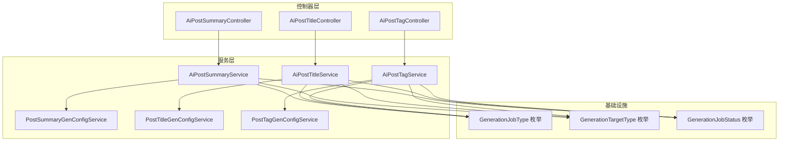
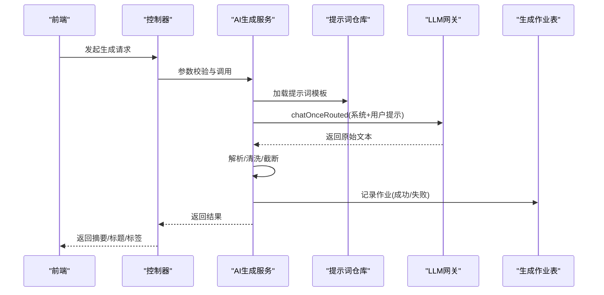
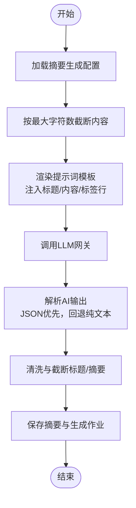
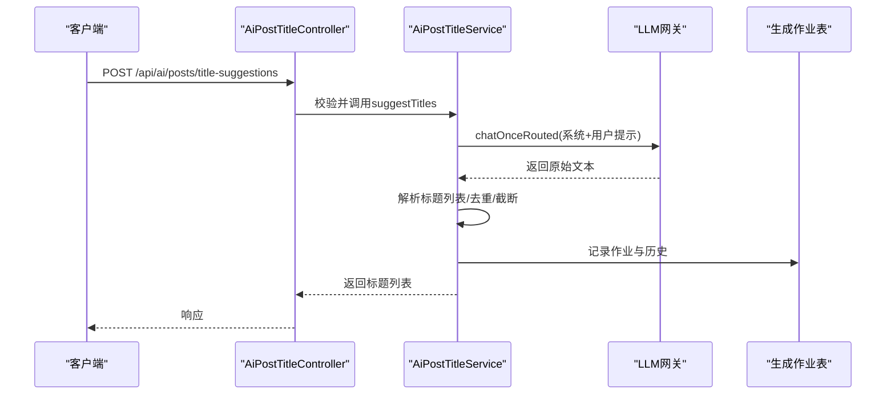
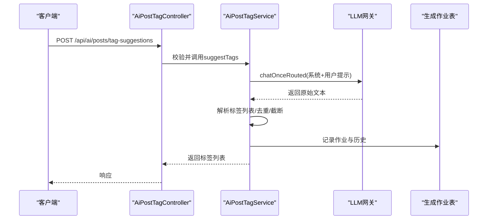
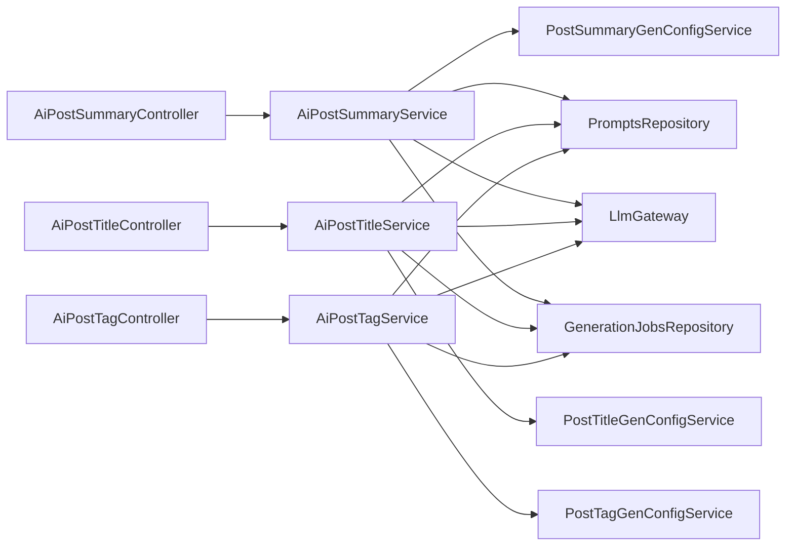

# AI内容生成

<cite>
**本文引用的文件**
- [AiPostSummaryService.java](file://src/main/java/com/example/EnterpriseRagCommunity/service/ai/AiPostSummaryService.java)
- [AiPostTitleService.java](file://src/main/java/com/example/EnterpriseRagCommunity/service/ai/AiPostTitleService.java)
- [AiPostTagService.java](file://src/main/java/com/example/EnterpriseRagCommunity/service/ai/AiPostTagService.java)
- [AiPostSummaryController.java](file://src/main/java/com/example/EnterpriseRagCommunity/controller/ai/AiPostSummaryController.java)
- [AiPostTitleController.java](file://src/main/java/com/example/EnterpriseRagCommunity/controller/ai/AiPostTitleController.java)
- [AiPostTagController.java](file://src/main/java/com/example/EnterpriseRagCommunity/controller/ai/AiPostTagController.java)
- [PostSummaryGenConfigService.java](file://src/main/java/com/example/EnterpriseRagCommunity/service/ai/PostSummaryGenConfigService.java)
- [PostTitleGenConfigService.java](file://src/main/java/com/example/EnterpriseRagCommunity/service/ai/PostTitleGenConfigService.java)
- [PostTagGenConfigService.java](file://src/main/java/com/example/EnterpriseRagCommunity/service/ai/PostTagGenConfigService.java)
- [GenerationJobType.java](file://src/main/java/com/example/EnterpriseRagCommunity/entity/semantic/enums/GenerationJobType.java)
- [GenerationTargetType.java](file://src/main/java/com/example/EnterpriseRagCommunity/entity/semantic/enums/GenerationTargetType.java)
- [GenerationJobStatus.java](file://src/main/java/com/example/EnterpriseRagCommunity/entity/semantic/enums/GenerationJobStatus.java)
- [AiPostSummaryServiceTest.java](file://src/test/java/com/example/EnterpriseRagCommunity/service/ai/AiPostSummaryServiceTest.java)
- [AiPostGenParseCompatibilityTest.java](file://src/test/java/com/example/EnterpriseRagCommunity/service/ai/AiPostGenParseCompatibilityTest.java)
- [AiPostSummaryServiceUtilityBranchesTest.java](file://src/test/java/com/example/EnterpriseRagCommunity/service/ai/AiPostSummaryServiceUtilityBranchesTest.java)
- [PostsCreatePage.tsx](file://my-vite-app/src/pages/portal/posts/pages/PostsCreatePage.tsx)
</cite>

## 目录
1. [引言](#引言)
2. [项目结构](#项目结构)
3. [核心组件](#核心组件)
4. [架构总览](#架构总览)
5. [详细组件分析](#详细组件分析)
6. [依赖分析](#依赖分析)
7. [性能考虑](#性能考虑)
8. [故障排查指南](#故障排查指南)
9. [结论](#结论)
10. [附录](#附录)

## 引言
本技术文档聚焦于企业级RAG社区中的AI内容生成功能，系统性阐述以下核心能力的实现机制与工程实践：
- 文章摘要生成（自动摘要）
- 标题自动生成（多方案建议）
- 标签自动生成（主题标签）

文档覆盖算法原理、输入输出格式、质量评估标准、性能优化策略；解释配置管理（生成参数、模板、风格控制）；给出API接口规范（含批量与个性化定制）；并说明与内容管理系统的数据流、状态同步与版本控制机制。

## 项目结构
AI内容生成功能主要由三层构成：
- 控制器层：对外暴露REST接口，负责鉴权、请求校验与响应封装
- 服务层：核心业务逻辑，负责提示词渲染、LLM路由调用、结果解析与持久化
- 配置与实体层：统一管理生成配置、历史记录与作业状态

图表来源
- [AiPostSummaryController.java:1-66](file://src/main/java/com/example/EnterpriseRagCommunity/controller/ai/AiPostSummaryController.java#L1-L66)
- [AiPostTitleController.java:1-47](file://src/main/java/com/example/EnterpriseRagCommunity/controller/ai/AiPostTitleController.java#L1-L47)
- [AiPostTagController.java:1-48](file://src/main/java/com/example/EnterpriseRagCommunity/controller/ai/AiPostTagController.java#L1-L48)
- [AiPostSummaryService.java:1-484](file://src/main/java/com/example/EnterpriseRagCommunity/service/ai/AiPostSummaryService.java#L1-L484)
- [AiPostTitleService.java:1-279](file://src/main/java/com/example/EnterpriseRagCommunity/service/ai/AiPostTitleService.java#L1-L279)
- [AiPostTagService.java:1-290](file://src/main/java/com/example/EnterpriseRagCommunity/service/ai/AiPostTagService.java#L1-L290)
- [PostSummaryGenConfigService.java:1-156](file://src/main/java/com/example/EnterpriseRagCommunity/service/ai/PostSummaryGenConfigService.java#L1-L156)
- [PostTitleGenConfigService.java:1-229](file://src/main/java/com/example/EnterpriseRagCommunity/service/ai/PostTitleGenConfigService.java#L1-L229)
- [PostTagGenConfigService.java:1-230](file://src/main/java/com/example/EnterpriseRagCommunity/service/ai/PostTagGenConfigService.java#L1-L230)
- [GenerationJobType.java:1-12](file://src/main/java/com/example/EnterpriseRagCommunity/entity/semantic/enums/GenerationJobType.java#L1-L12)
- [GenerationTargetType.java:1-11](file://src/main/java/com/example/EnterpriseRagCommunity/entity/semantic/enums/GenerationTargetType.java#L1-L11)
- [GenerationJobStatus.java:1-10](file://src/main/java/com/example/EnterpriseRagCommunity/entity/semantic/enums/GenerationJobStatus.java#L1-L10)

章节来源
- [AiPostSummaryController.java:1-66](file://src/main/java/com/example/EnterpriseRagCommunity/controller/ai/AiPostSummaryController.java#L1-L66)
- [AiPostTitleController.java:1-47](file://src/main/java/com/example/EnterpriseRagCommunity/controller/ai/AiPostTitleController.java#L1-L47)
- [AiPostTagController.java:1-48](file://src/main/java/com/example/EnterpriseRagCommunity/controller/ai/AiPostTagController.java#L1-L48)

## 核心组件
- 摘要生成服务：异步生成摘要，支持内容截断、提示词模板渲染、LLM路由调用、结果清洗与持久化
- 标题生成服务：根据内容与上下文生成多个候选标题，支持数量限制与去重
- 标签生成服务：基于内容与已有标签生成主题标签，支持数量限制与去重
- 配置服务：集中管理启用开关、最大字符数、提示词代码、温度/采样参数、历史保留策略等
- 控制器：提供公开配置查询与摘要查询接口；标题/标签生成接口进行鉴权与参数校验

章节来源
- [AiPostSummaryService.java:1-484](file://src/main/java/com/example/EnterpriseRagCommunity/service/ai/AiPostSummaryService.java#L1-L484)
- [AiPostTitleService.java:1-279](file://src/main/java/com/example/EnterpriseRagCommunity/service/ai/AiPostTitleService.java#L1-L279)
- [AiPostTagService.java:1-290](file://src/main/java/com/example/EnterpriseRagCommunity/service/ai/AiPostTagService.java#L1-L290)
- [PostSummaryGenConfigService.java:1-156](file://src/main/java/com/example/EnterpriseRagCommunity/service/ai/PostSummaryGenConfigService.java#L1-L156)
- [PostTitleGenConfigService.java:1-229](file://src/main/java/com/example/EnterpriseRagCommunity/service/ai/PostTitleGenConfigService.java#L1-L229)
- [PostTagGenConfigService.java:1-230](file://src/main/java/com/example/EnterpriseRagCommunity/service/ai/PostTagGenConfigService.java#L1-L230)

## 架构总览
AI内容生成功能遵循“控制器-服务-配置-作业”的分层架构，结合提示词模板与LLM网关进行统一调度。生成作业通过统一的作业表记录执行状态、模型、提供商、推理参数与延迟等信息，便于审计与追踪。

图表来源
- [AiPostSummaryController.java:1-66](file://src/main/java/com/example/EnterpriseRagCommunity/controller/ai/AiPostSummaryController.java#L1-L66)
- [AiPostTitleController.java:1-47](file://src/main/java/com/example/EnterpriseRagCommunity/controller/ai/AiPostTitleController.java#L1-L47)
- [AiPostTagController.java:1-48](file://src/main/java/com/example/EnterpriseRagCommunity/controller/ai/AiPostTagController.java#L1-L48)
- [AiPostSummaryService.java:1-484](file://src/main/java/com/example/EnterpriseRagCommunity/service/ai/AiPostSummaryService.java#L1-L484)
- [AiPostTitleService.java:1-279](file://src/main/java/com/example/EnterpriseRagCommunity/service/ai/AiPostTitleService.java#L1-L279)
- [AiPostTagService.java:1-290](file://src/main/java/com/example/EnterpriseRagCommunity/service/ai/AiPostTagService.java#L1-L290)
- [GenerationJobType.java:1-12](file://src/main/java/com/example/EnterpriseRagCommunity/entity/semantic/enums/GenerationJobType.java#L1-L12)
- [GenerationTargetType.java:1-11](file://src/main/java/com/example/EnterpriseRagCommunity/entity/semantic/enums/GenerationTargetType.java#L1-L11)
- [GenerationJobStatus.java:1-10](file://src/main/java/com/example/EnterpriseRagCommunity/entity/semantic/enums/GenerationJobStatus.java#L1-L10)

## 详细组件分析

### 摘要生成服务（AiPostSummaryService）
- 算法原理
  - 输入：文章标题、内容、元数据中的标签行（若存在）、配置的最大字符数
  - 提示词渲染：将标题、内容、标签行注入模板变量
  - LLM调用：通过路由接口发起一次性对话，优先提取结构化字段，回退到纯文本
  - 结果解析：尝试解析JSON对象中的title/summary字段，兼容旧版纯文本输出
  - 清洗与截断：标题与摘要进行去引号、长度限制等处理
  - 持久化：写入摘要实体与生成作业表，记录提供商、模型、温度、采样、延迟、提示词版本等
- 输入输出
  - 输入：文章ID、调用者ID（用于审计）
  - 输出：摘要标题与正文，状态（成功/失败），生成时间，错误信息（公共接口仅返回首行与长度限制）
- 质量评估
  - 成功/失败计数、平均延迟、错误类型分布
  - 历史记录可追溯每次生成的输入、输出、参数与提示词版本
- 性能优化
  - 内容截断：按配置上限截断，避免超长输入导致成本与延迟上升
  - 异步执行：使用线程池异步生成，避免阻塞主线程
  - 结果解析容错：对非结构化输出进行回退解析，提升鲁棒性

图表来源
- [AiPostSummaryService.java:47-130](file://src/main/java/com/example/EnterpriseRagCommunity/service/ai/AiPostSummaryService.java#L47-L130)
- [AiPostSummaryService.java:132-182](file://src/main/java/com/example/EnterpriseRagCommunity/service/ai/AiPostSummaryService.java#L132-L182)
- [AiPostSummaryService.java:240-332](file://src/main/java/com/example/EnterpriseRagCommunity/service/ai/AiPostSummaryService.java#L240-L332)

章节来源
- [AiPostSummaryService.java:1-484](file://src/main/java/com/example/EnterpriseRagCommunity/service/ai/AiPostSummaryService.java#L1-L484)
- [AiPostSummaryController.java:1-66](file://src/main/java/com/example/EnterpriseRagCommunity/controller/ai/AiPostSummaryController.java#L1-L66)
- [PostSummaryGenConfigService.java:1-156](file://src/main/java/com/example/EnterpriseRagCommunity/service/ai/PostSummaryGenConfigService.java#L1-L156)

### 标题生成服务（AiPostTitleService）
- 算法原理
  - 输入：内容、版块名、标签、期望数量
  - 提示词渲染：注入期望数量、版块行、标签行、内容
  - LLM调用：一次性对话，优先提取JSON数组或对象中的标题列表
  - 解析与去重：去除重复项，限制数量，清洗标题
- 输入输出
  - 输入：AiPostTitleSuggestRequest（内容、版块、标签、数量等）
  - 输出：AiPostTitleSuggestResponse（标题列表、模型、耗时）
- 质量评估
  - 去重率、标题长度合理性、与内容的相关性（需结合外部评测）
  - 历史记录包含请求参数、输入摘要、输出列表与作业信息
- 性能优化
  - 数量与长度限制，避免过度生成
  - 提示词模板与参数预设，减少运行时开销

图表来源
- [AiPostTitleController.java:1-47](file://src/main/java/com/example/EnterpriseRagCommunity/controller/ai/AiPostTitleController.java#L1-L47)
- [AiPostTitleService.java:35-156](file://src/main/java/com/example/EnterpriseRagCommunity/service/ai/AiPostTitleService.java#L35-L156)

章节来源
- [AiPostTitleService.java:1-279](file://src/main/java/com/example/EnterpriseRagCommunity/service/ai/AiPostTitleService.java#L1-L279)
- [AiPostTitleController.java:1-47](file://src/main/java/com/example/EnterpriseRagCommunity/controller/ai/AiPostTitleController.java#L1-L47)
- [PostTitleGenConfigService.java:1-229](file://src/main/java/com/example/EnterpriseRagCommunity/service/ai/PostTitleGenConfigService.java#L1-L229)

### 标签生成服务（AiPostTagService）
- 算法原理
  - 输入：标题、已有标签、内容、期望数量
  - 提示词渲染：注入版块、标题、已有标签、内容
  - LLM调用：一次性对话，提取JSON数组或对象中的标签列表
  - 解析与去重：清洗后去重并限制数量
- 输入输出
  - 输入：AiPostTagSuggestRequest（标题、标签、内容、数量等）
  - 输出：AiPostTagSuggestResponse（标签列表、模型、耗时）
- 质量评估
  - 标签唯一性、长度合理性、与内容一致性
  - 历史记录包含请求参数、输入摘要、输出列表与作业信息
- 性能优化
  - 数量与长度限制，避免过度生成
  - 提示词模板与参数预设，减少运行时开销

图表来源
- [AiPostTagController.java:1-48](file://src/main/java/com/example/EnterpriseRagCommunity/controller/ai/AiPostTagController.java#L1-L48)
- [AiPostTagService.java:35-156](file://src/main/java/com/example/EnterpriseRagCommunity/service/ai/AiPostTagService.java#L35-L156)

章节来源
- [AiPostTagService.java:1-290](file://src/main/java/com/example/EnterpriseRagCommunity/service/ai/AiPostTagService.java#L1-L290)
- [AiPostTagController.java:1-48](file://src/main/java/com/example/EnterpriseRagCommunity/controller/ai/AiPostTagController.java#L1-L48)
- [PostTagGenConfigService.java:1-230](file://src/main/java/com/example/EnterpriseRagCommunity/service/ai/PostTagGenConfigService.java#L1-L230)

### 配置管理与模板
- 摘要生成配置
  - 关键参数：启用开关、最大内容字符数、提示词代码
  - 默认值与校验：默认最大字符数、提示词代码存在性校验
  - 公共配置：仅暴露启用状态
- 标题/标签生成配置
  - 关键参数：启用开关、默认/最大数量、最大内容字符数、提示词代码、历史保留策略
  - 默认值与校验：数量范围、字符数范围、历史保留天数与条数
  - 公共配置：启用状态、默认/最大数量
- 模板与风格控制
  - 通过提示词代码关联系统提示与用户提示模板
  - 通过参数解析器注入模型、温度、采样等推理参数
- 版本控制
  - 作业表记录提示词版本，便于回溯与A/B评估

章节来源
- [PostSummaryGenConfigService.java:1-156](file://src/main/java/com/example/EnterpriseRagCommunity/service/ai/PostSummaryGenConfigService.java#L1-L156)
- [PostTitleGenConfigService.java:1-229](file://src/main/java/com/example/EnterpriseRagCommunity/service/ai/PostTitleGenConfigService.java#L1-L229)
- [PostTagGenConfigService.java:1-230](file://src/main/java/com/example/EnterpriseRagCommunity/service/ai/PostTagGenConfigService.java#L1-L230)

### API接口规范
- 摘要查询
  - GET /api/ai/posts/{postId}/summary
  - 返回：状态、摘要标题与正文（成功时）、生成时间、公共化错误信息
- 摘要配置
  - GET /api/ai/posts/summary/config
  - 返回：公共摘要生成配置（启用状态）
- 标题建议
  - POST /api/ai/posts/title-suggestions
  - 请求体：AiPostTitleSuggestRequest（内容、版块、标签、数量等）
  - 返回：AiPostTitleSuggestResponse（标题列表、模型、耗时）
- 标题配置
  - GET /api/ai/posts/title-gen/config
  - 返回：公共标题生成配置（启用状态、默认/最大数量）
- 标签建议
  - POST /api/ai/posts/tag-suggestions
  - 请求体：AiPostTagSuggestRequest（标题、标签、内容、数量等）
  - 返回：AiPostTagSuggestResponse（标签列表、模型、耗时）
- 标签配置
  - GET /api/ai/posts/tag-gen/config
  - 返回：公共标签生成配置（启用状态、默认/最大数量、最大内容字符数）

章节来源
- [AiPostSummaryController.java:1-66](file://src/main/java/com/example/EnterpriseRagCommunity/controller/ai/AiPostSummaryController.java#L1-L66)
- [AiPostTitleController.java:1-47](file://src/main/java/com/example/EnterpriseRagCommunity/controller/ai/AiPostTitleController.java#L1-L47)
- [AiPostTagController.java:1-48](file://src/main/java/com/example/EnterpriseRagCommunity/controller/ai/AiPostTagController.java#L1-L48)

### 与内容管理系统的集成
- 数据流转
  - 摘要：以文章ID为目标，生成摘要并写入摘要实体；同时写入生成作业表
  - 标题/标签：生成候选列表，写入历史记录与生成作业表
- 状态同步
  - 作业表统一记录状态（成功/失败）、提供商、模型、推理参数与延迟
  - 公共接口仅暴露摘要状态与必要信息，错误信息经公共化处理
- 版本控制
  - 作业表记录提示词版本，便于审计与回溯
- 前端集成
  - 创建页面提供“生成标题”按钮，受配置开关与状态控制

章节来源
- [AiPostSummaryController.java:1-66](file://src/main/java/com/example/EnterpriseRagCommunity/controller/ai/AiPostSummaryController.java#L1-L66)
- [AiPostTitleController.java:1-47](file://src/main/java/com/example/EnterpriseRagCommunity/controller/ai/AiPostTitleController.java#L1-L47)
- [AiPostTagController.java:1-48](file://src/main/java/com/example/EnterpriseRagCommunity/controller/ai/AiPostTagController.java#L1-L48)
- [GenerationJobType.java:1-12](file://src/main/java/com/example/EnterpriseRagCommunity/entity/semantic/enums/GenerationJobType.java#L1-L12)
- [GenerationTargetType.java:1-11](file://src/main/java/com/example/EnterpriseRagCommunity/entity/semantic/enums/GenerationTargetType.java#L1-L11)
- [GenerationJobStatus.java:1-10](file://src/main/java/com/example/EnterpriseRagCommunity/entity/semantic/enums/GenerationJobStatus.java#L1-L10)
- [PostsCreatePage.tsx:1974-1999](file://my-vite-app/src/pages/portal/posts/pages/PostsCreatePage.tsx#L1974-L1999)

## 依赖分析
- 组件耦合
  - 控制器仅依赖对应服务；服务依赖配置服务、提示词仓库与LLM网关
  - 生成作业表作为跨服务共享的审计与追踪载体
- 外部依赖
  - LLM网关：负责模型路由与一次性对话调用
  - 提示词仓库：提供系统提示与用户提示模板
- 潜在循环依赖
  - 当前结构为单向依赖（控制器→服务→配置/提示词/LLM），无循环依赖迹象

图表来源
- [AiPostSummaryController.java:1-66](file://src/main/java/com/example/EnterpriseRagCommunity/controller/ai/AiPostSummaryController.java#L1-L66)
- [AiPostTitleController.java:1-47](file://src/main/java/com/example/EnterpriseRagCommunity/controller/ai/AiPostTitleController.java#L1-L47)
- [AiPostTagController.java:1-48](file://src/main/java/com/example/EnterpriseRagCommunity/controller/ai/AiPostTagController.java#L1-L48)
- [AiPostSummaryService.java:1-484](file://src/main/java/com/example/EnterpriseRagCommunity/service/ai/AiPostSummaryService.java#L1-L484)
- [AiPostTitleService.java:1-279](file://src/main/java/com/example/EnterpriseRagCommunity/service/ai/AiPostTitleService.java#L1-L279)
- [AiPostTagService.java:1-290](file://src/main/java/com/example/EnterpriseRagCommunity/service/ai/AiPostTagService.java#L1-L290)

## 性能考虑
- 输入裁剪：按最大字符数截断，降低LLM输入成本与延迟
- 异步执行：摘要生成采用异步线程池，避免阻塞请求线程
- 结果解析容错：兼容纯文本与结构化输出，提升成功率
- 参数预设：通过提示词参数解析器设置温度、采样等，减少运行时计算
- 历史与作业：统一记录作业信息，便于后续性能分析与优化

## 故障排查指南
- 常见问题
  - AI输出为空或非预期：检查提示词模板与LLM路由是否正确
  - JSON解析失败：确认AI输出符合预期格式，或依赖纯文本回退
  - 配置无效：检查提示词代码是否存在、参数范围是否合法
- 审计与定位
  - 查看生成作业表中的状态、提供商、模型、温度、采样、延迟与错误信息
  - 对照公共错误信息的公共化处理规则（首行与长度限制）
- 单元测试参考
  - 摘要生成：验证标签行渲染、纯文本回退、异常记录与清理逻辑
  - 兼容性：标题/标签/摘要解析兼容旧版与新版输出格式
  - 工具方法：标题/摘要清洗边界条件

章节来源
- [AiPostSummaryServiceTest.java:273-552](file://src/test/java/com/example/EnterpriseRagCommunity/service/ai/AiPostSummaryServiceTest.java#L273-L552)
- [AiPostGenParseCompatibilityTest.java:1-42](file://src/test/java/com/example/EnterpriseRagCommunity/service/ai/AiPostGenParseCompatibilityTest.java#L1-L42)
- [AiPostSummaryServiceUtilityBranchesTest.java:314-334](file://src/test/java/com/example/EnterpriseRagCommunity/service/ai/AiPostSummaryServiceUtilityBranchesTest.java#L314-L334)

## 结论
本AI内容生成功能通过清晰的分层设计与统一的作业审计机制，实现了摘要、标题与标签的自动化生成。配置服务提供了灵活的参数与模板管理，前端可通过简洁的API完成个性化定制与批量生成。建议持续完善质量评估体系与A/B实验框架，以进一步提升生成效果与用户体验。

## 附录
- 前端使用要点
  - “生成标题”按钮受配置开关与状态控制，点击后触发标题建议接口
- 作业类型与目标类型
  - 作业类型包含摘要、标题、标签、翻译、建议与内容创作等
  - 目标类型支持文章与评论

章节来源
- [GenerationJobType.java:1-12](file://src/main/java/com/example/EnterpriseRagCommunity/entity/semantic/enums/GenerationJobType.java#L1-L12)
- [GenerationTargetType.java:1-11](file://src/main/java/com/example/EnterpriseRagCommunity/entity/semantic/enums/GenerationTargetType.java#L1-L11)
- [PostsCreatePage.tsx:1974-1999](file://my-vite-app/src/pages/portal/posts/pages/PostsCreatePage.tsx#L1974-L1999)