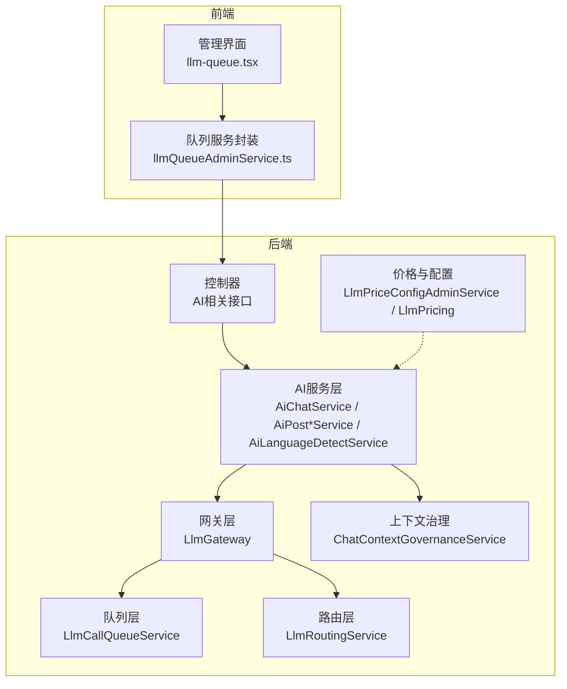
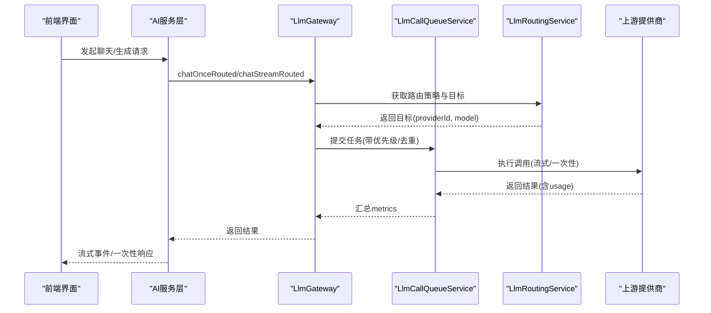
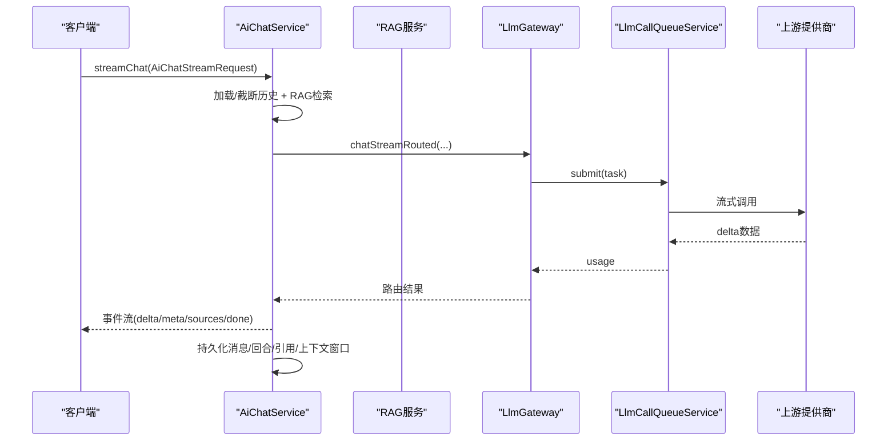
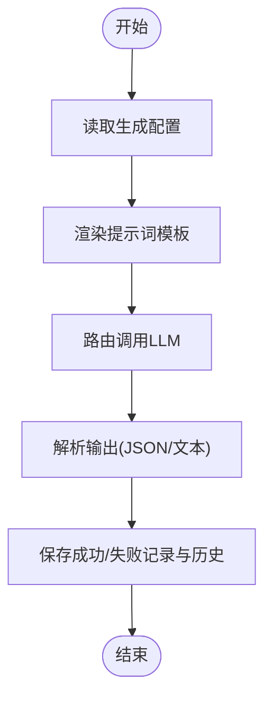
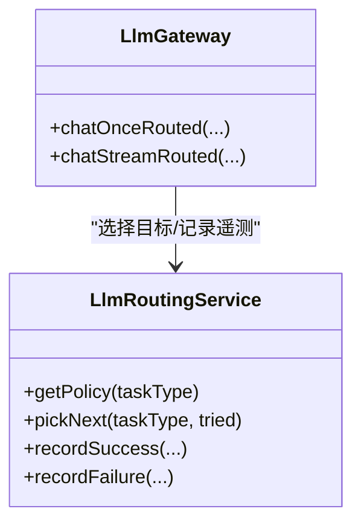
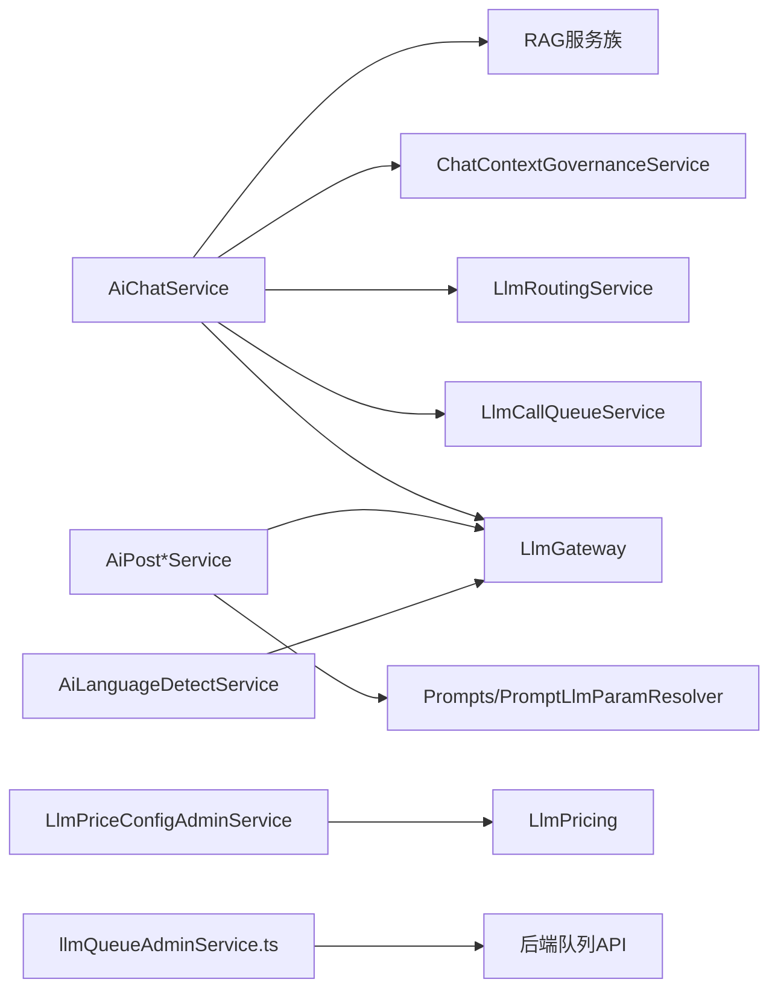

# AI智能服务

<cite>
**本文引用的文件**
- [AiChatService.java](file://src/main/java/com/example/EnterpriseRagCommunity/service/ai/AiChatService.java)
- [AiPostSummaryService.java](file://src/main/java/com/example/EnterpriseRagCommunity/service/ai/AiPostSummaryService.java)
- [AiPostTagService.java](file://src/main/java/com/example/EnterpriseRagCommunity/service/ai/AiPostTagService.java)
- [AiPostTitleService.java](file://src/main/java/com/example/EnterpriseRagCommunity/service/ai/AiPostTitleService.java)
- [AiLanguageDetectService.java](file://src/main/java/com/example/EnterpriseRagCommunity/service/ai/AiLanguageDetectService.java)
- [LlmGateway.java](file://src/main/java/com/example/EnterpriseRagCommunity/service/ai/LlmGateway.java)
- [LlmCallQueueService.java](file://src/main/java/com/example/EnterpriseRagCommunity/service/ai/LlmCallQueueService.java)
- [LlmRoutingService.java](file://src/main/java/com/example/EnterpriseRagCommunity/service/ai/LlmRoutingService.java)
- [ChatContextGovernanceService.java](file://src/main/java/com/example/EnterpriseRagCommunity/service/ai/ChatContextGovernanceService.java)
- [ChatContextGovernanceConfigService.java](file://src/main/java/com/example/EnterpriseRagCommunity/service/ai/ChatContextGovernanceConfigService.java)
- [AdminLlmPriceConfigPricingDTO.java](file://src/main/java/com/example/EnterpriseRagCommunity/dto/ai/AdminLlmPriceConfigPricingDTO.java)
- [LlmPriceConfigAdminService.java](file://src/main/java/com/example/EnterpriseRagCommunity/service/ai/LlmPriceConfigAdminService.java)
- [LlmPricing.java](file://src/main/java/com/example/EnterpriseRagCommunity/service/monitor/LlmPricing.java)
- [llmQueueAdminService.ts](file://my-vite-app/src/services/llmQueueAdminService.ts)
- [llm-queue.tsx](file://my-vite-app/src/pages/admin/forms/metrics/llm-queue.tsx)
- [AiChatStreamRequest.java](file://src/main/java/com/example/EnterpriseRagCommunity/dto/ai/AiChatStreamRequest.java)
- [AiChatRegenerateStreamRequest.java](file://src/main/java/com/example/EnterpriseRagCommunity/dto/ai/AiChatRegenerateStreamRequest.java)
- [AiPostComposeStreamRequest.java](file://src/main/java/com/example/EnterpriseRagCommunity/dto/ai/AiPostComposeStreamRequest.java)
</cite>

## 目录
1. [引言](#引言)
2. [项目结构](#项目结构)
3. [核心组件](#核心组件)
4. [架构总览](#架构总览)
5. [详细组件分析](#详细组件分析)
6. [依赖关系分析](#依赖关系分析)
7. [性能考量](#性能考量)
8. [故障排查指南](#故障排查指南)
9. [结论](#结论)
10. [附录](#附录)

## 引言
本文件面向AI智能服务系统，系统性梳理聊天对话、内容摘要、标签生成、语言检测等核心AI能力，以及LLM模型配置、队列管理、价格计算、上下文治理等技术实现。文档同时覆盖异步处理机制、模型路由策略、成本控制与性能监控，并给出AI相关API接口规范与客户端实现要点、错误处理与重试机制。

## 项目结构
后端采用分层设计，AI能力集中在service/ai包中，通过网关统一接入上游多提供商模型；前端使用React/Vite提供管理与监控界面，支持LLM队列状态可视化与配置调整。

图表来源
- [AiChatService.java:1-800](file://src/main/java/com/example/EnterpriseRagCommunity/service/ai/AiChatService.java#L1-L800)
- [LlmGateway.java:1-800](file://src/main/java/com/example/EnterpriseRagCommunity/service/ai/LlmGateway.java#L1-L800)
- [LlmCallQueueService.java:1-800](file://src/main/java/com/example/EnterpriseRagCommunity/service/ai/LlmCallQueueService.java#L1-L800)
- [LlmRoutingService.java:43-136](file://src/main/java/com/example/EnterpriseRagCommunity/service/ai/LlmRoutingService.java#L43-L136)
- [ChatContextGovernanceService.java:1-38](file://src/main/java/com/example/EnterpriseRagCommunity/service/ai/ChatContextGovernanceService.java#L1-L38)
- [LlmPriceConfigAdminService.java:1-27](file://src/main/java/com/example/EnterpriseRagCommunity/service/ai/LlmPriceConfigAdminService.java#L1-L27)
- [LlmPricing.java:103-113](file://src/main/java/com/example/EnterpriseRagCommunity/service/monitor/LlmPricing.java#L103-L113)
- [llm-queue.tsx:29-50](file://my-vite-app/src/pages/admin/forms/metrics/llm-queue.tsx#L29-L50)
- [llmQueueAdminService.ts:1-117](file://my-vite-app/src/services/llmQueueAdminService.ts#L1-L117)

章节来源
- [AiChatService.java:1-800](file://src/main/java/com/example/EnterpriseRagCommunity/service/ai/AiChatService.java#L1-L800)
- [LlmGateway.java:1-800](file://src/main/java/com/example/EnterpriseRagCommunity/service/ai/LlmGateway.java#L1-L800)
- [LlmCallQueueService.java:1-800](file://src/main/java/com/example/EnterpriseRagCommunity/service/ai/LlmCallQueueService.java#L1-L800)
- [LlmRoutingService.java:43-136](file://src/main/java/com/example/EnterpriseRagCommunity/service/ai/LlmRoutingService.java#L43-L136)
- [ChatContextGovernanceService.java:1-38](file://src/main/java/com/example/EnterpriseRagCommunity/service/ai/ChatContextGovernanceService.java#L1-L38)
- [LlmPriceConfigAdminService.java:1-27](file://src/main/java/com/example/EnterpriseRagCommunity/service/ai/LlmPriceConfigAdminService.java#L1-L27)
- [LlmPricing.java:103-113](file://src/main/java/com/example/EnterpriseRagCommunity/service/monitor/LlmPricing.java#L103-L113)
- [llm-queue.tsx:29-50](file://my-vite-app/src/pages/admin/forms/metrics/llm-queue.tsx#L29-L50)
- [llmQueueAdminService.ts:1-117](file://my-vite-app/src/services/llmQueueAdminService.ts#L1-L117)

## 核心组件
- 聊天服务：支持流式与一次性对话，内置RAG检索增强、深思模式、图片/文件输入、引用标注与溯源、上下文治理与历史截断。
- 内容生成：摘要、标题、标签生成，均基于提示词模板与参数化配置，异步执行并记录作业历史。
- 语言检测：基于专用提示词与LLM输出解析，返回语言列表。
- 网关与路由：统一路由策略、重试与降级、遥测记录、队列与令牌统计。
- 队列与并发：优先级队列、并发上限、去重、任务快照与明细、历史保留。
- 上下文治理：按配置裁剪消息长度、图像令牌估算、字符与token统计、事件记录。
- 价格与计费：价格配置DTO与服务，支持多种计费策略与层级定价。

章节来源
- [AiChatService.java:123-604](file://src/main/java/com/example/EnterpriseRagCommunity/service/ai/AiChatService.java#L123-L604)
- [AiPostSummaryService.java:47-130](file://src/main/java/com/example/EnterpriseRagCommunity/service/ai/AiPostSummaryService.java#L47-L130)
- [AiPostTitleService.java:35-156](file://src/main/java/com/example/EnterpriseRagCommunity/service/ai/AiPostTitleService.java#L35-L156)
- [AiPostTagService.java:35-156](file://src/main/java/com/example/EnterpriseRagCommunity/service/ai/AiPostTagService.java#L35-L156)
- [AiLanguageDetectService.java:26-78](file://src/main/java/com/example/EnterpriseRagCommunity/service/ai/AiLanguageDetectService.java#L26-L78)
- [LlmGateway.java:73-329](file://src/main/java/com/example/EnterpriseRagCommunity/service/ai/LlmGateway.java#L73-L329)
- [LlmCallQueueService.java:417-800](file://src/main/java/com/example/EnterpriseRagCommunity/service/ai/LlmCallQueueService.java#L417-L800)
- [ChatContextGovernanceService.java:28-38](file://src/main/java/com/example/EnterpriseRagCommunity/service/ai/ChatContextGovernanceService.java#L28-L38)
- [AdminLlmPriceConfigPricingDTO.java:1-23](file://src/main/java/com/example/EnterpriseRagCommunity/dto/ai/AdminLlmPriceConfigPricingDTO.java#L1-L23)
- [LlmPriceConfigAdminService.java:1-27](file://src/main/java/com/example/EnterpriseRagCommunity/service/ai/LlmPriceConfigAdminService.java#L1-L27)
- [LlmPricing.java:103-113](file://src/main/java/com/example/EnterpriseRagCommunity/service/monitor/LlmPricing.java#L103-L113)

## 架构总览
系统以“控制器—服务—网关—队列—路由—上游提供商”的链路组织，前端通过管理界面与服务封装访问后端API，实现LLM队列监控与配置。

图表来源
- [LlmGateway.java:73-329](file://src/main/java/com/example/EnterpriseRagCommunity/service/ai/LlmGateway.java#L73-L329)
- [LlmCallQueueService.java:417-800](file://src/main/java/com/example/EnterpriseRagCommunity/service/ai/LlmCallQueueService.java#L417-L800)
- [LlmRoutingService.java:114-136](file://src/main/java/com/example/EnterpriseRagCommunity/service/ai/LlmRoutingService.java#L114-L136)

## 详细组件分析

### 聊天对话（AiChatService）
- 功能特性
  - 支持SSE流式输出，事件包括meta、delta、sources、done。
  - 支持RAG检索增强（混合检索/向量/重排/评论聚合），可选深思模式与思维指令。
  - 支持图片/文件输入，自动构建多模态消息体。
  - 上下文治理：按配置裁剪、估算图像token、统计字符与token、记录事件。
  - 会话持久化：用户消息、助手回复、回合信息、引用来源、上下文窗口记录。
- 关键流程
  - 解析请求、加载/截断历史、RAG检索与上下文组装、应用上下文治理、路由到LLM、流式回推、持久化与溯源。
- 错误处理
  - 数据持久化失败时发送错误事件并结束；上游异常捕获并上报；深思模式自动闭合标记。

图表来源
- [AiChatService.java:123-604](file://src/main/java/com/example/EnterpriseRagCommunity/service/ai/AiChatService.java#L123-L604)
- [LlmGateway.java:495-706](file://src/main/java/com/example/EnterpriseRagCommunity/service/ai/LlmGateway.java#L495-L706)
- [LlmCallQueueService.java:783-800](file://src/main/java/com/example/EnterpriseRagCommunity/service/ai/LlmCallQueueService.java#L783-L800)

章节来源
- [AiChatService.java:123-604](file://src/main/java/com/example/EnterpriseRagCommunity/service/ai/AiChatService.java#L123-L604)
- [AiChatStreamRequest.java:1-61](file://src/main/java/com/example/EnterpriseRagCommunity/dto/ai/AiChatStreamRequest.java#L1-L61)
- [AiChatRegenerateStreamRequest.java:1-37](file://src/main/java/com/example/EnterpriseRagCommunity/dto/ai/AiChatRegenerateStreamRequest.java#L1-L37)

### 内容生成（摘要/标题/标签）
- 摘要生成
  - 异步执行，解析LLM输出，保存成功/失败记录与作业历史，限制标题与摘要长度。
- 标题/标签建议
  - 参数校验与范围约束，提示词渲染，输出解析（兼容数组/对象两种格式），去重与数量限制。
- 统一流程
  - 读取配置→解析提示词参数→构造消息→路由调用→解析输出→持久化结果与历史。

图表来源
- [AiPostSummaryService.java:47-130](file://src/main/java/com/example/EnterpriseRagCommunity/service/ai/AiPostSummaryService.java#L47-L130)
- [AiPostTitleService.java:35-156](file://src/main/java/com/example/EnterpriseRagCommunity/service/ai/AiPostTitleService.java#L35-L156)
- [AiPostTagService.java:35-156](file://src/main/java/com/example/EnterpriseRagCommunity/service/ai/AiPostTagService.java#L35-L156)

章节来源
- [AiPostSummaryService.java:47-130](file://src/main/java/com/example/EnterpriseRagCommunity/service/ai/AiPostSummaryService.java#L47-L130)
- [AiPostTitleService.java:35-156](file://src/main/java/com/example/EnterpriseRagCommunity/service/ai/AiPostTitleService.java#L35-L156)
- [AiPostTagService.java:35-156](file://src/main/java/com/example/EnterpriseRagCommunity/service/ai/AiPostTagService.java#L35-L156)

### 语言检测（AiLanguageDetectService）
- 功能特性
  - 基于专用提示词与LLM输出解析，提取语言列表，去重与长度限制，回退到原始文本解析。
- 使用场景
  - 为翻译、内容分类等前置提供语言信息。

章节来源
- [AiLanguageDetectService.java:26-78](file://src/main/java/com/example/EnterpriseRagCommunity/service/ai/AiLanguageDetectService.java#L26-L78)

### 网关与路由（LlmGateway、LlmRoutingService）
- LlmGateway
  - 提供chatOnceRouted与chatStreamRouted统一入口，支持超参透传、思维模式、去重与队列。
  - 内置重试判定与降级逻辑，记录路由遥测事件。
- LlmRoutingService
  - 基于策略（最大尝试次数、失败阈值、冷却时间）选择目标(providerId, model)，维护健康状态、权重与速率状态。

图表来源
- [LlmGateway.java:73-329](file://src/main/java/com/example/EnterpriseRagCommunity/service/ai/LlmGateway.java#L73-L329)
- [LlmRoutingService.java:114-136](file://src/main/java/com/example/EnterpriseRagCommunity/service/ai/LlmRoutingService.java#L114-L136)

章节来源
- [LlmGateway.java:73-329](file://src/main/java/com/example/EnterpriseRagCommunity/service/ai/LlmGateway.java#L73-L329)
- [LlmRoutingService.java:43-136](file://src/main/java/com/example/EnterpriseRagCommunity/service/ai/LlmRoutingService.java#L43-L136)

### 队列与并发（LlmCallQueueService）
- 功能特性
  - 优先级队列、并发上限、去重、任务快照与明细、历史保留、令牌统计与估算。
  - 支持提交任务、等待完成、查询队列快照、查找任务详情。
- 性能意义
  - 控制并发与排队，避免上游限流与抖动；提供令牌统计用于成本与性能监控。

章节来源
- [LlmCallQueueService.java:417-800](file://src/main/java/com/example/EnterpriseRagCommunity/service/ai/LlmCallQueueService.java#L417-L800)

### 上下文治理（ChatContextGovernanceService、ChatContextGovernanceConfigService）
- 功能特性
  - 按配置裁剪消息、估算图像token、统计字符与token、记录治理事件与原因。
- 作用
  - 控制上下文大小，降低延迟与成本，提升稳定性。

章节来源
- [ChatContextGovernanceService.java:28-38](file://src/main/java/com/example/EnterpriseRagCommunity/service/ai/ChatContextGovernanceService.java#L28-L38)
- [ChatContextGovernanceConfigService.java:18-33](file://src/main/java/com/example/EnterpriseRagCommunity/service/ai/ChatContextGovernanceConfigService.java#L18-L33)

### 价格与计费（AdminLlmPriceConfigPricingDTO、LlmPriceConfigAdminService、LlmPricing）
- 功能特性
  - DTO定义默认/非思考/思考三档单价与层级计费；服务负责持久化与计算；监控层解析策略与单位。
- 作用
  - 为成本控制与报表提供基础数据。

章节来源
- [AdminLlmPriceConfigPricingDTO.java:1-23](file://src/main/java/com/example/EnterpriseRagCommunity/dto/ai/AdminLlmPriceConfigPricingDTO.java#L1-L23)
- [LlmPriceConfigAdminService.java:1-27](file://src/main/java/com/example/EnterpriseRagCommunity/service/ai/LlmPriceConfigAdminService.java#L1-L27)
- [LlmPricing.java:103-113](file://src/main/java/com/example/EnterpriseRagCommunity/service/monitor/LlmPricing.java#L103-L113)

### 前端管理与监控（llmQueueAdminService.ts、llm-queue.tsx）
- 功能特性
  - 定义队列任务类型与状态、任务详情与样本数据结构；提供查询构建、错误消息提取工具函数；管理界面支持刷新、编辑并发、查看趋势图。
- 作用
  - 实现LLM队列的可视化监控与配置调整。

章节来源
- [llmQueueAdminService.ts:1-117](file://my-vite-app/src/services/llmQueueAdminService.ts#L1-L117)
- [llm-queue.tsx:29-50](file://my-vite-app/src/pages/admin/forms/metrics/llm-queue.tsx#L29-L50)

## 依赖关系分析

图表来源
- [AiChatService.java:89-115](file://src/main/java/com/example/EnterpriseRagCommunity/service/ai/AiChatService.java#L89-L115)
- [LlmGateway.java:30-36](file://src/main/java/com/example/EnterpriseRagCommunity/service/ai/LlmGateway.java#L30-L36)
- [LlmCallQueueService.java:209-211](file://src/main/java/com/example/EnterpriseRagCommunity/service/ai/LlmCallQueueService.java#L209-L211)
- [LlmRoutingService.java:104-112](file://src/main/java/com/example/EnterpriseRagCommunity/service/ai/LlmRoutingService.java#L104-L112)
- [AiPostSummaryService.java:37-43](file://src/main/java/com/example/EnterpriseRagCommunity/service/ai/AiPostSummaryService.java#L37-L43)
- [AiLanguageDetectService.java:18-22](file://src/main/java/com/example/EnterpriseRagCommunity/service/ai/AiLanguageDetectService.java#L18-L22)
- [LlmPriceConfigAdminService.java:26](file://src/main/java/com/example/EnterpriseRagCommunity/service/ai/LlmPriceConfigAdminService.java#L26)
- [LlmPricing.java:103-113](file://src/main/java/com/example/EnterpriseRagCommunity/service/monitor/LlmPricing.java#L103-L113)
- [llmQueueAdminService.ts:96-117](file://my-vite-app/src/services/llmQueueAdminService.ts#L96-L117)

## 性能考量
- 队列与并发
  - 合理设置最大并发与队列容量，避免阻塞与内存压力；利用去重减少重复任务。
- 上下文治理
  - 通过上下文治理裁剪与估算，降低token消耗与延迟。
- 路由与重试
  - 基于策略的重试与降级，结合遥测事件定位瓶颈。
- 成本控制
  - 结合价格配置与令牌统计，评估不同模型与参数组合的成本影响。

## 故障排查指南
- 常见问题
  - 上游调用失败：检查路由策略、目标健康状态、重试日志与错误码。
  - 队列堆积：查看队列快照、运行/待处理任务数、最近完成任务详情。
  - 输出解析异常：确认提示词模板与LLM输出格式一致性，必要时启用深思模式。
- 排查步骤
  - 查看路由遥测事件与错误码；定位失败目标与冷却状态；核对队列快照与任务明细；检查上下文治理记录与截断原因。
- 建议
  - 开启采样日志与调试模式；对高频失败任务建立告警；定期评估价格配置与成本。

章节来源
- [LlmGateway.java:200-329](file://src/main/java/com/example/EnterpriseRagCommunity/service/ai/LlmGateway.java#L200-L329)
- [LlmCallQueueService.java:666-781](file://src/main/java/com/example/EnterpriseRagCommunity/service/ai/LlmCallQueueService.java#L666-L781)
- [ChatContextGovernanceService.java:28-38](file://src/main/java/com/example/EnterpriseRagCommunity/service/ai/ChatContextGovernanceService.java#L28-L38)

## 结论
该AI智能服务系统通过统一网关与路由、严格的队列与并发控制、完善的上下文治理与价格配置，实现了稳定高效的多模态聊天与内容生成能力。前端管理界面进一步增强了可观测性与可运维性。建议持续优化提示词模板、完善重试与降级策略，并结合成本模型进行参数与策略的动态调优。

## 附录

### AI相关API接口规范（概要）
- 聊天对话
  - 方法：POST
  - 路径：/api/ai/chat/stream
  - 请求体：AiChatStreamRequest（支持模型/提供商/温度/topP/历史限制/深思/RAG开关/图片/文件等）
  - 响应：SSE事件流（meta/delta/sources/done）
- 内容生成
  - 摘要生成：POST /api/ai/post/{postId}/summary/generate
  - 标题建议：POST /api/ai/post/title/suggest（AiPostTitleSuggestRequest）
  - 标签建议：POST /api/ai/post/tag/suggest（AiPostTagSuggestRequest）
- 模型配置与价格
  - 查询/更新价格配置：GET/PUT /api/ai/admin/price-config
  - 队列状态：GET /api/ai/admin/llm-queue/status
  - 队列任务详情：GET /api/ai/admin/llm-queue/tasks/{id}
- 语言检测
  - POST /api/ai/lang-detect（请求体含content字段）

章节来源
- [AiChatStreamRequest.java:1-61](file://src/main/java/com/example/EnterpriseRagCommunity/dto/ai/AiChatStreamRequest.java#L1-L61)
- [AiPostTitleService.java:35-156](file://src/main/java/com/example/EnterpriseRagCommunity/service/ai/AiPostTitleService.java#L35-L156)
- [AiPostTagService.java:35-156](file://src/main/java/com/example/EnterpriseRagCommunity/service/ai/AiPostTagService.java#L35-L156)
- [AdminLlmPriceConfigPricingDTO.java:1-23](file://src/main/java/com/example/EnterpriseRagCommunity/dto/ai/AdminLlmPriceConfigPricingDTO.java#L1-L23)
- [llmQueueAdminService.ts:96-117](file://my-vite-app/src/services/llmQueueAdminService.ts#L96-L117)

### 客户端实现要点
- 流式处理：遵循SSE事件命名与数据格式，正确处理meta/delta/sources/done事件。
- 重试与退避：对可重试异常实施指数退避；对不可重试异常直接上报。
- 队列监控：周期性拉取队列快照，展示运行/待处理/完成任务数与吞吐。
- 错误处理：统一提取后端message字段，显示友好错误提示并允许重试。

章节来源
- [llmQueueAdminService.ts:1-117](file://my-vite-app/src/services/llmQueueAdminService.ts#L1-L117)
- [llm-queue.tsx:29-50](file://my-vite-app/src/pages/admin/forms/metrics/llm-queue.tsx#L29-L50)