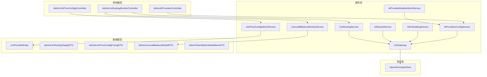
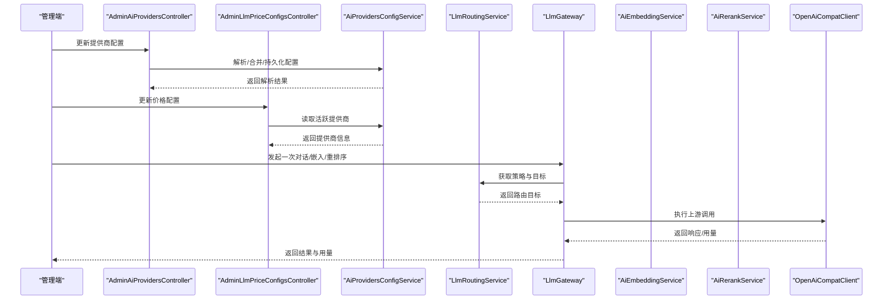
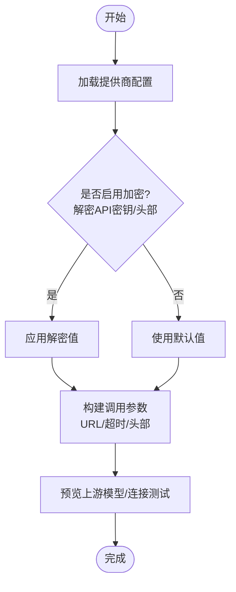
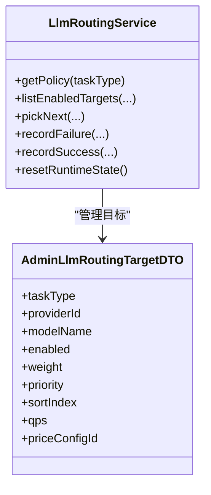
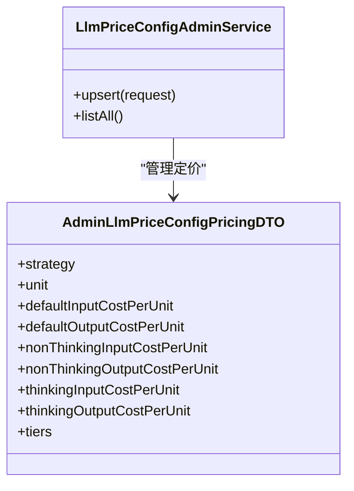
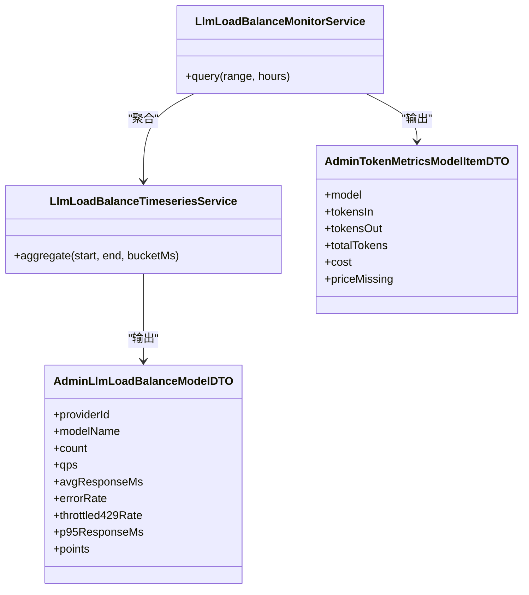
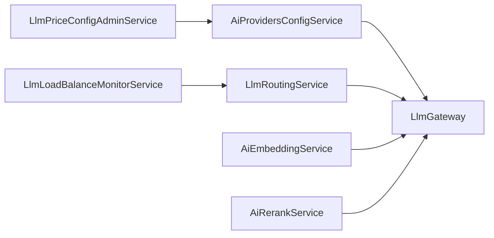

# AI模型管理

<cite>
**本文引用的文件**
- [AiProvidersConfigService.java](file://src/main/java/com/example/EnterpriseRagCommunity/service/ai/AiProvidersConfigService.java)
- [OpenAiCompatClient.java](file://src/main/java/com/example/EnterpriseRagCommunity/service/ai/client/OpenAiCompatClient.java)
- [LlmGateway.java](file://src/main/java/com/example/EnterpriseRagCommunity/service/ai/LlmGateway.java)
- [AiChatService.java](file://src/main/java/com/example/EnterpriseRagCommunity/service/ai/AiChatService.java)
- [AiEmbeddingService.java](file://src/main/java/com/example/EnterpriseRagCommunity/service/ai/AiEmbeddingService.java)
- [AiRerankService.java](file://src/main/java/com/example/EnterpriseRagCommunity/service/ai/AiRerankService.java)
- [LlmRoutingService.java](file://src/main/java/com/example/EnterpriseRagCommunity/service/ai/LlmRoutingService.java)
- [LlmPriceConfigAdminService.java](file://src/main/java/com/example/EnterpriseRagCommunity/service/ai/LlmPriceConfigAdminService.java)
- [LlmLoadBalanceMonitorService.java](file://src/main/java/com/example/EnterpriseRagCommunity/service/monitor/LlmLoadBalanceMonitorService.java)
- [LlmLoadBalanceTimeseriesService.java](file://src/main/java/com/example/EnterpriseRagCommunity/service/monitor/LlmLoadBalanceTimeseriesService.java)
- [AdminLlmLoadBalanceModelDTO.java](file://src/main/java/com/example/EnterpriseRagCommunity/dto/monitor/AdminLlmLoadBalanceModelDTO.java)
- [AdminTokenMetricsModelItemDTO.java](file://src/main/java/com/example/EnterpriseRagCommunity/dto/monitor/AdminTokenMetricsModelItemDTO.java)
- [AdminLlmRoutingTargetDTO.java](file://src/main/java/com/example/EnterpriseRagCommunity/dto/ai/AdminLlmRoutingTargetDTO.java)
- [AdminLlmPriceConfigPricingDTO.java](file://src/main/java/com/example/EnterpriseRagCommunity/dto/ai/AdminLlmPriceConfigPricingDTO.java)
- [LlmProviderEntity.java](file://src/main/java/com/example/EnterpriseRagCommunity/entity/ai/LlmProviderEntity.java)
- [AiProviderModelsAdminService.java](file://src/main/java/com/example/EnterpriseRagCommunity/service/ai/AiProviderModelsAdminService.java)
- [AdminAiProvidersController.java](file://src/main/java/com/example/EnterpriseRagCommunity/controller/ai/admin/AdminAiProvidersController.java)
- [AdminLlmRoutingMonitorController.java](file://src/main/java/com/example/EnterpriseRagCommunity/controller/monitor/admin/AdminLlmRoutingMonitorController.java)
- [AdminLlmPriceConfigsController.java](file://src/main/java/com/example/EnterpriseRagCommunity/controller/ai/admin/AdminLlmPriceConfigsController.java)
- [application.properties](file://src/main/resources/application.properties)
- [V4__llm_price_configs.sql](file://src/main/resources/db/migration/V4__llm_price_configs.sql)
</cite>

## 目录
1. [引言](#引言)
2. [项目结构](#项目结构)
3. [核心组件](#核心组件)
4. [架构总览](#架构总览)
5. [详细组件分析](#详细组件分析)
6. [依赖关系分析](#依赖关系分析)
7. [性能考虑](#性能考虑)
8. [故障排查指南](#故障排查指南)
9. [结论](#结论)
10. [附录](#附录)

## 引言
本操作文档面向AI模型管理系统的管理员与开发者，系统性阐述LLM提供商配置、模型管理、价格设置与路由策略等核心功能。内容覆盖从提供商接入（API密钥配置、认证方式、连接测试）、模型路由策略（负载均衡、故障转移、性能监控），到价格配置（计费规则、折扣策略、成本控制）以及管理API接口规范，并提供监控与性能分析工具的使用指导，帮助实现高效的成本控制与稳定性保障。

## 项目结构
AI模型管理相关代码主要分布在以下模块：
- 服务层：提供商配置、网关、嵌入、重排序、路由、价格配置、监控等服务
- 控制器层：管理端控制器，提供REST API
- DTO/实体：管理端请求/响应数据结构与数据库实体
- 资源与迁移：应用配置与数据库迁移脚本

图示来源
- [AdminAiProvidersController.java](file://src/main/java/com/example/EnterpriseRagCommunity/controller/ai/admin/AdminAiProvidersController.java)
- [AdminLlmRoutingMonitorController.java](file://src/main/java/com/example/EnterpriseRagCommunity/controller/monitor/admin/AdminLlmRoutingMonitorController.java)
- [AdminLlmPriceConfigsController.java](file://src/main/java/com/example/EnterpriseRagCommunity/controller/ai/admin/AdminLlmPriceConfigsController.java)
- [AiProvidersConfigService.java](file://src/main/java/com/example/EnterpriseRagCommunity/service/ai/AiProvidersConfigService.java)
- [LlmGateway.java](file://src/main/java/com/example/EnterpriseRagCommunity/service/ai/LlmGateway.java)
- [AiEmbeddingService.java](file://src/main/java/com/example/EnterpriseRagCommunity/service/ai/AiEmbeddingService.java)
- [AiRerankService.java](file://src/main/java/com/example/EnterpriseRagCommunity/service/ai/AiRerankService.java)
- [LlmRoutingService.java](file://src/main/java/com/example/EnterpriseRagCommunity/service/ai/LlmRoutingService.java)
- [LlmPriceConfigAdminService.java](file://src/main/java/com/example/EnterpriseRagCommunity/service/ai/LlmPriceConfigAdminService.java)
- [LlmLoadBalanceMonitorService.java](file://src/main/java/com/example/EnterpriseRagCommunity/service/monitor/LlmLoadBalanceMonitorService.java)
- [AiProviderModelsAdminService.java](file://src/main/java/com/example/EnterpriseRagCommunity/service/ai/AiProviderModelsAdminService.java)
- [OpenAiCompatClient.java](file://src/main/java/com/example/EnterpriseRagCommunity/service/ai/client/OpenAiCompatClient.java)
- [LlmProviderEntity.java](file://src/main/java/com/example/EnterpriseRagCommunity/entity/ai/LlmProviderEntity.java)
- [AdminLlmRoutingTargetDTO.java](file://src/main/java/com/example/EnterpriseRagCommunity/dto/ai/AdminLlmRoutingTargetDTO.java)
- [AdminLlmPriceConfigPricingDTO.java](file://src/main/java/com/example/EnterpriseRagCommunity/dto/ai/AdminLlmPriceConfigPricingDTO.java)
- [AdminLlmLoadBalanceModelDTO.java](file://src/main/java/com/example/EnterpriseRagCommunity/dto/monitor/AdminLlmLoadBalanceModelDTO.java)
- [AdminTokenMetricsModelItemDTO.java](file://src/main/java/com/example/EnterpriseRagCommunity/dto/monitor/AdminTokenMetricsModelItemDTO.java)

章节来源
- [AiProvidersConfigService.java](file://src/main/java/com/example/EnterpriseRagCommunity/service/ai/AiProvidersConfigService.java)
- [LlmGateway.java](file://src/main/java/com/example/EnterpriseRagCommunity/service/ai/LlmGateway.java)
- [LlmRoutingService.java](file://src/main/java/com/example/EnterpriseRagCommunity/service/ai/LlmRoutingService.java)
- [LlmPriceConfigAdminService.java](file://src/main/java/com/example/EnterpriseRagCommunity/service/ai/LlmPriceConfigAdminService.java)
- [LlmLoadBalanceMonitorService.java](file://src/main/java/com/example/EnterpriseRagCommunity/service/monitor/LlmLoadBalanceMonitorService.java)
- [AdminAiProvidersController.java](file://src/main/java/com/example/EnterpriseRagCommunity/controller/ai/admin/AdminAiProvidersController.java)
- [AdminLlmRoutingMonitorController.java](file://src/main/java/com/example/EnterpriseRagCommunity/controller/monitor/admin/AdminLlmRoutingMonitorController.java)
- [AdminLlmPriceConfigsController.java](file://src/main/java/com/example/EnterpriseRagCommunity/controller/ai/admin/AdminLlmPriceConfigsController.java)

## 核心组件
- 提供商配置服务：负责解析与合并提供商配置、解密敏感信息、构建调用参数（基础URL、超时、头部等）
- 网关服务：统一入口，封装路由选择、重试与回退、错误包装、令牌统计与用量提取
- 嵌入与重排序服务：封装向量生成与重排序调用
- 路由服务：定义策略（权重轮询、优先级回退、速率限制），维护目标池与冷却状态
- 价格配置服务：管理价格配置元数据与计费策略（单位、阶梯、默认单价）
- 监控服务：聚合负载与时间序列指标，支持可视化与告警
- 管理端控制器：提供REST API用于提供商、路由与价格配置的增删改查与查询

章节来源
- [AiProvidersConfigService.java](file://src/main/java/com/example/EnterpriseRagCommunity/service/ai/AiProvidersConfigService.java)
- [LlmGateway.java](file://src/main/java/com/example/EnterpriseRagCommunity/service/ai/LlmGateway.java)
- [AiEmbeddingService.java](file://src/main/java/com/example/EnterpriseRagCommunity/service/ai/AiEmbeddingService.java)
- [AiRerankService.java](file://src/main/java/com/example/EnterpriseRagCommunity/service/ai/AiRerankService.java)
- [LlmRoutingService.java](file://src/main/java/com/example/EnterpriseRagCommunity/service/ai/LlmRoutingService.java)
- [LlmPriceConfigAdminService.java](file://src/main/java/com/example/EnterpriseRagCommunity/service/ai/LlmPriceConfigAdminService.java)
- [LlmLoadBalanceMonitorService.java](file://src/main/java/com/example/EnterpriseRagCommunity/service/monitor/LlmLoadBalanceMonitorService.java)

## 架构总览
下图展示管理端与核心服务之间的交互关系，以及关键数据流（提供商解析、路由决策、调用执行、监控上报）。

图示来源
- [AdminAiProvidersController.java](file://src/main/java/com/example/EnterpriseRagCommunity/controller/ai/admin/AdminAiProvidersController.java)
- [AdminLlmPriceConfigsController.java](file://src/main/java/com/example/EnterpriseRagCommunity/controller/ai/admin/AdminLlmPriceConfigsController.java)
- [AiProvidersConfigService.java](file://src/main/java/com/example/EnterpriseRagCommunity/service/ai/AiProvidersConfigService.java)
- [LlmRoutingService.java](file://src/main/java/com/example/EnterpriseRagCommunity/service/ai/LlmRoutingService.java)
- [LlmGateway.java](file://src/main/java/com/example/EnterpriseRagCommunity/service/ai/LlmGateway.java)
- [AiEmbeddingService.java](file://src/main/java/com/example/EnterpriseRagCommunity/service/ai/AiEmbeddingService.java)
- [AiRerankService.java](file://src/main/java/com/example/EnterpriseRagCommunity/service/ai/AiRerankService.java)
- [OpenAiCompatClient.java](file://src/main/java/com/example/EnterpriseRagCommunity/service/ai/client/OpenAiCompatClient.java)

## 详细组件分析

### 提供商接入与配置
- 配置项要点
  - 基础URL：上游服务地址（自动去除末尾斜杠）
  - API密钥：支持加密存储与解密
  - 额外头部：支持加密存储与掩码显示
  - 连接/读取超时：毫秒级配置
  - 默认模型：聊天与嵌入默认模型
- 认证方式
  - Authorization头：若未提供则自动注入Bearer
  - 其他头部：按需透传
- 连接测试
  - 通过预览上游模型或直接调用上游接口进行连通性验证

图示来源
- [AiProvidersConfigService.java](file://src/main/java/com/example/EnterpriseRagCommunity/service/ai/AiProvidersConfigService.java)
- [OpenAiCompatClient.java](file://src/main/java/com/example/EnterpriseRagCommunity/service/ai/client/OpenAiCompatClient.java)

章节来源
- [AiProvidersConfigService.java](file://src/main/java/com/example/EnterpriseRagCommunity/service/ai/AiProvidersConfigService.java)
- [OpenAiCompatClient.java](file://src/main/java/com/example/EnterpriseRagCommunity/service/ai/client/OpenAiCompatClient.java)

### 模型路由策略
- 策略类型
  - 权重轮询（WEIGHTED_RR）：按权重分配流量
  - 优先级回退（PRIORITY_FALLBACK）：按优先级选择，失败时回退
  - 速率门限（STRICT_RATE）：基于QPS与令牌桶限制
- 关键参数
  - providerId/modelName：路由目标
  - enabled：是否启用
  - weight/priority/sortIndex：选择权重
  - qps：速率限制
  - priceConfigId：关联价格配置
- 故障转移
  - 路由失败时自动回退至其他可用目标
  - 支持冷却窗口与连续失败计数
- 性能监控
  - 统计每模型的调用次数、平均耗时、错误率、429节流率
  - 时间序列聚合与可视化

图示来源
- [LlmRoutingService.java](file://src/main/java/com/example/EnterpriseRagCommunity/service/ai/LlmRoutingService.java)
- [AdminLlmRoutingTargetDTO.java](file://src/main/java/com/example/EnterpriseRagCommunity/dto/ai/AdminLlmRoutingTargetDTO.java)

章节来源
- [LlmRoutingService.java](file://src/main/java/com/example/EnterpriseRagCommunity/service/ai/LlmRoutingService.java)
- [AdminLlmRoutingTargetDTO.java](file://src/main/java/com/example/EnterpriseRagCommunity/dto/ai/AdminLlmRoutingTargetDTO.java)

### 价格配置与成本控制
- 计费规则
  - 单位：per 1K、per 1M 或自定义
  - 默认单价：输入/输出分别配置
  - 思维/非思维单价：可独立配置
  - 阶梯定价：按token上限分段配置
- 折扣策略
  - 支持阶梯策略与未知策略的兼容处理
  - 未知单位保留现有成本不变
- 成本控制
  - 与路由目标关联，便于按模型/提供商维度统计
  - 监控中展示每模型成本与缺失标记

图示来源
- [LlmPriceConfigAdminService.java](file://src/main/java/com/example/EnterpriseRagCommunity/service/ai/LlmPriceConfigAdminService.java)
- [AdminLlmPriceConfigPricingDTO.java](file://src/main/java/com/example/EnterpriseRagCommunity/dto/ai/AdminLlmPriceConfigPricingDTO.java)

章节来源
- [LlmPriceConfigAdminService.java](file://src/main/java/com/example/EnterpriseRagCommunity/service/ai/LlmPriceConfigAdminService.java)
- [AdminLlmPriceConfigPricingDTO.java](file://src/main/java/com/example/EnterpriseRagCommunity/dto/ai/AdminLlmPriceConfigPricingDTO.java)
- [V4__llm_price_configs.sql](file://src/main/resources/db/migration/V4__llm_price_configs.sql)

### 管理API接口规范
- 提供商管理
  - 更新提供商配置（含加密存储）
  - 列表/删除/启用/禁用
  - 预览上游模型
- 路由管理
  - 查询/更新路由策略与目标
  - 清空目标
- 价格配置
  - 新增/修改/查询价格配置
  - 支持批量与增量更新
- 监控查询
  - 负载监控：按模型聚合调用次数、QPS、耗时、错误率、429率
  - 令牌指标：按模型统计输入/输出token与成本

章节来源
- [AdminAiProvidersController.java](file://src/main/java/com/example/EnterpriseRagCommunity/controller/ai/admin/AdminAiProvidersController.java)
- [AdminLlmRoutingMonitorController.java](file://src/main/java/com/example/EnterpriseRagCommunity/controller/monitor/admin/AdminLlmRoutingMonitorController.java)
- [AdminLlmPriceConfigsController.java](file://src/main/java/com/example/EnterpriseRagCommunity/controller/ai/admin/AdminLlmPriceConfigsController.java)

### 监控与性能分析
- 负载监控
  - 时间序列聚合：按分钟聚合，支持多模型对比
  - 指标：调用次数、平均耗时、错误率、429节流率、P95耗时
- 令牌与成本
  - 汇总输入/输出token与成本
  - 价格缺失标记，便于追踪未配置价格的模型

图示来源
- [LlmLoadBalanceMonitorService.java](file://src/main/java/com/example/EnterpriseRagCommunity/service/monitor/LlmLoadBalanceMonitorService.java)
- [LlmLoadBalanceTimeseriesService.java](file://src/main/java/com/example/EnterpriseRagCommunity/service/monitor/LlmLoadBalanceTimeseriesService.java)
- [AdminLlmLoadBalanceModelDTO.java](file://src/main/java/com/example/EnterpriseRagCommunity/dto/monitor/AdminLlmLoadBalanceModelDTO.java)
- [AdminTokenMetricsModelItemDTO.java](file://src/main/java/com/example/EnterpriseRagCommunity/dto/monitor/AdminTokenMetricsModelItemDTO.java)

章节来源
- [LlmLoadBalanceMonitorService.java](file://src/main/java/com/example/EnterpriseRagCommunity/service/monitor/LlmLoadBalanceMonitorService.java)
- [LlmLoadBalanceTimeseriesService.java](file://src/main/java/com/example/EnterpriseRagCommunity/service/monitor/LlmLoadBalanceTimeseriesService.java)
- [AdminLlmLoadBalanceModelDTO.java](file://src/main/java/com/example/EnterpriseRagCommunity/dto/monitor/AdminLlmLoadBalanceModelDTO.java)
- [AdminTokenMetricsModelItemDTO.java](file://src/main/java/com/example/EnterpriseRagCommunity/dto/monitor/AdminTokenMetricsModelItemDTO.java)

## 依赖关系分析
- 低耦合高内聚
  - 网关服务作为统一入口，依赖路由服务获取目标，依赖提供商配置服务解析上游参数
  - 嵌入与重排序服务通过队列服务与网关协作，减少对具体上游细节的耦合
- 可观测性
  - 路由服务记录失败与成功，支持冷却与重试
  - 监控服务聚合指标，支持可视化与告警
- 数据一致性
  - 价格配置与路由目标关联，确保成本统计准确

图示来源
- [AiProvidersConfigService.java](file://src/main/java/com/example/EnterpriseRagCommunity/service/ai/AiProvidersConfigService.java)
- [LlmGateway.java](file://src/main/java/com/example/EnterpriseRagCommunity/service/ai/LlmGateway.java)
- [AiEmbeddingService.java](file://src/main/java/com/example/EnterpriseRagCommunity/service/ai/AiEmbeddingService.java)
- [AiRerankService.java](file://src/main/java/com/example/EnterpriseRagCommunity/service/ai/AiRerankService.java)
- [LlmRoutingService.java](file://src/main/java/com/example/EnterpriseRagCommunity/service/ai/LlmRoutingService.java)
- [LlmPriceConfigAdminService.java](file://src/main/java/com/example/EnterpriseRagCommunity/service/ai/LlmPriceConfigAdminService.java)
- [LlmLoadBalanceMonitorService.java](file://src/main/java/com/example/EnterpriseRagCommunity/service/monitor/LlmLoadBalanceMonitorService.java)

章节来源
- [AiProvidersConfigService.java](file://src/main/java/com/example/EnterpriseRagCommunity/service/ai/AiProvidersConfigService.java)
- [LlmGateway.java](file://src/main/java/com/example/EnterpriseRagCommunity/service/ai/LlmGateway.java)
- [LlmRoutingService.java](file://src/main/java/com/example/EnterpriseRagCommunity/service/ai/LlmRoutingService.java)
- [LlmPriceConfigAdminService.java](file://src/main/java/com/example/EnterpriseRagCommunity/service/ai/LlmPriceConfigAdminService.java)
- [LlmLoadBalanceMonitorService.java](file://src/main/java/com/example/EnterpriseRagCommunity/service/monitor/LlmLoadBalanceMonitorService.java)

## 性能考虑
- 路由策略
  - 权重轮询适合多提供商负载分摊
  - 优先级回退适合主备切换场景
  - 速率门限避免上游过载
- 超时与重试
  - 合理设置连接/读取超时，避免阻塞
  - 对可重试异常进行指数退避与最大重试次数控制
- 监控与告警
  - 建议设置错误率、429率、P95耗时阈值告警
  - 结合价格配置进行成本趋势分析

## 故障排查指南
- 提供商配置问题
  - API密钥解密失败：检查主密钥是否变更或重新保存
  - 基础URL为空：确认配置项或默认值
  - 头部掩码：确认加密存储与解密逻辑
- 路由与回退
  - 无可用目标：检查策略与目标启用状态
  - 冷却窗口：等待冷却后自动恢复
- 价格配置
  - 未知策略/单位：保留现有成本不变，建议修正策略
  - 阶梯配置无效：检查token上限与单价字段
- 监控异常
  - 指标缺失：检查价格配置与模型映射
  - 负载异常：检查路由策略与上游可用性

章节来源
- [AiProvidersConfigService.java](file://src/main/java/com/example/EnterpriseRagCommunity/service/ai/AiProvidersConfigService.java)
- [LlmRoutingService.java](file://src/main/java/com/example/EnterpriseRagCommunity/service/ai/LlmRoutingService.java)
- [LlmPriceConfigAdminService.java](file://src/main/java/com/example/EnterpriseRagCommunity/service/ai/LlmPriceConfigAdminService.java)
- [LlmLoadBalanceMonitorService.java](file://src/main/java/com/example/EnterpriseRagCommunity/service/monitor/LlmLoadBalanceMonitorService.java)

## 结论
本系统通过“提供商配置—路由策略—价格配置—监控分析”的完整闭环，实现了对多提供商、多模型的统一管理与成本控制。配合灵活的路由策略与完善的监控体系，可在保证稳定性的同时优化成本与性能。

## 附录
- 配置参考
  - 应用配置：基础URL、超时、指标聚合桶数等
  - 数据库迁移：价格配置表结构初始化
- 常用路径
  - 提供商配置：[AiProvidersConfigService.java](file://src/main/java/com/example/EnterpriseRagCommunity/service/ai/AiProvidersConfigService.java)
  - 网关调用：[LlmGateway.java](file://src/main/java/com/example/EnterpriseRagCommunity/service/ai/LlmGateway.java)
  - 路由策略：[LlmRoutingService.java](file://src/main/java/com/example/EnterpriseRagCommunity/service/ai/LlmRoutingService.java)
  - 价格配置：[LlmPriceConfigAdminService.java](file://src/main/java/com/example/EnterpriseRagCommunity/service/ai/LlmPriceConfigAdminService.java)
  - 监控查询：[LlmLoadBalanceMonitorService.java](file://src/main/java/com/example/EnterpriseRagCommunity/service/monitor/LlmLoadBalanceMonitorService.java)

章节来源
- [application.properties](file://src/main/resources/application.properties)
- [V4__llm_price_configs.sql](file://src/main/resources/db/migration/V4__llm_price_configs.sql)