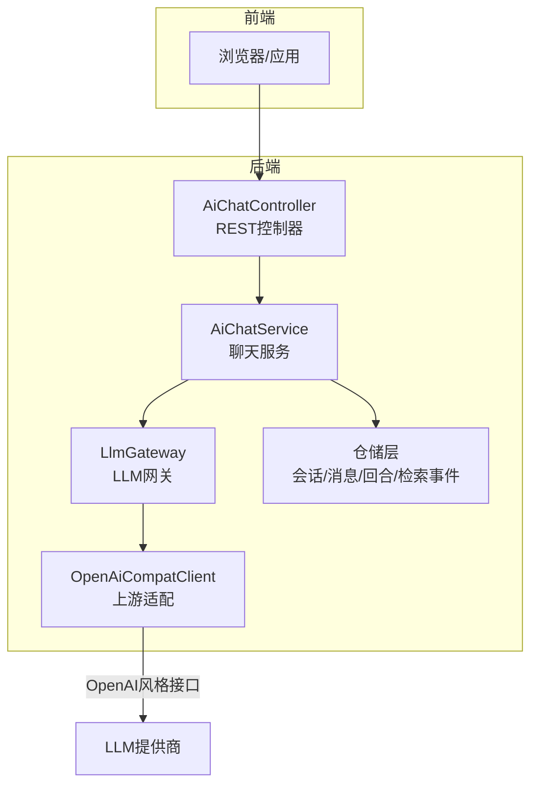
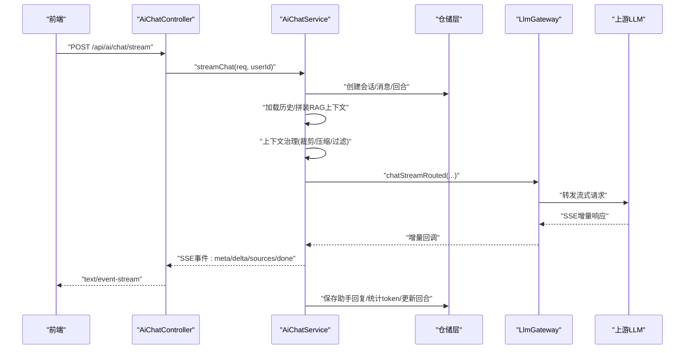
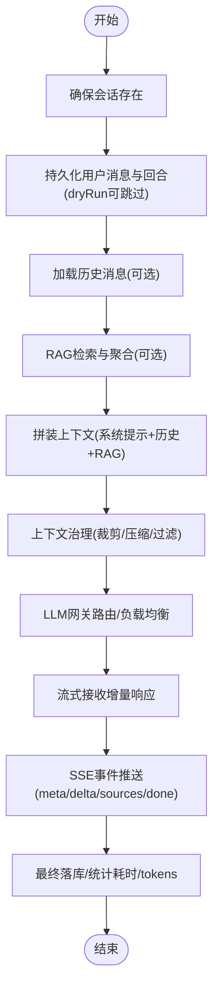
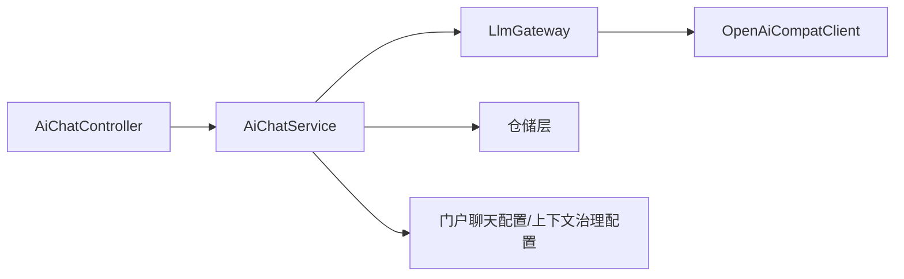

# AI聊天服务

<cite>
**本文引用的文件**
- [AiChatController.java](file://src/main/java/com/example/EnterpriseRagCommunity/controller/ai/AiChatController.java)
- [AiChatService.java](file://src/main/java/com/example/EnterpriseRagCommunity/service/ai/AiChatService.java)
- [AiChatStreamRequest.java](file://src/main/java/com/example/EnterpriseRagCommunity/dto/ai/AiChatStreamRequest.java)
- [AiChatResponseDTO.java](file://src/main/java/com/example/EnterpriseRagCommunity/dto/ai/AiChatResponseDTO.java)
- [OpenAiCompatClient.java](file://src/main/java/com/example/EnterpriseRagCommunity/service/ai/client/OpenAiCompatClient.java)
- [ChatMessage.java](file://src/main/java/com/example/EnterpriseRagCommunity/service/ai/dto/ChatMessage.java)
- [LlmQueueProperties.java](file://src/main/java/com/example/EnterpriseRagCommunity/config/LlmQueueProperties.java)
- [ChatContextGovernanceService.java](file://src/main/java/com/example/EnterpriseRagCommunity/service/ai/ChatContextGovernanceService.java)
- [ChatContextGovernanceConfigService.java](file://src/main/java/com/example/EnterpriseRagCommunity/service/ai/ChatContextGovernanceConfigService.java)
- [RagContextPromptService.java](file://src/main/java/com/example/EnterpriseRagCommunity/service/ai/RagContextPromptService.java)
</cite>

## 目录
1. [引言](#引言)
2. [项目结构](#项目结构)
3. [核心组件](#核心组件)
4. [架构总览](#架构总览)
5. [详细组件分析](#详细组件分析)
6. [依赖分析](#依赖分析)
7. [性能考虑](#性能考虑)
8. [故障排查指南](#故障排查指南)
9. [结论](#结论)
10. [附录：API接口规范与配置项](#附录api接口规范与配置项)

## 引言
本文件面向AI聊天服务的使用者与维护者，系统性阐述实时聊天对话功能的实现原理与使用方法，覆盖以下主题：
- 流式响应处理（Server-Sent Events）
- 消息历史管理与上下文窗口优化
- 异步处理机制、模型选择策略、响应时间优化与错误重试
- 聊天服务API接口规范（普通聊天、流式聊天、重新生成等）
- 配置项（模型参数、上下文长度、安全过滤等）
- 与LLM网关的集成（请求路由、负载均衡、故障转移）

## 项目结构
后端采用Spring Boot工程，聊天相关代码主要分布在控制器、服务层、DTO与客户端适配层：
- 控制器层：对外暴露REST接口，负责鉴权与入参校验
- 服务层：核心业务逻辑，包含会话管理、检索增强、上下文治理、与LLM网关交互
- DTO层：请求与响应的数据契约
- 客户端适配层：兼容OpenAI风格的流式/一次性调用封装
- 配置层：队列并发、队列容量等运行时参数

图表来源
- [AiChatController.java:17-47](file://src/main/java/com/example/EnterpriseRagCommunity/controller/ai/AiChatController.java#L17-L47)
- [AiChatService.java:89-115](file://src/main/java/com/example/EnterpriseRagCommunity/service/ai/AiChatService.java#L89-L115)
- [OpenAiCompatClient.java:64-142](file://src/main/java/com/example/EnterpriseRagCommunity/service/ai/client/OpenAiCompatClient.java#L64-L142)

章节来源
- [AiChatController.java:17-47](file://src/main/java/com/example/EnterpriseRagCommunity/controller/ai/AiChatController.java#L17-L47)
- [AiChatService.java:89-115](file://src/main/java/com/example/EnterpriseRagCommunity/service/ai/AiChatService.java#L89-L115)
- [OpenAiCompatClient.java:64-142](file://src/main/java/com/example/EnterpriseRagCommunity/service/ai/client/OpenAiCompatClient.java#L64-L142)

## 核心组件
- 控制器：提供流式聊天与一次性聊天两个入口，统一进行鉴权与用户ID解析
- 服务：完成会话/回合/消息持久化、历史加载、RAG检索与上下文拼装、模型参数决策、流式输出与最终落库
- DTO：定义请求与响应的数据结构
- 客户端适配：封装OpenAI风格的流式/一次性调用，支持超时、头部透传、错误处理
- 上下文治理：在进入模型前对消息进行裁剪、压缩与安全过滤
- RAG上下文拼装：根据策略与预算生成系统提示，注入到消息序列中

章节来源
- [AiChatController.java:25-35](file://src/main/java/com/example/EnterpriseRagCommunity/controller/ai/AiChatController.java#L25-L35)
- [AiChatService.java:123-604](file://src/main/java/com/example/EnterpriseRagCommunity/service/ai/AiChatService.java#L123-L604)
- [AiChatStreamRequest.java:18-82](file://src/main/java/com/example/EnterpriseRagCommunity/dto/ai/AiChatStreamRequest.java#L18-L82)
- [AiChatResponseDTO.java:8-27](file://src/main/java/com/example/EnterpriseRagCommunity/dto/ai/AiChatResponseDTO.java#L8-L27)
- [OpenAiCompatClient.java:64-142](file://src/main/java/com/example/EnterpriseRagCommunity/service/ai/client/OpenAiCompatClient.java#L64-L142)
- [ChatContextGovernanceService.java:20-38](file://src/main/java/com/example/EnterpriseRagCommunity/service/ai/ChatContextGovernanceService.java#L20-L38)
- [RagContextPromptService.java:50-62](file://src/main/java/com/example/EnterpriseRagCommunity/service/ai/RagContextPromptService.java#L50-L62)

## 架构总览
聊天服务整体流程如下：
- 请求进入控制器，解析用户身份
- 服务层创建/复用会话，按需持久化用户消息与回合
- 加载历史消息，结合RAG检索结果与系统提示，构建上下文
- 应用上下文治理策略，确保上下文在token预算内
- 通过LLM网关进行路由与负载均衡，发起流式/一次性调用
- 流式返回增量内容，最终落库并统计耗时与token用量

图表来源
- [AiChatController.java:25-29](file://src/main/java/com/example/EnterpriseRagCommunity/controller/ai/AiChatController.java#L25-L29)
- [AiChatService.java:123-604](file://src/main/java/com/example/EnterpriseRagCommunity/service/ai/AiChatService.java#L123-L604)
- [OpenAiCompatClient.java:64-105](file://src/main/java/com/example/EnterpriseRagCommunity/service/ai/client/OpenAiCompatClient.java#L64-L105)

## 详细组件分析

### 控制器：AiChatController
- 提供两条路径：
  - 流式聊天：/api/ai/chat/stream，返回text/event-stream
  - 一次性聊天：/api/ai/chat，返回JSON响应体
- 统一鉴权：从SecurityContext提取用户信息，查询管理员实体以获得userId
- 参数校验：基于AiChatStreamRequest进行验证

章节来源
- [AiChatController.java:25-35](file://src/main/java/com/example/EnterpriseRagCommunity/controller/ai/AiChatController.java#L25-L35)
- [AiChatController.java:37-46](file://src/main/java/com/example/EnterpriseRagCommunity/controller/ai/AiChatController.java#L37-L46)

### 服务：AiChatService（核心）
- 会话与持久化
  - 确保会话存在，必要时新建；非dryRun时持久化用户消息与回合
  - 回合记录首次token延迟与整体会话耗时
- 历史与上下文
  - 可配置historyLimit加载最近N条消息（排除当前用户消息）
  - 支持深思模式（deepThink）切换系统提示
- RAG检索与上下文拼装
  - 支持混合检索（BM25/向量/重排）与评论增强聚合
  - 将RAG结果拼装为系统提示注入上下文
  - 可选记录检索命中与上下文窗口统计
- 上下文治理
  - 在进入模型前执行裁剪、压缩与安全过滤，保证token预算与合规
- 模型参数与路由
  - 支持providerId/model/temperature/topP等参数覆盖
  - 通过LlmGateway进行路由与负载均衡
- 流式输出
  - SSE事件：meta（包含sessionId/userMessageId）、delta（增量内容）、sources（引用列表）、done（耗时）
  - 对深思模式自动补全<think>标签闭合
- 最终落库
  - 保存助手回复、统计tokens、持久化引用来源

图表来源
- [AiChatService.java:123-604](file://src/main/java/com/example/EnterpriseRagCommunity/service/ai/AiChatService.java#L123-L604)

章节来源
- [AiChatService.java:123-604](file://src/main/java/com/example/EnterpriseRagCommunity/service/ai/AiChatService.java#L123-L604)

### DTO：AiChatStreamRequest 与 AiChatResponseDTO
- 请求体AiChatStreamRequest
  - 必填字段：message
  - 可选覆盖：model/providerId/temperature/topP/historyLimit/deepThink/useRag/ragTopK/dryRun/images/files
- 响应体AiChatResponseDTO
  - 包含sessionId/userMessageId/questionMessageId/assistantMessageId/content/sources/latencyMs

章节来源
- [AiChatStreamRequest.java:18-82](file://src/main/java/com/example/EnterpriseRagCommunity/dto/ai/AiChatStreamRequest.java#L18-L82)
- [AiChatResponseDTO.java:8-27](file://src/main/java/com/example/EnterpriseRagCommunity/dto/ai/AiChatResponseDTO.java#L8-L27)

### 客户端适配：OpenAiCompatClient
- 支持两种调用模式
  - 流式：chatCompletionsStream，逐行消费SSE
  - 一次性：chatCompletionsOnce，返回完整JSON
- 参数构建：model/messages/temperature/topP/maxTokens/stop/enableThinking/thinkingBudget/extraBody/extraHeaders
- 错误处理：对非2xx响应抛出异常，读取错误流

章节来源
- [OpenAiCompatClient.java:64-142](file://src/main/java/com/example/EnterpriseRagCommunity/service/ai/client/OpenAiCompatClient.java#L64-L142)
- [OpenAiCompatClient.java:25-55](file://src/main/java/com/example/EnterpriseRagCommunity/service/ai/client/OpenAiCompatClient.java#L25-L55)

### 上下文治理：ChatContextGovernanceService 与 ChatContextGovernanceConfigService
- 功能：在进入模型前对消息进行裁剪、压缩与过滤，避免超出token预算或违规内容
- 配置：最大prompt tokens、保留回答tokens、每消息最大tokens、保留最后N条消息、是否允许丢弃RAG上下文等
- 日志与采样：可配置日志开关与采样率

章节来源
- [ChatContextGovernanceService.java:20-38](file://src/main/java/com/example/EnterpriseRagCommunity/service/ai/ChatContextGovernanceService.java#L20-L38)
- [ChatContextGovernanceConfigService.java:65-86](file://src/main/java/com/example/EnterpriseRagCommunity/service/ai/ChatContextGovernanceConfigService.java#L65-L86)

### RAG上下文拼装：RagContextPromptService
- 根据策略与预算生成系统提示，控制最大items、上下文tokens、保留回答tokens等
- 支持TOPK/FIXED/ADAPTIVE等策略，动态计算可用budget

章节来源
- [RagContextPromptService.java:50-62](file://src/main/java/com/example/EnterpriseRagCommunity/service/ai/RagContextPromptService.java#L50-L62)

## 依赖分析
- 控制器依赖服务层与管理员服务（用于解析当前用户）
- 服务层依赖多个子服务：RAG检索、上下文拼装、上下文治理、门户聊天配置、令牌计数、文件资产等
- 服务层通过LlmGateway与上游LLM交互，内部可能再委托OpenAiCompatClient
- 配置层提供队列并发与队列容量等参数

图表来源
- [AiChatController.java:22-23](file://src/main/java/com/example/EnterpriseRagCommunity/controller/ai/AiChatController.java#L22-L23)
- [AiChatService.java:89-115](file://src/main/java/com/example/EnterpriseRagCommunity/service/ai/AiChatService.java#L89-L115)
- [OpenAiCompatClient.java:19-42](file://src/main/java/com/example/EnterpriseRagCommunity/service/ai/client/OpenAiCompatClient.java#L19-L42)

章节来源
- [AiChatController.java:22-23](file://src/main/java/com/example/EnterpriseRagCommunity/controller/ai/AiChatController.java#L22-L23)
- [AiChatService.java:89-115](file://src/main/java/com/example/EnterpriseRagCommunity/service/ai/AiChatService.java#L89-L115)
- [OpenAiCompatClient.java:19-42](file://src/main/java/com/example/EnterpriseRagCommunity/service/ai/client/OpenAiCompatClient.java#L19-L42)

## 性能考虑
- 流式响应：使用SSE降低首token延迟，前端可即时渲染
- 上下文治理：在进入模型前裁剪/压缩，避免超预算导致失败重试
- RAG预算：通过上下文窗口策略与预算控制，平衡召回质量与token消耗
- 队列并发：通过队列属性限制并发与队列大小，避免瞬时洪峰
- 深思模式：在深思模式下降低temperature，提升稳定性

章节来源
- [AiChatService.java:409-411](file://src/main/java/com/example/EnterpriseRagCommunity/service/ai/AiChatService.java#L409-L411)
- [RagContextPromptService.java:50-62](file://src/main/java/com/example/EnterpriseRagCommunity/service/ai/RagContextPromptService.java#L50-L62)
- [LlmQueueProperties.java:10-15](file://src/main/java/com/example/EnterpriseRagCommunity/config/LlmQueueProperties.java#L10-L15)

## 故障排查指南
- 未登录或会话过期
  - 控制器侧会抛出认证异常，检查前端是否携带有效会话
- 数据持久化失败
  - 服务层在持久化回合/消息时捕获异常并通过SSE返回error事件，检查数据库连接与权限
- 上游HTTP错误
  - 客户端适配在非2xx时抛出异常，检查上游URL/鉴权头/配额
- 429限流
  - 网关路由策略可能触发限流，建议前端退避重试或调整并发
- 深思<think>标签未闭合
  - 服务层会在结束时自动补全，若仍异常，请检查模型输出格式

章节来源
- [AiChatController.java:37-46](file://src/main/java/com/example/EnterpriseRagCommunity/controller/ai/AiChatController.java#L37-L46)
- [AiChatService.java:177-186](file://src/main/java/com/example/EnterpriseRagCommunity/service/ai/AiChatService.java#L177-L186)
- [OpenAiCompatClient.java:94-97](file://src/main/java/com/example/EnterpriseRagCommunity/service/ai/client/OpenAiCompatClient.java#L94-L97)

## 结论
该聊天服务通过清晰的分层设计与完善的上下文治理策略，在保证安全性与合规性的前提下，实现了低延迟、可扩展的实时对话能力。结合RAG检索与多策略上下文拼装，能够在复杂场景下稳定输出高质量内容。

## 附录：API接口规范与配置项

### 接口规范
- 流式聊天
  - 方法与路径：POST /api/ai/chat/stream
  - 内容类型：application/json
  - 认证：基于会话的用户鉴权
  - 请求体字段：见AiChatStreamRequest
  - 响应：text/event-stream，事件包括meta/delta/sources/done
- 一次性聊天
  - 方法与路径：POST /api/ai/chat
  - 返回体：AiChatResponseDTO

章节来源
- [AiChatController.java:25-35](file://src/main/java/com/example/EnterpriseRagCommunity/controller/ai/AiChatController.java#L25-L35)
- [AiChatStreamRequest.java:18-82](file://src/main/java/com/example/EnterpriseRagCommunity/dto/ai/AiChatStreamRequest.java#L18-L82)
- [AiChatResponseDTO.java:8-27](file://src/main/java/com/example/EnterpriseRagCommunity/dto/ai/AiChatResponseDTO.java#L8-L27)

### 请求参数与响应格式
- 请求体AiChatStreamRequest
  - 必填：message
  - 可选覆盖：model/providerId/temperature/topP/historyLimit/deepThink/useRag/ragTopK/dryRun/images/files
- 响应体AiChatResponseDTO
  - 字段：sessionId/userMessageId/questionMessageId/assistantMessageId/content/sources/latencyMs

章节来源
- [AiChatStreamRequest.java:18-82](file://src/main/java/com/example/EnterpriseRagCommunity/dto/ai/AiChatStreamRequest.java#L18-L82)
- [AiChatResponseDTO.java:8-27](file://src/main/java/com/example/EnterpriseRagCommunity/dto/ai/AiChatResponseDTO.java#L8-L27)

### 配置项
- 队列并发与容量
  - app.ai.queue.maxConcurrent：最大并发
  - app.ai.queue.maxQueueSize：最大队列长度
  - app.ai.queue.keepCompleted：已完成保留数量
  - app.ai.queue.historyKeepDays：历史保留天数
- 上下文治理
  - enabled：是否启用
  - maxPromptTokens：最大提示tokens
  - reserveAnswerTokens：保留回答tokens
  - maxPromptChars：最大提示字符数
  - perMessageMaxTokens：每消息最大tokens
  - keepLastMessages：保留最后N条消息
  - allowDropRagContext：是否允许丢弃RAG上下文
  - 日志：logEnabled/logSampleRate/logMaxDays
- RAG上下文拼装
  - policy：策略（TOPK/FIXED/ADAPTIVE）
  - maxItems：最大条目数
  - maxContextTokens/contextTokenBudget：上下文tokens上限与预算
  - reserveAnswerTokens：保留回答tokens
  - perItemMaxTokens：每条目最大tokens
  - maxPromptChars：提示最大字符数

章节来源
- [LlmQueueProperties.java:10-15](file://src/main/java/com/example/EnterpriseRagCommunity/config/LlmQueueProperties.java#L10-L15)
- [ChatContextGovernanceConfigService.java:65-86](file://src/main/java/com/example/EnterpriseRagCommunity/service/ai/ChatContextGovernanceConfigService.java#L65-L86)
- [RagContextPromptService.java:50-62](file://src/main/java/com/example/EnterpriseRagCommunity/service/ai/RagContextPromptService.java#L50-L62)