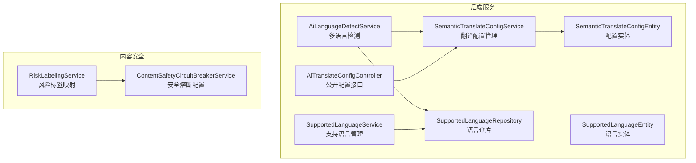
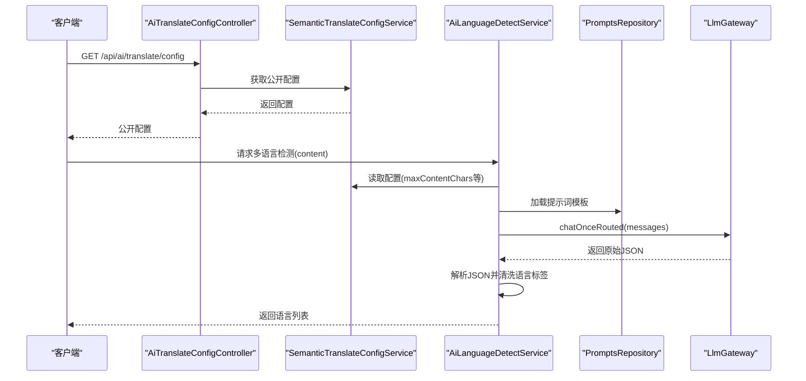
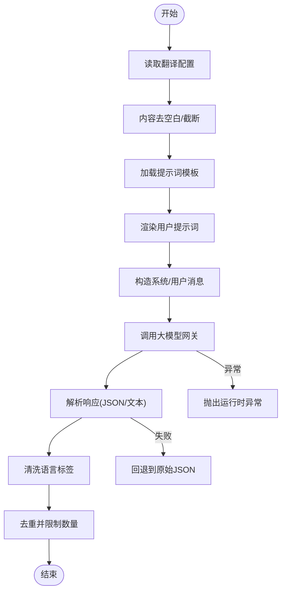
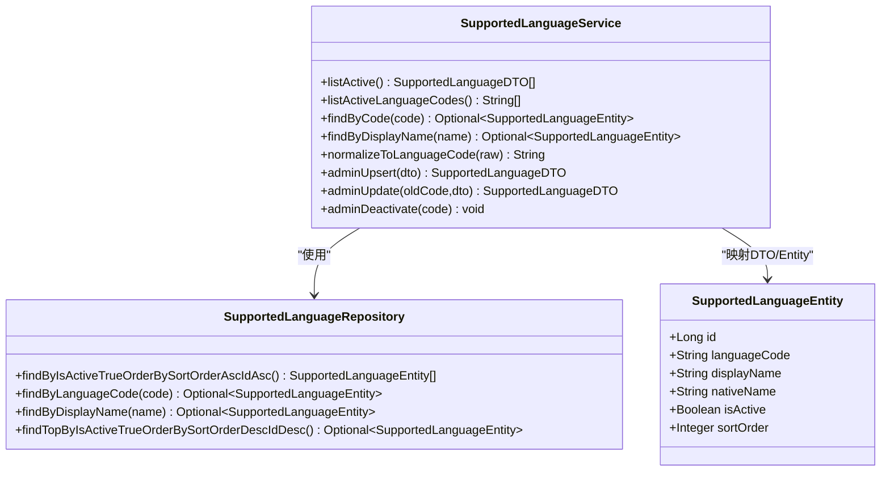
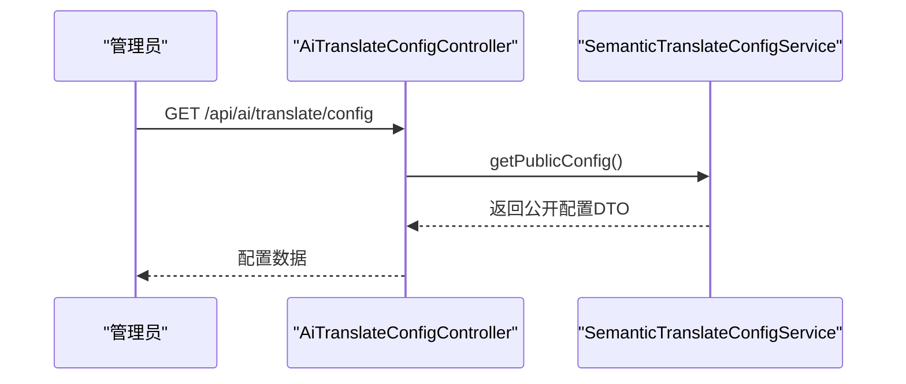
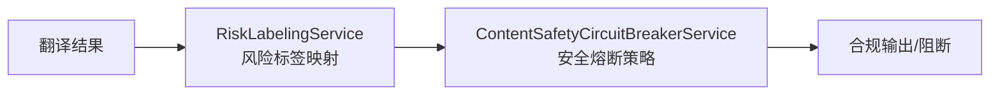
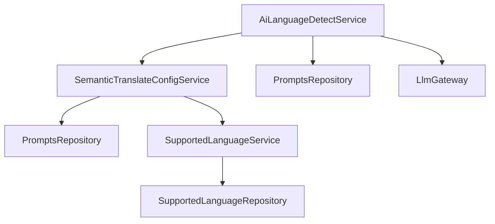

# AI语言服务

<cite>
**本文引用的文件**
- [AiLanguageDetectService.java](file://src/main/java/com/example/EnterpriseRagCommunity/service/ai/AiLanguageDetectService.java)
- [SupportedLanguageService.java](file://src/main/java/com/example/EnterpriseRagCommunity/service/ai/SupportedLanguageService.java)
- [SemanticTranslateConfigService.java](file://src/main/java/com/example/EnterpriseRagCommunity/service/ai/SemanticTranslateConfigService.java)
- [AiTranslateConfigController.java](file://src/main/java/com/example/EnterpriseRagCommunity/controller/ai/AiTranslateConfigController.java)
- [SemanticTranslateConfigEntity.java](file://src/main/java/com/example/EnterpriseRagCommunity/entity/ai/SemanticTranslateConfigEntity.java)
- [SupportedLanguageEntity.java](file://src/main/java/com/example/EnterpriseRagCommunity/entity/ai/SupportedLanguageEntity.java)
- [SupportedLanguageRepository.java](file://src/main/java/com/example/EnterpriseRagCommunity/repository/ai/SupportedLanguageRepository.java)
- [AiLanguageDetectServiceTest.java](file://src/test/java/com/example/EnterpriseRagCommunity/service/ai/AiLanguageDetectServiceTest.java)
- [SupportedLanguageServiceTest.java](file://src/test/java/com/example/EnterpriseRagCommunity/service/ai/SupportedLanguageServiceTest.java)
- [RiskLabelingService.java](file://src/main/java/com/example/EnterpriseRagCommunity/service/moderation/RiskLabelingService.java)
- [ContentSafetyCircuitBreakerService.java](file://src/main/java/com/example/EnterpriseRagCommunity/service/safety/ContentSafetyCircuitBreakerService.java)
</cite>

## 目录
1. [引言](#引言)
2. [项目结构](#项目结构)
3. [核心组件](#核心组件)
4. [架构总览](#架构总览)
5. [详细组件分析](#详细组件分析)
6. [依赖分析](#依赖分析)
7. [性能考虑](#性能考虑)
8. [故障排查指南](#故障排查指南)
9. [结论](#结论)
10. [附录](#附录)

## 引言
本文件面向AI语言服务系统，围绕多语言检测、语言标签分类、语义翻译等核心语言处理能力，系统阐述其实现原理、技术架构、配置管理、API接口规范以及与内容安全系统的协作机制。文档同时提供性能优化建议与常见问题排查方法，帮助开发者与运维人员快速理解并高效使用该语言服务。

## 项目结构
语言服务主要分布在后端Java模块中，涉及服务层、实体层、仓库层与控制器层；前端通过独立的Vite应用提供交互界面。语言服务的关键模块包括：
- 多语言检测：AiLanguageDetectService
- 支持语言管理：SupportedLanguageService
- 翻译配置管理：SemanticTranslateConfigService 及其控制器 AiTranslateConfigController
- 内容安全与合规：RiskLabelingService 与 ContentSafetyCircuitBreakerService

**图表来源**
- [AiLanguageDetectService.java:1-148](file://src/main/java/com/example/EnterpriseRagCommunity/service/ai/AiLanguageDetectService.java#L1-L148)
- [SupportedLanguageService.java:1-145](file://src/main/java/com/example/EnterpriseRagCommunity/service/ai/SupportedLanguageService.java#L1-L145)
- [SemanticTranslateConfigService.java:1-259](file://src/main/java/com/example/EnterpriseRagCommunity/service/ai/SemanticTranslateConfigService.java#L1-L259)
- [AiTranslateConfigController.java:1-23](file://src/main/java/com/example/EnterpriseRagCommunity/controller/ai/AiTranslateConfigController.java#L1-L23)
- [SemanticTranslateConfigEntity.java:1-65](file://src/main/java/com/example/EnterpriseRagCommunity/entity/ai/SemanticTranslateConfigEntity.java#L1-L65)
- [SupportedLanguageEntity.java:1-39](file://src/main/java/com/example/EnterpriseRagCommunity/entity/ai/SupportedLanguageEntity.java#L1-L39)
- [SupportedLanguageRepository.java:1-20](file://src/main/java/com/example/EnterpriseRagCommunity/repository/ai/SupportedLanguageRepository.java#L1-L20)
- [RiskLabelingService.java:1-238](file://src/main/java/com/example/EnterpriseRagCommunity/service/moderation/RiskLabelingService.java#L1-L238)
- [ContentSafetyCircuitBreakerService.java:253-275](file://src/main/java/com/example/EnterpriseRagCommunity/service/safety/ContentSafetyCircuitBreakerService.java#L253-L275)

**章节来源**
- [AiLanguageDetectService.java:1-148](file://src/main/java/com/example/EnterpriseRagCommunity/service/ai/AiLanguageDetectService.java#L1-L148)
- [SupportedLanguageService.java:1-145](file://src/main/java/com/example/EnterpriseRagCommunity/service/ai/SupportedLanguageService.java#L1-L145)
- [SemanticTranslateConfigService.java:1-259](file://src/main/java/com/example/EnterpriseRagCommunity/service/ai/SemanticTranslateConfigService.java#L1-L259)
- [AiTranslateConfigController.java:1-23](file://src/main/java/com/example/EnterpriseRagCommunity/controller/ai/AiTranslateConfigController.java#L1-L23)
- [SemanticTranslateConfigEntity.java:1-65](file://src/main/java/com/example/EnterpriseRagCommunity/entity/ai/SemanticTranslateConfigEntity.java#L1-L65)
- [SupportedLanguageEntity.java:1-39](file://src/main/java/com/example/EnterpriseRagCommunity/entity/ai/SupportedLanguageEntity.java#L1-L39)
- [SupportedLanguageRepository.java:1-20](file://src/main/java/com/example/EnterpriseRagCommunity/repository/ai/SupportedLanguageRepository.java#L1-L20)
- [RiskLabelingService.java:1-238](file://src/main/java/com/example/EnterpriseRagCommunity/service/moderation/RiskLabelingService.java#L1-L238)
- [ContentSafetyCircuitBreakerService.java:253-275](file://src/main/java/com/example/EnterpriseRagCommunity/service/safety/ContentSafetyCircuitBreakerService.java#L253-L275)

## 核心组件
- 多语言检测服务：基于提示词模板与大模型推理，提取文本中的语言标签，具备内容截断、JSON解析与去重限制等鲁棒性处理。
- 支持语言服务：维护可选语言清单，提供语言代码标准化、排序与启用状态管理。
- 翻译配置服务：集中管理翻译开关、最大内容长度、历史保留策略、允许的目标语言列表等，支持公开配置查询接口。
- 内容安全服务：将风险标签映射到内容对象，配合安全熔断策略保障翻译后内容的安全性与合规性。

**章节来源**
- [AiLanguageDetectService.java:26-148](file://src/main/java/com/example/EnterpriseRagCommunity/service/ai/AiLanguageDetectService.java#L26-L148)
- [SupportedLanguageService.java:24-145](file://src/main/java/com/example/EnterpriseRagCommunity/service/ai/SupportedLanguageService.java#L24-L145)
- [SemanticTranslateConfigService.java:54-259](file://src/main/java/com/example/EnterpriseRagCommunity/service/ai/SemanticTranslateConfigService.java#L54-L259)
- [RiskLabelingService.java:37-238](file://src/main/java/com/example/EnterpriseRagCommunity/service/moderation/RiskLabelingService.java#L37-L238)
- [ContentSafetyCircuitBreakerService.java:253-275](file://src/main/java/com/example/EnterpriseRagCommunity/service/safety/ContentSafetyCircuitBreakerService.java#L253-L275)

## 架构总览
语言服务采用“配置驱动 + 提示词模板 + 大模型推理”的架构模式：
- 配置层：通过SemanticTranslateConfigService加载与校验配置，支持默认值与公开配置输出。
- 检测层：AiLanguageDetectService按配置渲染提示词，调用大模型网关获取结果，解析JSON并清洗语言标签。
- 语言层：SupportedLanguageService统一管理语言清单与标准化逻辑。
- 安全层：RiskLabelingService与ContentSafetyCircuitBreakerService协同，对翻译后内容进行风险标注与安全控制。

**图表来源**
- [AiTranslateConfigController.java:17-20](file://src/main/java/com/example/EnterpriseRagCommunity/controller/ai/AiTranslateConfigController.java#L17-L20)
- [SemanticTranslateConfigService.java:64-76](file://src/main/java/com/example/EnterpriseRagCommunity/service/ai/SemanticTranslateConfigService.java#L64-L76)
- [AiLanguageDetectService.java:26-78](file://src/main/java/com/example/EnterpriseRagCommunity/service/ai/AiLanguageDetectService.java#L26-L78)

## 详细组件分析

### 多语言检测服务（AiLanguageDetectService）
- 功能职责
  - 读取翻译配置，限制输入长度，加载提示词模板，构造消息序列。
  - 调用大模型网关获取响应，优先从message.content解析，回退到choices[0].text或原始JSON。
  - 解析JSON中的languages数组，清洗并去重，限制最多返回3个语言标签。
- 关键流程
  - 输入预处理：去除首尾空白、按配置截断。
  - 提示词渲染：支持模板变量替换，若模板为空则直接使用内容。
  - 结果解析：先尝试标准JSON路径，再尝试提取首部/尾部花括号包裹的JSON片段。
  - 标签清洗：小写化、去引号、去除多余空白、限制长度。
- 错误处理
  - 配置禁用时抛出异常。
  - 提示词缺失时抛出异常。
  - 大模型调用异常包装为运行时异常。
  - JSON解析失败时抛出参数异常。

**图表来源**
- [AiLanguageDetectService.java:26-148](file://src/main/java/com/example/EnterpriseRagCommunity/service/ai/AiLanguageDetectService.java#L26-L148)

**章节来源**
- [AiLanguageDetectService.java:26-148](file://src/main/java/com/example/EnterpriseRagCommunity/service/ai/AiLanguageDetectService.java#L26-L148)
- [AiLanguageDetectServiceTest.java:28-322](file://src/test/java/com/example/EnterpriseRagCommunity/service/ai/AiLanguageDetectServiceTest.java#L28-L322)

### 支持语言服务（SupportedLanguageService）
- 功能职责
  - 列出启用的语言及其代码，支持按显示名查找。
  - 将原始语言标识标准化为标准语言代码（如zh、zh-cn、zh-hans统一为zh-CN）。
  - 管理语言条目的增删改与激活状态。
- 关键流程
  - 标准化：优先识别zh变体，否则按代码或显示名查找，最后回退到原始值。
  - 激活与排序：新增语言自动分配排序序号，保持稳定顺序。
- 数据模型
  - 实体包含语言代码、显示名、本地名、是否激活、排序序号等字段。

**图表来源**
- [SupportedLanguageService.java:18-145](file://src/main/java/com/example/EnterpriseRagCommunity/service/ai/SupportedLanguageService.java#L18-L145)
- [SupportedLanguageEntity.java:16-39](file://src/main/java/com/example/EnterpriseRagCommunity/entity/ai/SupportedLanguageEntity.java#L16-L39)
- [SupportedLanguageRepository.java:11-19](file://src/main/java/com/example/EnterpriseRagCommunity/repository/ai/SupportedLanguageRepository.java#L11-L19)

**章节来源**
- [SupportedLanguageService.java:24-145](file://src/main/java/com/example/EnterpriseRagCommunity/service/ai/SupportedLanguageService.java#L24-L145)
- [SupportedLanguageEntity.java:16-39](file://src/main/java/com/example/EnterpriseRagCommunity/entity/ai/SupportedLanguageEntity.java#L16-L39)
- [SupportedLanguageRepository.java:11-19](file://src/main/java/com/example/EnterpriseRagCommunity/repository/ai/SupportedLanguageRepository.java#L11-L19)
- [SupportedLanguageServiceTest.java:35-57](file://src/test/java/com/example/EnterpriseRagCommunity/service/ai/SupportedLanguageServiceTest.java#L35-L57)

### 翻译配置服务与控制器（SemanticTranslateConfigService / AiTranslateConfigController）
- 功能职责
  - 维护翻译任务的全局配置：启用状态、提示词代码、最大内容长度、历史保留策略、允许的目标语言列表等。
  - 提供管理员配置更新与公开配置查询接口。
  - 默认配置：启用翻译、默认提示词代码、默认最大内容长度、默认历史保留策略、默认允许目标语言列表。
- 关键流程
  - 合并与校验：对管理员提交的payload进行长度、范围、格式校验，合并到实体并持久化。
  - 公开配置：根据当前配置生成公开DTO，若未配置则使用默认值。
  - 允许目标语言：支持JSON或换行分隔两种输入方式，统一清洗与标准化。
- API接口
  - GET /api/ai/translate/config：返回公开配置（启用状态、允许的目标语言列表）。

**图表来源**
- [AiTranslateConfigController.java:17-20](file://src/main/java/com/example/EnterpriseRagCommunity/controller/ai/AiTranslateConfigController.java#L17-L20)
- [SemanticTranslateConfigService.java:64-76](file://src/main/java/com/example/EnterpriseRagCommunity/service/ai/SemanticTranslateConfigService.java#L64-L76)

**章节来源**
- [SemanticTranslateConfigService.java:54-259](file://src/main/java/com/example/EnterpriseRagCommunity/service/ai/SemanticTranslateConfigService.java#L54-L259)
- [AiTranslateConfigController.java:17-20](file://src/main/java/com/example/EnterpriseRagCommunity/controller/ai/AiTranslateConfigController.java#L17-L20)
- [SemanticTranslateConfigEntity.java:20-65](file://src/main/java/com/example/EnterpriseRagCommunity/entity/ai/SemanticTranslateConfigEntity.java#L20-L65)

### 内容安全与合规（RiskLabelingService / ContentSafetyCircuitBreakerService）
- 功能职责
  - RiskLabelingService：将内容与风险标签关联，支持按来源清理与替换，提供标签slug与名称映射。
  - ContentSafetyCircuitBreakerService：提供安全熔断配置的规范化与作用域控制，支持全局或按用户/入口点生效。
- 协作机制
  - 在翻译完成后，可结合RiskLabelingService对翻译结果进行风险标签标注，再由ContentSafetyCircuitBreakerService执行安全策略（如拦截、限流、降级）。

**图表来源**
- [RiskLabelingService.java:54-122](file://src/main/java/com/example/EnterpriseRagCommunity/service/moderation/RiskLabelingService.java#L54-L122)
- [ContentSafetyCircuitBreakerService.java:253-275](file://src/main/java/com/example/EnterpriseRagCommunity/service/safety/ContentSafetyCircuitBreakerService.java#L253-L275)

**章节来源**
- [RiskLabelingService.java:37-238](file://src/main/java/com/example/EnterpriseRagCommunity/service/moderation/RiskLabelingService.java#L37-L238)
- [ContentSafetyCircuitBreakerService.java:253-275](file://src/main/java/com/example/EnterpriseRagCommunity/service/safety/ContentSafetyCircuitBreakerService.java#L253-L275)

## 依赖分析
- 组件耦合
  - AiLanguageDetectService依赖SemanticTranslateConfigService（配置）、PromptsRepository（提示词）、LlmGateway（推理）、PromptLlmParamResolver（参数解析）。
  - SemanticTranslateConfigService依赖PromptsRepository（提示词校验）、SupportedLanguageService（语言标准化）、JPA仓库（持久化）。
  - SupportedLanguageService依赖SupportedLanguageRepository。
- 外部依赖
  - 大模型网关（LlmGateway）负责实际推理调用。
  - 数据库存储配置与语言清单实体。

**图表来源**
- [AiLanguageDetectService.java:18-22](file://src/main/java/com/example/EnterpriseRagCommunity/service/ai/AiLanguageDetectService.java#L18-L22)
- [SemanticTranslateConfigService.java:37-41](file://src/main/java/com/example/EnterpriseRagCommunity/service/ai/SemanticTranslateConfigService.java#L37-L41)
- [SupportedLanguageService.java:22-22](file://src/main/java/com/example/EnterpriseRagCommunity/service/ai/SupportedLanguageService.java#L22-L22)

**章节来源**
- [AiLanguageDetectService.java:18-22](file://src/main/java/com/example/EnterpriseRagCommunity/service/ai/AiLanguageDetectService.java#L18-L22)
- [SemanticTranslateConfigService.java:37-41](file://src/main/java/com/example/EnterpriseRagCommunity/service/ai/SemanticTranslateConfigService.java#L37-L41)
- [SupportedLanguageService.java:22-22](file://src/main/java/com/example/EnterpriseRagCommunity/service/ai/SupportedLanguageService.java#L22-L22)

## 性能考虑
- 输入长度控制：通过配置的最大内容长度限制，避免超长文本导致的延迟与成本上升。
- 结果解析优化：优先从标准路径解析JSON，失败时仅在必要范围内回退，减少无效解析。
- 标签清洗与去重：在解析阶段即进行去重与数量限制，降低下游处理压力。
- 缓存与批处理：建议在网关层引入提示词与模型参数缓存；对批量检测场景，可合并请求以提升吞吐。
- 资源隔离：为不同语言或来源设置队列与资源配额，防止热点影响整体稳定性。

## 故障排查指南
- 多语言检测异常
  - 现象：抛出“翻译功能已关闭”或“Prompt code not found”。
  - 排查：确认配置启用状态与提示词代码是否存在；检查大模型网关连通性与路由。
  - 参考：[AiLanguageDetectServiceTest.java:28-43](file://src/test/java/com/example/EnterpriseRagCommunity/service/ai/AiLanguageDetectServiceTest.java#L28-L43)
- JSON解析失败
  - 现象：抛出“AI 输出无法解析为语言标签，请重试”。
  - 排查：确认大模型返回格式符合预期；检查清洗逻辑是否正确提取JSON片段。
  - 参考：[AiLanguageDetectService.java:100-130](file://src/main/java/com/example/EnterpriseRagCommunity/service/ai/AiLanguageDetectService.java#L100-L130)
- 语言标准化问题
  - 现象：语言代码不一致或未识别。
  - 排查：确认SupportedLanguageService的标准化规则与数据库中的语言清单。
  - 参考：[SupportedLanguageServiceTest.java:45-57](file://src/test/java/com/example/EnterpriseRagCommunity/service/ai/SupportedLanguageServiceTest.java#L45-L57)
- 安全策略生效
  - 现象：翻译后内容被阻断或降级。
  - 排查：检查ContentSafetyCircuitBreakerService的模式与作用域配置，确认RiskLabelingService是否正确标注风险标签。
  - 参考：[ContentSafetyCircuitBreakerService.java:253-275](file://src/main/java/com/example/EnterpriseRagCommunity/service/safety/ContentSafetyCircuitBreakerService.java#L253-L275)，[RiskLabelingService.java:54-122](file://src/main/java/com/example/EnterpriseRagCommunity/service/moderation/RiskLabelingService.java#L54-L122)

**章节来源**
- [AiLanguageDetectServiceTest.java:28-322](file://src/test/java/com/example/EnterpriseRagCommunity/service/ai/AiLanguageDetectServiceTest.java#L28-L322)
- [AiLanguageDetectService.java:100-130](file://src/main/java/com/example/EnterpriseRagCommunity/service/ai/AiLanguageDetectService.java#L100-L130)
- [SupportedLanguageServiceTest.java:45-57](file://src/test/java/com/example/EnterpriseRagCommunity/service/ai/SupportedLanguageServiceTest.java#L45-L57)
- [ContentSafetyCircuitBreakerService.java:253-275](file://src/main/java/com/example/EnterpriseRagCommunity/service/safety/ContentSafetyCircuitBreakerService.java#L253-L275)
- [RiskLabelingService.java:54-122](file://src/main/java/com/example/EnterpriseRagCommunity/service/moderation/RiskLabelingService.java#L54-L122)

## 结论
本语言服务通过“配置驱动 + 提示词模板 + 大模型推理”的方式实现了稳定的多语言检测与翻译能力，并以支持语言管理与内容安全体系保障了可用性与合规性。建议在生产环境中结合性能优化与安全策略，持续迭代提示词与参数，以获得更高的准确率与更低的错误率。

## 附录

### API接口规范（摘要）
- GET /api/ai/translate/config
  - 功能：获取公开翻译配置（启用状态、允许的目标语言列表）。
  - 返回：公开配置DTO。
  - 参考：[AiTranslateConfigController.java:17-20](file://src/main/java/com/example/EnterpriseRagCommunity/controller/ai/AiTranslateConfigController.java#L17-L20)，[SemanticTranslateConfigService.java:64-76](file://src/main/java/com/example/EnterpriseRagCommunity/service/ai/SemanticTranslateConfigService.java#L64-L76)

### 配置管理要点（摘要）
- 翻译开关与提示词：通过配置实体与提示词代码绑定，支持动态切换。
- 最大内容长度：限制输入长度，平衡性能与准确性。
- 历史保留策略：控制历史记录的天数与条数，兼顾审计与存储成本。
- 允许目标语言：支持JSON或换行分隔，统一清洗与标准化。
- 参考：[SemanticTranslateConfigEntity.java:27-53](file://src/main/java/com/example/EnterpriseRagCommunity/entity/ai/SemanticTranslateConfigEntity.java#L27-L53)，[SemanticTranslateConfigService.java:135-177](file://src/main/java/com/example/EnterpriseRagCommunity/service/ai/SemanticTranslateConfigService.java#L135-L177)