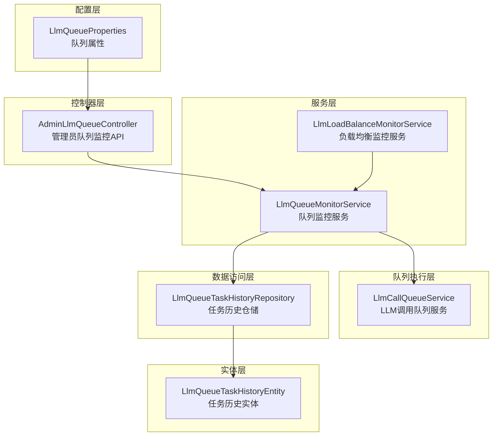
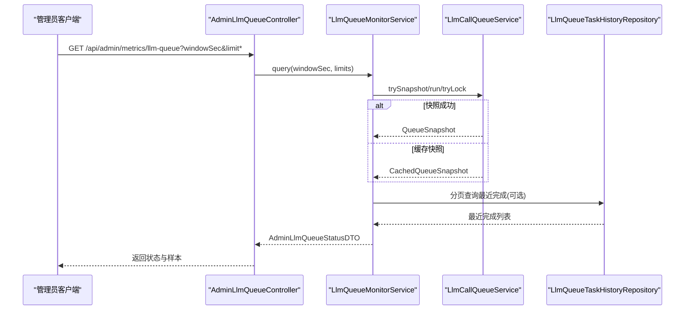
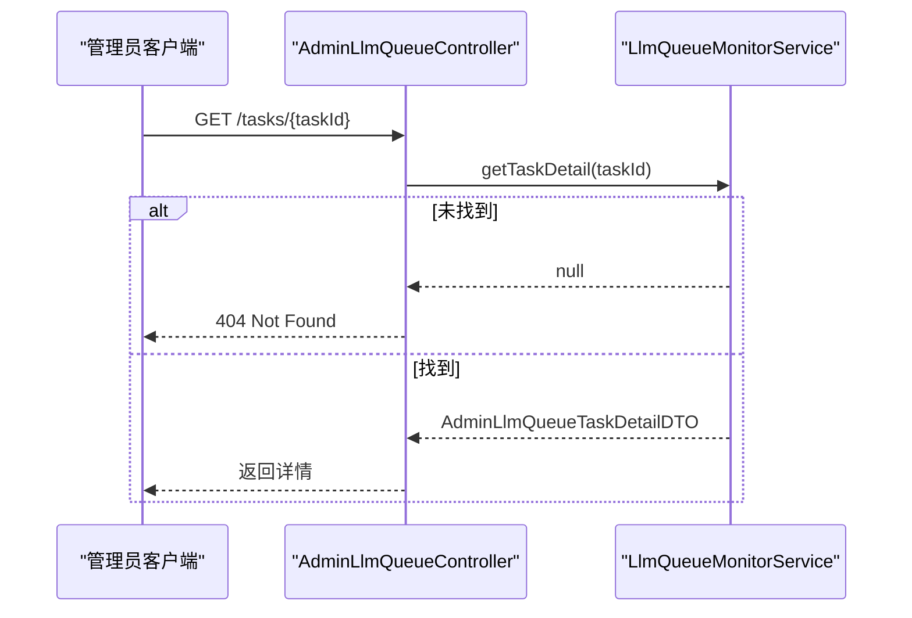
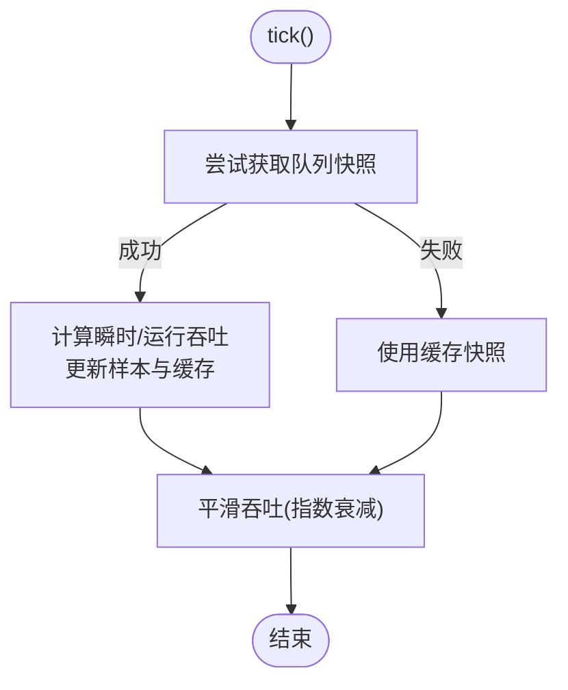
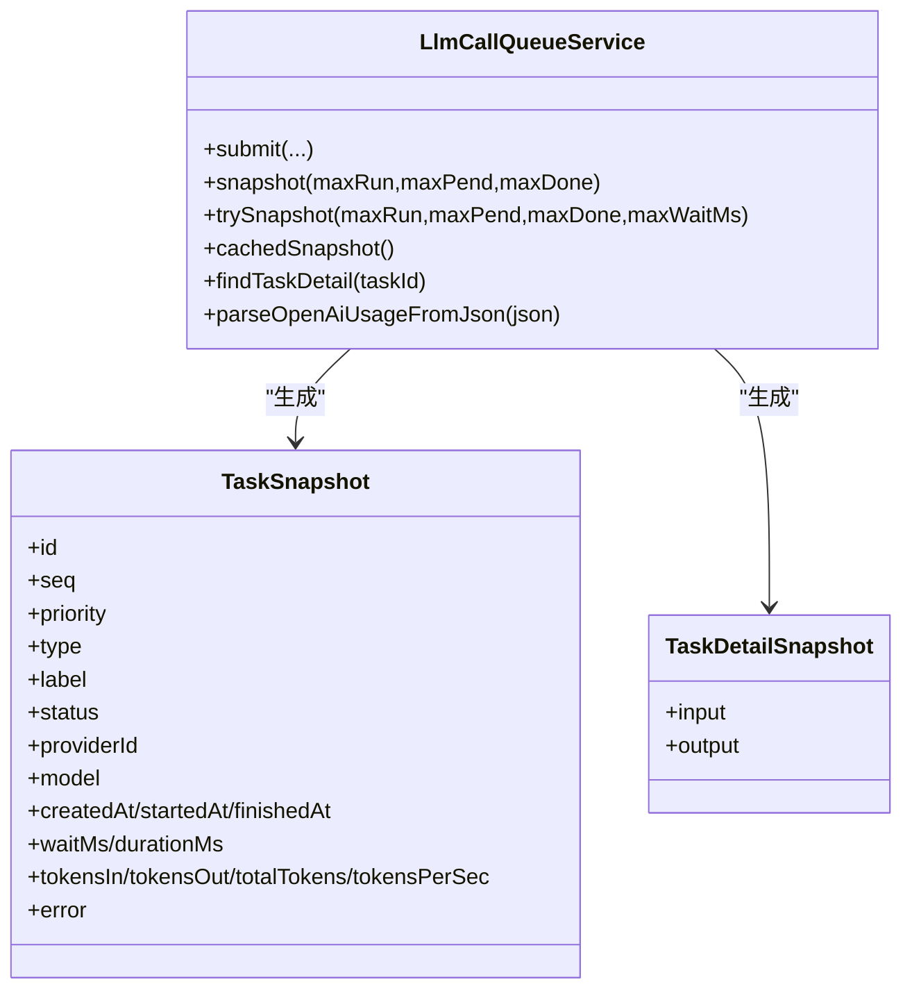
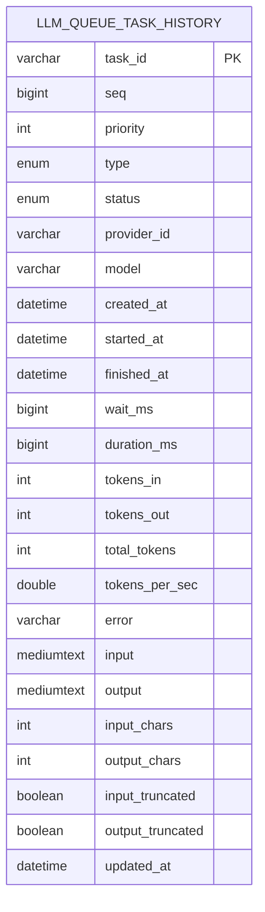
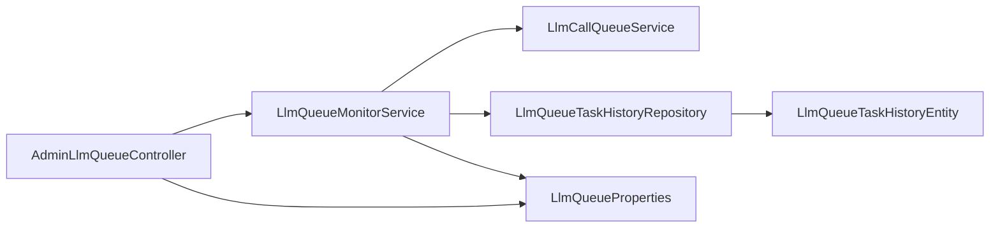

# AI队列监控

<cite>
**本文引用的文件**
- [LlmQueueProperties.java](file://src/main/java/com/example/EnterpriseRagCommunity/config/LlmQueueProperties.java)
- [AdminLlmQueueController.java](file://src/main/java/com/example/EnterpriseRagCommunity/controller/monitor/admin/AdminLlmQueueController.java)
- [LlmQueueMonitorService.java](file://src/main/java/com/example/EnterpriseRagCommunity/service/monitor/LlmQueueMonitorService.java)
- [AdminLlmQueueStatusDTO.java](file://src/main/java/com/example/EnterpriseRagCommunity/dto/monitor/AdminLlmQueueStatusDTO.java)
- [AdminLlmQueueTaskDTO.java](file://src/main/java/com/example/EnterpriseRagCommunity/dto/monitor/AdminLlmQueueTaskDTO.java)
- [LlmLoadBalanceMonitorService.java](file://src/main/java/com/example/EnterpriseRagCommunity/service/monitor/LlmLoadBalanceMonitorService.java)
- [LlmCallQueueService.java](file://src/main/java/com/example/EnterpriseRagCommunity/service/ai/LlmCallQueueService.java)
- [LlmQueueTaskHistoryRepository.java](file://src/main/java/com/example/EnterpriseRagCommunity/repository/monitor/LlmQueueTaskHistoryRepository.java)
- [LlmQueueTaskHistoryEntity.java](file://src/main/java/com/example/EnterpriseRagCommunity/entity/monitor/LlmQueueTaskHistoryEntity.java)
</cite>

## 目录
1. [引言](#引言)
2. [项目结构](#项目结构)
3. [核心组件](#核心组件)
4. [架构总览](#架构总览)
5. [详细组件分析](#详细组件分析)
6. [依赖分析](#依赖分析)
7. [性能考虑](#性能考虑)
8. [故障排查指南](#故障排查指南)
9. [结论](#结论)
10. [附录](#附录)

## 引言
本运维文档面向AI队列监控系统，聚焦LLM调用队列的监控机制与模型探测能力，覆盖任务排队、执行状态、性能指标、配置参数、API接口、异常处理与性能优化建议。通过后端控制器、监控服务、队列服务、历史仓储与实体之间的协作，系统实现了对运行中任务、待执行任务、近期完成任务的实时观测与历史回溯，同时提供负载均衡维度的性能聚合视图。

## 项目结构
围绕“队列监控”主题，相关模块分布如下：
- 配置层：队列属性定义与默认值
- 控制器层：对外暴露的管理员监控API
- 服务层：队列监控服务与负载均衡监控服务
- 队列执行层：LLM调用队列服务（调度、统计、快照）
- 数据访问层：队列任务历史仓储
- 实体层：队列任务历史实体

图表来源
- [AdminLlmQueueController.java:1-79](file://src/main/java/com/example/EnterpriseRagCommunity/controller/monitor/admin/AdminLlmQueueController.java#L1-L79)
- [LlmQueueMonitorService.java:1-397](file://src/main/java/com/example/EnterpriseRagCommunity/service/monitor/LlmQueueMonitorService.java#L1-L397)
- [LlmLoadBalanceMonitorService.java:1-147](file://src/main/java/com/example/EnterpriseRagCommunity/service/monitor/LlmLoadBalanceMonitorService.java#L1-L147)
- [LlmCallQueueService.java:1-800](file://src/main/java/com/example/EnterpriseRagCommunity/service/ai/LlmCallQueueService.java#L1-L800)
- [LlmQueueTaskHistoryRepository.java:1-17](file://src/main/java/com/example/EnterpriseRagCommunity/repository/monitor/LlmQueueTaskHistoryRepository.java#L1-L17)
- [LlmQueueTaskHistoryEntity.java:1-100](file://src/main/java/com/example/EnterpriseRagCommunity/entity/monitor/LlmQueueTaskHistoryEntity.java#L1-L100)

章节来源
- [AdminLlmQueueController.java:1-79](file://src/main/java/com/example/EnterpriseRagCommunity/controller/monitor/admin/AdminLlmQueueController.java#L1-L79)
- [LlmQueueMonitorService.java:1-397](file://src/main/java/com/example/EnterpriseRagCommunity/service/monitor/LlmQueueMonitorService.java#L1-L397)
- [LlmLoadBalanceMonitorService.java:1-147](file://src/main/java/com/example/EnterpriseRagCommunity/service/monitor/LlmLoadBalanceMonitorService.java#L1-L147)
- [LlmCallQueueService.java:1-800](file://src/main/java/com/example/EnterpriseRagCommunity/service/ai/LlmCallQueueService.java#L1-L800)
- [LlmQueueTaskHistoryRepository.java:1-17](file://src/main/java/com/example/EnterpriseRagCommunity/repository/monitor/LlmQueueTaskHistoryRepository.java#L1-L17)
- [LlmQueueTaskHistoryEntity.java:1-100](file://src/main/java/com/example/EnterpriseRagCommunity/entity/monitor/LlmQueueTaskHistoryEntity.java#L1-L100)

## 核心组件
- 队列属性配置：定义并发上限、队列容量、已完成保留数量与历史保留天数
- 管理员队列监控API：提供状态查询、任务详情、配置读取与更新
- 队列监控服务：定时采样、平滑计算吞吐、合并内存与数据库中的最近完成任务、生成时间序列样本
- LLM调用队列服务：任务提交、调度、快照、统计、去重与明细追踪
- 任务历史仓储与实体：持久化已完成任务的明细，支持分页查询与过期清理

章节来源
- [LlmQueueProperties.java:1-16](file://src/main/java/com/example/EnterpriseRagCommunity/config/LlmQueueProperties.java#L1-L16)
- [AdminLlmQueueController.java:1-79](file://src/main/java/com/example/EnterpriseRagCommunity/controller/monitor/admin/AdminLlmQueueController.java#L1-L79)
- [LlmQueueMonitorService.java:1-397](file://src/main/java/com/example/EnterpriseRagCommunity/service/monitor/LlmQueueMonitorService.java#L1-L397)
- [LlmCallQueueService.java:1-800](file://src/main/java/com/example/EnterpriseRagCommunity/service/ai/LlmCallQueueService.java#L1-L800)
- [LlmQueueTaskHistoryRepository.java:1-17](file://src/main/java/com/example/EnterpriseRagCommunity/repository/monitor/LlmQueueTaskHistoryRepository.java#L1-L17)
- [LlmQueueTaskHistoryEntity.java:1-100](file://src/main/java/com/example/EnterpriseRagCommunity/entity/monitor/LlmQueueTaskHistoryEntity.java#L1-L100)

## 架构总览
系统采用“控制器-服务-队列-仓储”的分层设计。管理员通过REST API查询队列状态、任务详情与配置；监控服务基于队列服务的快照与统计进行聚合；已完成任务明细由队列服务写入历史表，监控服务在必要时从数据库补充最近完成列表。

图表来源
- [AdminLlmQueueController.java:30-47](file://src/main/java/com/example/EnterpriseRagCommunity/controller/monitor/admin/AdminLlmQueueController.java#L30-L47)
- [LlmQueueMonitorService.java:152-203](file://src/main/java/com/example/EnterpriseRagCommunity/service/monitor/LlmQueueMonitorService.java#L152-L203)
- [LlmCallQueueService.java:683-707](file://src/main/java/com/example/EnterpriseRagCommunity/service/ai/LlmCallQueueService.java#L683-L707)
- [LlmQueueTaskHistoryRepository.java:13-16](file://src/main/java/com/example/EnterpriseRagCommunity/repository/monitor/LlmQueueTaskHistoryRepository.java#L13-L16)

## 详细组件分析

### 组件A：管理员队列监控API
- 功能要点
  - 查询队列状态：支持窗口时长与各类限制参数
  - 获取任务详情：按任务ID查询运行/待执行/已完成明细
  - 读取配置：返回当前并发上限、队列容量、已完成保留数
  - 更新配置：动态调整并发上限、队列容量、已完成保留数（带边界校验）
- 权限控制：使用注解保护读写操作
- CORS：允许本地前端跨域访问

图表来源
- [AdminLlmQueueController.java:41-47](file://src/main/java/com/example/EnterpriseRagCommunity/controller/monitor/admin/AdminLlmQueueController.java#L41-L47)
- [LlmQueueMonitorService.java:205-212](file://src/main/java/com/example/EnterpriseRagCommunity/service/monitor/LlmQueueMonitorService.java#L205-L212)

章节来源
- [AdminLlmQueueController.java:1-79](file://src/main/java/com/example/EnterpriseRagCommunity/controller/monitor/admin/AdminLlmQueueController.java#L1-L79)

### 组件B：队列监控服务
- 采样与平滑
  - 每秒定时采样：从队列服务获取快照，计算瞬时与运行中的吞吐
  - 平滑策略：在无新完成任务时，基于指数衰减保持一定时间内的有效吞吐估计
- 查询与截断
  - 支持窗口时长与各类限制参数，自动截断过大的请求
  - 若无法获取最新快照，则回退到缓存快照并标记stale
- 最近完成合并
  - 内存中最近完成与数据库中最近完成合并，按结束时间与序号排序
  - 使用缓存避免频繁数据库查询
- 时间序列样本
  - 提供队列长度、运行中任务数与吞吐样本，用于可视化

图表来源
- [LlmQueueMonitorService.java:57-120](file://src/main/java/com/example/EnterpriseRagCommunity/service/monitor/LlmQueueMonitorService.java#L57-L120)
- [LlmQueueMonitorService.java:122-150](file://src/main/java/com/example/EnterpriseRagCommunity/service/monitor/LlmQueueMonitorService.java#L122-L150)

章节来源
- [LlmQueueMonitorService.java:1-397](file://src/main/java/com/example/EnterpriseRagCommunity/service/monitor/LlmQueueMonitorService.java#L1-L397)

### 组件C：LLM调用队列服务
- 任务模型
  - 任务优先级与类型决定调度顺序
  - 运行中任务可上报输入/输出、已出token、模型名等动态信息
- 快照与缓存
  - 支持阻塞/非阻塞快照，限制返回数量
  - 缓存最近一次快照及时间戳，便于查询侧快速回退
- 去重与明细
  - 基于键的去重，避免重复执行
  - 任务明细包含输入/输出，存在字符上限裁剪
- 统计与度量
  - 计算等待时长、耗时、token统计与吞吐
  - 支持解析OpenAI兼容的usage字段

图表来源
- [LlmCallQueueService.java:666-762](file://src/main/java/com/example/EnterpriseRagCommunity/service/ai/LlmCallQueueService.java#L666-L762)
- [LlmCallQueueService.java:141-191](file://src/main/java/com/example/EnterpriseRagCommunity/service/ai/LlmCallQueueService.java#L141-L191)

章节来源
- [LlmCallQueueService.java:1-800](file://src/main/java/com/example/EnterpriseRagCommunity/service/ai/LlmCallQueueService.java#L1-L800)

### 组件D：任务历史仓储与实体
- 仓储接口
  - 分页查询最近完成的任务
  - 按截止时间删除过期记录（结合属性配置的历史保留天数）
- 实体字段
  - 包含任务ID、序号、优先级、类型、状态、提供商与模型
  - 时间戳、等待/耗时、token统计、错误信息
  - 输入/输出文本与截断标记，支持大字段存储

图表来源
- [LlmQueueTaskHistoryEntity.java:21-99](file://src/main/java/com/example/EnterpriseRagCommunity/entity/monitor/LlmQueueTaskHistoryEntity.java#L21-L99)
- [LlmQueueTaskHistoryRepository.java:12-16](file://src/main/java/com/example/EnterpriseRagCommunity/repository/monitor/LlmQueueTaskHistoryRepository.java#L12-L16)

章节来源
- [LlmQueueTaskHistoryRepository.java:1-17](file://src/main/java/com/example/EnterpriseRagCommunity/repository/monitor/LlmQueueTaskHistoryRepository.java#L1-L17)
- [LlmQueueTaskHistoryEntity.java:1-100](file://src/main/java/com/example/EnterpriseRagCommunity/entity/monitor/LlmQueueTaskHistoryEntity.java#L1-L100)

### 组件E：负载均衡监控服务
- 功能要点
  - 解析时间范围参数，支持小时、分钟、秒、天等单位
  - 计算桶数量与桶宽，生成模型维度的QPS、平均/95分位响应时间、错误率与429节流率
  - 对每个模型输出逐桶明细
- 参数约束
  - 范围最小/最大值与桶数上下限，确保查询性能与可视化效果

章节来源
- [LlmLoadBalanceMonitorService.java:1-147](file://src/main/java/com/example/EnterpriseRagCommunity/service/monitor/LlmLoadBalanceMonitorService.java#L1-L147)

## 依赖分析
- 控制器依赖监控服务与队列属性
- 监控服务依赖队列服务快照、历史仓储与属性配置
- 队列服务内部维护优先队列、线程池与缓存快照
- 历史仓储与实体支撑最近完成任务的持久化与查询

图表来源
- [AdminLlmQueueController.java:27-28](file://src/main/java/com/example/EnterpriseRagCommunity/controller/monitor/admin/AdminLlmQueueController.java#L27-L28)
- [LlmQueueMonitorService.java:40-42](file://src/main/java/com/example/EnterpriseRagCommunity/service/monitor/LlmQueueMonitorService.java#L40-L42)
- [LlmQueueTaskHistoryRepository.java:12-16](file://src/main/java/com/example/EnterpriseRagCommunity/repository/monitor/LlmQueueTaskHistoryRepository.java#L12-L16)
- [LlmQueueTaskHistoryEntity.java:21-99](file://src/main/java/com/example/EnterpriseRagCommunity/entity/monitor/LlmQueueTaskHistoryEntity.java#L21-L99)
- [LlmQueueProperties.java:10-15](file://src/main/java/com/example/EnterpriseRagCommunity/config/LlmQueueProperties.java#L10-L15)

章节来源
- [AdminLlmQueueController.java:1-79](file://src/main/java/com/example/EnterpriseRagCommunity/controller/monitor/admin/AdminLlmQueueController.java#L1-L79)
- [LlmQueueMonitorService.java:1-397](file://src/main/java/com/example/EnterpriseRagCommunity/service/monitor/LlmQueueMonitorService.java#L1-L397)
- [LlmCallQueueService.java:1-800](file://src/main/java/com/example/EnterpriseRagCommunity/service/ai/LlmCallQueueService.java#L1-L800)
- [LlmQueueTaskHistoryRepository.java:1-17](file://src/main/java/com/example/EnterpriseRagCommunity/repository/monitor/LlmQueueTaskHistoryRepository.java#L1-L17)
- [LlmQueueTaskHistoryEntity.java:1-100](file://src/main/java/com/example/EnterpriseRagCommunity/entity/monitor/LlmQueueTaskHistoryEntity.java#L1-L100)
- [LlmQueueProperties.java:1-16](file://src/main/java/com/example/EnterpriseRagCommunity/config/LlmQueueProperties.java#L1-L16)

## 性能考虑
- 采样与平滑
  - 定时采样与指数衰减避免吞吐抖动，适合长时间趋势观察
  - 样本窗口默认保留1小时，避免过大数据量影响查询
- 查询限制
  - 运行/待执行/完成任务列表均有限制，防止大规模快照导致阻塞
  - trySnapshot支持超时获取锁，避免阻塞查询线程
- 缓存策略
  - 最近完成任务列表缓存与数据库分页查询结合，降低热点查询压力
  - 队列快照缓存用于回退，提高稳定性
- 线程与并发
  - 调度线程池支持大量并发任务，但需结合队列属性限制总体并发与队列容量
- 存储与清理
  - 历史任务按截止时间清理，结合保留天数配置平衡存储成本与可观测性

## 故障排查指南
- 任务详情为空
  - 可能原因：任务已完成且详情已被清理；或任务ID无效
  - 排查步骤：确认任务是否仍在运行/待执行；检查历史仓储中是否存在该任务
- 查询超时或阻塞
  - 可能原因：队列繁忙、快照过大、锁竞争
  - 排查步骤：减少limit参数；使用trySnapshot的超时参数；检查系统日志与线程池状态
- 吞吐显示异常
  - 可能原因：无新完成任务导致平滑衰减归零
  - 排查步骤：确认最近完成列表是否为空；检查运行中任务的token上报是否正常
- 配置更新不生效
  - 可能原因：参数越界或权限不足
  - 排查步骤：确认更新接口的权限；检查参数边界（并发上限、队列容量、完成保留数）

章节来源
- [AdminLlmQueueController.java:41-47](file://src/main/java/com/example/EnterpriseRagCommunity/controller/monitor/admin/AdminLlmQueueController.java#L41-L47)
- [LlmQueueMonitorService.java:152-203](file://src/main/java/com/example/EnterpriseRagCommunity/service/monitor/LlmQueueMonitorService.java#L152-L203)
- [LlmCallQueueService.java:683-707](file://src/main/java/com/example/EnterpriseRagCommunity/service/ai/LlmCallQueueService.java#L683-L707)

## 结论
本系统通过“控制器-监控服务-队列服务-仓储”的清晰分层，提供了对LLM调用队列的全链路可观测性：既能实时掌握运行态，也能回溯历史；既支持管理员查询，也支持负载均衡维度的聚合分析。配合合理的配置参数与缓存策略，可在高并发场景下保持稳定与高性能。

## 附录

### 队列监控API接口规范
- 查询队列状态
  - 方法与路径：GET /api/admin/metrics/llm-queue
  - 查询参数：
    - windowSec：窗口时长（秒），默认300，范围[10, 3600]
    - limitRunning：运行中任务限制，默认50，上限500
    - limitPending：待执行任务限制，默认200，上限2000
    - limitCompleted：最近完成任务限制，默认由配置决定，上限2000
  - 返回：AdminLlmQueueStatusDTO
- 查询任务详情
  - 方法与路径：GET /api/admin/metrics/llm-queue/tasks/{taskId}
  - 路径参数：taskId
  - 返回：AdminLlmQueueTaskDetailDTO；若不存在返回404
- 读取配置
  - 方法与路径：GET /api/admin/metrics/llm-queue/config
  - 返回：AdminLlmQueueConfigDTO（并发上限、队列容量、完成保留数）
- 更新配置
  - 方法与路径：PUT /api/admin/metrics/llm-queue/config
  - 请求体：AdminLlmQueueConfigDTO（可部分更新）
  - 返回：更新后的配置
  - 参数边界：
    - 并发上限：[1, 1024]
    - 队列容量：[100, 200000]
    - 完成保留数：[0, 20000]

章节来源
- [AdminLlmQueueController.java:30-77](file://src/main/java/com/example/EnterpriseRagCommunity/controller/monitor/admin/AdminLlmQueueController.java#L30-L77)
- [AdminLlmQueueStatusDTO.java:1-20](file://src/main/java/com/example/EnterpriseRagCommunity/dto/monitor/AdminLlmQueueStatusDTO.java#L1-L20)
- [AdminLlmQueueTaskDTO.java:1-30](file://src/main/java/com/example/EnterpriseRagCommunity/dto/monitor/AdminLlmQueueTaskDTO.java#L1-L30)

### 队列管理配置选项
- 并发上限（maxConcurrent）：限制同时运行的任务数
- 队列容量（maxQueueSize）：限制待执行任务总数
- 完成保留数（keepCompleted）：最近完成任务在内存中的保留数量
- 历史保留天数（historyKeepDays）：历史任务在数据库中的保留天数（用于过期清理）

章节来源
- [LlmQueueProperties.java:10-15](file://src/main/java/com/example/EnterpriseRagCommunity/config/LlmQueueProperties.java#L10-L15)
- [LlmQueueTaskHistoryRepository.java:15-16](file://src/main/java/com/example/EnterpriseRagCommunity/repository/monitor/LlmQueueTaskHistoryRepository.java#L15-L16)

### 队列异常处理机制
- 任务重试：队列服务未内置自动重试逻辑，异常会体现在任务错误字段中
- 失败转移：可通过任务类型与优先级策略在上层业务中实现
- 资源回收：线程池与锁在销毁时释放；历史记录按截止时间清理

章节来源
- [LlmCallQueueService.java:257-269](file://src/main/java/com/example/EnterpriseRagCommunity/service/ai/LlmCallQueueService.java#L257-L269)
- [LlmQueueTaskHistoryRepository.java:15-16](file://src/main/java/com/example/EnterpriseRagCommunity/repository/monitor/LlmQueueTaskHistoryRepository.java#L15-L16)

### 队列性能优化最佳实践
- 合理设置并发上限与队列容量，避免过载
- 使用窗口与限制参数控制查询规模，优先关注最近窗口
- 利用缓存快照与最近完成列表缓存，减少数据库压力
- 监控吞吐与等待时长，及时扩容或降载
- 对高频任务启用去重，减少重复计算