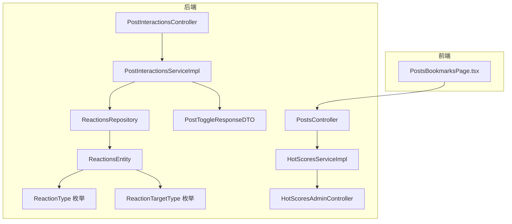
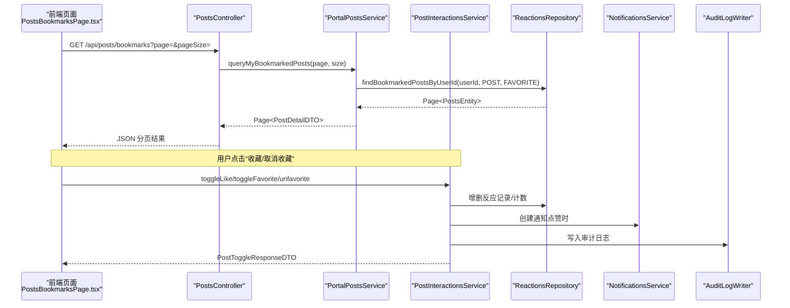
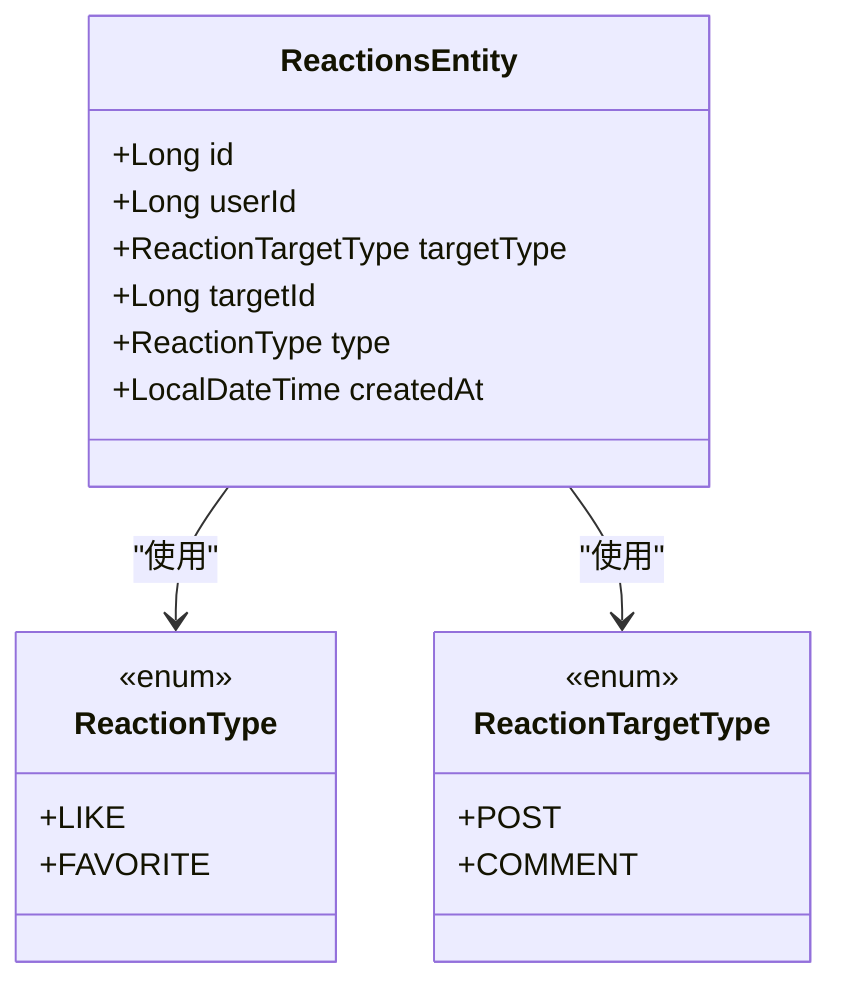
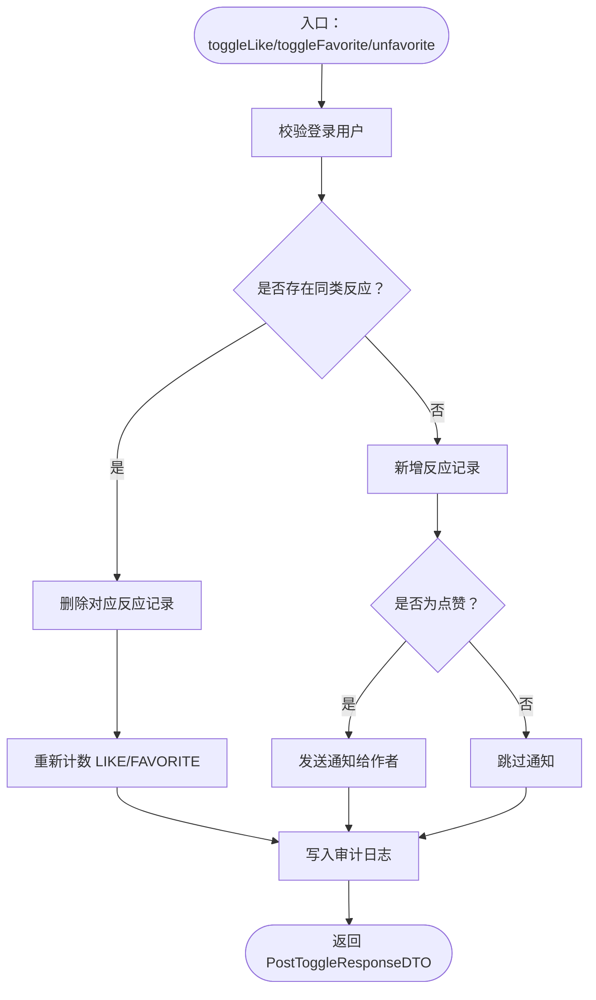
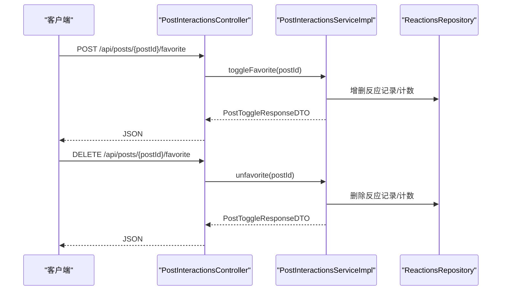
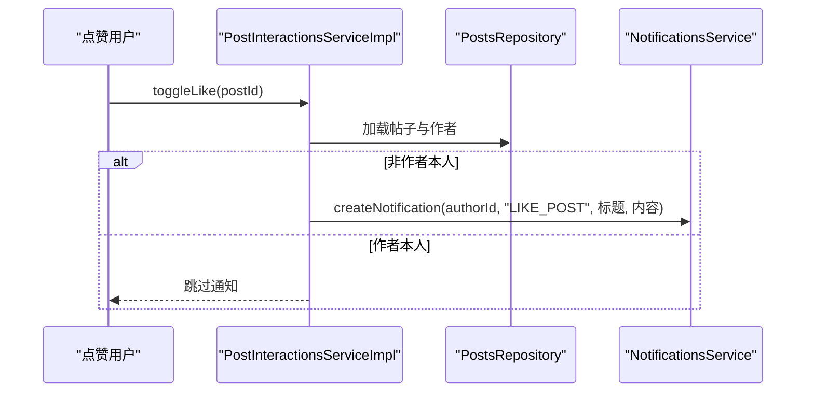
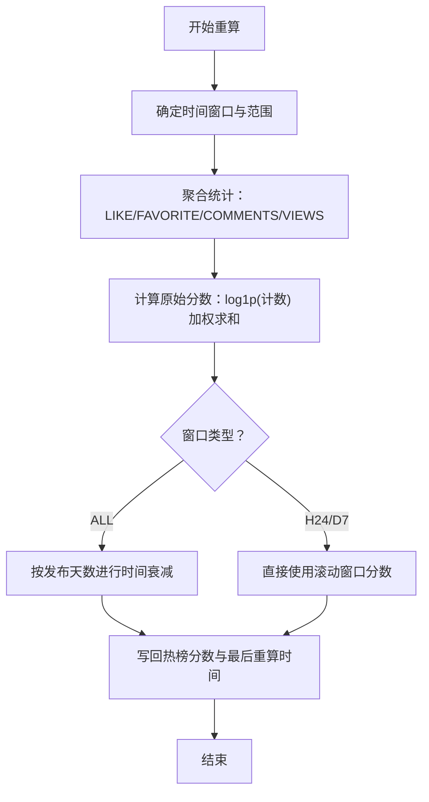
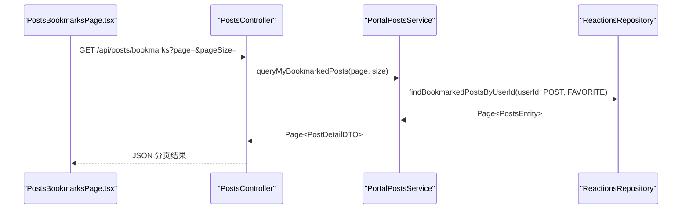
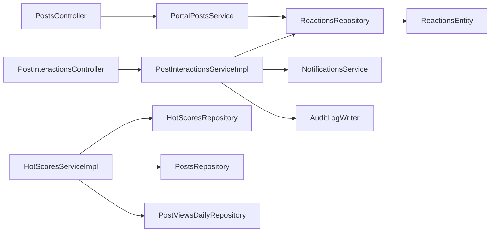

# 互动功能

<cite>
**本文引用的文件**
- [PostInteractionsController.java](file://src/main/java/com/example/EnterpriseRagCommunity/controller/content/PostInteractionsController.java)
- [PostInteractionsServiceImpl.java](file://src/main/java/com/example/EnterpriseRagCommunity/service/content/impl/PostInteractionsServiceImpl.java)
- [ReactionsRepository.java](file://src/main/java/com/example/EnterpriseRagCommunity/repository/content/ReactionsRepository.java)
- [ReactionsEntity.java](file://src/main/java/com/example/EnterpriseRagCommunity/entity/content/ReactionsEntity.java)
- [ReactionType.java](file://src/main/java/com/example/EnterpriseRagCommunity/entity/content/enums/ReactionType.java)
- [ReactionTargetType.java](file://src/main/java/com/example/EnterpriseRagCommunity/entity/content/enums/ReactionTargetType.java)
- [PostToggleResponseDTO.java](file://src/main/java/com/example/EnterpriseRagCommunity/dto/content/PostToggleResponseDTO.java)
- [PostsController.java](file://src/main/java/com/example/EnterpriseRagCommunity/controller/content/PostsController.java)
- [HotScoresServiceImpl.java](file://src/main/java/com/example/EnterpriseRagCommunity/service/content/impl/HotScoresServiceImpl.java)
- [HotScoresAdminController.java](file://src/main/java/com/example/EnterpriseRagCommunity/controller/admin/HotScoresAdminController.java)
- [PostFavoritesAndBookmarksControllerTest.java](file://src/test/java/com/example/EnterpriseRagCommunity/controller/content/PostFavoritesAndBookmarksControllerTest.java)
- [PostsBookmarksPage.tsx](file://my-vite-app/src/pages/portal/posts/pages/PostsBookmarksPage.tsx)
</cite>

## 目录
1. [引言](#引言)
2. [项目结构](#项目结构)
3. [核心组件](#核心组件)
4. [架构总览](#架构总览)
5. [详细组件分析](#详细组件分析)
6. [依赖关系分析](#依赖关系分析)
7. [性能考量](#性能考量)
8. [故障排查指南](#故障排查指南)
9. [结论](#结论)
10. [附录](#附录)

## 引言
本文件面向互动功能系统，聚焦于“点赞”“收藏”“关注”等用户互动行为的实现机制与数据模型设计。文档覆盖以下要点：
- 互动实体模型：反应类型、目标对象、用户关联、唯一约束与索引
- 点赞与收藏的数据结构、计数更新机制、历史记录存储
- 互动管理API接口规范：POST /api/posts/{postId}/like、DELETE /api/posts/{postId}/favorite 等
- 互动通知机制：点赞触发作者通知
- 热门内容计算：基于点赞、收藏、评论、浏览的多因子融合与时间衰减
- 用户行为分析：通过反应历史聚合与查询支持“我的收藏”等场景

## 项目结构
互动功能主要分布在后端控制器、服务层、仓储层与实体层，并配合前端页面与测试用例协同工作。

**图表来源**
- [PostInteractionsController.java:1-31](file://src/main/java/com/example/EnterpriseRagCommunity/controller/content/PostInteractionsController.java#L1-L31)
- [PostInteractionsServiceImpl.java:1-305](file://src/main/java/com/example/EnterpriseRagCommunity/service/content/impl/PostInteractionsServiceImpl.java#L1-L305)
- [ReactionsRepository.java:1-64](file://src/main/java/com/example/EnterpriseRagCommunity/repository/content/ReactionsRepository.java#L1-L64)
- [ReactionsEntity.java:1-41](file://src/main/java/com/example/EnterpriseRagCommunity/entity/content/ReactionsEntity.java#L1-L41)
- [ReactionType.java:1-8](file://src/main/java/com/example/EnterpriseRagCommunity/entity/content/enums/ReactionType.java#L1-L8)
- [ReactionTargetType.java:1-8](file://src/main/java/com/example/EnterpriseRagCommunity/entity/content/enums/ReactionTargetType.java#L1-L8)
- [PostToggleResponseDTO.java:1-15](file://src/main/java/com/example/EnterpriseRagCommunity/dto/content/PostToggleResponseDTO.java#L1-L15)
- [PostsController.java:1-153](file://src/main/java/com/example/EnterpriseRagCommunity/controller/content/PostsController.java#L1-L153)
- [HotScoresServiceImpl.java:1-245](file://src/main/java/com/example/EnterpriseRagCommunity/service/content/impl/HotScoresServiceImpl.java#L1-L245)
- [HotScoresAdminController.java:1-68](file://src/main/java/com/example/EnterpriseRagCommunity/controller/admin/HotScoresAdminController.java#L1-L68)
- [PostsBookmarksPage.tsx:1-39](file://my-vite-app/src/pages/portal/posts/pages/PostsBookmarksPage.tsx#L1-L39)

**章节来源**
- [PostInteractionsController.java:1-31](file://src/main/java/com/example/EnterpriseRagCommunity/controller/content/PostInteractionsController.java#L1-L31)
- [PostsController.java:103-107](file://src/main/java/com/example/EnterpriseRagCommunity/controller/content/PostsController.java#L103-L107)
- [PostsBookmarksPage.tsx:1-39](file://my-vite-app/src/pages/portal/posts/pages/PostsBookmarksPage.tsx#L1-L39)

## 核心组件
- 控制器层
  - PostInteractionsController：提供点赞/收藏/取消收藏的REST接口
  - PostsController：提供“我的收藏”分页查询接口
- 服务层
  - PostInteractionsServiceImpl：实现互动业务逻辑，含事务、审计日志、通知
  - HotScoresServiceImpl：实现热门内容计算与重算
- 数据访问层
  - ReactionsRepository：提供反应记录的增删查计数、分页、聚合查询
- 实体与枚举
  - ReactionsEntity：反应记录实体，含唯一约束与索引
  - ReactionType：反应类型（LIKE、FAVORITE）
  - ReactionTargetType：目标类型（POST、COMMENT）

**章节来源**
- [PostInteractionsController.java:16-29](file://src/main/java/com/example/EnterpriseRagCommunity/controller/content/PostInteractionsController.java#L16-L29)
- [PostsController.java:103-107](file://src/main/java/com/example/EnterpriseRagCommunity/controller/content/PostsController.java#L103-L107)
- [PostInteractionsServiceImpl.java:51-250](file://src/main/java/com/example/EnterpriseRagCommunity/service/content/impl/PostInteractionsServiceImpl.java#L51-L250)
- [ReactionsRepository.java:18-63](file://src/main/java/com/example/EnterpriseRagCommunity/repository/content/ReactionsRepository.java#L18-L63)
- [ReactionsEntity.java:14-40](file://src/main/java/com/example/EnterpriseRagCommunity/entity/content/ReactionsEntity.java#L14-L40)
- [ReactionType.java:1-8](file://src/main/java/com/example/EnterpriseRagCommunity/entity/content/enums/ReactionType.java#L1-L8)
- [ReactionTargetType.java:1-8](file://src/main/java/com/example/EnterpriseRagCommunity/entity/content/enums/ReactionTargetType.java#L1-L8)

## 架构总览
互动功能遵循经典的分层架构：前端页面调用后端接口，控制器委派给服务层，服务层通过仓储层持久化与查询反应记录，同时联动通知与审计日志。

**图表来源**
- [PostsBookmarksPage.tsx:1-39](file://my-vite-app/src/pages/portal/posts/pages/PostsBookmarksPage.tsx#L1-L39)
- [PostsController.java:103-107](file://src/main/java/com/example/EnterpriseRagCommunity/controller/content/PostsController.java#L103-L107)
- [PostInteractionsServiceImpl.java:51-250](file://src/main/java/com/example/EnterpriseRagCommunity/service/content/impl/PostInteractionsServiceImpl.java#L51-L250)
- [ReactionsRepository.java:52-62](file://src/main/java/com/example/EnterpriseRagCommunity/repository/content/ReactionsRepository.java#L52-L62)

## 详细组件分析

### 反应实体模型与数据结构
- 实体字段
  - 用户标识、目标类型与目标ID、反应类型、创建时间
- 唯一约束与索引
  - uk_react：确保同一用户对同一目标的同一反应类型唯一
  - idx_react_target：加速按目标类型与ID的查询
- 枚举
  - ReactionType：LIKE、FAVORITE
  - ReactionTargetType：POST、COMMENT

**图表来源**
- [ReactionsEntity.java:14-40](file://src/main/java/com/example/EnterpriseRagCommunity/entity/content/ReactionsEntity.java#L14-L40)
- [ReactionType.java:1-8](file://src/main/java/com/example/EnterpriseRagCommunity/entity/content/enums/ReactionType.java#L1-L8)
- [ReactionTargetType.java:1-8](file://src/main/java/com/example/EnterpriseRagCommunity/entity/content/enums/ReactionTargetType.java#L1-L8)

**章节来源**
- [ReactionsEntity.java:14-40](file://src/main/java/com/example/EnterpriseRagCommunity/entity/content/ReactionsEntity.java#L14-L40)
- [ReactionType.java:1-8](file://src/main/java/com/example/EnterpriseRagCommunity/entity/content/enums/ReactionType.java#L1-L8)
- [ReactionTargetType.java:1-8](file://src/main/java/com/example/EnterpriseRagCommunity/entity/content/enums/ReactionTargetType.java#L1-L8)

### 点赞与收藏的处理流程
- 交互流程
  - 点赞：若存在则删除，否则新增；同时写入审计日志；点赞时向作者发送通知
  - 收藏/取消收藏：若存在则删除，否则新增；写入审计日志
- 计数与状态
  - 统一通过ReactionsRepository按目标类型与ID计数
  - 返回PostToggleResponseDTO，包含“我是否点赞/收藏”“点赞数/收藏数”

**图表来源**
- [PostInteractionsServiceImpl.java:51-250](file://src/main/java/com/example/EnterpriseRagCommunity/service/content/impl/PostInteractionsServiceImpl.java#L51-L250)
- [ReactionsRepository.java:23-25](file://src/main/java/com/example/EnterpriseRagCommunity/repository/content/ReactionsRepository.java#L23-L25)

**章节来源**
- [PostInteractionsServiceImpl.java:51-250](file://src/main/java/com/example/EnterpriseRagCommunity/service/content/impl/PostInteractionsServiceImpl.java#L51-L250)
- [PostToggleResponseDTO.java:1-15](file://src/main/java/com/example/EnterpriseRagCommunity/dto/content/PostToggleResponseDTO.java#L1-L15)

### 互动管理API接口规范
- 点赞
  - 方法与路径：POST /api/posts/{postId}/like
  - 功能：切换点赞状态
  - 请求体：无
  - 响应：PostToggleResponseDTO
- 取消点赞
  - 方法与路径：DELETE /api/posts/{postId}/like
  - 功能：取消点赞（注：当前仓库未提供该具体接口实现，建议补充）
  - 请求体：无
  - 响应：PostToggleResponseDTO
- 收藏
  - 方法与路径：POST /api/posts/{postId}/favorite
  - 功能：切换收藏状态
  - 请求体：无
  - 响应：PostToggleResponseDTO
- 取消收藏
  - 方法与路径：DELETE /api/posts/{postId}/favorite
  - 功能：取消收藏
  - 请求体：无
  - 响应：PostToggleResponseDTO
- 我的收藏
  - 方法与路径：GET /api/posts/bookmarks
  - 功能：分页列出当前用户收藏的帖子
  - 查询参数：page、pageSize
  - 响应：Page<PostDetailDTO>

**图表来源**
- [PostInteractionsController.java:16-29](file://src/main/java/com/example/EnterpriseRagCommunity/controller/content/PostInteractionsController.java#L16-L29)
- [PostInteractionsServiceImpl.java:129-194](file://src/main/java/com/example/EnterpriseRagCommunity/service/content/impl/PostInteractionsServiceImpl.java#L129-L194)
- [PostsController.java:103-107](file://src/main/java/com/example/EnterpriseRagCommunity/controller/content/PostsController.java#L103-L107)

**章节来源**
- [PostInteractionsController.java:16-29](file://src/main/java/com/example/EnterpriseRagCommunity/controller/content/PostInteractionsController.java#L16-L29)
- [PostsController.java:103-107](file://src/main/java/com/example/EnterpriseRagCommunity/controller/content/PostsController.java#L103-L107)

### 互动通知机制
- 触发条件：当用户对他人帖子进行点赞时，系统向作者发送通知
- 通知内容：包含帖子标题等上下文信息
- 通知渠道：通过通知服务创建通知记录（具体推送由通知服务实现）

**图表来源**
- [PostInteractionsServiceImpl.java:76-82](file://src/main/java/com/example/EnterpriseRagCommunity/service/content/impl/PostInteractionsServiceImpl.java#L76-L82)

**章节来源**
- [PostInteractionsServiceImpl.java:76-82](file://src/main/java/com/example/EnterpriseRagCommunity/service/content/impl/PostInteractionsServiceImpl.java#L76-L82)

### 热门内容计算
- 计算维度：点赞、收藏、评论、浏览
- 时间窗口：24小时滚动、7天滚动、全部时间（ALL）
- 分数公式：对各维度计数取log1p加权求和
- 时间衰减：ALL窗口按发布时间进行温和衰减
- 重算策略：每日/每小时调度重算，管理员可手动触发

**图表来源**
- [HotScoresServiceImpl.java:152-226](file://src/main/java/com/example/EnterpriseRagCommunity/service/content/impl/HotScoresServiceImpl.java#L152-L226)
- [HotScoresAdminController.java:41-66](file://src/main/java/com/example/EnterpriseRagCommunity/controller/admin/HotScoresAdminController.java#L41-L66)

**章节来源**
- [HotScoresServiceImpl.java:195-226](file://src/main/java/com/example/EnterpriseRagCommunity/service/content/impl/HotScoresServiceImpl.java#L195-L226)
- [HotScoresAdminController.java:41-66](file://src/main/java/com/example/EnterpriseRagCommunity/controller/admin/HotScoresAdminController.java#L41-L66)

### 用户行为分析与“我的收藏”
- “我的收藏”分页查询：通过ReactionsRepository按用户与目标类型筛选收藏的帖子
- 前端页面：PostsBookmarksPage.tsx负责加载与展示收藏列表
- 测试验证：PostFavoritesAndBookmarksControllerTest覆盖收藏/取消收藏与列表查询

**图表来源**
- [PostsBookmarksPage.tsx:1-39](file://my-vite-app/src/pages/portal/posts/pages/PostsBookmarksPage.tsx#L1-L39)
- [PostsController.java:103-107](file://src/main/java/com/example/EnterpriseRagCommunity/controller/content/PostsController.java#L103-L107)
- [ReactionsRepository.java:52-62](file://src/main/java/com/example/EnterpriseRagCommunity/repository/content/ReactionsRepository.java#L52-L62)

**章节来源**
- [PostsBookmarksPage.tsx:1-39](file://my-vite-app/src/pages/portal/posts/pages/PostsBookmarksPage.tsx#L1-L39)
- [PostsController.java:103-107](file://src/main/java/com/example/EnterpriseRagCommunity/controller/content/PostsController.java#L103-L107)
- [PostFavoritesAndBookmarksControllerTest.java:83-112](file://src/test/java/com/example/EnterpriseRagCommunity/controller/content/PostFavoritesAndBookmarksControllerTest.java#L83-L112)

## 依赖关系分析
- 控制器依赖服务层，服务层依赖仓储层与通知、审计等外部能力
- ReactionsRepository提供统一的反应记录查询与计数能力
- 热榜服务依赖帖子、浏览、反应等多源聚合

**图表来源**
- [PostInteractionsController.java:1-31](file://src/main/java/com/example/EnterpriseRagCommunity/controller/content/PostInteractionsController.java#L1-L31)
- [PostInteractionsServiceImpl.java:1-39](file://src/main/java/com/example/EnterpriseRagCommunity/service/content/impl/PostInteractionsServiceImpl.java#L1-L39)
- [ReactionsRepository.java:1-64](file://src/main/java/com/example/EnterpriseRagCommunity/repository/content/ReactionsRepository.java#L1-L64)
- [PostsController.java:1-153](file://src/main/java/com/example/EnterpriseRagCommunity/controller/content/PostsController.java#L1-L153)
- [HotScoresServiceImpl.java:1-36](file://src/main/java/com/example/EnterpriseRagCommunity/service/content/impl/HotScoresServiceImpl.java#L1-L36)

**章节来源**
- [PostInteractionsServiceImpl.java:25-39](file://src/main/java/com/example/EnterpriseRagCommunity/service/content/impl/PostInteractionsServiceImpl.java#L25-L39)
- [ReactionsRepository.java:18-63](file://src/main/java/com/example/EnterpriseRagCommunity/repository/content/ReactionsRepository.java#L18-L63)
- [HotScoresServiceImpl.java:25-36](file://src/main/java/com/example/EnterpriseRagCommunity/service/content/impl/HotScoresServiceImpl.java#L25-L36)

## 性能考量
- 查询优化
  - ReactionsEntity针对(target_type, target_id)建立索引，提升按目标查询效率
  - 使用countByTargetTypeAndTargetIdAndType进行高效计数
- 聚合与分页
  - 热榜重算采用数据库层面group by聚合，减少Java侧内存压力
  - 分页安全总数策略避免前端感知到不可靠的总条目
- 事务与一致性
  - 互动操作与审计日志在事务内执行，保证原子性
- 时间窗口与衰减
  - 滚动窗口与ALL窗口分别计算，避免重复扫描全量数据

[本节为通用性能指导，无需特定文件来源]

## 故障排查指南
- 未登录或会话过期
  - 现象：抛出认证异常
  - 排查：确认前端已正确携带Cookie或Token，后端会话有效
- 反应重复提交
  - 现象：唯一约束冲突
  - 排查：确认前端防抖与后端唯一约束生效
- 通知未送达
  - 现象：作者未收到点赞通知
  - 排查：检查通知服务可用性与作者ID非空判断
- 热榜分数异常
  - 现象：榜单为空或分数不更新
  - 排查：确认调度任务运行、窗口范围与聚合数据正确

**章节来源**
- [PostInteractionsServiceImpl.java:40-49](file://src/main/java/com/example/EnterpriseRagCommunity/service/content/impl/PostInteractionsServiceImpl.java#L40-L49)
- [ReactionsEntity.java:14-16](file://src/main/java/com/example/EnterpriseRagCommunity/entity/content/ReactionsEntity.java#L14-L16)
- [HotScoresServiceImpl.java:135-150](file://src/main/java/com/example/EnterpriseRagCommunity/service/content/impl/HotScoresServiceImpl.java#L135-L150)

## 结论
互动功能以简洁的反应模型为核心，通过统一的仓储层实现高效的增删改查与计数统计，并结合通知与审计完善用户体验与合规要求。热门内容计算提供多维度、可配置的时间窗口评分体系，支撑内容分发与推荐。建议后续补充取消点赞接口与更完善的权限控制与监控埋点，持续优化性能与可观测性。

[本节为总结性内容，无需特定文件来源]

## 附录
- 关键接口清单
  - POST /api/posts/{postId}/like：切换点赞
  - POST /api/posts/{postId}/favorite：切换收藏
  - DELETE /api/posts/{postId}/favorite：取消收藏
  - GET /api/posts/bookmarks：我的收藏分页
- 关键实体与枚举
  - ReactionsEntity、ReactionType、ReactionTargetType
- 相关测试与前端页面
  - PostFavoritesAndBookmarksControllerTest、PostsBookmarksPage.tsx

[本节为概要性附录，无需特定文件来源]