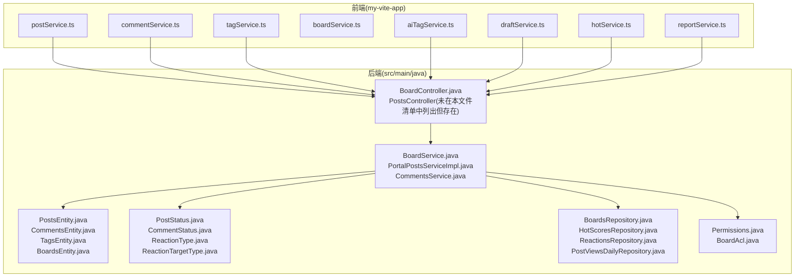
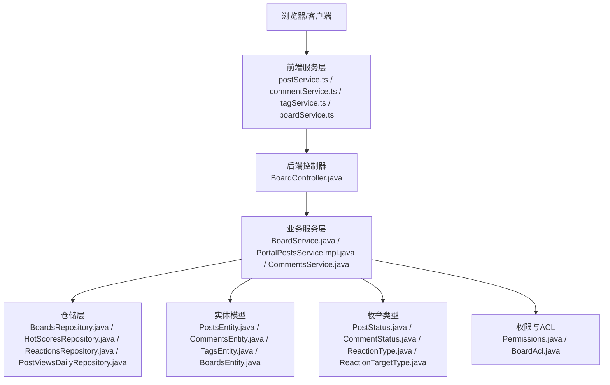
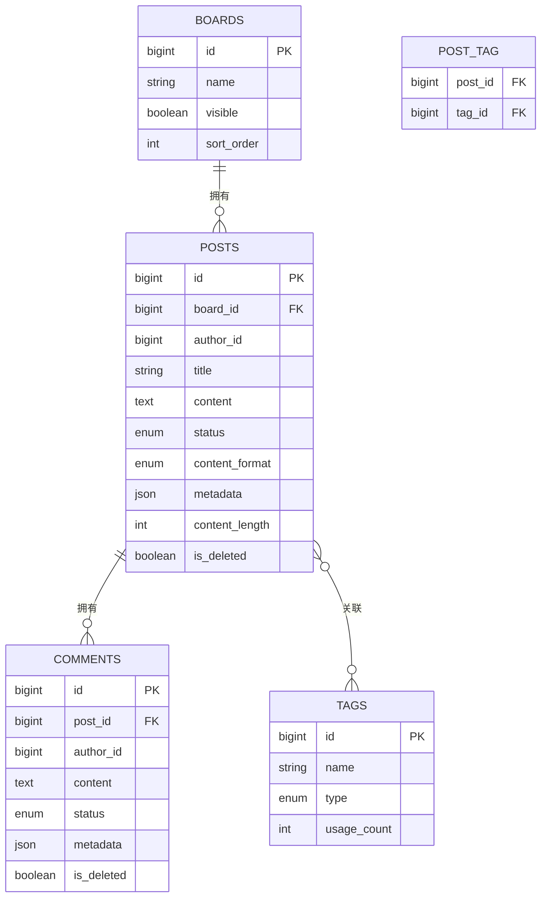
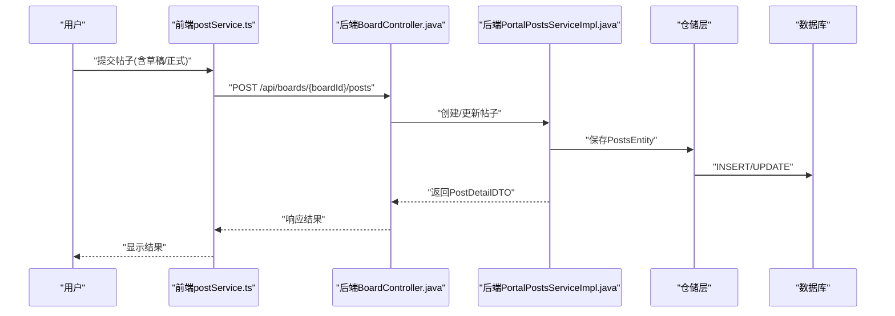
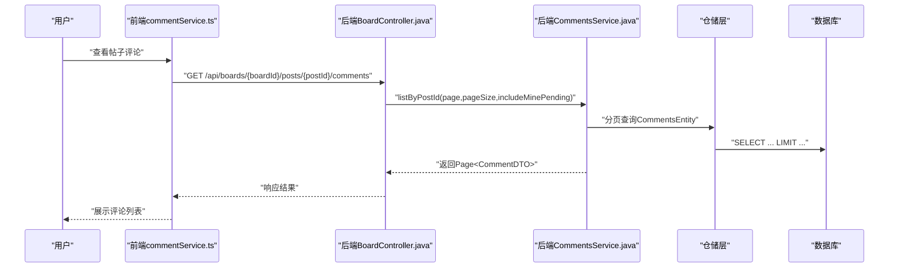
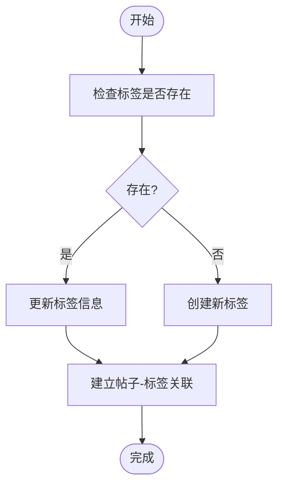
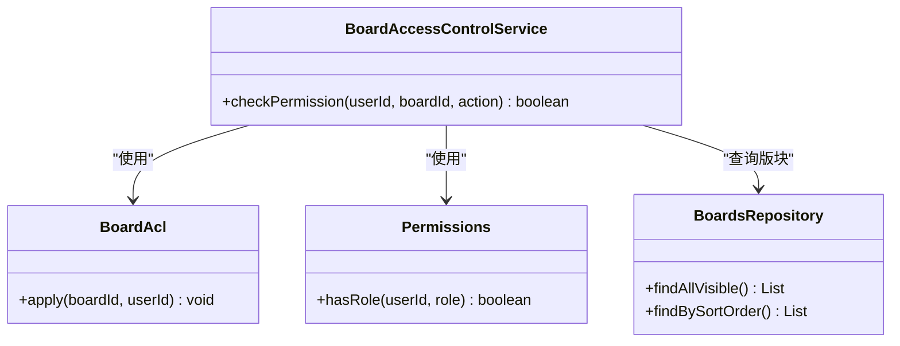
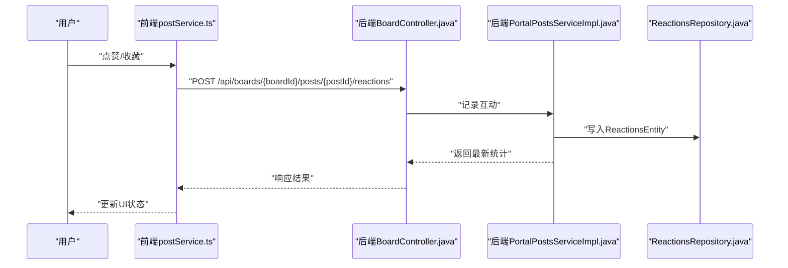
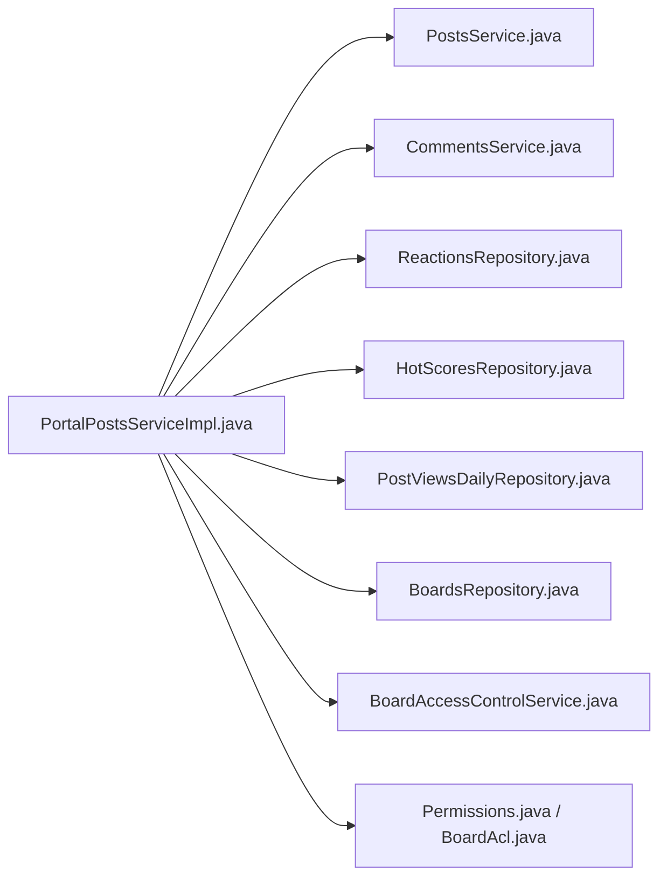

# 内容管理

<cite>
**本文引用的文件**
- [postService.ts](file://my-vite-app/src/services/postService.ts)
- [aiTagService.ts](file://my-vite-app/src/services/aiTagService.ts)
- [CommentsService.java](file://src/main/java/com/example/EnterpriseRagCommunity/service/content/CommentsService.java)
- [PortalPostsServiceImpl.java](file://src/main/java/com/example/EnterpriseRagCommunity/service/content/impl/PortalPostsServiceImpl.java)
- [ModerationPrecheckRejectIntegrationTest.java](file://src/integrationTest/java/com/example/EnterpriseRagCommunity/service/moderation/jobs/ModerationPrecheckRejectIntegrationTest.java)
- [TagsServiceImplDeleteTest.java](file://src/test/java/com/example/EnterpriseRagCommunity/service/content/impl/TagsServiceImplDeleteTest.java)
- [TagsServiceImplUpdateTest.java](file://src/test/java/com/example/EnterpriseRagCommunity/service/content/impl/TagsServiceImplUpdateTest.java)
- [postService.ts（后端）](file://src/main/java/com/example/EnterpriseRagCommunity/service/content/PostService.java)
- [boardService.ts](file://my-vite-app/src/services/boardService.ts)
- [commentService.ts](file://my-vite-app/src/services/commentService.ts)
- [tagService.ts](file://my-vite-app/src/services/tagService.ts)
- [reportService.ts](file://my-vite-app/src/services/reportService.ts)
- [hotService.ts](file://my-vite-app/src/services/hotService.ts)
- [draftService.ts](file://my-vite-app/src/services/draftService.ts)
- [postComposeConfigService.ts](file://my-vite-app/src/services/postComposeConfigService.ts)
- [postComposeAiSnapshotService.ts](file://my-vite-app/src/services/postComposeAiSnapshotService.ts)
- [postSummaryAdminService.ts](file://my-vite-app/src/services/postSummaryAdminService.ts)
- [titleGenPublicService.ts](file://my-vite-app/src/services/titleGenPublicService.ts)
- [tagGenPublicService.ts](file://my-vite-app/src/services/tagGenPublicService.ts)
- [postFilesAdminService.ts](file://my-vite-app/src/services/postFilesAdminService.ts)
- [uploadService.ts](file://my-vite-app/src/services/uploadService.ts)
- [BoardController.java](file://src/main/java/com/example/EnterpriseRagCommunity/controller/BoardController.java)
- [BoardService.java](file://src/main/java/com/example/EnterpriseRagCommunity/service/BoardService.java)
- [PostsEntity.java](file://src/main/java/com/example/EnterpriseRagCommunity/entity/content/PostsEntity.java)
- [CommentsEntity.java](file://src/main/java/com/example/EnterpriseRagCommunity/entity/content/CommentsEntity.java)
- [TagsEntity.java](file://src/main/java/com/example/EnterpriseRagCommunity/entity/content/TagsEntity.java)
- [BoardsEntity.java](file://src/main/java/com/example/EnterpriseRagCommunity/entity/content/BoardsEntity.java)
- [PostStatus.java](file://src/main/java/com/example/EnterpriseRagCommunity/entity/content/enums/PostStatus.java)
- [CommentStatus.java](file://src/main/java/com/example/EnterpriseRagCommunity/entity/content/enums/CommentStatus.java)
- [ReactionType.java](file://src/main/java/com/example/EnterpriseRagCommunity/entity/content/enums/ReactionType.java)
- [ReactionTargetType.java](file://src/main/java/com/example/EnterpriseRagCommunity/entity/content/enums/ReactionTargetType.java)
- [PostDetailDTO.java](file://src/main/java/com/example/EnterpriseRagCommunity/dto/content/PostDetailDTO.java)
- [CommentDTO.java](file://src/main/java/com/example/EnterpriseRagCommunity/dto/content/CommentDTO.java)
- [TagsUpdateDTO.java](file://src/main/java/com/example/EnterpriseRagCommunity/dto/content/TagsUpdateDTO.java)
- [PostCreateDTO.java](file://src/main/java/com/example/EnterpriseRagCommunity/dto/content/PostCreateDTO.java)
- [PostUpdateDTO.java](file://src/main/java/com/example/EnterpriseRagCommunity/dto/content/PostUpdateDTO.java)
- [CommentCreateRequest.java](file://src/main/java/com/example/EnterpriseRagCommunity/dto/content/CommentCreateRequest.java)
- [HotScoresRepository.java](file://src/main/java/com/example/EnterpriseRagCommunity/repository/content/HotScoresRepository.java)
- [ReactionsRepository.java](file://src/main/java/com/example/EnterpriseRagCommunity/repository/content/ReactionsRepository.java)
- [PostViewsDailyRepository.java](file://src/main/java/com/example/EnterpriseRagCommunity/repository/content/PostViewsDailyRepository.java)
- [BoardAccessControlService.java](file://src/main/java/com/example/EnterpriseRagCommunity/service/content/BoardAccessControlService.java)
- [AdministratorService.java](file://src/main/java/com/example/EnterpriseRagCommunity/service/AdministratorService.java)
- [UsersRepository.java](file://src/main/java/com/example/EnterpriseRagCommunity/repository/access/UsersRepository.java)
- [BoardsRepository.java](file://src/main/java/com/example/EnterpriseRagCommunity/repository/content/BoardsRepository.java)
- [Permissions.java](file://src/main/java/com/example/EnterpriseRagCommunity/security/Permissions.java)
- [BoardAcl.java](file://src/main/java/com/example/EnterpriseRagCommunity/security/BoardAcl.java)
- [GlobalExceptionHandler.java](file://src/main/java/com/example/EnterpriseRagCommunity/controller/GlobalExceptionHandler.java)
- [V1__table_design.sql](file://src/main/resources/db/migration/V1__table_design.sql)
</cite>

## 目录
1. [引言](#引言)
2. [项目结构](#项目结构)
3. [核心组件](#核心组件)
4. [架构总览](#架构总览)
5. [详细组件分析](#详细组件分析)
6. [依赖分析](#依赖分析)
7. [性能考虑](#性能考虑)
8. [故障排除指南](#故障排除指南)
9. [结论](#结论)
10. [附录](#附录)

## 引言
本文件面向内容管理系统（CMS）的功能文档，聚焦于帖子发布、编辑、删除、评论管理、标签系统、版块管理等核心能力；同时阐述内容实体模型、状态管理、版本控制与草稿系统的设计实现；解释帖子、评论、标签的数据结构与关联关系；给出内容管理API接口规范（含帖子CRUD、评论管理、标签查询、版块权限控制）；并说明点赞、收藏、举报等交互功能的实现机制与数据流转。

## 项目结构
系统采用前后端分离架构：
- 前端基于 Vite + React，位于 my-vite-app 目录，通过服务层封装调用后端 API。
- 后端基于 Spring Boot，位于 src/main/java，采用分层架构：controller（控制器）、service（业务）、repository（持久化）、entity/dto/enums（数据模型与枚举）。

图表来源
- [postService.ts:1-48](file://my-vite-app/src/services/postService.ts#L1-L48)
- [boardService.ts](file://my-vite-app/src/services/boardService.ts)
- [commentService.ts](file://my-vite-app/src/services/commentService.ts)
- [tagService.ts](file://my-vite-app/src/services/tagService.ts)
- [aiTagService.ts:1-52](file://my-vite-app/src/services/aiTagService.ts#L1-L52)
- [BoardController.java](file://src/main/java/com/example/EnterpriseRagCommunity/controller/BoardController.java)
- [BoardService.java](file://src/main/java/com/example/EnterpriseRagCommunity/service/BoardService.java)
- [PortalPostsServiceImpl.java:1-72](file://src/main/java/com/example/EnterpriseRagCommunity/service/content/impl/PortalPostsServiceImpl.java#L1-L72)
- [CommentsService.java:1-14](file://src/main/java/com/example/EnterpriseRagCommunity/service/content/CommentsService.java#L1-L14)
- [PostsEntity.java](file://src/main/java/com/example/EnterpriseRagCommunity/entity/content/PostsEntity.java)
- [CommentsEntity.java](file://src/main/java/com/example/EnterpriseRagCommunity/entity/content/CommentsEntity.java)
- [TagsEntity.java](file://src/main/java/com/example/EnterpriseRagCommunity/entity/content/TagsEntity.java)
- [BoardsEntity.java](file://src/main/java/com/example/EnterpriseRagCommunity/entity/content/BoardsEntity.java)
- [PostStatus.java](file://src/main/java/com/example/EnterpriseRagCommunity/entity/content/enums/PostStatus.java)
- [CommentStatus.java](file://src/main/java/com/example/EnterpriseRagCommunity/entity/content/enums/CommentStatus.java)
- [ReactionType.java](file://src/main/java/com/example/EnterpriseRagCommunity/entity/content/enums/ReactionType.java)
- [ReactionTargetType.java](file://src/main/java/com/example/EnterpriseRagCommunity/entity/content/enums/ReactionTargetType.java)
- [BoardsRepository.java](file://src/main/java/com/example/EnterpriseRagCommunity/repository/content/BoardsRepository.java)
- [HotScoresRepository.java](file://src/main/java/com/example/EnterpriseRagCommunity/repository/content/HotScoresRepository.java)
- [ReactionsRepository.java](file://src/main/java/com/example/EnterpriseRagCommunity/repository/content/ReactionsRepository.java)
- [PostViewsDailyRepository.java](file://src/main/java/com/example/EnterpriseRagCommunity/repository/content/PostViewsDailyRepository.java)
- [Permissions.java](file://src/main/java/com/example/EnterpriseRagCommunity/security/Permissions.java)
- [BoardAcl.java](file://src/main/java/com/example/EnterpriseRagCommunity/security/BoardAcl.java)

章节来源
- [postService.ts:1-48](file://my-vite-app/src/services/postService.ts#L1-L48)
- [boardService.ts](file://my-vite-app/src/services/boardService.ts)
- [commentService.ts](file://my-vite-app/src/services/commentService.ts)
- [tagService.ts](file://my-vite-app/src/services/tagService.ts)
- [aiTagService.ts:1-52](file://my-vite-app/src/services/aiTagService.ts#L1-L52)
- [BoardController.java](file://src/main/java/com/example/EnterpriseRagCommunity/controller/BoardController.java)
- [BoardService.java](file://src/main/java/com/example/EnterpriseRagCommunity/service/BoardService.java)
- [PortalPostsServiceImpl.java:1-72](file://src/main/java/com/example/EnterpriseRagCommunity/service/content/impl/PortalPostsServiceImpl.java#L1-L72)
- [CommentsService.java:1-14](file://src/main/java/com/example/EnterpriseRagCommunity/service/content/CommentsService.java#L1-L14)

## 核心组件
- 帖子模块：负责帖子的创建、更新、删除、详情查询、列表分页、状态流转、互动统计与热度计算。
- 评论模块：支持按帖子分页查询评论、创建评论、统计评论数量。
- 标签模块：支持标签的增删改查、AI生成建议、与帖子的多对多关联。
- 版块模块：负责版块的访问控制、权限校验与可见性管理。
- 交互模块：点赞、收藏、举报、热度分、浏览量等。
- 草稿与版本：草稿保存、AI快照、摘要生成、标题/标签自动生成等。

章节来源
- [postService.ts:1-48](file://my-vite-app/src/services/postService.ts#L1-L48)
- [aiTagService.ts:1-52](file://my-vite-app/src/services/aiTagService.ts#L1-L52)
- [PortalPostsServiceImpl.java:1-72](file://src/main/java/com/example/EnterpriseRagCommunity/service/content/impl/PortalPostsServiceImpl.java#L1-L72)
- [CommentsService.java:1-14](file://src/main/java/com/example/EnterpriseRagCommunity/service/content/CommentsService.java#L1-L14)
- [BoardAccessControlService.java](file://src/main/java/com/example/EnterpriseRagCommunity/service/content/BoardAccessControlService.java)

## 架构总览
系统采用“前端服务层 + 后端控制器/服务/仓储”的分层设计。前端通过服务层封装HTTP请求，后端通过控制器暴露REST接口，服务层编排业务逻辑，仓储层负责数据持久化。权限控制通过安全组件与版块ACL共同实现。

图表来源
- [postService.ts:1-48](file://my-vite-app/src/services/postService.ts#L1-L48)
- [boardService.ts](file://my-vite-app/src/services/boardService.ts)
- [commentService.ts](file://my-vite-app/src/services/commentService.ts)
- [tagService.ts](file://my-vite-app/src/services/tagService.ts)
- [BoardController.java](file://src/main/java/com/example/EnterpriseRagCommunity/controller/BoardController.java)
- [BoardService.java](file://src/main/java/com/example/EnterpriseRagCommunity/service/BoardService.java)
- [PortalPostsServiceImpl.java:1-72](file://src/main/java/com/example/EnterpriseRagCommunity/service/content/impl/PortalPostsServiceImpl.java#L1-L72)
- [CommentsService.java:1-14](file://src/main/java/com/example/EnterpriseRagCommunity/service/content/CommentsService.java#L1-L14)
- [BoardsRepository.java](file://src/main/java/com/example/EnterpriseRagCommunity/repository/content/BoardsRepository.java)
- [HotScoresRepository.java](file://src/main/java/com/example/EnterpriseRagCommunity/repository/content/HotScoresRepository.java)
- [ReactionsRepository.java](file://src/main/java/com/example/EnterpriseRagCommunity/repository/content/ReactionsRepository.java)
- [PostViewsDailyRepository.java](file://src/main/java/com/example/EnterpriseRagCommunity/repository/content/PostViewsDailyRepository.java)
- [Permissions.java](file://src/main/java/com/example/EnterpriseRagCommunity/security/Permissions.java)
- [BoardAcl.java](file://src/main/java/com/example/EnterpriseRagCommunity/security/BoardAcl.java)

## 详细组件分析

### 数据模型与状态管理
- 实体模型
  - 帖子：包含版块ID、作者、标题、内容、格式、元数据、附件、状态、热度分、互动计数等字段。
  - 评论：包含帖子ID、作者、内容、状态、元数据、层级信息等。
  - 标签：包含标签名、类型、使用计数等。
  - 版块：包含可见性、排序、权限策略等。
- 状态枚举
  - 帖子状态：草稿、待审、已发布、拒绝、归档。
  - 评论状态：待审、已发布、隐藏、删除。
  - 互动类型：点赞、收藏等。
  - 互动目标类型：针对帖子或评论。

图表来源
- [PostsEntity.java](file://src/main/java/com/example/EnterpriseRagCommunity/entity/content/PostsEntity.java)
- [CommentsEntity.java](file://src/main/java/com/example/EnterpriseRagCommunity/entity/content/CommentsEntity.java)
- [TagsEntity.java](file://src/main/java/com/example/EnterpriseRagCommunity/entity/content/TagsEntity.java)
- [BoardsEntity.java](file://src/main/java/com/example/EnterpriseRagCommunity/entity/content/BoardsEntity.java)
- [PostStatus.java](file://src/main/java/com/example/EnterpriseRagCommunity/entity/content/enums/PostStatus.java)
- [CommentStatus.java](file://src/main/java/com/example/EnterpriseRagCommunity/entity/content/enums/CommentStatus.java)
- [V1__table_design.sql](file://src/main/resources/db/migration/V1__table_design.sql)

章节来源
- [PostsEntity.java](file://src/main/java/com/example/EnterpriseRagCommunity/entity/content/PostsEntity.java)
- [CommentsEntity.java](file://src/main/java/com/example/EnterpriseRagCommunity/entity/content/CommentsEntity.java)
- [TagsEntity.java](file://src/main/java/com/example/EnterpriseRagCommunity/entity/content/TagsEntity.java)
- [BoardsEntity.java](file://src/main/java/com/example/EnterpriseRagCommunity/entity/content/BoardsEntity.java)
- [PostStatus.java](file://src/main/java/com/example/EnterpriseRagCommunity/entity/content/enums/PostStatus.java)
- [CommentStatus.java](file://src/main/java/com/example/EnterpriseRagCommunity/entity/content/enums/CommentStatus.java)
- [V1__table_design.sql](file://src/main/resources/db/migration/V1__table_design.sql)

### 帖子发布、编辑、删除与草稿系统
- 发布与编辑
  - 前端通过 postService 封装创建/更新请求，携带版块ID、标题、内容、格式、标签、附件等。
  - 后端通过控制器接收请求，服务层进行权限校验与业务处理，仓储层持久化。
- 删除
  - 采用软删除策略（标记 is_deleted），保留历史与审计轨迹。
- 草稿系统
  - 草稿保存由 draftService 提供，支持临时存储与恢复。
  - AI辅助：titleGenPublicService、tagGenPublicService、postComposeAiSnapshotService 提供标题生成、标签生成与AI快照。
- 版本控制
  - 通过 AI 快照与摘要服务实现版本化内容管理。

图表来源
- [postService.ts:1-48](file://my-vite-app/src/services/postService.ts#L1-L48)
- [BoardController.java](file://src/main/java/com/example/EnterpriseRagCommunity/controller/BoardController.java)
- [PortalPostsServiceImpl.java:1-72](file://src/main/java/com/example/EnterpriseRagCommunity/service/content/impl/PortalPostsServiceImpl.java#L1-L72)
- [PostDetailDTO.java](file://src/main/java/com/example/EnterpriseRagCommunity/dto/content/PostDetailDTO.java)
- [PostsEntity.java](file://src/main/java/com/example/EnterpriseRagCommunity/entity/content/PostsEntity.java)

章节来源
- [postService.ts:1-48](file://my-vite-app/src/services/postService.ts#L1-L48)
- [PortalPostsServiceImpl.java:1-72](file://src/main/java/com/example/EnterpriseRagCommunity/service/content/impl/PortalPostsServiceImpl.java#L1-L72)
- [postComposeAiSnapshotService.ts](file://my-vite-app/src/services/postComposeAiSnapshotService.ts)
- [postSummaryAdminService.ts](file://my-vite-app/src/services/postSummaryAdminService.ts)
- [titleGenPublicService.ts](file://my-vite-app/src/services/titleGenPublicService.ts)
- [tagGenPublicService.ts](file://my-vite-app/src/services/tagGenPublicService.ts)
- [draftService.ts](file://my-vite-app/src/services/draftService.ts)

### 评论管理
- 查询与创建
  - 通过 CommentsService 接口定义分页查询与创建评论的方法。
  - 前端 commentService.ts 调用后端接口，支持 includeMinePending 参数以包含当前用户的待审评论。
- 状态与审核
  - 评论状态包含待审、已发布、隐藏、删除，结合审核流程与权限控制实现。

图表来源
- [commentService.ts](file://my-vite-app/src/services/commentService.ts)
- [CommentsService.java:1-14](file://src/main/java/com/example/EnterpriseRagCommunity/service/content/CommentsService.java#L1-L14)
- [CommentsEntity.java](file://src/main/java/com/example/EnterpriseRagCommunity/entity/content/CommentsEntity.java)
- [CommentDTO.java](file://src/main/java/com/example/EnterpriseRagCommunity/dto/content/CommentDTO.java)

章节来源
- [CommentsService.java:1-14](file://src/main/java/com/example/EnterpriseRagCommunity/service/content/CommentsService.java#L1-L14)
- [commentService.ts](file://my-vite-app/src/services/commentService.ts)

### 标签系统
- 标签增删改查
  - 标签实体与仓库定义完善，测试覆盖了不存在时抛错的场景。
- AI标签建议
  - 前端 aiTagService.ts 调用后端 /api/ai/posts/tag-suggestions，返回建议标签集合。
- 标签与帖子的多对多关联
  - 通过中间表 POST_TAG 维护帖子与标签的关系。

图表来源
- [TagsServiceImplDeleteTest.java:1-30](file://src/test/java/com/example/EnterpriseRagCommunity/service/content/impl/TagsServiceImplDeleteTest.java#L1-L30)
- [TagsServiceImplUpdateTest.java:1-32](file://src/test/java/com/example/EnterpriseRagCommunity/service/content/impl/TagsServiceImplUpdateTest.java#L1-L32)
- [aiTagService.ts:1-52](file://my-vite-app/src/services/aiTagService.ts#L1-L52)
- [TagsEntity.java](file://src/main/java/com/example/EnterpriseRagCommunity/entity/content/TagsEntity.java)

章节来源
- [TagsServiceImplDeleteTest.java:1-30](file://src/test/java/com/example/EnterpriseRagCommunity/service/content/impl/TagsServiceImplDeleteTest.java#L1-L30)
- [TagsServiceImplUpdateTest.java:1-32](file://src/test/java/com/example/EnterpriseRagCommunity/service/content/impl/TagsServiceImplUpdateTest.java#L1-L32)
- [aiTagService.ts:1-52](file://my-vite-app/src/services/aiTagService.ts#L1-L52)

### 版块管理与权限控制
- 版块访问控制
  - BoardAccessControlService 与 BoardAcl、Permissions 协同实现权限校验与访问控制。
- 版块可见性与排序
  - BoardsRepository 提供版块查询与排序控制，结合可见性字段决定展示范围。

图表来源
- [BoardAccessControlService.java](file://src/main/java/com/example/EnterpriseRagCommunity/service/content/BoardAccessControlService.java)
- [BoardAcl.java](file://src/main/java/com/example/EnterpriseRagCommunity/security/BoardAcl.java)
- [Permissions.java](file://src/main/java/com/example/EnterpriseRagCommunity/security/Permissions.java)
- [BoardsRepository.java](file://src/main/java/com/example/EnterpriseRagCommunity/repository/content/BoardsRepository.java)

章节来源
- [BoardAccessControlService.java](file://src/main/java/com/example/EnterpriseRagCommunity/service/content/BoardAccessControlService.java)
- [BoardAcl.java](file://src/main/java/com/example/EnterpriseRagCommunity/security/BoardAcl.java)
- [Permissions.java](file://src/main/java/com/example/EnterpriseRagCommunity/security/Permissions.java)
- [BoardsRepository.java](file://src/main/java/com/example/EnterpriseRagCommunity/repository/content/BoardsRepository.java)

### 内容交互：点赞、收藏、举报
- 点赞与收藏
  - 通过 ReactionsRepository 统一管理互动记录，ReactionType 与 ReactionTargetType 定义互动类型与目标类型。
  - PortalPostsServiceImpl 在查询详情时聚合互动统计与当前用户状态。
- 举报
  - reportService.ts 提供举报接口，结合审核流程与权限控制实现违规内容处置。

图表来源
- [postService.ts:1-48](file://my-vite-app/src/services/postService.ts#L1-L48)
- [PortalPostsServiceImpl.java:1-72](file://src/main/java/com/example/EnterpriseRagCommunity/service/content/impl/PortalPostsServiceImpl.java#L1-L72)
- [ReactionsRepository.java](file://src/main/java/com/example/EnterpriseRagCommunity/repository/content/ReactionsRepository.java)
- [ReactionType.java](file://src/main/java/com/example/EnterpriseRagCommunity/entity/content/enums/ReactionType.java)
- [ReactionTargetType.java](file://src/main/java/com/example/EnterpriseRagCommunity/entity/content/enums/ReactionTargetType.java)

章节来源
- [postService.ts:1-48](file://my-vite-app/src/services/postService.ts#L1-L48)
- [PortalPostsServiceImpl.java:1-72](file://src/main/java/com/example/EnterpriseRagCommunity/service/content/impl/PortalPostsServiceImpl.java#L1-L72)
- [ReactionsRepository.java](file://src/main/java/com/example/EnterpriseRagCommunity/repository/content/ReactionsRepository.java)

### 热度分与浏览统计
- 热度分
  - HotScoresRepository 提供热度分查询与维护，PortalPostsServiceImpl 在详情聚合时读取。
- 浏览量
  - PostViewsDailyRepository 记录每日浏览量，用于趋势与统计。

章节来源
- [HotScoresRepository.java](file://src/main/java/com/example/EnterpriseRagCommunity/repository/content/HotScoresRepository.java)
- [PostViewsDailyRepository.java](file://src/main/java/com/example/EnterpriseRagCommunity/repository/content/PostViewsDailyRepository.java)
- [PortalPostsServiceImpl.java:1-72](file://src/main/java/com/example/EnterpriseRagCommunity/service/content/impl/PortalPostsServiceImpl.java#L1-L72)

## 依赖分析
- 组件耦合
  - PortalPostsServiceImpl 依赖 PostsService、CommentsService、ReactionsRepository、HotScoresRepository、PostViewsDailyRepository 等，体现高内聚低耦合。
- 外部依赖
  - 权限与ACL：Permissions、BoardAcl。
  - 数据库：V1__table_design.sql 定义初始表结构。

图表来源
- [PortalPostsServiceImpl.java:1-72](file://src/main/java/com/example/EnterpriseRagCommunity/service/content/impl/PortalPostsServiceImpl.java#L1-L72)
- [CommentsService.java:1-14](file://src/main/java/com/example/EnterpriseRagCommunity/service/content/CommentsService.java#L1-L14)
- [ReactionsRepository.java](file://src/main/java/com/example/EnterpriseRagCommunity/repository/content/ReactionsRepository.java)
- [HotScoresRepository.java](file://src/main/java/com/example/EnterpriseRagCommunity/repository/content/HotScoresRepository.java)
- [PostViewsDailyRepository.java](file://src/main/java/com/example/EnterpriseRagCommunity/repository/content/PostViewsDailyRepository.java)
- [BoardsRepository.java](file://src/main/java/com/example/EnterpriseRagCommunity/repository/content/BoardsRepository.java)
- [BoardAccessControlService.java](file://src/main/java/com/example/EnterpriseRagCommunity/service/content/BoardAccessControlService.java)
- [Permissions.java](file://src/main/java/com/example/EnterpriseRagCommunity/security/Permissions.java)
- [BoardAcl.java](file://src/main/java/com/example/EnterpriseRagCommunity/security/BoardAcl.java)

章节来源
- [PortalPostsServiceImpl.java:1-72](file://src/main/java/com/example/EnterpriseRagCommunity/service/content/impl/PortalPostsServiceImpl.java#L1-L72)

## 性能考虑
- 分页查询：评论与帖子列表均采用分页参数，避免一次性加载大量数据。
- 缓存与热度：热度分与浏览量分别通过独立仓储维护，减少重复计算。
- 附件上传：uploadService.ts 提供上传能力，结合附件ID在帖子中引用，降低内容冗余。
- 并发与事务：服务层方法标注事务注解，确保一致性与回滚。

## 故障排除指南
- 全局异常处理
  - GlobalExceptionHandler.java 统一捕获异常并返回标准化错误信息。
- 审核与状态问题
  - ModerationPrecheckRejectIntegrationTest.java 展示了待审状态下的评论与帖子处理流程，可参考其构造数据与断言方式定位问题。
- 标签不存在
  - TagsServiceImplDeleteTest.java 与 TagsServiceImplUpdateTest.java 演示了标签不存在时抛出异常的场景，便于快速定位删除/更新失败原因。

章节来源
- [GlobalExceptionHandler.java](file://src/main/java/com/example/EnterpriseRagCommunity/controller/GlobalExceptionHandler.java)
- [ModerationPrecheckRejectIntegrationTest.java:202-232](file://src/integrationTest/java/com/example/EnterpriseRagCommunity/service/moderation/jobs/ModerationPrecheckRejectIntegrationTest.java#L202-L232)
- [TagsServiceImplDeleteTest.java:1-30](file://src/test/java/com/example/EnterpriseRagCommunity/service/content/impl/TagsServiceImplDeleteTest.java#L1-L30)
- [TagsServiceImplUpdateTest.java:1-32](file://src/test/java/com/example/EnterpriseRagCommunity/service/content/impl/TagsServiceImplUpdateTest.java#L1-L32)

## 结论
本系统围绕“帖子-评论-标签-版块”构建完整的内容管理闭环，配合权限控制、交互统计与AI辅助能力，形成可扩展、可审计、可运营的内容生态。通过清晰的分层架构与完善的测试覆盖，保障了核心功能的稳定性与可维护性。

## 附录

### API 接口规范（概要）
- 帖子 CRUD
  - 创建帖子：POST /api/boards/{boardId}/posts
  - 更新帖子：PUT /api/boards/{boardId}/posts/{postId}
  - 删除帖子：DELETE /api/boards/{boardId}/posts/{postId}
  - 获取帖子详情：GET /api/boards/{boardId}/posts/{postId}
  - 列表分页：GET /api/boards/{boardId}/posts?page=...&size=...
- 评论管理
  - 分页查询评论：GET /api/boards/{boardId}/posts/{postId}/comments?page=...&size=...
  - 创建评论：POST /api/boards/{boardId}/posts/{postId}/comments
  - 统计评论数：GET /api/boards/{boardId}/posts/{postId}/comments/count
- 标签查询与建议
  - 标签建议：POST /api/ai/posts/tag-suggestions
  - 标签管理：GET/POST/PUT/DELETE /api/tags（具体路径以后端实现为准）
- 版块权限控制
  - 访问控制：通过 BoardAccessControlService 与权限注解实现
  - 可见性与排序：BoardsRepository 提供查询与排序

章节来源
- [postService.ts:1-48](file://my-vite-app/src/services/postService.ts#L1-L48)
- [commentService.ts](file://my-vite-app/src/services/commentService.ts)
- [aiTagService.ts:1-52](file://my-vite-app/src/services/aiTagService.ts#L1-L52)
- [boardService.ts](file://my-vite-app/src/services/boardService.ts)
- [BoardController.java](file://src/main/java/com/example/EnterpriseRagCommunity/controller/BoardController.java)
- [BoardAccessControlService.java](file://src/main/java/com/example/EnterpriseRagCommunity/service/content/BoardAccessControlService.java)