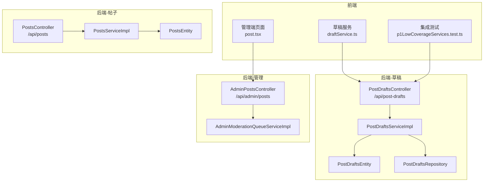
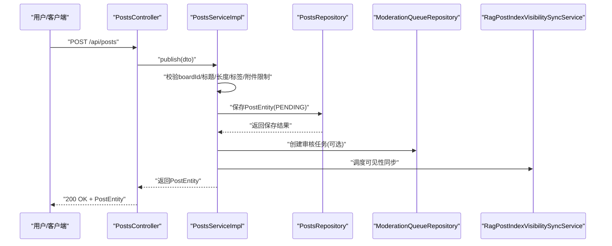
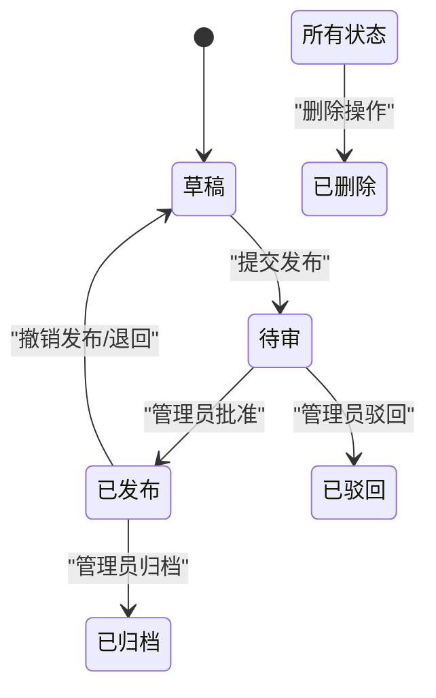
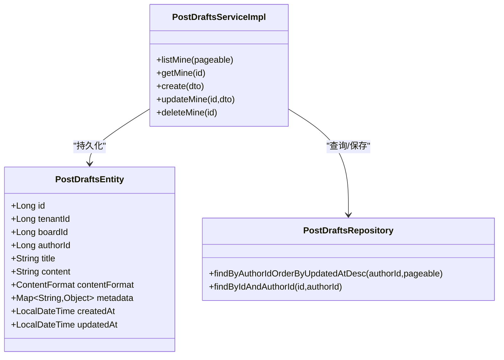
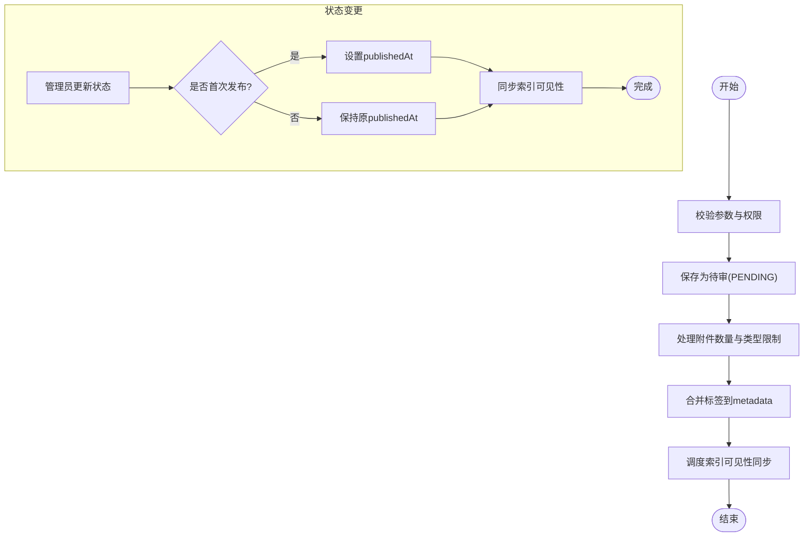
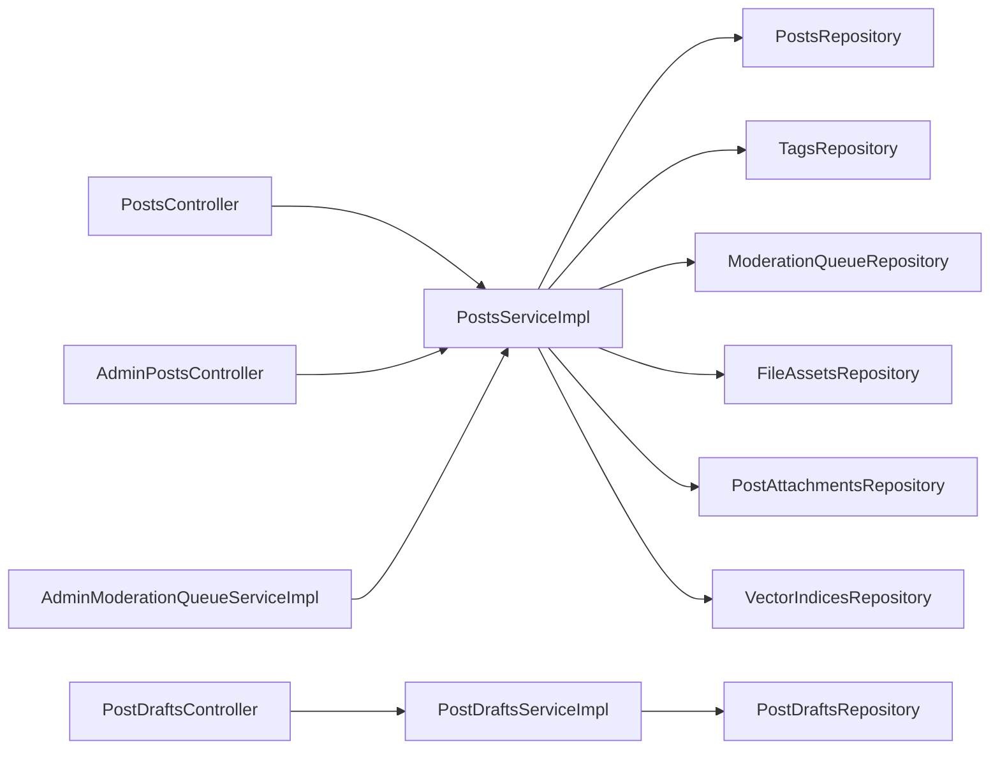

# 帖子管理

<cite>
**本文引用的文件**
- [PostsController.java](file://src/main/java/com/example/EnterpriseRagCommunity/controller/content/PostsController.java)
- [PostsService.java](file://src/main/java/com/example/EnterpriseRagCommunity/service/content/PostsService.java)
- [PostsServiceImpl.java](file://src/main/java/com/example/EnterpriseRagCommunity/service/content/impl/PostsServiceImpl.java)
- [PostsEntity.java](file://src/main/java/com/example/EnterpriseRagCommunity/entity/content/PostsEntity.java)
- [PostStatus.java](file://src/main/java/com/example/EnterpriseRagCommunity/entity/content/enums/PostStatus.java)
- [ContentFormat.java](file://src/main/java/com/example/EnterpriseRagCommunity/entity/content/enums/ContentFormat.java)
- [PostDraftsController.java](file://src/main/java/com/example/EnterpriseRagCommunity/controller/content/PostDraftsController.java)
- [PostDraftsServiceImpl.java](file://src/main/java/com/example/EnterpriseRagCommunity/service/content/impl/PostDraftsServiceImpl.java)
- [PostDraftsEntity.java](file://src/main/java/com/example/EnterpriseRagCommunity/entity/content/PostDraftsEntity.java)
- [PostDraftsRepository.java](file://src/main/java/com/example/EnterpriseRagCommunity/repository/content/PostDraftsRepository.java)
- [AdminPostsController.java](file://src/main/java/com/example/EnterpriseRagCommunity/controller/content/admin/AdminPostsController.java)
- [AdminModerationQueueServiceImpl.java](file://src/main/java/com/example/EnterpriseRagCommunity/service/moderation/impl/AdminModerationQueueServiceImpl.java)
- [draftService.ts](file://my-vite-app/src/services/draftService.ts)
- [p1LowCoverageServices.test.ts](file://my-vite-app/src/services/p1LowCoverageServices.test.ts)
- [post.tsx](file://my-vite-app/src/pages/admin/forms/content/post.tsx)
</cite>

## 目录
1. [引言](#引言)
2. [项目结构](#项目结构)
3. [核心组件](#核心组件)
4. [架构总览](#架构总览)
5. [详细组件分析](#详细组件分析)
6. [依赖分析](#依赖分析)
7. [性能考虑](#性能考虑)
8. [故障排查指南](#故障排查指南)
9. [结论](#结论)
10. [附录](#附录)

## 引言
本文件面向“帖子管理系统”的功能与技术实现，系统性梳理帖子的创建、编辑、删除、发布、草稿保存等核心能力，明确帖子实体模型设计与状态管理机制，给出完整的 API 接口规范，并说明版本控制、内容格式支持与文件上传处理等实现要点。文档同时提供面向前端与后端的参考路径，便于开发与维护。

## 项目结构
围绕帖子管理的关键模块，后端采用典型的分层结构：控制器（Controller）负责请求入口与参数校验，服务（Service）承载业务规则与流程编排，仓储（Repository）负责数据持久化，实体（Entity）映射数据库表结构。前端通过服务封装与后端交互，草稿与正式帖子分别由独立的控制器与服务处理。

图表来源
- [PostsController.java:24-153](file://src/main/java/com/example/EnterpriseRagCommunity/controller/content/PostsController.java#L24-L153)
- [PostsServiceImpl.java:62-200](file://src/main/java/com/example/EnterpriseRagCommunity/service/content/impl/PostsServiceImpl.java#L62-L200)
- [PostsEntity.java:13-75](file://src/main/java/com/example/EnterpriseRagCommunity/entity/content/PostsEntity.java#L13-L75)
- [PostDraftsController.java:14-51](file://src/main/java/com/example/EnterpriseRagCommunity/controller/content/PostDraftsController.java#L14-L51)
- [PostDraftsServiceImpl.java:24-187](file://src/main/java/com/example/EnterpriseRagCommunity/service/content/impl/PostDraftsServiceImpl.java#L24-L187)
- [PostDraftsEntity.java:12-53](file://src/main/java/com/example/EnterpriseRagCommunity/entity/content/PostDraftsEntity.java#L12-L53)
- [PostDraftsRepository.java:12-19](file://src/main/java/com/example/EnterpriseRagCommunity/repository/content/PostDraftsRepository.java#L12-L19)
- [AdminPostsController.java:15-31](file://src/main/java/com/example/EnterpriseRagCommunity/controller/content/admin/AdminPostsController.java#L15-L31)
- [AdminModerationQueueServiceImpl.java:425-444](file://src/main/java/com/example/EnterpriseRagCommunity/service/moderation/impl/AdminModerationQueueServiceImpl.java#L425-L444)

章节来源
- [PostsController.java:24-153](file://src/main/java/com/example/EnterpriseRagCommunity/controller/content/PostsController.java#L24-L153)
- [PostDraftsController.java:14-51](file://src/main/java/com/example/EnterpriseRagCommunity/controller/content/PostDraftsController.java#L14-L51)
- [AdminPostsController.java:15-31](file://src/main/java/com/example/EnterpriseRagCommunity/controller/content/admin/AdminPostsController.java#L15-L31)

## 核心组件
- 控制器层
  - 帖子控制器：提供发布、查询、详情、状态变更、更新、删除、我的帖子列表等接口。
  - 草稿控制器：提供草稿列表、详情、创建、更新、删除等接口。
  - 管理控制器：提供管理端帖子查询与状态筛选。
- 服务层
  - 帖子服务：实现发布、状态变更、更新、删除、查询等业务逻辑。
  - 草稿服务：实现草稿的创建、更新、删除与查询。
- 实体与枚举
  - 帖子实体：定义标题、内容、状态、作者、发布时间、是否删除、元数据等字段。
  - 草稿实体：与帖子实体结构相似，但不参与发布流程。
  - 枚举：帖子状态（草稿、待审、已发布、已驳回、已归档）、内容格式（纯文本、Markdown、HTML）。
- 仓储层
  - 草稿仓储：提供按作者查询草稿与按作者+ID查询草稿的能力。

章节来源
- [PostsController.java:24-153](file://src/main/java/com/example/EnterpriseRagCommunity/controller/content/PostsController.java#L24-L153)
- [PostsService.java:10-39](file://src/main/java/com/example/EnterpriseRagCommunity/service/content/PostsService.java#L10-L39)
- [PostsServiceImpl.java:62-200](file://src/main/java/com/example/EnterpriseRagCommunity/service/content/impl/PostsServiceImpl.java#L62-L200)
- [PostsEntity.java:13-75](file://src/main/java/com/example/EnterpriseRagCommunity/entity/content/PostsEntity.java#L13-L75)
- [PostDraftsController.java:14-51](file://src/main/java/com/example/EnterpriseRagCommunity/controller/content/PostDraftsController.java#L14-L51)
- [PostDraftsServiceImpl.java:24-187](file://src/main/java/com/example/EnterpriseRagCommunity/service/content/impl/PostDraftsServiceImpl.java#L24-L187)
- [PostDraftsEntity.java:12-53](file://src/main/java/com/example/EnterpriseRagCommunity/entity/content/PostDraftsEntity.java#L12-L53)
- [PostDraftsRepository.java:12-19](file://src/main/java/com/example/EnterpriseRagCommunity/repository/content/PostDraftsRepository.java#L12-L19)
- [PostStatus.java:3-9](file://src/main/java/com/example/EnterpriseRagCommunity/entity/content/enums/PostStatus.java#L3-L9)
- [ContentFormat.java:3-7](file://src/main/java/com/example/EnterpriseRagCommunity/entity/content/enums/ContentFormat.java#L3-L7)

## 架构总览
帖子管理由“门户接口 + 管理接口 + 草稿接口”构成，核心流程如下：
- 发布流程：门户提交发布请求 → 服务层校验与配置 → 持久化为待审状态 → 触发审核与索引同步。
- 状态流转：管理员在管理端对帖子进行状态变更（草稿/待审/发布/驳回/归档）。
- 草稿流程：用户在门户侧以草稿形式保存内容，支持多处更新与删除。
- 文件与元数据：内容格式支持多种，元数据中可携带标签与附件信息。

图表来源
- [PostsController.java:37-40](file://src/main/java/com/example/EnterpriseRagCommunity/controller/content/PostsController.java#L37-L40)
- [PostsServiceImpl.java:130-200](file://src/main/java/com/example/EnterpriseRagCommunity/service/content/impl/PostsServiceImpl.java#L130-L200)

## 详细组件分析

### 帖子实体模型与状态管理
- 实体字段
  - 标识与归属：id、tenantId、boardId、authorId
  - 内容与格式：title、content、contentFormat、contentLength、metadata
  - 审核与可见性：status、publishedAt、isDeleted、isChunkedReview、chunkThresholdChars、chunkingStrategy
  - 时间戳：createdAt、updatedAt
- 状态枚举
  - DRAFT、PENDING、PUBLISHED、REJECTED、ARCHIVED
- 内容格式
  - PLAIN、MARKDOWN、HTML
- 状态转换逻辑
  - 创建时默认为 PENDING，首次发布时设置 publishedAt
  - 已删除的帖子禁止发布
  - 管理员可在后台将帖子置为 DRAFT/PENDING/PUBLISHED/REJECTED/ARCHIVED

图表来源
- [PostStatus.java:3-9](file://src/main/java/com/example/EnterpriseRagCommunity/entity/content/enums/PostStatus.java#L3-L9)
- [PostsServiceImpl.java:756-766](file://src/main/java/com/example/EnterpriseRagCommunity/service/content/impl/PostsServiceImpl.java#L756-L766)
- [AdminModerationQueueServiceImpl.java:440-444](file://src/main/java/com/example/EnterpriseRagCommunity/service/moderation/impl/AdminModerationQueueServiceImpl.java#L440-L444)

章节来源
- [PostsEntity.java:13-75](file://src/main/java/com/example/EnterpriseRagCommunity/entity/content/PostsEntity.java#L13-L75)
- [PostStatus.java:3-9](file://src/main/java/com/example/EnterpriseRagCommunity/entity/content/enums/PostStatus.java#L3-L9)
- [ContentFormat.java:3-7](file://src/main/java/com/example/EnterpriseRagCommunity/entity/content/enums/ContentFormat.java#L3-L7)
- [PostsServiceImpl.java:756-766](file://src/main/java/com/example/EnterpriseRagCommunity/service/content/impl/PostsServiceImpl.java#L756-L766)
- [AdminModerationQueueServiceImpl.java:440-444](file://src/main/java/com/example/EnterpriseRagCommunity/service/moderation/impl/AdminModerationQueueServiceImpl.java#L440-L444)

### 草稿实体与草稿服务
- 草稿实体字段
  - 与帖子实体类似，但不包含状态与发布时间字段，用于临时保存与编辑。
- 草稿服务能力
  - 列表、详情、创建、更新、删除
  - 严格按作者维度访问，防止越权
  - 审计日志记录草稿的创建/更新/删除

图表来源
- [PostDraftsEntity.java:12-53](file://src/main/java/com/example/EnterpriseRagCommunity/entity/content/PostDraftsEntity.java#L12-L53)
- [PostDraftsServiceImpl.java:24-187](file://src/main/java/com/example/EnterpriseRagCommunity/service/content/impl/PostDraftsServiceImpl.java#L24-L187)
- [PostDraftsRepository.java:12-19](file://src/main/java/com/example/EnterpriseRagCommunity/repository/content/PostDraftsRepository.java#L12-L19)

章节来源
- [PostDraftsEntity.java:12-53](file://src/main/java/com/example/EnterpriseRagCommunity/entity/content/PostDraftsEntity.java#L12-L53)
- [PostDraftsServiceImpl.java:65-152](file://src/main/java/com/example/EnterpriseRagCommunity/service/content/impl/PostDraftsServiceImpl.java#L65-L152)
- [PostDraftsRepository.java:12-19](file://src/main/java/com/example/EnterpriseRagCommunity/repository/content/PostDraftsRepository.java#L12-L19)

### 帖子控制器与API规范
- 发布帖子
  - 方法：POST
  - 路径：/api/posts
  - 请求体：PostsPublishDTO（包含 boardId、title、content、contentFormat、tags、metadata、attachmentIds）
  - 返回：PostsEntity
- 查询帖子列表（门户）
  - 方法：GET
  - 路径：/api/posts
  - 查询参数：keyword、postId、searchMode、boardId、status、authorId、createdFrom、createdTo、page、pageSize、sortBy、sortOrderDirection
  - 默认只展示已发布；若需查看全部可传 status=ALL
- 获取帖子详情
  - 方法：GET
  - 路径：/api/posts/{id}
  - 返回：PostDetailDTO
- 更新帖子状态（管理端）
  - 方法：PUT
  - 路径：/api/posts/{id}/status
  - 权限：admin_moderation_queue:action
  - 请求体：{ status }
  - 返回：PostsEntity
- 更新帖子
  - 方法：PUT
  - 路径：/api/posts/{id}
  - 请求体：PostsUpdateDTO
  - 返回：PostsEntity
- 删除帖子
  - 方法：DELETE
  - 路径：/api/posts/{id}
  - 返回：void
- 我的帖子列表（作者）
  - 方法：GET
  - 路径：/api/posts/mine
  - 查询参数：keyword、postId、searchMode、boardId、status、createdFrom、createdTo、page、pageSize、sortBy、sortOrderDirection
  - 默认不过滤状态（ALL）

章节来源
- [PostsController.java:37-151](file://src/main/java/com/example/EnterpriseRagCommunity/controller/content/PostsController.java#L37-L151)

### 草稿控制器与API规范
- 列表草稿
  - 方法：GET
  - 路径：/api/post-drafts
  - 查询参数：page、size
  - 返回：Page<PostDraftsDTO>
- 获取草稿
  - 方法：GET
  - 路径：/api/post-drafts/{id}
  - 返回：PostDraftsDTO
- 创建草稿
  - 方法：POST
  - 路径：/api/post-drafts
  - 请求体：PostDraftsCreateDTO
  - 返回：PostDraftsDTO
- 更新草稿
  - 方法：PUT
  - 路径：/api/post-drafts/{id}
  - 请求体：PostDraftsUpdateDTO
  - 返回：PostDraftsDTO
- 删除草稿
  - 方法：DELETE
  - 路径：/api/post-drafts/{id}
  - 返回：void

章节来源
- [PostDraftsController.java:22-50](file://src/main/java/com/example/EnterpriseRagCommunity/controller/content/PostDraftsController.java#L22-L50)

### 管理端帖子查询
- 路径：/api/admin/posts
- 查询参数：boardId、authorId、status（可为 ALL/DRAFT/PENDING/PUBLISHED/REJECTED/ARCHIVED）、createdFrom、createdTo、page、pageSize、sortBy、sortOrderDirection
- 默认不过滤状态（即 ALL），用于查看 PENDING 等状态

章节来源
- [AdminPostsController.java:30-31](file://src/main/java/com/example/EnterpriseRagCommunity/controller/content/admin/AdminPostsController.java#L30-L31)

### 帖子发布流程与状态变更
- 发布校验
  - 校验 boardId 权限与内容长度、标签、附件数量限制
  - 设置 contentFormat、contentLength、metadata、分片策略（可选）
  - 保存为 PENDING
- 状态变更
  - 管理员调用 /api/posts/{id}/status 更新状态
  - 首次发布时设置 publishedAt
  - 已删除的帖子禁止发布
  - 管理端可将 REJECTED 的帖子重新置为 PUBLISHED 并补全发布时间

图表来源
- [PostsServiceImpl.java:130-200](file://src/main/java/com/example/EnterpriseRagCommunity/service/content/impl/PostsServiceImpl.java#L130-L200)
- [PostsServiceImpl.java:756-766](file://src/main/java/com/example/EnterpriseRagCommunity/service/content/impl/PostsServiceImpl.java#L756-L766)
- [AdminModerationQueueServiceImpl.java:440-444](file://src/main/java/com/example/EnterpriseRagCommunity/service/moderation/impl/AdminModerationQueueServiceImpl.java#L440-L444)

章节来源
- [PostsServiceImpl.java:130-200](file://src/main/java/com/example/EnterpriseRagCommunity/service/content/impl/PostsServiceImpl.java#L130-L200)
- [PostsServiceImpl.java:756-766](file://src/main/java/com/example/EnterpriseRagCommunity/service/content/impl/PostsServiceImpl.java#L756-L766)
- [AdminModerationQueueServiceImpl.java:440-444](file://src/main/java/com/example/EnterpriseRagCommunity/service/moderation/impl/AdminModerationQueueServiceImpl.java#L440-L444)

### 前端交互与草稿映射
- 草稿服务
  - 提供草稿列表、创建、更新、删除、空草稿模板
  - 将后端 metadata 中的 tags 与 attachments 映射为前端结构
- 集成测试
  - 验证草稿创建/更新/删除的 HTTP 方法与 URL
  - 验证字段校验错误返回
- 管理端页面
  - 支持选择目标状态并弹窗确认
  - 调用后端 /api/posts/{id}/status 更新状态

章节来源
- [draftService.ts:1-80](file://my-vite-app/src/services/draftService.ts#L1-L80)
- [p1LowCoverageServices.test.ts:243-262](file://my-vite-app/src/services/p1LowCoverageServices.test.ts#L243-L262)
- [post.tsx:149-182](file://my-vite-app/src/pages/admin/forms/content/post.tsx#L149-L182)

## 依赖分析
- 控制器到服务
  - PostsController 依赖 PostsService 与 PortalPostsService
  - PostDraftsController 依赖 PostDraftsService
  - AdminPostsController 依赖 PostsService
- 服务到仓储
  - PostsServiceImpl 依赖 PostsRepository、PostAttachmentsRepository、FileAssetsRepository、TagsRepository、ModerationQueueRepository、VectorIndicesRepository 等
  - PostDraftsServiceImpl 依赖 PostDraftsRepository
- 管理与审核
  - AdminModerationQueueServiceImpl 在特定条件下将 REJECTED 的帖子置为 PUBLISHED 并补全发布时间

图表来源
- [PostsController.java:24-153](file://src/main/java/com/example/EnterpriseRagCommunity/controller/content/PostsController.java#L24-L153)
- [PostDraftsController.java:14-51](file://src/main/java/com/example/EnterpriseRagCommunity/controller/content/PostDraftsController.java#L14-L51)
- [AdminPostsController.java:15-31](file://src/main/java/com/example/EnterpriseRagCommunity/controller/content/admin/AdminPostsController.java#L15-L31)
- [PostsServiceImpl.java:62-118](file://src/main/java/com/example/EnterpriseRagCommunity/service/content/impl/PostsServiceImpl.java#L62-L118)
- [PostDraftsServiceImpl.java:24-38](file://src/main/java/com/example/EnterpriseRagCommunity/service/content/impl/PostDraftsServiceImpl.java#L24-L38)
- [AdminModerationQueueServiceImpl.java:425-444](file://src/main/java/com/example/EnterpriseRagCommunity/service/moderation/impl/AdminModerationQueueServiceImpl.java#L425-L444)

章节来源
- [PostsServiceImpl.java:62-118](file://src/main/java/com/example/EnterpriseRagCommunity/service/content/impl/PostsServiceImpl.java#L62-L118)
- [PostDraftsServiceImpl.java:24-38](file://src/main/java/com/example/EnterpriseRagCommunity/service/content/impl/PostDraftsServiceImpl.java#L24-L38)

## 性能考虑
- 分页与排序
  - 列表接口支持 page、pageSize、sortBy、sortOrderDirection，建议前端合理设置分页大小并使用稳定排序键。
- 索引同步
  - 发布与状态变更会触发索引可见性同步，建议在高并发场景下关注同步队列与异步处理耗时。
- 附件与内容长度
  - 服务端对内容长度与附件数量有限制，建议前端提前提示与截断，减少无效请求。
- 数据库索引
  - 建议在 board_id、author_id、status、created_at 等常用查询字段建立索引以提升查询性能。

## 故障排查指南
- 未登录或会话过期
  - 控制器与服务均对认证状态进行校验，若出现 401，请检查前端 Cookie 与会话状态。
- 资源不存在或无权访问
  - 草稿查询与更新要求按作者维度访问，若报错请确认草稿 ID 与当前用户匹配。
- 参数校验失败
  - 标题/内容为空、长度超限、标签缺失、附件超限等均会抛出参数异常，前端应根据后端返回的字段错误提示修正输入。
- 已删除的帖子不可发布
  - 若更新状态时报错“帖子已删除”，请先恢复或重新创建。
- 管理端权限不足
  - 更新状态需具备 admin_moderation_queue:action 权限，若被拒绝请检查角色授权。

章节来源
- [PostsController.java:117-151](file://src/main/java/com/example/EnterpriseRagCommunity/controller/content/PostsController.java#L117-L151)
- [PostDraftsServiceImpl.java:72-77](file://src/main/java/com/example/EnterpriseRagCommunity/service/content/impl/PostDraftsServiceImpl.java#L72-L77)
- [PostsServiceImpl.java:56-61](file://src/main/java/com/example/EnterpriseRagCommunity/service/content/impl/PostsServiceImpl.java#L56-L61)
- [PostsServiceImpl.java:130-200](file://src/main/java/com/example/EnterpriseRagCommunity/service/content/impl/PostsServiceImpl.java#L130-L200)
- [PostsServiceImpl.java:756-766](file://src/main/java/com/example/EnterpriseRagCommunity/service/content/impl/PostsServiceImpl.java#L756-L766)

## 结论
本系统通过清晰的控制器-服务-仓储分层，实现了帖子的完整生命周期管理：从草稿保存、内容校验、发布审核到状态流转与索引同步。实体模型与枚举定义确保了状态与格式的一致性，前端通过服务封装与后端交互，形成闭环。建议在生产环境中结合数据库索引、异步同步与前端校验，持续优化性能与用户体验。

## 附录
- 版本控制机制
  - 后端未实现基于内容的版本历史存储，草稿与正式帖子通过独立实体与审计日志记录关键变更。
- 内容格式支持
  - 支持 PLAIN、MARKDOWN、HTML 三种格式，发布时可指定 contentFormat。
- 上传文件处理
  - 附件 ID 通过 metadata 或 attachmentIds 传递，服务端会根据配置校验附件数量与类型；前端通过 draftService 统一映射 metadata 中的附件信息。

章节来源
- [ContentFormat.java:3-7](file://src/main/java/com/example/EnterpriseRagCommunity/entity/content/enums/ContentFormat.java#L3-L7)
- [PostsServiceImpl.java:130-200](file://src/main/java/com/example/EnterpriseRagCommunity/service/content/impl/PostsServiceImpl.java#L130-L200)
- [draftService.ts:23-55](file://my-vite-app/src/services/draftService.ts#L23-L55)