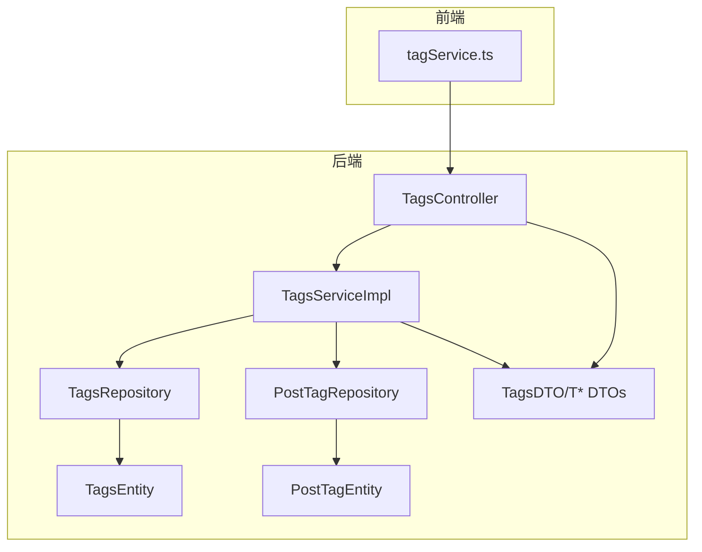
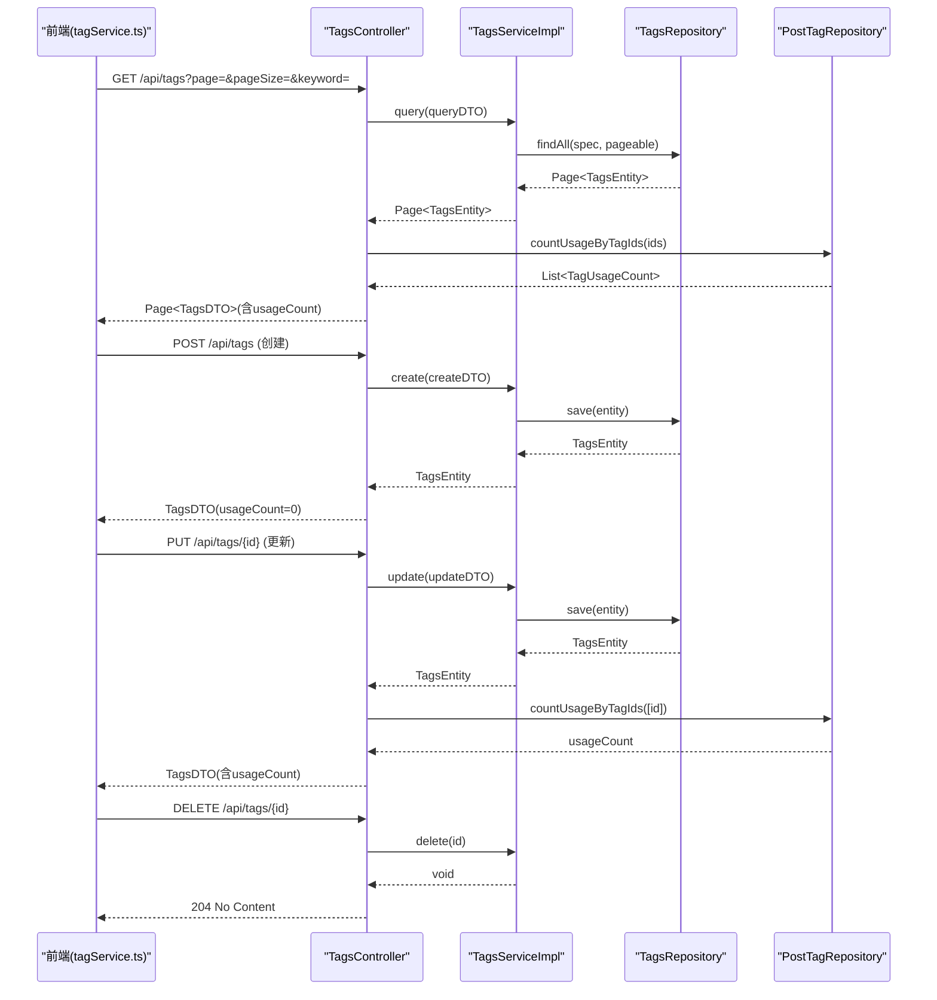
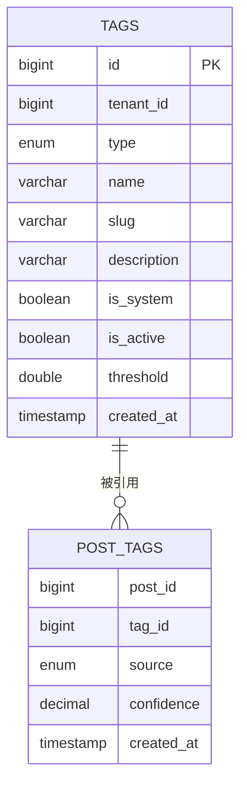
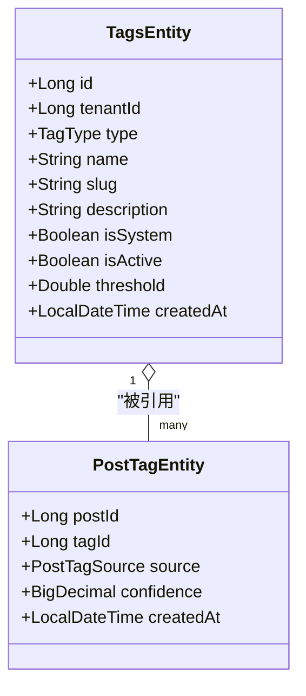
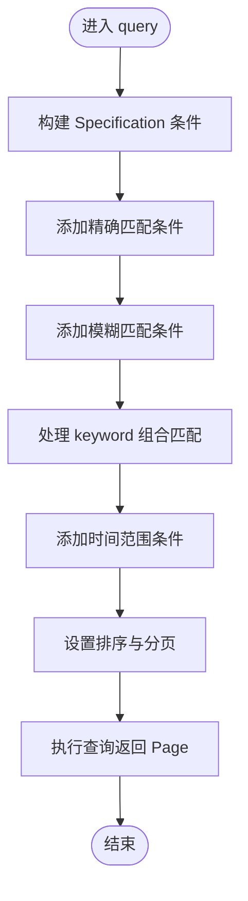
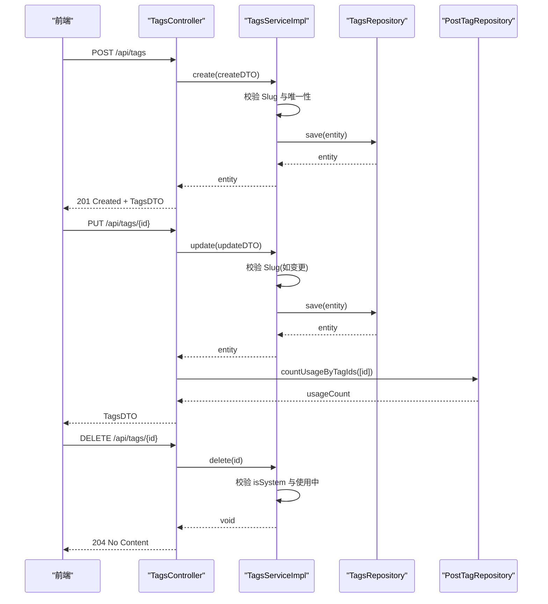
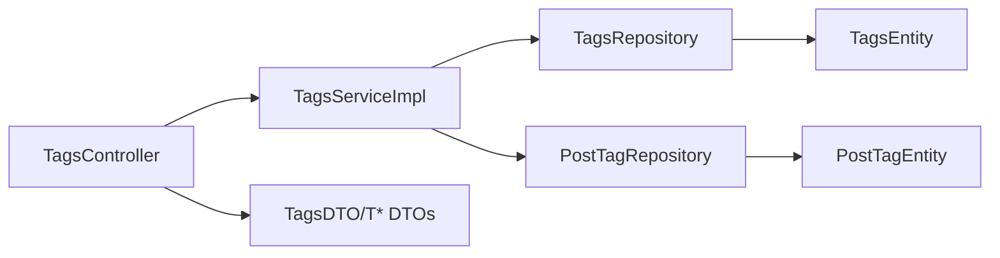

# 标签管理

<cite>
**本文档引用的文件**
- [TagsEntity.java](file://src/main/java/com/example/EnterpriseRagCommunity/entity/content/TagsEntity.java)
- [PostTagEntity.java](file://src/main/java/com/example/EnterpriseRagCommunity/entity/content/PostTagEntity.java)
- [TagType.java](file://src/main/java/com/example/EnterpriseRagCommunity/entity/content/enums/TagType.java)
- [TagsController.java](file://src/main/java/com/example/EnterpriseRagCommunity/controller/content/TagsController.java)
- [TagsService.java](file://src/main/java/com/example/EnterpriseRagCommunity/service/content/TagsService.java)
- [TagsServiceImpl.java](file://src/main/java/com/example/EnterpriseRagCommunity/service/content/impl/TagsServiceImpl.java)
- [TagsRepository.java](file://src/main/java/com/example/EnterpriseRagCommunity/repository/content/TagsRepository.java)
- [PostTagRepository.java](file://src/main/java/com/example/EnterpriseRagCommunity/repository/content/PostTagRepository.java)
- [TagsDTO.java](file://src/main/java/com/example/EnterpriseRagCommunity/dto/content/TagsDTO.java)
- [TagsCreateDTO.java](file://src/main/java/com/example/EnterpriseRagCommunity/dto/content/TagsCreateDTO.java)
- [TagsUpdateDTO.java](file://src/main/java/com/example/EnterpriseRagCommunity/dto/content/TagsUpdateDTO.java)
- [TagsQueryDTO.java](file://src/main/java/com/example/EnterpriseRagCommunity/dto/content/TagsQueryDTO.java)
- [tagService.ts](file://my-vite-app/src/services/tagService.ts)
</cite>

## 目录
1. [简介](#简介)
2. [项目结构](#项目结构)
3. [核心组件](#核心组件)
4. [架构总览](#架构总览)
5. [详细组件分析](#详细组件分析)
6. [依赖关系分析](#依赖关系分析)
7. [性能考量](#性能考量)
8. [故障排查指南](#故障排查指南)
9. [结论](#结论)
10. [附录](#附录)

## 简介
本文件为标签管理系统的功能文档，覆盖标签的创建、查询、更新、删除等核心能力，并深入解析标签实体模型设计、标签与帖子的多对多关联关系及索引优化策略。同时提供完整的标签管理API接口规范，以及标签自动补全、热门标签统计、标签云展示等扩展功能的实现思路与注意事项。

## 项目结构
标签管理模块位于后端 Java 工程的 content 包下，采用典型的分层架构：Controller 负责 HTTP 接口与参数封装，Service 执行业务逻辑与校验，Repository 访问数据库，Entity 定义数据模型，DTO 提供对外传输对象。前端通过 TypeScript 服务封装调用后端接口。

图表来源
- [TagsController.java:24-79](file://src/main/java/com/example/EnterpriseRagCommunity/controller/content/TagsController.java#L24-L79)
- [TagsServiceImpl.java:29-34](file://src/main/java/com/example/EnterpriseRagCommunity/service/content/impl/TagsServiceImpl.java#L29-L34)
- [TagsRepository.java:15-24](file://src/main/java/com/example/EnterpriseRagCommunity/repository/content/TagsRepository.java#L15-L24)
- [PostTagRepository.java:16-31](file://src/main/java/com/example/EnterpriseRagCommunity/repository/content/PostTagRepository.java#L16-L31)
- [TagsEntity.java:10-49](file://src/main/java/com/example/EnterpriseRagCommunity/entity/content/TagsEntity.java#L10-L49)
- [PostTagEntity.java:17-51](file://src/main/java/com/example/EnterpriseRagCommunity/entity/content/PostTagEntity.java#L17-L51)
- [TagsDTO.java:14-49](file://src/main/java/com/example/EnterpriseRagCommunity/dto/content/TagsDTO.java#L14-L49)

章节来源
- [TagsController.java:24-79](file://src/main/java/com/example/EnterpriseRagCommunity/controller/content/TagsController.java#L24-L79)
- [TagsServiceImpl.java:29-34](file://src/main/java/com/example/EnterpriseRagCommunity/service/content/impl/TagsServiceImpl.java#L29-L34)
- [TagsRepository.java:15-24](file://src/main/java/com/example/EnterpriseRagCommunity/repository/content/TagsRepository.java#L15-L24)
- [PostTagRepository.java:16-31](file://src/main/java/com/example/EnterpriseRagCommunity/repository/content/PostTagRepository.java#L16-L31)
- [TagsEntity.java:10-49](file://src/main/java/com/example/EnterpriseRagCommunity/entity/content/TagsEntity.java#L10-L49)
- [PostTagEntity.java:17-51](file://src/main/java/com/example/EnterpriseRagCommunity/entity/content/PostTagEntity.java#L17-L51)
- [TagsDTO.java:14-49](file://src/main/java/com/example/EnterpriseRagCommunity/dto/content/TagsDTO.java#L14-L49)

## 核心组件
- 控制器层：提供 /api/tags 的 REST 接口，负责参数接收、分页与 DTO 转换。
- 服务层：实现标签的创建、查询、更新、删除业务逻辑，含唯一性校验、Slug 规范校验、系统标签保护等。
- 数据访问层：基于 JPA 的 Repository，提供标签与关联表的查询与聚合。
- 实体层：标签主表与标签-帖子关联表，定义字段、索引与复合主键。
- DTO 层：面向前端的传输对象，避免直接暴露实体。

章节来源
- [TagsController.java:24-79](file://src/main/java/com/example/EnterpriseRagCommunity/controller/content/TagsController.java#L24-L79)
- [TagsService.java:14-23](file://src/main/java/com/example/EnterpriseRagCommunity/service/content/TagsService.java#L14-L23)
- [TagsServiceImpl.java:29-218](file://src/main/java/com/example/EnterpriseRagCommunity/service/content/impl/TagsServiceImpl.java#L29-L218)
- [TagsRepository.java:15-24](file://src/main/java/com/example/EnterpriseRagCommunity/repository/content/TagsRepository.java#L15-L24)
- [PostTagRepository.java:16-31](file://src/main/java/com/example/EnterpriseRagCommunity/repository/content/PostTagRepository.java#L16-L31)
- [TagsEntity.java:10-49](file://src/main/java/com/example/EnterpriseRagCommunity/entity/content/TagsEntity.java#L10-L49)
- [PostTagEntity.java:17-51](file://src/main/java/com/example/EnterpriseRagCommunity/entity/content/PostTagEntity.java#L17-L51)
- [TagsDTO.java:14-49](file://src/main/java/com/example/EnterpriseRagCommunity/dto/content/TagsDTO.java#L14-L49)

## 架构总览
标签管理遵循“Controller → Service → Repository → Entity”的分层设计，使用 JPA Specification 动态拼装查询条件，结合 PostTagRepository 的聚合查询计算标签使用量，最终以 DTO 形式返回给前端。

图表来源
- [TagsController.java:33-71](file://src/main/java/com/example/EnterpriseRagCommunity/controller/content/TagsController.java#L33-L71)
- [TagsServiceImpl.java:39-111](file://src/main/java/com/example/EnterpriseRagCommunity/service/content/impl/TagsServiceImpl.java#L39-L111)
- [TagsRepository.java:15-24](file://src/main/java/com/example/EnterpriseRagCommunity/repository/content/TagsRepository.java#L15-L24)
- [PostTagRepository.java:29-30](file://src/main/java/com/example/EnterpriseRagCommunity/repository/content/PostTagRepository.java#L29-L30)
- [tagService.ts:165-188](file://my-vite-app/src/services/tagService.ts#L165-L188)
- [tagService.ts:137-163](file://my-vite-app/src/services/tagService.ts#L137-L163)
- [tagService.ts:211-262](file://my-vite-app/src/services/tagService.ts#L211-L262)
- [tagService.ts:264-277](file://my-vite-app/src/services/tagService.ts#L264-L277)

## 详细组件分析

### 标签实体模型设计
- 主表 tags 字段
  - id：自增主键
  - tenant_id：租户标识
  - type：标签类型（枚举）
  - name：标签名称（最大长度 64）
  - slug：路径标识（最大长度 96，唯一约束：tenant_id + type + slug）
  - description：描述（最大长度 255）
  - is_system：是否系统标签
  - is_active：是否启用
  - threshold：风险阈值（用于风险类标签）
  - created_at：创建时间
- 关联表 post_tags 字段
  - 复合主键：(post_id, tag_id, source)
  - confidence：置信度
  - created_at：创建时间（只读）

图表来源
- [TagsEntity.java:17-48](file://src/main/java/com/example/EnterpriseRagCommunity/entity/content/TagsEntity.java#L17-L48)
- [PostTagEntity.java:24-41](file://src/main/java/com/example/EnterpriseRagCommunity/entity/content/PostTagEntity.java#L24-L41)

章节来源
- [TagsEntity.java:10-49](file://src/main/java/com/example/EnterpriseRagCommunity/entity/content/TagsEntity.java#L10-L49)
- [PostTagEntity.java:17-51](file://src/main/java/com/example/EnterpriseRagCommunity/entity/content/PostTagEntity.java#L17-L51)
- [TagType.java:3-8](file://src/main/java/com/example/EnterpriseRagCommunity/entity/content/enums/TagType.java#L3-L8)

### 标签与帖子的多对多关联关系
- 关系说明
  - 一个标签可被多个帖子引用，一个帖子可包含多个标签
  - 关联表包含 source 字段，用于区分标签来源（如 AI、人工等）
  - 复合主键确保同一帖子、同一标签、同一来源的组合唯一
- 使用量统计
  - 通过聚合查询按 tag_id 分组统计使用次数
  - 控制器在返回列表时注入 usageCount 字段

图表来源
- [TagsEntity.java:17-48](file://src/main/java/com/example/EnterpriseRagCommunity/entity/content/TagsEntity.java#L17-L48)
- [PostTagEntity.java:24-50](file://src/main/java/com/example/EnterpriseRagCommunity/entity/content/PostTagEntity.java#L24-L50)

章节来源
- [PostTagRepository.java:29-30](file://src/main/java/com/example/EnterpriseRagCommunity/repository/content/PostTagRepository.java#L29-L30)
- [TagsController.java:33-45](file://src/main/java/com/example/EnterpriseRagCommunity/controller/content/TagsController.java#L33-L45)

### 查询与搜索逻辑
- 支持的查询条件
  - 精确匹配：id、tenantId、type、name、slug、description、isSystem、isActive、createdAt
  - 模糊匹配：nameLike（名称模糊）
  - 组合搜索：keyword（同时匹配 name、slug、description、type 文本与 id 数字）
  - 时间范围：createdFrom、createdTo
  - 分页与排序：page、pageSize、sortBy、sortOrder
- 关键实现
  - 使用 JPA Specification 动态拼接谓词
  - keyword 逻辑：对 name/slug/description/type 进行模糊匹配，并尝试解析 id 数字
  - 默认排序：按创建时间倒序

图表来源
- [TagsServiceImpl.java:40-111](file://src/main/java/com/example/EnterpriseRagCommunity/service/content/impl/TagsServiceImpl.java#L40-L111)

章节来源
- [TagsServiceImpl.java:39-111](file://src/main/java/com/example/EnterpriseRagCommunity/service/content/impl/TagsServiceImpl.java#L39-L111)
- [TagsQueryDTO.java:10-61](file://src/main/java/com/example/EnterpriseRagCommunity/dto/content/TagsQueryDTO.java#L10-L61)

### 创建、更新与删除流程
- 创建
  - 参数校验：@Valid + 业务规则（默认值、trim、createdAt）
  - Slug 规范校验：根据类型选择不同正则
  - 唯一性校验：tenantId + type + slug
  - 保存并返回
- 更新
  - 支持部分字段更新（Optional 字段）
  - Slug 变更时进行校验
  - 唯一性校验（排除自身）
- 删除
  - 系统标签不可删除
  - 若标签正在被帖子引用，则禁止删除

图表来源
- [TagsController.java:47-71](file://src/main/java/com/example/EnterpriseRagCommunity/controller/content/TagsController.java#L47-L71)
- [TagsServiceImpl.java:113-202](file://src/main/java/com/example/EnterpriseRagCommunity/service/content/impl/TagsServiceImpl.java#L113-L202)
- [TagsRepository.java:21-23](file://src/main/java/com/example/EnterpriseRagCommunity/repository/content/TagsRepository.java#L21-L23)
- [PostTagRepository.java:22-30](file://src/main/java/com/example/EnterpriseRagCommunity/repository/content/PostTagRepository.java#L22-L30)

章节来源
- [TagsServiceImpl.java:113-202](file://src/main/java/com/example/EnterpriseRagCommunity/service/content/impl/TagsServiceImpl.java#L113-L202)
- [TagsCreateDTO.java:10-46](file://src/main/java/com/example/EnterpriseRagCommunity/dto/content/TagsCreateDTO.java#L10-L46)
- [TagsUpdateDTO.java:12-47](file://src/main/java/com/example/EnterpriseRagCommunity/dto/content/TagsUpdateDTO.java#L12-L47)

### API 接口规范
- 列表查询
  - 方法与路径：GET /api/tags
  - 查询参数：page、pageSize、sortBy、sortOrder、tenantId、type、isSystem、isActive、keyword
  - 响应：Spring Data Page<TagsDTO>，其中每个元素包含 usageCount
- 创建标签
  - 方法与路径：POST /api/tags
  - 请求体：TagsCreateDTO
  - 响应：201 Created + TagsDTO（usageCount=0）
- 获取详情
  - 方法与路径：GET /api/tags/{id}
  - 响应：TagsDTO（当前实现未返回 usageCount，建议扩展）
- 更新标签
  - 方法与路径：PUT /api/tags/{id}
  - 请求体：部分字段的 TagsUpdateDTO
  - 响应：200 OK + TagsDTO（包含 usageCount）
- 删除标签
  - 方法与路径：DELETE /api/tags/{id}
  - 响应：204 No Content

章节来源
- [TagsController.java:33-71](file://src/main/java/com/example/EnterpriseRagCommunity/controller/content/TagsController.java#L33-L71)
- [TagsDTO.java:14-49](file://src/main/java/com/example/EnterpriseRagCommunity/dto/content/TagsDTO.java#L14-L49)
- [TagsCreateDTO.java:10-46](file://src/main/java/com/example/EnterpriseRagCommunity/dto/content/TagsCreateDTO.java#L10-L46)
- [TagsUpdateDTO.java:12-47](file://src/main/java/com/example/EnterpriseRagCommunity/dto/content/TagsUpdateDTO.java#L12-L47)
- [TagsQueryDTO.java:10-61](file://src/main/java/com/example/EnterpriseRagCommunity/dto/content/TagsQueryDTO.java#L10-L61)

### 前端集成与交互
- 前端服务封装了标签的增删改查与分页查询，包含基础校验与 CSRF 令牌传递
- 列表查询支持 keyword、tenantId、type、isSystem、isActive 等筛选
- 创建/更新时对 slug 进行 kebab-case 校验
- 当前前端未实现标签使用量的实时统计，预留了占位方法

章节来源
- [tagService.ts:31-66](file://my-vite-app/src/services/tagService.ts#L31-L66)
- [tagService.ts:165-188](file://my-vite-app/src/services/tagService.ts#L165-L188)
- [tagService.ts:137-163](file://my-vite-app/src/services/tagService.ts#L137-L163)
- [tagService.ts:211-262](file://my-vite-app/src/services/tagService.ts#L211-L262)
- [tagService.ts:264-277](file://my-vite-app/src/services/tagService.ts#L264-L277)

## 依赖关系分析
- 控制器依赖服务与关联仓库，用于计算 usageCount 并转换 DTO
- 服务依赖标签与关联仓库，执行业务规则与唯一性校验
- 实体间通过关联表建立多对多关系，使用复合主键保证唯一性
- DTO 与前端类型保持一致，便于序列化与反序列化

图表来源
- [TagsController.java:30-31](file://src/main/java/com/example/EnterpriseRagCommunity/controller/content/TagsController.java#L30-L31)
- [TagsServiceImpl.java:33-34](file://src/main/java/com/example/EnterpriseRagCommunity/service/content/impl/TagsServiceImpl.java#L33-L34)
- [TagsRepository.java:16-24](file://src/main/java/com/example/EnterpriseRagCommunity/repository/content/TagsRepository.java#L16-L24)
- [PostTagRepository.java:16-31](file://src/main/java/com/example/EnterpriseRagCommunity/repository/content/PostTagRepository.java#L16-L31)
- [TagsEntity.java:10-49](file://src/main/java/com/example/EnterpriseRagCommunity/entity/content/TagsEntity.java#L10-L49)
- [PostTagEntity.java:17-51](file://src/main/java/com/example/EnterpriseRagCommunity/entity/content/PostTagEntity.java#L17-L51)
- [TagsDTO.java:14-49](file://src/main/java/com/example/EnterpriseRagCommunity/dto/content/TagsDTO.java#L14-L49)

章节来源
- [TagsController.java:24-79](file://src/main/java/com/example/EnterpriseRagCommunity/controller/content/TagsController.java#L24-L79)
- [TagsServiceImpl.java:29-218](file://src/main/java/com/example/EnterpriseRagCommunity/service/content/impl/TagsServiceImpl.java#L29-L218)

## 性能考量
- 查询性能
  - 使用 JPA Specification 动态拼装条件，建议在高频查询字段上建立合适索引（如 tenant_id、type、slug、created_at）
  - keyword 组合匹配可能造成全表扫描，建议对 name、slug、description 建立独立索引或考虑全文检索
- 聚合统计
  - usageCount 通过一次聚合查询批量获取，避免 N+1 查询
  - 建议在关联表的 tag_id 上建立索引以提升统计效率
- 分页与排序
  - 默认按创建时间倒序，建议在 created_at 上建立索引
  - 分页参数 page 从 1 开始，服务端转换为从 0 开始，注意边界处理

章节来源
- [TagsServiceImpl.java:98-111](file://src/main/java/com/example/EnterpriseRagCommunity/service/content/impl/TagsServiceImpl.java#L98-L111)
- [PostTagRepository.java:29-30](file://src/main/java/com/example/EnterpriseRagCommunity/repository/content/PostTagRepository.java#L29-L30)

## 故障排查指南
- 唯一性冲突
  - 现象：创建/更新时报“tenantId+type+slug 唯一”
  - 处理：检查相同租户下相同类型的 slug 是否重复
- Slug 格式错误
  - 现象：报错提示 Slug 必须为 kebab-case
  - 处理：根据标签类型选择正则规则（风险类允许中文/字母/数字/短横线；其他类型仅小写/数字/短横线）
- 系统标签不可删除
  - 现象：删除时报“系统标签不可删除”
  - 处理：确认标签 isSystem 字段状态
- 标签正在使用
  - 现象：删除时报“标签正在使用，无法删除”
  - 处理：先移除所有关联帖子中的该标签

章节来源
- [TagsServiceImpl.java:133-135](file://src/main/java/com/example/EnterpriseRagCommunity/service/content/impl/TagsServiceImpl.java#L133-L135)
- [TagsServiceImpl.java:204-215](file://src/main/java/com/example/EnterpriseRagCommunity/service/content/impl/TagsServiceImpl.java#L204-L215)
- [TagsServiceImpl.java:194-199](file://src/main/java/com/example/EnterpriseRagCommunity/service/content/impl/TagsServiceImpl.java#L194-L199)

## 结论
标签管理模块实现了清晰的分层架构与完善的业务规则，支持灵活的查询与聚合统计。通过复合主键与唯一约束保障数据一致性，通过 DTO 隔离实体细节。建议后续在数据库层面引入必要的索引与全文检索能力，以进一步提升查询性能与用户体验。

## 附录

### 标签自动补全、热门标签统计、标签云展示实现建议
- 自动补全
  - 在后端提供 GET /api/tags/suggestions?prefix={term}&limit={n} 接口，使用 nameLike 或 slug 前缀匹配
  - 前端监听输入框事件，触发请求并展示候选列表
- 热门标签统计
  - 基于关联表聚合统计 usageCount，按数量降序返回 Top N
  - 可缓存热点标签结果，降低数据库压力
- 标签云
  - 将热门标签与权重映射到字号或颜色，前端渲染为可视化云图
  - 可结合类型过滤（如仅显示启用的标签）

[本节为概念性内容，无需源码引用]