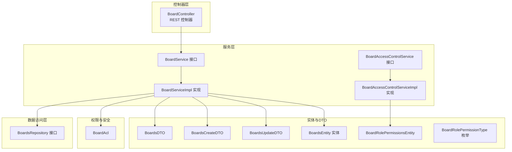
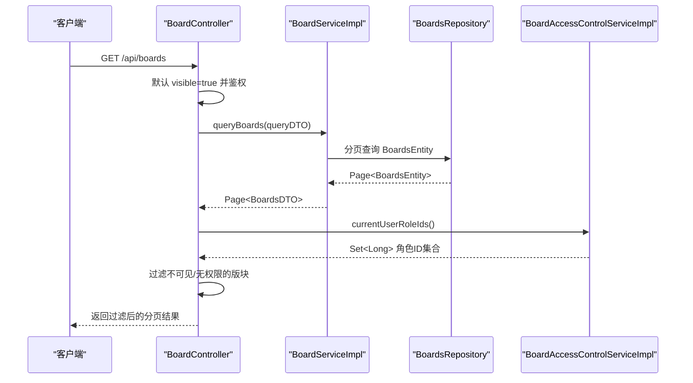
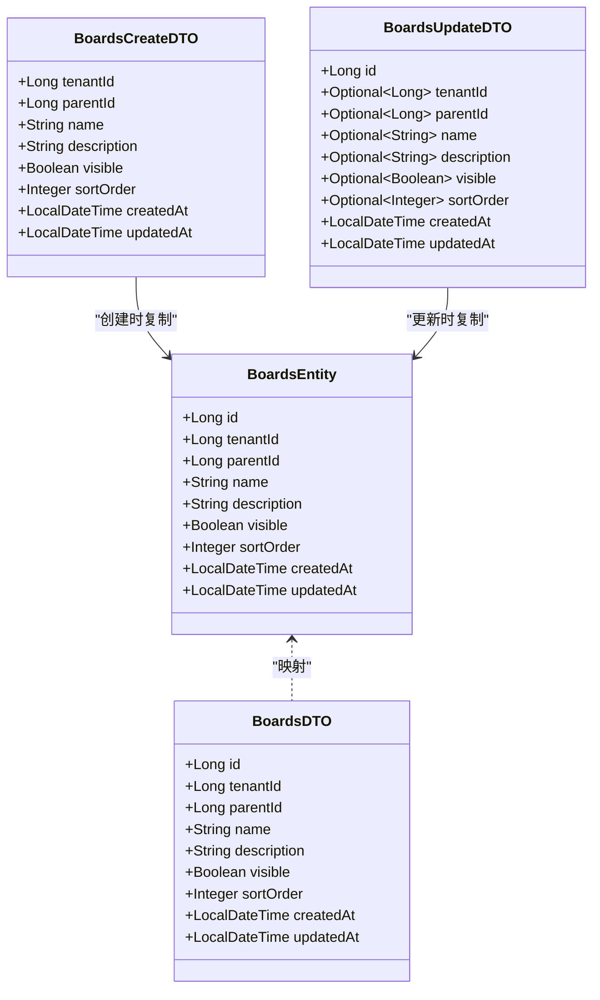
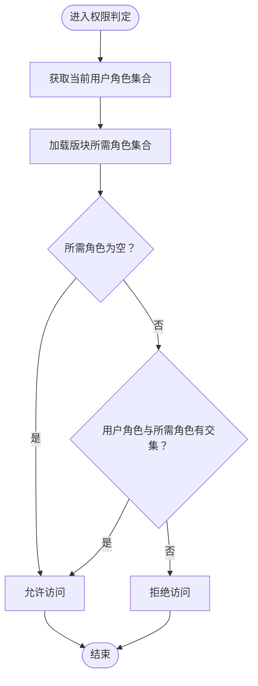
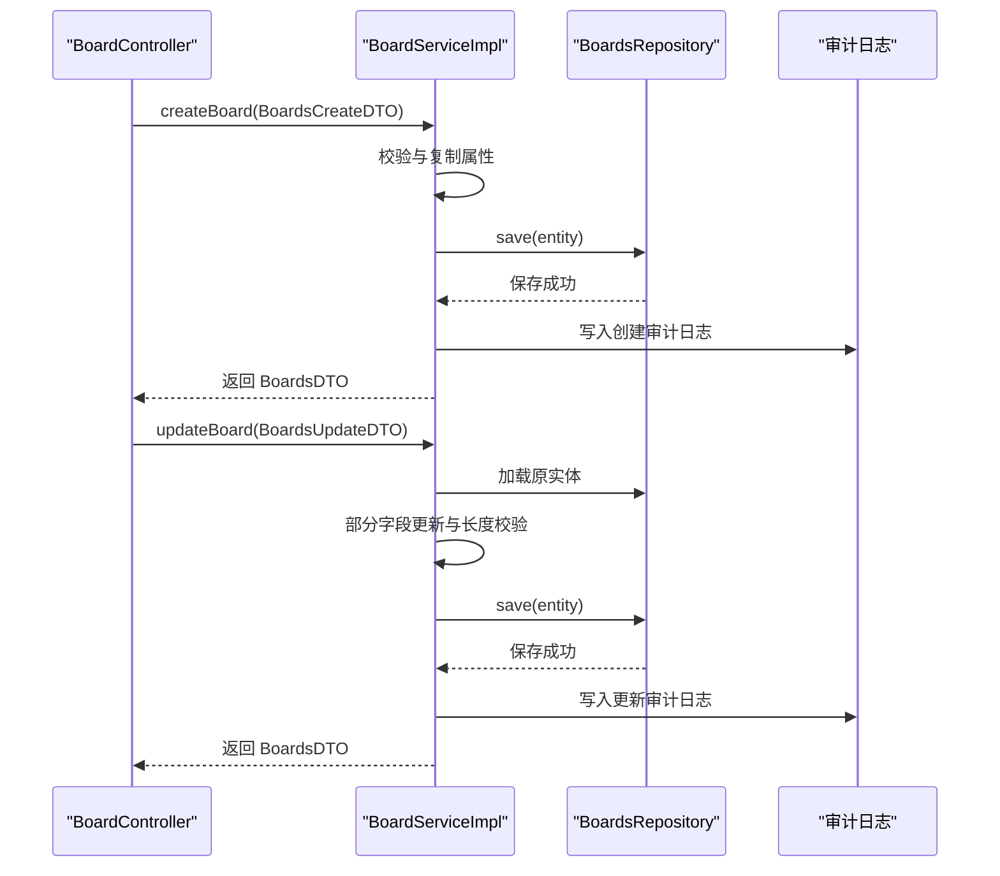
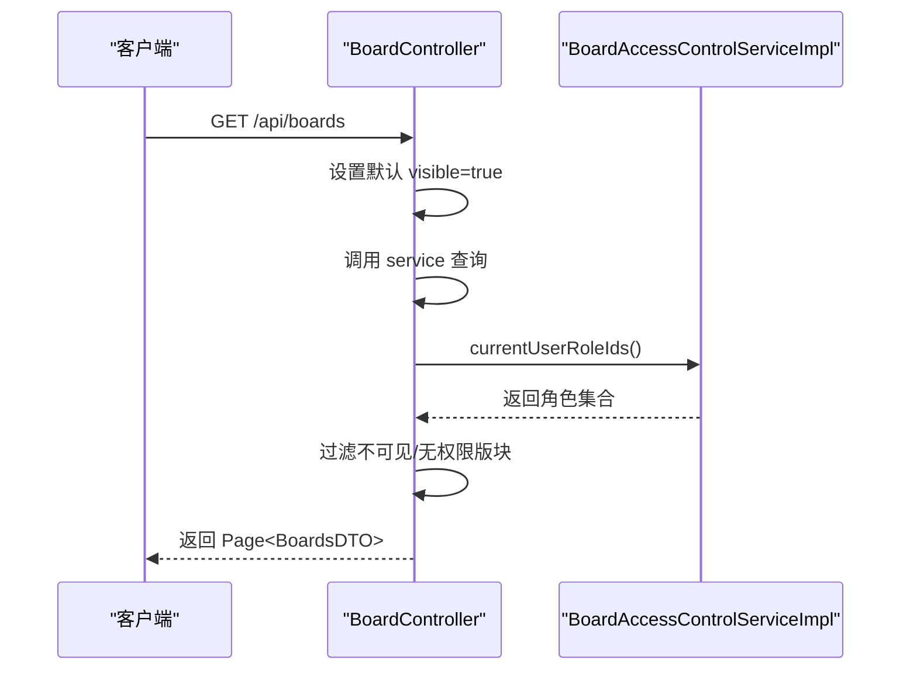
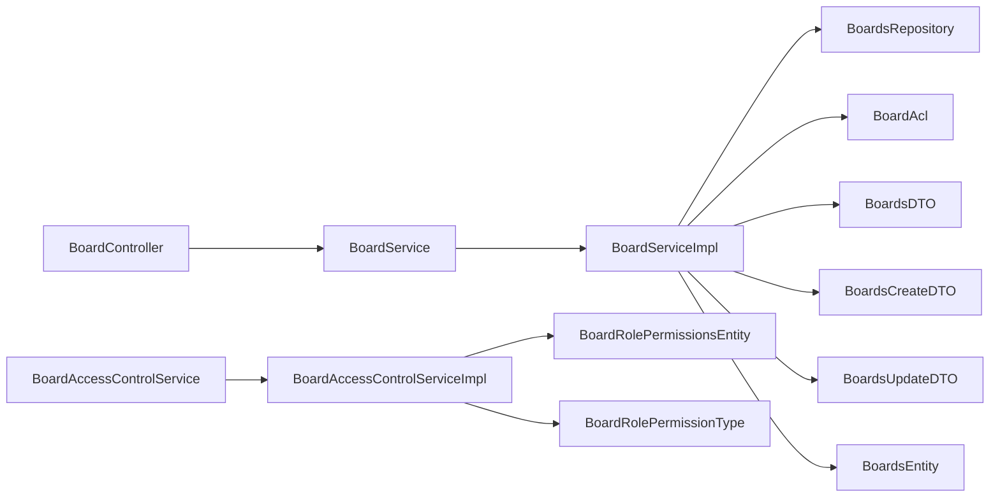

# 版块管理

<cite>
**本文引用的文件**
- [BoardController.java](file://src/main/java/com/example/EnterpriseRagCommunity/controller/BoardController.java)
- [BoardService.java](file://src/main/java/com/example/EnterpriseRagCommunity/service/BoardService.java)
- [BoardServiceImpl.java](file://src/main/java/com/example/EnterpriseRagCommunity/service/impl/BoardServiceImpl.java)
- [BoardsRepository.java](file://src/main/java/com/example/EnterpriseRagCommunity/repository/content/BoardsRepository.java)
- [BoardsEntity.java](file://src/main/java/com/example/EnterpriseRagCommunity/entity/content/BoardsEntity.java)
- [BoardsDTO.java](file://src/main/java/com/example/EnterpriseRagCommunity/dto/content/BoardsDTO.java)
- [BoardsCreateDTO.java](file://src/main/java/com/example/EnterpriseRagCommunity/dto/content/BoardsCreateDTO.java)
- [BoardsUpdateDTO.java](file://src/main/java/com/example/EnterpriseRagCommunity/dto/content/BoardsUpdateDTO.java)
- [BoardAccessControlService.java](file://src/main/java/com/example/EnterpriseRagCommunity/service/content/BoardAccessControlService.java)
- [BoardAccessControlServiceImpl.java](file://src/main/java/com/example/EnterpriseRagCommunity/service/content/impl/BoardAccessControlServiceImpl.java)
- [BoardRolePermissionsEntity.java](file://src/main/java/com/example/EnterpriseRagCommunity/entity/content/BoardRolePermissionsEntity.java)
- [BoardRolePermissionType.java](file://src/main/java/com/example/EnterpriseRagCommunity/entity/content/enums/BoardRolePermissionType.java)
- [BoardAcl.java](file://src/main/java/com/example/EnterpriseRagCommunity/security/BoardAcl.java)
</cite>

## 目录
1. [引言](#引言)
2. [项目结构](#项目结构)
3. [核心组件](#核心组件)
4. [架构总览](#架构总览)
5. [详细组件分析](#详细组件分析)
6. [依赖分析](#依赖分析)
7. [性能考虑](#性能考虑)
8. [故障排查指南](#故障排查指南)
9. [结论](#结论)
10. [附录：API 接口规范](#附录api-接口规范)

## 引言
本文件面向“版块管理系统”的使用者与维护者，系统性阐述版块的创建、配置、权限管理与帖子分类展示等核心能力。文档从实体模型设计、权限控制机制、服务层处理逻辑到控制器接口进行全面解析，并提供与代码一一对应的图示与来源标注，帮助读者快速理解并正确使用该模块。

## 项目结构
围绕“版块管理”的主要代码分布于以下层次：
- 控制器层：负责接收请求、参数校验、鉴权与响应封装
- 服务层：负责业务规则、数据转换、审计日志与事务控制
- 数据访问层：负责持久化与查询条件构建
- 实体与DTO：负责数据库映射与对外传输对象
- 权限与安全：负责角色权限判定与版主权限控制

图表来源
- [BoardController.java:1-72](file://src/main/java/com/example/EnterpriseRagCommunity/controller/BoardController.java#L1-L72)
- [BoardService.java:1-38](file://src/main/java/com/example/EnterpriseRagCommunity/service/BoardService.java#L1-L38)
- [BoardServiceImpl.java:1-245](file://src/main/java/com/example/EnterpriseRagCommunity/service/impl/BoardServiceImpl.java#L1-L245)
- [BoardsRepository.java:1-28](file://src/main/java/com/example/EnterpriseRagCommunity/repository/content/BoardsRepository.java#L1-L28)
- [BoardsEntity.java:1-45](file://src/main/java/com/example/EnterpriseRagCommunity/entity/content/BoardsEntity.java#L1-L45)
- [BoardsDTO.java:1-39](file://src/main/java/com/example/EnterpriseRagCommunity/dto/content/BoardsDTO.java#L1-L39)
- [BoardsCreateDTO.java:1-43](file://src/main/java/com/example/EnterpriseRagCommunity/dto/content/BoardsCreateDTO.java#L1-L43)
- [BoardsUpdateDTO.java:1-46](file://src/main/java/com/example/EnterpriseRagCommunity/dto/content/BoardsUpdateDTO.java#L1-L46)
- [BoardAccessControlService.java:1-18](file://src/main/java/com/example/EnterpriseRagCommunity/service/content/BoardAccessControlService.java#L1-L18)
- [BoardAccessControlServiceImpl.java:1-213](file://src/main/java/com/example/EnterpriseRagCommunity/service/content/impl/BoardAccessControlServiceImpl.java#L1-L213)
- [BoardRolePermissionsEntity.java:1-44](file://src/main/java/com/example/EnterpriseRagCommunity/entity/content/BoardRolePermissionsEntity.java#L1-L44)
- [BoardRolePermissionType.java:1-7](file://src/main/java/com/example/EnterpriseRagCommunity/entity/content/enums/BoardRolePermissionType.java#L1-L7)
- [BoardAcl.java:1-60](file://src/main/java/com/example/EnterpriseRagCommunity/security/BoardAcl.java#L1-L60)

章节来源
- [BoardController.java:1-72](file://src/main/java/com/example/EnterpriseRagCommunity/controller/BoardController.java#L1-L72)
- [BoardServiceImpl.java:1-245](file://src/main/java/com/example/EnterpriseRagCommunity/service/impl/BoardServiceImpl.java#L1-L245)
- [BoardAccessControlServiceImpl.java:1-213](file://src/main/java/com/example/EnterpriseRagCommunity/service/content/impl/BoardAccessControlServiceImpl.java#L1-L213)

## 核心组件
- 版块实体模型：包含标识、租户、父级、名称、描述、可见性、排序、创建与更新时间等字段，支持树形层级与排序展示。
- 版块服务：提供分页查询、创建、更新、删除等能力；内置审计日志与变更对比。
- 权限控制服务：基于角色与版主维度，提供查看与发帖权限判定，并支持批量替换权限配置。
- 控制器：暴露标准 REST 接口，统一鉴权与响应封装，前台默认仅返回可见板块并进行权限过滤。

章节来源
- [BoardsEntity.java:1-45](file://src/main/java/com/example/EnterpriseRagCommunity/entity/content/BoardsEntity.java#L1-L45)
- [BoardsDTO.java:1-39](file://src/main/java/com/example/EnterpriseRagCommunity/dto/content/BoardsDTO.java#L1-L39)
- [BoardsCreateDTO.java:1-43](file://src/main/java/com/example/EnterpriseRagCommunity/dto/content/BoardsCreateDTO.java#L1-L43)
- [BoardsUpdateDTO.java:1-46](file://src/main/java/com/example/EnterpriseRagCommunity/dto/content/BoardsUpdateDTO.java#L1-L46)
- [BoardService.java:1-38](file://src/main/java/com/example/EnterpriseRagCommunity/service/BoardService.java#L1-L38)
- [BoardServiceImpl.java:1-245](file://src/main/java/com/example/EnterpriseRagCommunity/service/impl/BoardServiceImpl.java#L1-L245)
- [BoardAccessControlService.java:1-18](file://src/main/java/com/example/EnterpriseRagCommunity/service/content/BoardAccessControlService.java#L1-L18)
- [BoardAccessControlServiceImpl.java:1-213](file://src/main/java/com/example/EnterpriseRagCommunity/service/content/impl/BoardAccessControlServiceImpl.java#L1-L213)
- [BoardController.java:1-72](file://src/main/java/com/example/EnterpriseRagCommunity/controller/BoardController.java#L1-L72)

## 架构总览
下图展示了从前端到后端的数据流与职责分工，以及权限过滤的关键节点。

图表来源
- [BoardController.java:31-44](file://src/main/java/com/example/EnterpriseRagCommunity/controller/BoardController.java#L31-L44)
- [BoardServiceImpl.java:40-111](file://src/main/java/com/example/EnterpriseRagCommunity/service/impl/BoardServiceImpl.java#L40-L111)
- [BoardsRepository.java:14-27](file://src/main/java/com/example/EnterpriseRagCommunity/repository/content/BoardsRepository.java#L14-L27)
- [BoardAccessControlServiceImpl.java:135-155](file://src/main/java/com/example/EnterpriseRagCommunity/service/content/impl/BoardAccessControlServiceImpl.java#L135-L155)

## 详细组件分析

### 实体模型与数据结构
- BoardsEntity 字段要点
  - 标识与层级：id、parent_id 支持树形结构
  - 租户隔离：tenant_id 支持多租户场景
  - 可见性与排序：visible、sort_order 决定前台展示顺序与可见范围
  - 时间戳：createdAt、updatedAt 记录创建与更新
- DTO 映射
  - BoardsDTO 用于对外返回
  - BoardsCreateDTO 用于创建输入，包含长度限制与必填约束
  - BoardsUpdateDTO 用于更新输入，采用 Optional 包裹以支持部分更新

图表来源
- [BoardsEntity.java:1-45](file://src/main/java/com/example/EnterpriseRagCommunity/entity/content/BoardsEntity.java#L1-L45)
- [BoardsDTO.java:1-39](file://src/main/java/com/example/EnterpriseRagCommunity/dto/content/BoardsDTO.java#L1-L39)
- [BoardsCreateDTO.java:1-43](file://src/main/java/com/example/EnterpriseRagCommunity/dto/content/BoardsCreateDTO.java#L1-L43)
- [BoardsUpdateDTO.java:1-46](file://src/main/java/com/example/EnterpriseRagCommunity/dto/content/BoardsUpdateDTO.java#L1-L46)

章节来源
- [BoardsEntity.java:1-45](file://src/main/java/com/example/EnterpriseRagCommunity/entity/content/BoardsEntity.java#L1-L45)
- [BoardsDTO.java:1-39](file://src/main/java/com/example/EnterpriseRagCommunity/dto/content/BoardsDTO.java#L1-L39)
- [BoardsCreateDTO.java:1-43](file://src/main/java/com/example/EnterpriseRagCommunity/dto/content/BoardsCreateDTO.java#L1-L43)
- [BoardsUpdateDTO.java:1-46](file://src/main/java/com/example/EnterpriseRagCommunity/dto/content/BoardsUpdateDTO.java#L1-L46)

### 权限控制机制
- 角色权限
  - VIEW：查看版块
  - POST：在版块内发帖
  - 权限存储于 board_role_permissions 表，复合主键由 board_id、role_id、perm 组成
- 版主权限
  - 版主可对所在版块内容进行审核与管理
- 权限判定流程
  - 获取当前用户的角色集合
  - 查询目标版块所需的 VIEW/POST 角色集合
  - 判断交集是否存在，存在即允许

图表来源
- [BoardAccessControlServiceImpl.java:170-194](file://src/main/java/com/example/EnterpriseRagCommunity/service/content/impl/BoardAccessControlServiceImpl.java#L170-L194)
- [BoardRolePermissionsEntity.java:1-44](file://src/main/java/com/example/EnterpriseRagCommunity/entity/content/BoardRolePermissionsEntity.java#L1-L44)
- [BoardRolePermissionType.java:1-7](file://src/main/java/com/example/EnterpriseRagCommunity/entity/content/enums/BoardRolePermissionType.java#L1-L7)

章节来源
- [BoardAccessControlService.java:1-18](file://src/main/java/com/example/EnterpriseRagCommunity/service/content/BoardAccessControlService.java#L1-L18)
- [BoardAccessControlServiceImpl.java:1-213](file://src/main/java/com/example/EnterpriseRagCommunity/service/content/impl/BoardAccessControlServiceImpl.java#L1-L213)
- [BoardRolePermissionsEntity.java:1-44](file://src/main/java/com/example/EnterpriseRagCommunity/entity/content/BoardRolePermissionsEntity.java#L1-L44)
- [BoardRolePermissionType.java:1-7](file://src/main/java/com/example/EnterpriseRagCommunity/entity/content/enums/BoardRolePermissionType.java#L1-L7)

### 服务层处理逻辑
- 分页查询
  - 支持按 id、tenantId、parentId、name、visible、sortOrder、时间范围等条件组合查询
  - 默认按 sort_order 升序；支持自定义排序字段与方向
- 创建与更新
  - 创建时写入 createdAt/updatedAt，parentId=0 将被规范化为 null（视数据库约束）
  - 更新时对 name/description 长度进行校验，其余字段采用 Optional 部分更新
- 审计日志
  - 每次 CRUD 操作均记录审计日志，记录操作人、对象、前后差异等

图表来源
- [BoardController.java:46-62](file://src/main/java/com/example/EnterpriseRagCommunity/controller/BoardController.java#L46-L62)
- [BoardServiceImpl.java:113-194](file://src/main/java/com/example/EnterpriseRagCommunity/service/impl/BoardServiceImpl.java#L113-L194)
- [BoardsRepository.java:14-27](file://src/main/java/com/example/EnterpriseRagCommunity/repository/content/BoardsRepository.java#L14-L27)

章节来源
- [BoardService.java:1-38](file://src/main/java/com/example/EnterpriseRagCommunity/service/BoardService.java#L1-L38)
- [BoardServiceImpl.java:1-245](file://src/main/java/com/example/EnterpriseRagCommunity/service/impl/BoardServiceImpl.java#L1-L245)
- [BoardsRepository.java:1-28](file://src/main/java/com/example/EnterpriseRagCommunity/repository/content/BoardsRepository.java#L1-L28)

### 控制器与权限过滤
- 列表查询默认仅返回 visible=true 的版块，并结合当前用户角色进行二次过滤
- 创建/更新/删除接口通过注解进行统一鉴权，要求具备 admin_boards 写权限

图表来源
- [BoardController.java:31-44](file://src/main/java/com/example/EnterpriseRagCommunity/controller/BoardController.java#L31-L44)
- [BoardAccessControlServiceImpl.java:135-155](file://src/main/java/com/example/EnterpriseRagCommunity/service/content/impl/BoardAccessControlServiceImpl.java#L135-L155)

章节来源
- [BoardController.java:1-72](file://src/main/java/com/example/EnterpriseRagCommunity/controller/BoardController.java#L1-L72)
- [BoardAccessControlServiceImpl.java:1-213](file://src/main/java/com/example/EnterpriseRagCommunity/service/content/impl/BoardAccessControlServiceImpl.java#L1-L213)

## 依赖分析
- 控制器依赖服务接口，服务实现依赖仓库与审计工具
- 权限控制服务依赖角色权限与版主关联表，同时依赖用户与管理员服务获取当前用户上下文
- 实体与 DTO 之间通过 BeanUtils 进行属性复制，避免重复映射代码

图表来源
- [BoardController.java:1-72](file://src/main/java/com/example/EnterpriseRagCommunity/controller/BoardController.java#L1-L72)
- [BoardServiceImpl.java:1-245](file://src/main/java/com/example/EnterpriseRagCommunity/service/impl/BoardServiceImpl.java#L1-L245)
- [BoardAccessControlServiceImpl.java:1-213](file://src/main/java/com/example/EnterpriseRagCommunity/service/content/impl/BoardAccessControlServiceImpl.java#L1-L213)
- [BoardsRepository.java:1-28](file://src/main/java/com/example/EnterpriseRagCommunity/repository/content/BoardsRepository.java#L1-L28)
- [BoardsEntity.java:1-45](file://src/main/java/com/example/EnterpriseRagCommunity/entity/content/BoardsEntity.java#L1-L45)
- [BoardsDTO.java:1-39](file://src/main/java/com/example/EnterpriseRagCommunity/dto/content/BoardsDTO.java#L1-L39)
- [BoardsCreateDTO.java:1-43](file://src/main/java/com/example/EnterpriseRagCommunity/dto/content/BoardsCreateDTO.java#L1-L43)
- [BoardsUpdateDTO.java:1-46](file://src/main/java/com/example/EnterpriseRagCommunity/dto/content/BoardsUpdateDTO.java#L1-L46)
- [BoardRolePermissionsEntity.java:1-44](file://src/main/java/com/example/EnterpriseRagCommunity/entity/content/BoardRolePermissionsEntity.java#L1-L44)
- [BoardRolePermissionType.java:1-7](file://src/main/java/com/example/EnterpriseRagCommunity/entity/content/enums/BoardRolePermissionType.java#L1-L7)

章节来源
- [BoardController.java:1-72](file://src/main/java/com/example/EnterpriseRagCommunity/controller/BoardController.java#L1-L72)
- [BoardServiceImpl.java:1-245](file://src/main/java/com/example/EnterpriseRagCommunity/service/impl/BoardServiceImpl.java#L1-L245)
- [BoardAccessControlServiceImpl.java:1-213](file://src/main/java/com/example/EnterpriseRagCommunity/service/content/impl/BoardAccessControlServiceImpl.java#L1-L213)

## 性能考虑
- 分页查询
  - 使用 Specification 动态拼接条件，建议在高频查询字段上建立合适索引（如 tenant_id、parent_id、visible、sort_order）
- 权限过滤
  - 列表查询阶段先做可见性过滤，再进行角色权限过滤，减少后续处理的数据量
- 审计日志
  - 审计写入为同步操作，建议在高并发场景下评估异步化策略或降级方案

## 故障排查指南
- 创建/更新失败
  - 名称/描述超长会触发参数校验异常，检查 DTO 中的长度限制
  - parentId=0 会被规范化为 null，确认数据库外键约束是否允许 NULL
- 权限不足
  - 列表查询可能因权限过滤导致空结果，确认当前用户角色是否满足 VIEW/POST 要求
- 版主权限
  - 版主仅对所在版块内容具有审核权限，跨版块操作需确保对应版块的版主身份

章节来源
- [BoardServiceImpl.java:160-170](file://src/main/java/com/example/EnterpriseRagCommunity/service/impl/BoardServiceImpl.java#L160-L170)
- [BoardAccessControlServiceImpl.java:170-194](file://src/main/java/com/example/EnterpriseRagCommunity/service/content/impl/BoardAccessControlServiceImpl.java#L170-L194)
- [BoardAcl.java:24-51](file://src/main/java/com/example/EnterpriseRagCommunity/security/BoardAcl.java#L24-L51)

## 结论
本版块管理系统以清晰的分层架构实现了从实体建模到权限控制的完整闭环：通过角色与版主双维度权限体系保障内容安全，借助分页查询与可见性控制优化前端体验，配合审计日志实现可追溯的运维能力。建议在生产环境中完善索引策略与权限缓存，持续提升查询与鉴权性能。

## 附录：API 接口规范
- 版块列表查询
  - 方法与路径：GET /api/boards
  - 请求参数：支持 id、tenantId、parentId、name、nameLike、visible、sortOrder、sortOrderFrom、sortOrderTo、createdFrom、createdTo、updatedFrom、updatedTo、sortBy、sortOrderDirection、page、pageSize 等
  - 默认行为：若未指定 visible，则默认 visible=true
  - 权限：需要 admin_boards 写权限
  - 响应：分页返回 BoardsDTO 列表，并按当前用户角色进行二次过滤
- 版块详情查询
  - 方法与路径：GET /api/boards/{id}
  - 请求参数：路径变量 id
  - 权限：需要 admin_boards 写权限
  - 响应：BoardsDTO
- 版块创建
  - 方法与路径：POST /api/boards
  - 请求体：BoardsCreateDTO（含 tenantId、parentId、name、description、visible、sortOrder 等）
  - 权限：需要 admin_boards 写权限
  - 响应：创建后的 BoardsDTO（状态码 201）
- 版块更新
  - 方法与路径：PUT /api/boards/{id}
  - 请求体：BoardsUpdateDTO（id 必填，其他字段可选）
  - 权限：需要 admin_boards 写权限
  - 响应：更新后的 BoardsDTO
- 版块删除
  - 方法与路径：DELETE /api/boards/{id}
  - 请求参数：路径变量 id
  - 权限：需要 admin_boards 写权限
  - 响应：204 No Content

章节来源
- [BoardController.java:31-70](file://src/main/java/com/example/EnterpriseRagCommunity/controller/BoardController.java#L31-L70)
- [BoardServiceImpl.java:40-111](file://src/main/java/com/example/EnterpriseRagCommunity/service/impl/BoardServiceImpl.java#L40-L111)
- [BoardsCreateDTO.java:1-43](file://src/main/java/com/example/EnterpriseRagCommunity/dto/content/BoardsCreateDTO.java#L1-L43)
- [BoardsUpdateDTO.java:1-46](file://src/main/java/com/example/EnterpriseRagCommunity/dto/content/BoardsUpdateDTO.java#L1-L46)