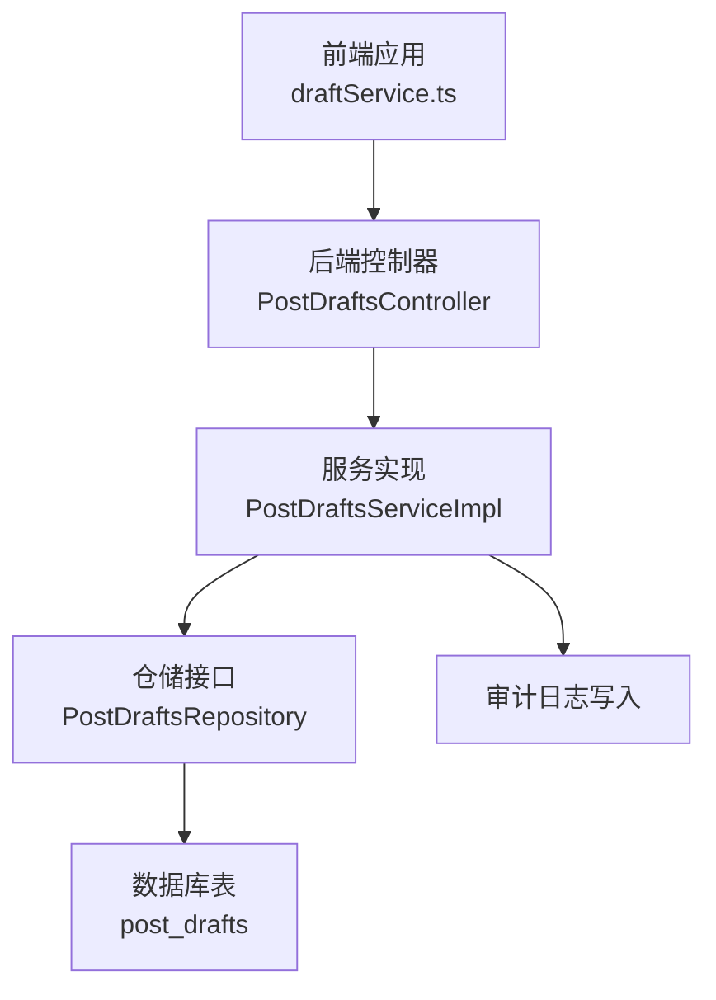
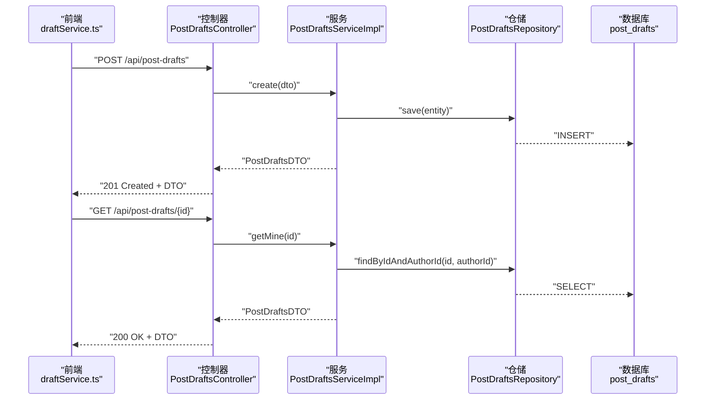
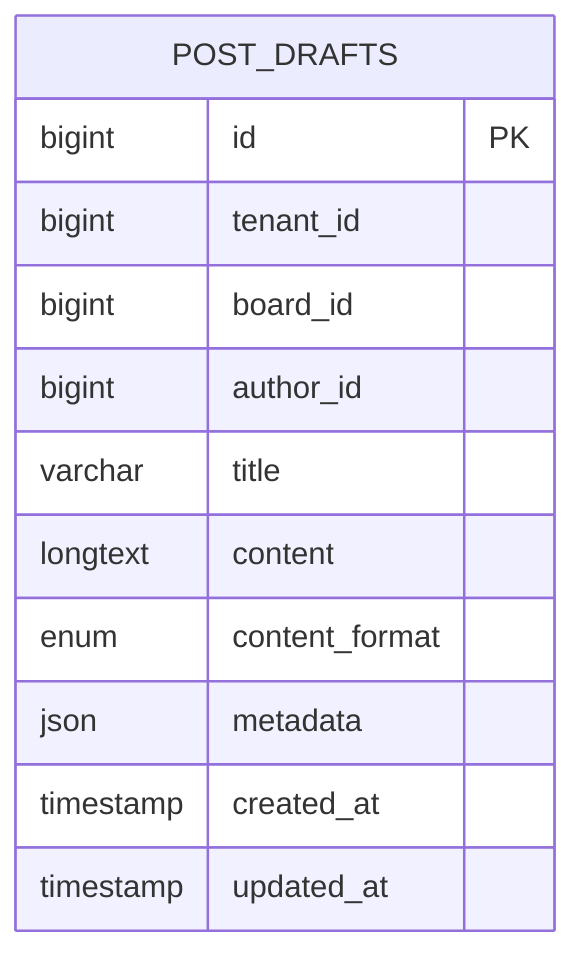
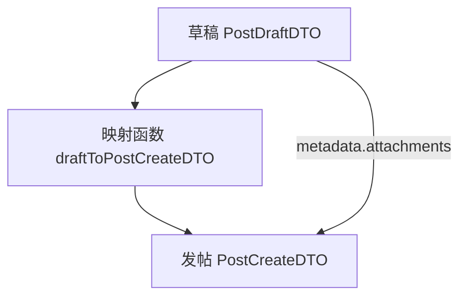
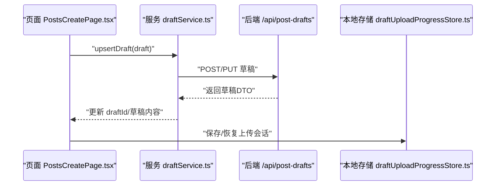
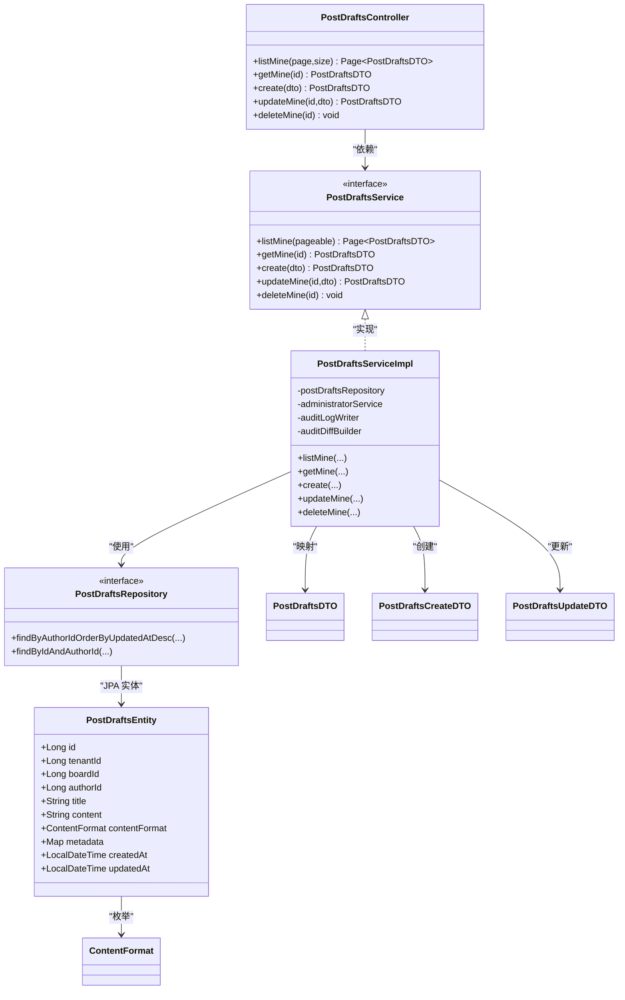
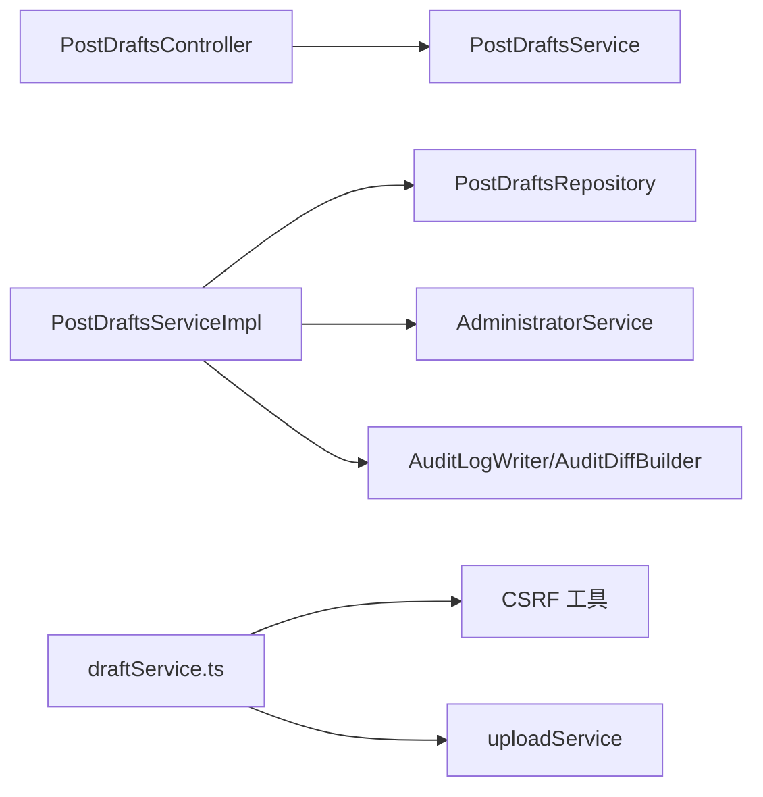

# 草稿管理

<cite>
**本文引用的文件**
- [PostDraftsController.java](file://src/main/java/com/example/EnterpriseRagCommunity/controller/content/PostDraftsController.java)
- [PostDraftsService.java](file://src/main/java/com/example/EnterpriseRagCommunity/service/content/PostDraftsService.java)
- [PostDraftsServiceImpl.java](file://src/main/java/com/example/EnterpriseRagCommunity/service/content/impl/PostDraftsServiceImpl.java)
- [PostDraftsRepository.java](file://src/main/java/com/example/EnterpriseRagCommunity/repository/content/PostDraftsRepository.java)
- [PostDraftsEntity.java](file://src/main/java/com/example/EnterpriseRagCommunity/entity/content/PostDraftsEntity.java)
- [PostDraftsDTO.java](file://src/main/java/com/example/EnterpriseRagCommunity/dto/content/PostDraftsDTO.java)
- [PostDraftsCreateDTO.java](file://src/main/java/com/example/EnterpriseRagCommunity/dto/content/PostDraftsCreateDTO.java)
- [PostDraftsUpdateDTO.java](file://src/main/java/com/example/EnterpriseRagCommunity/dto/content/PostDraftsUpdateDTO.java)
- [ContentFormat.java](file://src/main/java/com/example/EnterpriseRagCommunity/entity/content/enums/ContentFormat.java)
- [draftService.ts](file://my-vite-app/src/services/draftService.ts)
- [draftService.test.ts](file://my-vite-app/src/services/draftService.test.ts)
- [draftUploadProgressStore.ts](file://my-vite-app/src/utils/draftUploadProgressStore.ts)
- [PostsCreatePage.tsx](file://my-vite-app/src/pages/portal/posts/pages/PostsCreatePage.tsx)
</cite>

## 目录
1. [引言](#引言)
2. [项目结构](#项目结构)
3. [核心组件](#核心组件)
4. [架构总览](#架构总览)
5. [详细组件分析](#详细组件分析)
6. [依赖分析](#依赖分析)
7. [性能考虑](#性能考虑)
8. [故障排查指南](#故障排查指南)
9. [结论](#结论)
10. [附录：API 接口规范](#附录api-接口规范)

## 引言
本文件面向“草稿管理”功能，系统性阐述草稿的创建、保存、恢复、删除等核心能力，明确草稿实体模型设计与字段语义，解释草稿与正式帖子的数据映射关系，并给出完整的后端 REST API 规范与前端调用要点。同时覆盖自动保存、离线编辑、草稿上传会话持久化与清理等实现细节。

## 项目结构
草稿管理由后端 Spring Boot 层与前端 Vite 应用层协同完成：
- 后端：控制器负责路由与参数校验，服务层处理业务逻辑与审计日志，仓储层访问数据库，实体定义数据模型。
- 前端：通过服务封装 HTTP 请求，统一处理错误与字段映射，支持草稿自动保存与上传会话离线持久化。

图表来源
- [PostDraftsController.java:14-50](file://src/main/java/com/example/EnterpriseRagCommunity/controller/content/PostDraftsController.java#L14-L50)
- [PostDraftsServiceImpl.java:24-187](file://src/main/java/com/example/EnterpriseRagCommunity/service/content/impl/PostDraftsServiceImpl.java#L24-L187)
- [PostDraftsRepository.java:12-17](file://src/main/java/com/example/EnterpriseRagCommunity/repository/content/PostDraftsRepository.java#L12-L17)
- [PostDraftsEntity.java:12-51](file://src/main/java/com/example/EnterpriseRagCommunity/entity/content/PostDraftsEntity.java#L12-L51)

章节来源
- [PostDraftsController.java:14-50](file://src/main/java/com/example/EnterpriseRagCommunity/controller/content/PostDraftsController.java#L14-L50)
- [PostDraftsService.java:9-19](file://src/main/java/com/example/EnterpriseRagCommunity/service/content/PostDraftsService.java#L9-L19)
- [PostDraftsServiceImpl.java:24-187](file://src/main/java/com/example/EnterpriseRagCommunity/service/content/impl/PostDraftsServiceImpl.java#L24-L187)
- [PostDraftsRepository.java:12-17](file://src/main/java/com/example/EnterpriseRagCommunity/repository/content/PostDraftsRepository.java#L12-L17)
- [PostDraftsEntity.java:12-51](file://src/main/java/com/example/EnterpriseRagCommunity/entity/content/PostDraftsEntity.java#L12-L51)

## 核心组件
- 控制器：暴露 /api/post-drafts 的 REST 接口，负责分页查询、按 ID 获取、创建、更新、删除。
- 服务实现：校验登录与权限，执行业务规则（如标题长度限制），进行审计日志记录。
- 仓储接口：基于 JPA 分页查询与按作者过滤。
- 实体模型：定义草稿在数据库中的字段与类型，含元数据 JSON 字段。
- DTO：前后端传输对象，含内容格式枚举与元数据结构。
- 前端服务：封装 fetch 请求，处理 CSRF、错误映射、字段转换与草稿到发帖 DTO 的映射。

章节来源
- [PostDraftsController.java:22-49](file://src/main/java/com/example/EnterpriseRagCommunity/controller/content/PostDraftsController.java#L22-L49)
- [PostDraftsServiceImpl.java:39-152](file://src/main/java/com/example/EnterpriseRagCommunity/service/content/impl/PostDraftsServiceImpl.java#L39-L152)
- [PostDraftsRepository.java:13-17](file://src/main/java/com/example/EnterpriseRagCommunity/repository/content/PostDraftsRepository.java#L13-L17)
- [PostDraftsEntity.java:16-51](file://src/main/java/com/example/EnterpriseRagCommunity/entity/content/PostDraftsEntity.java#L16-L51)
- [PostDraftsDTO.java:11-43](file://src/main/java/com/example/EnterpriseRagCommunity/dto/content/PostDraftsDTO.java#L11-L43)
- [PostDraftsCreateDTO.java:11-35](file://src/main/java/com/example/EnterpriseRagCommunity/dto/content/PostDraftsCreateDTO.java#L11-L35)
- [PostDraftsUpdateDTO.java:11-32](file://src/main/java/com/example/EnterpriseRagCommunity/dto/content/PostDraftsUpdateDTO.java#L11-L32)
- [ContentFormat.java:3-7](file://src/main/java/com/example/EnterpriseRagCommunity/entity/content/enums/ContentFormat.java#L3-L7)
- [draftService.ts:72-138](file://my-vite-app/src/services/draftService.ts#L72-L138)

## 架构总览
草稿管理采用经典的三层架构：前端通过 draftService.ts 发起请求，后端控制器接收请求并调用服务层，服务层操作仓储访问数据库，最终返回 DTO 给前端。

图表来源
- [PostDraftsController.java:31-49](file://src/main/java/com/example/EnterpriseRagCommunity/controller/content/PostDraftsController.java#L31-L49)
- [PostDraftsServiceImpl.java:71-131](file://src/main/java/com/example/EnterpriseRagCommunity/service/content/impl/PostDraftsServiceImpl.java#L71-L131)
- [PostDraftsRepository.java:13-17](file://src/main/java/com/example/EnterpriseRagCommunity/repository/content/PostDraftsRepository.java#L13-L17)
- [PostDraftsEntity.java:16-51](file://src/main/java/com/example/EnterpriseRagCommunity/entity/content/PostDraftsEntity.java#L16-L51)

## 详细组件分析

### 数据模型与字段定义
草稿实体模型用于持久化用户草稿，字段语义如下：
- id：自增主键
- tenantId：租户标识（可选）
- boardId：板块标识（必填）
- authorId：作者标识（必填）
- title：标题（必填，最大长度 191）
- content：正文内容（必填，LOB）
- contentFormat：内容格式（必填，枚举：PLAIN/MARKDOWN/HTML）
- metadata：JSON 元数据（可存 tags、attachments 等）
- createdAt/updatedAt：创建与更新时间（数据库生成）

图表来源
- [PostDraftsEntity.java:16-51](file://src/main/java/com/example/EnterpriseRagCommunity/entity/content/PostDraftsEntity.java#L16-L51)

章节来源
- [PostDraftsEntity.java:16-51](file://src/main/java/com/example/EnterpriseRagCommunity/entity/content/PostDraftsEntity.java#L16-L51)
- [ContentFormat.java:3-7](file://src/main/java/com/example/EnterpriseRagCommunity/entity/content/enums/ContentFormat.java#L3-L7)

### 草稿与正式帖子的关系映射
- 草稿到发帖的映射：前端提供 draftToPostCreateDTO 将草稿映射为发帖 DTO，其中附件 ID 来自草稿的元数据数组。
- 关系说明：草稿是“半成品”，正式帖子是“成品”。两者共享 boardId、title、content、contentFormat 等字段；草稿的 metadata 可携带附件信息，发布时转换为正式帖子的附件 ID 列表。

图表来源
- [draftService.ts:144-153](file://my-vite-app/src/services/draftService.ts#L144-L153)

章节来源
- [draftService.ts:144-153](file://my-vite-app/src/services/draftService.ts#L144-L153)

### 自动保存、离线编辑与草稿清理
- 自动保存：前端在编辑时调用 upsertDraft，若 draft.id 为 0 则走 POST 创建，否则 PUT 更新；成功后可更新 URL 中的 draftId 参数。
- 离线编辑：通过 draftUploadProgressStore 在本地存储草稿上传会话，支持断点续传与恢复。
- 草稿清理：后端未提供批量清空接口，前端保留空实现；上传会话可通过 clearDraftUploadSessions 清理。

图表来源
- [PostsCreatePage.tsx:473-497](file://my-vite-app/src/pages/portal/posts/pages/PostsCreatePage.tsx#L473-L497)
- [draftService.ts:96-123](file://my-vite-app/src/services/draftService.ts#L96-L123)
- [draftUploadProgressStore.ts:100-129](file://my-vite-app/src/utils/draftUploadProgressStore.ts#L100-L129)

章节来源
- [PostsCreatePage.tsx:473-497](file://my-vite-app/src/pages/portal/posts/pages/PostsCreatePage.tsx#L473-L497)
- [draftService.ts:96-123](file://my-vite-app/src/services/draftService.ts#L96-L123)
- [draftUploadProgressStore.ts:100-129](file://my-vite-app/src/utils/draftUploadProgressStore.ts#L100-L129)

### 类与关系图（代码级）

图表来源
- [PostDraftsController.java:14-50](file://src/main/java/com/example/EnterpriseRagCommunity/controller/content/PostDraftsController.java#L14-L50)
- [PostDraftsService.java:9-19](file://src/main/java/com/example/EnterpriseRagCommunity/service/content/PostDraftsService.java#L9-L19)
- [PostDraftsServiceImpl.java:24-187](file://src/main/java/com/example/EnterpriseRagCommunity/service/content/impl/PostDraftsServiceImpl.java#L24-L187)
- [PostDraftsRepository.java:12-17](file://src/main/java/com/example/EnterpriseRagCommunity/repository/content/PostDraftsRepository.java#L12-L17)
- [PostDraftsEntity.java:16-51](file://src/main/java/com/example/EnterpriseRagCommunity/entity/content/PostDraftsEntity.java#L16-L51)
- [PostDraftsDTO.java:11-43](file://src/main/java/com/example/EnterpriseRagCommunity/dto/content/PostDraftsDTO.java#L11-L43)
- [PostDraftsCreateDTO.java:11-35](file://src/main/java/com/example/EnterpriseRagCommunity/dto/content/PostDraftsCreateDTO.java#L11-L35)
- [PostDraftsUpdateDTO.java:11-32](file://src/main/java/com/example/EnterpriseRagCommunity/dto/content/PostDraftsUpdateDTO.java#L11-L32)
- [ContentFormat.java:3-7](file://src/main/java/com/example/EnterpriseRagCommunity/entity/content/enums/ContentFormat.java#L3-L7)

章节来源
- [PostDraftsController.java:14-50](file://src/main/java/com/example/EnterpriseRagCommunity/controller/content/PostDraftsController.java#L14-L50)
- [PostDraftsService.java:9-19](file://src/main/java/com/example/EnterpriseRagCommunity/service/content/PostDraftsService.java#L9-L19)
- [PostDraftsServiceImpl.java:24-187](file://src/main/java/com/example/EnterpriseRagCommunity/service/content/impl/PostDraftsServiceImpl.java#L24-L187)
- [PostDraftsRepository.java:12-17](file://src/main/java/com/example/EnterpriseRagCommunity/repository/content/PostDraftsRepository.java#L12-L17)
- [PostDraftsEntity.java:16-51](file://src/main/java/com/example/EnterpriseRagCommunity/entity/content/PostDraftsEntity.java#L16-L51)
- [PostDraftsDTO.java:11-43](file://src/main/java/com/example/EnterpriseRagCommunity/dto/content/PostDraftsDTO.java#L11-L43)
- [PostDraftsCreateDTO.java:11-35](file://src/main/java/com/example/EnterpriseRagCommunity/dto/content/PostDraftsCreateDTO.java#L11-L35)
- [PostDraftsUpdateDTO.java:11-32](file://src/main/java/com/example/EnterpriseRagCommunity/dto/content/PostDraftsUpdateDTO.java#L11-L32)
- [ContentFormat.java:3-7](file://src/main/java/com/example/EnterpriseRagCommunity/entity/content/enums/ContentFormat.java#L3-L7)

## 依赖分析
- 控制器依赖服务接口，服务实现依赖仓储接口与审计工具。
- 服务实现依赖管理员服务解析当前用户，确保草稿归属与权限控制。
- 仓储接口基于 JPA 提供分页与按作者过滤查询。
- 前端服务依赖 CSRF 工具与上传服务，统一错误处理与字段映射。

图表来源
- [PostDraftsController.java:19-20](file://src/main/java/com/example/EnterpriseRagCommunity/controller/content/PostDraftsController.java#L19-L20)
- [PostDraftsServiceImpl.java:27-37](file://src/main/java/com/example/EnterpriseRagCommunity/service/content/impl/PostDraftsServiceImpl.java#L27-L37)
- [draftService.ts:3-5](file://my-vite-app/src/services/draftService.ts#L3-L5)

章节来源
- [PostDraftsController.java:19-20](file://src/main/java/com/example/EnterpriseRagCommunity/controller/content/PostDraftsController.java#L19-L20)
- [PostDraftsServiceImpl.java:27-37](file://src/main/java/com/example/EnterpriseRagCommunity/service/content/impl/PostDraftsServiceImpl.java#L27-L37)
- [draftService.ts:3-5](file://my-vite-app/src/services/draftService.ts#L3-L5)

## 性能考虑
- 分页查询：后端默认每页最多 100 条，避免一次性返回过多草稿造成内存压力。
- 事务与审计：创建/更新/删除均在事务中执行，并写入审计日志，保证一致性但增加写入开销。
- 本地存储：上传会话仅缓存在浏览器本地存储，避免频繁网络请求，提升离线体验。
- 前端错误处理：对 404 返回空值，其他错误抛出统一消息，减少 UI 重复判断。

章节来源
- [PostDraftsController.java:22-29](file://src/main/java/com/example/EnterpriseRagCommunity/controller/content/PostDraftsController.java#L22-L29)
- [PostDraftsServiceImpl.java:92-151](file://src/main/java/com/example/EnterpriseRagCommunity/service/content/impl/PostDraftsServiceImpl.java#L92-L151)
- [draftService.ts:72-94](file://my-vite-app/src/services/draftService.ts#L72-L94)

## 故障排查指南
- 登录态异常：服务实现会在未登录或匿名情况下抛出认证异常，需检查前端是否正确携带 Cookie 与 CSRF Token。
- 权限不足：按作者过滤查询若无匹配会提示“草稿不存在或无权访问”，需确认当前用户与草稿作者一致。
- 错误消息映射：前端统一捕获后端返回的 message 字段，若缺失则回退为“加载/保存/删除草稿失败”。
- 404 处理：获取草稿时 404 返回空值，便于页面回退到新建草稿状态。

章节来源
- [PostDraftsServiceImpl.java:39-48](file://src/main/java/com/example/EnterpriseRagCommunity/service/content/impl/PostDraftsServiceImpl.java#L39-L48)
- [PostDraftsServiceImpl.java:72-76](file://src/main/java/com/example/EnterpriseRagCommunity/service/content/impl/PostDraftsServiceImpl.java#L72-L76)
- [draftService.ts:84-96](file://my-vite-app/src/services/draftService.ts#L84-L96)
- [draftService.test.ts:90-97](file://my-vite-app/src/services/draftService.test.ts#L90-L97)

## 结论
草稿管理功能通过清晰的分层设计与严格的权限控制，实现了从创建、保存、恢复到删除的完整闭环。前端提供自动保存与离线上传会话持久化，后端提供审计日志与安全校验，整体具备良好的可用性与可维护性。后续可在后端补充批量清理接口与定时任务，进一步完善生命周期管理。

## 附录：API 接口规范

- 基础路径
  - /api/post-drafts

- GET /api/post-drafts
  - 功能：获取当前用户的草稿列表（按更新时间倒序）
  - 查询参数：
    - page：页码（默认 0，最小 0）
    - size：每页大小（默认 20，最大 100）
  - 成功响应：分页对象，内容为草稿数组
  - 错误：
    - 400：后端返回 message 或统一“加载草稿失败”
  - 前端参考：listDrafts()

- GET /api/post-drafts/{id}
  - 功能：获取指定草稿详情
  - 路径参数：id（草稿 ID）
  - 成功响应：草稿 DTO
  - 错误：
    - 404：返回空值（前端逻辑）
    - 其他：后端返回 message 或统一“加载草稿失败”
  - 前端参考：getDraft()

- POST /api/post-drafts
  - 功能：创建草稿
  - 请求体：PostDraftsCreateDTO
  - 成功响应：新草稿 DTO
  - 错误：
    - 400：字段校验错误（可能为字段级错误对象）或统一“保存草稿失败”
  - 前端参考：upsertDraft（当 draft.id 为 0）

- PUT /api/post-drafts/{id}
  - 功能：更新草稿
  - 路径参数：id（草稿 ID）
  - 请求体：PostDraftsUpdateDTO
  - 成功响应：更新后的草稿 DTO
  - 错误：
    - 400：字段校验错误或统一“保存草稿失败”
  - 前端参考：upsertDraft（当 draft.id 非 0）

- DELETE /api/post-drafts/{id}
  - 功能：删除草稿
  - 路径参数：id（草稿 ID）
  - 成功响应：200
  - 错误：
    - 400：统一“删除草稿失败”
  - 前端参考：deleteDraft()

- 草稿到发帖映射
  - 函数：draftToPostCreateDTO(draft)
  - 作用：将草稿映射为发帖 DTO，提取附件 ID 列表
  - 前端参考：draftService.ts

章节来源
- [PostDraftsController.java:22-49](file://src/main/java/com/example/EnterpriseRagCommunity/controller/content/PostDraftsController.java#L22-L49)
- [PostDraftsCreateDTO.java:11-35](file://src/main/java/com/example/EnterpriseRagCommunity/dto/content/PostDraftsCreateDTO.java#L11-L35)
- [PostDraftsUpdateDTO.java:11-32](file://src/main/java/com/example/EnterpriseRagCommunity/dto/content/PostDraftsUpdateDTO.java#L11-L32)
- [draftService.ts:72-138](file://my-vite-app/src/services/draftService.ts#L72-L138)
- [draftService.ts:144-153](file://my-vite-app/src/services/draftService.ts#L144-L153)