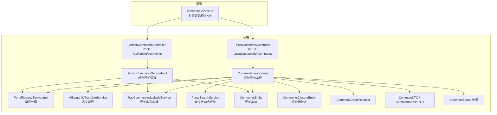
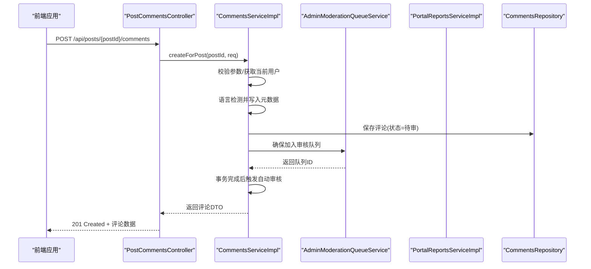
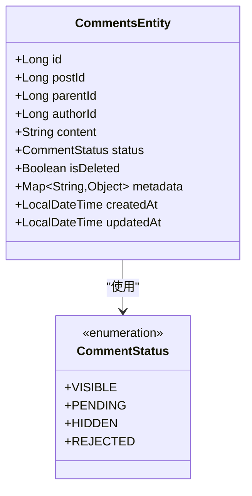
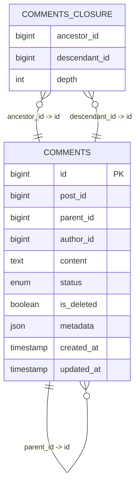
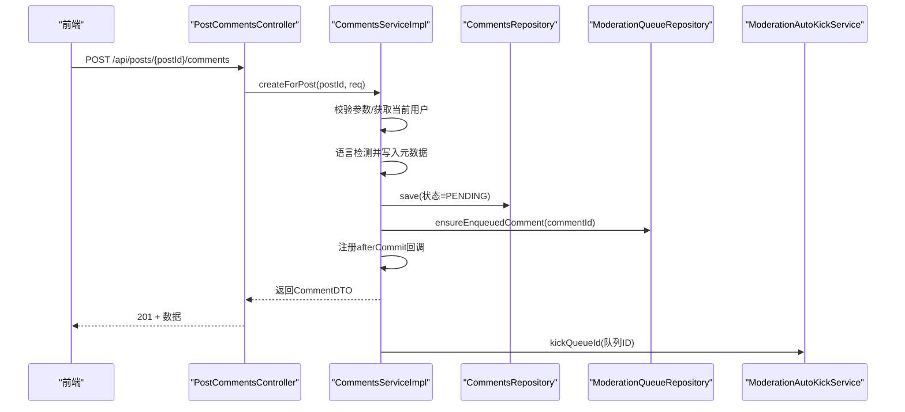
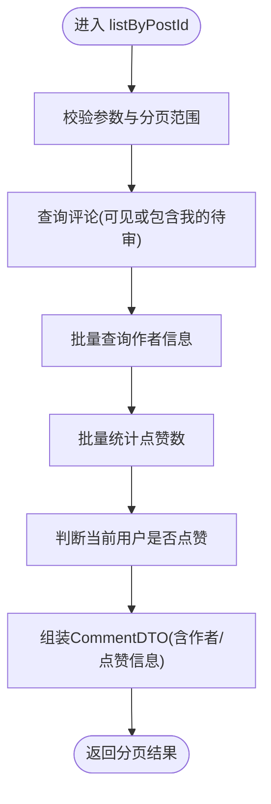
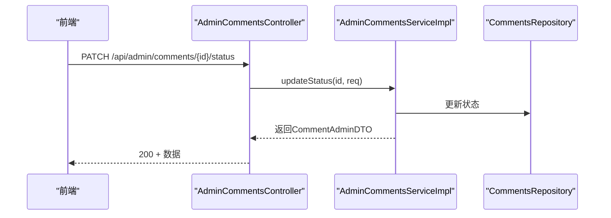
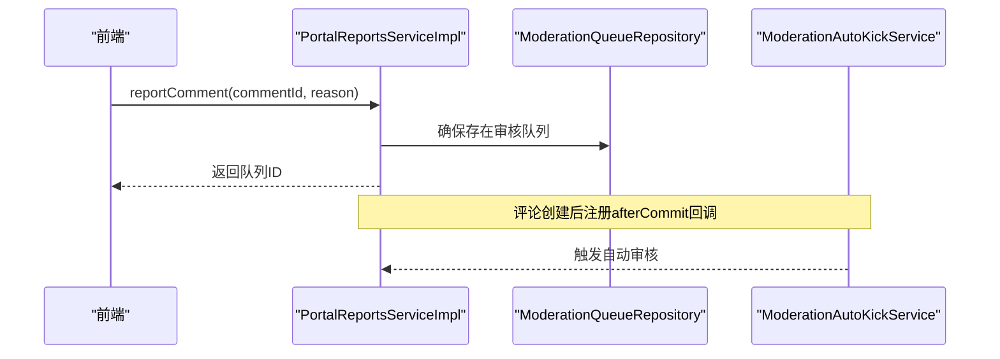
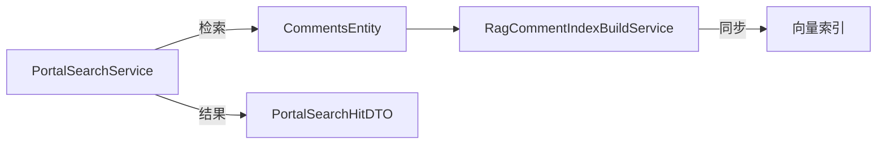
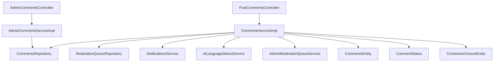

# 评论管理

<cite>
**本文档引用的文件**
- [CommentsEntity.java](file://src/main/java/com/example/EnterpriseRagCommunity/entity/content/CommentsEntity.java)
- [CommentStatus.java](file://src/main/java/com/example/EnterpriseRagCommunity/entity/content/enums/CommentStatus.java)
- [CommentsEntity.java](file://src/main/java/com/example/EnterpriseRagCommunity/entity/content/CommentsEntity.java)
- [CommentsServiceImpl.java](file://src/main/java/com/example/EnterpriseRagCommunity/service/content/impl/CommentsServiceImpl.java)
- [PostCommentsController.java](file://src/main/java/com/example/EnterpriseRagCommunity/controller/content/PostCommentsController.java)
- [AdminCommentsController.java](file://src/main/java/com/example/EnterpriseRagCommunity/controller/content/admin/AdminCommentsController.java)
- [CommentCreateRequest.java](file://src/main/java/com/example/EnterpriseRagCommunity/dto/content/CommentCreateRequest.java)
- [CommentDTO.java](file://src/main/java/com/example/EnterpriseRagCommunity/dto/content/CommentDTO.java)
- [CommentAdminDTO.java](file://src/main/java/com/example/EnterpriseRagCommunity/dto/content/admin/CommentAdminDTO.java)
- [CommentsClosureEntity.java](file://src/main/java/com/example/EnterpriseRagCommunity/entity/content/CommentsClosureEntity.java)
- [CommentsClosureId.java](file://src/main/java/com/example/EnterpriseRagCommunity/entity/content/CommentsClosureId.java)
- [commentService.ts](file://my-vite-app/src/services/commentService.ts)
- [PortalReportsServiceImpl.java](file://src/main/java/com/example/EnterpriseRagCommunity/service/content/impl/PortalReportsServiceImpl.java)
- [AdminCommentsServiceImpl.java](file://src/main/java/com/example/EnterpriseRagCommunity/service/content/admin/impl/AdminCommentsServiceImpl.java)
- [AiSemanticTranslateService.java](file://src/main/java/com/example/EnterpriseRagCommunity/service/ai/AiSemanticTranslateService.java)
- [RagCommentIndexBuildService.java](file://src/main/java/com/example/EnterpriseRagCommunity/service/retrieval/RagCommentIndexBuildService.java)
- [PortalSearchService.java](file://src/main/java/com/example/EnterpriseRagCommunity/service/content/PortalSearchService.java)
</cite>

## 目录
1. [引言](#引言)
2. [项目结构](#项目结构)
3. [核心组件](#核心组件)
4. [架构总览](#架构总览)
5. [详细组件分析](#详细组件分析)
6. [依赖分析](#依赖分析)
7. [性能考虑](#性能考虑)
8. [故障排查指南](#故障排查指南)
9. [结论](#结论)
10. [附录](#附录)

## 引言
本文件面向评论管理系统的功能与技术实现，覆盖评论的创建、回复、编辑、删除、审核、举报与权限控制等核心能力；系统采用树形评论结构支持嵌套回复，结合内容审核与举报流程保障社区内容安全。前端通过服务层封装调用后端 API，后端以控制器-服务-仓储三层结构实现业务逻辑。

## 项目结构
评论管理相关代码主要分布在以下层次：
- 实体层：评论实体及状态枚举
- DTO 层：请求与响应数据传输对象
- 控制器层：对外暴露 REST 接口
- 服务层：评论业务逻辑、审核与举报集成
- 前端服务层：对后端 API 的封装与调用

图表来源
- [PostCommentsController.java:19-30](file://src/main/java/com/example/EnterpriseRagCommunity/controller/content/PostCommentsController.java#L19-L30)
- [AdminCommentsController.java:25-54](file://src/main/java/com/example/EnterpriseRagCommunity/controller/content/admin/AdminCommentsController.java#L25-L54)
- [CommentsServiceImpl.java:129-276](file://src/main/java/com/example/EnterpriseRagCommunity/service/content/impl/CommentsServiceImpl.java#L129-L276)
- [AdminCommentsServiceImpl.java:130-322](file://src/main/java/com/example/EnterpriseRagCommunity/service/content/admin/impl/AdminCommentsServiceImpl.java#L130-L322)
- [PortalReportsServiceImpl.java:109-122](file://src/main/java/com/example/EnterpriseRagCommunity/service/content/impl/PortalReportsServiceImpl.java#L109-L122)
- [AiSemanticTranslateService.java:60-88](file://src/main/java/com/example/EnterpriseRagCommunity/service/ai/AiSemanticTranslateService.java#L60-L88)
- [RagCommentIndexBuildService.java:62-378](file://src/main/java/com/example/EnterpriseRagCommunity/service/retrieval/RagCommentIndexBuildService.java#L62-L378)
- [PortalSearchService.java:41-256](file://src/main/java/com/example/EnterpriseRagCommunity/service/content/PortalSearchService.java#L41-L256)
- [CommentsEntity.java:16-51](file://src/main/java/com/example/EnterpriseRagCommunity/entity/content/CommentsEntity.java#L16-L51)
- [CommentsClosureEntity.java:13-24](file://src/main/java/com/example/EnterpriseRagCommunity/entity/content/CommentsClosureEntity.java#L13-L24)
- [CommentCreateRequest.java:8-14](file://src/main/java/com/example/EnterpriseRagCommunity/dto/content/CommentCreateRequest.java#L8-L14)
- [CommentDTO.java:9-31](file://src/main/java/com/example/EnterpriseRagCommunity/dto/content/CommentDTO.java#L9-L31)
- [CommentAdminDTO.java:8-32](file://src/main/java/com/example/EnterpriseRagCommunity/dto/content/admin/CommentAdminDTO.java#L8-L32)

章节来源
- [PostCommentsController.java:19-30](file://src/main/java/com/example/EnterpriseRagCommunity/controller/content/PostCommentsController.java#L19-L30)
- [AdminCommentsController.java:25-54](file://src/main/java/com/example/EnterpriseRagCommunity/controller/content/admin/AdminCommentsController.java#L25-L54)

## 核心组件
- 评论实体与状态
  - 实体字段：主键、所属帖子、父评论、作者、内容、状态、删除标记、元数据、创建/更新时间
  - 状态枚举：可见、待审、隐藏、拒绝
- 评论服务
  - 列表查询（支持“包含我的待审”）
  - 创建评论（自动语言检测、写入元数据、触发审核队列、异步通知）
  - 统计数量
- 后台管理
  - 列表筛选（按作者、时间、状态、关键词等）
  - 更新状态、设置删除标记
- 举报与审核
  - 举报提交与审核队列联动
  - 审核结果通知作者
- 嵌套回复与树形结构
  - 通过 parent_id 实现父子关系
  - 闭包表用于高效查询祖先/后代关系
- 检索与索引
  - 评论参与全文检索与 RAG 索引构建
- 前端 API 封装
  - 列表、创建、点赞、后台管理（列表、更新状态、设置删除）

章节来源
- [CommentsEntity.java:16-51](file://src/main/java/com/example/EnterpriseRagCommunity/entity/content/CommentsEntity.java#L16-L51)
- [CommentStatus.java:3-8](file://src/main/java/com/example/EnterpriseRagCommunity/entity/content/enums/CommentStatus.java#L3-L8)
- [CommentsServiceImpl.java:129-276](file://src/main/java/com/example/EnterpriseRagCommunity/service/content/impl/CommentsServiceImpl.java#L129-L276)
- [AdminCommentsServiceImpl.java:130-322](file://src/main/java/com/example/EnterpriseRagCommunity/service/content/admin/impl/AdminCommentsServiceImpl.java#L130-L322)
- [PortalReportsServiceImpl.java:109-122](file://src/main/java/com/example/EnterpriseRagCommunity/service/content/impl/PortalReportsServiceImpl.java#L109-L122)
- [CommentsClosureEntity.java:13-24](file://src/main/java/com/example/EnterpriseRagCommunity/entity/content/CommentsClosureEntity.java#L13-L24)
- [PortalSearchService.java:41-256](file://src/main/java/com/example/EnterpriseRagCommunity/service/content/PortalSearchService.java#L41-L256)
- [RagCommentIndexBuildService.java:62-378](file://src/main/java/com/example/EnterpriseRagCommunity/service/retrieval/RagCommentIndexBuildService.java#L62-L378)
- [commentService.ts:129-185](file://my-vite-app/src/services/commentService.ts#L129-L185)

## 架构总览
评论管理采用前后端分离架构，前端通过封装的服务调用后端控制器，后端控制器委托服务层完成业务处理，服务层与仓储、审核、通知、检索等模块协作。

图表来源
- [PostCommentsController.java:27-30](file://src/main/java/com/example/EnterpriseRagCommunity/controller/content/PostCommentsController.java#L27-L30)
- [CommentsServiceImpl.java:187-276](file://src/main/java/com/example/EnterpriseRagCommunity/service/content/impl/CommentsServiceImpl.java#L187-L276)

## 详细组件分析

### 评论实体模型设计
- 字段定义
  - 主键：自增 ID
  - 关联：post_id（所属帖子）、parent_id（父评论，空表示一级评论）
  - 作者：author_id
  - 内容：content（TEXT 类型）
  - 状态：status（枚举）
  - 删除：is_deleted（布尔）
  - 元数据：metadata（JSON）
  - 时间：created_at、updated_at
- 设计要点
  - 使用 Long 类型外键明确映射，避免级联加载导致的复杂性
  - 状态字段集中管理，便于统一控制显示与审核流程
  - 元数据存储动态信息（如语言检测结果），便于扩展

图表来源
- [CommentsEntity.java:16-51](file://src/main/java/com/example/EnterpriseRagCommunity/entity/content/CommentsEntity.java#L16-L51)
- [CommentStatus.java:3-8](file://src/main/java/com/example/EnterpriseRagCommunity/entity/content/enums/CommentStatus.java#L3-L8)

章节来源
- [CommentsEntity.java:16-51](file://src/main/java/com/example/EnterpriseRagCommunity/entity/content/CommentsEntity.java#L16-L51)
- [CommentStatus.java:3-8](file://src/main/java/com/example/EnterpriseRagCommunity/entity/content/enums/CommentStatus.java#L3-L8)

### 评论树形结构与嵌套回复
- 结构实现
  - 通过 parent_id 建立父子关系，空值表示根评论
  - 闭包表 comments_closure 记录祖先-后代关系与深度，支持高效查询任意节点的完整祖先链与子孙树
- 查询策略
  - 列表时可按创建时间倒序返回，前端渲染时根据 parent_id 组织树形
  - 闭包表用于快速统计子树规模、层级遍历与权限校验

图表来源
- [CommentsEntity.java:16-51](file://src/main/java/com/example/EnterpriseRagCommunity/entity/content/CommentsEntity.java#L16-L51)
- [CommentsClosureEntity.java:13-24](file://src/main/java/com/example/EnterpriseRagCommunity/entity/content/CommentsClosureEntity.java#L13-L24)
- [CommentsClosureId.java:10-13](file://src/main/java/com/example/EnterpriseRagCommunity/entity/content/CommentsClosureId.java#L10-L13)

章节来源
- [CommentsClosureEntity.java:13-24](file://src/main/java/com/example/EnterpriseRagCommunity/entity/content/CommentsClosureEntity.java#L13-L24)
- [CommentsClosureId.java:10-13](file://src/main/java/com/example/EnterpriseRagCommunity/entity/content/CommentsClosureId.java#L10-L13)

### 评论创建流程
- 输入校验
  - 必填内容、长度限制
  - 当前用户必须登录
- 业务处理
  - 设置状态为待审
  - 语言检测并写入元数据
  - 保存到数据库
  - 加入审核队列并注册事务完成后自动运行
  - 若为直接回复帖子，向作者发送通知
  - 写入审计日志
- 输出
  - 返回评论 DTO（含作者头像、位置、点赞数、是否点赞等）

图表来源
- [PostCommentsController.java:27-30](file://src/main/java/com/example/EnterpriseRagCommunity/controller/content/PostCommentsController.java#L27-L30)
- [CommentsServiceImpl.java:187-276](file://src/main/java/com/example/EnterpriseRagCommunity/service/content/impl/CommentsServiceImpl.java#L187-L276)

章节来源
- [CommentCreateRequest.java:8-14](file://src/main/java/com/example/EnterpriseRagCommunity/dto/content/CommentCreateRequest.java#L8-L14)
- [CommentsServiceImpl.java:187-276](file://src/main/java/com/example/EnterpriseRagCommunity/service/content/impl/CommentsServiceImpl.java#L187-L276)

### 评论列表与展示
- 查询条件
  - 按帖子 ID 查询
  - 分页与排序（按创建时间倒序）
  - 可选包含“我的待审”评论
- 扩展信息
  - 作者名称、头像、位置
  - 点赞数与“我是否点赞”
- 性能优化
  - 批量查询作者、批量统计点赞数，减少 N+1 查询

图表来源
- [CommentsServiceImpl.java:129-185](file://src/main/java/com/example/EnterpriseRagCommunity/service/content/impl/CommentsServiceImpl.java#L129-L185)

章节来源
- [CommentsServiceImpl.java:129-185](file://src/main/java/com/example/EnterpriseRagCommunity/service/content/impl/CommentsServiceImpl.java#L129-L185)

### 后台管理与审核
- 接口
  - GET /api/admin/comments：分页列表，支持按作者、时间、状态、关键词过滤
  - PATCH /api/admin/comments/{id}/status：更新评论状态
  - PATCH /api/admin/comments/{id}/deleted：设置删除标记
- 权限控制
  - 使用注解要求具备相应权限
- 审核联动
  - 更新状态与删除标记会写入审计日志，便于追踪

图表来源
- [AdminCommentsController.java:42-47](file://src/main/java/com/example/EnterpriseRagCommunity/controller/content/admin/AdminCommentsController.java#L42-L47)
- [AdminCommentsServiceImpl.java:241-276](file://src/main/java/com/example/EnterpriseRagCommunity/service/content/admin/impl/AdminCommentsServiceImpl.java#L241-L276)

章节来源
- [AdminCommentsController.java:25-54](file://src/main/java/com/example/EnterpriseRagCommunity/controller/content/admin/AdminCommentsController.java#L25-L54)
- [AdminCommentsServiceImpl.java:130-322](file://src/main/java/com/example/EnterpriseRagCommunity/service/content/admin/impl/AdminCommentsServiceImpl.java#L130-L322)

### 举报与自动审核
- 举报提交
  - 提交后在审核队列中建立对应条目，必要时复用已有队列
- 自动审核
  - 评论创建后注册事务完成后自动触发审核
- 审核结果通知
  - 审核完成后通知作者（如适用）

图表来源
- [PortalReportsServiceImpl.java:109-122](file://src/main/java/com/example/EnterpriseRagCommunity/service/content/impl/PortalReportsServiceImpl.java#L109-L122)
- [CommentsServiceImpl.java:284-302](file://src/main/java/com/example/EnterpriseRagCommunity/service/content/impl/CommentsServiceImpl.java#L284-L302)

章节来源
- [PortalReportsServiceImpl.java:109-122](file://src/main/java/com/example/EnterpriseRagCommunity/service/content/impl/PortalReportsServiceImpl.java#L109-L122)
- [CommentsServiceImpl.java:284-302](file://src/main/java/com/example/EnterpriseRagCommunity/service/content/impl/CommentsServiceImpl.java#L284-L302)

### 检索与索引
- 全文检索
  - 搜索服务同时检索帖子与评论，生成带高亮片段的结果
- RAG 索引
  - 评论内容参与向量化索引构建，支持检索增强问答

图表来源
- [PortalSearchService.java:41-256](file://src/main/java/com/example/EnterpriseRagCommunity/service/content/PortalSearchService.java#L41-L256)
- [RagCommentIndexBuildService.java:62-378](file://src/main/java/com/example/EnterpriseRagCommunity/service/retrieval/RagCommentIndexBuildService.java#L62-L378)

章节来源
- [PortalSearchService.java:41-256](file://src/main/java/com/example/EnterpriseRagCommunity/service/content/PortalSearchService.java#L41-L256)
- [RagCommentIndexBuildService.java:62-378](file://src/main/java/com/example/EnterpriseRagCommunity/service/retrieval/RagCommentIndexBuildService.java#L62-L378)

### 前端 API 封装
- 列表与创建
  - 支持 includeMinePending 参数
  - 错误消息解析与统一提示
- 后台管理
  - 列表、更新状态、设置删除标记
  - CSRF 令牌注入与 XSRF 头部

章节来源
- [commentService.ts:129-185](file://my-vite-app/src/services/commentService.ts#L129-L185)

## 依赖分析
- 控制器依赖服务层，服务层依赖仓储与外部服务（审核、通知、检索）
- 评论实体与状态枚举被服务层广泛使用
- 闭包表支撑树形查询与权限控制
- 前端服务封装后端接口，统一错误处理与 CSRF

图表来源
- [PostCommentsController.java:19-30](file://src/main/java/com/example/EnterpriseRagCommunity/controller/content/PostCommentsController.java#L19-L30)
- [AdminCommentsController.java:25-54](file://src/main/java/com/example/EnterpriseRagCommunity/controller/content/admin/AdminCommentsController.java#L25-L54)
- [CommentsServiceImpl.java:52-105](file://src/main/java/com/example/EnterpriseRagCommunity/service/content/impl/CommentsServiceImpl.java#L52-L105)
- [AdminCommentsServiceImpl.java:130-239](file://src/main/java/com/example/EnterpriseRagCommunity/service/content/admin/impl/AdminCommentsServiceImpl.java#L130-L239)
- [CommentsEntity.java:16-51](file://src/main/java/com/example/EnterpriseRagCommunity/entity/content/CommentsEntity.java#L16-L51)
- [CommentStatus.java:3-8](file://src/main/java/com/example/EnterpriseRagCommunity/entity/content/enums/CommentStatus.java#L3-L8)
- [CommentsClosureEntity.java:13-24](file://src/main/java/com/example/EnterpriseRagCommunity/entity/content/CommentsClosureEntity.java#L13-L24)

## 性能考虑
- 列表查询
  - 分页大小限制与排序优化，避免超大页码与过大页尺寸
  - 批量查询作者与点赞统计，减少数据库往返
- 语言检测
  - 捕获异常，避免阻塞评论创建
- 事务同步
  - 通过 afterCommit 回调触发审核，保证数据一致性与性能平衡
- 检索与索引
  - 闭包表与向量化索引提升树形查询与相似度检索效率

## 故障排查指南
- 评论创建失败
  - 检查前端是否正确传递 CSRF 头部
  - 查看后端审计日志中的失败详情
  - 确认语言检测服务可用性
- 列表为空或不包含我的待审
  - 确认 includeMinePending 参数与当前登录状态
  - 检查状态过滤条件（仅可见评论）
- 审核未触发
  - 确认评论状态为待审且已加入审核队列
  - 检查事务同步是否激活以及回调是否注册成功
- 举报无效
  - 确认举报原因与目标存在
  - 检查审核队列是否存在并处于正确阶段

章节来源
- [commentService.ts:129-185](file://my-vite-app/src/services/commentService.ts#L129-L185)
- [CommentsServiceImpl.java:284-302](file://src/main/java/com/example/EnterpriseRagCommunity/service/content/impl/CommentsServiceImpl.java#L284-L302)
- [PortalReportsServiceImpl.java:109-122](file://src/main/java/com/example/EnterpriseRagCommunity/service/content/impl/PortalReportsServiceImpl.java#L109-L122)

## 结论
该评论管理系统以清晰的分层架构实现了从创建、树形组织、审核、举报到检索与索引的全链路能力。通过状态机与闭包表确保数据一致性与查询效率，配合前后端协同与完善的权限控制，满足社区内容治理需求。

## 附录

### API 接口规范
- 获取帖子评论列表
  - 方法与路径：GET /api/posts/{postId}/comments
  - 查询参数：
    - page：页码（默认 1）
    - pageSize：每页数量（默认 20，上限 200）
    - includeMinePending：是否包含我的待审评论（默认 false）
  - 成功响应：分页的评论列表（包含作者信息、点赞数、是否点赞）
- 发布评论
  - 方法与路径：POST /api/posts/{postId}/comments
  - 请求体：CommentCreateRequest（content 必填，最大长度 5000；parentId 可选）
  - 成功响应：CommentDTO
- 获取评论数量
  - 方法与路径：GET /api/posts/{postId}/comments/count
  - 成功响应：包含 count 的对象
- 后台管理
  - 列出评论
    - 方法与路径：GET /api/admin/comments
    - 查询参数：page、pageSize、postId、authorId、authorName、createdFrom、createdTo、status、isDeleted、keyword
    - 成功响应：分页的 CommentAdminDTO 列表
  - 更新评论状态
    - 方法与路径：PATCH /api/admin/comments/{id}/status
    - 请求体：CommentUpdateStatusRequest（status）
    - 成功响应：CommentAdminDTO
  - 设置删除标记
    - 方法与路径：PATCH /api/admin/comments/{id}/deleted
    - 请求体：CommentSetDeletedRequest（isDeleted）
    - 成功响应：CommentAdminDTO

章节来源
- [PostCommentsController.java:19-51](file://src/main/java/com/example/EnterpriseRagCommunity/controller/content/PostCommentsController.java#L19-L51)
- [AdminCommentsController.java:25-54](file://src/main/java/com/example/EnterpriseRagCommunity/controller/content/admin/AdminCommentsController.java#L25-L54)
- [CommentCreateRequest.java:8-14](file://src/main/java/com/example/EnterpriseRagCommunity/dto/content/CommentCreateRequest.java#L8-L14)
- [CommentDTO.java:9-31](file://src/main/java/com/example/EnterpriseRagCommunity/dto/content/CommentDTO.java#L9-L31)
- [CommentAdminDTO.java:8-32](file://src/main/java/com/example/EnterpriseRagCommunity/dto/content/admin/CommentAdminDTO.java#L8-L32)