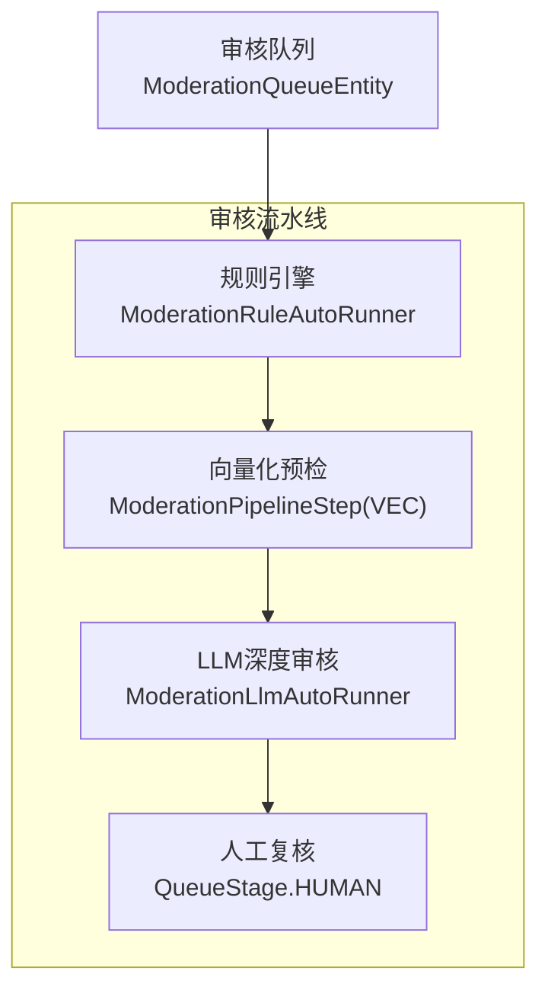
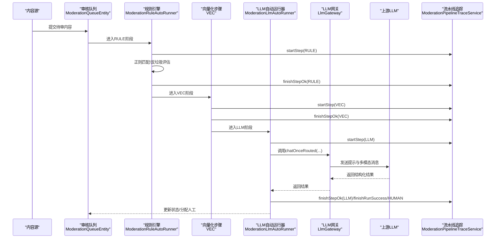
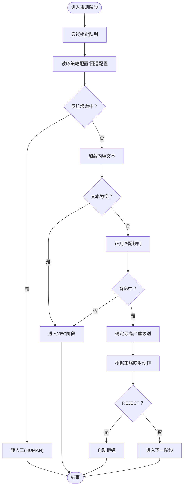
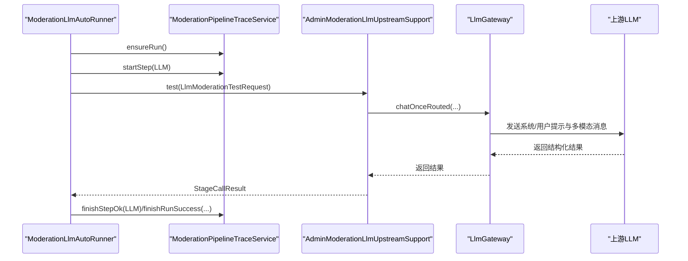
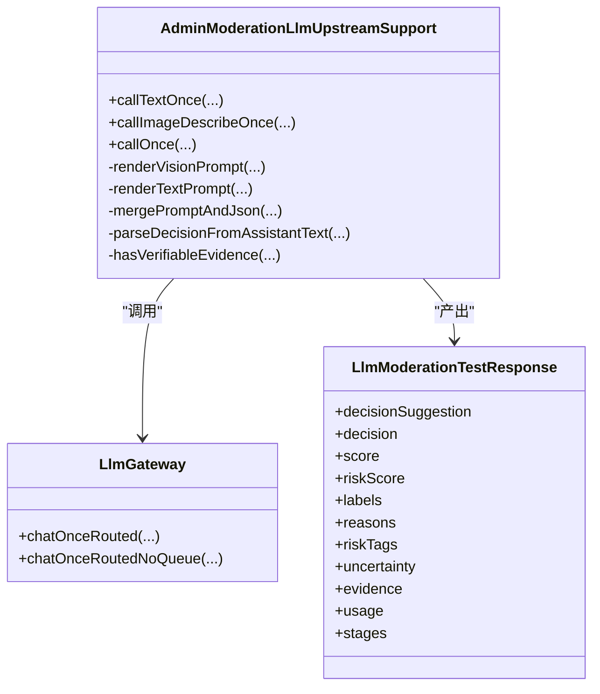
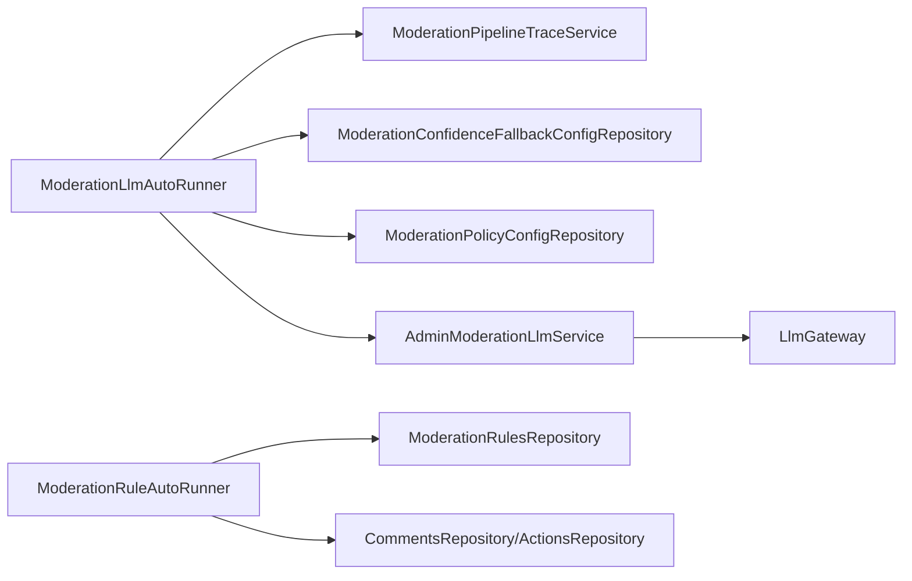

# LLM审核

<cite>
**本文引用的文件**
- [ModerationLlmAutoRunner.java](file://src/main/java/com/example/EnterpriseRagCommunity/service/moderation/jobs/ModerationLlmAutoRunner.java)
- [ModerationRuleAutoRunner.java](file://src/main/java/com/example/EnterpriseRagCommunity/service/moderation/jobs/ModerationRuleAutoRunner.java)
- [AdminModerationLlmUpstreamSupport.java](file://src/main/java/com/example/EnterpriseRagCommunity/service/moderation/admin/AdminModerationLlmUpstreamSupport.java)
- [LlmGateway.java](file://src/main/java/com/example/EnterpriseRagCommunity/service/ai/LlmGateway.java)
- [LlmModerationTestRequest.java](file://src/main/java/com/example/EnterpriseRagCommunity/dto/moderation/LlmModerationTestRequest.java)
- [LlmModerationTestResponse.java](file://src/main/java/com/example/EnterpriseRagCommunity/dto/moderation/LlmModerationTestResponse.java)
- [ModerationQueueEntity.java](file://src/main/java/com/example/EnterpriseRagCommunity/entity/moderation/ModerationQueueEntity.java)
- [ModerationPolicyConfigEntity.java](file://src/main/java/com/example/EnterpriseRagCommunity/entity/moderation/ModerationPolicyConfigEntity.java)
- [ModerationConfidenceFallbackConfigEntity.java](file://src/main/java/com/example/EnterpriseRagCommunity/entity/moderation/ModerationConfidenceFallbackConfigEntity.java)
- [ModerationPipelineTraceService.java](file://src/main/java/com/example/EnterpriseRagCommunity/service/moderation/trace/ModerationPipelineTraceService.java)
- [V1__table_design.sql](file://src/main/resources/db/migration/V1__table_design.sql)
- [evidence-context-display.ts](file://my-vite-app/src/utils/evidence-context-display.ts)
- [EvidenceListView.tsx](file://my-vite-app/src/components/admin/EvidenceListView.tsx)
- [EvidenceContextCell.tsx](file://my-vite-app/src/components/admin/EvidenceContextCell.tsx)
- [LlmRoutingConfigPanel.tsx](file://my-vite-app/src/pages/admin/forms/metrics/llm-routing-config.tsx)
</cite>

## 目录
1. [引言](#引言)
2. [项目结构](#项目结构)
3. [核心组件](#核心组件)
4. [架构总览](#架构总览)
5. [详细组件分析](#详细组件分析)
6. [依赖关系分析](#依赖关系分析)
7. [性能考量](#性能考量)
8. [故障排查指南](#故障排查指南)
9. [结论](#结论)
10. [附录](#附录)

## 引言
本技术文档围绕企业级RAG社区中的LLM审核能力进行系统化梳理，覆盖提示工程、上下文构建、多模态输入处理、配置管理、准确性评估与置信度计算、误判率控制、API接口规范以及与传统规则引擎的协同机制与人工审核介入时机。文档以代码为依据，结合前端证据展示工具链，帮助开发者与运维人员快速理解并高效使用该审核体系。

## 项目结构
审核系统由“规则引擎前置 + 向量化预检 + LLM深度审核 + 人工复核”四阶段流水线构成，并通过统一的流水线追踪服务记录每一步决策与耗时，最终形成可审计的审核轨迹。

图表来源
- [ModerationRuleAutoRunner.java:61-91](file://src/main/java/com/example/EnterpriseRagCommunity/service/moderation/jobs/ModerationRuleAutoRunner.java#L61-L91)
- [ModerationLlmAutoRunner.java:107-153](file://src/main/java/com/example/EnterpriseRagCommunity/service/moderation/jobs/ModerationLlmAutoRunner.java#L107-L153)
- [ModerationQueueEntity.java:17-46](file://src/main/java/com/example/EnterpriseRagCommunity/entity/moderation/ModerationQueueEntity.java#L17-L46)

章节来源
- [ModerationRuleAutoRunner.java:61-91](file://src/main/java/com/example/EnterpriseRagCommunity/service/moderation/jobs/ModerationRuleAutoRunner.java#L61-L91)
- [ModerationLlmAutoRunner.java:107-153](file://src/main/java/com/example/EnterpriseRagCommunity/service/moderation/jobs/ModerationLlmAutoRunner.java#L107-L153)
- [ModerationQueueEntity.java:17-46](file://src/main/java/com/example/EnterpriseRagCommunity/entity/moderation/ModerationQueueEntity.java#L17-L46)

## 核心组件
- 规则引擎自动运行器：负责正则规则匹配、反垃圾策略与下一阶段动作决策。
- LLM自动运行器：负责多模态输入准备、调用上游LLM、策略评估、置信度与风险标签应用、最终决策。
- 上游LLM支持：封装提示渲染、多模态消息构造、批量图像处理、证据校验与降级策略。
- LLM网关：统一路由、重试、队列与遥测，保障调用稳定性与可观测性。
- 流水线追踪：记录每步开始/结束、决策、评分、证据与耗时，支撑审计与回溯。
- 配置与策略：政策配置、置信度回退阈值、风险标签阈值缓存与动态更新。
- 前端证据展示：证据上下文扩展、句子锚点裁剪、令牌限制与可视化呈现。

章节来源
- [ModerationRuleAutoRunner.java:107-437](file://src/main/java/com/example/EnterpriseRagCommunity/service/moderation/jobs/ModerationRuleAutoRunner.java#L107-L437)
- [ModerationLlmAutoRunner.java:171-754](file://src/main/java/com/example/EnterpriseRagCommunity/service/moderation/jobs/ModerationLlmAutoRunner.java#L171-L754)
- [AdminModerationLlmUpstreamSupport.java:67-556](file://src/main/java/com/example/EnterpriseRagCommunity/service/moderation/admin/AdminModerationLlmUpstreamSupport.java#L67-L556)
- [LlmGateway.java:108-329](file://src/main/java/com/example/EnterpriseRagCommunity/service/ai/LlmGateway.java#L108-L329)
- [ModerationPipelineTraceService.java:30-210](file://src/main/java/com/example/EnterpriseRagCommunity/service/moderation/trace/ModerationPipelineTraceService.java#L30-L210)

## 架构总览
整体架构采用“规则优先、LLM兜底”的双层防线：规则引擎快速过滤低风险内容，向量化预检辅助识别相似内容，LLM对复杂与灰色地带进行综合判断，必要时转入人工复核。

图表来源
- [ModerationRuleAutoRunner.java:139-437](file://src/main/java/com/example/EnterpriseRagCommunity/service/moderation/jobs/ModerationRuleAutoRunner.java#L139-L437)
- [ModerationLlmAutoRunner.java:444-754](file://src/main/java/com/example/EnterpriseRagCommunity/service/moderation/jobs/ModerationLlmAutoRunner.java#L444-L754)
- [LlmGateway.java:108-329](file://src/main/java/com/example/EnterpriseRagCommunity/service/ai/LlmGateway.java#L108-L329)
- [ModerationPipelineTraceService.java:58-163](file://src/main/java/com/example/EnterpriseRagCommunity/service/moderation/trace/ModerationPipelineTraceService.java#L58-L163)

## 详细组件分析

### 组件A：规则引擎自动运行器（ModerationRuleAutoRunner）
- 功能要点
  - 锁定与并发控制：仅在PENDING状态下尝试锁定，避免重复执行。
  - 政策读取：从策略配置或回退配置中读取规则开关与动作映射。
  - 反垃圾策略：按内容类型（评论/资料页）计算窗口期内触发阈值，命中直接转人工。
  - 正则匹配：遍历启用规则，记录命中详情与最高严重级别，按策略决定REJECT/LLM/VEC/HUMAN。
  - 结果落盘：持久化规则命中记录，更新队列阶段与状态，写入审计日志与流水线步骤。

图表来源
- [ModerationRuleAutoRunner.java:107-437](file://src/main/java/com/example/EnterpriseRagCommunity/service/moderation/jobs/ModerationRuleAutoRunner.java#L107-L437)

章节来源
- [ModerationRuleAutoRunner.java:107-437](file://src/main/java/com/example/EnterpriseRagCommunity/service/moderation/jobs/ModerationRuleAutoRunner.java#L107-L437)

### 组件B：LLM自动运行器（ModerationLlmAutoRunner）
- 功能要点
  - 自动调度：定时扫描LLM/HUMAN阶段的PENDING/REVIEWING队列，按优先级与创建时间排序。
  - 文件就绪检查：附件存在时检测硬拒绝条件、等待文件提取超时、超时转入人工。
  - LLM禁用场景：若LLM关闭且规则+向量化均为低风险，则自动放行；否则转入人工。
  - 输入模式判定：分片文本、多模态（含图片）、纯文本三种模式。
  - 多阶段调用：TEXT/VISION/JUDGE/UPGRADE，分别记录步骤与耗时。
  - 策略评估：基于策略配置与回退阈值，结合置信度与不确定性，生成最终VERDICT（APPROVE/REJECT/REVIEW）。
  - 风险标签：根据策略阈值与结果打上风险标签，写入审计日志与流水线详情。

图表来源
- [ModerationLlmAutoRunner.java:171-754](file://src/main/java/com/example/EnterpriseRagCommunity/service/moderation/jobs/ModerationLlmAutoRunner.java#L171-L754)
- [AdminModerationLlmUpstreamSupport.java:400-556](file://src/main/java/com/example/EnterpriseRagCommunity/service/moderation/admin/AdminModerationLlmUpstreamSupport.java#L400-L556)
- [LlmGateway.java:108-329](file://src/main/java/com/example/EnterpriseRagCommunity/service/ai/LlmGateway.java#L108-L329)
- [ModerationPipelineTraceService.java:58-163](file://src/main/java/com/example/EnterpriseRagCommunity/service/moderation/trace/ModerationPipelineTraceService.java#L58-L163)

章节来源
- [ModerationLlmAutoRunner.java:171-754](file://src/main/java/com/example/EnterpriseRagCommunity/service/moderation/jobs/ModerationLlmAutoRunner.java#L171-L754)
- [AdminModerationLlmUpstreamSupport.java:400-556](file://src/main/java/com/example/EnterpriseRagCommunity/service/moderation/admin/AdminModerationLlmUpstreamSupport.java#L400-L556)
- [LlmGateway.java:108-329](file://src/main/java/com/example/EnterpriseRagCommunity/service/ai/LlmGateway.java#L108-L329)
- [ModerationPipelineTraceService.java:58-163](file://src/main/java/com/example/EnterpriseRagCommunity/service/moderation/trace/ModerationPipelineTraceService.java#L58-L163)

### 组件C：LLM上游支持与提示工程（AdminModerationLlmUpstreamSupport）
- 功能要点
  - 文本与视觉提示渲染：支持模板变量替换、JSON合并、证据抽取与增强。
  - 图像批处理：按预算与数量限制切分批次，估算视觉令牌，支持高分辨率与OSS资源解析头。
  - 决策解析：从模型输出中抽取结构化字段（决策建议、风险分数、标签、原因、证据、不确定性、严重程度），并进行证据可验证性校验与降级（如REJECT但证据缺失则降级为ESCALATE）。
  - 统计聚合：多批次结果取最大风险分数、合并标签与证据，汇总描述与用量。

图表来源
- [AdminModerationLlmUpstreamSupport.java:23-556](file://src/main/java/com/example/EnterpriseRagCommunity/service/moderation/admin/AdminModerationLlmUpstreamSupport.java#L23-L556)
- [LlmGateway.java:108-329](file://src/main/java/com/example/EnterpriseRagCommunity/service/ai/LlmGateway.java#L108-L329)
- [LlmModerationTestResponse.java:8-94](file://src/main/java/com/example/EnterpriseRagCommunity/dto/moderation/LlmModerationTestResponse.java#L8-L94)

章节来源
- [AdminModerationLlmUpstreamSupport.java:67-556](file://src/main/java/com/example/EnterpriseRagCommunity/service/moderation/admin/AdminModerationLlmUpstreamSupport.java#L67-L556)
- [LlmGateway.java:108-329](file://src/main/java/com/example/EnterpriseRagCommunity/service/ai/LlmGateway.java#L108-L329)
- [LlmModerationTestResponse.java:8-94](file://src/main/java/com/example/EnterpriseRagCommunity/dto/moderation/LlmModerationTestResponse.java#L8-L94)

### 组件D：配置与策略（Policy/Fallback/阈值）
- 政策配置（ModerationPolicyConfigEntity）
  - 按内容类型存储JSON策略，包含预检规则动作、向量化阈值、阈值分档（默认/上报/申诉）、举报触发条件、反垃圾参数等。
- 回退配置（ModerationConfidenceFallbackConfigEntity）
  - 规则/向量化/LLM各阶段的开关与阈值，以及分片LLM阈值、举报阈值、分片字符阈值等。
- 风险标签阈值缓存
  - LLM自动运行器维护风险标签阈值缓存，定期刷新，用于最终打标。

章节来源
- [ModerationPolicyConfigEntity.java:21-47](file://src/main/java/com/example/EnterpriseRagCommunity/entity/moderation/ModerationPolicyConfigEntity.java#L21-L47)
- [ModerationConfidenceFallbackConfigEntity.java:15-110](file://src/main/java/com/example/EnterpriseRagCommunity/entity/moderation/ModerationConfidenceFallbackConfigEntity.java#L15-L110)
- [V1__table_design.sql:814-844](file://src/main/resources/db/migration/V1__table_design.sql#L814-L844)
- [ModerationLlmAutoRunner.java:102-104](file://src/main/java/com/example/EnterpriseRagCommunity/service/moderation/jobs/ModerationLlmAutoRunner.java#L102-L104)

### 组件E：前端证据展示与上下文扩展
- 工具函数
  - 将命中锚点前后文本扩展为完整句子，按令牌数截断，保留上下文连贯性。
- 列表与单元格组件
  - 展示证据列表、证据上下文单元格，支持分片预览、令牌限制与描述渲染。
- 与后端交互
  - 通过分片内容预览接口获取原始文本，结合前端上下文扩展逻辑，提升审核员定位证据效率。

章节来源
- [evidence-context-display.ts:140-161](file://my-vite-app/src/utils/evidence-context-display.ts#L140-L161)
- [EvidenceListView.tsx:1-47](file://my-vite-app/src/components/admin/EvidenceListView.tsx#L1-L47)
- [EvidenceContextCell.tsx:1-34](file://my-vite-app/src/components/admin/EvidenceContextCell.tsx#L1-L34)

## 依赖关系分析
- 组件耦合
  - ModerationLlmAutoRunner依赖ModerationPipelineTraceService进行步骤与运行期记录，依赖ModerationConfidenceFallbackConfigRepository与ModerationPolicyConfigRepository读取策略与阈值，依赖AdminModerationLlmService与LlmGateway发起LLM调用。
  - AdminModerationLlmUpstreamSupport依赖LlmGateway与图像支持模块，负责提示渲染与多模态消息拼装。
  - ModerationRuleAutoRunner依赖规则仓库与反垃圾统计，决定下一阶段。
- 外部依赖
  - LlmGateway承担路由、重试、队列与遥测，确保上游调用稳定与可观测。
  - 数据库迁移脚本定义了策略配置与初始策略样例，保证系统初始化一致性。

图表来源
- [ModerationLlmAutoRunner.java:80-100](file://src/main/java/com/example/EnterpriseRagCommunity/service/moderation/jobs/ModerationLlmAutoRunner.java#L80-L100)
- [ModerationRuleAutoRunner.java:47-54](file://src/main/java/com/example/EnterpriseRagCommunity/service/moderation/jobs/ModerationRuleAutoRunner.java#L47-L54)
- [LlmGateway.java:30-36](file://src/main/java/com/example/EnterpriseRagCommunity/service/ai/LlmGateway.java#L30-L36)

章节来源
- [ModerationLlmAutoRunner.java:80-100](file://src/main/java/com/example/EnterpriseRagCommunity/service/moderation/jobs/ModerationLlmAutoRunner.java#L80-L100)
- [ModerationRuleAutoRunner.java:47-54](file://src/main/java/com/example/EnterpriseRagCommunity/service/moderation/jobs/ModerationRuleAutoRunner.java#L47-L54)
- [LlmGateway.java:30-36](file://src/main/java/com/example/EnterpriseRagCommunity/service/ai/LlmGateway.java#L30-L36)

## 性能考量
- 批量与节流
  - 图像批处理按预算与数量限制切分，避免单次请求过大导致超时或费用过高。
  - LLM调用通过队列与路由策略进行限速与重试，降低上游抖动影响。
- 分片与令牌
  - 文本分片与令牌限制结合，确保提示长度与成本可控。
- 成本控制
  - 通过策略阈值与回退配置控制LLM调用频率与深度，减少不必要的升级阶段调用。
- 可观测性
  - 每步流水线记录耗时、用量与错误码，便于定位瓶颈与优化。

## 故障排查指南
- LLM调用失败
  - 现象：上游异常、输出被拦截、解析失败。
  - 排查：查看流水线步骤错误码与消息，确认路由目标可用性与凭据配置；检查提示模板与输入是否合规。
- 证据缺失或不可验证
  - 现象：REJECT决策因证据缺失降级为ESCALATE。
  - 排查：确认用户输入中包含可验证证据（文本锚点/JSON片段/图片占位符），必要时增强提示引导模型输出可验证证据。
- 文件提取超时
  - 现象：附件存在但等待提取超时，转入人工。
  - 排查：检查文件资产提取任务状态与超时阈值配置，适当延长等待时间或优化提取流程。
- 规则命中误判
  - 现象：正则误伤或阈值设置不当。
  - 排查：调整规则模式、严重级别与动作映射，或临时提高阈值，同时增加人工复核比例。

章节来源
- [ModerationLlmAutoRunner.java:526-550](file://src/main/java/com/example/EnterpriseRagCommunity/service/moderation/jobs/ModerationLlmAutoRunner.java#L526-L550)
- [AdminModerationLlmUpstreamSupport.java:436-461](file://src/main/java/com/example/EnterpriseRagCommunity/service/moderation/admin/AdminModerationLlmUpstreamSupport.java#L436-L461)
- [ModerationPipelineTraceService.java:112-133](file://src/main/java/com/example/EnterpriseRagCommunity/service/moderation/trace/ModerationPipelineTraceService.java#L112-L133)

## 结论
该LLM审核体系通过“规则优先、LLM兜底、人工复核”的三层防护，结合完善的策略配置、阈值管理与证据展示工具，实现了高吞吐、可审计、可调优的多模态内容治理能力。建议持续优化提示模板与阈值，完善证据引导与可验证性校验，以进一步降低误判率并提升整体效率。

## 附录

### 审核API接口规范（请求/响应/错误）
- 请求体
  - 字段：queueId、reviewStage、text、images、configOverride、useQueue
  - images：fileAssetId/url/mimeType
  - configOverride：promptTemplate/visionPromptTemplate/judgePromptTemplate/systemPrompt/visionSystemPrompt/autoRun
- 响应体
  - 字段：decisionSuggestion、decision、riskScore、score、reasons、labels、riskTags、severity、uncertainty、evidence、rawModelOutput、model、latencyMs、usage、promptMessages、images、imageResults、inputMode、stages
  - stages：text/image/judge/upgrade，每个阶段包含对应字段
- 错误处理
  - 上游调用失败：返回错误码与消息，流水线记录失败步骤并结束为HUMAN
  - 解析失败：标记解析错误标签，降级为ESCALATE或HUMAN

章节来源
- [LlmModerationTestRequest.java:8-32](file://src/main/java/com/example/EnterpriseRagCommunity/dto/moderation/LlmModerationTestRequest.java#L8-L32)
- [LlmModerationTestResponse.java:8-94](file://src/main/java/com/example/EnterpriseRagCommunity/dto/moderation/LlmModerationTestResponse.java#L8-L94)
- [ModerationPipelineTraceService.java:112-133](file://src/main/java/com/example/EnterpriseRagCommunity/service/moderation/trace/ModerationPipelineTraceService.java#L112-L133)

### 提示工程与上下文构建策略
- 文本提示
  - 模板变量：{{text}}/{{title}}/{{content}}，支持JSON合并与裁剪。
- 视觉提示
  - 图像批处理与令牌预算控制，支持高分辨率与OSS资源解析头。
- 证据校验
  - 对REJECT决策要求可验证证据，缺失或不可验证时降级为ESCALATE。
- 上下文扩展
  - 前端按句子锚点扩展证据上下文，按令牌数截断，提升证据定位效率。

章节来源
- [AdminModerationLlmUpstreamSupport.java:300-388](file://src/main/java/com/example/EnterpriseRagCommunity/service/moderation/admin/AdminModerationLlmUpstreamSupport.java#L300-L388)
- [evidence-context-display.ts:140-161](file://my-vite-app/src/utils/evidence-context-display.ts#L140-L161)

### LLM审核配置管理（模型选择、参数调优、成本控制）
- 模型选择与路由
  - 通过LLM路由配置页面管理提供商与模型列表，支持拖拽排序与健康度监控。
- 参数调优
  - 温度、topP、maxTokens、enableThinking等参数可通过配置覆盖。
- 成本控制
  - 通过阈值与回退策略减少LLM调用次数，优先使用规则与向量化预检。

章节来源
- [LlmRoutingConfigPanel.tsx:599-1732](file://my-vite-app/src/pages/admin/forms/metrics/llm-routing-config.tsx#L599-L1732)
- [LlmGateway.java:108-329](file://src/main/java/com/example/EnterpriseRagCommunity/service/ai/LlmGateway.java#L108-L329)

### 准确性评估、置信度计算与误判率控制
- 置信度与不确定性
  - 使用score与uncertainty作为置信度指标，结合灰区与不确定阈值触发升级判断。
- 风险标签
  - 根据策略阈值缓存与最终结果打上风险标签，支持后续统计与优化。
- 误判率控制
  - 证据可验证性校验、升级阶段、人工复核介入与策略阈值动态调整共同作用。

章节来源
- [ModerationLlmAutoRunner.java:594-643](file://src/main/java/com/example/EnterpriseRagCommunity/service/moderation/jobs/ModerationLlmAutoRunner.java#L594-L643)
- [AdminModerationLlmUpstreamSupport.java:686-709](file://src/main/java/com/example/EnterpriseRagCommunity/service/moderation/admin/AdminModerationLlmUpstreamSupport.java#L686-L709)

### 与传统规则引擎的协同与人工审核介入
- 协同机制
  - 规则引擎先行过滤，反垃圾策略直接转人工，正则命中按严重级别映射到下一阶段。
- 人工审核介入时机
  - LLM调用失败、证据缺失或不可验证、文件提取超时、策略明确要求人工、升级阶段仍处于灰色区域。

章节来源
- [ModerationRuleAutoRunner.java:216-260](file://src/main/java/com/example/EnterpriseRagCommunity/service/moderation/jobs/ModerationRuleAutoRunner.java#L216-L260)
- [ModerationLlmAutoRunner.java:318-364](file://src/main/java/com/example/EnterpriseRagCommunity/service/moderation/jobs/ModerationLlmAutoRunner.java#L318-L364)