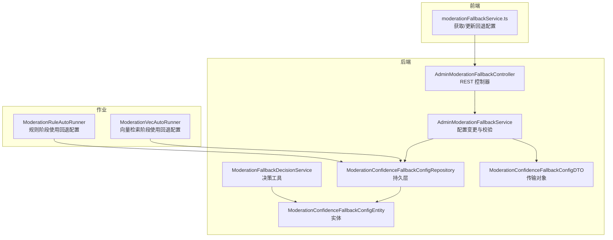
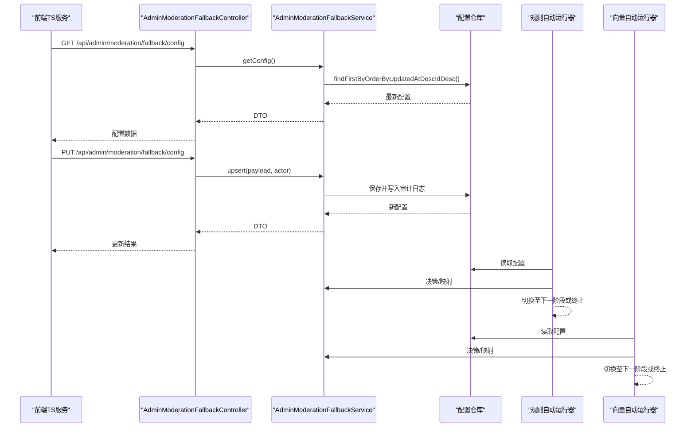
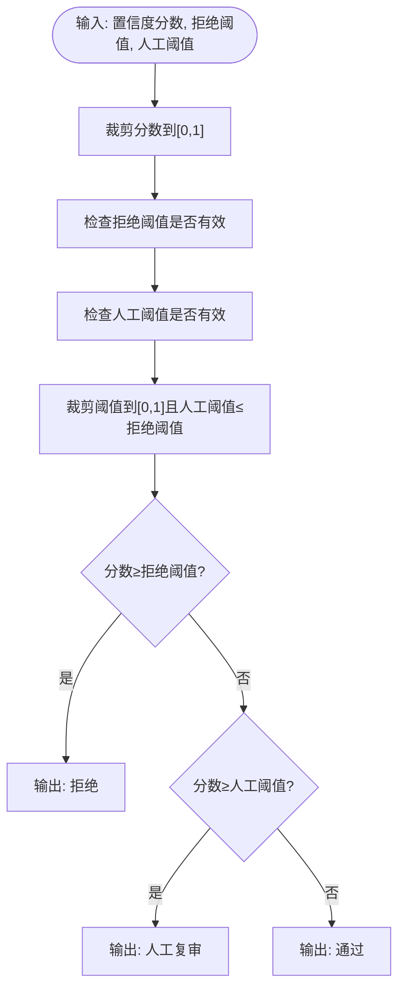
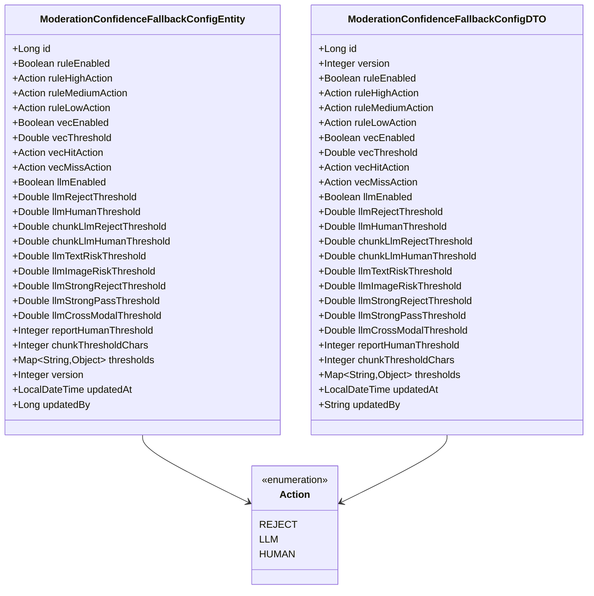
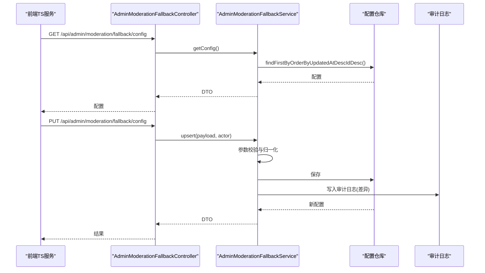
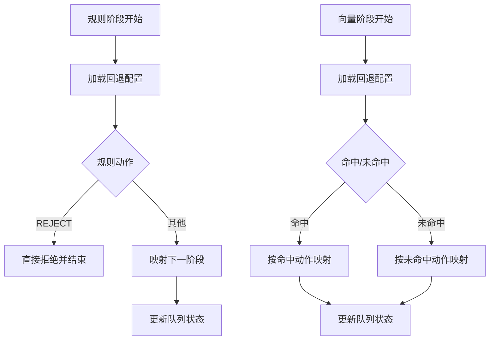
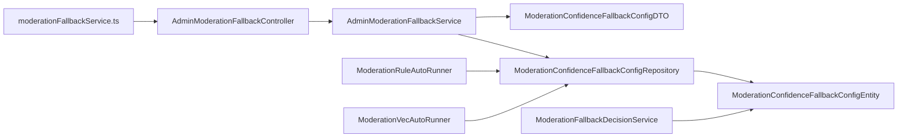

# 回退机制

<cite>
**本文引用的文件**
- [ModerationFallbackDecisionService.java](file://src/main/java/com/example/EnterpriseRagCommunity/service/moderation/ModerationFallbackDecisionService.java)
- [AdminModerationFallbackController.java](file://src/main/java/com/example/EnterpriseRagCommunity/controller/moderation/admin/AdminModerationFallbackController.java)
- [AdminModerationFallbackService.java](file://src/main/java/com/example/EnterpriseRagCommunity/service/moderation/admin/AdminModerationFallbackService.java)
- [ModerationConfidenceFallbackConfigDTO.java](file://src/main/java/com/example/EnterpriseRagCommunity/dto/moderation/ModerationConfidenceFallbackConfigDTO.java)
- [ModerationConfidenceFallbackConfigEntity.java](file://src/main/java/com/example/EnterpriseRagCommunity/entity/moderation/ModerationConfidenceFallbackConfigEntity.java)
- [ModerationConfidenceFallbackConfigRepository.java](file://src/main/java/com/example/EnterpriseRagCommunity/repository/moderation/ModerationConfidenceFallbackConfigRepository.java)
- [moderationFallbackService.ts](file://my-vite-app/src/services/moderationFallbackService.ts)
- [ModerationFallbackDecisionServiceTest.java](file://src/test/java/com/example/EnterpriseRagCommunity/service/moderation/ModerationFallbackDecisionServiceTest.java)
- [ModerationRuleAutoRunner.java](file://src/main/java/com/example/EnterpriseRagCommunity/service/moderation/jobs/ModerationRuleAutoRunner.java)
- [ModerationVecAutoRunner.java](file://src/main/java/com/example/EnterpriseRagCommunity/service/moderation/jobs/ModerationVecAutoRunner.java)
- [AdminModerationFallbackServiceCoverage100Test.java](file://src/test/java/com/example/EnterpriseRagCommunity/service/moderation/admin/AdminModerationFallbackServiceCoverage100Test.java)
- [AuditLogWriter.java](file://src/main/java/com/example/EnterpriseRagCommunity/service/access/AuditLogWriter.java)
</cite>

## 目录
1. [引言](#引言)
2. [项目结构](#项目结构)
3. [核心组件](#核心组件)
4. [架构总览](#架构总览)
5. [详细组件分析](#详细组件分析)
6. [依赖分析](#依赖分析)
7. [性能考虑](#性能考虑)
8. [故障排查指南](#故障排查指南)
9. [结论](#结论)
10. [附录](#附录)

## 引言
本文件围绕审核系统的“回退机制”进行系统化技术文档编制，重点覆盖以下方面：
- 容错设计：在上游服务失败、网络异常、模型不可用等场景下的处理策略
- 回退决策算法：置信度阈值、时间窗口、历史成功率等综合考量
- 配置管理：阈值设置、冷却时间、降级策略等参数调节
- 切换逻辑：回退机制与主审核流程的切换，保障系统稳定性与用户体验
- 监控与告警：回退触发频率、成功率变化、影响范围等关键指标

## 项目结构
回退机制涉及后端 Java 服务层、数据模型与 DTO、前端 TS 服务，以及自动化作业对回退配置的使用。整体结构如下：

图表来源
- [AdminModerationFallbackController.java:1-35](file://src/main/java/com/example/EnterpriseRagCommunity/controller/moderation/admin/AdminModerationFallbackController.java#L1-L35)
- [AdminModerationFallbackService.java:1-319](file://src/main/java/com/example/EnterpriseRagCommunity/service/moderation/admin/AdminModerationFallbackService.java#L1-L319)
- [ModerationConfidenceFallbackConfigRepository.java:1-13](file://src/main/java/com/example/EnterpriseRagCommunity/repository/moderation/ModerationConfidenceFallbackConfigRepository.java#L1-L13)
- [ModerationConfidenceFallbackConfigEntity.java:1-110](file://src/main/java/com/example/EnterpriseRagCommunity/entity/moderation/ModerationConfidenceFallbackConfigEntity.java#L1-L110)
- [ModerationConfidenceFallbackConfigDTO.java:1-50](file://src/main/java/com/example/EnterpriseRagCommunity/dto/moderation/ModerationConfidenceFallbackConfigDTO.java#L1-L50)
- [ModerationFallbackDecisionService.java:1-80](file://src/main/java/com/example/EnterpriseRagCommunity/service/moderation/ModerationFallbackDecisionService.java#L1-L80)
- [ModerationRuleAutoRunner.java:132-403](file://src/main/java/com/example/EnterpriseRagCommunity/service/moderation/jobs/ModerationRuleAutoRunner.java#L132-L403)
- [ModerationVecAutoRunner.java:108-140](file://src/main/java/com/example/EnterpriseRagCommunity/service/moderation/jobs/ModerationVecAutoRunner.java#L108-L140)

章节来源
- [AdminModerationFallbackController.java:1-35](file://src/main/java/com/example/EnterpriseRagCommunity/controller/moderation/admin/AdminModerationFallbackController.java#L1-L35)
- [AdminModerationFallbackService.java:1-319](file://src/main/java/com/example/EnterpriseRagCommunity/service/moderation/admin/AdminModerationFallbackService.java#L1-L319)
- [ModerationConfidenceFallbackConfigRepository.java:1-13](file://src/main/java/com/example/EnterpriseRagCommunity/repository/moderation/ModerationConfidenceFallbackConfigRepository.java#L1-L13)
- [ModerationConfidenceFallbackConfigEntity.java:1-110](file://src/main/java/com/example/EnterpriseRagCommunity/entity/moderation/ModerationConfidenceFallbackConfigEntity.java#L1-L110)
- [ModerationConfidenceFallbackConfigDTO.java:1-50](file://src/main/java/com/example/EnterpriseRagCommunity/dto/moderation/ModerationConfidenceFallbackConfigDTO.java#L1-L50)
- [ModerationFallbackDecisionService.java:1-80](file://src/main/java/com/example/EnterpriseRagCommunity/service/moderation/ModerationFallbackDecisionService.java#L1-L80)
- [ModerationRuleAutoRunner.java:132-403](file://src/main/java/com/example/EnterpriseRagCommunity/service/moderation/jobs/ModerationRuleAutoRunner.java#L132-L403)
- [ModerationVecAutoRunner.java:108-140](file://src/main/java/com/example/EnterpriseRagCommunity/service/moderation/jobs/ModerationVecAutoRunner.java#L108-L140)

## 核心组件
- 决策工具类：负责将置信度分数映射为最终审核结论，并提供动作到下一阶段的映射
- 管理控制器与服务：提供回退配置的查询与更新接口，包含严格的参数校验与审计日志
- 数据模型与仓库：持久化回退配置，支持按时间倒序查询最新版本
- 前端服务：封装获取与更新配置的 HTTP 调用，处理 CSRF 与错误消息
- 自动化作业：在规则与向量检索阶段读取回退配置，驱动流程切换

章节来源
- [ModerationFallbackDecisionService.java:1-80](file://src/main/java/com/example/EnterpriseRagCommunity/service/moderation/ModerationFallbackDecisionService.java#L1-L80)
- [AdminModerationFallbackController.java:1-35](file://src/main/java/com/example/EnterpriseRagCommunity/controller/moderation/admin/AdminModerationFallbackController.java#L1-L35)
- [AdminModerationFallbackService.java:1-319](file://src/main/java/com/example/EnterpriseRagCommunity/service/moderation/admin/AdminModerationFallbackService.java#L1-L319)
- [ModerationConfidenceFallbackConfigRepository.java:1-13](file://src/main/java/com/example/EnterpriseRagCommunity/repository/moderation/ModerationConfidenceFallbackConfigRepository.java#L1-L13)
- [moderationFallbackService.ts:1-80](file://my-vite-app/src/services/moderationFallbackService.ts#L1-L80)
- [ModerationRuleAutoRunner.java:132-403](file://src/main/java/com/example/EnterpriseRagCommunity/service/moderation/jobs/ModerationRuleAutoRunner.java#L132-L403)
- [ModerationVecAutoRunner.java:108-140](file://src/main/java/com/example/EnterpriseRagCommunity/service/moderation/jobs/ModerationVecAutoRunner.java#L108-L140)

## 架构总览
回退机制在“规则 → 向量 → LLM”的多阶段审核流水线中运行，当任一阶段判定需要回退时，依据配置决定直接拒绝、转人工或继续进入下一流程。

图表来源
- [AdminModerationFallbackController.java:22-33](file://src/main/java/com/example/EnterpriseRagCommunity/controller/moderation/admin/AdminModerationFallbackController.java#L22-L33)
- [AdminModerationFallbackService.java:27-140](file://src/main/java/com/example/EnterpriseRagCommunity/service/moderation/admin/AdminModerationFallbackService.java#L27-L140)
- [ModerationConfidenceFallbackConfigRepository.java:10-12](file://src/main/java/com/example/EnterpriseRagCommunity/repository/moderation/ModerationConfidenceFallbackConfigRepository.java#L10-L12)
- [ModerationRuleAutoRunner.java:164-403](file://src/main/java/com/example/EnterpriseRagCommunity/service/moderation/jobs/ModerationRuleAutoRunner.java#L164-L403)
- [ModerationVecAutoRunner.java:139-140](file://src/main/java/com/example/EnterpriseRagCommunity/service/moderation/jobs/ModerationVecAutoRunner.java#L139-L140)

## 详细组件分析

### 决策算法与阈值体系
- LLM 置信度评分映射为 APPROVE/REVIEW/REJECT 的三段式阈值，包含边界裁剪与参数校验
- 动作到下一阶段的映射，支持 REJECT/HUMAN/LLM/VEC 等路径
- 规则阶段根据命中动作映射下一阶段，必要时直接终止并记录审计

图表来源
- [ModerationFallbackDecisionService.java:50-71](file://src/main/java/com/example/EnterpriseRagCommunity/service/moderation/ModerationFallbackDecisionService.java#L50-L71)

章节来源
- [ModerationFallbackDecisionService.java:1-80](file://src/main/java/com/example/EnterpriseRagCommunity/service/moderation/ModerationFallbackDecisionService.java#L1-L80)
- [ModerationFallbackDecisionServiceTest.java:1-28](file://src/test/java/com/example/EnterpriseRagCommunity/service/moderation/ModerationFallbackDecisionServiceTest.java#L1-L28)

### 配置模型与参数范围
- 支持规则(RULE)、向量(VEC)、LLM 三类开关与阈值
- LLM 分数阈值与文本/图像风险阈值、强拒/强通过阈值、跨模态阈值
- 报告触发阈值与分块阈值字符数
- 通用阈值 JSON 字典，支持多种键名与类型约束

图表来源
- [ModerationConfidenceFallbackConfigEntity.java:17-109](file://src/main/java/com/example/EnterpriseRagCommunity/entity/moderation/ModerationConfidenceFallbackConfigEntity.java#L17-L109)
- [ModerationConfidenceFallbackConfigDTO.java:10-49](file://src/main/java/com/example/EnterpriseRagCommunity/dto/moderation/ModerationConfidenceFallbackConfigDTO.java#L10-L49)

章节来源
- [ModerationConfidenceFallbackConfigEntity.java:1-110](file://src/main/java/com/example/EnterpriseRagCommunity/entity/moderation/ModerationConfidenceFallbackConfigEntity.java#L1-L110)
- [ModerationConfidenceFallbackConfigDTO.java:1-50](file://src/main/java/com/example/EnterpriseRagCommunity/dto/moderation/ModerationConfidenceFallbackConfigDTO.java#L1-L50)
- [AdminModerationFallbackService.java:42-92](file://src/main/java/com/example/EnterpriseRagCommunity/service/moderation/admin/AdminModerationFallbackService.java#L42-L92)

### 配置管理与审计
- 查询：按更新时间倒序取第一条，未初始化时抛出异常
- 更新：严格校验阈值范围与相互关系；支持部分字段更新；写入审计日志，记录差异
- 前端：GET 获取配置；PUT 提交并携带 CSRF；错误统一提示

图表来源
- [AdminModerationFallbackController.java:22-33](file://src/main/java/com/example/EnterpriseRagCommunity/controller/moderation/admin/AdminModerationFallbackController.java#L22-L33)
- [AdminModerationFallbackService.java:27-140](file://src/main/java/com/example/EnterpriseRagCommunity/service/moderation/admin/AdminModerationFallbackService.java#L27-L140)
- [moderationFallbackService.ts:55-79](file://my-vite-app/src/services/moderationFallbackService.ts#L55-L79)

章节来源
- [AdminModerationFallbackController.java:1-35](file://src/main/java/com/example/EnterpriseRagCommunity/controller/moderation/admin/AdminModerationFallbackController.java#L1-L35)
- [AdminModerationFallbackService.java:1-319](file://src/main/java/com/example/EnterpriseRagCommunity/service/moderation/admin/AdminModerationFallbackService.java#L1-L319)
- [moderationFallbackService.ts:1-80](file://my-vite-app/src/services/moderationFallbackService.ts#L1-L80)
- [AuditLogWriter.java:1-151](file://src/main/java/com/example/EnterpriseRagCommunity/service/access/AuditLogWriter.java#L1-L151)

### 与主审核流程的切换逻辑
- 规则阶段：根据规则命中动作映射下一阶段；若动作指向拒绝，则直接终止并记录审计
- 向量阶段：根据配置决定命中/未命中动作，进而进入下一阶段或终止
- LLM 阶段：基于置信度阈值映射为最终结论，必要时转入人工复审

图表来源
- [ModerationRuleAutoRunner.java:164-403](file://src/main/java/com/example/EnterpriseRagCommunity/service/moderation/jobs/ModerationRuleAutoRunner.java#L164-L403)
- [ModerationVecAutoRunner.java:139-140](file://src/main/java/com/example/EnterpriseRagCommunity/service/moderation/jobs/ModerationVecAutoRunner.java#L139-L140)
- [ModerationFallbackDecisionService.java:28-45](file://src/main/java/com/example/EnterpriseRagCommunity/service/moderation/ModerationFallbackDecisionService.java#L28-L45)

章节来源
- [ModerationRuleAutoRunner.java:132-403](file://src/main/java/com/example/EnterpriseRagCommunity/service/moderation/jobs/ModerationRuleAutoRunner.java#L132-L403)
- [ModerationVecAutoRunner.java:108-140](file://src/main/java/com/example/EnterpriseRagCommunity/service/moderation/jobs/ModerationVecAutoRunner.java#L108-L140)
- [ModerationFallbackDecisionService.java:1-80](file://src/main/java/com/example/EnterpriseRagCommunity/service/moderation/ModerationFallbackDecisionService.java#L1-L80)

## 依赖分析
- 组件内聚性：决策工具类与配置 DTO/Entity 解耦，便于单元测试与扩展
- 外部依赖：前端 TS 服务依赖 CSRF 工具与后端 REST 接口；后端依赖 Spring Data JPA 进行配置持久化
- 可能的循环依赖：当前模块未见循环导入，但需注意配置仓库与作业之间的读取依赖

图表来源
- [moderationFallbackService.ts:1-80](file://my-vite-app/src/services/moderationFallbackService.ts#L1-L80)
- [AdminModerationFallbackController.java:1-35](file://src/main/java/com/example/EnterpriseRagCommunity/controller/moderation/admin/AdminModerationFallbackController.java#L1-L35)
- [AdminModerationFallbackService.java:1-319](file://src/main/java/com/example/EnterpriseRagCommunity/service/moderation/admin/AdminModerationFallbackService.java#L1-L319)
- [ModerationConfidenceFallbackConfigRepository.java:1-13](file://src/main/java/com/example/EnterpriseRagCommunity/repository/moderation/ModerationConfidenceFallbackConfigRepository.java#L1-L13)
- [ModerationConfidenceFallbackConfigEntity.java:1-110](file://src/main/java/com/example/EnterpriseRagCommunity/entity/moderation/ModerationConfidenceFallbackConfigEntity.java#L1-L110)
- [ModerationConfidenceFallbackConfigDTO.java:1-50](file://src/main/java/com/example/EnterpriseRagCommunity/dto/moderation/ModerationConfidenceFallbackConfigDTO.java#L1-L50)
- [ModerationFallbackDecisionService.java:1-80](file://src/main/java/com/example/EnterpriseRagCommunity/service/moderation/ModerationFallbackDecisionService.java#L1-L80)
- [ModerationRuleAutoRunner.java:132-403](file://src/main/java/com/example/EnterpriseRagCommunity/service/moderation/jobs/ModerationRuleAutoRunner.java#L132-L403)
- [ModerationVecAutoRunner.java:108-140](file://src/main/java/com/example/EnterpriseRagCommunity/service/moderation/jobs/ModerationVecAutoRunner.java#L108-L140)

章节来源
- [AdminModerationFallbackServiceCoverage100Test.java:42-181](file://src/test/java/com/example/EnterpriseRagCommunity/service/moderation/admin/AdminModerationFallbackServiceCoverage100Test.java#L42-L181)

## 性能考虑
- 配置读取：采用“按更新时间倒序取第一条”的策略，避免全表扫描；建议在数据库层面建立合适索引以优化查询
- 参数校验：在服务层集中执行，减少重复校验开销；阈值归一化与裁剪操作为 O(n) 遍历，建议保持阈值数量可控
- 审计日志：写入前进行敏感信息清洗与上下文合并，避免冗余字段占用存储空间

## 故障排查指南
- 配置未初始化：查询配置时若返回空，会抛出异常；确认初始化数据是否存在
- 阈值非法：LLM 阈值必须在 [0,1] 且人工阈值不大于拒绝阈值；超出范围将抛出参数异常
- CSRF 错误：前端更新配置需携带 CSRF Token；若失败，检查 CSRF 获取与请求头设置
- 审计缺失：配置变更应有审计日志；若未记录，检查审计写入器与事务边界

章节来源
- [AdminModerationFallbackService.java:27-140](file://src/main/java/com/example/EnterpriseRagCommunity/service/moderation/admin/AdminModerationFallbackService.java#L27-L140)
- [moderationFallbackService.ts:55-79](file://my-vite-app/src/services/moderationFallbackService.ts#L55-L79)
- [AuditLogWriter.java:1-151](file://src/main/java/com/example/EnterpriseRagCommunity/service/access/AuditLogWriter.java#L1-L151)

## 结论
回退机制通过“规则→向量→LLM”的多阶段设计与严格的阈值控制，在上游服务失败、网络异常、模型不可用等场景下提供了稳健的容错能力。配置管理与审计日志确保了可运维性与可追溯性；前端与后端的清晰职责划分提升了可维护性。建议持续完善监控与告警体系，以量化回退触发频率与成功率变化，指导阈值调优与系统稳定性提升。

## 附录
- 关键参数说明
  - 规则开关与动作：ruleEnabled、ruleHighAction、ruleMediumAction、ruleLowAction
  - 向量开关与阈值：vecEnabled、vecThreshold、vecHitAction、vecMissAction
  - LLM 阈值：llmRejectThreshold、llmHumanThreshold、chunkLlmRejectThreshold、chunkLlmHumanThreshold、llmTextRiskThreshold、llmImageRiskThreshold、llmStrongRejectThreshold、llmStrongPassThreshold、llmCrossModalThreshold
  - 其他阈值：reportHumanThreshold、chunkThresholdChars
  - 通用阈值 JSON：thresholds

章节来源
- [ModerationConfidenceFallbackConfigDTO.java:15-49](file://src/main/java/com/example/EnterpriseRagCommunity/dto/moderation/ModerationConfidenceFallbackConfigDTO.java#L15-L49)
- [ModerationConfidenceFallbackConfigEntity.java:28-98](file://src/main/java/com/example/EnterpriseRagCommunity/entity/moderation/ModerationConfidenceFallbackConfigEntity.java#L28-L98)