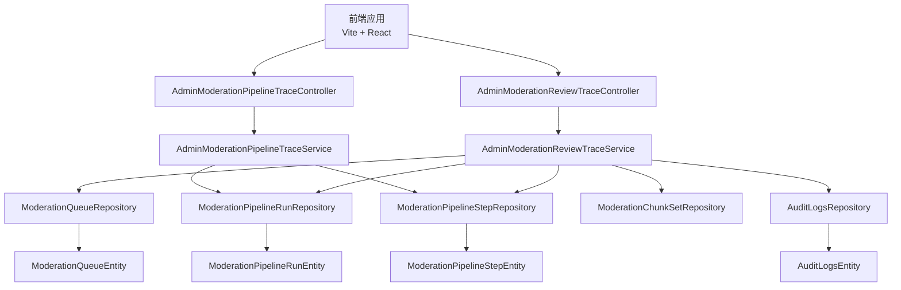
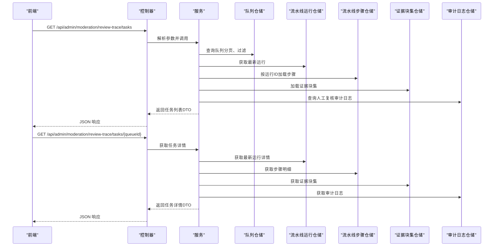
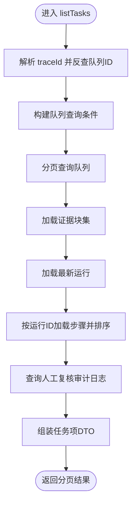
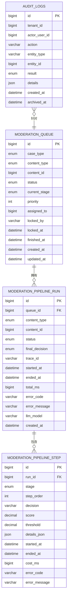
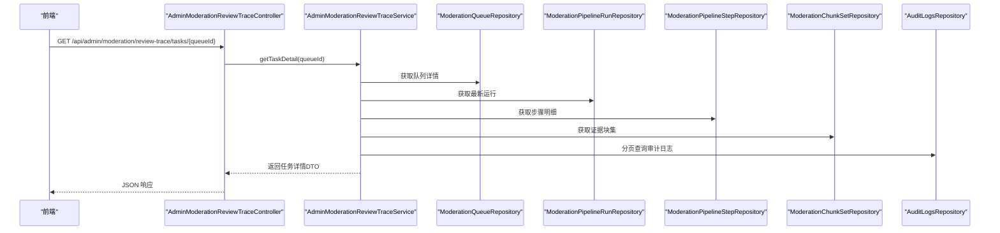
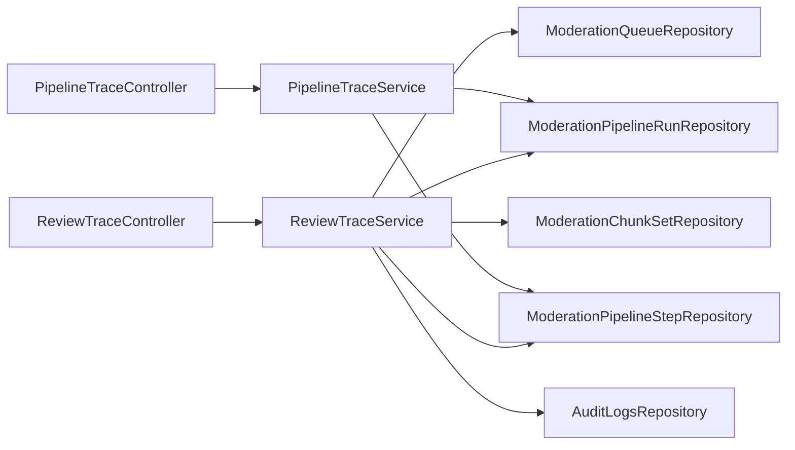

# 审查轨迹

<cite>
**本文引用的文件**
- [AdminModerationReviewTraceController.java](file://src/main/java/com/example/EnterpriseRagCommunity/controller/moderation/admin/AdminModerationReviewTraceController.java)
- [AdminModerationPipelineTraceController.java](file://src/main/java/com/example/EnterpriseRagCommunity/controller/moderation/admin/AdminModerationPipelineTraceController.java)
- [AdminModerationReviewTraceService.java](file://src/main/java/com/example/EnterpriseRagCommunity/service/moderation/trace/AdminModerationReviewTraceService.java)
- [AdminModerationPipelineTraceService.java](file://src/main/java/com/example/EnterpriseRagCommunity/service/moderation/trace/AdminModerationPipelineTraceService.java)
- [ModerationQueueEntity.java](file://src/main/java/com/example/EnterpriseRagCommunity/entity/moderation/ModerationQueueEntity.java)
- [ModerationPipelineRunEntity.java](file://src/main/java/com/example/EnterpriseRagCommunity/entity/moderation/ModerationPipelineRunEntity.java)
- [ModerationPipelineStepEntity.java](file://src/main/java/com/example/EnterpriseRagCommunity/entity/moderation/ModerationPipelineStepEntity.java)
- [AuditLogsEntity.java](file://src/main/java/com/example/EnterpriseRagCommunity/entity/access/AuditLogsEntity.java)
- [AuditLogsRepository.java](file://src/main/java/com/example/EnterpriseRagCommunity/repository/access/AuditLogsRepository.java)
- [AdminModerationReviewTraceTaskPageDTO.java](file://src/main/java/com/example/EnterpriseRagCommunity/dto/moderation/AdminModerationReviewTraceTaskPageDTO.java)
- [AdminModerationReviewTraceTaskItemDTO.java](file://src/main/java/com/example/EnterpriseRagCommunity/dto/moderation/AdminModerationReviewTraceTaskItemDTO.java)
- [AdminModerationReviewTraceTaskDetailDTO.java](file://src/main/java/com/example/EnterpriseRagCommunity/dto/moderation/AdminModerationReviewTraceTaskDetailDTO.java)
- [AdminModerationReviewTraceManualSummaryDTO.java](file://src/main/java/com/example/EnterpriseRagCommunity/dto/moderation/AdminModerationReviewTraceManualSummaryDTO.java)
- [AdminModerationPipelineTraceControllerTest.java](file://src/test/java/com/example/EnterpriseRagCommunity/controller/moderation/admin/AdminModerationReviewTraceControllerTest.java)
</cite>

## 目录
1. [简介](#简介)
2. [项目结构](#项目结构)
3. [核心组件](#核心组件)
4. [架构总览](#架构总览)
5. [详细组件分析](#详细组件分析)
6. [依赖分析](#依赖分析)
7. [性能考虑](#性能考虑)
8. [故障排查指南](#故障排查指南)
9. [结论](#结论)
10. [附录](#附录)

## 简介
本文件面向“审查轨迹”系统，全面阐述审核过程的全链路追踪机制，覆盖从任务创建、规则匹配、LLM 审核到人工复核等环节的详细记录与可视化呈现。系统通过统一的追踪 ID（traceId）串联任务队列、流水线运行与步骤、证据块集以及审计日志，形成可查询、可分析、可审计的闭环数据流。本文同时给出数据结构设计要点（时间戳、操作者、决策依据、证据材料等）、查询与分析能力（列表页、详情页、历史页）、存储策略建议（压缩、索引、归档清理），并提供合规检查、责任追溯与质量评估的应用场景说明。

## 项目结构
审查轨迹相关代码采用“控制器-服务-仓储-实体-DTO”的分层组织，前端通过跨域接口访问后端 REST API，后端按“审查任务轨迹”和“流水线轨迹”两条主线提供查询能力，并在任务详情中整合审计日志与证据块信息。

图表来源
- [AdminModerationReviewTraceController.java:1-47](file://src/main/java/com/example/EnterpriseRagCommunity/controller/moderation/admin/AdminModerationReviewTraceController.java#L1-L47)
- [AdminModerationPipelineTraceController.java:1-43](file://src/main/java/com/example/EnterpriseRagCommunity/controller/moderation/admin/AdminModerationPipelineTraceController.java#L1-L43)
- [AdminModerationReviewTraceService.java:1-355](file://src/main/java/com/example/EnterpriseRagCommunity/service/moderation/trace/AdminModerationReviewTraceService.java#L1-L355)
- [AdminModerationPipelineTraceService.java:1-87](file://src/main/java/com/example/EnterpriseRagCommunity/service/moderation/trace/AdminModerationPipelineTraceService.java#L1-L87)
- [ModerationQueueEntity.java:1-70](file://src/main/java/com/example/EnterpriseRagCommunity/entity/moderation/ModerationQueueEntity.java#L1-L70)
- [ModerationPipelineRunEntity.java:1-67](file://src/main/java/com/example/EnterpriseRagCommunity/entity/moderation/ModerationPipelineRunEntity.java#L1-L67)
- [ModerationPipelineStepEntity.java:1-62](file://src/main/java/com/example/EnterpriseRagCommunity/entity/moderation/ModerationPipelineStepEntity.java#L1-L62)
- [AuditLogsEntity.java:1-51](file://src/main/java/com/example/EnterpriseRagCommunity/entity/access/AuditLogsEntity.java#L1-L51)

章节来源
- [AdminModerationReviewTraceController.java:1-47](file://src/main/java/com/example/EnterpriseRagCommunity/controller/moderation/admin/AdminModerationReviewTraceController.java#L1-L47)
- [AdminModerationPipelineTraceController.java:1-43](file://src/main/java/com/example/EnterpriseRagCommunity/controller/moderation/admin/AdminModerationPipelineTraceController.java#L1-L43)

## 核心组件
- 控制器层：提供 REST 接口，负责参数解析、鉴权与响应封装。
- 服务层：聚合多仓储数据，组装任务列表、详情与流水线历史，处理复杂查询与汇总逻辑。
- 实体与仓储：承载任务队列、流水线运行、步骤、审计日志等核心数据模型及查询能力。
- DTO：定义对外输出的数据结构，确保前后端契约稳定。

章节来源
- [AdminModerationReviewTraceController.java:1-47](file://src/main/java/com/example/EnterpriseRagCommunity/controller/moderation/admin/AdminModerationReviewTraceController.java#L1-L47)
- [AdminModerationPipelineTraceController.java:1-43](file://src/main/java/com/example/EnterpriseRagCommunity/controller/moderation/admin/AdminModerationPipelineTraceController.java#L1-L43)
- [AdminModerationReviewTraceService.java:1-355](file://src/main/java/com/example/EnterpriseRagCommunity/service/moderation/trace/AdminModerationReviewTraceService.java#L1-L355)
- [AdminModerationPipelineTraceService.java:1-87](file://src/main/java/com/example/EnterpriseRagCommunity/service/moderation/trace/AdminModerationPipelineTraceService.java#L1-L87)

## 架构总览
审查轨迹系统围绕“任务队列”和“流水线运行”两大主干展开，通过统一的 traceId 关联不同阶段的决策与证据；同时，所有涉及 MODERATION_QUEUE 的人工干预动作均写入审计日志，便于回溯与审计。

图表来源
- [AdminModerationReviewTraceController.java:22-44](file://src/main/java/com/example/EnterpriseRagCommunity/controller/moderation/admin/AdminModerationReviewTraceController.java#L22-L44)
- [AdminModerationReviewTraceService.java:51-241](file://src/main/java/com/example/EnterpriseRagCommunity/service/moderation/trace/AdminModerationReviewTraceService.java#L51-L241)
- [AuditLogsRepository.java:21-27](file://src/main/java/com/example/EnterpriseRagCommunity/repository/access/AuditLogsRepository.java#L21-L27)

## 详细组件分析

### 控制器层
- 审查轨迹控制器：提供任务列表与任务详情两个入口，均需具备“admin_moderation_logs=read”权限。
- 流水线轨迹控制器：提供最新运行、历史列表与指定运行详情查询，同样需要相应权限。

章节来源
- [AdminModerationReviewTraceController.java:22-44](file://src/main/java/com/example/EnterpriseRagCommunity/controller/moderation/admin/AdminModerationReviewTraceController.java#L22-L44)
- [AdminModerationPipelineTraceController.java:19-41](file://src/main/java/com/example/EnterpriseRagCommunity/controller/moderation/admin/AdminModerationPipelineTraceController.java#L19-L41)

### 服务层（审查轨迹）
- 列表查询：支持按队列ID、内容类型/ID、状态、更新时间范围、traceId 等条件过滤；内部会根据 traceId 反查队列ID以兼容查询。
- 细节查询：返回队列详情、最新流水线运行、运行历史、证据块集、证据块进度、审计日志。
- 数据聚合：从多个仓储拉取数据，按运行ID/队列ID进行映射，组装各阶段摘要（规则、向量化、LLM），并提取人工复核的最后动作与操作者信息。
- 时间解析：提供字符串到 LocalDateTime 的安全解析工具方法，避免异常导致查询失败。

图表来源
- [AdminModerationReviewTraceService.java:51-212](file://src/main/java/com/example/EnterpriseRagCommunity/service/moderation/trace/AdminModerationReviewTraceService.java#L51-L212)

章节来源
- [AdminModerationReviewTraceService.java:51-241](file://src/main/java/com/example/EnterpriseRagCommunity/service/moderation/trace/AdminModerationReviewTraceService.java#L51-L241)

### 服务层（流水线轨迹）
- 最新运行：按队列ID获取最近一次运行及其步骤明细。
- 历史查询：支持按队列ID或内容类型/ID维度分页查询历史运行，按创建时间倒序。
- 运行详情：按运行ID获取运行与步骤明细。

章节来源
- [AdminModerationPipelineTraceService.java:28-85](file://src/main/java/com/example/EnterpriseRagCommunity/service/moderation/trace/AdminModerationPipelineTraceService.java#L28-L85)

### 数据模型与DTO
- 任务队列（ModerationQueueEntity）：承载内容类型、内容ID、状态、当前阶段、优先级、锁定信息、版本与时间戳等。
- 流水线运行（ModerationPipelineRunEntity）：承载运行状态、最终决策、traceId、耗时、错误信息、模型信息与时间戳等。
- 流水线步骤（ModerationPipelineStepEntity）：承载阶段、顺序、决策、分数、阈值、耗时、错误信息与时间戳等；details_json 存放决策依据与证据元信息。
- 审计日志（AuditLogsEntity）：承载操作者、动作、实体类型/ID、结果、详情JSON与时间戳等。
- DTO：用于对外输出的任务列表项、任务详情、阶段摘要、人工复核摘要等。

图表来源
- [ModerationQueueEntity.java:1-70](file://src/main/java/com/example/EnterpriseRagCommunity/entity/moderation/ModerationQueueEntity.java#L1-L70)
- [ModerationPipelineRunEntity.java:1-67](file://src/main/java/com/example/EnterpriseRagCommunity/entity/moderation/ModerationPipelineRunEntity.java#L1-L67)
- [ModerationPipelineStepEntity.java:1-62](file://src/main/java/com/example/EnterpriseRagCommunity/entity/moderation/ModerationPipelineStepEntity.java#L1-L62)
- [AuditLogsEntity.java:1-51](file://src/main/java/com/example/EnterpriseRagCommunity/entity/access/AuditLogsEntity.java#L1-L51)

章节来源
- [ModerationQueueEntity.java:1-70](file://src/main/java/com/example/EnterpriseRagCommunity/entity/moderation/ModerationQueueEntity.java#L1-L70)
- [ModerationPipelineRunEntity.java:1-67](file://src/main/java/com/example/EnterpriseRagCommunity/entity/moderation/ModerationPipelineRunEntity.java#L1-L67)
- [ModerationPipelineStepEntity.java:1-62](file://src/main/java/com/example/EnterpriseRagCommunity/entity/moderation/ModerationPipelineStepEntity.java#L1-L62)
- [AuditLogsEntity.java:1-51](file://src/main/java/com/example/EnterpriseRagCommunity/entity/access/AuditLogsEntity.java#L1-L51)
- [AdminModerationReviewTraceTaskPageDTO.java:1-14](file://src/main/java/com/example/EnterpriseRagCommunity/dto/moderation/AdminModerationReviewTraceTaskPageDTO.java#L1-L14)
- [AdminModerationReviewTraceTaskItemDTO.java:1-32](file://src/main/java/com/example/EnterpriseRagCommunity/dto/moderation/AdminModerationReviewTraceTaskItemDTO.java#L1-L32)
- [AdminModerationReviewTraceTaskDetailDTO.java:1-17](file://src/main/java/com/example/EnterpriseRagCommunity/dto/moderation/AdminModerationReviewTraceTaskDetailDTO.java#L1-L17)
- [AdminModerationReviewTraceManualSummaryDTO.java:1-12](file://src/main/java/com/example/EnterpriseRagCommunity/dto/moderation/AdminModerationReviewTraceManualSummaryDTO.java#L1-L12)

### API 工作流（序列图）
以下序列图展示“任务详情”查询的端到端调用链，体现服务层如何聚合流水线运行、步骤、证据块集与审计日志。

图表来源
- [AdminModerationReviewTraceController.java:40-44](file://src/main/java/com/example/EnterpriseRagCommunity/controller/moderation/admin/AdminModerationReviewTraceController.java#L40-L44)
- [AdminModerationReviewTraceService.java:214-241](file://src/main/java/com/example/EnterpriseRagCommunity/service/moderation/trace/AdminModerationReviewTraceService.java#L214-L241)

## 依赖分析
- 控制器依赖服务；服务依赖多个仓储；仓储依赖实体；DTO 作为服务与控制器之间的契约。
- 审查轨迹服务对审计日志仓储有特定查询依赖（按实体类型与动作前缀检索），用于提取人工复核摘要。
- 流水线轨迹服务依赖运行与步骤仓储，按运行ID加载步骤明细并排序。

图表来源
- [AdminModerationReviewTraceController.java:1-47](file://src/main/java/com/example/EnterpriseRagCommunity/controller/moderation/admin/AdminModerationReviewTraceController.java#L1-L47)
- [AdminModerationPipelineTraceController.java:1-43](file://src/main/java/com/example/EnterpriseRagCommunity/controller/moderation/admin/AdminModerationPipelineTraceController.java#L1-L43)
- [AdminModerationReviewTraceService.java:1-355](file://src/main/java/com/example/EnterpriseRagCommunity/service/moderation/trace/AdminModerationReviewTraceService.java#L1-L355)
- [AdminModerationPipelineTraceService.java:1-87](file://src/main/java/com/example/EnterpriseRagCommunity/service/moderation/trace/AdminModerationPipelineTraceService.java#L1-L87)

章节来源
- [AuditLogsRepository.java:1-29](file://src/main/java/com/example/EnterpriseRagCommunity/repository/access/AuditLogsRepository.java#L1-L29)

## 性能考虑
- 分页与上限：服务层对分页大小做了上限控制，避免一次性返回过多数据；查询时使用分页请求与排序，降低数据库压力。
- 批量查询：在任务列表中，对运行ID集合批量加载步骤，减少多次往返；对队列ID集合批量加载证据块集。
- 索引建议：为以下字段建立合适索引以提升查询性能（建议结合实际业务量评估）：
  - moderation_queue(content_type, content_id, updated_at)
  - moderation_pipeline_run(queue_id, created_at)
  - moderation_pipeline_step(run_id, step_order)
  - audit_logs(entity_type, entity_id, action, created_at)
- JSON 字段查询：details_json 为审计日志详情字段，若频繁按路径查询，建议评估是否引入专用字段或二级索引。
- 归档与清理：审计日志提供 archived_at 字段，可配合定时任务清理过期日志，降低表规模。

章节来源
- [AdminModerationReviewTraceService.java:74-96](file://src/main/java/com/example/EnterpriseRagCommunity/service/moderation/trace/AdminModerationReviewTraceService.java#L74-L96)
- [AuditLogsEntity.java:48-49](file://src/main/java/com/example/EnterpriseRagCommunity/entity/access/AuditLogsEntity.java#L48-L49)
- [AuditLogsRepository.java:19-27](file://src/main/java/com/example/EnterpriseRagCommunity/repository/access/AuditLogsRepository.java#L19-L27)

## 故障排查指南
- 权限不足：访问接口返回 403，确认用户是否具备“admin_moderation_logs=read”权限。
- 参数非法：当 queueId 或 runId 为空时，服务层会抛出参数异常；请检查前端传参。
- 查询无结果：当 traceId 无法反查到队列ID时，任务列表会返回空结果；请确认 traceId 是否正确。
- 审计日志缺失：人工复核日志可能因查询上限或时间范围限制未返回；可通过扩大范围或直接查询审计日志接口验证。
- 单元/集成测试参考：控制器测试覆盖了权限校验与基本查询行为，可作为回归测试的参考。

章节来源
- [AdminModerationReviewTraceControllerTest.java:66-75](file://src/test/java/com/example/EnterpriseRagCommunity/controller/moderation/admin/AdminModerationReviewTraceControllerTest.java#L66-L75)
- [AdminModerationReviewTraceService.java:243-251](file://src/main/java/com/example/EnterpriseRagCommunity/service/moderation/trace/AdminModerationReviewTraceService.java#L243-L251)

## 结论
审查轨迹系统通过统一的 traceId 将任务队列、流水线运行与步骤、证据块集以及审计日志有机串联，形成完整的审核全链路可追溯能力。服务层在保证查询性能的同时，提供了灵活的筛选、分页与汇总能力；审计日志为人工复核提供了合规与责任追溯基础。建议在生产环境中完善索引策略、归档清理与监控告警，持续优化查询与存储成本。

## 附录

### 数据结构设计要点
- 时间戳：队列、运行、步骤、审计日志均包含创建/开始/结束时间，便于绘制时间轴与耗时分析。
- 操作者：审计日志包含 actor_user_id 与 details 中的 actorName，支持责任追溯。
- 决策依据：步骤 details_json 中可存放规则命中、阈值、证据片段等，支持可视化展示与复核。
- 证据材料：证据块集包含分块数量、完成/失败统计、最大分数与平均耗时，支撑质量评估。

章节来源
- [ModerationQueueEntity.java:64-68](file://src/main/java/com/example/EnterpriseRagCommunity/entity/moderation/ModerationQueueEntity.java#L64-L68)
- [ModerationPipelineRunEntity.java:46-53](file://src/main/java/com/example/EnterpriseRagCommunity/entity/moderation/ModerationPipelineRunEntity.java#L46-L53)
- [ModerationPipelineStepEntity.java:47-60](file://src/main/java/com/example/EnterpriseRagCommunity/entity/moderation/ModerationPipelineStepEntity.java#L47-L60)
- [AuditLogsEntity.java:25-43](file://src/main/java/com/example/EnterpriseRagCommunity/entity/access/AuditLogsEntity.java#L25-L43)
- [AdminModerationReviewTraceService.java:280-317](file://src/main/java/com/example/EnterpriseRagCommunity/service/moderation/trace/AdminModerationReviewTraceService.java#L280-L317)

### 查询与分析功能
- 列表页：支持按队列ID、内容类型/ID、状态、更新时间范围、traceId 等筛选；分页与排序。
- 详情页：展示最新运行、历史运行、证据块集、证据块进度与审计日志。
- 历史页：按队列或内容维度查看历史运行，支持分页。
- 可视化与报表：可在前端基于返回的结构化数据绘制时间轴、决策分布、耗时统计等图表。

章节来源
- [AdminModerationReviewTraceController.java:22-44](file://src/main/java/com/example/EnterpriseRagCommunity/controller/moderation/admin/AdminModerationReviewTraceController.java#L22-L44)
- [AdminModerationPipelineTraceController.java:25-41](file://src/main/java/com/example/EnterpriseRagCommunity/controller/moderation/admin/AdminModerationPipelineTraceController.java#L25-L41)
- [AdminModerationReviewTraceService.java:214-241](file://src/main/java/com/example/EnterpriseRagCommunity/service/moderation/trace/AdminModerationReviewTraceService.java#L214-L241)

### 轨迹审计与合规
- 合规检查：通过审计日志中的动作、实体与详情，可复盘人工干预的合法性与时效性。
- 责任追溯：结合 actor_user_id 与 actorName，定位具体责任人。
- 质量评估：基于步骤分数、阈值、耗时与证据块集统计，评估规则与模型效果。

章节来源
- [AuditLogsEntity.java:28-43](file://src/main/java/com/example/EnterpriseRagCommunity/entity/access/AuditLogsEntity.java#L28-L43)
- [AdminModerationReviewTraceService.java:143-168](file://src/main/java/com/example/EnterpriseRagCommunity/service/moderation/trace/AdminModerationReviewTraceService.java#L143-L168)