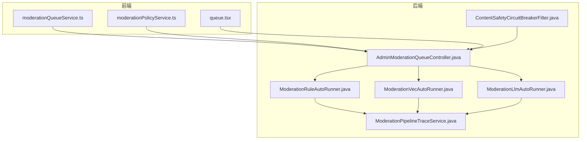
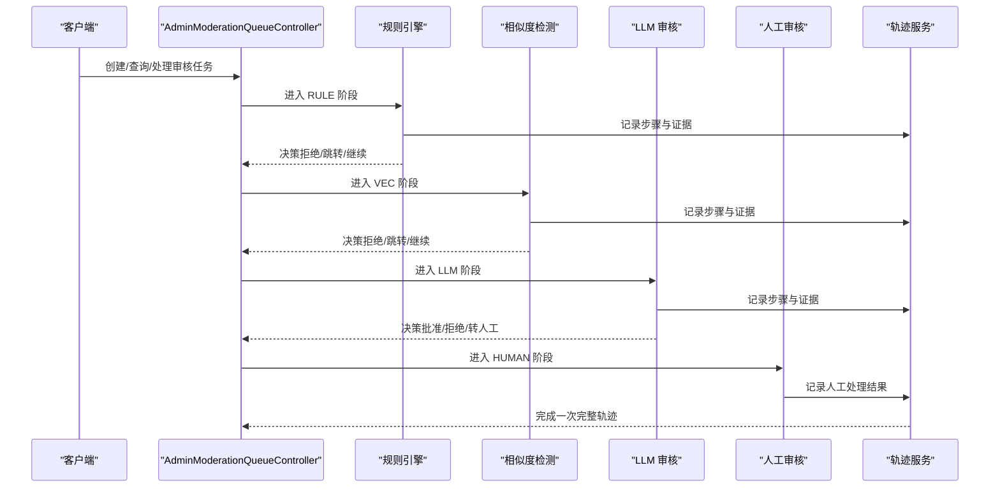
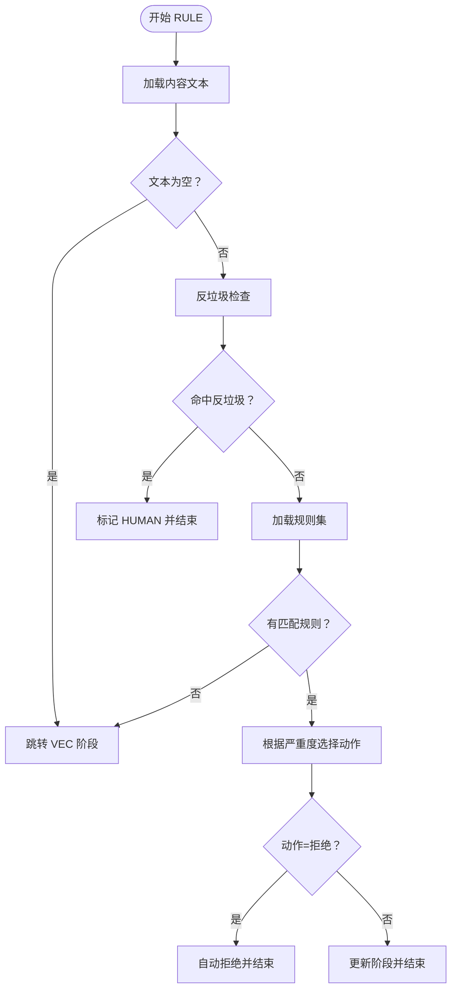
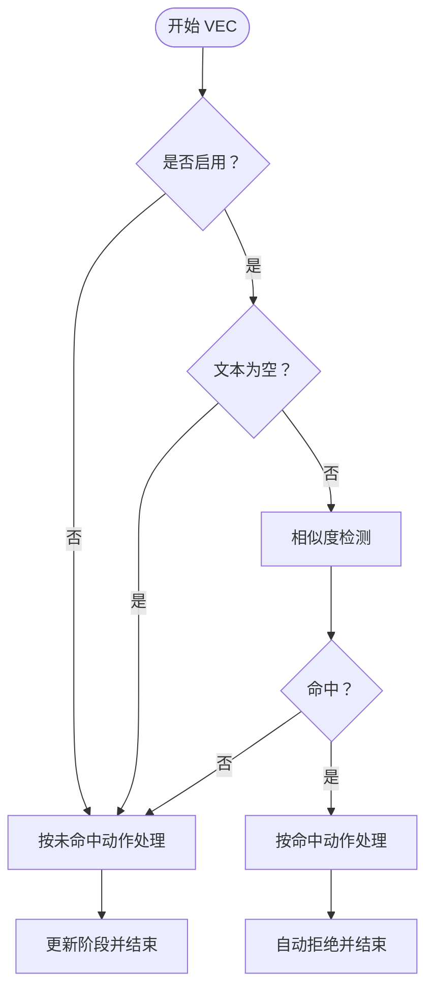
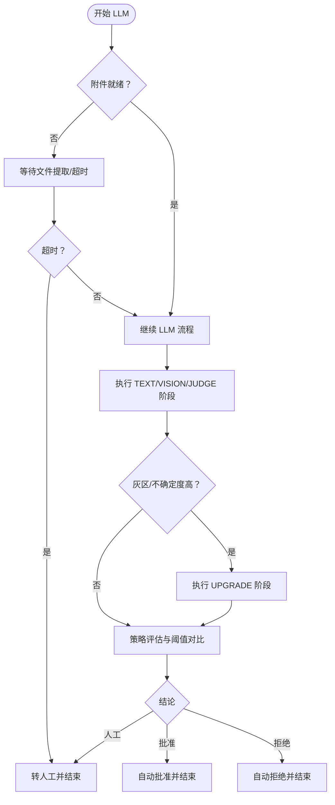
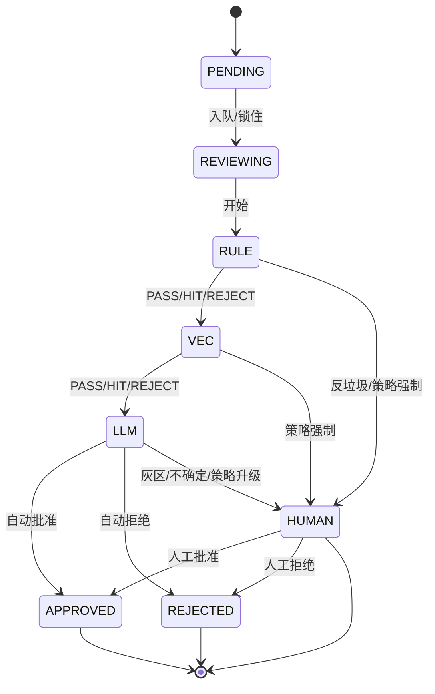
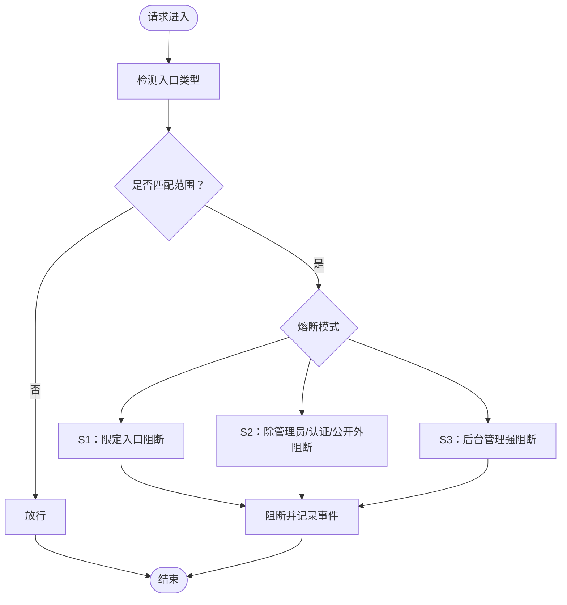
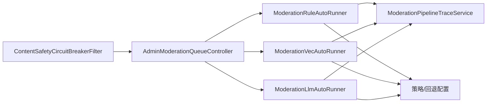

# 审核系统

<cite>
**本文档引用的文件**
- [ContentSafetyCircuitBreakerFilter.java](file://src/main/java/com/example/EnterpriseRagCommunity/security/ContentSafetyCircuitBreakerFilter.java)
- [ModerationRuleAutoRunner.java](file://src/main/java/com/example/EnterpriseRagCommunity/service/moderation/jobs/ModerationRuleAutoRunner.java)
- [ModerationVecAutoRunner.java](file://src/main/java/com/example/EnterpriseRagCommunity/service/moderation/jobs/ModerationVecAutoRunner.java)
- [ModerationLlmAutoRunner.java](file://src/main/java/com/example/EnterpriseRagCommunity/service/moderation/jobs/ModerationLlmAutoRunner.java)
- [AdminModerationQueueController.java](file://src/main/java/com/example/EnterpriseRagCommunity/controller/moderation/admin/AdminModerationQueueController.java)
- [ModerationQueueEntity.java](file://src/main/java/com/example/EnterpriseRagCommunity/entity/moderation/ModerationQueueEntity.java)
- [ModerationPipelineRunEntity.java](file://src/main/java/com/example/EnterpriseRagCommunity/entity/moderation/ModerationPipelineRunEntity.java)
- [ModerationPipelineStepEntity.java](file://src/main/java/com/example/EnterpriseRagCommunity/entity/moderation/ModerationPipelineStepEntity.java)
- [QueueStage.java](file://src/main/java/com/example/EnterpriseRagCommunity/entity/moderation/enums/QueueStage.java)
- [QueueStatus.java](file://src/main/java/com/example/EnterpriseRagCommunity/entity/moderation/enums/QueueStatus.java)
- [Verdict.java](file://src/main/java/com/example/EnterpriseRagCommunity/entity/moderation/enums/Verdict.java)
- [ModerationPipelineTraceService.java](file://src/main/java/com/example/EnterpriseRagCommunity/service/moderation/trace/ModerationPipelineTraceService.java)
- [moderationQueueService.ts](file://my-vite-app/src/services/moderationQueueService.ts)
- [moderationPolicyService.ts](file://my-vite-app/src/services/moderationPolicyService.ts)
- [queue.tsx](file://my-vite-app/src/pages/admin/forms/review/queue.tsx)
- [ContentSafetyCircuitBreakerServiceTest.java](file://src/test/java/com/example/EnterpriseRagCommunity/service/safety/ContentSafetyCircuitBreakerServiceTest.java)
- [ModerationRuleAutoRunnerTest.java](file://src/test/java/com/example/EnterpriseRagCommunity/service/moderation/jobs/ModerationRuleAutoRunnerTest.java)
- [ModerationVecAutoRunnerTest.java](file://src/test/java/com/example/EnterpriseRagCommunity/service/moderation/jobs/ModerationVecAutoRunnerTest.java)
- [ModerationLlmAutoRunnerTest.java](file://src/test/java/com/example/EnterpriseRagCommunity/service/moderation/jobs/ModerationLlmAutoRunnerTest.java)
</cite>

## 目录
1. [引言](#引言)
2. [项目结构](#项目结构)
3. [核心组件](#核心组件)
4. [架构总览](#架构总览)
5. [详细组件分析](#详细组件分析)
6. [依赖分析](#依赖分析)
7. [性能考虑](#性能考虑)
8. [故障排查指南](#故障排查指南)
9. [结论](#结论)
10. [附录：API 接口规范](#附录api-接口规范)

## 引言
本文件面向审核系统的使用者与维护者，系统性梳理内容审核、风险标签、规则引擎、LLM 审核、回退机制、审核队列管理、人工审核、自动审核、相似度检测、实体模型、状态流转、证据收集与审查轨迹等能力。同时给出前端服务层对后端 API 的调用方式与示例路径，以及内容安全熔断器与依赖隔离等安全机制的实现原理。

## 项目结构
审核系统由“后端服务 + 前端服务层 + 安全过滤器”三部分组成：
- 后端服务层：规则引擎、相似度检测、LLM 审核、队列与轨迹管理、策略配置等
- 前端服务层：封装与后端交互的 API 调用，统一处理 CSRF、错误消息与响应解析
- 安全过滤器：在网关层对特定入口进行熔断保护

图示来源
- [AdminModerationQueueController.java:1-184](file://src/main/java/com/example/EnterpriseRagCommunity/controller/moderation/admin/AdminModerationQueueController.java#L1-L184)
- [ModerationRuleAutoRunner.java:1-595](file://src/main/java/com/example/EnterpriseRagCommunity/service/moderation/jobs/ModerationRuleAutoRunner.java#L1-L595)
- [ModerationVecAutoRunner.java:1-403](file://src/main/java/com/example/EnterpriseRagCommunity/service/moderation/jobs/ModerationVecAutoRunner.java#L1-L403)
- [ModerationLlmAutoRunner.java:1-800](file://src/main/java/com/example/EnterpriseRagCommunity/service/moderation/jobs/ModerationLlmAutoRunner.java#L1-L800)
- [ModerationPipelineTraceService.java:1-211](file://src/main/java/com/example/EnterpriseRagCommunity/service/moderation/trace/ModerationPipelineTraceService.java#L1-L211)
- [ContentSafetyCircuitBreakerFilter.java:1-242](file://src/main/java/com/example/EnterpriseRagCommunity/security/ContentSafetyCircuitBreakerFilter.java#L1-L242)

章节来源
- [AdminModerationQueueController.java:1-184](file://src/main/java/com/example/EnterpriseRagCommunity/controller/moderation/admin/AdminModerationQueueController.java#L1-L184)
- [ContentSafetyCircuitBreakerFilter.java:1-242](file://src/main/java/com/example/EnterpriseRagCommunity/security/ContentSafetyCircuitBreakerFilter.java#L1-L242)

## 核心组件
- 规则引擎（RULE）：基于正则规则与反垃圾策略进行快速判定，支持按严重度映射到下一阶段或直接拒绝
- 相似度检测（VEC）：在进入 LLM 前对历史违规样本进行相似度比对，决定是否拒绝或放行
- LLM 审核（LLM）：多阶段（文本/视觉/跨模态/升级）综合决策，结合策略与阈值生成最终结论
- 审核队列与轨迹（QUEUE/TRACE）：统一的任务队列、运行轨迹与步骤记录，支撑审计与回溯
- 策略配置（POLICY/FALLBACK）：内容类型策略与全局回退配置，驱动各阶段动作
- 人工审核（HUMAN）：当自动决策无法确定时转入人工复核
- 内容安全熔断器（CIRCUIT BREAKER）：对指定入口进行分级熔断保护

章节来源
- [ModerationRuleAutoRunner.java:35-595](file://src/main/java/com/example/EnterpriseRagCommunity/service/moderation/jobs/ModerationRuleAutoRunner.java#L35-L595)
- [ModerationVecAutoRunner.java:29-403](file://src/main/java/com/example/EnterpriseRagCommunity/service/moderation/jobs/ModerationVecAutoRunner.java#L29-L403)
- [ModerationLlmAutoRunner.java:68-800](file://src/main/java/com/example/EnterpriseRagCommunity/service/moderation/jobs/ModerationLlmAutoRunner.java#L68-L800)
- [ModerationPipelineTraceService.java:30-211](file://src/main/java/com/example/EnterpriseRagCommunity/service/moderation/trace/ModerationPipelineTraceService.java#L30-L211)
- [ContentSafetyCircuitBreakerFilter.java:20-242](file://src/main/java/com/example/EnterpriseRagCommunity/security/ContentSafetyCircuitBreakerFilter.java#L20-L242)

## 架构总览
审核系统采用“流水线式”的多阶段自动决策与人工复核相结合的架构。每个内容提交后进入审核队列，按阶段顺序执行：规则 → 相似度 → LLM → 人工。每阶段均记录轨迹与证据，支持回放与审计。

图示来源
- [AdminModerationQueueController.java:39-182](file://src/main/java/com/example/EnterpriseRagCommunity/controller/moderation/admin/AdminModerationQueueController.java#L39-L182)
- [ModerationRuleAutoRunner.java:107-437](file://src/main/java/com/example/EnterpriseRagCommunity/service/moderation/jobs/ModerationRuleAutoRunner.java#L107-L437)
- [ModerationVecAutoRunner.java:97-325](file://src/main/java/com/example/EnterpriseRagCommunity/service/moderation/jobs/ModerationVecAutoRunner.java#L97-L325)
- [ModerationLlmAutoRunner.java:171-754](file://src/main/java/com/example/EnterpriseRagCommunity/service/moderation/jobs/ModerationLlmAutoRunner.java#L171-L754)
- [ModerationPipelineTraceService.java:58-196](file://src/main/java/com/example/EnterpriseRagCommunity/service/moderation/trace/ModerationPipelineTraceService.java#L58-L196)

## 详细组件分析

### 组件一：规则引擎（RULE）
- 功能要点
  - 加载内容文本，匹配正则规则，记录命中详情
  - 反垃圾策略：按作者/时间窗口限制触发 HUMAN
  - 根据严重度映射到下一阶段或直接拒绝
  - 通过回退配置控制开关与动作
- 关键流程

图示来源
- [ModerationRuleAutoRunner.java:107-437](file://src/main/java/com/example/EnterpriseRagCommunity/service/moderation/jobs/ModerationRuleAutoRunner.java#L107-L437)

章节来源
- [ModerationRuleAutoRunner.java:35-595](file://src/main/java/com/example/EnterpriseRagCommunity/service/moderation/jobs/ModerationRuleAutoRunner.java#L35-L595)
- [QueueStage.java:1-10](file://src/main/java/com/example/EnterpriseRagCommunity/entity/moderation/enums/QueueStage.java#L1-L10)

### 组件二：相似度检测（VEC）
- 功能要点
  - 在进入 LLM 前对历史违规样本进行相似度比对
  - 支持阈值与命中/未命中动作控制
  - 文本为空时按“未命中动作”处理
- 关键流程

图示来源
- [ModerationVecAutoRunner.java:97-325](file://src/main/java/com/example/EnterpriseRagCommunity/service/moderation/jobs/ModerationVecAutoRunner.java#L97-L325)

章节来源
- [ModerationVecAutoRunner.java:29-403](file://src/main/java/com/example/EnterpriseRagCommunity/service/moderation/jobs/ModerationVecAutoRunner.java#L29-L403)

### 组件三：LLM 审核（LLM）
- 功能要点
  - 多阶段：TEXT/VISION/JUDGE/UPGRADE，支持文本、图片与跨模态综合判断
  - 灰度与不确定性升级：在阈值灰区或不确定度较高时触发升级判断
  - 结合策略与风险标签阈值，输出 APPROVE/REJECT/HUMAN
  - 文件附件准备与超时处理：等待文件提取完成后进入 LLM
- 关键流程

图示来源
- [ModerationLlmAutoRunner.java:171-754](file://src/main/java/com/example/EnterpriseRagCommunity/service/moderation/jobs/ModerationLlmAutoRunner.java#L171-L754)

章节来源
- [ModerationLlmAutoRunner.java:68-800](file://src/main/java/com/example/EnterpriseRagCommunity/service/moderation/jobs/ModerationLlmAutoRunner.java#L68-L800)
- [Verdict.java:1-9](file://src/main/java/com/example/EnterpriseRagCommunity/entity/moderation/enums/Verdict.java#L1-L9)

### 组件四：审核队列与轨迹（QUEUE/TRACE）
- 实体模型
  - 队列实体：包含内容类型、内容 ID、当前阶段、状态、优先级、锁定信息、版本等
  - 运行实体：一次审核的运行记录，含状态、最终结论、耗时、错误信息等
  - 步骤实体：每个阶段的执行记录，含决策、分数、阈值、耗时、错误信息与细节
- 状态机
  - 阶段：RULE → VEC → LLM → HUMAN
  - 状态：PENDING → REVIEWING → APPROVED/REJECTED/HUMAN

图示来源
- [ModerationQueueEntity.java:1-70](file://src/main/java/com/example/EnterpriseRagCommunity/entity/moderation/ModerationQueueEntity.java#L1-L70)
- [ModerationPipelineRunEntity.java:1-67](file://src/main/java/com/example/EnterpriseRagCommunity/entity/moderation/ModerationPipelineRunEntity.java#L1-L67)
- [ModerationPipelineStepEntity.java:1-62](file://src/main/java/com/example/EnterpriseRagCommunity/entity/moderation/ModerationPipelineStepEntity.java#L1-L62)
- [QueueStage.java:1-10](file://src/main/java/com/example/EnterpriseRagCommunity/entity/moderation/enums/QueueStage.java#L1-L10)
- [QueueStatus.java:1-11](file://src/main/java/com/example/EnterpriseRagCommunity/entity/moderation/enums/QueueStatus.java#L1-L11)

章节来源
- [ModerationPipelineTraceService.java:30-211](file://src/main/java/com/example/EnterpriseRagCommunity/service/moderation/trace/ModerationPipelineTraceService.java#L30-L211)

### 组件五：内容安全熔断器（CIRCUIT BREAKER）
- 功能要点
  - 支持 S1/S2/S3 三级熔断模式，针对不同入口与范围进行阻断
  - 对静态资源、公开接口、后台管理等设置差异化策略
  - 记录阻断事件，返回统一格式的阻断响应
- 关键流程

图示来源
- [ContentSafetyCircuitBreakerFilter.java:42-112](file://src/main/java/com/example/EnterpriseRagCommunity/security/ContentSafetyCircuitBreakerFilter.java#L42-L112)

章节来源
- [ContentSafetyCircuitBreakerFilter.java:20-242](file://src/main/java/com/example/EnterpriseRagCommunity/security/ContentSafetyCircuitBreakerFilter.java#L20-L242)

### 组件六：前端服务层与界面
- 前端服务层封装了与后端交互的 API，包括：
  - 审核队列列表、详情、人工处理、批量重排等
  - 审核策略配置的获取与更新
  - 风险标签的查询与设置
- 界面展示
  - 审核队列详情页按步骤聚合证据，支持分块证据查看与排序

章节来源
- [moderationQueueService.ts:319-364](file://my-vite-app/src/services/moderationQueueService.ts#L319-L364)
- [moderationPolicyService.ts:31-55](file://my-vite-app/src/services/moderationPolicyService.ts#L31-L55)
- [queue.tsx:388-412](file://my-vite-app/src/pages/admin/forms/review/queue.tsx#L388-L412)

## 依赖分析
- 组件耦合
  - 控制器依赖服务层；服务层依赖仓库与追踪服务；追踪服务依赖审计日志写入
  - 规则/相似度/LLM 三大自动运行器共享“回退配置”“策略配置”“内容文本加载”等外部依赖
- 依赖关系图

图示来源
- [AdminModerationQueueController.java:33-37](file://src/main/java/com/example/EnterpriseRagCommunity/controller/moderation/admin/AdminModerationQueueController.java#L33-L37)
- [ModerationRuleAutoRunner.java:47-59](file://src/main/java/com/example/EnterpriseRagCommunity/service/moderation/jobs/ModerationRuleAutoRunner.java#L47-L59)
- [ModerationVecAutoRunner.java:40-48](file://src/main/java/com/example/EnterpriseRagCommunity/service/moderation/jobs/ModerationVecAutoRunner.java#L40-L48)
- [ModerationLlmAutoRunner.java:80-100](file://src/main/java/com/example/EnterpriseRagCommunity/service/moderation/jobs/ModerationLlmAutoRunner.java#L80-L100)
- [ContentSafetyCircuitBreakerFilter.java:24-29](file://src/main/java/com/example/EnterpriseRagCommunity/security/ContentSafetyCircuitBreakerFilter.java#L24-L29)

## 性能考虑
- 批量限流：各自动运行器按固定频率扫描，限制每轮处理数量，避免瞬时压力
- 锁定机制：通过数据库锁避免并发重复处理同一任务
- 分阶段缓存：LLM 风险标签阈值缓存，减少重复加载
- 超时与等待：文件附件提取超时回退至人工，避免无限等待
- 日志与审计：轨迹服务统一记录耗时与错误，便于性能分析与问题定位

## 故障排查指南
- 规则引擎
  - 现象：规则未生效或误判
  - 排查：确认策略配置中 precheck.rule.* 项；检查规则库是否为空；查看命中详情与严重度映射
- 相似度检测
  - 现象：VEC 未命中但应拒绝
  - 排查：确认阈值配置；检查文本是否为空；查看历史样本索引状态
- LLM 审核
  - 现象：灰区/不确定导致升级或转人工
  - 排查：检查灰区阈值与不确定性阈值；关注升级阶段输出；查看跨模态与多阶段评分
- 轨迹与审计
  - 现象：轨迹缺失或不一致
  - 排查：确认 startStep/finishStep 调用；检查 run 状态与最终结论；核对错误码与消息
- 熔断器
  - 现象：访问受限或统一阻断
  - 排查：确认熔断模式与范围；检查入口识别与事件记录；核对阻断消息

章节来源
- [ModerationRuleAutoRunnerTest.java](file://src/test/java/com/example/EnterpriseRagCommunity/service/moderation/jobs/ModerationRuleAutoRunnerTest.java)
- [ModerationVecAutoRunnerTest.java](file://src/test/java/com/example/EnterpriseRagCommunity/service/moderation/jobs/ModerationVecAutoRunnerTest.java)
- [ModerationLlmAutoRunnerTest.java](file://src/test/java/com/example/EnterpriseRagCommunity/service/moderation/jobs/ModerationLlmAutoRunnerTest.java)
- [ContentSafetyCircuitBreakerServiceTest.java:88-125](file://src/test/java/com/example/EnterpriseRagCommunity/service/safety/ContentSafetyCircuitBreakerServiceTest.java#L88-L125)

## 结论
该审核系统以“规则 → 相似度 → LLM → 人工”的流水线为核心，结合策略与回退配置实现灵活可控的自动化与人工协同。通过完善的轨迹与审计、分级熔断与依赖隔离，系统在保障安全的同时具备良好的可运维性与扩展性。

## 附录：API 接口规范

- 审核队列管理
  - 列表查询
    - 方法：GET
    - 路径：/api/admin/moderation/queue
    - 查询参数：page/pageSize/orderBy/sort/id/boardId/contentType/contentId/status/currentStage/assignedToId/minPriority/maxPriority/createdFrom/createdTo
    - 权限：admin_moderation_queue.read 或 board 权限
  - 获取详情
    - 方法：GET
    - 路径：/api/admin/moderation/queue/{id}
    - 权限：admin_moderation_queue.read 或 board 权限
  - 获取分块进度
    - 方法：GET
    - 路径：/api/admin/moderation/queue/{id}/chunk-progress
    - 查询参数：includeChunks(0/1)/limit(0~300)
    - 权限：admin_moderation_queue.read 或 board 权限
  - 获取/设置风险标签
    - 方法：GET/POST
    - 路径：/api/admin/moderation/queue/{id}/risk-tags
    - 权限：admin_moderation_queue.read 或 admin_moderation_queue.action
  - 审批/覆核审批/拒绝/覆核拒绝
    - 方法：POST
    - 路径：/api/admin/moderation/queue/{id}/approve, /override-approve, /reject, /override-reject
    - 请求体：reason
    - 权限：admin_moderation_queue.action 或 board 权限
  - 人工接管/释放/重排/转人工
    - 方法：POST
    - 路径：/api/admin/moderation/queue/{id}/claim, /release, /requeue, /to-human
    - 请求体：reason/reviewStage
    - 权限：admin_moderation_queue.action 或 board 权限
  - 批量重排
    - 方法：POST
    - 路径：/api/admin/moderation/queue/batch/requeue
    - 请求体：ids/ reason/reviewStage
    - 权限：admin_moderation_queue.action
  - 回填
    - 方法：POST
    - 路径：/api/admin/moderation/queue/backfill
    - 请求体：回填参数
    - 权限：admin_moderation_queue.action

- 审核策略配置
  - 获取策略配置
    - 方法：GET
    - 路径：/api/admin/moderation/policy/config?contentType=POST|COMMENT|PROFILE
    - 权限：admin_moderation_queue.action
  - 更新策略配置
    - 方法：PUT
    - 路径：/api/admin/moderation/policy/config
    - 请求体：contentType/policyVersion/config
    - 权限：admin_moderation_queue.action

章节来源
- [AdminModerationQueueController.java:39-182](file://src/main/java/com/example/EnterpriseRagCommunity/controller/moderation/admin/AdminModerationQueueController.java#L39-L182)
- [moderationQueueService.ts:319-364](file://my-vite-app/src/services/moderationQueueService.ts#L319-L364)
- [moderationPolicyService.ts:31-55](file://my-vite-app/src/services/moderationPolicyService.ts#L31-L55)