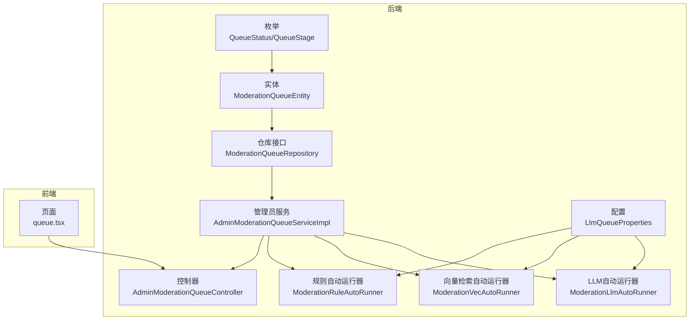
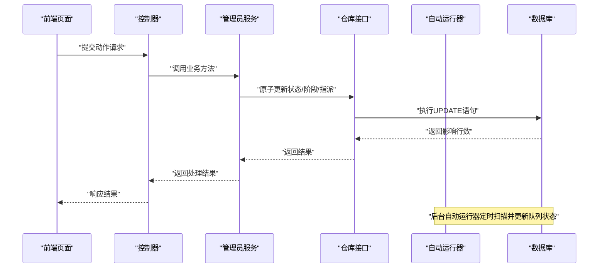
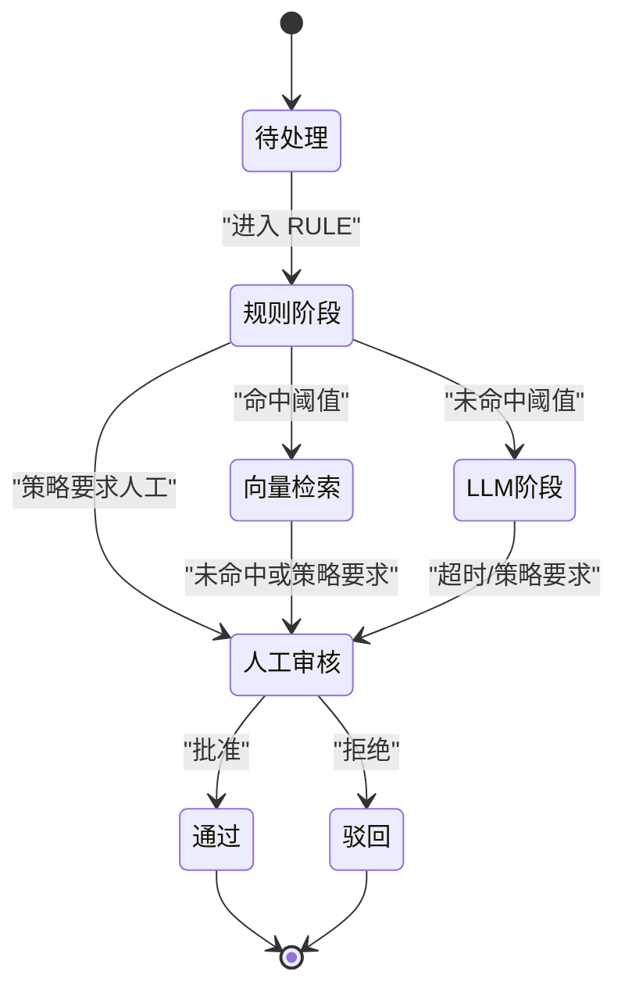
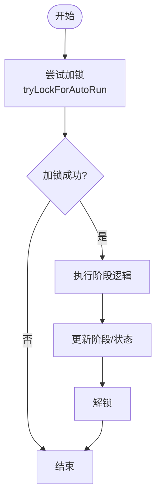
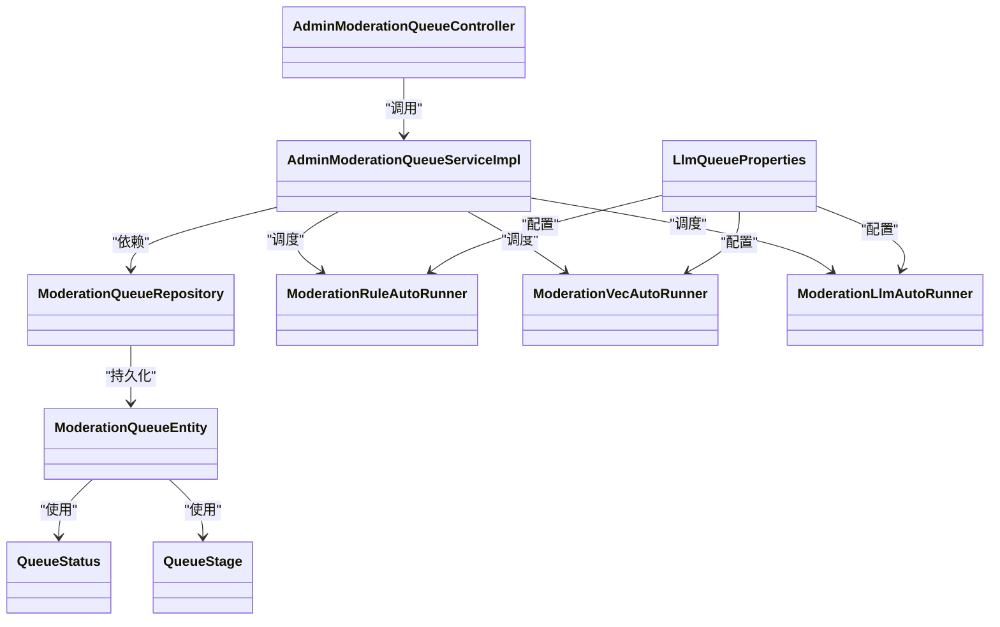

# 审核队列管理

<cite>
**本文引用的文件**
- [ModerationQueueEntity.java](file://src/main/java/com/example/EnterpriseRagCommunity/entity/moderation/ModerationQueueEntity.java)
- [QueueStatus.java](file://src/main/java/com/example/EnterpriseRagCommunity/entity/moderation/enums/QueueStatus.java)
- [QueueStage.java](file://src/main/java/com/example/EnterpriseRagCommunity/entity/moderation/enums/QueueStage.java)
- [ModerationQueueRepository.java](file://src/main/java/com/example/EnterpriseRagCommunity/repository/moderation/ModerationQueueRepository.java)
- [AdminModerationQueueServiceImpl.java](file://src/main/java/com/example/EnterpriseRagCommunity/service/moderation/impl/AdminModerationQueueServiceImpl.java)
- [LlmQueueProperties.java](file://src/main/java/com/example/EnterpriseRagCommunity/config/LlmQueueProperties.java)
- [ModerationRuleAutoRunner.java](file://src/main/java/com/example/EnterpriseRagCommunity/service/moderation/jobs/ModerationRuleAutoRunner.java)
- [ModerationVecAutoRunner.java](file://src/main/java/com/example/EnterpriseRagCommunity/service/moderation/jobs/ModerationVecAutoRunner.java)
- [ModerationLlmAutoRunner.java](file://src/main/java/com/example/EnterpriseRagCommunity/service/moderation/jobs/ModerationLlmAutoRunner.java)
- [AdminModerationQueueController.java](file://src/main/java/com/example/EnterpriseRagCommunity/controller/moderation/admin/AdminModerationQueueController.java)
- [queue.tsx](file://my-vite-app/src/pages/admin/forms/review/queue.tsx)
- [AdminModerationReviewTraceService.java](file://src/main/java/com/example/EnterpriseRagCommunity/service/moderation/trace/AdminModerationReviewTraceService.java)
- [AccountProfileController.java](file://src/main/java/com/example/EnterpriseRagCommunity/controller/AccountProfileController.java)
</cite>

## 目录
1. [引言](#引言)
2. [项目结构](#项目结构)
3. [核心组件](#核心组件)
4. [架构总览](#架构总览)
5. [详细组件分析](#详细组件分析)
6. [依赖关系分析](#依赖关系分析)
7. [性能考量](#性能考量)
8. [故障排查指南](#故障排查指南)
9. [结论](#结论)
10. [附录](#附录)

## 引言
本文件系统性阐述审核队列管理功能，覆盖任务生命周期（创建、入队、自动调度、人工处理、完成）、调度算法与优先级策略、批量处理、并发控制与锁机制、重试策略、监控指标、配置参数以及与人工审核员的协作机制（派发、进度跟踪、质量评估）。内容基于代码库中的实体、仓库、服务、控制器与前端页面实现进行归纳总结。

## 项目结构
审核队列相关代码主要分布在后端 Java 工程与前端 Vite 应用中：
- 后端核心：实体定义、枚举、仓库接口、自动运行器、管理员服务、控制器
- 前端：审核队列管理页面，包含任务列表、详情、动作操作与轮询刷新

图表来源
- [ModerationQueueEntity.java:1-70](file://src/main/java/com/example/EnterpriseRagCommunity/entity/moderation/ModerationQueueEntity.java#L1-L70)
- [ModerationQueueRepository.java:1-131](file://src/main/java/com/example/EnterpriseRagCommunity/repository/moderation/ModerationQueueRepository.java#L1-L131)
- [AdminModerationQueueServiceImpl.java:1-200](file://src/main/java/com/example/EnterpriseRagCommunity/service/moderation/impl/AdminModerationQueueServiceImpl.java#L1-L200)
- [ModerationRuleAutoRunner.java:132-594](file://src/main/java/com/example/EnterpriseRagCommunity/service/moderation/jobs/ModerationRuleAutoRunner.java#L132-L594)
- [ModerationVecAutoRunner.java:318-355](file://src/main/java/com/example/EnterpriseRagCommunity/service/moderation/jobs/ModerationVecAutoRunner.java#L318-L355)
- [ModerationLlmAutoRunner.java:190-227](file://src/main/java/com/example/EnterpriseRagCommunity/service/moderation/jobs/ModerationLlmAutoRunner.java#L190-L227)
- [AdminModerationQueueController.java:174-183](file://src/main/java/com/example/EnterpriseRagCommunity/controller/moderation/admin/AdminModerationQueueController.java#L174-L183)
- [LlmQueueProperties.java:1-16](file://src/main/java/com/example/EnterpriseRagCommunity/config/LlmQueueProperties.java#L1-L16)
- [queue.tsx:1111-1143](file://my-vite-app/src/pages/admin/forms/review/queue.tsx#L1111-L1143)

章节来源
- [ModerationQueueEntity.java:1-70](file://src/main/java/com/example/EnterpriseRagCommunity/entity/moderation/ModerationQueueEntity.java#L1-L70)
- [ModerationQueueRepository.java:1-131](file://src/main/java/com/example/EnterpriseRagCommunity/repository/moderation/ModerationQueueRepository.java#L1-L131)
- [AdminModerationQueueServiceImpl.java:1-200](file://src/main/java/com/example/EnterpriseRagCommunity/service/moderation/impl/AdminModerationQueueServiceImpl.java#L1-L200)
- [ModerationRuleAutoRunner.java:132-594](file://src/main/java/com/example/EnterpriseRagCommunity/service/moderation/jobs/ModerationRuleAutoRunner.java#L132-L594)
- [ModerationVecAutoRunner.java:318-355](file://src/main/java/com/example/EnterpriseRagCommunity/service/moderation/jobs/ModerationVecAutoRunner.java#L318-L355)
- [ModerationLlmAutoRunner.java:190-227](file://src/main/java/com/example/EnterpriseRagCommunity/service/moderation/jobs/ModerationLlmAutoRunner.java#L190-L227)
- [AdminModerationQueueController.java:174-183](file://src/main/java/com/example/EnterpriseRagCommunity/controller/moderation/admin/AdminModerationQueueController.java#L174-L183)
- [LlmQueueProperties.java:1-16](file://src/main/java/com/example/EnterpriseRagCommunity/config/LlmQueueProperties.java#L1-L16)
- [queue.tsx:1111-1143](file://my-vite-app/src/pages/admin/forms/review/queue.tsx#L1111-L1143)

## 核心组件
- 实体与枚举
  - 审核队列表实体承载任务关键字段：内容类型、内容ID、当前状态、当前阶段、优先级、指派给、锁定信息、版本号、时间戳等
  - 状态枚举：PENDING、REVIEWING、HUMAN、APPROVED、REJECTED
  - 阶段枚举：RULE、VEC、LLM、HUMAN
- 仓库接口
  - 提供按状态/阶段/指派/时间范围查询
  - 提供原子更新方法：尝试加锁、人工认领/释放、重排到自动、转人工、解锁、阶段/状态变更等
- 管理员服务
  - 列表查询、详情、动作（批准/驳回/转人工/重排/释放/认领/封禁作者）
  - 批量处理、补填历史、风险标签、索引可见性同步、审计日志写入
- 自动运行器
  - 规则阶段：执行规则决策，支持限流/反垃圾策略
  - 向量检索阶段：命中/未命中决策，映射下一阶段
  - LLM阶段：策略加载、运行追踪、超时处理、锁竞争
- 控制器
  - 暴露审核队列管理的 REST 接口，支持动作与批量重排
- 前端页面
  - 提供任务列表、详情、认领/释放/转人工/重排等操作，带轮询刷新与进度展示

章节来源
- [ModerationQueueEntity.java:13-69](file://src/main/java/com/example/EnterpriseRagCommunity/entity/moderation/ModerationQueueEntity.java#L13-L69)
- [QueueStatus.java:3-9](file://src/main/java/com/example/EnterpriseRagCommunity/entity/moderation/enums/QueueStatus.java#L3-L9)
- [QueueStage.java:3-8](file://src/main/java/com/example/EnterpriseRagCommunity/entity/moderation/enums/QueueStage.java#L3-L8)
- [ModerationQueueRepository.java:16-131](file://src/main/java/com/example/EnterpriseRagCommunity/repository/moderation/ModerationQueueRepository.java#L16-L131)
- [AdminModerationQueueServiceImpl.java:131-200](file://src/main/java/com/example/EnterpriseRagCommunity/service/moderation/impl/AdminModerationQueueServiceImpl.java#L131-L200)
- [ModerationRuleAutoRunner.java:132-594](file://src/main/java/com/example/EnterpriseRagCommunity/service/moderation/jobs/ModerationRuleAutoRunner.java#L132-L594)
- [ModerationVecAutoRunner.java:318-355](file://src/main/java/com/example/EnterpriseRagCommunity/service/moderation/jobs/ModerationVecAutoRunner.java#L318-L355)
- [ModerationLlmAutoRunner.java:190-227](file://src/main/java/com/example/EnterpriseRagCommunity/service/moderation/jobs/ModerationLlmAutoRunner.java#L190-L227)
- [AdminModerationQueueController.java:174-183](file://src/main/java/com/example/EnterpriseRagCommunity/controller/moderation/admin/AdminModerationQueueController.java#L174-L183)
- [queue.tsx:1111-1143](file://my-vite-app/src/pages/admin/forms/review/queue.tsx#L1111-L1143)

## 架构总览
审核队列采用“手动+自动”混合模式：规则阶段自动化决策，向量检索与 LLM 阶段可自动或人工介入；人工阶段由审核员认领与处理。系统通过数据库原子更新实现并发安全与锁控制，前端通过轮询与并行请求提升交互体验。

图表来源
- [AdminModerationQueueController.java:174-183](file://src/main/java/com/example/EnterpriseRagCommunity/controller/moderation/admin/AdminModerationQueueController.java#L174-L183)
- [AdminModerationQueueServiceImpl.java:131-200](file://src/main/java/com/example/EnterpriseRagCommunity/service/moderation/impl/AdminModerationQueueServiceImpl.java#L131-L200)
- [ModerationQueueRepository.java:32-99](file://src/main/java/com/example/EnterpriseRagCommunity/repository/moderation/ModerationQueueRepository.java#L32-L99)

## 详细组件分析

### 审核任务生命周期与状态机
- 生命周期阶段
  - RULE：规则阶段，执行预审策略与反垃圾检查
  - VEC：向量检索命中/未命中判定
  - LLM：LLM辅助审核
  - HUMAN：人工审核
- 状态流转
  - PENDING → RULE（创建/补填后进入）
  - RULE → VEC/LLM/HUMAN（根据策略与阈值）
  - VEC/LLM → HUMAN（需要人工复核）
  - HUMAN → APPROVED/REJECTED（人工审批）
  - 可重排至任意阶段（自动/人工），并清空锁定与指派

图表来源
- [QueueStage.java:3-8](file://src/main/java/com/example/EnterpriseRagCommunity/entity/moderation/enums/QueueStage.java#L3-L8)
- [QueueStatus.java:3-9](file://src/main/java/com/example/EnterpriseRagCommunity/entity/moderation/enums/QueueStatus.java#L3-L9)
- [ModerationVecAutoRunner.java:318-355](file://src/main/java/com/example/EnterpriseRagCommunity/service/moderation/jobs/ModerationVecAutoRunner.java#L318-L355)
- [ModerationLlmAutoRunner.java:190-227](file://src/main/java/com/example/EnterpriseRagCommunity/service/moderation/jobs/ModerationLlmAutoRunner.java#L190-L227)

章节来源
- [QueueStage.java:3-8](file://src/main/java/com/example/EnterpriseRagCommunity/entity/moderation/enums/QueueStage.java#L3-L8)
- [QueueStatus.java:3-9](file://src/main/java/com/example/EnterpriseRagCommunity/entity/moderation/enums/QueueStatus.java#L3-L9)
- [ModerationVecAutoRunner.java:318-355](file://src/main/java/com/example/EnterpriseRagCommunity/service/moderation/jobs/ModerationVecAutoRunner.java#L318-L355)
- [ModerationLlmAutoRunner.java:190-227](file://src/main/java/com/example/EnterpriseRagCommunity/service/moderation/jobs/ModerationLlmAutoRunner.java#L190-L227)

### 队列调度算法与优先级策略
- 优先级字段
  - 队列表实体包含 priority 字段，用于排序与筛选
- 查询与排序
  - 管理员服务支持按优先级上下界过滤与排序
  - 默认按创建时间降序，其次按 ID 降序
- 调度策略
  - 规则阶段：执行策略与反垃圾限制，决定是否放行或转入后续阶段
  - 向量检索阶段：根据命中情况映射下一阶段
  - LLM 阶段：加载策略配置，执行流水线步骤，超时则转入人工

章节来源
- [ModerationQueueEntity.java:45-46](file://src/main/java/com/example/EnterpriseRagCommunity/entity/moderation/ModerationQueueEntity.java#L45-L46)
- [AdminModerationQueueServiceImpl.java:131-200](file://src/main/java/com/example/EnterpriseRagCommunity/service/moderation/impl/AdminModerationQueueServiceImpl.java#L131-L200)
- [ModerationRuleAutoRunner.java:132-594](file://src/main/java/com/example/EnterpriseRagCommunity/service/moderation/jobs/ModerationRuleAutoRunner.java#L132-L594)
- [ModerationVecAutoRunner.java:318-355](file://src/main/java/com/example/EnterpriseRagCommunity/service/moderation/jobs/ModerationVecAutoRunner.java#L318-L355)
- [ModerationLlmAutoRunner.java:190-227](file://src/main/java/com/example/EnterpriseRagCommunity/service/moderation/jobs/ModerationLlmAutoRunner.java#L190-L227)

### 并发控制与锁机制
- 数据库层面的原子更新
  - 通过原生 JPQL 的 UPDATE 语句配合条件判断，确保仅当满足状态/阶段/锁定条件时才更新
  - 支持尝试加锁、解锁、阶段/状态变更、人工认领/释放、重排等
- 锁字段
  - lockedBy、lockedAt 记录自动运行器的锁定信息
- 事务与版本控制
  - 实体使用 @Version 字段，结合业务层逻辑保障并发一致性

图表来源
- [ModerationQueueRepository.java:32-99](file://src/main/java/com/example/EnterpriseRagCommunity/repository/moderation/ModerationQueueRepository.java#L32-L99)
- [ModerationQueueEntity.java:51-58](file://src/main/java/com/example/EnterpriseRagCommunity/entity/moderation/ModerationQueueEntity.java#L51-L58)

章节来源
- [ModerationQueueRepository.java:32-99](file://src/main/java/com/example/EnterpriseRagCommunity/repository/moderation/ModerationQueueRepository.java#L32-L99)
- [ModerationQueueEntity.java:51-58](file://src/main/java/com/example/EnterpriseRagCommunity/entity/moderation/ModerationQueueEntity.java#L51-L58)

### 重试策略与超时处理
- LLM 阶段超时
  - 当任务在 LLM 阶段挂起过久，自动转入人工阶段，避免长时间阻塞
- 规则阶段反垃圾限制
  - 对特定场景（如个人资料快照）进行日频次限制，超过阈值则触发人工复核
- 重试与回退
  - 自动运行器在异常情况下会跳过或回退到人工阶段，保证系统稳定性

章节来源
- [ModerationLlmAutoRunner.java:190-227](file://src/main/java/com/example/EnterpriseRagCommunity/service/moderation/jobs/ModerationLlmAutoRunner.java#L190-L227)
- [ModerationRuleAutoRunner.java:546-594](file://src/main/java/com/example/EnterpriseRagCommunity/service/moderation/jobs/ModerationRuleAutoRunner.java#L546-L594)

### 批量处理机制
- 批量重排
  - 支持对多个任务 ID 进行批量重排到自动阶段，指定目标状态与阶段
- 补填历史
  - 支持按内容类型、时间范围等条件补填历史任务，限制最大条数
- 批量认领/释放
  - 前端页面支持批量认领与释放，管理员服务内部通过原子更新实现

章节来源
- [AdminModerationQueueController.java:174-183](file://src/main/java/com/example/EnterpriseRagCommunity/controller/moderation/admin/AdminModerationQueueController.java#L174-L183)
- [AdminModerationQueueServiceImpl.java:841-861](file://src/main/java/com/example/EnterpriseRagCommunity/service/moderation/impl/AdminModerationQueueServiceImpl.java#L841-L861)

### 队列监控指标
- 前端轮询与进度展示
  - 页面对详情与分块进度进行并行拉取，动态显示运行/完成/失败分块数量与更新时间
- 运行轨迹与人工审核摘要
  - 通过审计日志聚合最近的人工审核记录，形成人工审核摘要
- 建议指标
  - 处理时延：从 RULE 入口到完成的平均耗时
  - 积压数量：各阶段待处理任务数
  - 成功率：通过/驳回比例
  - 并发度：同时处于 REVIEWING/HUMAN 的任务数
  - 超时率：LLM 阶段超时转入人工的比例

章节来源
- [queue.tsx:1174-1196](file://my-vite-app/src/pages/admin/forms/review/queue.tsx#L1174-L1196)
- [AdminModerationReviewTraceService.java:143-168](file://src/main/java/com/example/EnterpriseRagCommunity/service/moderation/trace/AdminModerationReviewTraceService.java#L143-L168)

### 队列配置参数
- 最大并发数：4
- 最大队列大小：5000
- 保留已完成任务数：200
- 历史保留天数：30

章节来源
- [LlmQueueProperties.java:10-15](file://src/main/java/com/example/EnterpriseRagCommunity/config/LlmQueueProperties.java#L10-L15)

### 与人工审核员的协作机制
- 任务派发
  - HUMAN 阶段支持认领（claimHuman）与释放（releaseHuman），防止资源争用
- 进度跟踪
  - 前端轮询详情与分块进度，实时反映处理进展
- 质量评估
  - 通过审计日志记录人工动作，生成人工审核摘要，便于质量评估与追溯

章节来源
- [ModerationQueueRepository.java:44-55](file://src/main/java/com/example/EnterpriseRagCommunity/repository/moderation/ModerationQueueRepository.java#L44-L55)
- [queue.tsx:1111-1143](file://my-vite-app/src/pages/admin/forms/review/queue.tsx#L1111-L1143)
- [AdminModerationReviewTraceService.java:143-168](file://src/main/java/com/example/EnterpriseRagCommunity/service/moderation/trace/AdminModerationReviewTraceService.java#L143-L168)

## 依赖关系分析
- 组件耦合
  - 管理员服务依赖仓库接口与多个领域服务（用户、通知、索引同步、审计等）
  - 自动运行器依赖策略配置与流水线追踪服务
- 外部依赖
  - 数据库（JPA/Hibernate）提供原子更新与事务支持
  - 前端通过 REST 接口与后端交互

图表来源
- [ModerationQueueEntity.java:1-70](file://src/main/java/com/example/EnterpriseRagCommunity/entity/moderation/ModerationQueueEntity.java#L1-L70)
- [ModerationQueueRepository.java:1-131](file://src/main/java/com/example/EnterpriseRagCommunity/repository/moderation/ModerationQueueRepository.java#L1-L131)
- [AdminModerationQueueServiceImpl.java:70-130](file://src/main/java/com/example/EnterpriseRagCommunity/service/moderation/impl/AdminModerationQueueServiceImpl.java#L70-L130)
- [ModerationRuleAutoRunner.java:132-594](file://src/main/java/com/example/EnterpriseRagCommunity/service/moderation/jobs/ModerationRuleAutoRunner.java#L132-L594)
- [ModerationVecAutoRunner.java:318-355](file://src/main/java/com/example/EnterpriseRagCommunity/service/moderation/jobs/ModerationVecAutoRunner.java#L318-L355)
- [ModerationLlmAutoRunner.java:190-227](file://src/main/java/com/example/EnterpriseRagCommunity/service/moderation/jobs/ModerationLlmAutoRunner.java#L190-L227)
- [AdminModerationQueueController.java:174-183](file://src/main/java/com/example/EnterpriseRagCommunity/controller/moderation/admin/AdminModerationQueueController.java#L174-L183)
- [LlmQueueProperties.java:1-16](file://src/main/java/com/example/EnterpriseRagCommunity/config/LlmQueueProperties.java#L1-L16)

章节来源
- [ModerationQueueEntity.java:1-70](file://src/main/java/com/example/EnterpriseRagCommunity/entity/moderation/ModerationQueueEntity.java#L1-L70)
- [ModerationQueueRepository.java:1-131](file://src/main/java/com/example/EnterpriseRagCommunity/repository/moderation/ModerationQueueRepository.java#L1-L131)
- [AdminModerationQueueServiceImpl.java:70-130](file://src/main/java/com/example/EnterpriseRagCommunity/service/moderation/impl/AdminModerationQueueServiceImpl.java#L70-L130)
- [ModerationRuleAutoRunner.java:132-594](file://src/main/java/com/example/EnterpriseRagCommunity/service/moderation/jobs/ModerationRuleAutoRunner.java#L132-L594)
- [ModerationVecAutoRunner.java:318-355](file://src/main/java/com/example/EnterpriseRagCommunity/service/moderation/jobs/ModerationVecAutoRunner.java#L318-L355)
- [ModerationLlmAutoRunner.java:190-227](file://src/main/java/com/example/EnterpriseRagCommunity/service/moderation/jobs/ModerationLlmAutoRunner.java#L190-L227)
- [AdminModerationQueueController.java:174-183](file://src/main/java/com/example/EnterpriseRagCommunity/controller/moderation/admin/AdminModerationQueueController.java#L174-L183)
- [LlmQueueProperties.java:1-16](file://src/main/java/com/example/EnterpriseRagCommunity/config/LlmQueueProperties.java#L1-L16)

## 性能考量
- 查询优化
  - 使用 Specification 动态拼接条件，避免全表扫描
  - 对常用过滤字段（状态、阶段、指派、时间范围）建立索引
- 并发与锁
  - 原子更新减少锁竞争，合理设置最大并发数与队列上限
- 批量处理
  - 批量重排与补填应限制单次规模，避免数据库压力过大
- 前端轮询
  - 合理的轮询间隔与并行请求，避免对后端造成过多压力

## 故障排查指南
- 无法认领任务
  - 检查任务状态是否为 HUMAN，是否已被他人锁定
  - 查看原子更新返回值，确认影响行数
- 转人工失败
  - 确认任务当前状态允许转入人工，且阶段正确
- LLM 阶段超时
  - 检查策略配置是否完整，网络与上游服务是否可用
- 前端进度不更新
  - 检查轮询逻辑与并行请求是否正常，关注 suppressAt 与更新时间判断

章节来源
- [ModerationQueueRepository.java:44-55](file://src/main/java/com/example/EnterpriseRagCommunity/repository/moderation/ModerationQueueRepository.java#L44-L55)
- [queue.tsx:1174-1196](file://my-vite-app/src/pages/admin/forms/review/queue.tsx#L1174-L1196)

## 结论
该审核队列系统以“规则驱动 + 人工复核”的混合模式实现高效、可控的内容治理。通过数据库原子更新与锁机制保障并发安全，自动运行器与策略配置实现智能化分流，前端轮询与进度展示提升可观测性。建议在生产环境中结合监控指标持续优化策略阈值与并发配置，确保吞吐与稳定性平衡。

## 附录
- 关键流程：内容创建后入队，规则阶段决策，向量/LLM辅助，人工复核，最终完成
- 前端交互：认领/释放/转人工/重排等动作均通过 REST 接口与后端交互