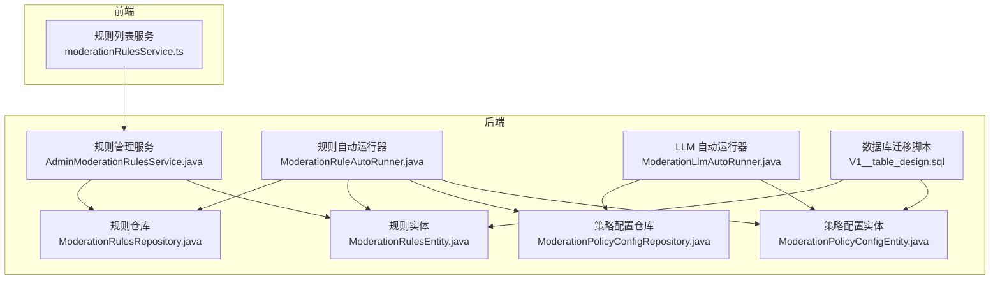
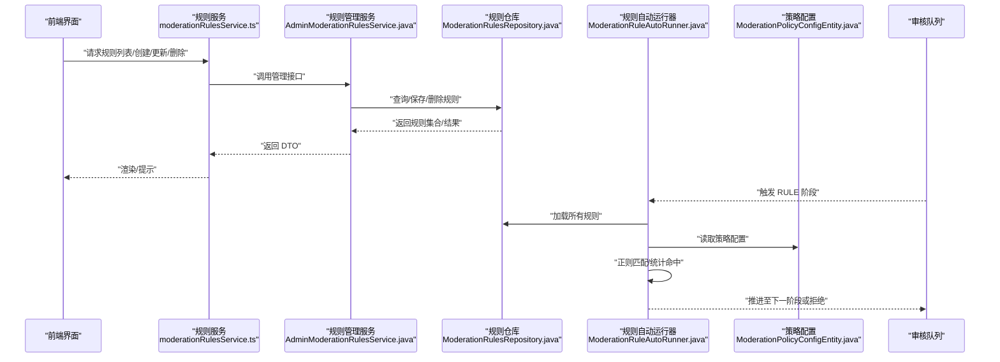
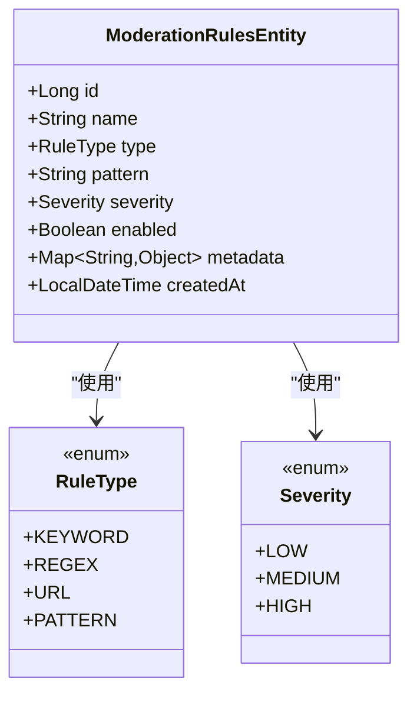
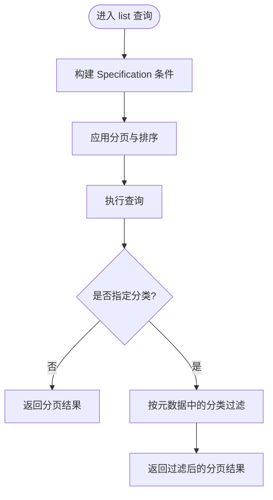
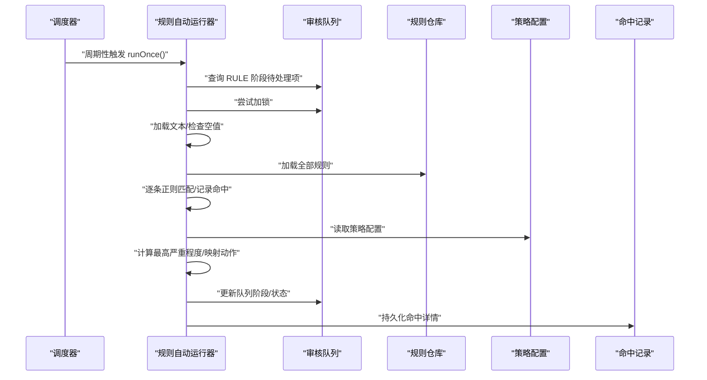
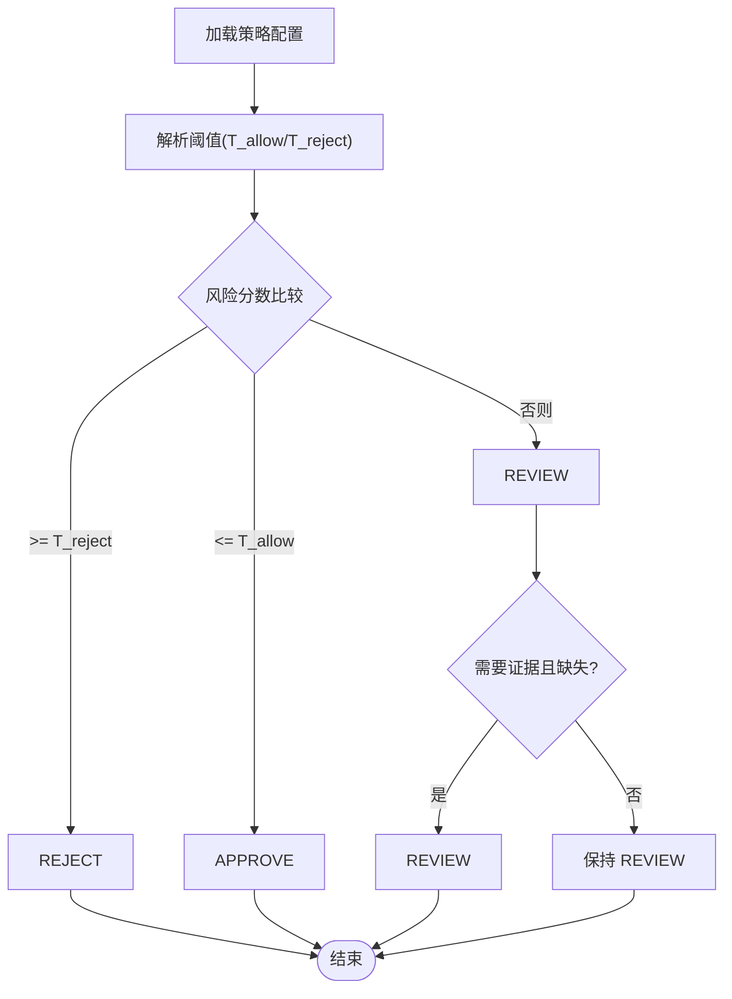
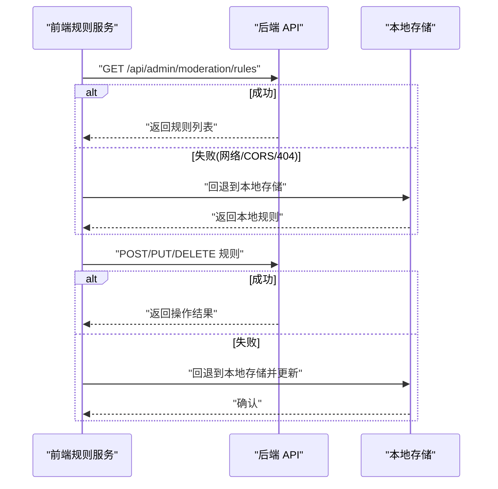
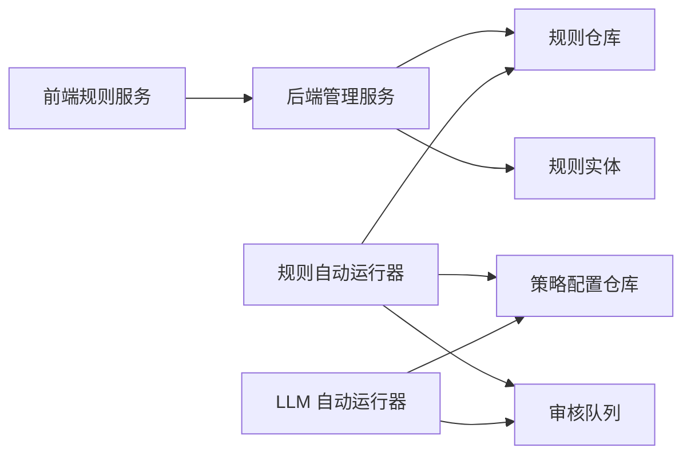

# 规则引擎

<cite>
**本文引用的文件**
- [moderationRulesService.ts](file://my-vite-app/src/services/moderationRulesService.ts)
- [ModerationRulesEntity.java](file://src/main/java/com/example/EnterpriseRagCommunity/entity/moderation/ModerationRulesEntity.java)
- [ModerationRulesRepository.java](file://src/main/java/com/example/EnterpriseRagCommunity/repository/moderation/ModerationRulesRepository.java)
- [AdminModerationRulesService.java](file://src/main/java/com/example/EnterpriseRagCommunity/service/moderation/admin/AdminModerationRulesService.java)
- [ModerationRuleAutoRunner.java](file://src/main/java/com/example/EnterpriseRagCommunity/service/moderation/jobs/ModerationRuleAutoRunner.java)
- [ModerationLlmAutoRunner.java](file://src/main/java/com/example/EnterpriseRagCommunity/service/moderation/jobs/ModerationLlmAutoRunner.java)
- [ModerationPolicyConfigEntity.java](file://src/main/java/com/example/EnterpriseRagCommunity/entity/moderation/ModerationPolicyConfigEntity.java)
- [ModerationPolicyConfigRepository.java](file://src/main/java/com/example/EnterpriseRagCommunity/repository/moderation/ModerationPolicyConfigRepository.java)
- [V1__table_design.sql](file://src/main/resources/db/migration/V1__table_design.sql)
- [RuleType.java](file://src/main/java/com/example/EnterpriseRagCommunity/entity/moderation/enums/RuleType.java)
- [Severity.java](file://src/main/java/com/example/EnterpriseRagCommunity/entity/moderation/enums/Severity.java)
- [ContentType.java](file://src/main/java/com/example/EnterpriseRagCommunity/entity/moderation/enums/ContentType.java)
</cite>

## 目录
1. [引言](#引言)
2. [项目结构](#项目结构)
3. [核心组件](#核心组件)
4. [架构总览](#架构总览)
5. [详细组件分析](#详细组件分析)
6. [依赖分析](#依赖分析)
7. [性能考虑](#性能考虑)
8. [故障排查指南](#故障排查指南)
9. [结论](#结论)
10. [附录](#附录)

## 引言
本技术文档围绕“规则引擎”展开，系统性阐述审核规则的定义、存储、匹配与执行机制，覆盖规则类型（敏感词、模式匹配、内容特征等）、规则优先级与组合逻辑、性能优化策略（规则缓存、预编译正则表达式、索引优化）、规则配置示例与最佳实践、测试与调试方法，以及规则引擎与审核队列的集成方式和规则更新的热部署机制。目标是帮助开发者与运维人员快速理解并高效使用该规则引擎。

## 项目结构
规则引擎相关代码主要分布在后端 Java 服务与前端 TypeScript 服务两部分：
- 后端：规则实体、仓库、管理服务、规则自动运行器、LLM 决策运行器、策略配置实体与仓库、数据库迁移脚本。
- 前端：规则列表、增删改 API 调用与本地回退逻辑。

图表来源
- [moderationRulesService.ts:102-131](file://my-vite-app/src/services/moderationRulesService.ts#L102-L131)
- [ModerationRulesEntity.java:12-53](file://src/main/java/com/example/EnterpriseRagCommunity/entity/moderation/ModerationRulesEntity.java#L12-L53)
- [ModerationRulesRepository.java:13-25](file://src/main/java/com/example/EnterpriseRagCommunity/repository/moderation/ModerationRulesRepository.java#L13-L25)
- [AdminModerationRulesService.java:26-37](file://src/main/java/com/example/EnterpriseRagCommunity/service/moderation/admin/AdminModerationRulesService.java#L26-L37)
- [ModerationRuleAutoRunner.java:41-91](file://src/main/java/com/example/EnterpriseRagCommunity/service/moderation/jobs/ModerationRuleAutoRunner.java#L41-L91)
- [ModerationLlmAutoRunner.java:71-101](file://src/main/java/com/example/EnterpriseRagCommunity/service/moderation/jobs/ModerationLlmAutoRunner.java#L71-L101)
- [ModerationPolicyConfigEntity.java:12-47](file://src/main/java/com/example/EnterpriseRagCommunity/entity/moderation/ModerationPolicyConfigEntity.java#L12-L47)
- [ModerationPolicyConfigRepository.java:10-12](file://src/main/java/com/example/EnterpriseRagCommunity/repository/moderation/ModerationPolicyConfigRepository.java#L10-L12)
- [V1__table_design.sql:814-844](file://src/main/resources/db/migration/V1__table_design.sql#L814-L844)

章节来源
- [moderationRulesService.ts:102-131](file://my-vite-app/src/services/moderationRulesService.ts#L102-L131)
- [ModerationRulesEntity.java:12-53](file://src/main/java/com/example/EnterpriseRagCommunity/entity/moderation/ModerationRulesEntity.java#L12-L53)
- [ModerationRulesRepository.java:13-25](file://src/main/java/com/example/EnterpriseRagCommunity/repository/moderation/ModerationRulesRepository.java#L13-L25)
- [AdminModerationRulesService.java:26-37](file://src/main/java/com/example/EnterpriseRagCommunity/service/moderation/admin/AdminModerationRulesService.java#L26-L37)
- [ModerationRuleAutoRunner.java:41-91](file://src/main/java/com/example/EnterpriseRagCommunity/service/moderation/jobs/ModerationRuleAutoRunner.java#L41-L91)
- [ModerationLlmAutoRunner.java:71-101](file://src/main/java/com/example/EnterpriseRagCommunity/service/moderation/jobs/ModerationLlmAutoRunner.java#L71-L101)
- [ModerationPolicyConfigEntity.java:12-47](file://src/main/java/com/example/EnterpriseRagCommunity/entity/moderation/ModerationPolicyConfigEntity.java#L12-L47)
- [ModerationPolicyConfigRepository.java:10-12](file://src/main/java/com/example/EnterpriseRagCommunity/repository/moderation/ModerationPolicyConfigRepository.java#L10-L12)
- [V1__table_design.sql:814-844](file://src/main/resources/db/migration/V1__table_design.sql#L814-L844)

## 核心组件
- 规则实体与仓库：定义规则字段（名称、类型、模式、严重程度、启用状态、元数据），并提供按条件查询能力。
- 管理服务：提供规则的分页查询、创建、更新、删除，并记录审计日志。
- 规则自动运行器：扫描待处理队列，加载文本，逐条匹配规则，统计命中并决定下一步动作。
- LLM 自动运行器：在 LLM/人工阶段根据策略阈值与标签阈值进行最终决策。
- 策略配置：基于内容类型的策略版本与配置，驱动规则与 LLM 的行为。
- 前端规则服务：提供规则列表、创建、更新、删除的 API 调用，并在网络异常时回退到本地存储。

章节来源
- [ModerationRulesEntity.java:12-53](file://src/main/java/com/example/EnterpriseRagCommunity/entity/moderation/ModerationRulesEntity.java#L12-L53)
- [ModerationRulesRepository.java:13-25](file://src/main/java/com/example/EnterpriseRagCommunity/repository/moderation/ModerationRulesRepository.java#L13-L25)
- [AdminModerationRulesService.java:26-37](file://src/main/java/com/example/EnterpriseRagCommunity/service/moderation/admin/AdminModerationRulesService.java#L26-L37)
- [ModerationRuleAutoRunner.java:262-437](file://src/main/java/com/example/EnterpriseRagCommunity/service/moderation/jobs/ModerationRuleAutoRunner.java#L262-L437)
- [ModerationLlmAutoRunner.java:1883-1931](file://src/main/java/com/example/EnterpriseRagCommunity/service/moderation/jobs/ModerationLlmAutoRunner.java#L1883-L1931)
- [ModerationPolicyConfigEntity.java:12-47](file://src/main/java/com/example/EnterpriseRagCommunity/entity/moderation/ModerationPolicyConfigEntity.java#L12-L47)
- [moderationRulesService.ts:102-216](file://my-vite-app/src/services/moderationRulesService.ts#L102-L216)

## 架构总览
规则引擎贯穿“规则定义—持久化—匹配执行—决策—队列流转”的完整链路，前端负责规则管理与本地回退，后端负责规则匹配与策略决策，并通过队列驱动后续流程。

图表来源
- [moderationRulesService.ts:102-131](file://my-vite-app/src/services/moderationRulesService.ts#L102-L131)
- [AdminModerationRulesService.java:39-79](file://src/main/java/com/example/EnterpriseRagCommunity/service/moderation/admin/AdminModerationRulesService.java#L39-L79)
- [ModerationRulesRepository.java:13-25](file://src/main/java/com/example/EnterpriseRagCommunity/repository/moderation/ModerationRulesRepository.java#L13-L25)
- [ModerationRuleAutoRunner.java:61-91](file://src/main/java/com/example/EnterpriseRagCommunity/service/moderation/jobs/ModerationRuleAutoRunner.java#L61-L91)
- [ModerationPolicyConfigEntity.java:12-47](file://src/main/java/com/example/EnterpriseRagCommunity/entity/moderation/ModerationPolicyConfigEntity.java#L12-L47)

## 详细组件分析

### 规则类型与优先级
- 规则类型：关键词、正则、URL、模式（枚举定义见 RuleType）。
- 严重程度：低、中、高（枚举定义见 Severity）。
- 优先级：规则自动运行器按队列优先级降序、创建时间升序进行处理；规则匹配时以最高严重程度决定动作。

图表来源
- [ModerationRulesEntity.java:12-53](file://src/main/java/com/example/EnterpriseRagCommunity/entity/moderation/ModerationRulesEntity.java#L12-L53)
- [RuleType.java:3-8](file://src/main/java/com/example/EnterpriseRagCommunity/entity/moderation/enums/RuleType.java#L3-L8)
- [Severity.java:3-7](file://src/main/java/com/example/EnterpriseRagCommunity/entity/moderation/enums/Severity.java#L3-L7)

章节来源
- [ModerationRulesEntity.java:12-53](file://src/main/java/com/example/EnterpriseRagCommunity/entity/moderation/ModerationRulesEntity.java#L12-L53)
- [RuleType.java:3-8](file://src/main/java/com/example/EnterpriseRagCommunity/entity/moderation/enums/RuleType.java#L3-L8)
- [Severity.java:3-7](file://src/main/java/com/example/EnterpriseRagCommunity/entity/moderation/enums/Severity.java#L3-L7)
- [ModerationRuleAutoRunner.java:78-80](file://src/main/java/com/example/EnterpriseRagCommunity/service/moderation/jobs/ModerationRuleAutoRunner.java#L78-L80)

### 规则存储与查询
- 实体字段：名称、类型、模式、严重程度、启用状态、元数据、创建时间。
- 仓库接口：支持按启用状态、类型、严重程度、时间范围等条件查询。
- 管理服务：实现分页查询（支持关键字、类型、严重程度、启用状态、分类过滤），并记录审计差异。

图表来源
- [AdminModerationRulesService.java:39-79](file://src/main/java/com/example/EnterpriseRagCommunity/service/moderation/admin/AdminModerationRulesService.java#L39-L79)
- [ModerationRulesRepository.java:13-25](file://src/main/java/com/example/EnterpriseRagCommunity/repository/moderation/ModerationRulesRepository.java#L13-L25)

章节来源
- [ModerationRulesEntity.java:12-53](file://src/main/java/com/example/EnterpriseRagCommunity/entity/moderation/ModerationRulesEntity.java#L12-L53)
- [ModerationRulesRepository.java:13-25](file://src/main/java/com/example/EnterpriseRagCommunity/repository/moderation/ModerationRulesRepository.java#L13-L25)
- [AdminModerationRulesService.java:39-79](file://src/main/java/com/example/EnterpriseRagCommunity/service/moderation/admin/AdminModerationRulesService.java#L39-L79)

### 规则匹配与执行机制
- 扫描与锁定：定时扫描 RULE 阶段的待处理队列，尝试加锁避免并发重复处理。
- 文本加载与空值处理：加载内容文本，若为空则跳过规则阶段。
- 正则匹配：逐条加载规则，预编译正则（忽略大小写与 Unicode），匹配成功记录命中详情与片段。
- 命中统计：统计命中数与最高严重程度，依据策略配置映射到下一阶段（LLM/VEC/HUMAN）或直接拒绝。
- 反垃圾策略：针对评论与资料更新的窗口速率限制，命中直接转人工。

图表来源
- [ModerationRuleAutoRunner.java:61-91](file://src/main/java/com/example/EnterpriseRagCommunity/service/moderation/jobs/ModerationRuleAutoRunner.java#L61-L91)
- [ModerationRuleAutoRunner.java:107-131](file://src/main/java/com/example/EnterpriseRagCommunity/service/moderation/jobs/ModerationRuleAutoRunner.java#L107-L131)
- [ModerationRuleAutoRunner.java:196-214](file://src/main/java/com/example/EnterpriseRagCommunity/service/moderation/jobs/ModerationRuleAutoRunner.java#L196-L214)
- [ModerationRuleAutoRunner.java:262-335](file://src/main/java/com/example/EnterpriseRagCommunity/service/moderation/jobs/ModerationRuleAutoRunner.java#L262-L335)
- [ModerationRuleAutoRunner.java:360-403](file://src/main/java/com/example/EnterpriseRagCommunity/service/moderation/jobs/ModerationRuleAutoRunner.java#L360-L403)

章节来源
- [ModerationRuleAutoRunner.java:291-296](file://src/main/java/com/example/EnterpriseRagCommunity/service/moderation/jobs/ModerationRuleAutoRunner.java#L291-L296)
- [ModerationRuleAutoRunner.java:360-403](file://src/main/java/com/example/EnterpriseRagCommunity/service/moderation/jobs/ModerationRuleAutoRunner.java#L360-L403)

### 策略配置与阈值决策
- 策略配置实体：按内容类型维护策略版本与 JSON 配置，含预检规则动作、阈值、反垃圾参数等。
- LLM 决策：根据建议动作、风险分数与阈值（默认/按审查阶段/按标签）判定 APPROVE/REJECT/REVIEW，并结合证据要求与标签阈值进行调整。

图表来源
- [ModerationLlmAutoRunner.java:1883-1931](file://src/main/java/com/example/EnterpriseRagCommunity/service/moderation/jobs/ModerationLlmAutoRunner.java#L1883-L1931)
- [ModerationPolicyConfigEntity.java:12-47](file://src/main/java/com/example/EnterpriseRagCommunity/entity/moderation/ModerationPolicyConfigEntity.java#L12-L47)

章节来源
- [ModerationLlmAutoRunner.java:1883-1931](file://src/main/java/com/example/EnterpriseRagCommunity/service/moderation/jobs/ModerationLlmAutoRunner.java#L1883-L1931)
- [ModerationPolicyConfigEntity.java:12-47](file://src/main/java/com/example/EnterpriseRagCommunity/entity/moderation/ModerationPolicyConfigEntity.java#L12-L47)

### 前端规则管理与本地回退
- 列表：支持关键字、类型、严重程度、启用状态、分类过滤；兼容后端返回格式。
- 创建/更新/删除：携带 CSRF Token，网络异常时回退到浏览器本地存储（localStorage）。
- 分类推断：根据元数据 category/type/tags 推断分类（敏感/黑名单/URL/广告）。

图表来源
- [moderationRulesService.ts:102-131](file://my-vite-app/src/services/moderationRulesService.ts#L102-L131)
- [moderationRulesService.ts:133-162](file://my-vite-app/src/services/moderationRulesService.ts#L133-L162)
- [moderationRulesService.ts:164-195](file://my-vite-app/src/services/moderationRulesService.ts#L164-L195)
- [moderationRulesService.ts:197-215](file://my-vite-app/src/services/moderationRulesService.ts#L197-L215)

章节来源
- [moderationRulesService.ts:102-131](file://my-vite-app/src/services/moderationRulesService.ts#L102-L131)
- [moderationRulesService.ts:51-78](file://my-vite-app/src/services/moderationRulesService.ts#L51-L78)

## 依赖分析
- 组件耦合：规则自动运行器依赖规则仓库、策略配置仓库、队列服务与审计日志；管理服务依赖仓库与审计工具；前端服务依赖后端 API 与本地存储。
- 外部依赖：JPA Specification、Spring 定时任务、正则表达式编译、JSON 配置解析。
- 潜在循环：当前模块未发现循环依赖迹象。

图表来源
- [moderationRulesService.ts:102-131](file://my-vite-app/src/services/moderationRulesService.ts#L102-L131)
- [AdminModerationRulesService.java:26-37](file://src/main/java/com/example/EnterpriseRagCommunity/service/moderation/admin/AdminModerationRulesService.java#L26-L37)
- [ModerationRulesRepository.java:13-25](file://src/main/java/com/example/EnterpriseRagCommunity/repository/moderation/ModerationRulesRepository.java#L13-L25)
- [ModerationRuleAutoRunner.java:41-91](file://src/main/java/com/example/EnterpriseRagCommunity/service/moderation/jobs/ModerationRuleAutoRunner.java#L41-L91)
- [ModerationLlmAutoRunner.java:71-101](file://src/main/java/com/example/EnterpriseRagCommunity/service/moderation/jobs/ModerationLlmAutoRunner.java#L71-L101)

章节来源
- [ModerationRuleAutoRunner.java:41-91](file://src/main/java/com/example/EnterpriseRagCommunity/service/moderation/jobs/ModerationRuleAutoRunner.java#L41-L91)
- [ModerationLlmAutoRunner.java:71-101](file://src/main/java/com/example/EnterpriseRagCommunity/service/moderation/jobs/ModerationLlmAutoRunner.java#L71-L101)

## 性能考虑
- 规则缓存
  - 风险标签阈值缓存：LLM 运行器内维护风险标签阈值缓存与加载时间戳，减少重复解析开销。
  - 建议：可扩展为规则模式缓存（预编译正则对象）与策略配置缓存，结合版本号或时间戳失效。
- 预编译正则表达式
  - 规则匹配阶段已对每条规则进行预编译（忽略大小写与 Unicode），避免重复编译成本。
  - 建议：在热点规则上增加内存缓存，按规则 ID 或模式哈希索引，降低编译与查找成本。
- 索引优化
  - 数据库迁移脚本中包含访问日志查询索引，建议为规则表的启用状态、类型、严重程度、创建时间建立复合索引，提升分页与过滤查询性能。
- 并发与限流
  - 规则自动运行器对队列项加锁并限制并发数量，避免重复处理与资源争用。
  - 建议：为 LLM 阶段设置独立并发上限，结合队列状态与优先级进行更细粒度调度。
- I/O 优化
  - 前端在网络异常时回退本地存储，减少后端压力；建议对规则列表分页与本地缓存同步策略进行优化，避免频繁 IO。

章节来源
- [ModerationLlmAutoRunner.java:102-104](file://src/main/java/com/example/EnterpriseRagCommunity/service/moderation/jobs/ModerationLlmAutoRunner.java#L102-L104)
- [ModerationRuleAutoRunner.java:291-296](file://src/main/java/com/example/EnterpriseRagCommunity/service/moderation/jobs/ModerationRuleAutoRunner.java#L291-L296)
- [V1__table_design.sql:814-844](file://src/main/resources/db/migration/V1__table_design.sql#L814-L844)

## 故障排查指南
- 规则匹配失败
  - 检查规则启用状态与模式是否为空；确认正则表达式是否有效。
  - 查看命中记录与队列阶段变更日志，定位具体规则与触发原因。
- 队列卡住
  - 检查队列加锁状态与过期时间；确认当前阶段与状态是否符合预期。
  - 关注规则自动运行器的日志输出，定位异常抛出位置。
- 策略配置问题
  - 校验策略配置 JSON 结构与键路径；确认预检规则开关与阈值是否正确。
  - 若策略缺失，检查默认回退配置是否生效。
- 前端异常回退
  - 当后端不可用时，前端会回退到本地存储；检查本地存储内容与网络错误信息，必要时手动同步。

章节来源
- [ModerationRuleAutoRunner.java:71-74](file://src/main/java/com/example/EnterpriseRagCommunity/service/moderation/jobs/ModerationRuleAutoRunner.java#L71-L74)
- [ModerationRuleAutoRunner.java:117-130](file://src/main/java/com/example/EnterpriseRagCommunity/service/moderation/jobs/ModerationRuleAutoRunner.java#L117-L130)
- [moderationRulesService.ts:92-100](file://my-vite-app/src/services/moderationRulesService.ts#L92-L100)

## 结论
该规则引擎以“规则实体—仓库—管理服务—自动运行器—策略配置—队列联动”为核心闭环，具备明确的规则类型、优先级与组合逻辑，配合前端本地回退与后端并发控制，实现了稳定高效的审核规则执行。通过缓存、预编译与索引优化等手段，可在高并发场景下进一步提升性能。建议持续完善规则缓存策略与数据库索引设计，并加强监控与告警体系，保障线上稳定性。

## 附录

### 规则类型与含义
- 关键词（KEYWORD）：简单字符串匹配。
- 正则（REGEX）：支持预编译的正则表达式匹配。
- URL（URL）：URL 类型规则，分类推断为 URL。
- 模式（PATTERN）：通用模式匹配，常用于复杂规则。

章节来源
- [RuleType.java:3-8](file://src/main/java/com/example/EnterpriseRagCommunity/entity/moderation/enums/RuleType.java#L3-L8)

### 严重程度与动作映射
- 低/中/高严重程度分别映射到不同预检动作（如 LLM/VEC/HUMAN/拒绝），由策略配置决定最终下一阶段。

章节来源
- [ModerationRuleAutoRunner.java:360-364](file://src/main/java/com/example/EnterpriseRagCommunity/service/moderation/jobs/ModerationRuleAutoRunner.java#L360-L364)

### 内容类型与策略配置
- 支持的内容类型：帖子（POST）、评论（COMMENT）、资料（PROFILE）。
- 策略配置包含预检规则开关与动作、阈值、反垃圾参数等。

章节来源
- [ContentType.java:3-7](file://src/main/java/com/example/EnterpriseRagCommunity/entity/moderation/enums/ContentType.java#L3-L7)
- [ModerationPolicyConfigEntity.java:12-47](file://src/main/java/com/example/EnterpriseRagCommunity/entity/moderation/ModerationPolicyConfigEntity.java#L12-L47)
- [V1__table_design.sql:814-844](file://src/main/resources/db/migration/V1__table_design.sql#L814-L844)

### 规则配置示例与最佳实践
- 配置示例：参考数据库迁移脚本中的策略配置样例，包含预检规则、阈值、反垃圾参数等。
- 最佳实践：
  - 将高频规则置于前排，利用优先级与加锁机制保证处理效率。
  - 对复杂正则进行预编译与缓存，避免重复编译。
  - 为规则表建立必要的数据库索引，优化分页与过滤查询。
  - 在前端实现网络异常回退，确保管理体验连续性。
  - 使用审计日志追踪规则变更，便于回溯与合规检查。

章节来源
- [V1__table_design.sql:814-844](file://src/main/resources/db/migration/V1__table_design.sql#L814-L844)
- [moderationRulesService.ts:92-100](file://my-vite-app/src/services/moderationRulesService.ts#L92-L100)