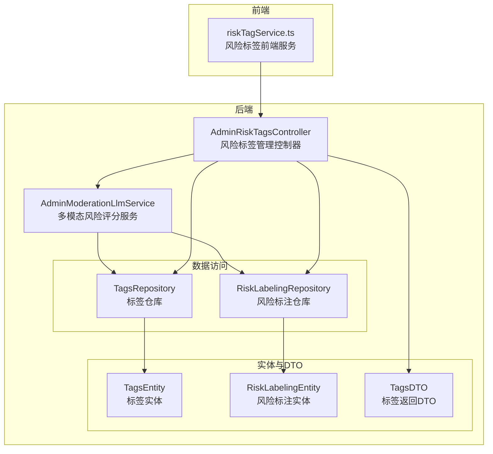
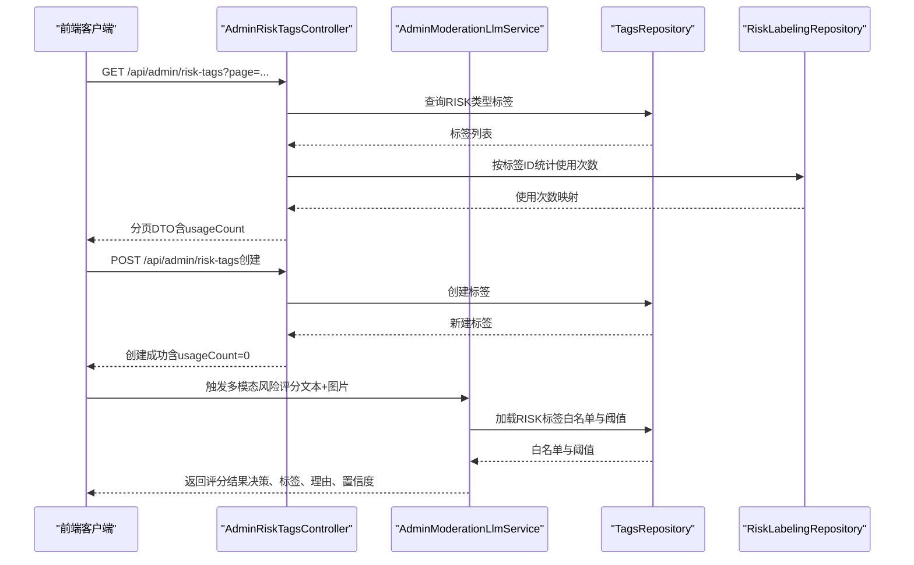
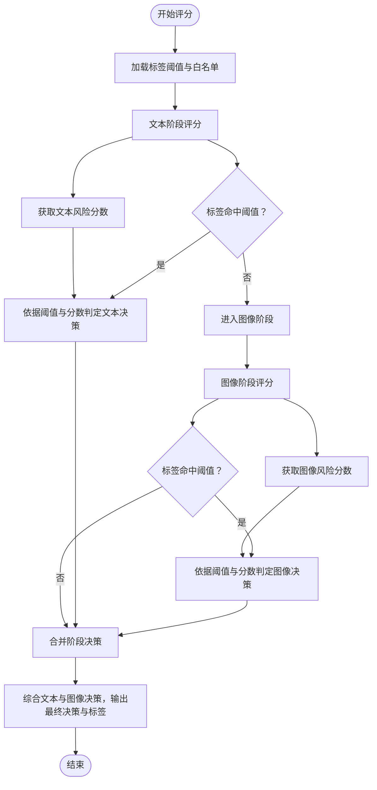
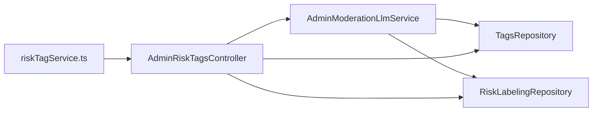

# 风险标签

<cite>
**本文档引用的文件**
- [AdminRiskTagsController.java](file://src/main/java/com/example/EnterpriseRagCommunity/controller/moderation/admin/AdminRiskTagsController.java)
- [AdminModerationLlmService.java](file://src/main/java/com/example/EnterpriseRagCommunity/service/moderation/admin/AdminModerationLlmService.java)
- [TagsRepository.java](file://src/main/java/com/example/EnterpriseRagCommunity/repository/content/TagsRepository.java)
- [RiskLabelingRepository.java](file://src/main/java/com/example/EnterpriseRagCommunity/repository/moderation/RiskLabelingRepository.java)
- [TagsEntity.java](file://src/main/java/com/example/EnterpriseRagCommunity/entity/content/TagsEntity.java)
- [RiskLabelingEntity.java](file://src/main/java/com/example/EnterpriseRagCommunity/entity/moderation/RiskLabelingEntity.java)
- [TagsDTO.java](file://src/main/java/com/example/EnterpriseRagCommunity/dto/content/TagsDTO.java)
- [TagType.java](file://src/main/java/com/example/EnterpriseRagCommunity/entity/content/enums/TagType.java)
- [riskTagService.ts](file://my-vite-app/src/services/riskTagService.ts)
- [AdminModerationLlmServiceRiskTagsWhitelistTest.java](file://src/test/java/com/example/EnterpriseRagCommunity/service/moderation/admin/AdminModerationLlmServiceRiskTagsWhitelistTest.java)
- [AdminRiskTagsControllerBranchTest.java](file://src/test/java/com/example/EnterpriseRagCommunity/controller/moderation/admin/AdminRiskTagsControllerBranchTest.java)
</cite>

## 目录
1. [引言](#引言)
2. [项目结构](#项目结构)
3. [核心组件](#核心组件)
4. [架构总览](#架构总览)
5. [详细组件分析](#详细组件分析)
6. [依赖分析](#依赖分析)
7. [性能考虑](#性能考虑)
8. [故障排查指南](#故障排查指南)
9. [结论](#结论)
10. [附录](#附录)

## 引言
本文件面向风险标签系统的功能与实现，围绕以下目标展开：定义与分类、权重与阈值、评分与决策、标签体系设计原则（层级与关系）、动态调整策略；解释文本分析、情感识别、主题建模等技术手段在评分中的作用；文档化自动化生成与人工校准流程；给出风险标签API接口规范；并说明在内容推荐、用户管理、平台治理中的应用场景与效果评估方法。

## 项目结构
风险标签系统主要由后端控制器、服务层、数据访问层与前端服务组成：
- 后端控制器负责对外暴露风险标签的增删改查与审计日志；
- 服务层负责风险标签的白名单过滤、阈值判定、多阶段决策与最终结果封装；
- 数据访问层负责标签与标注记录的持久化与统计；
- 前端服务负责调用后端API进行风险标签的查询与创建。



图表来源
- [AdminRiskTagsController.java:40-170](file://src/main/java/com/example/EnterpriseRagCommunity/controller/moderation/admin/AdminRiskTagsController.java#L40-L170)
- [AdminModerationLlmService.java:33-743](file://src/main/java/com/example/EnterpriseRagCommunity/service/moderation/admin/AdminModerationLlmService.java#L33-L743)
- [TagsRepository.java:15-24](file://src/main/java/com/example/EnterpriseRagCommunity/repository/content/TagsRepository.java#L15-L24)
- [RiskLabelingRepository.java:17-42](file://src/main/java/com/example/EnterpriseRagCommunity/repository/moderation/RiskLabelingRepository.java#L17-L42)
- [TagsEntity.java:10-49](file://src/main/java/com/example/EnterpriseRagCommunity/entity/content/TagsEntity.java#L10-L49)
- [RiskLabelingEntity.java:11-46](file://src/main/java/com/example/EnterpriseRagCommunity/entity/moderation/RiskLabelingEntity.java#L11-L46)
- [TagsDTO.java:14-49](file://src/main/java/com/example/EnterpriseRagCommunity/dto/content/TagsDTO.java#L14-L49)
- [riskTagService.ts:1-122](file://my-vite-app/src/services/riskTagService.ts#L1-L122)

章节来源
- [AdminRiskTagsController.java:40-170](file://src/main/java/com/example/EnterpriseRagCommunity/controller/moderation/admin/AdminRiskTagsController.java#L40-L170)
- [AdminModerationLlmService.java:33-743](file://src/main/java/com/example/EnterpriseRagCommunity/service/moderation/admin/AdminModerationLlmService.java#L33-L743)
- [TagsRepository.java:15-24](file://src/main/java/com/example/EnterpriseRagCommunity/repository/content/TagsRepository.java#L15-L24)
- [RiskLabelingRepository.java:17-42](file://src/main/java/com/example/EnterpriseRagCommunity/repository/moderation/RiskLabelingRepository.java#L17-L42)
- [TagsEntity.java:10-49](file://src/main/java/com/example/EnterpriseRagCommunity/entity/content/TagsEntity.java#L10-L49)
- [RiskLabelingEntity.java:11-46](file://src/main/java/com/example/EnterpriseRagCommunity/entity/moderation/RiskLabelingEntity.java#L11-L46)
- [TagsDTO.java:14-49](file://src/main/java/com/example/EnterpriseRagCommunity/dto/content/TagsDTO.java#L14-L49)
- [riskTagService.ts:1-122](file://my-vite-app/src/services/riskTagService.ts#L1-L122)

## 核心组件
- 风险标签实体与仓库：存储标签元信息（名称、slug、阈值、启用状态等），并提供按类型与激活状态查询能力。
- 风险标注实体与仓库：记录某目标（如帖子、评论）被赋予的风险标签及置信度、来源、时间戳，并支持按目标与时间范围查询与统计。
- 风险标签控制器：提供查询、创建、更新、删除接口，内置权限控制与审计日志。
- 多模态风险评分服务：负责加载阈值、构建标签白名单、执行文本/图像多阶段评分、合并标签、决策与最终响应封装。
- 前端风险标签服务：封装API调用，支持分页查询、创建、更新等操作。

章节来源
- [TagsEntity.java:10-49](file://src/main/java/com/example/EnterpriseRagCommunity/entity/content/TagsEntity.java#L10-L49)
- [RiskLabelingEntity.java:11-46](file://src/main/java/com/example/EnterpriseRagCommunity/entity/moderation/RiskLabelingEntity.java#L11-L46)
- [TagsRepository.java:15-24](file://src/main/java/com/example/EnterpriseRagCommunity/repository/content/TagsRepository.java#L15-L24)
- [RiskLabelingRepository.java:17-42](file://src/main/java/com/example/EnterpriseRagCommunity/repository/moderation/RiskLabelingRepository.java#L17-L42)
- [AdminRiskTagsController.java:40-170](file://src/main/java/com/example/EnterpriseRagCommunity/controller/moderation/admin/AdminRiskTagsController.java#L40-L170)
- [AdminModerationLlmService.java:33-743](file://src/main/java/com/example/EnterpriseRagCommunity/service/moderation/admin/AdminModerationLlmService.java#L33-L743)
- [riskTagService.ts:1-122](file://my-vite-app/src/services/riskTagService.ts#L1-L122)

## 架构总览
风险标签系统采用“控制器-服务-仓库-实体”的分层架构，结合标签白名单与阈值策略，实现自动化风险评分与人工校准的闭环。



图表来源
- [AdminRiskTagsController.java:52-124](file://src/main/java/com/example/EnterpriseRagCommunity/controller/moderation/admin/AdminRiskTagsController.java#L52-L124)
- [AdminModerationLlmService.java:131-272](file://src/main/java/com/example/EnterpriseRagCommunity/service/moderation/admin/AdminModerationLlmService.java#L131-L272)
- [TagsRepository.java:22-23](file://src/main/java/com/example/EnterpriseRagCommunity/repository/content/TagsRepository.java#L22-L23)
- [RiskLabelingRepository.java:40-41](file://src/main/java/com/example/EnterpriseRagCommunity/repository/moderation/RiskLabelingRepository.java#L40-L41)

## 详细组件分析

### 风险标签定义与分类
- 标签类型：通过枚举区分主题、语言、风险、系统等类型，风险标签以RISK类型标识。
- 标签属性：包含唯一slug、显示名称、描述、是否系统、是否启用、阈值、创建时间等。
- 标签白名单：服务层从数据库加载所有启用的RISK标签，形成允许标签集合与映射，用于后续评分阶段的标签过滤与规范化。

章节来源
- [TagType.java:3-8](file://src/main/java/com/example/EnterpriseRagCommunity/entity/content/enums/TagType.java#L3-L8)
- [TagsEntity.java:25-45](file://src/main/java/com/example/EnterpriseRagCommunity/entity/content/TagsEntity.java#L25-L45)
- [AdminModerationLlmService.java:411-441](file://src/main/java/com/example/EnterpriseRagCommunity/service/moderation/admin/AdminModerationLlmService.java#L411-L441)
- [TagsRepository.java:22-23](file://src/main/java/com/example/EnterpriseRagCommunity/repository/content/TagsRepository.java#L22-L23)

### 权重与阈值：评分与决策
- 标签阈值：每个RISK标签可配置阈值，服务层在评分时用于判断“命中阈值”。
- 决策阈值：系统配置中包含文本/图像风险阈值、拒绝阈值、人工复核阈值等，用于多阶段决策。
- 决策规则：若标签命中阈值或模型风险分数超过阈值，则判定为拒绝；若处于中间区间则进入人工复核；否则放行。
- 多阶段融合：文本与图像阶段分别产生决策与理由，最终决策取“最严格”原则（拒绝优先于人工复核，人工复核优先于放行）。



图表来源
- [AdminModerationLlmService.java:131-272](file://src/main/java/com/example/EnterpriseRagCommunity/service/moderation/admin/AdminModerationLlmService.java#L131-L272)
- [AdminModerationLlmService.java:514-522](file://src/main/java/com/example/EnterpriseRagCommunity/service/moderation/admin/AdminModerationLlmService.java#L514-L522)

章节来源
- [AdminModerationLlmService.java:131-272](file://src/main/java/com/example/EnterpriseRagCommunity/service/moderation/admin/AdminModerationLlmService.java#L131-L272)
- [AdminModerationLlmService.java:514-522](file://src/main/java/com/example/EnterpriseRagCommunity/service/moderation/admin/AdminModerationLlmService.java#L514-L522)

### 标签白名单与规范化
- 白名单构建：从数据库加载所有启用的RISK标签，形成允许标签集合与slug到名称的映射。
- 标签过滤：对上游模型输出的风险标签进行过滤，仅保留白名单内的标签；同时支持slug到名称的规范化映射。
- 异常处理：当过滤后标签为空且建议/决策为拒绝时，自动提升建议至“升级”，决策至“人工复核”，确保安全边界。

```mermaid
flowchart TD
In(["上游模型输出标签"]) --> Trim["去空白与标准化"]
Trim --> CheckAllow{"是否在白名单内？"}
CheckAllow --> |是| Keep["保留该标签"]
CheckAllow --> |否| Map["尝试slug->name映射"]
Map --> Found{"映射成功？"}
Found --> |是| Keep
Found --> |否| Drop["丢弃该标签"]
Keep --> Empty{"过滤后是否为空？"}
Empty --> |是|& Decision{"原决策/建议为拒绝？"}
Decision --> |是| Escalate["建议=升级，决策=人工复核"]
Decision --> |否| Noop["保持原决策"]
Empty --> |否| Out(["输出规范化后的标签列表"])
```

图表来源
- [AdminModerationLlmService.java:443-512](file://src/main/java/com/example/EnterpriseRagCommunity/service/moderation/admin/AdminModerationLlmService.java#L443-L512)

章节来源
- [AdminModerationLlmService.java:443-512](file://src/main/java/com/example/EnterpriseRagCommunity/service/moderation/admin/AdminModerationLlmService.java#L443-L512)

### 自动化生成与人工校准
- 自动化生成：服务层根据输入文本与图片，调用多模态LLM进行风险评分，自动产出标签、分数与决策。
- 人工校准：当模型输出处于阈值灰色区域或存在解析错误时，系统将决策转为“人工复核”，交由人工审核员介入。
- 审计与追踪：控制器对创建、更新、删除操作写入审计日志，便于追溯。

章节来源
- [AdminRiskTagsController.java:78-148](file://src/main/java/com/example/EnterpriseRagCommunity/controller/moderation/admin/AdminRiskTagsController.java#L78-L148)
- [AdminModerationLlmService.java:171-272](file://src/main/java/com/example/EnterpriseRagCommunity/service/moderation/admin/AdminModerationLlmService.java#L171-L272)

### API 接口规范（风险标签）
- 查询风险标签
  - 方法与路径：GET /api/admin/risk-tags
  - 查询参数：page、pageSize、keyword
  - 返回：分页列表，每项包含usageCount（按标签ID统计的使用次数）
  - 权限：admin_risk_tags.read
- 创建风险标签
  - 方法与路径：POST /api/admin/risk-tags
  - 请求体：包含tenantId、type=RISK、name、slug、description、isSystem=false、isActive、threshold
  - 返回：新建标签详情（usageCount=0）
  - 权限：admin_risk_tags.write
- 更新风险标签
  - 方法与路径：PUT /api/admin/risk-tags/{id}
  - 路径参数：id
  - 请求体：可选更新name、slug、description、isActive、threshold
  - 返回：更新后的标签详情（含usageCount）
  - 权限：admin_risk_tags.write
- 删除风险标签
  - 方法与路径：DELETE /api/admin/risk-tags/{id}
  - 路径参数：id
  - 约束：仅允许删除未被使用的风险标签
  - 权限：admin_risk_tags.write

章节来源
- [AdminRiskTagsController.java:52-150](file://src/main/java/com/example/EnterpriseRagCommunity/controller/moderation/admin/AdminRiskTagsController.java#L52-L150)
- [TagsDTO.java:14-49](file://src/main/java/com/example/EnterpriseRagCommunity/dto/content/TagsDTO.java#L14-L49)
- [riskTagService.ts:8-122](file://my-vite-app/src/services/riskTagService.ts#L8-L122)

### 应用场景与效果评估
- 内容推荐：基于风险标签与阈值，过滤高风险内容，保障推荐质量与合规性。
- 用户管理：对违规用户相关内容打上风险标签，辅助封禁、限制与人工复核。
- 平台治理：统一风险标签体系，支持跨模块（内容、评论、画像）的协同治理与策略联动。
- 效果评估：可通过标签命中率、误判率、人工复核通过率、平均处理时长等指标进行评估。

## 依赖分析
- 控制器依赖服务与仓库，服务依赖标签与标注仓库、提示词与配置支持模块。
- 标签仓库提供按类型与激活状态查询能力，标注仓库提供按目标与时间范围查询与使用次数统计。
- 前端服务通过统一API与后端交互，封装分页、创建、更新等操作。



图表来源
- [AdminRiskTagsController.java:46-50](file://src/main/java/com/example/EnterpriseRagCommunity/controller/moderation/admin/AdminRiskTagsController.java#L46-L50)
- [AdminModerationLlmService.java:37-45](file://src/main/java/com/example/EnterpriseRagCommunity/service/moderation/admin/AdminModerationLlmService.java#L37-L45)
- [TagsRepository.java:15-24](file://src/main/java/com/example/EnterpriseRagCommunity/repository/content/TagsRepository.java#L15-L24)
- [RiskLabelingRepository.java:17-42](file://src/main/java/com/example/EnterpriseRagCommunity/repository/moderation/RiskLabelingRepository.java#L17-L42)
- [riskTagService.ts:24-122](file://my-vite-app/src/services/riskTagService.ts#L24-L122)

章节来源
- [AdminRiskTagsController.java:46-50](file://src/main/java/com/example/EnterpriseRagCommunity/controller/moderation/admin/AdminRiskTagsController.java#L46-L50)
- [AdminModerationLlmService.java:37-45](file://src/main/java/com/example/EnterpriseRagCommunity/service/moderation/admin/AdminModerationLlmService.java#L37-L45)
- [TagsRepository.java:15-24](file://src/main/java/com/example/EnterpriseRagCommunity/repository/content/TagsRepository.java#L15-L24)
- [RiskLabelingRepository.java:17-42](file://src/main/java/com/example/EnterpriseRagCommunity/repository/moderation/RiskLabelingRepository.java#L17-L42)
- [riskTagService.ts:24-122](file://my-vite-app/src/services/riskTagService.ts#L24-L122)

## 性能考虑
- 批量统计：使用仓库提供的批量使用次数统计接口，避免N+1查询。
- 缓存与阈值：服务层在测试模式下可合并配置，减少重复加载与解析成本。
- 输入裁剪：对超长文本进行截断，降低模型调用成本与延迟。
- 多阶段并行：文本与图像阶段可并行执行，缩短整体处理时间。

## 故障排查指南
- 标签白名单为空导致全部标签被过滤：检查数据库中是否存在启用的RISK标签，确认slug与name配置正确。
- 删除标签失败：确认标签未被任何标注记录引用。
- 决策异常（全部标记为人工复核）：检查阈值配置与上游输出标签是否匹配，必要时放宽阈值或修正标签映射。
- 前端调用失败：确认CSRF令牌与跨域配置正确，API基础URL设置有效。

章节来源
- [AdminRiskTagsController.java:128-149](file://src/main/java/com/example/EnterpriseRagCommunity/controller/moderation/admin/AdminRiskTagsController.java#L128-L149)
- [AdminModerationLlmService.java:443-512](file://src/main/java/com/example/EnterpriseRagCommunity/service/moderation/admin/AdminModerationLlmService.java#L443-L512)
- [riskTagService.ts:90-114](file://my-vite-app/src/services/riskTagService.ts#L90-L114)

## 结论
风险标签系统通过“标签白名单+阈值策略+多模态评分+人工复核”的闭环，实现了自动化与可控性的平衡。其分层架构清晰、接口规范明确、可扩展性强，适用于内容推荐、用户管理与平台治理等多场景。建议持续优化阈值与提示词，完善人工复核流程，并建立完善的指标体系进行效果评估。

## 附录
- 测试覆盖要点：标签白名单过滤、阈值命中判定、多阶段决策合并、控制器分支覆盖、审计日志写入等。
- 关键测试参考：
  - [AdminModerationLlmServiceRiskTagsWhitelistTest.java](file://src/test/java/com/example/EnterpriseRagCommunity/service/moderation/admin/AdminModerationLlmServiceRiskTagsWhitelistTest.java)
  - [AdminRiskTagsControllerBranchTest.java](file://src/test/java/com/example/EnterpriseRagCommunity/controller/moderation/admin/AdminRiskTagsControllerBranchTest.java)